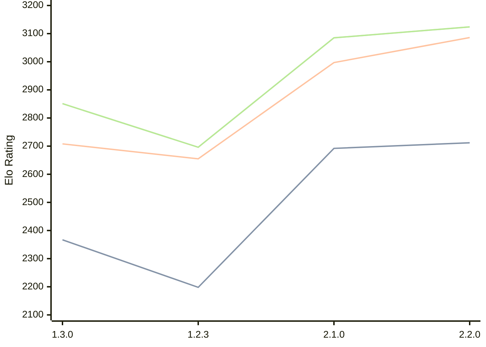

# Engine: Aspen

Author: A. Theofanis

Home: https://github.com/ATheofanis/aspen-chess

## Elo Ratings E1

| Version | Published | STC 8.0+0.08s  | LTC 60.0+0.60s | VLTC 2m24s+1.12s | Comment |
| --- | --- | --- | --- | --- | --- |
| 2.2.0 | 2026-05-22 | 2534 | 2935 | 2975 |  |
 | | | cElo (∆ prev) | cElo (∆ prev) | cElo (∆ prev) | 

## Elo Ratings P1

| Version | Published | STC 8.0+0.08s  | LTC 60.0+0.60s | VLTC 2m24s+1.12s | Comment |
| --- | --- | --- | --- | --- | --- |
| 2.2.0 | 2026-05-22 | 2850 | 3224 | 3272 |  |
 | | | cElo (∆ prev) | cElo (∆ prev) | cElo (∆ prev) | 

## Elo Ratings T1

| Version | Published | STC 8.0+0.08s  | LTC 60.0+0.60s | VLTC 2m24s+1.12s | Comment |
| --- | --- | --- | --- | --- | --- |
| 2.2.0 | 2026-05-22 | 2712(+20) | 3086(+89) | 3124(+39) |  |
| 2.1.0 | 2026-05-21 | 2692(+325) | 2997(+289) | 3085(+234) |  |
| 1.3.0 | 2026-05-20 | 2367(+169) | 2708(+53) | 2851(+155) |  |
| 1.2.3 | 2026-05-20 | 2198 | 2655 | 2696 |  |
 | | | cElo (∆ prev) | cElo (∆ prev) | cElo (∆ prev) | 

<a href="https://github.com/computer-chess-index/cci/issues/new?template=submit-version.yml&title=[VERSION]+Aspen+<version>&body=###%20Engine%20name%0AAspen%0A%0A###%20Version%0A2.2.0" target="_blank">Submit new version</a>

 Test Conditions:

GUI/CLI: <a href=https://github.com/cutechess/cutechess target="_blank">Cute-Chess</a> 
Elo Calculation: <a href=https://www.remi-coulom.fr/Bayesian-Elo/ target="_blank">Bayesian-Elo</a> 
CPU for P1: Intel(R) Core(TM) Ultra 7 265T (1.50 GHz) - P-Core 
CPU for E1: Intel(R) Core(TM) Ultra 7 265T (1.50 GHz) - E-Core 
CPU for T1: Intel(R) Core(TM) i5-7500T 2.70GHz 
Opening book: 8_moves_v3 
\* STC: 8.0+0.08s, LTC: 60.0+0.60s, VLTC: 2m24s+1.12s

 Lists:
Ratings: <a href=https://github.com/computer-chess-index/cci/blob/main/lists/CCIRatings.csv target="_blank">Complete list</a>

Generated: 2026-10-10 04:36:05

## Ratings Verlauf

```mermaid
%%{init: {"theme":"base","themeVariables":{"seriesColors:['#a3a3a3','#222221','#faa371']}}}%%
xychart-beta
  x-axis ["1.3.0", "1.2.3", "2.1.0", "2.2.0"]
  y-axis "Elo Rating" 2100 --> 3200
  line "" [2367, 2198, 2692, 2712]
  line "STC (8.0+0.08s)" [2367, 2198, 2692, 2712]
  line "LTC (60.0+0.60s)" [2708, 2655, 2997, 3086]
  line "" [2851, 2696, 3085, 3124]
  line "VLTC (2m24s+1.12s)" [2851, 2696, 3085, 3124]
```

## Detailed Evaluation Results

| Version | Time Control | Elo  | Range +/- | Matches | Score | Average Opponent Elo | Draws |
| --- | --- | --- | --- | --- | --- | --- | --- |
| 2.2.0 | VLTC (2m24s+1.12s) | 3272 | 44 | 152 | 51% | 3260 | 47% |
| 2.2.0 | VLTC (2m24s+1.12s) | 2975 | 42 | 180 | 51% | 2924 | 39% |
| 2.2.0 | VLTC (2m24s+1.12s) | 3124 | 31 | 278 | 49% | 3129 | 56% |
| 2.2.0 | LTC (60.0+0.60s) | 3224 | 36 | 228 | 47% | 3235 | 46% |
| 2.2.0 | LTC (60.0+0.60s) | 2935 | 31 | 320 | 57% | 2858 | 46% |
| 2.2.0 | LTC (60.0+0.60s) | 3086 | 31 | 278 | 49% | 3092 | 59% |
| 2.2.0 | STC (8.0+0.08s) | 2534 | 34 | 276 | 44% | 2584 | 35% |
| --- | --- | --- | --- | --- | --- | --- | --- |
| 2.2.0 | STC (8.0+0.08s) | 2712 | 29 | 374 | 51% | 2709 | 40% |
| --- | --- | --- | --- | --- | --- | --- | --- |
| 2.2.0 | STC (8.0+0.08s) | 2850 | 44 | 158 | 49% | 2859 | 40% |
| --- | --- | --- | --- | --- | --- | --- | --- |
| 2.1.0 | VLTC (2m24s+1.12s) | 3085 | 31 | 318 | 52% | 3071 | 45% |
| 2.1.0 | LTC (60.0+0.60s) | 2997 | 28 | 382 | 51% | 2989 | 47% |
| 2.1.0 | STC (8.0+0.08s) | 2692 | 32 | 304 | 54% | 2654 | 38% |
| --- | --- | --- | --- | --- | --- | --- | --- |
| 1.3.0 | VLTC (2m24s+1.12s) | 2851 | 59 | 92 | 54% | 2812 | 33% |
| 1.3.0 | LTC (60.0+0.60s) | 2708 | 48 | 140 | 53% | 2678 | 32% |
| 1.3.0 | STC (8.0+0.08s) | 2367 | 47 | 158 | 45% | 2417 | 24% |
| --- | --- | --- | --- | --- | --- | --- | --- |
| 1.2.3 | VLTC (2m24s+1.12s) | 2696 | 111 | 28 | 55% | 2642 | 18% |
| 1.2.3 | LTC (60.0+0.60s) | 2655 | 101 | 36 | 67% | 2499 | 22% |
| 1.2.3 | STC (8.0+0.08s) | 2198 | 84 | 48 | 50% | 2203 | 25% |
| --- | --- | --- | --- | --- | --- | --- | --- |