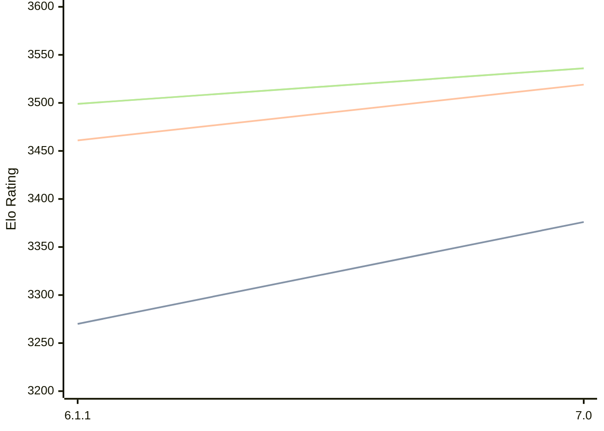

# Engine: Astra

Author: Semih Özalp

Home: https://github.com/h1me01/Astra

## Elo Ratings

| Version | Published | STC 8.0+0.08s  | LTC 60.0+0.60s | VLTC 2m24s+1.12s | Comment |
| --- | --- | --- | --- | --- | --- |
| 7.0 | 2026-05-26 | 3376(+106) | 3519(+58) | 3536(+37) |  |
| 6.1.1 | 2025-07-21 | 3270(+new) | 3461(+new) | 3499(+new) |  |
| 6.1 | 2025-07-20 |  |  |  |  |
| 6.0 | 2025-07-07 |  |  |  |  |
| 5.2 | 2025-05-02 |  |  |  |  |
| 5.1.1 | 2025-04-09 |  |  |  |  |
| 5.1 | 2025-03-16 |  |  |  |  |
| 5.0 | 2025-02-04 |  |  |  |  |
| 4.1 | 2024-12-28 |  |  |  |  |
| 4.0.1 | 2024-11-17 |  |  |  |  |
| 4.0 | 2024-11-17 |  |  |  |  |
| 3.2 | 2024-10-05 |  |  |  |  |
| 3.1 | 2024-10-03 |  |  |  |  |
| 3.0 | 2024-10-01 |  |  |  |  |
 | | | cElo (∆ prev) | cElo (∆ prev) | cElo (∆ prev) | 

<a href="https://github.com/computer-chess-index/cci/issues/new?template=submit-version.yml&title=[VERSION]+Astra+<version>&body=###%20Engine%20name%0AAstra%0A%0A###%20Version%0A7.0" target="_blank">Submit new version</a>

 Test Conditions:

GUI/CLI: <a href=https://github.com/cutechess/cutechess target="_blank">Cute-Chess</a> 
Elo Calculation: <a href=https://www.remi-coulom.fr/Bayesian-Elo/ target="_blank">Bayesian-Elo</a> 
CPU: Intel(R) Core(TM) i5-7500T 2.70GHz 
Opening book: 8_moves_v3 
\* STC: 8.0+0.08s, LTC: 60.0+0.60s, VLTC: 2m24s+1.12s

 Lists:
Ratings: <a href=https://github.com/computer-chess-index/cci/blob/main/lists/CCIRatings.csv target="_blank">Complete list</a>

Generated: 2026-07-21 06:22:57

## Ratings Verlauf

⬛ STC (8.0+0.08s) &nbsp;&nbsp; 🟧 LTC (60.0+0.60s) &nbsp;&nbsp; 🟩 VLTC (2m24s+1.12s)

dark mode: 🟩STC (8.0+0.08s) 🟧LTC (60.0+0.60s) ⬜VLTC (2m24s+1.12s)

## Detailed Evaluation Results

| Version | Time Control | Elo  | Range +/- | Matches | Score | Average Opponent Elo | Draws |
| --- | --- | --- | --- | --- | --- | --- | --- |
| 7.0 | VLTC (2m24s+1.12s) | 3536 | 31 | 236 | 49% | 3544 | 90% |
| 7.0 | LTC (60.0+0.60s) | 3519 | 33 | 206 | 50% | 3522 | 88% |
| 7.0 | STC (8.0+0.08s) | 3376 | 32 | 230 | 49% | 3380 | 79% |
| --- | --- | --- | --- | --- | --- | --- | --- |
| 6.1.1 | VLTC (2m24s+1.12s) | 3499 | 23 | 420 | 52% | 3483 | 87% |
| 6.1.1 | LTC (60.0+0.60s) | 3461 | 25 | 400 | 51% | 3449 | 81% |
| 6.1.1 | STC (8.0+0.08s) | 3270 | 23 | 514 | 51% | 3254 | 67% |
| --- | --- | --- | --- | --- | --- | --- | --- |