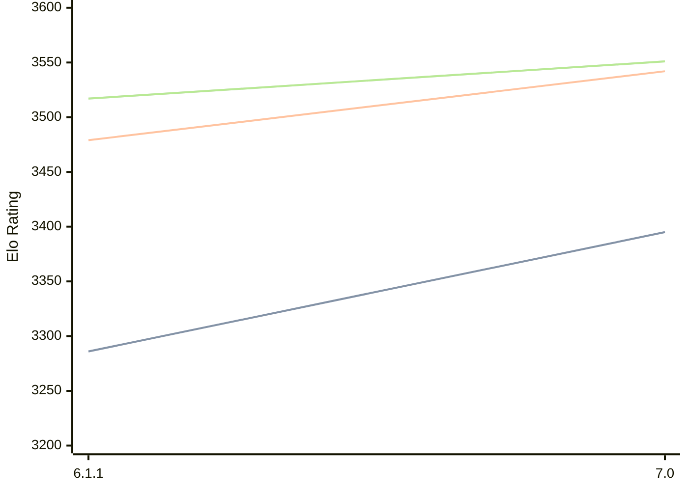

# Engine: Astra

Author: Semih Özalp

Home: https://github.com/h1me01/Astra

## Elo Ratings

| Version | Published | STC 8.0+0.08s  | LTC 60.0+0.60s | VLTC 2m24s+1.12s | Comment |
| --- | --- | --- | --- | --- | --- |
| 7.0 | 2026-05-26 | 3395(+109) | 3542(+63) | 3551(+34) |  |
| 6.1.1 | 2025-07-21 | 3286 | 3479 | 3517 |  |
 | | | cElo (∆ prev) | cElo (∆ prev) | cElo (∆ prev) | 

<a href="https://github.com/computer-chess-index/cci/issues/new?template=submit-version.yml&title=[VERSION]+Astra+<version>&body=###%20Engine%20name%0AAstra%0A%0A###%20Version%0A7.0" target="_blank">Submit new version</a>

 Test Conditions:

GUI/CLI: <a href=https://github.com/cutechess/cutechess target="_blank">Cute-Chess</a> 
Elo Calculation: <a href=https://www.remi-coulom.fr/Bayesian-Elo/ target="_blank">Bayesian-Elo</a> 
CPU: Intel(R) Core(TM) i5-7500T 2.70GHz 
Opening book: 8_moves_v3 
\* STC: 8.0+0.08s, LTC: 60.0+0.60s, VLTC: 2m24s+1.12s

 Lists:
Ratings: <a href=https://github.com/computer-chess-index/cci/blob/main/lists/CCIRatings.csv target="_blank">Complete list</a>

Generated: 2026-09-11 04:36:00

## Ratings Verlauf

## Detailed Evaluation Results

| Version | Time Control | Elo  | Range +/- | Matches | Score | Average Opponent Elo | Draws |
| --- | --- | --- | --- | --- | --- | --- | --- |
| 7.0 | VLTC (2m24s+1.12s) | 3551 | 28 | 292 | 48% | 3560 | 89% |
| 7.0 | LTC (60.0+0.60s) | 3542 | 29 | 276 | 51% | 3537 | 87% |
| 7.0 | STC (8.0+0.08s) | 3395 | 25 | 374 | 50% | 3394 | 76% |
| --- | --- | --- | --- | --- | --- | --- | --- |
| 6.1.1 | VLTC (2m24s+1.12s) | 3517 | 23 | 420 | 52% | 3501 | 87% |
| 6.1.1 | LTC (60.0+0.60s) | 3479 | 25 | 400 | 51% | 3467 | 81% |
| 6.1.1 | STC (8.0+0.08s) | 3286 | 23 | 514 | 51% | 3271 | 67% |
| --- | --- | --- | --- | --- | --- | --- | --- |