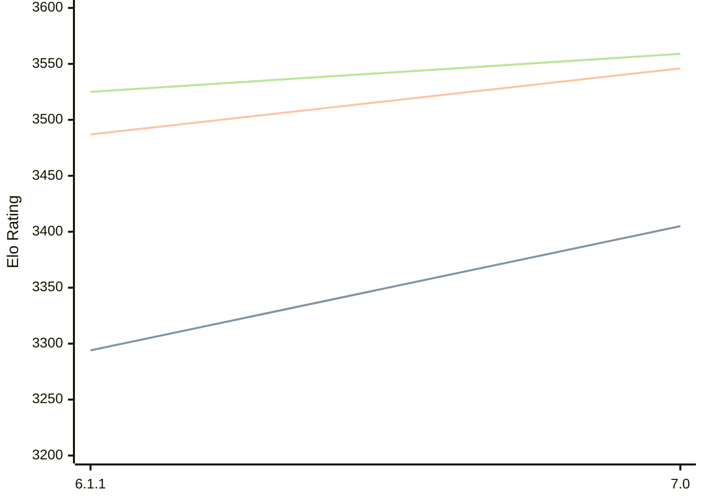

# Engine: Astra

Author: Semih Özalp

Home: https://github.com/h1me01/Astra

## Elo Ratings E1

| Version | Published | STC 8.0+0.08s  | LTC 60.0+0.60s | VLTC 2m24s+1.12s | Comment |
| --- | --- | --- | --- | --- | --- |
| 7.0 | 2026-05-26 | 3297 | 3530 | 3586 |  |
 | | | cElo (∆ prev) | cElo (∆ prev) | cElo (∆ prev) | 

## Elo Ratings P1

| Version | Published | STC 8.0+0.08s  | LTC 60.0+0.60s | VLTC 2m24s+1.12s | Comment |
| --- | --- | --- | --- | --- | --- |
| 7.0 | 2026-05-26 | 3586 | 3754 | 3858 |  |
 | | | cElo (∆ prev) | cElo (∆ prev) | cElo (∆ prev) | 

## Elo Ratings T1

| Version | Published | STC 8.0+0.08s  | LTC 60.0+0.60s | VLTC 2m24s+1.12s | Comment |
| --- | --- | --- | --- | --- | --- |
| 7.0 | 2026-05-26 | 3405(+111) | 3546(+59) | 3559(+34) |  |
| 6.1.1 | 2025-07-21 | 3294 | 3487 | 3525 |  |
 | | | cElo (∆ prev) | cElo (∆ prev) | cElo (∆ prev) | 

<a href="https://github.com/computer-chess-index/cci/issues/new?template=submit-version.yml&title=[VERSION]+Astra+<version>&body=###%20Engine%20name%0AAstra%0A%0A###%20Version%0A7.0" target="_blank">Submit new version</a>

 Test Conditions:

GUI/CLI: <a href=https://github.com/cutechess/cutechess target="_blank">Cute-Chess</a> 
Elo Calculation: <a href=https://www.remi-coulom.fr/Bayesian-Elo/ target="_blank">Bayesian-Elo</a> 
CPU for P1: Intel(R) Core(TM) Ultra 7 265T (1.50 GHz) - P-Core 
CPU for E1: Intel(R) Core(TM) Ultra 7 265T (1.50 GHz) - E-Core 
CPU for T1: Intel(R) Core(TM) i5-7500T 2.70GHz 
Opening book: 8_moves_v3 
\* STC: 8.0+0.08s, LTC: 60.0+0.60s, VLTC: 2m24s+1.12s

 Lists:
Ratings: <a href=https://github.com/computer-chess-index/cci/blob/main/lists/CCIRatings.csv target="_blank">Complete list</a>

Generated: 2026-10-10 04:36:08

## Ratings Verlauf

```mermaid
%%{init: {"theme":"base","themeVariables":{"seriesColors:['#a3a3a3','#222221','#faa371']}}}%%
xychart-beta
  x-axis ["6.1.1", "7.0"]
  y-axis "Elo Rating" 3200 --> 3600
  line "" [3294, 3405]
  line "STC (8.0+0.08s)" [3294, 3405]
  line "LTC (60.0+0.60s)" [3487, 3546]
  line "" [3525, 3559]
  line "VLTC (2m24s+1.12s)" [3525, 3559]
```

## Detailed Evaluation Results

| Version | Time Control | Elo  | Range +/- | Matches | Score | Average Opponent Elo | Draws |
| --- | --- | --- | --- | --- | --- | --- | --- |
| 7.0 | VLTC (2m24s+1.12s) | 3858 | 67 | 60 | 58% | 3686 | 70% |
| 7.0 | VLTC (2m24s+1.12s) | 3586 | 39 | 184 | 61% | 3391 | 67% |
| 7.0 | VLTC (2m24s+1.12s) | 3559 | 27 | 312 | 49% | 3567 | 89% |
| 7.0 | LTC (60.0+0.60s) | 3754 | 49 | 114 | 62% | 3626 | 66% |
| 7.0 | LTC (60.0+0.60s) | 3530 | 41 | 184 | 64% | 3267 | 61% |
| 7.0 | LTC (60.0+0.60s) | 3546 | 28 | 294 | 50% | 3545 | 86% |
| 7.0 | STC (8.0+0.08s) | 3586 | 38 | 176 | 50% | 3586 | 72% |
| --- | --- | --- | --- | --- | --- | --- | --- |
| 7.0 | STC (8.0+0.08s) | 3297 | 31 | 268 | 44% | 3339 | 65% |
| --- | --- | --- | --- | --- | --- | --- | --- |
| 7.0 | STC (8.0+0.08s) | 3405 | 25 | 398 | 51% | 3401 | 75% |
| --- | --- | --- | --- | --- | --- | --- | --- |
| 6.1.1 | VLTC (2m24s+1.12s) | 3525 | 23 | 420 | 52% | 3509 | 87% |
| 6.1.1 | LTC (60.0+0.60s) | 3487 | 25 | 400 | 51% | 3475 | 81% |
| 6.1.1 | STC (8.0+0.08s) | 3294 | 23 | 514 | 51% | 3278 | 67% |
| --- | --- | --- | --- | --- | --- | --- | --- |