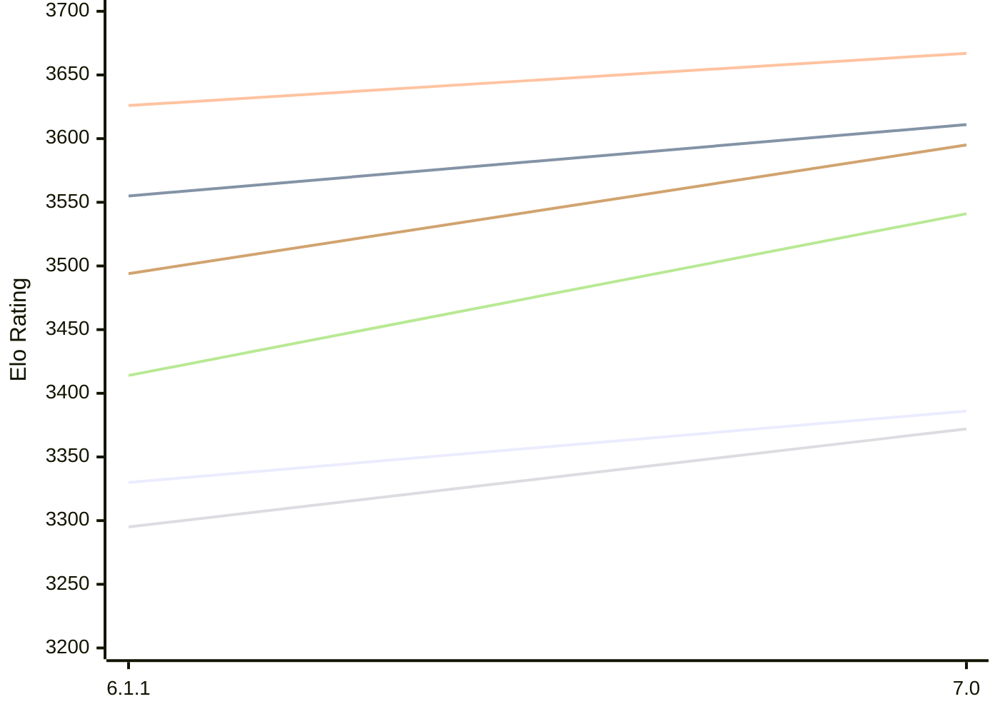
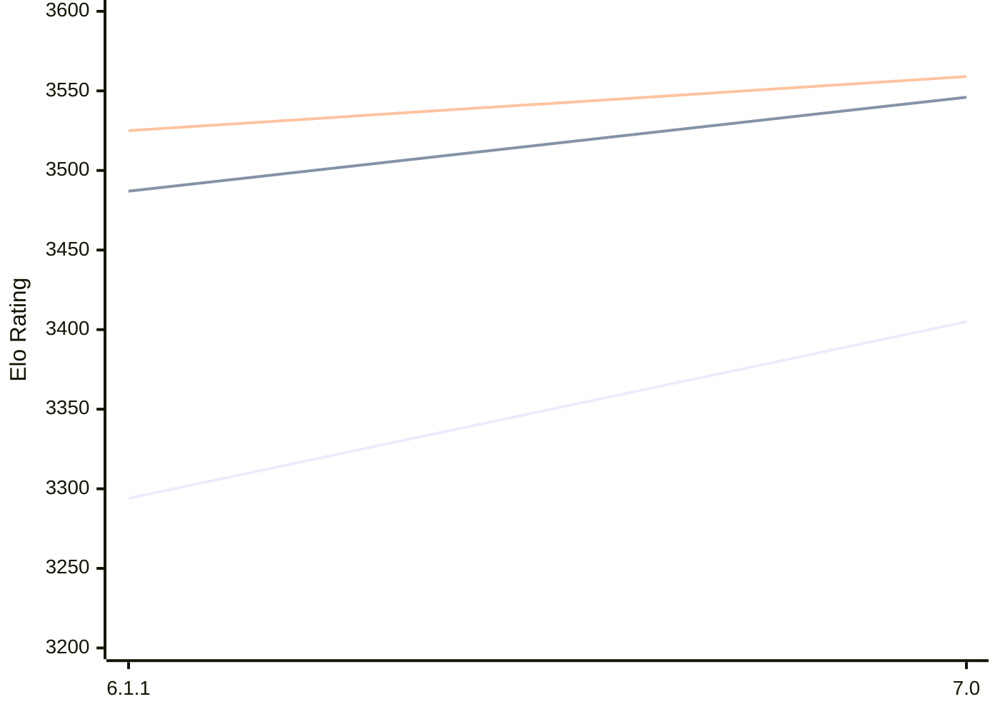

# Engine: Astra

Author: Semih Özalp

Home: https://github.com/h1me01/Astra

## Elo Ratings E1 (Ultra 7 265T (1.50 GHz) - E-Core)

| Version | Published | STC 8.0+0.08s  | LTC 60.0+0.60s | VLTC 2m24s+1.12s | Comment |
| --- | --- | --- | --- | --- | --- |
| 7.0 | 2026-05-26 | 3386(+56) | 3611(+56) | 3667(+41) |  |
| 6.1.1 | 2025-07-21 | 3330 | 3555 | 3626 |  |
 | | | cElo (∆ prev) | cElo (∆ prev) | cElo (∆ prev) | 

## Elo Ratings P1 (Ultra 7 265T (1.50 GHz) - P-Core)

| Version | Published | STC 8.0+0.08s  | LTC 60.0+0.60s | VLTC 2m24s+1.12s | Comment |
| --- | --- | --- | --- | --- | --- |
| 7.0 | 2026-05-26 | 3372(+77) | 3541(+127) | 3595(+101) |  |
| 6.1.1 | 2025-07-21 | 3295 | 3414 | 3494 |  |
 | | | cElo (∆ prev) | cElo (∆ prev) | cElo (∆ prev) | 

## Elo Ratings T1 (i5-7500T 2.70GHz)

| Version | Published | STC 8.0+0.08s  | LTC 60.0+0.60s | VLTC 2m24s+1.12s | Comment |
| --- | --- | --- | --- | --- | --- |
| 7.0 | 2026-05-26 | 3405(+111) | 3546(+59) | 3559(+34) |  |
| 6.1.1 | 2025-07-21 | 3294 | 3487 | 3525 |  |
 | | | cElo (∆ prev) | cElo (∆ prev) | cElo (∆ prev) | 

<a href="https://github.com/computer-chess-index/cci/issues/new?template=submit-version.yml&title=[VERSION]+Astra+<version>&body=###%20Engine%20name%0AAstra%0A%0A###%20Version%0A7.0" target="_blank">Submit new version</a>

 Test Conditions:

GUI/CLI: <a href=https://github.com/cutechess/cutechess target="_blank">Cute-Chess</a> 
Elo Calculation: <a href=https://www.remi-coulom.fr/Bayesian-Elo/ target="_blank">Bayesian-Elo</a> 
CPU for P1: Intel(R) Core(TM) Ultra 7 265T (1.50 GHz) - P-Core 
CPU for E1: Intel(R) Core(TM) Ultra 7 265T (1.50 GHz) - E-Core 
CPU for T1: Intel(R) Core(TM) i5-7500T 2.70GHz 
Opening book: 8_moves_v3 
\* STC: 8.0+0.08s, LTC: 60.0+0.60s, VLTC: 2m24s+1.12s

 Lists:
Ratings: <a href=https://github.com/computer-chess-index/cci/blob/main/lists/CCIRatings.csv target="_blank">Complete list</a>

Generated: 2026-11-16 05:36:10

## Ratings Verlauf E1 / P1

```mermaid
%%{init: {"theme":"base","themeVariables":{"seriesColors:['#a3a3a3','#222221','#faa371']}}}%%
xychart-beta
  x-axis ["6.1.1", "7.0"]
  y-axis "Elo Rating" 3200 --> 3700
  line "E1: STC (8.0+0.08s)" [3330, 3386]
  line "E1: LTC (60.0+0.60s)" [3555, 3611]
  line "E1: VLTC (2m24s+1.12s)" [3626, 3667]
  line "P1: STC (8.0+0.08s)" [3295, 3372]
  line "P1: LTC (60.0+0.60s)" [3414, 3541]
  line "P1: VLTC (2m24s+1.12s)" [3494, 3595]
```

## Ratings Verlauf T1

```mermaid
%%{init: {"theme":"base","themeVariables":{"seriesColors:['#a3a3a3','#222221','#faa371']}}}%%
xychart-beta
  x-axis ["6.1.1", "7.0"]
  y-axis "Elo Rating" 3200 --> 3600
  line "T1: STC (8.0+0.08s)" [3294, 3405]
  line "T1: LTC (60.0+0.60s)" [3487, 3546]
  line "T1: VLTC (2m24s+1.12s)" [3525, 3559]
```

## Detailed Evaluation Results

| Version | Time Control | Variant | Elo  | Range +/- | Matches | Score | Average Opponent Elo | Draws |
| --- | --- |--- | --- | --- | --- | --- | --- | --- |
| 7.0 | VLTC (2m24s+1.12s) | T1 | 3559 | 27 | 312 | 49% | 3567 | 89% |
|  |  | P1 | 3595 | 36 | 188 | 50% | 3561 | 82% |
|  |  | E1 | 3667 | 32 | 264 | 57% | 3533 | 72% |
|  | LTC (60.0+0.60s) | T1 | 3546 | 28 | 294 | 50% | 3545 | 86% |
|  |  | P1 | 3541 | 39 | 174 | 58% | 3455 | 72% |
|  |  | E1 | 3611 | 32 | 268 | 59% | 3430 | 70% |
|  | STC (8.0+0.08s) | T1 | 3405 | 25 | 398 | 51% | 3401 | 75% |
|  |  | P1 | 3372 | 31 | 256 | 51% | 3366 | 74% |
|  |  | E1 | 3386 | 23 | 472 | 48% | 3402 | 67% |
| --- | --- |--- | --- | --- | --- | --- | --- | --- |
| 6.1.1 | VLTC (2m24s+1.12s) | T1 | 3525 | 23 | 420 | 52% | 3509 | 87% |
|  |  | P1 | 3494 | 130 | 20 | 75% | 3197 | 50% |
|  |  | E1 | 3626 | 79 | 48 | 61% | 3416 | 60% |
|  | LTC (60.0+0.60s) | T1 | 3487 | 25 | 400 | 51% | 3475 | 81% |
|  |  | P1 | 3414 | 120 | 28 | 80% | 3105 | 32% |
|  |  | E1 | 3555 | 72 | 58 | 60% | 3409 | 55% |
|  | STC (8.0+0.08s) | T1 | 3294 | 23 | 514 | 51% | 3278 | 67% |
|  |  | P1 | 3295 | 96 | 32 | 56% | 3220 | 50% |
|  |  | E1 | 3330 | 64 | 74 | 56% | 3175 | 50% |