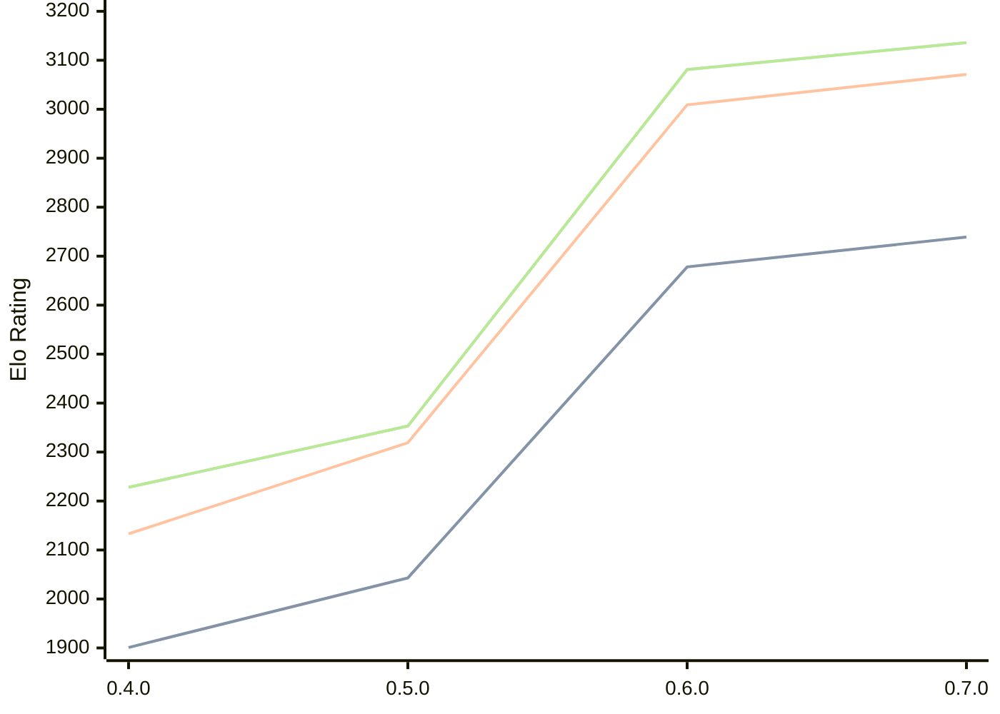

# Engine: AteNika

Author: Yevhenii Sekhin

Home: https://github.com/LesterEvSe/AteNika

## Elo Ratings

| Version | Published | STC 8.0+0.08s  | LTC 60.0+0.60s | VLTC 2m24s+1.12s | Comment |
| --- | --- | --- | --- | --- | --- |
| 0.7.0 | 2026-09-20 | 2739(+61) | 3071(+62) | 3136(+55) |  |
| 0.6.0 | 2026-09-13 | 2678(+635) | 3009(+690) | 3081(+728) |  |
| 0.5.0 | 2026-09-02 | 2043(+142) | 2319(+186) | 2353(+125) |  |
| 0.4.0 | 2026-08-30 | 1901 | 2133 | 2228 |  |
 | | | cElo (∆ prev) | cElo (∆ prev) | cElo (∆ prev) | 

<a href="https://github.com/computer-chess-index/cci/issues/new?template=submit-version.yml&title=[VERSION]+AteNika+<version>&body=###%20Engine%20name%0AAteNika%0A%0A###%20Version%0A0.7.0" target="_blank">Submit new version</a>

 Test Conditions:

GUI/CLI: <a href=https://github.com/cutechess/cutechess target="_blank">Cute-Chess</a> 
Elo Calculation: <a href=https://www.remi-coulom.fr/Bayesian-Elo/ target="_blank">Bayesian-Elo</a> 
CPU: Intel(R) Core(TM) i5-7500T 2.70GHz 
Opening book: 8_moves_v3 
\* STC: 8.0+0.08s, LTC: 60.0+0.60s, VLTC: 2m24s+1.12s

 Lists:
Ratings: <a href=https://github.com/computer-chess-index/cci/blob/main/lists/CCIRatings.csv target="_blank">Complete list</a>

Generated: 2026-09-25 04:36:08

## Ratings Verlauf

## Detailed Evaluation Results

| Version | Time Control | Elo  | Range +/- | Matches | Score | Average Opponent Elo | Draws |
| --- | --- | --- | --- | --- | --- | --- | --- |
| 0.7.0 | VLTC (2m24s+1.12s) | 3136 | 54 | 96 | 46% | 3170 | 55% |
| 0.7.0 | LTC (60.0+0.60s) | 3071 | 43 | 150 | 51% | 3062 | 55% |
| 0.7.0 | STC (8.0+0.08s) | 2739 | 54 | 106 | 53% | 2714 | 38% |
| --- | --- | --- | --- | --- | --- | --- | --- |
| 0.6.0 | VLTC (2m24s+1.12s) | 3081 | 36 | 230 | 55% | 3032 | 48% |
| 0.6.0 | LTC (60.0+0.60s) | 3009 | 36 | 222 | 53% | 2977 | 52% |
| 0.6.0 | STC (8.0+0.08s) | 2678 | 45 | 158 | 53% | 2642 | 37% |
| --- | --- | --- | --- | --- | --- | --- | --- |
| 0.5.0 | VLTC (2m24s+1.12s) | 2353 | 36 | 262 | 50% | 2356 | 26% |
| 0.5.0 | LTC (60.0+0.60s) | 2319 | 42 | 202 | 52% | 2300 | 21% |
| 0.5.0 | STC (8.0+0.08s) | 2043 | 36 | 270 | 49% | 2059 | 21% |
| --- | --- | --- | --- | --- | --- | --- | --- |
| 0.4.0 | VLTC (2m24s+1.12s) | 2228 | 38 | 248 | 48% | 2249 | 23% |
| 0.4.0 | LTC (60.0+0.60s) | 2133 | 40 | 230 | 50% | 2137 | 15% |
| 0.4.0 | STC (8.0+0.08s) | 1901 | 38 | 248 | 50% | 1899 | 16% |
| --- | --- | --- | --- | --- | --- | --- | --- |