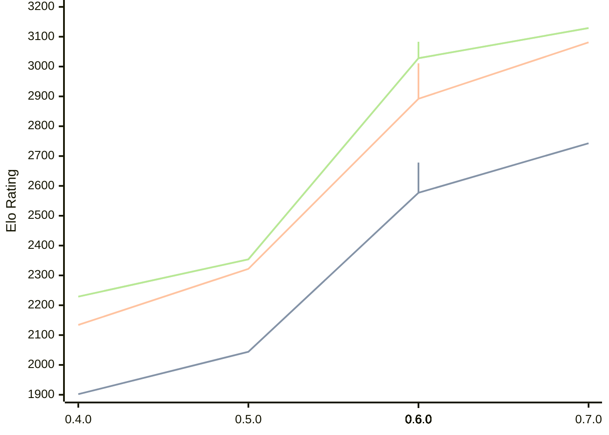

# Engine: AteNika

Author: Yevhenii Sekhin

Home: https://github.com/LesterEvSe/AteNika

## Elo Ratings

| Version | Published | STC 8.0+0.08s  | LTC 60.0+0.60s | VLTC 2m24s+1.12s | Comment |
| --- | --- | --- | --- | --- | --- |
| 0.7.0 | 2026-09-20 |  |  |  |  |
| 0.7.0 | 2026-09-20 |  |  |  |  |
| 0.7.0 | 2026-09-20 |  |  |  |  |
| 0.7.0 | 2026-09-20 |  |  |  |  |
| 0.7.0 | 2026-09-20 |  |  |  |  |
| 0.7.0 | 2026-09-20 |  |  |  |  |
| 0.7.0 | 2026-09-20 |  |  |  |  |
| 0.7.0 | 2026-09-20 |  |  |  |  |
| 0.7.0 | 2026-09-20 |  |  |  |  |
| 0.7.0 | 2026-09-20 |  |  |  |  |
| 0.7.0 | 2026-09-20 |  |  |  |  |
| 0.7.0 | 2026-09-20 |  |  |  |  |
| 0.7.0 | 2026-09-20 |  |  |  |  |
| 0.7.0 | 2026-09-20 |  |  |  |  |
| 0.7.0 | 2026-09-20 |  |  |  |  |
| 0.7.0 | 2026-09-20 |  |  |  |  |
| 0.7.0 | 2026-09-20 |  |  |  |  |
| 0.7.0 | 2026-09-20 |  |  |  |  |
| 0.7.0 | 2026-09-20 |  |  |  |  |
| 0.7.0 | 2026-09-20 |  |  |  |  |
| 0.7.0 | 2026-09-20 |  |  |  |  |
| 0.7.0 | 2026-09-20 |  |  |  |  |
| 0.7.0 | 2026-09-20 |  |  |  |  |
| 0.7.0 | 2026-09-20 |  |  |  |  |
| 0.7.0 | 2026-09-20 |  |  |  |  |
| 0.7.0 | 2026-09-20 |  |  |  |  |
| 0.7.0 | 2026-09-20 |  |  |  |  |
| 0.7.0 | 2026-09-20 |  |  |  |  |
| 0.7.0 | 2026-09-20 |  |  |  |  |
| 0.7.0 | 2026-09-20 |  |  |  |  |
| 0.7.0 | 2026-09-20 |  |  |  |  |
| 0.7.0 | 2026-09-20 |  |  |  |  |
| 0.7.0 | 2026-09-20 |  |  |  |  |
| 0.7.0 | 2026-09-20 |  |  |  |  |
| 0.7.0 | 2026-09-20 |  |  |  |  |
| 0.7.0 | 2026-09-20 |  |  |  |  |
| 0.7.0 | 2026-09-20 |  |  |  |  |
| 0.7.0 | 2026-09-20 |  |  |  |  |
| 0.7.0 | 2026-09-20 |  |  |  |  |
| 0.7.0 | 2026-09-20 |  |  |  |  |
| 0.7.0 | 2026-09-20 |  |  |  |  |
| 0.7.0 | 2026-09-20 |  |  |  |  |
| 0.7.0 | 2026-09-20 |  |  |  |  |
| 0.7.0 | 2026-09-20 |  |  |  |  |
| 0.7.0 | 2026-09-20 |  |  |  |  |
| 0.7.0 | 2026-09-20 |  |  |  |  |
| 0.7.0 | 2026-09-20 |  |  |  |  |
| 0.7.0 | 2026-09-20 |  |  |  |  |
| 0.7.0 | 2026-09-20 |  |  |  |  |
| 0.7.0 | 2026-09-20 |  |  |  |  |
| 0.7.0 | 2026-09-20 |  |  |  |  |
| 0.7.0 | 2026-09-20 |  |  |  |  |
| 0.7.0 | 2026-09-20 |  |  |  |  |
| 0.7.0 | 2026-09-20 |  |  |  |  |
| 0.7.0 | 2026-09-20 |  |  |  |  |
| 0.7.0 | 2026-09-20 |  |  |  |  |
| 0.7.0 | 2026-09-20 |  |  |  |  |
| 0.7.0 | 2026-09-20 |  |  |  |  |
| 0.7.0 | 2026-09-20 |  |  |  |  |
| 0.7.0 | 2026-09-20 |  |  |  |  |
| 0.7.0 | 2026-09-20 |  |  |  |  |
| 0.7.0 | 2026-09-20 |  |  |  |  |
| 0.7.0 | 2026-09-20 |  |  |  |  |
| 0.7.0 | 2026-09-20 |  |  |  |  |
| 0.7.0 | 2026-09-20 |  |  |  |  |
| 0.7.0 | 2026-09-20 |  |  |  |  |
| 0.7.0 | 2026-09-20 |  |  |  |  |
| 0.7.0 | 2026-09-20 |  |  |  |  |
| 0.7.0 | 2026-09-20 |  |  |  |  |
| 0.7.0 | 2026-09-20 |  |  |  |  |
| 0.7.0 | 2026-09-20 |  |  |  |  |
| 0.7.0 | 2026-09-20 |  |  |  |  |
| 0.7.0 | 2026-09-20 |  |  |  |  |
| 0.7.0 | 2026-09-20 |  |  |  |  |
| 0.7.0 | 2026-09-20 |  |  |  |  |
| 0.7.0 | 2026-09-20 |  |  |  |  |
| 0.7.0 | 2026-09-20 |  |  |  |  |
| 0.7.0 | 2026-09-20 |  |  |  |  |
| 0.7.0 | 2026-09-20 |  |  |  |  |
| 0.7.0 | 2026-09-20 |  |  |  |  |
| 0.7.0 | 2026-09-20 |  |  |  |  |
| 0.7.0 | 2026-09-20 |  |  |  |  |
| 0.7.0 | 2026-09-20 |  |  |  |  |
| 0.7.0 | 2026-09-20 |  |  |  |  |
| 0.7.0 | 2026-09-20 |  |  |  |  |
| 0.7.0 | 2026-09-20 |  |  |  |  |
| 0.7.0 | 2026-09-20 |  |  |  |  |
| 0.7.0 | 2026-09-20 |  |  |  |  |
| 0.7.0 | 2026-09-20 |  |  |  |  |
| 0.7.0 | 2026-09-20 |  |  |  |  |
| 0.7.0 | 2026-09-20 |  |  |  |  |
| 0.7.0 | 2026-09-20 |  |  |  |  |
| 0.7.0 | 2026-09-20 |  |  |  |  |
| 0.7.0 | 2026-09-20 |  |  |  |  |
| 0.7.0 | 2026-09-20 |  |  |  |  |
| 0.7.0 | 2026-09-20 |  |  |  |  |
| 0.7.0 | 2026-09-20 |  |  |  |  |
| 0.7.0 | 2026-09-20 |  |  |  |  |
| 0.7.0 | 2026-09-20 |  |  |  |  |
| 0.7.0 | 2026-09-20 |  |  |  |  |
| 0.7.0 | 2026-09-20 |  |  |  |  |
| 0.7.0 | 2026-09-20 |  |  |  |  |
| 0.7.0 | 2026-09-20 |  |  |  |  |
| 0.7.0 | 2026-09-20 |  |  |  |  |
| 0.7.0 | 2026-09-20 |  |  |  |  |
| 0.7.0 | 2026-09-20 |  |  |  |  |
| 0.7.0 | 2026-09-20 |  |  |  |  |
| 0.7.0 | 2026-09-20 |  |  |  |  |
| 0.7.0 | 2026-09-20 |  |  |  |  |
| 0.7.0 | 2026-09-20 |  |  |  |  |
| 0.7.0 | 2026-09-20 |  |  |  |  |
| 0.7.0 | 2026-09-20 |  |  |  |  |
| 0.7.0 | 2026-09-20 |  |  |  |  |
| 0.7.0 | 2026-09-20 |  |  |  |  |
| 0.7.0 | 2026-09-20 |  |  |  |  |
| 0.7.0 | 2026-09-20 |  |  |  |  |
| 0.7.0 | 2026-09-20 |  |  |  |  |
| 0.7.0 | 2026-09-20 |  |  |  |  |
| 0.7.0 | 2026-09-20 |  |  |  |  |
| 0.7.0 | 2026-09-20 |  |  |  |  |
| 0.7.0 | 2026-09-20 |  |  |  |  |
| 0.7.0 | 2026-09-20 |  |  |  |  |
| 0.7.0 | 2026-09-20 |  |  |  |  |
| 0.7.0 | 2026-09-20 |  |  |  |  |
| 0.7.0 | 2026-09-20 |  |  |  |  |
| 0.7.0 | 2026-09-20 |  |  |  |  |
| 0.7.0 | 2026-09-20 |  |  |  |  |
| 0.7.0 | 2026-09-20 |  |  |  |  |
| 0.7.0 | 2026-09-20 |  |  |  |  |
| 0.7.0 | 2026-09-20 |  |  |  |  |
| 0.7.0 | 2026-09-20 |  |  |  |  |
| 0.7.0 | 2026-09-20 |  |  |  |  |
| 0.7.0 | 2026-09-20 |  |  |  |  |
| 0.7.0 | 2026-09-20 |  |  |  |  |
| 0.7.0 | 2026-09-20 |  |  |  |  |
| 0.7.0 | 2026-09-20 |  |  |  |  |
| 0.7.0 | 2026-09-20 |  |  |  |  |
| 0.7.0 | 2026-09-20 |  |  |  |  |
| 0.7.0 | 2026-09-20 |  |  |  |  |
| 0.7.0 | 2026-09-20 |  |  |  |  |
| 0.7.0 | 2026-09-20 |  |  |  |  |
| 0.7.0 | 2026-09-20 |  |  |  |  |
| 0.7.0 | 2026-09-20 |  |  |  |  |
| 0.7.0 | 2026-09-20 |  |  |  |  |
| 0.7.0 | 2026-09-20 |  |  |  |  |
| 0.7.0 | 2026-09-20 |  |  |  |  |
| 0.7.0 | 2026-09-20 |  |  |  |  |
| 0.7.0 | 2026-09-20 |  |  |  |  |
| 0.7.0 | 2026-09-20 |  |  |  |  |
| 0.7.0 | 2026-09-20 |  |  |  |  |
| 0.7.0 | 2026-09-20 |  |  |  |  |
| 0.7.0 | 2026-09-20 |  |  |  |  |
| 0.7.0 | 2026-09-20 |  |  |  |  |
| 0.7.0 | 2026-09-20 |  |  |  |  |
| 0.7.0 | 2026-09-20 |  |  |  |  |
| 0.7.0 | 2026-09-20 |  |  |  |  |
| 0.7.0 | 2026-09-20 |  |  |  |  |
| 0.7.0 | 2026-09-20 |  |  |  |  |
| 0.7.0 | 2026-09-20 |  |  |  |  |
| 0.7.0 | 2026-09-20 |  |  |  |  |
| 0.7.0 | 2026-09-20 |  |  |  |  |
| 0.7.0 | 2026-09-20 |  |  |  |  |
| 0.7.0 | 2026-09-20 |  |  |  |  |
| 0.7.0 | 2026-09-20 |  |  |  |  |
| 0.7.0 | 2026-09-20 |  |  |  |  |
| 0.7.0 | 2026-09-20 |  |  |  |  |
| 0.7.0 | 2026-09-20 |  |  |  |  |
| 0.7.0 | 2026-09-20 |  |  |  |  |
| 0.7.0 | 2026-09-20 |  |  |  |  |
| 0.7.0 | 2026-09-20 |  |  |  |  |
| 0.7.0 | 2026-09-20 |  |  |  |  |
| 0.7.0 | 2026-09-20 |  |  |  |  |
| 0.7.0 | 2026-09-20 |  |  |  |  |
| 0.7.0 | 2026-09-20 |  |  |  |  |
| 0.7.0 | 2026-09-20 |  |  |  |  |
| 0.7.0 | 2026-09-20 |  |  |  |  |
| 0.7.0 | 2026-09-20 |  |  |  |  |
| 0.7.0 | 2026-09-20 |  |  |  |  |
| 0.7.0 | 2026-09-20 |  |  |  |  |
| 0.7.0 | 2026-09-20 |  |  |  |  |
| 0.7.0 | 2026-09-20 |  |  |  |  |
| 0.7.0 | 2026-09-20 |  |  |  |  |
| 0.7.0 | 2026-09-20 |  |  |  |  |
| 0.7.0 | 2026-09-20 |  |  |  |  |
| 0.7.0 | 2026-09-20 |  |  |  |  |
| 0.7.0 | 2026-09-20 |  |  |  |  |
| 0.7.0 | 2026-09-20 |  |  |  |  |
| 0.7.0 | 2026-09-20 |  |  |  |  |
| 0.7.0 | 2026-09-20 |  |  |  |  |
| 0.7.0 | 2026-09-20 |  |  |  |  |
| 0.7.0 | 2026-09-20 |  |  |  |  |
| 0.7.0 | 2026-09-20 |  |  |  |  |
| 0.7.0 | 2026-09-20 |  |  |  |  |
| 0.7.0 | 2026-09-20 |  |  |  |  |
| 0.7.0 | 2026-09-20 |  |  |  |  |
| 0.7.0 | 2026-09-20 |  |  |  |  |
| 0.7.0 | 2026-09-20 |  |  |  |  |
| 0.7.0 | 2026-09-20 |  |  |  |  |
| 0.7.0 | 2026-09-20 |  |  |  |  |
| 0.7.0 | 2026-09-20 |  |  |  |  |
| 0.7.0 | 2026-09-20 |  |  |  |  |
| 0.7.0 | 2026-09-20 |  |  |  |  |
| 0.7.0 | 2026-09-20 |  |  |  |  |
| 0.7.0 | 2026-09-20 |  |  |  |  |
| 0.7.0 | 2026-09-20 |  |  |  |  |
| 0.7.0 | 2026-09-20 |  |  |  |  |
| 0.7.0 | 2026-09-20 |  |  |  |  |
| 0.7.0 | 2026-09-20 |  |  |  |  |
| 0.7.0 | 2026-09-20 |  |  |  |  |
| 0.7.0 | 2026-09-20 |  |  |  |  |
| 0.7.0 | 2026-09-20 |  |  |  |  |
| 0.7.0 | 2026-09-20 |  |  |  |  |
| 0.7.0 | 2026-09-20 |  |  |  |  |
| 0.7.0 | 2026-09-20 |  |  |  |  |
| 0.7.0 | 2026-09-20 |  |  |  |  |
| 0.7.0 | 2026-09-20 |  |  |  |  |
| 0.7.0 | 2026-09-20 |  |  |  |  |
| 0.7.0 | 2026-09-20 |  |  |  |  |
| 0.7.0 | 2026-09-20 |  |  |  |  |
| 0.7.0 | 2026-09-20 |  |  |  |  |
| 0.7.0 | 2026-09-20 |  |  |  |  |
| 0.7.0 | 2026-09-20 |  |  |  |  |
| 0.7.0 | 2026-09-20 |  |  |  |  |
| 0.7.0 | 2026-09-20 |  |  |  |  |
| 0.7.0 | 2026-09-20 |  |  |  |  |
| 0.7.0 | 2026-09-20 |  |  |  |  |
| 0.7.0 | 2026-09-20 |  |  |  |  |
| 0.7.0 | 2026-09-20 |  |  |  |  |
| 0.7.0 | 2026-09-20 |  |  |  |  |
| 0.7.0 | 2026-09-20 |  |  |  |  |
| 0.7.0 | 2026-09-20 |  |  |  |  |
| 0.7.0 | 2026-09-20 |  |  |  |  |
| 0.7.0 | 2026-09-20 | 2743(+166) | 3081(+189) | 3129(+101) |  |
| 0.6.0 | 2026-09-13 | 2577(0) | 2892(0) | 3028(0) |  |
| 0.6.0 | 2026-09-13 | 2577(0) | 2892(0) | 3028(0) |  |
| 0.6.0 | 2026-09-13 | 2577(0) | 2892(0) | 3028(0) |  |
| 0.6.0 | 2026-09-13 | 2577(0) | 2892(0) | 3028(0) |  |
| 0.6.0 | 2026-09-13 | 2577(0) | 2892(0) | 3028(0) |  |
| 0.6.0 | 2026-09-13 | 2577(0) | 2892(0) | 3028(0) |  |
| 0.6.0 | 2026-09-13 | 2577(0) | 2892(0) | 3028(0) |  |
| 0.6.0 | 2026-09-13 | 2577(0) | 2892(0) | 3028(0) |  |
| 0.6.0 | 2026-09-13 | 2577(0) | 2892(0) | 3028(0) |  |
| 0.6.0 | 2026-09-13 | 2577(0) | 2892(0) | 3028(0) |  |
| 0.6.0 | 2026-09-13 | 2577(0) | 2892(0) | 3028(0) |  |
| 0.6.0 | 2026-09-13 | 2577(0) | 2892(0) | 3028(0) |  |
| 0.6.0 | 2026-09-13 | 2577(0) | 2892(0) | 3028(0) |  |
| 0.6.0 | 2026-09-13 | 2577(0) | 2892(0) | 3028(0) |  |
| 0.6.0 | 2026-09-13 | 2577(0) | 2892(0) | 3028(0) |  |
| 0.6.0 | 2026-09-13 | 2577(0) | 2892(0) | 3028(0) |  |
| 0.6.0 | 2026-09-13 | 2577(0) | 2892(0) | 3028(0) |  |
| 0.6.0 | 2026-09-13 | 2577(0) | 2892(0) | 3028(0) |  |
| 0.6.0 | 2026-09-13 | 2577(0) | 2892(0) | 3028(0) |  |
| 0.6.0 | 2026-09-13 | 2577(0) | 2892(0) | 3028(0) |  |
| 0.6.0 | 2026-09-13 | 2577(0) | 2892(0) | 3028(0) |  |
| 0.6.0 | 2026-09-13 | 2577(0) | 2892(0) | 3028(0) |  |
| 0.6.0 | 2026-09-13 | 2577(0) | 2892(0) | 3028(0) |  |
| 0.6.0 | 2026-09-13 | 2577(0) | 2892(0) | 3028(0) |  |
| 0.6.0 | 2026-09-13 | 2577(0) | 2892(0) | 3028(0) |  |
| 0.6.0 | 2026-09-13 | 2577(0) | 2892(0) | 3028(0) |  |
| 0.6.0 | 2026-09-13 | 2577(0) | 2892(0) | 3028(0) |  |
| 0.6.0 | 2026-09-13 | 2577(0) | 2892(0) | 3028(0) |  |
| 0.6.0 | 2026-09-13 | 2577(0) | 2892(0) | 3028(0) |  |
| 0.6.0 | 2026-09-13 | 2577(0) | 2892(0) | 3028(0) |  |
| 0.6.0 | 2026-09-13 | 2577(0) | 2892(0) | 3028(0) |  |
| 0.6.0 | 2026-09-13 | 2577(0) | 2892(0) | 3028(0) |  |
| 0.6.0 | 2026-09-13 | 2577(0) | 2892(0) | 3028(0) |  |
| 0.6.0 | 2026-09-13 | 2577(0) | 2892(0) | 3028(0) |  |
| 0.6.0 | 2026-09-13 | 2577(0) | 2892(0) | 3028(0) |  |
| 0.6.0 | 2026-09-13 | 2577(0) | 2892(0) | 3028(0) |  |
| 0.6.0 | 2026-09-13 | 2577(0) | 2892(0) | 3028(0) |  |
| 0.6.0 | 2026-09-13 | 2577(0) | 2892(0) | 3028(0) |  |
| 0.6.0 | 2026-09-13 | 2577(0) | 2892(0) | 3028(0) |  |
| 0.6.0 | 2026-09-13 | 2577(0) | 2892(0) | 3028(0) |  |
| 0.6.0 | 2026-09-13 | 2577(0) | 2892(0) | 3028(0) |  |
| 0.6.0 | 2026-09-13 | 2577(0) | 2892(0) | 3028(0) |  |
| 0.6.0 | 2026-09-13 | 2577(0) | 2892(0) | 3028(0) |  |
| 0.6.0 | 2026-09-13 | 2577(0) | 2892(0) | 3028(0) |  |
| 0.6.0 | 2026-09-13 | 2577(0) | 2892(0) | 3028(0) |  |
| 0.6.0 | 2026-09-13 | 2577(0) | 2892(0) | 3028(0) |  |
| 0.6.0 | 2026-09-13 | 2577(0) | 2892(0) | 3028(0) |  |
| 0.6.0 | 2026-09-13 | 2577(0) | 2892(0) | 3028(0) |  |
| 0.6.0 | 2026-09-13 | 2577(0) | 2892(0) | 3028(0) |  |
| 0.6.0 | 2026-09-13 | 2577(0) | 2892(0) | 3028(0) |  |
| 0.6.0 | 2026-09-13 | 2577(0) | 2892(0) | 3028(0) |  |
| 0.6.0 | 2026-09-13 | 2577(0) | 2892(0) | 3028(0) |  |
| 0.6.0 | 2026-09-13 | 2577(0) | 2892(0) | 3028(0) |  |
| 0.6.0 | 2026-09-13 | 2577(0) | 2892(0) | 3028(0) |  |
| 0.6.0 | 2026-09-13 | 2577(0) | 2892(0) | 3028(0) |  |
| 0.6.0 | 2026-09-13 | 2577(0) | 2892(0) | 3028(0) |  |
| 0.6.0 | 2026-09-13 | 2577(0) | 2892(0) | 3028(0) |  |
| 0.6.0 | 2026-09-13 | 2577(0) | 2892(0) | 3028(0) |  |
| 0.6.0 | 2026-09-13 | 2577(0) | 2892(0) | 3028(0) |  |
| 0.6.0 | 2026-09-13 | 2577(0) | 2892(0) | 3028(0) |  |
| 0.6.0 | 2026-09-13 | 2577(0) | 2892(0) | 3028(0) |  |
| 0.6.0 | 2026-09-13 | 2577(0) | 2892(0) | 3028(0) |  |
| 0.6.0 | 2026-09-13 | 2577(0) | 2892(0) | 3028(0) |  |
| 0.6.0 | 2026-09-13 | 2577(0) | 2892(0) | 3028(0) |  |
| 0.6.0 | 2026-09-13 | 2577(0) | 2892(0) | 3028(0) |  |
| 0.6.0 | 2026-09-13 | 2577(0) | 2892(0) | 3028(0) |  |
| 0.6.0 | 2026-09-13 | 2577(0) | 2892(0) | 3028(0) |  |
| 0.6.0 | 2026-09-13 | 2577(0) | 2892(0) | 3028(0) |  |
| 0.6.0 | 2026-09-13 | 2577(0) | 2892(0) | 3028(0) |  |
| 0.6.0 | 2026-09-13 | 2577(0) | 2892(0) | 3028(0) |  |
| 0.6.0 | 2026-09-13 | 2577(0) | 2892(0) | 3028(0) |  |
| 0.6.0 | 2026-09-13 | 2577(0) | 2892(0) | 3028(0) |  |
| 0.6.0 | 2026-09-13 | 2577(0) | 2892(0) | 3028(0) |  |
| 0.6.0 | 2026-09-13 | 2577(0) | 2892(0) | 3028(0) |  |
| 0.6.0 | 2026-09-13 | 2577(0) | 2892(0) | 3028(0) |  |
| 0.6.0 | 2026-09-13 | 2577(0) | 2892(0) | 3028(0) |  |
| 0.6.0 | 2026-09-13 | 2577(0) | 2892(0) | 3028(0) |  |
| 0.6.0 | 2026-09-13 | 2577(0) | 2892(0) | 3028(0) |  |
| 0.6.0 | 2026-09-13 | 2577(0) | 2892(0) | 3028(0) |  |
| 0.6.0 | 2026-09-13 | 2577(0) | 2892(0) | 3028(0) |  |
| 0.6.0 | 2026-09-13 | 2577(0) | 2892(0) | 3028(0) |  |
| 0.6.0 | 2026-09-13 | 2577(0) | 2892(0) | 3028(0) |  |
| 0.6.0 | 2026-09-13 | 2577(0) | 2892(0) | 3028(0) |  |
| 0.6.0 | 2026-09-13 | 2577(0) | 2892(0) | 3028(0) |  |
| 0.6.0 | 2026-09-13 | 2577(0) | 2892(0) | 3028(0) |  |
| 0.6.0 | 2026-09-13 | 2577(0) | 2892(0) | 3028(0) |  |
| 0.6.0 | 2026-09-13 | 2577(0) | 2892(0) | 3028(0) |  |
| 0.6.0 | 2026-09-13 | 2577(0) | 2892(0) | 3028(0) |  |
| 0.6.0 | 2026-09-13 | 2577(0) | 2892(0) | 3028(0) |  |
| 0.6.0 | 2026-09-13 | 2577(0) | 2892(0) | 3028(0) |  |
| 0.6.0 | 2026-09-13 | 2577(0) | 2892(0) | 3028(0) |  |
| 0.6.0 | 2026-09-13 | 2577(0) | 2892(0) | 3028(0) |  |
| 0.6.0 | 2026-09-13 | 2577(0) | 2892(0) | 3028(0) |  |
| 0.6.0 | 2026-09-13 | 2577(0) | 2892(0) | 3028(0) |  |
| 0.6.0 | 2026-09-13 | 2577(0) | 2892(0) | 3028(0) |  |
| 0.6.0 | 2026-09-13 | 2577(0) | 2892(0) | 3028(0) |  |
| 0.6.0 | 2026-09-13 | 2577(0) | 2892(0) | 3028(0) |  |
| 0.6.0 | 2026-09-13 | 2577(0) | 2892(0) | 3028(0) |  |
| 0.6.0 | 2026-09-13 | 2577(0) | 2892(0) | 3028(0) |  |
| 0.6.0 | 2026-09-13 | 2577(0) | 2892(0) | 3028(0) |  |
| 0.6.0 | 2026-09-13 | 2577(0) | 2892(0) | 3028(0) |  |
| 0.6.0 | 2026-09-13 | 2577(0) | 2892(0) | 3028(0) |  |
| 0.6.0 | 2026-09-13 | 2577(0) | 2892(0) | 3028(0) |  |
| 0.6.0 | 2026-09-13 | 2577(0) | 2892(0) | 3028(0) |  |
| 0.6.0 | 2026-09-13 | 2577(0) | 2892(0) | 3028(0) |  |
| 0.6.0 | 2026-09-13 | 2577(0) | 2892(0) | 3028(0) |  |
| 0.6.0 | 2026-09-13 | 2577(0) | 2892(0) | 3028(0) |  |
| 0.6.0 | 2026-09-13 | 2577(0) | 2892(0) | 3028(0) |  |
| 0.6.0 | 2026-09-13 | 2577(0) | 2892(0) | 3028(0) |  |
| 0.6.0 | 2026-09-13 | 2577(0) | 2892(0) | 3028(0) |  |
| 0.6.0 | 2026-09-13 | 2577(0) | 2892(0) | 3028(0) |  |
| 0.6.0 | 2026-09-13 | 2577(0) | 2892(0) | 3028(0) |  |
| 0.6.0 | 2026-09-13 | 2577(0) | 2892(0) | 3028(0) |  |
| 0.6.0 | 2026-09-13 | 2577(0) | 2892(0) | 3028(0) |  |
| 0.6.0 | 2026-09-13 | 2577(0) | 2892(0) | 3028(0) |  |
| 0.6.0 | 2026-09-13 | 2577(0) | 2892(0) | 3028(0) |  |
| 0.6.0 | 2026-09-13 | 2577(0) | 2892(0) | 3028(0) |  |
| 0.6.0 | 2026-09-13 | 2577(0) | 2892(0) | 3028(0) |  |
| 0.6.0 | 2026-09-13 | 2577(0) | 2892(0) | 3028(0) |  |
| 0.6.0 | 2026-09-13 | 2577(0) | 2892(0) | 3028(0) |  |
| 0.6.0 | 2026-09-13 | 2577(0) | 2892(0) | 3028(0) |  |
| 0.6.0 | 2026-09-13 | 2577(0) | 2892(0) | 3028(0) |  |
| 0.6.0 | 2026-09-13 | 2577(0) | 2892(0) | 3028(0) |  |
| 0.6.0 | 2026-09-13 | 2577(0) | 2892(0) | 3028(0) |  |
| 0.6.0 | 2026-09-13 | 2577(0) | 2892(0) | 3028(0) |  |
| 0.6.0 | 2026-09-13 | 2577(0) | 2892(0) | 3028(0) |  |
| 0.6.0 | 2026-09-13 | 2577(0) | 2892(0) | 3028(0) |  |
| 0.6.0 | 2026-09-13 | 2577(0) | 2892(0) | 3028(0) |  |
| 0.6.0 | 2026-09-13 | 2577(0) | 2892(0) | 3028(0) |  |
| 0.6.0 | 2026-09-13 | 2577(0) | 2892(0) | 3028(0) |  |
| 0.6.0 | 2026-09-13 | 2577(0) | 2892(0) | 3028(0) |  |
| 0.6.0 | 2026-09-13 | 2577(0) | 2892(0) | 3028(0) |  |
| 0.6.0 | 2026-09-13 | 2577(0) | 2892(0) | 3028(0) |  |
| 0.6.0 | 2026-09-13 | 2577(0) | 2892(0) | 3028(0) |  |
| 0.6.0 | 2026-09-13 | 2577(0) | 2892(0) | 3028(0) |  |
| 0.6.0 | 2026-09-13 | 2577(0) | 2892(0) | 3028(0) |  |
| 0.6.0 | 2026-09-13 | 2577(0) | 2892(0) | 3028(0) |  |
| 0.6.0 | 2026-09-13 | 2577(0) | 2892(0) | 3028(0) |  |
| 0.6.0 | 2026-09-13 | 2577(0) | 2892(0) | 3028(0) |  |
| 0.6.0 | 2026-09-13 | 2577(0) | 2892(0) | 3028(0) |  |
| 0.6.0 | 2026-09-13 | 2577(0) | 2892(0) | 3028(0) |  |
| 0.6.0 | 2026-09-13 | 2577(0) | 2892(0) | 3028(0) |  |
| 0.6.0 | 2026-09-13 | 2577(0) | 2892(0) | 3028(0) |  |
| 0.6.0 | 2026-09-13 | 2577(0) | 2892(0) | 3028(0) |  |
| 0.6.0 | 2026-09-13 | 2577(0) | 2892(0) | 3028(0) |  |
| 0.6.0 | 2026-09-13 | 2577(0) | 2892(0) | 3028(0) |  |
| 0.6.0 | 2026-09-13 | 2577(0) | 2892(0) | 3028(0) |  |
| 0.6.0 | 2026-09-13 | 2577(0) | 2892(0) | 3028(0) |  |
| 0.6.0 | 2026-09-13 | 2577(0) | 2892(0) | 3028(0) |  |
| 0.6.0 | 2026-09-13 | 2577(0) | 2892(0) | 3028(0) |  |
| 0.6.0 | 2026-09-13 | 2577(0) | 2892(0) | 3028(0) |  |
| 0.6.0 | 2026-09-13 | 2577(0) | 2892(0) | 3028(0) |  |
| 0.6.0 | 2026-09-13 | 2577(0) | 2892(0) | 3028(0) |  |
| 0.6.0 | 2026-09-13 | 2577(0) | 2892(0) | 3028(0) |  |
| 0.6.0 | 2026-09-13 | 2577(0) | 2892(0) | 3028(0) |  |
| 0.6.0 | 2026-09-13 | 2577(0) | 2892(0) | 3028(0) |  |
| 0.6.0 | 2026-09-13 | 2577(0) | 2892(0) | 3028(0) |  |
| 0.6.0 | 2026-09-13 | 2577(0) | 2892(0) | 3028(0) |  |
| 0.6.0 | 2026-09-13 | 2577(0) | 2892(0) | 3028(0) |  |
| 0.6.0 | 2026-09-13 | 2577(0) | 2892(0) | 3028(0) |  |
| 0.6.0 | 2026-09-13 | 2577(0) | 2892(0) | 3028(0) |  |
| 0.6.0 | 2026-09-13 | 2577(0) | 2892(0) | 3028(0) |  |
| 0.6.0 | 2026-09-13 | 2577(0) | 2892(0) | 3028(0) |  |
| 0.6.0 | 2026-09-13 | 2577(0) | 2892(0) | 3028(0) |  |
| 0.6.0 | 2026-09-13 | 2577(0) | 2892(0) | 3028(0) |  |
| 0.6.0 | 2026-09-13 | 2577(0) | 2892(0) | 3028(0) |  |
| 0.6.0 | 2026-09-13 | 2577(0) | 2892(0) | 3028(0) |  |
| 0.6.0 | 2026-09-13 | 2577(0) | 2892(0) | 3028(0) |  |
| 0.6.0 | 2026-09-13 | 2577(0) | 2892(0) | 3028(0) |  |
| 0.6.0 | 2026-09-13 | 2577(0) | 2892(0) | 3028(0) |  |
| 0.6.0 | 2026-09-13 | 2577(0) | 2892(0) | 3028(0) |  |
| 0.6.0 | 2026-09-13 | 2577(0) | 2892(0) | 3028(0) |  |
| 0.6.0 | 2026-09-13 | 2577(0) | 2892(0) | 3028(0) |  |
| 0.6.0 | 2026-09-13 | 2577(0) | 2892(0) | 3028(0) |  |
| 0.6.0 | 2026-09-13 | 2577(0) | 2892(0) | 3028(0) |  |
| 0.6.0 | 2026-09-13 | 2577(0) | 2892(0) | 3028(0) |  |
| 0.6.0 | 2026-09-13 | 2577(0) | 2892(0) | 3028(0) |  |
| 0.6.0 | 2026-09-13 | 2577(0) | 2892(0) | 3028(0) |  |
| 0.6.0 | 2026-09-13 | 2577(0) | 2892(0) | 3028(0) |  |
| 0.6.0 | 2026-09-13 | 2577(0) | 2892(0) | 3028(0) |  |
| 0.6.0 | 2026-09-13 | 2577(0) | 2892(0) | 3028(0) |  |
| 0.6.0 | 2026-09-13 | 2577(0) | 2892(0) | 3028(0) |  |
| 0.6.0 | 2026-09-13 | 2577(0) | 2892(0) | 3028(0) |  |
| 0.6.0 | 2026-09-13 | 2577(0) | 2892(0) | 3028(0) |  |
| 0.6.0 | 2026-09-13 | 2577(0) | 2892(0) | 3028(0) |  |
| 0.6.0 | 2026-09-13 | 2577(0) | 2892(0) | 3028(0) |  |
| 0.6.0 | 2026-09-13 | 2577(0) | 2892(0) | 3028(0) |  |
| 0.6.0 | 2026-09-13 | 2577(0) | 2892(0) | 3028(0) |  |
| 0.6.0 | 2026-09-13 | 2577(0) | 2892(0) | 3028(0) |  |
| 0.6.0 | 2026-09-13 | 2577(0) | 2892(0) | 3028(0) |  |
| 0.6.0 | 2026-09-13 | 2577(0) | 2892(0) | 3028(0) |  |
| 0.6.0 | 2026-09-13 | 2577(0) | 2892(0) | 3028(0) |  |
| 0.6.0 | 2026-09-13 | 2577(0) | 2892(0) | 3028(0) |  |
| 0.6.0 | 2026-09-13 | 2577(0) | 2892(0) | 3028(0) |  |
| 0.6.0 | 2026-09-13 | 2577(0) | 2892(0) | 3028(0) |  |
| 0.6.0 | 2026-09-13 | 2577(0) | 2892(0) | 3028(0) |  |
| 0.6.0 | 2026-09-13 | 2577(0) | 2892(0) | 3028(0) |  |
| 0.6.0 | 2026-09-13 | 2577(0) | 2892(0) | 3028(0) |  |
| 0.6.0 | 2026-09-13 | 2577(0) | 2892(0) | 3028(0) |  |
| 0.6.0 | 2026-09-13 | 2577(0) | 2892(0) | 3028(0) |  |
| 0.6.0 | 2026-09-13 | 2577(0) | 2892(0) | 3028(0) |  |
| 0.6.0 | 2026-09-13 | 2577(0) | 2892(0) | 3028(0) |  |
| 0.6.0 | 2026-09-13 | 2577(0) | 2892(0) | 3028(0) |  |
| 0.6.0 | 2026-09-13 | 2577(0) | 2892(0) | 3028(0) |  |
| 0.6.0 | 2026-09-13 | 2577(0) | 2892(0) | 3028(0) |  |
| 0.6.0 | 2026-09-13 | 2577(0) | 2892(0) | 3028(0) |  |
| 0.6.0 | 2026-09-13 | 2577(0) | 2892(0) | 3028(0) |  |
| 0.6.0 | 2026-09-13 | 2577(0) | 2892(0) | 3028(0) |  |
| 0.6.0 | 2026-09-13 | 2577(0) | 2892(0) | 3028(0) |  |
| 0.6.0 | 2026-09-13 | 2577(0) | 2892(0) | 3028(0) |  |
| 0.6.0 | 2026-09-13 | 2577(0) | 2892(0) | 3028(0) |  |
| 0.6.0 | 2026-09-13 | 2577(0) | 2892(0) | 3028(0) |  |
| 0.6.0 | 2026-09-13 | 2577(0) | 2892(0) | 3028(0) |  |
| 0.6.0 | 2026-09-13 | 2577(0) | 2892(0) | 3028(0) |  |
| 0.6.0 | 2026-09-13 | 2577(0) | 2892(0) | 3028(0) |  |
| 0.6.0 | 2026-09-13 | 2577(0) | 2892(0) | 3028(0) |  |
| 0.6.0 | 2026-09-13 | 2577(0) | 2892(0) | 3028(0) |  |
| 0.6.0 | 2026-09-13 | 2577(0) | 2892(0) | 3028(0) |  |
| 0.6.0 | 2026-09-13 | 2577(0) | 2892(0) | 3028(0) |  |
| 0.6.0 | 2026-09-13 | 2577(0) | 2892(0) | 3028(0) |  |
| 0.6.0 | 2026-09-13 | 2577(0) | 2892(0) | 3028(0) |  |
| 0.6.0 | 2026-09-13 | 2577(0) | 2892(0) | 3028(0) |  |
| 0.6.0 | 2026-09-13 | 2577(0) | 2892(0) | 3028(0) |  |
| 0.6.0 | 2026-09-13 | 2577(0) | 2892(0) | 3028(0) |  |
| 0.6.0 | 2026-09-13 | 2577(0) | 2892(0) | 3028(0) |  |
| 0.6.0 | 2026-09-13 | 2577(0) | 2892(0) | 3028(0) |  |
| 0.6.0 | 2026-09-13 | 2577(0) | 2892(0) | 3028(0) |  |
| 0.6.0 | 2026-09-13 | 2577(0) | 2892(0) | 3028(0) |  |
| 0.6.0 | 2026-09-13 | 2577(-101) | 2892(-119) | 3028(-55) |  |
| 0.6.0 | 2026-09-13 | 2678(+101) | 3011(+119) | 3083(+55) |  |
| 0.6.0 | 2026-09-13 | 2577(0) | 2892(0) | 3028(0) |  |
| 0.6.0 | 2026-09-13 | 2577(0) | 2892(0) | 3028(0) |  |
| 0.6.0 | 2026-09-13 | 2577(+new) | 2892(+new) | 3028(+new) |  |
| 0.5.0 | 2026-09-02 |  |  |  |  |
| 0.5.0 | 2026-09-02 |  |  |  |  |
| 0.5.0 | 2026-09-02 |  |  |  |  |
| 0.5.0 | 2026-09-02 |  |  |  |  |
| 0.5.0 | 2026-09-02 |  |  |  |  |
| 0.5.0 | 2026-09-02 |  |  |  |  |
| 0.5.0 | 2026-09-02 |  |  |  |  |
| 0.5.0 | 2026-09-02 |  |  |  |  |
| 0.5.0 | 2026-09-02 |  |  |  |  |
| 0.5.0 | 2026-09-02 |  |  |  |  |
| 0.5.0 | 2026-09-02 |  |  |  |  |
| 0.5.0 | 2026-09-02 |  |  |  |  |
| 0.5.0 | 2026-09-02 |  |  |  |  |
| 0.5.0 | 2026-09-02 |  |  |  |  |
| 0.5.0 | 2026-09-02 |  |  |  |  |
| 0.5.0 | 2026-09-02 |  |  |  |  |
| 0.5.0 | 2026-09-02 |  |  |  |  |
| 0.5.0 | 2026-09-02 |  |  |  |  |
| 0.5.0 | 2026-09-02 |  |  |  |  |
| 0.5.0 | 2026-09-02 |  |  |  |  |
| 0.5.0 | 2026-09-02 |  |  |  |  |
| 0.5.0 | 2026-09-02 |  |  |  |  |
| 0.5.0 | 2026-09-02 |  |  |  |  |
| 0.5.0 | 2026-09-02 |  |  |  |  |
| 0.5.0 | 2026-09-02 |  |  |  |  |
| 0.5.0 | 2026-09-02 |  |  |  |  |
| 0.5.0 | 2026-09-02 |  |  |  |  |
| 0.5.0 | 2026-09-02 |  |  |  |  |
| 0.5.0 | 2026-09-02 |  |  |  |  |
| 0.5.0 | 2026-09-02 |  |  |  |  |
| 0.5.0 | 2026-09-02 |  |  |  |  |
| 0.5.0 | 2026-09-02 |  |  |  |  |
| 0.5.0 | 2026-09-02 |  |  |  |  |
| 0.5.0 | 2026-09-02 |  |  |  |  |
| 0.5.0 | 2026-09-02 |  |  |  |  |
| 0.5.0 | 2026-09-02 |  |  |  |  |
| 0.5.0 | 2026-09-02 |  |  |  |  |
| 0.5.0 | 2026-09-02 |  |  |  |  |
| 0.5.0 | 2026-09-02 |  |  |  |  |
| 0.5.0 | 2026-09-02 |  |  |  |  |
| 0.5.0 | 2026-09-02 |  |  |  |  |
| 0.5.0 | 2026-09-02 |  |  |  |  |
| 0.5.0 | 2026-09-02 |  |  |  |  |
| 0.5.0 | 2026-09-02 |  |  |  |  |
| 0.5.0 | 2026-09-02 |  |  |  |  |
| 0.5.0 | 2026-09-02 |  |  |  |  |
| 0.5.0 | 2026-09-02 |  |  |  |  |
| 0.5.0 | 2026-09-02 |  |  |  |  |
| 0.5.0 | 2026-09-02 |  |  |  |  |
| 0.5.0 | 2026-09-02 |  |  |  |  |
| 0.5.0 | 2026-09-02 |  |  |  |  |
| 0.5.0 | 2026-09-02 |  |  |  |  |
| 0.5.0 | 2026-09-02 |  |  |  |  |
| 0.5.0 | 2026-09-02 |  |  |  |  |
| 0.5.0 | 2026-09-02 |  |  |  |  |
| 0.5.0 | 2026-09-02 |  |  |  |  |
| 0.5.0 | 2026-09-02 |  |  |  |  |
| 0.5.0 | 2026-09-02 |  |  |  |  |
| 0.5.0 | 2026-09-02 |  |  |  |  |
| 0.5.0 | 2026-09-02 |  |  |  |  |
| 0.5.0 | 2026-09-02 |  |  |  |  |
| 0.5.0 | 2026-09-02 |  |  |  |  |
| 0.5.0 | 2026-09-02 |  |  |  |  |
| 0.5.0 | 2026-09-02 |  |  |  |  |
| 0.5.0 | 2026-09-02 |  |  |  |  |
| 0.5.0 | 2026-09-02 |  |  |  |  |
| 0.5.0 | 2026-09-02 |  |  |  |  |
| 0.5.0 | 2026-09-02 |  |  |  |  |
| 0.5.0 | 2026-09-02 |  |  |  |  |
| 0.5.0 | 2026-09-02 |  |  |  |  |
| 0.5.0 | 2026-09-02 |  |  |  |  |
| 0.5.0 | 2026-09-02 |  |  |  |  |
| 0.5.0 | 2026-09-02 |  |  |  |  |
| 0.5.0 | 2026-09-02 |  |  |  |  |
| 0.5.0 | 2026-09-02 |  |  |  |  |
| 0.5.0 | 2026-09-02 |  |  |  |  |
| 0.5.0 | 2026-09-02 |  |  |  |  |
| 0.5.0 | 2026-09-02 |  |  |  |  |
| 0.5.0 | 2026-09-02 |  |  |  |  |
| 0.5.0 | 2026-09-02 |  |  |  |  |
| 0.5.0 | 2026-09-02 |  |  |  |  |
| 0.5.0 | 2026-09-02 |  |  |  |  |
| 0.5.0 | 2026-09-02 |  |  |  |  |
| 0.5.0 | 2026-09-02 |  |  |  |  |
| 0.5.0 | 2026-09-02 |  |  |  |  |
| 0.5.0 | 2026-09-02 |  |  |  |  |
| 0.5.0 | 2026-09-02 |  |  |  |  |
| 0.5.0 | 2026-09-02 |  |  |  |  |
| 0.5.0 | 2026-09-02 |  |  |  |  |
| 0.5.0 | 2026-09-02 |  |  |  |  |
| 0.5.0 | 2026-09-02 |  |  |  |  |
| 0.5.0 | 2026-09-02 |  |  |  |  |
| 0.5.0 | 2026-09-02 |  |  |  |  |
| 0.5.0 | 2026-09-02 |  |  |  |  |
| 0.5.0 | 2026-09-02 |  |  |  |  |
| 0.5.0 | 2026-09-02 |  |  |  |  |
| 0.5.0 | 2026-09-02 |  |  |  |  |
| 0.5.0 | 2026-09-02 |  |  |  |  |
| 0.5.0 | 2026-09-02 |  |  |  |  |
| 0.5.0 | 2026-09-02 |  |  |  |  |
| 0.5.0 | 2026-09-02 |  |  |  |  |
| 0.5.0 | 2026-09-02 |  |  |  |  |
| 0.5.0 | 2026-09-02 |  |  |  |  |
| 0.5.0 | 2026-09-02 |  |  |  |  |
| 0.5.0 | 2026-09-02 |  |  |  |  |
| 0.5.0 | 2026-09-02 |  |  |  |  |
| 0.5.0 | 2026-09-02 |  |  |  |  |
| 0.5.0 | 2026-09-02 |  |  |  |  |
| 0.5.0 | 2026-09-02 |  |  |  |  |
| 0.5.0 | 2026-09-02 |  |  |  |  |
| 0.5.0 | 2026-09-02 |  |  |  |  |
| 0.5.0 | 2026-09-02 |  |  |  |  |
| 0.5.0 | 2026-09-02 |  |  |  |  |
| 0.5.0 | 2026-09-02 |  |  |  |  |
| 0.5.0 | 2026-09-02 |  |  |  |  |
| 0.5.0 | 2026-09-02 |  |  |  |  |
| 0.5.0 | 2026-09-02 |  |  |  |  |
| 0.5.0 | 2026-09-02 |  |  |  |  |
| 0.5.0 | 2026-09-02 |  |  |  |  |
| 0.5.0 | 2026-09-02 |  |  |  |  |
| 0.5.0 | 2026-09-02 |  |  |  |  |
| 0.5.0 | 2026-09-02 |  |  |  |  |
| 0.5.0 | 2026-09-02 |  |  |  |  |
| 0.5.0 | 2026-09-02 |  |  |  |  |
| 0.5.0 | 2026-09-02 |  |  |  |  |
| 0.5.0 | 2026-09-02 |  |  |  |  |
| 0.5.0 | 2026-09-02 |  |  |  |  |
| 0.5.0 | 2026-09-02 |  |  |  |  |
| 0.5.0 | 2026-09-02 |  |  |  |  |
| 0.5.0 | 2026-09-02 |  |  |  |  |
| 0.5.0 | 2026-09-02 |  |  |  |  |
| 0.5.0 | 2026-09-02 |  |  |  |  |
| 0.5.0 | 2026-09-02 |  |  |  |  |
| 0.5.0 | 2026-09-02 |  |  |  |  |
| 0.5.0 | 2026-09-02 |  |  |  |  |
| 0.5.0 | 2026-09-02 |  |  |  |  |
| 0.5.0 | 2026-09-02 |  |  |  |  |
| 0.5.0 | 2026-09-02 |  |  |  |  |
| 0.5.0 | 2026-09-02 |  |  |  |  |
| 0.5.0 | 2026-09-02 |  |  |  |  |
| 0.5.0 | 2026-09-02 |  |  |  |  |
| 0.5.0 | 2026-09-02 |  |  |  |  |
| 0.5.0 | 2026-09-02 |  |  |  |  |
| 0.5.0 | 2026-09-02 |  |  |  |  |
| 0.5.0 | 2026-09-02 |  |  |  |  |
| 0.5.0 | 2026-09-02 |  |  |  |  |
| 0.5.0 | 2026-09-02 |  |  |  |  |
| 0.5.0 | 2026-09-02 |  |  |  |  |
| 0.5.0 | 2026-09-02 |  |  |  |  |
| 0.5.0 | 2026-09-02 |  |  |  |  |
| 0.5.0 | 2026-09-02 |  |  |  |  |
| 0.5.0 | 2026-09-02 |  |  |  |  |
| 0.5.0 | 2026-09-02 |  |  |  |  |
| 0.5.0 | 2026-09-02 |  |  |  |  |
| 0.5.0 | 2026-09-02 |  |  |  |  |
| 0.5.0 | 2026-09-02 |  |  |  |  |
| 0.5.0 | 2026-09-02 |  |  |  |  |
| 0.5.0 | 2026-09-02 |  |  |  |  |
| 0.5.0 | 2026-09-02 |  |  |  |  |
| 0.5.0 | 2026-09-02 |  |  |  |  |
| 0.5.0 | 2026-09-02 |  |  |  |  |
| 0.5.0 | 2026-09-02 |  |  |  |  |
| 0.5.0 | 2026-09-02 |  |  |  |  |
| 0.5.0 | 2026-09-02 |  |  |  |  |
| 0.5.0 | 2026-09-02 |  |  |  |  |
| 0.5.0 | 2026-09-02 |  |  |  |  |
| 0.5.0 | 2026-09-02 |  |  |  |  |
| 0.5.0 | 2026-09-02 |  |  |  |  |
| 0.5.0 | 2026-09-02 |  |  |  |  |
| 0.5.0 | 2026-09-02 |  |  |  |  |
| 0.5.0 | 2026-09-02 |  |  |  |  |
| 0.5.0 | 2026-09-02 |  |  |  |  |
| 0.5.0 | 2026-09-02 |  |  |  |  |
| 0.5.0 | 2026-09-02 |  |  |  |  |
| 0.5.0 | 2026-09-02 |  |  |  |  |
| 0.5.0 | 2026-09-02 |  |  |  |  |
| 0.5.0 | 2026-09-02 |  |  |  |  |
| 0.5.0 | 2026-09-02 |  |  |  |  |
| 0.5.0 | 2026-09-02 |  |  |  |  |
| 0.5.0 | 2026-09-02 |  |  |  |  |
| 0.5.0 | 2026-09-02 |  |  |  |  |
| 0.5.0 | 2026-09-02 |  |  |  |  |
| 0.5.0 | 2026-09-02 |  |  |  |  |
| 0.5.0 | 2026-09-02 |  |  |  |  |
| 0.5.0 | 2026-09-02 |  |  |  |  |
| 0.5.0 | 2026-09-02 |  |  |  |  |
| 0.5.0 | 2026-09-02 |  |  |  |  |
| 0.5.0 | 2026-09-02 |  |  |  |  |
| 0.5.0 | 2026-09-02 |  |  |  |  |
| 0.5.0 | 2026-09-02 |  |  |  |  |
| 0.5.0 | 2026-09-02 |  |  |  |  |
| 0.5.0 | 2026-09-02 |  |  |  |  |
| 0.5.0 | 2026-09-02 |  |  |  |  |
| 0.5.0 | 2026-09-02 |  |  |  |  |
| 0.5.0 | 2026-09-02 |  |  |  |  |
| 0.5.0 | 2026-09-02 |  |  |  |  |
| 0.5.0 | 2026-09-02 |  |  |  |  |
| 0.5.0 | 2026-09-02 |  |  |  |  |
| 0.5.0 | 2026-09-02 |  |  |  |  |
| 0.5.0 | 2026-09-02 |  |  |  |  |
| 0.5.0 | 2026-09-02 |  |  |  |  |
| 0.5.0 | 2026-09-02 |  |  |  |  |
| 0.5.0 | 2026-09-02 |  |  |  |  |
| 0.5.0 | 2026-09-02 |  |  |  |  |
| 0.5.0 | 2026-09-02 |  |  |  |  |
| 0.5.0 | 2026-09-02 |  |  |  |  |
| 0.5.0 | 2026-09-02 |  |  |  |  |
| 0.5.0 | 2026-09-02 |  |  |  |  |
| 0.5.0 | 2026-09-02 | 2044(+new) | 2322(+new) | 2354(+new) |  |
| 0.5.0 | 2026-09-02 |  |  |  |  |
| 0.5.0 | 2026-09-02 |  |  |  |  |
| 0.5.0 | 2026-09-02 |  |  |  |  |
| 0.5.0 | 2026-09-02 |  |  |  |  |
| 0.5.0 | 2026-09-02 |  |  |  |  |
| 0.5.0 | 2026-09-02 |  |  |  |  |
| 0.5.0 | 2026-09-02 |  |  |  |  |
| 0.5.0 | 2026-09-02 |  |  |  |  |
| 0.5.0 | 2026-09-02 |  |  |  |  |
| 0.5.0 | 2026-09-02 |  |  |  |  |
| 0.5.0 | 2026-09-02 |  |  |  |  |
| 0.5.0 | 2026-09-02 |  |  |  |  |
| 0.5.0 | 2026-09-02 |  |  |  |  |
| 0.5.0 | 2026-09-02 |  |  |  |  |
| 0.5.0 | 2026-09-02 |  |  |  |  |
| 0.5.0 | 2026-09-02 |  |  |  |  |
| 0.5.0 | 2026-09-02 |  |  |  |  |
| 0.5.0 | 2026-09-02 |  |  |  |  |
| 0.5.0 | 2026-09-02 |  |  |  |  |
| 0.5.0 | 2026-09-02 |  |  |  |  |
| 0.5.0 | 2026-09-02 |  |  |  |  |
| 0.5.0 | 2026-09-02 |  |  |  |  |
| 0.5.0 | 2026-09-02 |  |  |  |  |
| 0.5.0 | 2026-09-02 |  |  |  |  |
| 0.4.0 | 2026-08-30 |  |  |  |  |
| 0.4.0 | 2026-08-30 |  |  |  |  |
| 0.4.0 | 2026-08-30 |  |  |  |  |
| 0.4.0 | 2026-08-30 |  |  |  |  |
| 0.4.0 | 2026-08-30 |  |  |  |  |
| 0.4.0 | 2026-08-30 |  |  |  |  |
| 0.4.0 | 2026-08-30 |  |  |  |  |
| 0.4.0 | 2026-08-30 |  |  |  |  |
| 0.4.0 | 2026-08-30 |  |  |  |  |
| 0.4.0 | 2026-08-30 |  |  |  |  |
| 0.4.0 | 2026-08-30 |  |  |  |  |
| 0.4.0 | 2026-08-30 |  |  |  |  |
| 0.4.0 | 2026-08-30 |  |  |  |  |
| 0.4.0 | 2026-08-30 |  |  |  |  |
| 0.4.0 | 2026-08-30 |  |  |  |  |
| 0.4.0 | 2026-08-30 |  |  |  |  |
| 0.4.0 | 2026-08-30 |  |  |  |  |
| 0.4.0 | 2026-08-30 |  |  |  |  |
| 0.4.0 | 2026-08-30 |  |  |  |  |
| 0.4.0 | 2026-08-30 |  |  |  |  |
| 0.4.0 | 2026-08-30 |  |  |  |  |
| 0.4.0 | 2026-08-30 |  |  |  |  |
| 0.4.0 | 2026-08-30 |  |  |  |  |
| 0.4.0 | 2026-08-30 |  |  |  |  |
| 0.4.0 | 2026-08-30 |  |  |  |  |
| 0.4.0 | 2026-08-30 |  |  |  |  |
| 0.4.0 | 2026-08-30 |  |  |  |  |
| 0.4.0 | 2026-08-30 |  |  |  |  |
| 0.4.0 | 2026-08-30 |  |  |  |  |
| 0.4.0 | 2026-08-30 |  |  |  |  |
| 0.4.0 | 2026-08-30 |  |  |  |  |
| 0.4.0 | 2026-08-30 |  |  |  |  |
| 0.4.0 | 2026-08-30 |  |  |  |  |
| 0.4.0 | 2026-08-30 |  |  |  |  |
| 0.4.0 | 2026-08-30 |  |  |  |  |
| 0.4.0 | 2026-08-30 |  |  |  |  |
| 0.4.0 | 2026-08-30 |  |  |  |  |
| 0.4.0 | 2026-08-30 |  |  |  |  |
| 0.4.0 | 2026-08-30 |  |  |  |  |
| 0.4.0 | 2026-08-30 |  |  |  |  |
| 0.4.0 | 2026-08-30 |  |  |  |  |
| 0.4.0 | 2026-08-30 |  |  |  |  |
| 0.4.0 | 2026-08-30 |  |  |  |  |
| 0.4.0 | 2026-08-30 |  |  |  |  |
| 0.4.0 | 2026-08-30 |  |  |  |  |
| 0.4.0 | 2026-08-30 |  |  |  |  |
| 0.4.0 | 2026-08-30 |  |  |  |  |
| 0.4.0 | 2026-08-30 |  |  |  |  |
| 0.4.0 | 2026-08-30 |  |  |  |  |
| 0.4.0 | 2026-08-30 |  |  |  |  |
| 0.4.0 | 2026-08-30 |  |  |  |  |
| 0.4.0 | 2026-08-30 |  |  |  |  |
| 0.4.0 | 2026-08-30 |  |  |  |  |
| 0.4.0 | 2026-08-30 |  |  |  |  |
| 0.4.0 | 2026-08-30 |  |  |  |  |
| 0.4.0 | 2026-08-30 |  |  |  |  |
| 0.4.0 | 2026-08-30 |  |  |  |  |
| 0.4.0 | 2026-08-30 |  |  |  |  |
| 0.4.0 | 2026-08-30 |  |  |  |  |
| 0.4.0 | 2026-08-30 |  |  |  |  |
| 0.4.0 | 2026-08-30 |  |  |  |  |
| 0.4.0 | 2026-08-30 |  |  |  |  |
| 0.4.0 | 2026-08-30 |  |  |  |  |
| 0.4.0 | 2026-08-30 |  |  |  |  |
| 0.4.0 | 2026-08-30 |  |  |  |  |
| 0.4.0 | 2026-08-30 |  |  |  |  |
| 0.4.0 | 2026-08-30 |  |  |  |  |
| 0.4.0 | 2026-08-30 |  |  |  |  |
| 0.4.0 | 2026-08-30 |  |  |  |  |
| 0.4.0 | 2026-08-30 |  |  |  |  |
| 0.4.0 | 2026-08-30 |  |  |  |  |
| 0.4.0 | 2026-08-30 |  |  |  |  |
| 0.4.0 | 2026-08-30 |  |  |  |  |
| 0.4.0 | 2026-08-30 |  |  |  |  |
| 0.4.0 | 2026-08-30 |  |  |  |  |
| 0.4.0 | 2026-08-30 |  |  |  |  |
| 0.4.0 | 2026-08-30 |  |  |  |  |
| 0.4.0 | 2026-08-30 |  |  |  |  |
| 0.4.0 | 2026-08-30 |  |  |  |  |
| 0.4.0 | 2026-08-30 |  |  |  |  |
| 0.4.0 | 2026-08-30 |  |  |  |  |
| 0.4.0 | 2026-08-30 |  |  |  |  |
| 0.4.0 | 2026-08-30 |  |  |  |  |
| 0.4.0 | 2026-08-30 |  |  |  |  |
| 0.4.0 | 2026-08-30 |  |  |  |  |
| 0.4.0 | 2026-08-30 |  |  |  |  |
| 0.4.0 | 2026-08-30 |  |  |  |  |
| 0.4.0 | 2026-08-30 |  |  |  |  |
| 0.4.0 | 2026-08-30 |  |  |  |  |
| 0.4.0 | 2026-08-30 |  |  |  |  |
| 0.4.0 | 2026-08-30 |  |  |  |  |
| 0.4.0 | 2026-08-30 |  |  |  |  |
| 0.4.0 | 2026-08-30 |  |  |  |  |
| 0.4.0 | 2026-08-30 |  |  |  |  |
| 0.4.0 | 2026-08-30 |  |  |  |  |
| 0.4.0 | 2026-08-30 |  |  |  |  |
| 0.4.0 | 2026-08-30 |  |  |  |  |
| 0.4.0 | 2026-08-30 |  |  |  |  |
| 0.4.0 | 2026-08-30 |  |  |  |  |
| 0.4.0 | 2026-08-30 |  |  |  |  |
| 0.4.0 | 2026-08-30 |  |  |  |  |
| 0.4.0 | 2026-08-30 |  |  |  |  |
| 0.4.0 | 2026-08-30 |  |  |  |  |
| 0.4.0 | 2026-08-30 |  |  |  |  |
| 0.4.0 | 2026-08-30 |  |  |  |  |
| 0.4.0 | 2026-08-30 |  |  |  |  |
| 0.4.0 | 2026-08-30 |  |  |  |  |
| 0.4.0 | 2026-08-30 |  |  |  |  |
| 0.4.0 | 2026-08-30 |  |  |  |  |
| 0.4.0 | 2026-08-30 |  |  |  |  |
| 0.4.0 | 2026-08-30 |  |  |  |  |
| 0.4.0 | 2026-08-30 |  |  |  |  |
| 0.4.0 | 2026-08-30 |  |  |  |  |
| 0.4.0 | 2026-08-30 |  |  |  |  |
| 0.4.0 | 2026-08-30 |  |  |  |  |
| 0.4.0 | 2026-08-30 |  |  |  |  |
| 0.4.0 | 2026-08-30 |  |  |  |  |
| 0.4.0 | 2026-08-30 |  |  |  |  |
| 0.4.0 | 2026-08-30 |  |  |  |  |
| 0.4.0 | 2026-08-30 |  |  |  |  |
| 0.4.0 | 2026-08-30 |  |  |  |  |
| 0.4.0 | 2026-08-30 |  |  |  |  |
| 0.4.0 | 2026-08-30 |  |  |  |  |
| 0.4.0 | 2026-08-30 |  |  |  |  |
| 0.4.0 | 2026-08-30 |  |  |  |  |
| 0.4.0 | 2026-08-30 |  |  |  |  |
| 0.4.0 | 2026-08-30 |  |  |  |  |
| 0.4.0 | 2026-08-30 |  |  |  |  |
| 0.4.0 | 2026-08-30 |  |  |  |  |
| 0.4.0 | 2026-08-30 |  |  |  |  |
| 0.4.0 | 2026-08-30 |  |  |  |  |
| 0.4.0 | 2026-08-30 |  |  |  |  |
| 0.4.0 | 2026-08-30 |  |  |  |  |
| 0.4.0 | 2026-08-30 |  |  |  |  |
| 0.4.0 | 2026-08-30 |  |  |  |  |
| 0.4.0 | 2026-08-30 |  |  |  |  |
| 0.4.0 | 2026-08-30 |  |  |  |  |
| 0.4.0 | 2026-08-30 |  |  |  |  |
| 0.4.0 | 2026-08-30 |  |  |  |  |
| 0.4.0 | 2026-08-30 |  |  |  |  |
| 0.4.0 | 2026-08-30 |  |  |  |  |
| 0.4.0 | 2026-08-30 |  |  |  |  |
| 0.4.0 | 2026-08-30 |  |  |  |  |
| 0.4.0 | 2026-08-30 |  |  |  |  |
| 0.4.0 | 2026-08-30 |  |  |  |  |
| 0.4.0 | 2026-08-30 |  |  |  |  |
| 0.4.0 | 2026-08-30 |  |  |  |  |
| 0.4.0 | 2026-08-30 |  |  |  |  |
| 0.4.0 | 2026-08-30 |  |  |  |  |
| 0.4.0 | 2026-08-30 |  |  |  |  |
| 0.4.0 | 2026-08-30 |  |  |  |  |
| 0.4.0 | 2026-08-30 |  |  |  |  |
| 0.4.0 | 2026-08-30 |  |  |  |  |
| 0.4.0 | 2026-08-30 |  |  |  |  |
| 0.4.0 | 2026-08-30 |  |  |  |  |
| 0.4.0 | 2026-08-30 |  |  |  |  |
| 0.4.0 | 2026-08-30 |  |  |  |  |
| 0.4.0 | 2026-08-30 |  |  |  |  |
| 0.4.0 | 2026-08-30 |  |  |  |  |
| 0.4.0 | 2026-08-30 |  |  |  |  |
| 0.4.0 | 2026-08-30 |  |  |  |  |
| 0.4.0 | 2026-08-30 |  |  |  |  |
| 0.4.0 | 2026-08-30 |  |  |  |  |
| 0.4.0 | 2026-08-30 |  |  |  |  |
| 0.4.0 | 2026-08-30 |  |  |  |  |
| 0.4.0 | 2026-08-30 |  |  |  |  |
| 0.4.0 | 2026-08-30 |  |  |  |  |
| 0.4.0 | 2026-08-30 |  |  |  |  |
| 0.4.0 | 2026-08-30 |  |  |  |  |
| 0.4.0 | 2026-08-30 |  |  |  |  |
| 0.4.0 | 2026-08-30 |  |  |  |  |
| 0.4.0 | 2026-08-30 |  |  |  |  |
| 0.4.0 | 2026-08-30 |  |  |  |  |
| 0.4.0 | 2026-08-30 |  |  |  |  |
| 0.4.0 | 2026-08-30 |  |  |  |  |
| 0.4.0 | 2026-08-30 |  |  |  |  |
| 0.4.0 | 2026-08-30 |  |  |  |  |
| 0.4.0 | 2026-08-30 |  |  |  |  |
| 0.4.0 | 2026-08-30 |  |  |  |  |
| 0.4.0 | 2026-08-30 |  |  |  |  |
| 0.4.0 | 2026-08-30 |  |  |  |  |
| 0.4.0 | 2026-08-30 |  |  |  |  |
| 0.4.0 | 2026-08-30 |  |  |  |  |
| 0.4.0 | 2026-08-30 |  |  |  |  |
| 0.4.0 | 2026-08-30 |  |  |  |  |
| 0.4.0 | 2026-08-30 |  |  |  |  |
| 0.4.0 | 2026-08-30 |  |  |  |  |
| 0.4.0 | 2026-08-30 |  |  |  |  |
| 0.4.0 | 2026-08-30 |  |  |  |  |
| 0.4.0 | 2026-08-30 |  |  |  |  |
| 0.4.0 | 2026-08-30 |  |  |  |  |
| 0.4.0 | 2026-08-30 |  |  |  |  |
| 0.4.0 | 2026-08-30 |  |  |  |  |
| 0.4.0 | 2026-08-30 |  |  |  |  |
| 0.4.0 | 2026-08-30 |  |  |  |  |
| 0.4.0 | 2026-08-30 |  |  |  |  |
| 0.4.0 | 2026-08-30 |  |  |  |  |
| 0.4.0 | 2026-08-30 |  |  |  |  |
| 0.4.0 | 2026-08-30 |  |  |  |  |
| 0.4.0 | 2026-08-30 |  |  |  |  |
| 0.4.0 | 2026-08-30 |  |  |  |  |
| 0.4.0 | 2026-08-30 |  |  |  |  |
| 0.4.0 | 2026-08-30 |  |  |  |  |
| 0.4.0 | 2026-08-30 |  |  |  |  |
| 0.4.0 | 2026-08-30 |  |  |  |  |
| 0.4.0 | 2026-08-30 |  |  |  |  |
| 0.4.0 | 2026-08-30 | 1902(+new) | 2134(+new) | 2229(+new) |  |
| 0.4.0 | 2026-08-30 |  |  |  |  |
| 0.4.0 | 2026-08-30 |  |  |  |  |
| 0.4.0 | 2026-08-30 |  |  |  |  |
| 0.4.0 | 2026-08-30 |  |  |  |  |
| 0.4.0 | 2026-08-30 |  |  |  |  |
| 0.4.0 | 2026-08-30 |  |  |  |  |
| 0.4.0 | 2026-08-30 |  |  |  |  |
| 0.4.0 | 2026-08-30 |  |  |  |  |
| 0.4.0 | 2026-08-30 |  |  |  |  |
| 0.4.0 | 2026-08-30 |  |  |  |  |
| 0.4.0 | 2026-08-30 |  |  |  |  |
| 0.4.0 | 2026-08-30 |  |  |  |  |
| 0.4.0 | 2026-08-30 |  |  |  |  |
| 0.4.0 | 2026-08-30 |  |  |  |  |
| 0.4.0 | 2026-08-30 |  |  |  |  |
| 0.4.0 | 2026-08-30 |  |  |  |  |
| 0.4.0 | 2026-08-30 |  |  |  |  |
| 0.4.0 | 2026-08-30 |  |  |  |  |
| 0.4.0 | 2026-08-30 |  |  |  |  |
| 0.4.0 | 2026-08-30 |  |  |  |  |
| 0.4.0 | 2026-08-30 |  |  |  |  |
| 0.4.0 | 2026-08-30 |  |  |  |  |
| 0.4.0 | 2026-08-30 |  |  |  |  |
| 0.4.0 | 2026-08-30 |  |  |  |  |
| 0.4.0 | 2026-08-30 |  |  |  |  |
| 0.4.0 | 2026-08-30 |  |  |  |  |
| 0.3.0 | 2026-08-14 |  |  |  |  |
| 0.3.0 | 2026-08-14 |  |  |  |  |
| 0.3.0 | 2026-08-14 |  |  |  |  |
| 0.3.0 | 2026-08-14 |  |  |  |  |
| 0.3.0 | 2026-08-14 |  |  |  |  |
| 0.3.0 | 2026-08-14 |  |  |  |  |
| 0.3.0 | 2026-08-14 |  |  |  |  |
| 0.3.0 | 2026-08-14 |  |  |  |  |
| 0.3.0 | 2026-08-14 |  |  |  |  |
| 0.3.0 | 2026-08-14 |  |  |  |  |
| 0.3.0 | 2026-08-14 |  |  |  |  |
| 0.3.0 | 2026-08-14 |  |  |  |  |
| 0.3.0 | 2026-08-14 |  |  |  |  |
| 0.3.0 | 2026-08-14 |  |  |  |  |
| 0.3.0 | 2026-08-14 |  |  |  |  |
| 0.3.0 | 2026-08-14 |  |  |  |  |
| 0.3.0 | 2026-08-14 |  |  |  |  |
| 0.3.0 | 2026-08-14 |  |  |  |  |
| 0.3.0 | 2026-08-14 |  |  |  |  |
| 0.3.0 | 2026-08-14 |  |  |  |  |
| 0.3.0 | 2026-08-14 |  |  |  |  |
| 0.3.0 | 2026-08-14 |  |  |  |  |
| 0.3.0 | 2026-08-14 |  |  |  |  |
| 0.3.0 | 2026-08-14 |  |  |  |  |
| 0.3.0 | 2026-08-14 |  |  |  |  |
| 0.3.0 | 2026-08-14 |  |  |  |  |
| 0.3.0 | 2026-08-14 |  |  |  |  |
| 0.3.0 | 2026-08-14 |  |  |  |  |
| 0.3.0 | 2026-08-14 |  |  |  |  |
| 0.3.0 | 2026-08-14 |  |  |  |  |
| 0.3.0 | 2026-08-14 |  |  |  |  |
| 0.3.0 | 2026-08-14 |  |  |  |  |
| 0.3.0 | 2026-08-14 |  |  |  |  |
| 0.3.0 | 2026-08-14 |  |  |  |  |
| 0.3.0 | 2026-08-14 |  |  |  |  |
| 0.3.0 | 2026-08-14 |  |  |  |  |
| 0.3.0 | 2026-08-14 |  |  |  |  |
| 0.3.0 | 2026-08-14 |  |  |  |  |
| 0.3.0 | 2026-08-14 |  |  |  |  |
| 0.3.0 | 2026-08-14 |  |  |  |  |
| 0.3.0 | 2026-08-14 |  |  |  |  |
| 0.3.0 | 2026-08-14 |  |  |  |  |
| 0.3.0 | 2026-08-14 |  |  |  |  |
| 0.3.0 | 2026-08-14 |  |  |  |  |
| 0.3.0 | 2026-08-14 |  |  |  |  |
| 0.3.0 | 2026-08-14 |  |  |  |  |
| 0.3.0 | 2026-08-14 |  |  |  |  |
| 0.3.0 | 2026-08-14 |  |  |  |  |
| 0.3.0 | 2026-08-14 |  |  |  |  |
| 0.3.0 | 2026-08-14 |  |  |  |  |
| 0.3.0 | 2026-08-14 |  |  |  |  |
| 0.3.0 | 2026-08-14 |  |  |  |  |
| 0.3.0 | 2026-08-14 |  |  |  |  |
| 0.3.0 | 2026-08-14 |  |  |  |  |
| 0.3.0 | 2026-08-14 |  |  |  |  |
| 0.3.0 | 2026-08-14 |  |  |  |  |
| 0.3.0 | 2026-08-14 |  |  |  |  |
| 0.3.0 | 2026-08-14 |  |  |  |  |
| 0.3.0 | 2026-08-14 |  |  |  |  |
| 0.3.0 | 2026-08-14 |  |  |  |  |
| 0.3.0 | 2026-08-14 |  |  |  |  |
| 0.3.0 | 2026-08-14 |  |  |  |  |
| 0.3.0 | 2026-08-14 |  |  |  |  |
| 0.3.0 | 2026-08-14 |  |  |  |  |
| 0.3.0 | 2026-08-14 |  |  |  |  |
| 0.3.0 | 2026-08-14 |  |  |  |  |
| 0.3.0 | 2026-08-14 |  |  |  |  |
| 0.3.0 | 2026-08-14 |  |  |  |  |
| 0.3.0 | 2026-08-14 |  |  |  |  |
| 0.3.0 | 2026-08-14 |  |  |  |  |
| 0.3.0 | 2026-08-14 |  |  |  |  |
| 0.3.0 | 2026-08-14 |  |  |  |  |
| 0.3.0 | 2026-08-14 |  |  |  |  |
| 0.3.0 | 2026-08-14 |  |  |  |  |
| 0.3.0 | 2026-08-14 |  |  |  |  |
| 0.3.0 | 2026-08-14 |  |  |  |  |
| 0.3.0 | 2026-08-14 |  |  |  |  |
| 0.3.0 | 2026-08-14 |  |  |  |  |
| 0.3.0 | 2026-08-14 |  |  |  |  |
| 0.3.0 | 2026-08-14 |  |  |  |  |
| 0.3.0 | 2026-08-14 |  |  |  |  |
| 0.3.0 | 2026-08-14 |  |  |  |  |
| 0.3.0 | 2026-08-14 |  |  |  |  |
| 0.3.0 | 2026-08-14 |  |  |  |  |
| 0.3.0 | 2026-08-14 |  |  |  |  |
| 0.3.0 | 2026-08-14 |  |  |  |  |
| 0.3.0 | 2026-08-14 |  |  |  |  |
| 0.3.0 | 2026-08-14 |  |  |  |  |
| 0.3.0 | 2026-08-14 |  |  |  |  |
| 0.3.0 | 2026-08-14 |  |  |  |  |
| 0.3.0 | 2026-08-14 |  |  |  |  |
| 0.3.0 | 2026-08-14 |  |  |  |  |
| 0.3.0 | 2026-08-14 |  |  |  |  |
| 0.3.0 | 2026-08-14 |  |  |  |  |
| 0.3.0 | 2026-08-14 |  |  |  |  |
| 0.3.0 | 2026-08-14 |  |  |  |  |
| 0.3.0 | 2026-08-14 |  |  |  |  |
| 0.3.0 | 2026-08-14 |  |  |  |  |
| 0.3.0 | 2026-08-14 |  |  |  |  |
| 0.3.0 | 2026-08-14 |  |  |  |  |
| 0.3.0 | 2026-08-14 |  |  |  |  |
| 0.3.0 | 2026-08-14 |  |  |  |  |
| 0.3.0 | 2026-08-14 |  |  |  |  |
| 0.3.0 | 2026-08-14 |  |  |  |  |
| 0.3.0 | 2026-08-14 |  |  |  |  |
| 0.3.0 | 2026-08-14 |  |  |  |  |
| 0.3.0 | 2026-08-14 |  |  |  |  |
| 0.3.0 | 2026-08-14 |  |  |  |  |
| 0.3.0 | 2026-08-14 |  |  |  |  |
| 0.3.0 | 2026-08-14 |  |  |  |  |
| 0.3.0 | 2026-08-14 |  |  |  |  |
| 0.3.0 | 2026-08-14 |  |  |  |  |
| 0.3.0 | 2026-08-14 |  |  |  |  |
| 0.3.0 | 2026-08-14 |  |  |  |  |
| 0.3.0 | 2026-08-14 |  |  |  |  |
| 0.3.0 | 2026-08-14 |  |  |  |  |
| 0.3.0 | 2026-08-14 |  |  |  |  |
| 0.3.0 | 2026-08-14 |  |  |  |  |
| 0.3.0 | 2026-08-14 |  |  |  |  |
| 0.3.0 | 2026-08-14 |  |  |  |  |
| 0.3.0 | 2026-08-14 |  |  |  |  |
| 0.3.0 | 2026-08-14 |  |  |  |  |
| 0.3.0 | 2026-08-14 |  |  |  |  |
| 0.3.0 | 2026-08-14 |  |  |  |  |
| 0.3.0 | 2026-08-14 |  |  |  |  |
| 0.3.0 | 2026-08-14 |  |  |  |  |
| 0.3.0 | 2026-08-14 |  |  |  |  |
| 0.3.0 | 2026-08-14 |  |  |  |  |
| 0.3.0 | 2026-08-14 |  |  |  |  |
| 0.3.0 | 2026-08-14 |  |  |  |  |
| 0.3.0 | 2026-08-14 |  |  |  |  |
| 0.3.0 | 2026-08-14 |  |  |  |  |
| 0.3.0 | 2026-08-14 |  |  |  |  |
| 0.3.0 | 2026-08-14 |  |  |  |  |
| 0.3.0 | 2026-08-14 |  |  |  |  |
| 0.3.0 | 2026-08-14 |  |  |  |  |
| 0.3.0 | 2026-08-14 |  |  |  |  |
| 0.3.0 | 2026-08-14 |  |  |  |  |
| 0.3.0 | 2026-08-14 |  |  |  |  |
| 0.3.0 | 2026-08-14 |  |  |  |  |
| 0.3.0 | 2026-08-14 |  |  |  |  |
| 0.3.0 | 2026-08-14 |  |  |  |  |
| 0.3.0 | 2026-08-14 |  |  |  |  |
| 0.3.0 | 2026-08-14 |  |  |  |  |
| 0.3.0 | 2026-08-14 |  |  |  |  |
| 0.3.0 | 2026-08-14 |  |  |  |  |
| 0.3.0 | 2026-08-14 |  |  |  |  |
| 0.3.0 | 2026-08-14 |  |  |  |  |
| 0.3.0 | 2026-08-14 |  |  |  |  |
| 0.3.0 | 2026-08-14 |  |  |  |  |
| 0.3.0 | 2026-08-14 |  |  |  |  |
| 0.3.0 | 2026-08-14 |  |  |  |  |
| 0.3.0 | 2026-08-14 |  |  |  |  |
| 0.3.0 | 2026-08-14 |  |  |  |  |
| 0.3.0 | 2026-08-14 |  |  |  |  |
| 0.3.0 | 2026-08-14 |  |  |  |  |
| 0.3.0 | 2026-08-14 |  |  |  |  |
| 0.3.0 | 2026-08-14 |  |  |  |  |
| 0.3.0 | 2026-08-14 |  |  |  |  |
| 0.3.0 | 2026-08-14 |  |  |  |  |
| 0.3.0 | 2026-08-14 |  |  |  |  |
| 0.3.0 | 2026-08-14 |  |  |  |  |
| 0.3.0 | 2026-08-14 |  |  |  |  |
| 0.3.0 | 2026-08-14 |  |  |  |  |
| 0.3.0 | 2026-08-14 |  |  |  |  |
| 0.3.0 | 2026-08-14 |  |  |  |  |
| 0.3.0 | 2026-08-14 |  |  |  |  |
| 0.3.0 | 2026-08-14 |  |  |  |  |
| 0.3.0 | 2026-08-14 |  |  |  |  |
| 0.3.0 | 2026-08-14 |  |  |  |  |
| 0.3.0 | 2026-08-14 |  |  |  |  |
| 0.3.0 | 2026-08-14 |  |  |  |  |
| 0.3.0 | 2026-08-14 |  |  |  |  |
| 0.3.0 | 2026-08-14 |  |  |  |  |
| 0.3.0 | 2026-08-14 |  |  |  |  |
| 0.3.0 | 2026-08-14 |  |  |  |  |
| 0.3.0 | 2026-08-14 |  |  |  |  |
| 0.3.0 | 2026-08-14 |  |  |  |  |
| 0.3.0 | 2026-08-14 |  |  |  |  |
| 0.3.0 | 2026-08-14 |  |  |  |  |
| 0.3.0 | 2026-08-14 |  |  |  |  |
| 0.3.0 | 2026-08-14 |  |  |  |  |
| 0.3.0 | 2026-08-14 |  |  |  |  |
| 0.3.0 | 2026-08-14 |  |  |  |  |
| 0.3.0 | 2026-08-14 |  |  |  |  |
| 0.3.0 | 2026-08-14 |  |  |  |  |
| 0.3.0 | 2026-08-14 |  |  |  |  |
| 0.3.0 | 2026-08-14 |  |  |  |  |
| 0.3.0 | 2026-08-14 |  |  |  |  |
| 0.3.0 | 2026-08-14 |  |  |  |  |
| 0.3.0 | 2026-08-14 |  |  |  |  |
| 0.3.0 | 2026-08-14 |  |  |  |  |
| 0.3.0 | 2026-08-14 |  |  |  |  |
| 0.3.0 | 2026-08-14 |  |  |  |  |
| 0.3.0 | 2026-08-14 |  |  |  |  |
| 0.3.0 | 2026-08-14 |  |  |  |  |
| 0.3.0 | 2026-08-14 |  |  |  |  |
| 0.3.0 | 2026-08-14 |  |  |  |  |
| 0.3.0 | 2026-08-14 |  |  |  |  |
| 0.3.0 | 2026-08-14 |  |  |  |  |
| 0.3.0 | 2026-08-14 |  |  |  |  |
| 0.3.0 | 2026-08-14 |  |  |  |  |
| 0.3.0 | 2026-08-14 |  |  |  |  |
| 0.3.0 | 2026-08-14 |  |  |  |  |
| 0.3.0 | 2026-08-14 |  |  |  |  |
| 0.3.0 | 2026-08-14 |  |  |  |  |
| 0.3.0 | 2026-08-14 |  |  |  |  |
| 0.3.0 | 2026-08-14 |  |  |  |  |
| 0.3.0 | 2026-08-14 |  |  |  |  |
| 0.3.0 | 2026-08-14 |  |  |  |  |
| 0.3.0 | 2026-08-14 |  |  |  |  |
| 0.3.0 | 2026-08-14 |  |  |  |  |
| 0.3.0 | 2026-08-14 |  |  |  |  |
| 0.3.0 | 2026-08-14 |  |  |  |  |
| 0.3.0 | 2026-08-14 |  |  |  |  |
| 0.3.0 | 2026-08-14 |  |  |  |  |
| 0.3.0 | 2026-08-14 |  |  |  |  |
| 0.3.0 | 2026-08-14 |  |  |  |  |
| 0.3.0 | 2026-08-14 |  |  |  |  |
| 0.3.0 | 2026-08-14 |  |  |  |  |
| 0.3.0 | 2026-08-14 |  |  |  |  |
| 0.3.0 | 2026-08-14 |  |  |  |  |
| 0.3.0 | 2026-08-14 |  |  |  |  |
| 0.3.0 | 2026-08-14 |  |  |  |  |
| 0.3.0 | 2026-08-14 |  |  |  |  |
| 0.3.0 | 2026-08-14 |  |  |  |  |
| 0.3.0 | 2026-08-14 |  |  |  |  |
| 0.3.0 | 2026-08-14 |  |  |  |  |
| 0.3.0 | 2026-08-14 |  |  |  |  |
| 0.3.0 | 2026-08-14 |  |  |  |  |
| 0.3.0 | 2026-08-14 |  |  |  |  |
| 0.3.0 | 2026-08-14 |  |  |  |  |
| 0.2.0 | 2026-08-11 |  |  |  |  |
| 0.2.0 | 2026-08-11 |  |  |  |  |
| 0.2.0 | 2026-08-11 |  |  |  |  |
| 0.2.0 | 2026-08-11 |  |  |  |  |
| 0.2.0 | 2026-08-11 |  |  |  |  |
| 0.2.0 | 2026-08-11 |  |  |  |  |
| 0.2.0 | 2026-08-11 |  |  |  |  |
| 0.2.0 | 2026-08-11 |  |  |  |  |
| 0.2.0 | 2026-08-11 |  |  |  |  |
| 0.2.0 | 2026-08-11 |  |  |  |  |
| 0.2.0 | 2026-08-11 |  |  |  |  |
| 0.2.0 | 2026-08-11 |  |  |  |  |
| 0.2.0 | 2026-08-11 |  |  |  |  |
| 0.2.0 | 2026-08-11 |  |  |  |  |
| 0.2.0 | 2026-08-11 |  |  |  |  |
| 0.2.0 | 2026-08-11 |  |  |  |  |
| 0.2.0 | 2026-08-11 |  |  |  |  |
| 0.2.0 | 2026-08-11 |  |  |  |  |
| 0.2.0 | 2026-08-11 |  |  |  |  |
| 0.2.0 | 2026-08-11 |  |  |  |  |
| 0.2.0 | 2026-08-11 |  |  |  |  |
| 0.2.0 | 2026-08-11 |  |  |  |  |
| 0.2.0 | 2026-08-11 |  |  |  |  |
| 0.2.0 | 2026-08-11 |  |  |  |  |
| 0.2.0 | 2026-08-11 |  |  |  |  |
| 0.2.0 | 2026-08-11 |  |  |  |  |
| 0.2.0 | 2026-08-11 |  |  |  |  |
| 0.2.0 | 2026-08-11 |  |  |  |  |
| 0.2.0 | 2026-08-11 |  |  |  |  |
| 0.2.0 | 2026-08-11 |  |  |  |  |
| 0.2.0 | 2026-08-11 |  |  |  |  |
| 0.2.0 | 2026-08-11 |  |  |  |  |
| 0.2.0 | 2026-08-11 |  |  |  |  |
| 0.2.0 | 2026-08-11 |  |  |  |  |
| 0.2.0 | 2026-08-11 |  |  |  |  |
| 0.2.0 | 2026-08-11 |  |  |  |  |
| 0.2.0 | 2026-08-11 |  |  |  |  |
| 0.2.0 | 2026-08-11 |  |  |  |  |
| 0.2.0 | 2026-08-11 |  |  |  |  |
| 0.2.0 | 2026-08-11 |  |  |  |  |
| 0.2.0 | 2026-08-11 |  |  |  |  |
| 0.2.0 | 2026-08-11 |  |  |  |  |
| 0.2.0 | 2026-08-11 |  |  |  |  |
| 0.2.0 | 2026-08-11 |  |  |  |  |
| 0.2.0 | 2026-08-11 |  |  |  |  |
| 0.2.0 | 2026-08-11 |  |  |  |  |
| 0.2.0 | 2026-08-11 |  |  |  |  |
| 0.2.0 | 2026-08-11 |  |  |  |  |
| 0.2.0 | 2026-08-11 |  |  |  |  |
| 0.2.0 | 2026-08-11 |  |  |  |  |
| 0.2.0 | 2026-08-11 |  |  |  |  |
| 0.2.0 | 2026-08-11 |  |  |  |  |
| 0.2.0 | 2026-08-11 |  |  |  |  |
| 0.2.0 | 2026-08-11 |  |  |  |  |
| 0.2.0 | 2026-08-11 |  |  |  |  |
| 0.2.0 | 2026-08-11 |  |  |  |  |
| 0.2.0 | 2026-08-11 |  |  |  |  |
| 0.2.0 | 2026-08-11 |  |  |  |  |
| 0.2.0 | 2026-08-11 |  |  |  |  |
| 0.2.0 | 2026-08-11 |  |  |  |  |
| 0.2.0 | 2026-08-11 |  |  |  |  |
| 0.2.0 | 2026-08-11 |  |  |  |  |
| 0.2.0 | 2026-08-11 |  |  |  |  |
| 0.2.0 | 2026-08-11 |  |  |  |  |
| 0.2.0 | 2026-08-11 |  |  |  |  |
| 0.2.0 | 2026-08-11 |  |  |  |  |
| 0.2.0 | 2026-08-11 |  |  |  |  |
| 0.2.0 | 2026-08-11 |  |  |  |  |
| 0.2.0 | 2026-08-11 |  |  |  |  |
| 0.2.0 | 2026-08-11 |  |  |  |  |
| 0.2.0 | 2026-08-11 |  |  |  |  |
| 0.2.0 | 2026-08-11 |  |  |  |  |
| 0.2.0 | 2026-08-11 |  |  |  |  |
| 0.2.0 | 2026-08-11 |  |  |  |  |
| 0.2.0 | 2026-08-11 |  |  |  |  |
| 0.2.0 | 2026-08-11 |  |  |  |  |
| 0.2.0 | 2026-08-11 |  |  |  |  |
| 0.2.0 | 2026-08-11 |  |  |  |  |
| 0.2.0 | 2026-08-11 |  |  |  |  |
| 0.2.0 | 2026-08-11 |  |  |  |  |
| 0.2.0 | 2026-08-11 |  |  |  |  |
| 0.2.0 | 2026-08-11 |  |  |  |  |
| 0.2.0 | 2026-08-11 |  |  |  |  |
| 0.2.0 | 2026-08-11 |  |  |  |  |
| 0.2.0 | 2026-08-11 |  |  |  |  |
| 0.2.0 | 2026-08-11 |  |  |  |  |
| 0.2.0 | 2026-08-11 |  |  |  |  |
| 0.2.0 | 2026-08-11 |  |  |  |  |
| 0.2.0 | 2026-08-11 |  |  |  |  |
| 0.2.0 | 2026-08-11 |  |  |  |  |
| 0.2.0 | 2026-08-11 |  |  |  |  |
| 0.2.0 | 2026-08-11 |  |  |  |  |
| 0.2.0 | 2026-08-11 |  |  |  |  |
| 0.2.0 | 2026-08-11 |  |  |  |  |
| 0.2.0 | 2026-08-11 |  |  |  |  |
| 0.2.0 | 2026-08-11 |  |  |  |  |
| 0.2.0 | 2026-08-11 |  |  |  |  |
| 0.2.0 | 2026-08-11 |  |  |  |  |
| 0.2.0 | 2026-08-11 |  |  |  |  |
| 0.2.0 | 2026-08-11 |  |  |  |  |
| 0.2.0 | 2026-08-11 |  |  |  |  |
| 0.2.0 | 2026-08-11 |  |  |  |  |
| 0.2.0 | 2026-08-11 |  |  |  |  |
| 0.2.0 | 2026-08-11 |  |  |  |  |
| 0.2.0 | 2026-08-11 |  |  |  |  |
| 0.2.0 | 2026-08-11 |  |  |  |  |
| 0.2.0 | 2026-08-11 |  |  |  |  |
| 0.2.0 | 2026-08-11 |  |  |  |  |
| 0.2.0 | 2026-08-11 |  |  |  |  |
| 0.2.0 | 2026-08-11 |  |  |  |  |
| 0.2.0 | 2026-08-11 |  |  |  |  |
| 0.2.0 | 2026-08-11 |  |  |  |  |
| 0.2.0 | 2026-08-11 |  |  |  |  |
| 0.2.0 | 2026-08-11 |  |  |  |  |
| 0.2.0 | 2026-08-11 |  |  |  |  |
| 0.2.0 | 2026-08-11 |  |  |  |  |
| 0.2.0 | 2026-08-11 |  |  |  |  |
| 0.2.0 | 2026-08-11 |  |  |  |  |
| 0.2.0 | 2026-08-11 |  |  |  |  |
| 0.2.0 | 2026-08-11 |  |  |  |  |
| 0.2.0 | 2026-08-11 |  |  |  |  |
| 0.2.0 | 2026-08-11 |  |  |  |  |
| 0.2.0 | 2026-08-11 |  |  |  |  |
| 0.2.0 | 2026-08-11 |  |  |  |  |
| 0.2.0 | 2026-08-11 |  |  |  |  |
| 0.2.0 | 2026-08-11 |  |  |  |  |
| 0.2.0 | 2026-08-11 |  |  |  |  |
| 0.2.0 | 2026-08-11 |  |  |  |  |
| 0.2.0 | 2026-08-11 |  |  |  |  |
| 0.2.0 | 2026-08-11 |  |  |  |  |
| 0.2.0 | 2026-08-11 |  |  |  |  |
| 0.2.0 | 2026-08-11 |  |  |  |  |
| 0.2.0 | 2026-08-11 |  |  |  |  |
| 0.2.0 | 2026-08-11 |  |  |  |  |
| 0.2.0 | 2026-08-11 |  |  |  |  |
| 0.2.0 | 2026-08-11 |  |  |  |  |
| 0.2.0 | 2026-08-11 |  |  |  |  |
| 0.2.0 | 2026-08-11 |  |  |  |  |
| 0.2.0 | 2026-08-11 |  |  |  |  |
| 0.2.0 | 2026-08-11 |  |  |  |  |
| 0.2.0 | 2026-08-11 |  |  |  |  |
| 0.2.0 | 2026-08-11 |  |  |  |  |
| 0.2.0 | 2026-08-11 |  |  |  |  |
| 0.2.0 | 2026-08-11 |  |  |  |  |
| 0.2.0 | 2026-08-11 |  |  |  |  |
| 0.2.0 | 2026-08-11 |  |  |  |  |
| 0.2.0 | 2026-08-11 |  |  |  |  |
| 0.2.0 | 2026-08-11 |  |  |  |  |
| 0.2.0 | 2026-08-11 |  |  |  |  |
| 0.2.0 | 2026-08-11 |  |  |  |  |
| 0.2.0 | 2026-08-11 |  |  |  |  |
| 0.2.0 | 2026-08-11 |  |  |  |  |
| 0.2.0 | 2026-08-11 |  |  |  |  |
| 0.2.0 | 2026-08-11 |  |  |  |  |
| 0.2.0 | 2026-08-11 |  |  |  |  |
| 0.2.0 | 2026-08-11 |  |  |  |  |
| 0.2.0 | 2026-08-11 |  |  |  |  |
| 0.2.0 | 2026-08-11 |  |  |  |  |
| 0.2.0 | 2026-08-11 |  |  |  |  |
| 0.2.0 | 2026-08-11 |  |  |  |  |
| 0.2.0 | 2026-08-11 |  |  |  |  |
| 0.2.0 | 2026-08-11 |  |  |  |  |
| 0.2.0 | 2026-08-11 |  |  |  |  |
| 0.2.0 | 2026-08-11 |  |  |  |  |
| 0.2.0 | 2026-08-11 |  |  |  |  |
| 0.2.0 | 2026-08-11 |  |  |  |  |
| 0.2.0 | 2026-08-11 |  |  |  |  |
| 0.2.0 | 2026-08-11 |  |  |  |  |
| 0.2.0 | 2026-08-11 |  |  |  |  |
| 0.2.0 | 2026-08-11 |  |  |  |  |
| 0.2.0 | 2026-08-11 |  |  |  |  |
| 0.2.0 | 2026-08-11 |  |  |  |  |
| 0.2.0 | 2026-08-11 |  |  |  |  |
| 0.2.0 | 2026-08-11 |  |  |  |  |
| 0.2.0 | 2026-08-11 |  |  |  |  |
| 0.2.0 | 2026-08-11 |  |  |  |  |
| 0.2.0 | 2026-08-11 |  |  |  |  |
| 0.2.0 | 2026-08-11 |  |  |  |  |
| 0.2.0 | 2026-08-11 |  |  |  |  |
| 0.2.0 | 2026-08-11 |  |  |  |  |
| 0.2.0 | 2026-08-11 |  |  |  |  |
| 0.2.0 | 2026-08-11 |  |  |  |  |
| 0.2.0 | 2026-08-11 |  |  |  |  |
| 0.2.0 | 2026-08-11 |  |  |  |  |
| 0.2.0 | 2026-08-11 |  |  |  |  |
| 0.2.0 | 2026-08-11 |  |  |  |  |
| 0.2.0 | 2026-08-11 |  |  |  |  |
| 0.2.0 | 2026-08-11 |  |  |  |  |
| 0.2.0 | 2026-08-11 |  |  |  |  |
| 0.2.0 | 2026-08-11 |  |  |  |  |
| 0.2.0 | 2026-08-11 |  |  |  |  |
| 0.2.0 | 2026-08-11 |  |  |  |  |
| 0.2.0 | 2026-08-11 |  |  |  |  |
| 0.2.0 | 2026-08-11 |  |  |  |  |
| 0.2.0 | 2026-08-11 |  |  |  |  |
| 0.2.0 | 2026-08-11 |  |  |  |  |
| 0.2.0 | 2026-08-11 |  |  |  |  |
| 0.2.0 | 2026-08-11 |  |  |  |  |
| 0.2.0 | 2026-08-11 |  |  |  |  |
| 0.2.0 | 2026-08-11 |  |  |  |  |
| 0.2.0 | 2026-08-11 |  |  |  |  |
| 0.2.0 | 2026-08-11 |  |  |  |  |
| 0.2.0 | 2026-08-11 |  |  |  |  |
| 0.2.0 | 2026-08-11 |  |  |  |  |
| 0.2.0 | 2026-08-11 |  |  |  |  |
| 0.2.0 | 2026-08-11 |  |  |  |  |
| 0.2.0 | 2026-08-11 |  |  |  |  |
| 0.2.0 | 2026-08-11 |  |  |  |  |
| 0.2.0 | 2026-08-11 |  |  |  |  |
| 0.2.0 | 2026-08-11 |  |  |  |  |
| 0.2.0 | 2026-08-11 |  |  |  |  |
| 0.2.0 | 2026-08-11 |  |  |  |  |
| 0.2.0 | 2026-08-11 |  |  |  |  |
| 0.2.0 | 2026-08-11 |  |  |  |  |
| 0.2.0 | 2026-08-11 |  |  |  |  |
| 0.2.0 | 2026-08-11 |  |  |  |  |
| 0.2.0 | 2026-08-11 |  |  |  |  |
| 0.2.0 | 2026-08-11 |  |  |  |  |
| 0.2.0 | 2026-08-11 |  |  |  |  |
| 0.2.0 | 2026-08-11 |  |  |  |  |
| 0.2.0 | 2026-08-11 |  |  |  |  |
| 0.2.0 | 2026-08-11 |  |  |  |  |
| 0.2.0 | 2026-08-11 |  |  |  |  |
| 0.2.0 | 2026-08-11 |  |  |  |  |
| 0.2.0 | 2026-08-11 |  |  |  |  |
| 0.2.0 | 2026-08-11 |  |  |  |  |
| 0.2.0 | 2026-08-11 |  |  |  |  |
| 0.2.0 | 2026-08-11 |  |  |  |  |
| 0.2.0 | 2026-08-11 |  |  |  |  |
| 0.2.0 | 2026-08-11 |  |  |  |  |
| 0.2.0 | 2026-08-11 |  |  |  |  |
| 0.2.0 | 2026-08-11 |  |  |  |  |
| 0.1.0 | 2024-01-28 |  |  |  |  |
| 0.1.0 | 2024-01-28 |  |  |  |  |
| 0.1.0 | 2024-01-28 |  |  |  |  |
| 0.1.0 | 2024-01-28 |  |  |  |  |
| 0.1.0 | 2024-01-28 |  |  |  |  |
| 0.1.0 | 2024-01-28 |  |  |  |  |
| 0.1.0 | 2024-01-28 |  |  |  |  |
| 0.1.0 | 2024-01-28 |  |  |  |  |
| 0.1.0 | 2024-01-28 |  |  |  |  |
| 0.1.0 | 2024-01-28 |  |  |  |  |
| 0.1.0 | 2024-01-28 |  |  |  |  |
| 0.1.0 | 2024-01-28 |  |  |  |  |
| 0.1.0 | 2024-01-28 |  |  |  |  |
| 0.1.0 | 2024-01-28 |  |  |  |  |
| 0.1.0 | 2024-01-28 |  |  |  |  |
| 0.1.0 | 2024-01-28 |  |  |  |  |
| 0.1.0 | 2024-01-28 |  |  |  |  |
| 0.1.0 | 2024-01-28 |  |  |  |  |
| 0.1.0 | 2024-01-28 |  |  |  |  |
| 0.1.0 | 2024-01-28 |  |  |  |  |
| 0.1.0 | 2024-01-28 |  |  |  |  |
| 0.1.0 | 2024-01-28 |  |  |  |  |
| 0.1.0 | 2024-01-28 |  |  |  |  |
| 0.1.0 | 2024-01-28 |  |  |  |  |
| 0.1.0 | 2024-01-28 |  |  |  |  |
| 0.1.0 | 2024-01-28 |  |  |  |  |
| 0.1.0 | 2024-01-28 |  |  |  |  |
| 0.1.0 | 2024-01-28 |  |  |  |  |
| 0.1.0 | 2024-01-28 |  |  |  |  |
| 0.1.0 | 2024-01-28 |  |  |  |  |
| 0.1.0 | 2024-01-28 |  |  |  |  |
| 0.1.0 | 2024-01-28 |  |  |  |  |
| 0.1.0 | 2024-01-28 |  |  |  |  |
| 0.1.0 | 2024-01-28 |  |  |  |  |
| 0.1.0 | 2024-01-28 |  |  |  |  |
| 0.1.0 | 2024-01-28 |  |  |  |  |
| 0.1.0 | 2024-01-28 |  |  |  |  |
| 0.1.0 | 2024-01-28 |  |  |  |  |
| 0.1.0 | 2024-01-28 |  |  |  |  |
| 0.1.0 | 2024-01-28 |  |  |  |  |
| 0.1.0 | 2024-01-28 |  |  |  |  |
| 0.1.0 | 2024-01-28 |  |  |  |  |
| 0.1.0 | 2024-01-28 |  |  |  |  |
| 0.1.0 | 2024-01-28 |  |  |  |  |
| 0.1.0 | 2024-01-28 |  |  |  |  |
| 0.1.0 | 2024-01-28 |  |  |  |  |
| 0.1.0 | 2024-01-28 |  |  |  |  |
| 0.1.0 | 2024-01-28 |  |  |  |  |
| 0.1.0 | 2024-01-28 |  |  |  |  |
| 0.1.0 | 2024-01-28 |  |  |  |  |
| 0.1.0 | 2024-01-28 |  |  |  |  |
| 0.1.0 | 2024-01-28 |  |  |  |  |
| 0.1.0 | 2024-01-28 |  |  |  |  |
| 0.1.0 | 2024-01-28 |  |  |  |  |
| 0.1.0 | 2024-01-28 |  |  |  |  |
| 0.1.0 | 2024-01-28 |  |  |  |  |
| 0.1.0 | 2024-01-28 |  |  |  |  |
| 0.1.0 | 2024-01-28 |  |  |  |  |
| 0.1.0 | 2024-01-28 |  |  |  |  |
| 0.1.0 | 2024-01-28 |  |  |  |  |
| 0.1.0 | 2024-01-28 |  |  |  |  |
| 0.1.0 | 2024-01-28 |  |  |  |  |
| 0.1.0 | 2024-01-28 |  |  |  |  |
| 0.1.0 | 2024-01-28 |  |  |  |  |
| 0.1.0 | 2024-01-28 |  |  |  |  |
| 0.1.0 | 2024-01-28 |  |  |  |  |
| 0.1.0 | 2024-01-28 |  |  |  |  |
| 0.1.0 | 2024-01-28 |  |  |  |  |
| 0.1.0 | 2024-01-28 |  |  |  |  |
| 0.1.0 | 2024-01-28 |  |  |  |  |
| 0.1.0 | 2024-01-28 |  |  |  |  |
| 0.1.0 | 2024-01-28 |  |  |  |  |
| 0.1.0 | 2024-01-28 |  |  |  |  |
| 0.1.0 | 2024-01-28 |  |  |  |  |
| 0.1.0 | 2024-01-28 |  |  |  |  |
| 0.1.0 | 2024-01-28 |  |  |  |  |
| 0.1.0 | 2024-01-28 |  |  |  |  |
| 0.1.0 | 2024-01-28 |  |  |  |  |
| 0.1.0 | 2024-01-28 |  |  |  |  |
| 0.1.0 | 2024-01-28 |  |  |  |  |
| 0.1.0 | 2024-01-28 |  |  |  |  |
| 0.1.0 | 2024-01-28 |  |  |  |  |
| 0.1.0 | 2024-01-28 |  |  |  |  |
| 0.1.0 | 2024-01-28 |  |  |  |  |
| 0.1.0 | 2024-01-28 |  |  |  |  |
| 0.1.0 | 2024-01-28 |  |  |  |  |
| 0.1.0 | 2024-01-28 |  |  |  |  |
| 0.1.0 | 2024-01-28 |  |  |  |  |
| 0.1.0 | 2024-01-28 |  |  |  |  |
| 0.1.0 | 2024-01-28 |  |  |  |  |
| 0.1.0 | 2024-01-28 |  |  |  |  |
| 0.1.0 | 2024-01-28 |  |  |  |  |
| 0.1.0 | 2024-01-28 |  |  |  |  |
| 0.1.0 | 2024-01-28 |  |  |  |  |
| 0.1.0 | 2024-01-28 |  |  |  |  |
| 0.1.0 | 2024-01-28 |  |  |  |  |
| 0.1.0 | 2024-01-28 |  |  |  |  |
| 0.1.0 | 2024-01-28 |  |  |  |  |
| 0.1.0 | 2024-01-28 |  |  |  |  |
| 0.1.0 | 2024-01-28 |  |  |  |  |
| 0.1.0 | 2024-01-28 |  |  |  |  |
| 0.1.0 | 2024-01-28 |  |  |  |  |
| 0.1.0 | 2024-01-28 |  |  |  |  |
| 0.1.0 | 2024-01-28 |  |  |  |  |
| 0.1.0 | 2024-01-28 |  |  |  |  |
| 0.1.0 | 2024-01-28 |  |  |  |  |
| 0.1.0 | 2024-01-28 |  |  |  |  |
| 0.1.0 | 2024-01-28 |  |  |  |  |
| 0.1.0 | 2024-01-28 |  |  |  |  |
| 0.1.0 | 2024-01-28 |  |  |  |  |
| 0.1.0 | 2024-01-28 |  |  |  |  |
| 0.1.0 | 2024-01-28 |  |  |  |  |
| 0.1.0 | 2024-01-28 |  |  |  |  |
| 0.1.0 | 2024-01-28 |  |  |  |  |
| 0.1.0 | 2024-01-28 |  |  |  |  |
| 0.1.0 | 2024-01-28 |  |  |  |  |
| 0.1.0 | 2024-01-28 |  |  |  |  |
| 0.1.0 | 2024-01-28 |  |  |  |  |
| 0.1.0 | 2024-01-28 |  |  |  |  |
| 0.1.0 | 2024-01-28 |  |  |  |  |
| 0.1.0 | 2024-01-28 |  |  |  |  |
| 0.1.0 | 2024-01-28 |  |  |  |  |
| 0.1.0 | 2024-01-28 |  |  |  |  |
| 0.1.0 | 2024-01-28 |  |  |  |  |
| 0.1.0 | 2024-01-28 |  |  |  |  |
| 0.1.0 | 2024-01-28 |  |  |  |  |
| 0.1.0 | 2024-01-28 |  |  |  |  |
| 0.1.0 | 2024-01-28 |  |  |  |  |
| 0.1.0 | 2024-01-28 |  |  |  |  |
| 0.1.0 | 2024-01-28 |  |  |  |  |
| 0.1.0 | 2024-01-28 |  |  |  |  |
| 0.1.0 | 2024-01-28 |  |  |  |  |
| 0.1.0 | 2024-01-28 |  |  |  |  |
| 0.1.0 | 2024-01-28 |  |  |  |  |
| 0.1.0 | 2024-01-28 |  |  |  |  |
| 0.1.0 | 2024-01-28 |  |  |  |  |
| 0.1.0 | 2024-01-28 |  |  |  |  |
| 0.1.0 | 2024-01-28 |  |  |  |  |
| 0.1.0 | 2024-01-28 |  |  |  |  |
| 0.1.0 | 2024-01-28 |  |  |  |  |
| 0.1.0 | 2024-01-28 |  |  |  |  |
| 0.1.0 | 2024-01-28 |  |  |  |  |
| 0.1.0 | 2024-01-28 |  |  |  |  |
| 0.1.0 | 2024-01-28 |  |  |  |  |
| 0.1.0 | 2024-01-28 |  |  |  |  |
| 0.1.0 | 2024-01-28 |  |  |  |  |
| 0.1.0 | 2024-01-28 |  |  |  |  |
| 0.1.0 | 2024-01-28 |  |  |  |  |
| 0.1.0 | 2024-01-28 |  |  |  |  |
| 0.1.0 | 2024-01-28 |  |  |  |  |
| 0.1.0 | 2024-01-28 |  |  |  |  |
| 0.1.0 | 2024-01-28 |  |  |  |  |
| 0.1.0 | 2024-01-28 |  |  |  |  |
| 0.1.0 | 2024-01-28 |  |  |  |  |
| 0.1.0 | 2024-01-28 |  |  |  |  |
| 0.1.0 | 2024-01-28 |  |  |  |  |
| 0.1.0 | 2024-01-28 |  |  |  |  |
| 0.1.0 | 2024-01-28 |  |  |  |  |
| 0.1.0 | 2024-01-28 |  |  |  |  |
| 0.1.0 | 2024-01-28 |  |  |  |  |
| 0.1.0 | 2024-01-28 |  |  |  |  |
| 0.1.0 | 2024-01-28 |  |  |  |  |
| 0.1.0 | 2024-01-28 |  |  |  |  |
| 0.1.0 | 2024-01-28 |  |  |  |  |
| 0.1.0 | 2024-01-28 |  |  |  |  |
| 0.1.0 | 2024-01-28 |  |  |  |  |
| 0.1.0 | 2024-01-28 |  |  |  |  |
| 0.1.0 | 2024-01-28 |  |  |  |  |
| 0.1.0 | 2024-01-28 |  |  |  |  |
| 0.1.0 | 2024-01-28 |  |  |  |  |
| 0.1.0 | 2024-01-28 |  |  |  |  |
| 0.1.0 | 2024-01-28 |  |  |  |  |
| 0.1.0 | 2024-01-28 |  |  |  |  |
| 0.1.0 | 2024-01-28 |  |  |  |  |
| 0.1.0 | 2024-01-28 |  |  |  |  |
| 0.1.0 | 2024-01-28 |  |  |  |  |
| 0.1.0 | 2024-01-28 |  |  |  |  |
| 0.1.0 | 2024-01-28 |  |  |  |  |
| 0.1.0 | 2024-01-28 |  |  |  |  |
| 0.1.0 | 2024-01-28 |  |  |  |  |
| 0.1.0 | 2024-01-28 |  |  |  |  |
| 0.1.0 | 2024-01-28 |  |  |  |  |
| 0.1.0 | 2024-01-28 |  |  |  |  |
| 0.1.0 | 2024-01-28 |  |  |  |  |
| 0.1.0 | 2024-01-28 |  |  |  |  |
| 0.1.0 | 2024-01-28 |  |  |  |  |
| 0.1.0 | 2024-01-28 |  |  |  |  |
| 0.1.0 | 2024-01-28 |  |  |  |  |
| 0.1.0 | 2024-01-28 |  |  |  |  |
| 0.1.0 | 2024-01-28 |  |  |  |  |
| 0.1.0 | 2024-01-28 |  |  |  |  |
| 0.1.0 | 2024-01-28 |  |  |  |  |
| 0.1.0 | 2024-01-28 |  |  |  |  |
| 0.1.0 | 2024-01-28 |  |  |  |  |
| 0.1.0 | 2024-01-28 |  |  |  |  |
| 0.1.0 | 2024-01-28 |  |  |  |  |
| 0.1.0 | 2024-01-28 |  |  |  |  |
| 0.1.0 | 2024-01-28 |  |  |  |  |
| 0.1.0 | 2024-01-28 |  |  |  |  |
| 0.1.0 | 2024-01-28 |  |  |  |  |
| 0.1.0 | 2024-01-28 |  |  |  |  |
| 0.1.0 | 2024-01-28 |  |  |  |  |
| 0.1.0 | 2024-01-28 |  |  |  |  |
| 0.1.0 | 2024-01-28 |  |  |  |  |
| 0.1.0 | 2024-01-28 |  |  |  |  |
| 0.1.0 | 2024-01-28 |  |  |  |  |
| 0.1.0 | 2024-01-28 |  |  |  |  |
| 0.1.0 | 2024-01-28 |  |  |  |  |
| 0.1.0 | 2024-01-28 |  |  |  |  |
| 0.1.0 | 2024-01-28 |  |  |  |  |
| 0.1.0 | 2024-01-28 |  |  |  |  |
| 0.1.0 | 2024-01-28 |  |  |  |  |
| 0.1.0 | 2024-01-28 |  |  |  |  |
| 0.1.0 | 2024-01-28 |  |  |  |  |
| 0.1.0 | 2024-01-28 |  |  |  |  |
| 0.1.0 | 2024-01-28 |  |  |  |  |
| 0.1.0 | 2024-01-28 |  |  |  |  |
| 0.1.0 | 2024-01-28 |  |  |  |  |
| 0.1.0 | 2024-01-28 |  |  |  |  |
| 0.1.0 | 2024-01-28 |  |  |  |  |
| 0.1.0 | 2024-01-28 |  |  |  |  |
| 0.1.0 | 2024-01-28 |  |  |  |  |
| 0.1.0 | 2024-01-28 |  |  |  |  |
| 0.1.0 | 2024-01-28 |  |  |  |  |
| 0.1.0 | 2024-01-28 |  |  |  |  |
| 0.1.0 | 2024-01-28 |  |  |  |  |
| 0.1.0 | 2024-01-28 |  |  |  |  |
| 0.1.0 | 2024-01-28 |  |  |  |  |
| 0.1.0 | 2024-01-28 |  |  |  |  |
| 0.1.0 | 2024-01-28 |  |  |  |  |
| 0.1.0 | 2024-01-28 |  |  |  |  |
| 0.1.0 | 2024-01-28 |  |  |  |  |
 | | | cElo (∆ prev) | cElo (∆ prev) | cElo (∆ prev) | 

<a href="https://github.com/computer-chess-index/cci/issues/new?template=submit-version.yml&title=[VERSION]+AteNika+<version>&body=###%20Engine%20name%0AAteNika%0A%0A###%20Version%0A0.7.0" target="_blank">Submit new version</a>

 Test Conditions:

GUI/CLI: <a href=https://github.com/cutechess/cutechess target="_blank">Cute-Chess</a> 
Elo Calculation: <a href=https://www.remi-coulom.fr/Bayesian-Elo/ target="_blank">Bayesian-Elo</a> 
CPU: Intel(R) Core(TM) i5-7500T 2.70GHz 
Opening book: 8_moves_v3 
\* STC: 8.0+0.08s, LTC: 60.0+0.60s, VLTC: 2m24s+1.12s

 Lists:
Ratings: <a href=https://github.com/computer-chess-index/cci/blob/main/lists/CCIRatings.csv target="_blank">Complete list</a>

Generated: 2026-10-09 14:15:02

## Ratings Verlauf

```mermaid
%%{init: {"theme":"base","themeVariables":{"seriesColors:['#a3a3a3','#222221','#faa371']}}}%%
xychart-beta
  x-axis ["0.4.0", "0.5.0", "0.6.0", "0.6.0", "0.6.0", "0.6.0", "0.6.0", "0.6.0", "0.6.0", "0.6.0", "0.6.0", "0.6.0", "0.6.0", "0.6.0", "0.6.0", "0.6.0", "0.6.0", "0.6.0", "0.6.0", "0.6.0", "0.6.0", "0.6.0", "0.6.0", "0.6.0", "0.6.0", "0.6.0", "0.6.0", "0.6.0", "0.6.0", "0.6.0", "0.6.0", "0.6.0", "0.6.0", "0.6.0", "0.6.0", "0.6.0", "0.6.0", "0.6.0", "0.6.0", "0.6.0", "0.6.0", "0.6.0", "0.6.0", "0.6.0", "0.6.0", "0.6.0", "0.6.0", "0.6.0", "0.6.0", "0.6.0", "0.6.0", "0.6.0", "0.6.0", "0.6.0", "0.6.0", "0.6.0", "0.6.0", "0.6.0", "0.6.0", "0.6.0", "0.6.0", "0.6.0", "0.6.0", "0.6.0", "0.6.0", "0.6.0", "0.6.0", "0.6.0", "0.6.0", "0.6.0", "0.6.0", "0.6.0", "0.6.0", "0.6.0", "0.6.0", "0.6.0", "0.6.0", "0.6.0", "0.6.0", "0.6.0", "0.6.0", "0.6.0", "0.6.0", "0.6.0", "0.6.0", "0.6.0", "0.6.0", "0.6.0", "0.6.0", "0.6.0", "0.6.0", "0.6.0", "0.6.0", "0.6.0", "0.6.0", "0.6.0", "0.6.0", "0.6.0", "0.6.0", "0.6.0", "0.6.0", "0.6.0", "0.6.0", "0.6.0", "0.6.0", "0.6.0", "0.6.0", "0.6.0", "0.6.0", "0.6.0", "0.6.0", "0.6.0", "0.6.0", "0.6.0", "0.6.0", "0.6.0", "0.6.0", "0.6.0", "0.6.0", "0.6.0", "0.6.0", "0.6.0", "0.6.0", "0.6.0", "0.6.0", "0.6.0", "0.6.0", "0.6.0", "0.6.0", "0.6.0", "0.6.0", "0.6.0", "0.6.0", "0.6.0", "0.6.0", "0.6.0", "0.6.0", "0.6.0", "0.6.0", "0.6.0", "0.6.0", "0.6.0", "0.6.0", "0.6.0", "0.6.0", "0.6.0", "0.6.0", "0.6.0", "0.6.0", "0.6.0", "0.6.0", "0.6.0", "0.6.0", "0.6.0", "0.6.0", "0.6.0", "0.6.0", "0.6.0", "0.6.0", "0.6.0", "0.6.0", "0.6.0", "0.6.0", "0.6.0", "0.6.0", "0.6.0", "0.6.0", "0.6.0", "0.6.0", "0.6.0", "0.6.0", "0.6.0", "0.6.0", "0.6.0", "0.6.0", "0.6.0", "0.6.0", "0.6.0", "0.6.0", "0.6.0", "0.6.0", "0.6.0", "0.6.0", "0.6.0", "0.6.0", "0.6.0", "0.6.0", "0.6.0", "0.6.0", "0.6.0", "0.6.0", "0.6.0", "0.6.0", "0.6.0", "0.6.0", "0.6.0", "0.6.0", "0.6.0", "0.6.0", "0.6.0", "0.6.0", "0.6.0", "0.6.0", "0.6.0", "0.6.0", "0.6.0", "0.6.0", "0.6.0", "0.6.0", "0.6.0", "0.6.0", "0.6.0", "0.6.0", "0.6.0", "0.6.0", "0.6.0", "0.6.0", "0.6.0", "0.6.0", "0.6.0", "0.6.0", "0.6.0", "0.6.0", "0.6.0", "0.6.0", "0.6.0", "0.6.0", "0.6.0", "0.6.0", "0.6.0", "0.6.0", "0.6.0", "0.6.0", "0.6.0", "0.6.0", "0.7.0"]
  y-axis "Elo Rating" 1900 --> 3200
  line "" [1902, 2044, 2577, 2577, 2577, 2577, 2577, 2577, 2577, 2577, 2577, 2577, 2577, 2577, 2577, 2577, 2577, 2577, 2577, 2577, 2577, 2577, 2577, 2577, 2577, 2577, 2577, 2577, 2577, 2577, 2577, 2577, 2577, 2577, 2577, 2577, 2577, 2577, 2577, 2577, 2577, 2577, 2577, 2577, 2577, 2577, 2577, 2577, 2577, 2577, 2577, 2577, 2577, 2577, 2577, 2577, 2577, 2577, 2577, 2577, 2577, 2577, 2577, 2577, 2577, 2577, 2577, 2577, 2577, 2577, 2577, 2577, 2577, 2577, 2577, 2577, 2577, 2577, 2577, 2577, 2577, 2577, 2577, 2577, 2678, 2577, 2577, 2577, 2577, 2577, 2577, 2577, 2577, 2577, 2577, 2577, 2577, 2577, 2577, 2577, 2577, 2577, 2577, 2577, 2577, 2577, 2577, 2577, 2577, 2577, 2577, 2577, 2577, 2577, 2577, 2577, 2577, 2577, 2577, 2577, 2577, 2577, 2577, 2577, 2577, 2577, 2577, 2577, 2577, 2577, 2577, 2577, 2577, 2577, 2577, 2577, 2577, 2577, 2577, 2577, 2577, 2577, 2577, 2577, 2577, 2577, 2577, 2577, 2577, 2577, 2577, 2577, 2577, 2577, 2577, 2577, 2577, 2577, 2577, 2577, 2577, 2577, 2577, 2577, 2577, 2577, 2577, 2577, 2577, 2577, 2577, 2577, 2577, 2577, 2577, 2577, 2577, 2577, 2577, 2577, 2577, 2577, 2577, 2577, 2577, 2577, 2577, 2577, 2577, 2577, 2577, 2577, 2577, 2577, 2577, 2577, 2577, 2577, 2577, 2577, 2577, 2577, 2577, 2577, 2577, 2577, 2577, 2577, 2577, 2577, 2577, 2577, 2577, 2577, 2577, 2577, 2577, 2577, 2577, 2577, 2577, 2577, 2577, 2577, 2577, 2577, 2577, 2577, 2577, 2577, 2577, 2577, 2577, 2577, 2577, 2743]
  line "STC (8.0+0.08s)" [1902, 2044, 2577, 2577, 2577, 2577, 2577, 2577, 2577, 2577, 2577, 2577, 2577, 2577, 2577, 2577, 2577, 2577, 2577, 2577, 2577, 2577, 2577, 2577, 2577, 2577, 2577, 2577, 2577, 2577, 2577, 2577, 2577, 2577, 2577, 2577, 2577, 2577, 2577, 2577, 2577, 2577, 2577, 2577, 2577, 2577, 2577, 2577, 2577, 2577, 2577, 2577, 2577, 2577, 2577, 2577, 2577, 2577, 2577, 2577, 2577, 2577, 2577, 2577, 2577, 2577, 2577, 2577, 2577, 2577, 2577, 2577, 2577, 2577, 2577, 2577, 2577, 2577, 2577, 2577, 2577, 2577, 2577, 2577, 2678, 2577, 2577, 2577, 2577, 2577, 2577, 2577, 2577, 2577, 2577, 2577, 2577, 2577, 2577, 2577, 2577, 2577, 2577, 2577, 2577, 2577, 2577, 2577, 2577, 2577, 2577, 2577, 2577, 2577, 2577, 2577, 2577, 2577, 2577, 2577, 2577, 2577, 2577, 2577, 2577, 2577, 2577, 2577, 2577, 2577, 2577, 2577, 2577, 2577, 2577, 2577, 2577, 2577, 2577, 2577, 2577, 2577, 2577, 2577, 2577, 2577, 2577, 2577, 2577, 2577, 2577, 2577, 2577, 2577, 2577, 2577, 2577, 2577, 2577, 2577, 2577, 2577, 2577, 2577, 2577, 2577, 2577, 2577, 2577, 2577, 2577, 2577, 2577, 2577, 2577, 2577, 2577, 2577, 2577, 2577, 2577, 2577, 2577, 2577, 2577, 2577, 2577, 2577, 2577, 2577, 2577, 2577, 2577, 2577, 2577, 2577, 2577, 2577, 2577, 2577, 2577, 2577, 2577, 2577, 2577, 2577, 2577, 2577, 2577, 2577, 2577, 2577, 2577, 2577, 2577, 2577, 2577, 2577, 2577, 2577, 2577, 2577, 2577, 2577, 2577, 2577, 2577, 2577, 2577, 2577, 2577, 2577, 2577, 2577, 2577, 2743]
  line "LTC (60.0+0.60s)" [2134, 2322, 2892, 2892, 2892, 2892, 2892, 2892, 2892, 2892, 2892, 2892, 2892, 2892, 2892, 2892, 2892, 2892, 2892, 2892, 2892, 2892, 2892, 2892, 2892, 2892, 2892, 2892, 2892, 2892, 2892, 2892, 2892, 2892, 2892, 2892, 2892, 2892, 2892, 2892, 2892, 2892, 2892, 2892, 2892, 2892, 2892, 2892, 2892, 2892, 2892, 2892, 2892, 2892, 2892, 2892, 2892, 2892, 2892, 2892, 2892, 2892, 2892, 2892, 2892, 2892, 2892, 2892, 2892, 2892, 2892, 2892, 2892, 2892, 2892, 2892, 2892, 2892, 2892, 2892, 2892, 2892, 2892, 2892, 3011, 2892, 2892, 2892, 2892, 2892, 2892, 2892, 2892, 2892, 2892, 2892, 2892, 2892, 2892, 2892, 2892, 2892, 2892, 2892, 2892, 2892, 2892, 2892, 2892, 2892, 2892, 2892, 2892, 2892, 2892, 2892, 2892, 2892, 2892, 2892, 2892, 2892, 2892, 2892, 2892, 2892, 2892, 2892, 2892, 2892, 2892, 2892, 2892, 2892, 2892, 2892, 2892, 2892, 2892, 2892, 2892, 2892, 2892, 2892, 2892, 2892, 2892, 2892, 2892, 2892, 2892, 2892, 2892, 2892, 2892, 2892, 2892, 2892, 2892, 2892, 2892, 2892, 2892, 2892, 2892, 2892, 2892, 2892, 2892, 2892, 2892, 2892, 2892, 2892, 2892, 2892, 2892, 2892, 2892, 2892, 2892, 2892, 2892, 2892, 2892, 2892, 2892, 2892, 2892, 2892, 2892, 2892, 2892, 2892, 2892, 2892, 2892, 2892, 2892, 2892, 2892, 2892, 2892, 2892, 2892, 2892, 2892, 2892, 2892, 2892, 2892, 2892, 2892, 2892, 2892, 2892, 2892, 2892, 2892, 2892, 2892, 2892, 2892, 2892, 2892, 2892, 2892, 2892, 2892, 2892, 2892, 2892, 2892, 2892, 2892, 3081]
  line "" [2229, 2354, 3028, 3028, 3028, 3028, 3028, 3028, 3028, 3028, 3028, 3028, 3028, 3028, 3028, 3028, 3028, 3028, 3028, 3028, 3028, 3028, 3028, 3028, 3028, 3028, 3028, 3028, 3028, 3028, 3028, 3028, 3028, 3028, 3028, 3028, 3028, 3028, 3028, 3028, 3028, 3028, 3028, 3028, 3028, 3028, 3028, 3028, 3028, 3028, 3028, 3028, 3028, 3028, 3028, 3028, 3028, 3028, 3028, 3028, 3028, 3028, 3028, 3028, 3028, 3028, 3028, 3028, 3028, 3028, 3028, 3028, 3028, 3028, 3028, 3028, 3028, 3028, 3028, 3028, 3028, 3028, 3028, 3028, 3083, 3028, 3028, 3028, 3028, 3028, 3028, 3028, 3028, 3028, 3028, 3028, 3028, 3028, 3028, 3028, 3028, 3028, 3028, 3028, 3028, 3028, 3028, 3028, 3028, 3028, 3028, 3028, 3028, 3028, 3028, 3028, 3028, 3028, 3028, 3028, 3028, 3028, 3028, 3028, 3028, 3028, 3028, 3028, 3028, 3028, 3028, 3028, 3028, 3028, 3028, 3028, 3028, 3028, 3028, 3028, 3028, 3028, 3028, 3028, 3028, 3028, 3028, 3028, 3028, 3028, 3028, 3028, 3028, 3028, 3028, 3028, 3028, 3028, 3028, 3028, 3028, 3028, 3028, 3028, 3028, 3028, 3028, 3028, 3028, 3028, 3028, 3028, 3028, 3028, 3028, 3028, 3028, 3028, 3028, 3028, 3028, 3028, 3028, 3028, 3028, 3028, 3028, 3028, 3028, 3028, 3028, 3028, 3028, 3028, 3028, 3028, 3028, 3028, 3028, 3028, 3028, 3028, 3028, 3028, 3028, 3028, 3028, 3028, 3028, 3028, 3028, 3028, 3028, 3028, 3028, 3028, 3028, 3028, 3028, 3028, 3028, 3028, 3028, 3028, 3028, 3028, 3028, 3028, 3028, 3028, 3028, 3028, 3028, 3028, 3028, 3129]
  line "VLTC (2m24s+1.12s)" [2229, 2354, 3028, 3028, 3028, 3028, 3028, 3028, 3028, 3028, 3028, 3028, 3028, 3028, 3028, 3028, 3028, 3028, 3028, 3028, 3028, 3028, 3028, 3028, 3028, 3028, 3028, 3028, 3028, 3028, 3028, 3028, 3028, 3028, 3028, 3028, 3028, 3028, 3028, 3028, 3028, 3028, 3028, 3028, 3028, 3028, 3028, 3028, 3028, 3028, 3028, 3028, 3028, 3028, 3028, 3028, 3028, 3028, 3028, 3028, 3028, 3028, 3028, 3028, 3028, 3028, 3028, 3028, 3028, 3028, 3028, 3028, 3028, 3028, 3028, 3028, 3028, 3028, 3028, 3028, 3028, 3028, 3028, 3028, 3083, 3028, 3028, 3028, 3028, 3028, 3028, 3028, 3028, 3028, 3028, 3028, 3028, 3028, 3028, 3028, 3028, 3028, 3028, 3028, 3028, 3028, 3028, 3028, 3028, 3028, 3028, 3028, 3028, 3028, 3028, 3028, 3028, 3028, 3028, 3028, 3028, 3028, 3028, 3028, 3028, 3028, 3028, 3028, 3028, 3028, 3028, 3028, 3028, 3028, 3028, 3028, 3028, 3028, 3028, 3028, 3028, 3028, 3028, 3028, 3028, 3028, 3028, 3028, 3028, 3028, 3028, 3028, 3028, 3028, 3028, 3028, 3028, 3028, 3028, 3028, 3028, 3028, 3028, 3028, 3028, 3028, 3028, 3028, 3028, 3028, 3028, 3028, 3028, 3028, 3028, 3028, 3028, 3028, 3028, 3028, 3028, 3028, 3028, 3028, 3028, 3028, 3028, 3028, 3028, 3028, 3028, 3028, 3028, 3028, 3028, 3028, 3028, 3028, 3028, 3028, 3028, 3028, 3028, 3028, 3028, 3028, 3028, 3028, 3028, 3028, 3028, 3028, 3028, 3028, 3028, 3028, 3028, 3028, 3028, 3028, 3028, 3028, 3028, 3028, 3028, 3028, 3028, 3028, 3028, 3028, 3028, 3028, 3028, 3028, 3028, 3129]
```

## Detailed Evaluation Results

| Version | Time Control | Elo  | Range +/- | Matches | Score | Average Opponent Elo | Draws |
| --- | --- | --- | --- | --- | --- | --- | --- |
| 0.7.0 | VLTC (2m24s+1.12s) | 3411 | 40 | 188 | 61% | 3249 | 61% |
| 0.7.0 | VLTC (2m24s+1.12s) | 3056 | 37 | 232 | 57% | 2971 | 42% |
| 0.7.0 | VLTC (2m24s+1.12s) | 3399 | 37 | 180 | 50% | 3399 | 69% |
| 0.7.0 | VLTC (2m24s+1.12s) | 3545 | 42 | 134 | 50% | 3542 | 83% |
| 0.7.0 | VLTC (2m24s+1.12s) | 3255 | 38 | 200 | 53% | 3208 | 53% |
| 0.7.0 | VLTC (2m24s+1.12s) | 3443 | 43 | 132 | 52% | 3424 | 77% |
| 0.7.0 | VLTC (2m24s+1.12s) | 3474 | 41 | 146 | 54% | 3443 | 77% |
| 0.7.0 | VLTC (2m24s+1.12s) | 3002 | 38 | 212 | 56% | 2917 | 50% |
| 0.7.0 | VLTC (2m24s+1.12s) | 3505 | 45 | 132 | 57% | 3395 | 66% |
| 0.7.0 | VLTC (2m24s+1.12s) | 3474 | 41 | 146 | 48% | 3484 | 76% |
| 0.7.0 | VLTC (2m24s+1.12s) | 3359 | 31 | 258 | 49% | 3363 | 71% |
| 0.7.0 | VLTC (2m24s+1.12s) | 3336 | 36 | 188 | 49% | 3339 | 75% |
| 0.7.0 | VLTC (2m24s+1.12s) | 3398 | 31 | 252 | 49% | 3403 | 72% |
| 0.7.0 | VLTC (2m24s+1.12s) | 3536 | 43 | 124 | 50% | 3533 | 85% |
| 0.7.0 | VLTC (2m24s+1.12s) | 3258 | 34 | 216 | 53% | 3233 | 68% |
| 0.7.0 | VLTC (2m24s+1.12s) | 3623 | 48 | 96 | 51% | 3617 | 90% |
| 0.7.0 | VLTC (2m24s+1.12s) | 3443 | 34 | 216 | 52% | 3425 | 77% |
| 0.7.0 | VLTC (2m24s+1.12s) | 3480 | 41 | 140 | 51% | 3471 | 79% |
| 0.7.0 | VLTC (2m24s+1.12s) | 3599 | 45 | 116 | 54% | 3557 | 81% |
| 0.7.0 | VLTC (2m24s+1.12s) | 3540 | 39 | 156 | 48% | 3548 | 78% |
| 0.7.0 | VLTC (2m24s+1.12s) | 3316 | 31 | 282 | 48% | 3332 | 62% |
| 0.7.0 | VLTC (2m24s+1.12s) | 3227 | 37 | 200 | 53% | 3202 | 59% |
| 0.7.0 | VLTC (2m24s+1.12s) | 3482 | 35 | 194 | 53% | 3460 | 75% |
| 0.7.0 | VLTC (2m24s+1.12s) | 3464 | 41 | 144 | 51% | 3459 | 74% |
| 0.7.0 | VLTC (2m24s+1.12s) | 3617 | 47 | 100 | 50% | 3618 | 92% |
| 0.7.0 | VLTC (2m24s+1.12s) | 3416 | 35 | 208 | 51% | 3405 | 70% |
| 0.7.0 | VLTC (2m24s+1.12s) | 3575 | 41 | 136 | 52% | 3563 | 86% |
| 0.7.0 | VLTC (2m24s+1.12s) | 3378 | 39 | 170 | 53% | 3353 | 68% |
| 0.7.0 | VLTC (2m24s+1.12s) | 3537 | 40 | 144 | 52% | 3525 | 85% |
| 0.7.0 | VLTC (2m24s+1.12s) | 3518 | 41 | 132 | 50% | 3515 | 89% |
| 0.7.0 | VLTC (2m24s+1.12s) | 3214 | 38 | 195 | 53% | 3183 | 52% |
| 0.7.0 | VLTC (2m24s+1.12s) | 3309 | 36 | 200 | 50% | 3295 | 69% |
| 0.7.0 | VLTC (2m24s+1.12s) | 3317 | 33 | 236 | 50% | 3309 | 67% |
| 0.7.0 | VLTC (2m24s+1.12s) | 3298 | 35 | 224 | 50% | 3297 | 55% |
| 0.7.0 | VLTC (2m24s+1.12s) | 3281 | 37 | 188 | 48% | 3293 | 64% |
| 0.7.0 | VLTC (2m24s+1.12s) | 3453 | 39 | 156 | 50% | 3455 | 76% |
| 0.7.0 | VLTC (2m24s+1.12s) | 2454 | 42 | 204 | 53% | 2408 | 20% |
| 0.7.0 | VLTC (2m24s+1.12s) | 3106 | 36 | 252 | 61% | 2934 | 46% |
| 0.7.0 | VLTC (2m24s+1.12s) | 3028 | 43 | 166 | 55% | 2977 | 41% |
| 0.7.0 | VLTC (2m24s+1.12s) | 2542 | 39 | 235 | 51% | 2514 | 33% |
| 0.7.0 | VLTC (2m24s+1.12s) | 3347 | 34 | 262 | 62% | 3133 | 58% |
| 0.7.0 | VLTC (2m24s+1.12s) | 2878 | 38 | 222 | 54% | 2835 | 35% |
| 0.7.0 | VLTC (2m24s+1.12s) | 2923 | 39 | 216 | 56% | 2836 | 37% |
| 0.7.0 | VLTC (2m24s+1.12s) | 1347 | 44 | 178 | 48% | 1427 | 35% |
| 0.7.0 | VLTC (2m24s+1.12s) | 2940 | 41 | 190 | 50% | 2950 | 36% |
| 0.7.0 | VLTC (2m24s+1.12s) | 3270 | 35 | 228 | 53% | 3235 | 59% |
| 0.7.0 | VLTC (2m24s+1.12s) | 2932 | 33 | 282 | 57% | 2853 | 41% |
| 0.7.0 | VLTC (2m24s+1.12s) | 1990 | 44 | 192 | 45% | 2093 | 23% |
| 0.7.0 | VLTC (2m24s+1.12s) | 2314 | 45 | 188 | 48% | 2350 | 17% |
| 0.7.0 | VLTC (2m24s+1.12s) | 1789 | 35 | 284 | 40% | 1928 | 28% |
| 0.7.0 | VLTC (2m24s+1.12s) | 2684 | 41 | 218 | 55% | 2631 | 27% |
| 0.7.0 | VLTC (2m24s+1.12s) | 3301 | 36 | 226 | 56% | 3194 | 57% |
| 0.7.0 | VLTC (2m24s+1.12s) | 2951 | 38 | 212 | 56% | 2878 | 42% |
| 0.7.0 | VLTC (2m24s+1.12s) | 3575 | 41 | 140 | 53% | 3553 | 84% |
| 0.7.0 | VLTC (2m24s+1.12s) | 2371 | 42 | 224 | 53% | 2322 | 21% |
| 0.7.0 | VLTC (2m24s+1.12s) | 3136 | 39 | 212 | 58% | 2971 | 47% |
| 0.7.0 | VLTC (2m24s+1.12s) | 2450 | 40 | 224 | 47% | 2499 | 28% |
| 0.7.0 | VLTC (2m24s+1.12s) | 3609 | 37 | 160 | 51% | 3600 | 90% |
| 0.7.0 | VLTC (2m24s+1.12s) | 2358 | 42 | 202 | 50% | 2369 | 29% |
| 0.7.0 | VLTC (2m24s+1.12s) | 3058 | 38 | 220 | 57% | 2985 | 44% |
| 0.7.0 | VLTC (2m24s+1.12s) | 2772 | 36 | 264 | 51% | 2738 | 32% |
| 0.7.0 | VLTC (2m24s+1.12s) | 1832 | 48 | 159 | 50% | 1848 | 26% |
| 0.7.0 | VLTC (2m24s+1.12s) | 2506 | 45 | 194 | 54% | 2453 | 22% |
| 0.7.0 | VLTC (2m24s+1.12s) | 342 | 56 | 124 | 27% | 937 | 48% |
| 0.7.0 | VLTC (2m24s+1.12s) | 3070 | 41 | 200 | 53% | 2982 | 39% |
| 0.7.0 | VLTC (2m24s+1.12s) | 3144 | 37 | 232 | 57% | 3063 | 42% |
| 0.7.0 | VLTC (2m24s+1.12s) | 3129 | 40 | 204 | 58% | 2982 | 41% |
| 0.7.0 | VLTC (2m24s+1.12s) | 1422 | 41 | 232 | 43% | 1540 | 15% |
| 0.7.0 | VLTC (2m24s+1.12s) | 3065 | 48 | 130 | 55% | 2967 | 51% |
| 0.7.0 | VLTC (2m24s+1.12s) | 2055 | 41 | 214 | 50% | 2072 | 27% |
| 0.7.0 | VLTC (2m24s+1.12s) | 3029 | 46 | 158 | 58% | 2894 | 44% |
| 0.7.0 | VLTC (2m24s+1.12s) | 1806 | 50 | 156 | 54% | 1777 | 19% |
| 0.7.0 | VLTC (2m24s+1.12s) | 1462 | 46 | 202 | 42% | 1638 | 13% |
| 0.7.0 | VLTC (2m24s+1.12s) | 1365 | 50 | 140 | 45% | 1463 | 26% |
| 0.7.0 | VLTC (2m24s+1.12s) | 1382 | 58 | 116 | 47% | 1486 | 25% |
| 0.7.0 | VLTC (2m24s+1.12s) | 3544 | 34 | 244 | 63% | 3370 | 71% |
| 0.7.0 | VLTC (2m24s+1.12s) | 2427 | 40 | 220 | 49% | 2444 | 25% |
| 0.7.0 | VLTC (2m24s+1.12s) | 3289 | 37 | 212 | 54% | 3209 | 60% |
| 0.7.0 | VLTC (2m24s+1.12s) | 3591 | 45 | 108 | 50% | 3594 | 90% |
| 0.7.0 | VLTC (2m24s+1.12s) | 3630 | 49 | 114 | 63% | 3465 | 72% |
| 0.7.0 | VLTC (2m24s+1.12s) | 2776 | 46 | 168 | 53% | 2715 | 29% |
| 0.7.0 | VLTC (2m24s+1.12s) | 2412 | 44 | 200 | 49% | 2412 | 18% |
| 0.7.0 | VLTC (2m24s+1.12s) | 3004 | 38 | 204 | 55% | 2961 | 52% |
| 0.7.0 | VLTC (2m24s+1.12s) | 2279 | 49 | 148 | 49% | 2253 | 23% |
| 0.7.0 | VLTC (2m24s+1.12s) | 1320 | 49 | 152 | 49% | 1368 | 29% |
| 0.7.0 | VLTC (2m24s+1.12s) | 3329 | 34 | 256 | 60% | 3187 | 55% |
| 0.7.0 | VLTC (2m24s+1.12s) | 267 | 56 | 126 | 27% | 917 | 48% |
| 0.7.0 | VLTC (2m24s+1.12s) | 2535 | 41 | 219 | 51% | 2498 | 24% |
| 0.7.0 | VLTC (2m24s+1.12s) | 3332 | 33 | 264 | 62% | 3152 | 61% |
| 0.7.0 | VLTC (2m24s+1.12s) | 2084 | 36 | 278 | 43% | 2163 | 26% |
| 0.7.0 | VLTC (2m24s+1.12s) | 3648 | 46 | 136 | 67% | 3409 | 67% |
| 0.7.0 | VLTC (2m24s+1.12s) | 3241 | 40 | 208 | 54% | 3173 | 31% |
| 0.7.0 | VLTC (2m24s+1.12s) | 2830 | 30 | 340 | 47% | 2850 | 41% |
| 0.7.0 | VLTC (2m24s+1.12s) | 3067 | 36 | 228 | 47% | 3093 | 46% |
| 0.7.0 | VLTC (2m24s+1.12s) | 2606 | 39 | 226 | 49% | 2603 | 31% |
| 0.7.0 | VLTC (2m24s+1.12s) | 2315 | 42 | 206 | 51% | 2310 | 25% |
| 0.7.0 | VLTC (2m24s+1.12s) | 2210 | 43 | 196 | 48% | 2244 | 23% |
| 0.7.0 | VLTC (2m24s+1.12s) | 3371 | 39 | 194 | 60% | 3210 | 56% |
| 0.7.0 | VLTC (2m24s+1.12s) | 2412 | 40 | 196 | 51% | 2404 | 40% |
| 0.7.0 | VLTC (2m24s+1.12s) | 1947 | 54 | 130 | 48% | 2005 | 18% |
| 0.7.0 | VLTC (2m24s+1.12s) | 2232 | 47 | 166 | 53% | 2195 | 21% |
| 0.7.0 | VLTC (2m24s+1.12s) | 2149 | 44 | 184 | 51% | 2152 | 27% |
| 0.7.0 | VLTC (2m24s+1.12s) | 830 | 55 | 130 | 41% | 1091 | 21% |
| 0.7.0 | VLTC (2m24s+1.12s) | 2700 | 39 | 224 | 53% | 2641 | 34% |
| 0.7.0 | VLTC (2m24s+1.12s) | 2781 | 38 | 222 | 52% | 2747 | 37% |
| 0.7.0 | VLTC (2m24s+1.12s) | 1877 | 67 | 92 | 43% | 2020 | 14% |
| 0.7.0 | VLTC (2m24s+1.12s) | 2962 | 40 | 206 | 52% | 2923 | 37% |
| 0.7.0 | VLTC (2m24s+1.12s) | 2562 | 46 | 188 | 55% | 2465 | 21% |
| 0.7.0 | VLTC (2m24s+1.12s) | 2199 | 45 | 180 | 49% | 2230 | 22% |
| 0.7.0 | VLTC (2m24s+1.12s) | 3200 | 43 | 166 | 57% | 3081 | 51% |
| 0.7.0 | VLTC (2m24s+1.12s) | 3140 | 32 | 306 | 50% | 3120 | 42% |
| 0.7.0 | VLTC (2m24s+1.12s) | 2372 | 44 | 174 | 49% | 2392 | 34% |
| 0.7.0 | VLTC (2m24s+1.12s) | 3132 | 38 | 219 | 57% | 3031 | 44% |
| 0.7.0 | VLTC (2m24s+1.12s) | 3586 | 39 | 184 | 61% | 3391 | 67% |
| 0.7.0 | VLTC (2m24s+1.12s) | 3588 | 43 | 124 | 51% | 3582 | 85% |
| 0.7.0 | VLTC (2m24s+1.12s) | 3321 | 35 | 224 | 57% | 3222 | 61% |
| 0.7.0 | VLTC (2m24s+1.12s) | 3258 | 40 | 170 | 58% | 3182 | 65% |
| 0.7.0 | VLTC (2m24s+1.12s) | 2591 | 39 | 216 | 46% | 2630 | 34% |
| 0.7.0 | VLTC (2m24s+1.12s) | 2896 | 35 | 266 | 51% | 2867 | 36% |
| 0.7.0 | VLTC (2m24s+1.12s) | 2633 | 38 | 232 | 53% | 2612 | 29% |
| 0.7.0 | VLTC (2m24s+1.12s) | 3039 | 33 | 260 | 49% | 3047 | 52% |
| 0.7.0 | VLTC (2m24s+1.12s) | 2361 | 43 | 184 | 50% | 2367 | 27% |
| 0.7.0 | VLTC (2m24s+1.12s) | 2988 | 37 | 220 | 53% | 2952 | 46% |
| 0.7.0 | VLTC (2m24s+1.12s) | 2975 | 42 | 180 | 51% | 2924 | 39% |
| 0.7.0 | VLTC (2m24s+1.12s) | 3137 | 39 | 202 | 56% | 3062 | 48% |
| 0.7.0 | VLTC (2m24s+1.12s) | 2128 | 41 | 222 | 60% | 1931 | 26% |
| 0.7.0 | VLTC (2m24s+1.12s) | 3092 | 37 | 236 | 61% | 2916 | 45% |
| 0.7.0 | VLTC (2m24s+1.12s) | 2691 | 38 | 242 | 51% | 2677 | 27% |
| 0.7.0 | VLTC (2m24s+1.12s) | 3271 | 38 | 218 | 58% | 3083 | 49% |
| 0.7.0 | VLTC (2m24s+1.12s) | 3260 | 35 | 238 | 52% | 3221 | 48% |
| 0.7.0 | VLTC (2m24s+1.12s) | 3560 | 45 | 144 | 61% | 3376 | 65% |
| 0.7.0 | VLTC (2m24s+1.12s) | 2962 | 37 | 240 | 53% | 2878 | 39% |
| 0.7.0 | VLTC (2m24s+1.12s) | 1705 | 45 | 198 | 51% | 1717 | 15% |
| 0.7.0 | VLTC (2m24s+1.12s) | 3468 | 32 | 240 | 49% | 3472 | 78% |
| 0.7.0 | VLTC (2m24s+1.12s) | 2853 | 36 | 242 | 50% | 2850 | 36% |
| 0.7.0 | VLTC (2m24s+1.12s) | 3483 | 40 | 164 | 58% | 3308 | 71% |
| 0.7.0 | VLTC (2m24s+1.12s) | 1785 | 44 | 180 | 42% | 1939 | 34% |
| 0.7.0 | VLTC (2m24s+1.12s) | 2784 | 36 | 254 | 49% | 2797 | 31% |
| 0.7.0 | VLTC (2m24s+1.12s) | 2772 | 30 | 316 | 45% | 2815 | 51% |
| 0.7.0 | VLTC (2m24s+1.12s) | 3590 | 40 | 144 | 51% | 3584 | 87% |
| 0.7.0 | VLTC (2m24s+1.12s) | 3602 | 37 | 168 | 50% | 3600 | 89% |
| 0.7.0 | VLTC (2m24s+1.12s) | 3511 | 40 | 182 | 64% | 3301 | 69% |
| 0.7.0 | VLTC (2m24s+1.12s) | 3579 | 37 | 164 | 50% | 3579 | 88% |
| 0.7.0 | VLTC (2m24s+1.12s) | 3599 | 45 | 112 | 52% | 3587 | 88% |
| 0.7.0 | VLTC (2m24s+1.12s) | 2541 | 41 | 202 | 48% | 2561 | 26% |
| 0.7.0 | VLTC (2m24s+1.12s) | 3348 | 30 | 280 | 49% | 3355 | 70% |
| 0.7.0 | VLTC (2m24s+1.12s) | 2673 | 36 | 252 | 53% | 2637 | 32% |
| 0.7.0 | VLTC (2m24s+1.12s) | 3117 | 33 | 260 | 47% | 3140 | 48% |
| 0.7.0 | VLTC (2m24s+1.12s) | 2202 | 45 | 160 | 54% | 2160 | 39% |
| 0.7.0 | VLTC (2m24s+1.12s) | 2178 | 42 | 186 | 50% | 2175 | 31% |
| 0.7.0 | VLTC (2m24s+1.12s) | 1908 | 42 | 192 | 46% | 1960 | 26% |
| 0.7.0 | VLTC (2m24s+1.12s) | 3282 | 32 | 248 | 51% | 3276 | 65% |
| 0.7.0 | VLTC (2m24s+1.12s) | 2843 | 34 | 260 | 48% | 2857 | 45% |
| 0.7.0 | VLTC (2m24s+1.12s) | 2900 | 31 | 288 | 47% | 2924 | 53% |
| 0.7.0 | VLTC (2m24s+1.12s) | 3484 | 31 | 242 | 48% | 3499 | 81% |
| 0.7.0 | VLTC (2m24s+1.12s) | 2597 | 47 | 136 | 53% | 2572 | 44% |
| 0.7.0 | VLTC (2m24s+1.12s) | 1989 | 43 | 210 | 49% | 2006 | 14% |
| 0.7.0 | VLTC (2m24s+1.12s) | 3163 | 33 | 260 | 49% | 3174 | 53% |
| 0.7.0 | VLTC (2m24s+1.12s) | 3492 | 37 | 200 | 61% | 3330 | 71% |
| 0.7.0 | VLTC (2m24s+1.12s) | 3546 | 41 | 160 | 55% | 3393 | 71% |
| 0.7.0 | VLTC (2m24s+1.12s) | 3509 | 33 | 214 | 47% | 3526 | 85% |
| 0.7.0 | VLTC (2m24s+1.12s) | 3517 | 33 | 216 | 49% | 3522 | 84% |
| 0.7.0 | VLTC (2m24s+1.12s) | 3270 | 32 | 256 | 49% | 3275 | 63% |
| 0.7.0 | VLTC (2m24s+1.12s) | 1962 | 38 | 234 | 47% | 1997 | 25% |
| 0.7.0 | VLTC (2m24s+1.12s) | 2207 | 43 | 180 | 49% | 2219 | 31% |
| 0.7.0 | VLTC (2m24s+1.12s) | 2136 | 40 | 224 | 46% | 2188 | 23% |
| 0.7.0 | VLTC (2m24s+1.12s) | 1530 | 42 | 192 | 49% | 1543 | 30% |
| 0.7.0 | VLTC (2m24s+1.12s) | 3595 | 42 | 126 | 51% | 3590 | 94% |
| 0.7.0 | VLTC (2m24s+1.12s) | 3451 | 34 | 212 | 49% | 3457 | 78% |
| 0.7.0 | VLTC (2m24s+1.12s) | 3082 | 34 | 258 | 50% | 3083 | 47% |
| 0.7.0 | VLTC (2m24s+1.12s) | 2398 | 38 | 238 | 46% | 2441 | 30% |
| 0.7.0 | VLTC (2m24s+1.12s) | 3391 | 33 | 234 | 49% | 3399 | 68% |
| 0.7.0 | VLTC (2m24s+1.12s) | 2808 | 35 | 256 | 49% | 2817 | 34% |
| 0.7.0 | VLTC (2m24s+1.12s) | 3208 | 30 | 288 | 48% | 3220 | 60% |
| 0.7.0 | VLTC (2m24s+1.12s) | 3453 | 34 | 208 | 48% | 3470 | 76% |
| 0.7.0 | VLTC (2m24s+1.12s) | 1440 | 42 | 196 | 48% | 1457 | 24% |
| 0.7.0 | VLTC (2m24s+1.12s) | 3243 | 33 | 244 | 48% | 3258 | 66% |
| 0.7.0 | VLTC (2m24s+1.12s) | 338 | 51 | 124 | 45% | 383 | 48% |
| 0.7.0 | VLTC (2m24s+1.12s) | 3186 | 32 | 258 | 47% | 3209 | 60% |
| 0.7.0 | VLTC (2m24s+1.12s) | 3576 | 36 | 172 | 50% | 3575 | 88% |
| 0.7.0 | VLTC (2m24s+1.12s) | 3127 | 32 | 272 | 51% | 3119 | 52% |
| 0.7.0 | VLTC (2m24s+1.12s) | 3128 | 34 | 252 | 48% | 3144 | 49% |
| 0.7.0 | VLTC (2m24s+1.12s) | 2574 | 53 | 126 | 50% | 2560 | 29% |
| 0.7.0 | VLTC (2m24s+1.12s) | 3247 | 33 | 251 | 49% | 3255 | 54% |
| 0.7.0 | VLTC (2m24s+1.12s) | 3402 | 33 | 228 | 49% | 3409 | 75% |
| 0.7.0 | VLTC (2m24s+1.12s) | 3390 | 34 | 230 | 50% | 3387 | 63% |
| 0.7.0 | VLTC (2m24s+1.12s) | 583 | 55 | 124 | 59% | 508 | 23% |
| 0.7.0 | VLTC (2m24s+1.12s) | 2361 | 39 | 236 | 50% | 2361 | 20% |
| 0.7.0 | VLTC (2m24s+1.12s) | 3144 | 34 | 248 | 52% | 3128 | 52% |
| 0.7.0 | VLTC (2m24s+1.12s) | 3588 | 41 | 134 | 51% | 3584 | 91% |
| 0.7.0 | VLTC (2m24s+1.12s) | 2965 | 35 | 256 | 50% | 2962 | 39% |
| 0.7.0 | VLTC (2m24s+1.12s) | 2456 | 40 | 248 | 48% | 2489 | 17% |
| 0.7.0 | VLTC (2m24s+1.12s) | 1021 | 44 | 172 | 48% | 1038 | 27% |
| 0.7.0 | VLTC (2m24s+1.12s) | 2687 | 35 | 274 | 48% | 2711 | 29% |
| 0.7.0 | VLTC (2m24s+1.12s) | 3603 | 41 | 132 | 52% | 3591 | 93% |
| 0.7.0 | VLTC (2m24s+1.12s) | 3391 | 33 | 236 | 49% | 3399 | 68% |
| 0.7.0 | VLTC (2m24s+1.12s) | 3524 | 35 | 184 | 49% | 3532 | 85% |
| 0.7.0 | VLTC (2m24s+1.12s) | 3553 | 39 | 148 | 52% | 3538 | 86% |
| 0.7.0 | VLTC (2m24s+1.12s) | 2917 | 33 | 266 | 50% | 2912 | 48% |
| 0.7.0 | VLTC (2m24s+1.12s) | 2795 | 37 | 242 | 51% | 2785 | 29% |
| 0.7.0 | VLTC (2m24s+1.12s) | 1976 | 36 | 280 | 50% | 2012 | 21% |
| 0.7.0 | VLTC (2m24s+1.12s) | 2795 | 37 | 232 | 51% | 2786 | 35% |
| 0.7.0 | VLTC (2m24s+1.12s) | 2859 | 33 | 274 | 47% | 2885 | 42% |
| 0.7.0 | VLTC (2m24s+1.12s) | 2994 | 35 | 232 | 49% | 3000 | 47% |
| 0.7.0 | VLTC (2m24s+1.12s) | 2472 | 34 | 290 | 44% | 2537 | 29% |
| 0.7.0 | VLTC (2m24s+1.12s) | 3015 | 33 | 264 | 46% | 3044 | 50% |
| 0.7.0 | VLTC (2m24s+1.12s) | 2966 | 33 | 254 | 48% | 2981 | 52% |
| 0.7.0 | VLTC (2m24s+1.12s) | 3347 | 33 | 228 | 50% | 3348 | 73% |
| 0.7.0 | VLTC (2m24s+1.12s) | 3038 | 32 | 276 | 42% | 3100 | 58% |
| 0.7.0 | VLTC (2m24s+1.12s) | 3259 | 33 | 242 | 49% | 3268 | 60% |
| 0.7.0 | VLTC (2m24s+1.12s) | 3378 | 50 | 120 | 60% | 3187 | 58% |
| 0.7.0 | VLTC (2m24s+1.12s) | 3359 | 32 | 250 | 49% | 3366 | 72% |
| 0.7.0 | VLTC (2m24s+1.12s) | 3136 | 33 | 256 | 50% | 3139 | 57% |
| 0.7.0 | VLTC (2m24s+1.12s) | 3642 | 41 | 142 | 57% | 3590 | 84% |
| 0.7.0 | VLTC (2m24s+1.12s) | 3579 | 40 | 142 | 51% | 3568 | 92% |
| 0.7.0 | VLTC (2m24s+1.12s) | 2473 | 39 | 230 | 49% | 2488 | 25% |
| 0.7.0 | VLTC (2m24s+1.12s) | 3179 | 31 | 294 | 41% | 3254 | 61% |
| 0.7.0 | VLTC (2m24s+1.12s) | 1110 | 66 | 76 | 44% | 1165 | 28% |
| 0.7.0 | VLTC (2m24s+1.12s) | 2876 | 32 | 296 | 45% | 2915 | 44% |
| 0.7.0 | VLTC (2m24s+1.12s) | 2743 | 34 | 264 | 47% | 2778 | 45% |
| 0.7.0 | VLTC (2m24s+1.12s) | 2079 | 38 | 244 | 49% | 2093 | 21% |
| 0.7.0 | VLTC (2m24s+1.12s) | 3198 | 31 | 280 | 46% | 3224 | 59% |
| 0.7.0 | VLTC (2m24s+1.12s) | 2869 | 34 | 256 | 48% | 2882 | 42% |
| 0.7.0 | VLTC (2m24s+1.12s) | 3332 | 32 | 250 | 48% | 3344 | 66% |
| 0.7.0 | VLTC (2m24s+1.12s) | 2919 | 36 | 250 | 48% | 2940 | 33% |
| 0.7.0 | VLTC (2m24s+1.12s) | 3619 | 36 | 176 | 53% | 3596 | 90% |
| 0.7.0 | VLTC (2m24s+1.12s) | 1420 | 44 | 188 | 49% | 1454 | 21% |
| 0.7.0 | VLTC (2m24s+1.12s) | 3217 | 32 | 252 | 46% | 3244 | 61% |
| 0.7.0 | VLTC (2m24s+1.12s) | 3028 | 37 | 194 | 50% | 3028 | 59% |
| 0.7.0 | VLTC (2m24s+1.12s) | 2942 | 29 | 357 | 52% | 2930 | 40% |
| 0.7.0 | VLTC (2m24s+1.12s) | 3505 | 33 | 212 | 48% | 3517 | 81% |
| 0.7.0 | VLTC (2m24s+1.12s) | 2763 | 35 | 266 | 47% | 2786 | 32% |
| 0.7.0 | VLTC (2m24s+1.12s) | 3129 | 45 | 134 | 46% | 3166 | 60% |
| 0.7.0 | LTC (60.0+0.60s) | 3360 | 38 | 212 | 60% | 3170 | 56% |
| 0.7.0 | LTC (60.0+0.60s) | 3005 | 38 | 212 | 54% | 2965 | 42% |
| 0.7.0 | LTC (60.0+0.60s) | 3309 | 32 | 252 | 55% | 3263 | 65% |
| 0.7.0 | LTC (60.0+0.60s) | 3486 | 37 | 176 | 46% | 3514 | 78% |
| 0.7.0 | LTC (60.0+0.60s) | 2695 | 39 | 230 | 55% | 2624 | 25% |
| 0.7.0 | LTC (60.0+0.60s) | 3140 | 41 | 184 | 55% | 3081 | 46% |
| 0.7.0 | LTC (60.0+0.60s) | 2726 | 42 | 196 | 54% | 2665 | 29% |
| 0.7.0 | LTC (60.0+0.60s) | 3368 | 32 | 242 | 55% | 3335 | 73% |
| 0.7.0 | LTC (60.0+0.60s) | 3398 | 41 | 150 | 49% | 3407 | 71% |
| 0.7.0 | LTC (60.0+0.60s) | 2897 | 33 | 284 | 56% | 2846 | 44% |
| 0.7.0 | LTC (60.0+0.60s) | 2547 | 39 | 232 | 53% | 2498 | 27% |
| 0.7.0 | LTC (60.0+0.60s) | 3371 | 36 | 206 | 58% | 3251 | 68% |
| 0.7.0 | LTC (60.0+0.60s) | 3387 | 40 | 158 | 51% | 3382 | 73% |
| 0.7.0 | LTC (60.0+0.60s) | 3289 | 39 | 174 | 49% | 3301 | 61% |
| 0.7.0 | LTC (60.0+0.60s) | 3313 | 42 | 144 | 51% | 3299 | 73% |
| 0.7.0 | LTC (60.0+0.60s) | 3333 | 31 | 254 | 47% | 3359 | 73% |
| 0.7.0 | LTC (60.0+0.60s) | 3482 | 40 | 148 | 50% | 3482 | 83% |
| 0.7.0 | LTC (60.0+0.60s) | 3220 | 36 | 209 | 50% | 3214 | 59% |
| 0.7.0 | LTC (60.0+0.60s) | 3598 | 49 | 96 | 50% | 3598 | 85% |
| 0.7.0 | LTC (60.0+0.60s) | 2925 | 37 | 236 | 57% | 2838 | 38% |
| 0.7.0 | LTC (60.0+0.60s) | 3372 | 38 | 176 | 51% | 3367 | 71% |
| 0.7.0 | LTC (60.0+0.60s) | 3407 | 39 | 160 | 49% | 3417 | 73% |
| 0.7.0 | LTC (60.0+0.60s) | 3530 | 45 | 116 | 50% | 3530 | 84% |
| 0.7.0 | LTC (60.0+0.60s) | 3455 | 40 | 148 | 51% | 3447 | 78% |
| 0.7.0 | LTC (60.0+0.60s) | 3247 | 34 | 248 | 47% | 3267 | 53% |
| 0.7.0 | LTC (60.0+0.60s) | 3178 | 38 | 204 | 52% | 3152 | 51% |
| 0.7.0 | LTC (60.0+0.60s) | 3407 | 41 | 140 | 51% | 3402 | 79% |
| 0.7.0 | LTC (60.0+0.60s) | 3363 | 36 | 196 | 54% | 3333 | 67% |
| 0.7.0 | LTC (60.0+0.60s) | 3578 | 44 | 114 | 50% | 3575 | 89% |
| 0.7.0 | LTC (60.0+0.60s) | 3379 | 37 | 174 | 54% | 3349 | 79% |
| 0.7.0 | LTC (60.0+0.60s) | 3538 | 41 | 144 | 52% | 3528 | 80% |
| 0.7.0 | LTC (60.0+0.60s) | 2903 | 39 | 224 | 56% | 2830 | 34% |
| 0.7.0 | LTC (60.0+0.60s) | 2709 | 42 | 200 | 52% | 2676 | 29% |
| 0.7.0 | LTC (60.0+0.60s) | 2638 | 41 | 218 | 54% | 2561 | 24% |
| 0.7.0 | LTC (60.0+0.60s) | 3329 | 35 | 216 | 49% | 3336 | 62% |
| 0.7.0 | LTC (60.0+0.60s) | 3507 | 41 | 140 | 54% | 3478 | 81% |
| 0.7.0 | LTC (60.0+0.60s) | 3424 | 42 | 140 | 49% | 3433 | 76% |
| 0.7.0 | LTC (60.0+0.60s) | 2897 | 37 | 232 | 56% | 2840 | 41% |
| 0.7.0 | LTC (60.0+0.60s) | 3128 | 40 | 190 | 52% | 3096 | 47% |
| 0.7.0 | LTC (60.0+0.60s) | 3205 | 35 | 208 | 55% | 3159 | 67% |
| 0.7.0 | LTC (60.0+0.60s) | 3231 | 39 | 180 | 51% | 3225 | 58% |
| 0.7.0 | LTC (60.0+0.60s) | 3166 | 33 | 280 | 56% | 3109 | 43% |
| 0.7.0 | LTC (60.0+0.60s) | 3218 | 33 | 250 | 52% | 3206 | 62% |
| 0.7.0 | LTC (60.0+0.60s) | 3390 | 31 | 272 | 49% | 3391 | 67% |
| 0.7.0 | LTC (60.0+0.60s) | 2317 | 43 | 200 | 57% | 2241 | 26% |
| 0.7.0 | LTC (60.0+0.60s) | 3046 | 35 | 236 | 53% | 2988 | 51% |
| 0.7.0 | LTC (60.0+0.60s) | 2869 | 40 | 200 | 56% | 2808 | 41% |
| 0.7.0 | LTC (60.0+0.60s) | 2406 | 47 | 176 | 52% | 2345 | 26% |
| 0.7.0 | LTC (60.0+0.60s) | 3224 | 32 | 280 | 60% | 3083 | 57% |
| 0.7.0 | LTC (60.0+0.60s) | 2823 | 40 | 236 | 60% | 2622 | 31% |
| 0.7.0 | LTC (60.0+0.60s) | 2830 | 39 | 224 | 58% | 2688 | 40% |
| 0.7.0 | LTC (60.0+0.60s) | 1316 | 46 | 166 | 46% | 1432 | 33% |
| 0.7.0 | LTC (60.0+0.60s) | 2790 | 40 | 218 | 52% | 2746 | 29% |
| 0.7.0 | LTC (60.0+0.60s) | 3214 | 35 | 222 | 53% | 3178 | 59% |
| 0.7.0 | LTC (60.0+0.60s) | 2723 | 43 | 196 | 56% | 2638 | 33% |
| 0.7.0 | LTC (60.0+0.60s) | 1962 | 44 | 196 | 44% | 2047 | 21% |
| 0.7.0 | LTC (60.0+0.60s) | 2171 | 43 | 212 | 54% | 2125 | 17% |
| 0.7.0 | LTC (60.0+0.60s) | 1675 | 45 | 178 | 47% | 1743 | 23% |
| 0.7.0 | LTC (60.0+0.60s) | 2566 | 44 | 174 | 51% | 2561 | 29% |
| 0.7.0 | LTC (60.0+0.60s) | 3181 | 39 | 198 | 58% | 3051 | 57% |
| 0.7.0 | LTC (60.0+0.60s) | 2828 | 35 | 268 | 46% | 2859 | 36% |
| 0.7.0 | LTC (60.0+0.60s) | 3530 | 40 | 136 | 50% | 3532 | 92% |
| 0.7.0 | LTC (60.0+0.60s) | 2210 | 41 | 226 | 56% | 2130 | 23% |
| 0.7.0 | LTC (60.0+0.60s) | 3065 | 37 | 228 | 53% | 2959 | 42% |
| 0.7.0 | LTC (60.0+0.60s) | 2379 | 43 | 198 | 54% | 2310 | 27% |
| 0.7.0 | LTC (60.0+0.60s) | 3553 | 34 | 200 | 48% | 3565 | 85% |
| 0.7.0 | LTC (60.0+0.60s) | 2137 | 45 | 184 | 48% | 2164 | 23% |
| 0.7.0 | LTC (60.0+0.60s) | 2353 | 46 | 182 | 49% | 2360 | 20% |
| 0.7.0 | LTC (60.0+0.60s) | 2967 | 36 | 252 | 50% | 2924 | 42% |
| 0.7.0 | LTC (60.0+0.60s) | 2657 | 38 | 242 | 56% | 2546 | 33% |
| 0.7.0 | LTC (60.0+0.60s) | 1817 | 42 | 214 | 50% | 1840 | 19% |
| 0.7.0 | LTC (60.0+0.60s) | 2407 | 39 | 250 | 50% | 2388 | 24% |
| 0.7.0 | LTC (60.0+0.60s) | 362 | 54 | 126 | 27% | 918 | 52% |
| 0.7.0 | LTC (60.0+0.60s) | 3015 | 39 | 208 | 54% | 2939 | 42% |
| 0.7.0 | LTC (60.0+0.60s) | 3116 | 42 | 206 | 60% | 2966 | 29% |
| 0.7.0 | LTC (60.0+0.60s) | 3012 | 38 | 232 | 58% | 2898 | 39% |
| 0.7.0 | LTC (60.0+0.60s) | 1335 | 47 | 196 | 48% | 1430 | 9% |
| 0.7.0 | LTC (60.0+0.60s) | 2959 | 46 | 146 | 49% | 2959 | 42% |
| 0.7.0 | LTC (60.0+0.60s) | 1925 | 47 | 166 | 50% | 1975 | 25% |
| 0.7.0 | LTC (60.0+0.60s) | 2923 | 44 | 160 | 56% | 2826 | 46% |
| 0.7.0 | LTC (60.0+0.60s) | 1756 | 47 | 182 | 49% | 1816 | 15% |
| 0.7.0 | LTC (60.0+0.60s) | 1418 | 42 | 236 | 44% | 1521 | 10% |
| 0.7.0 | LTC (60.0+0.60s) | 1378 | 50 | 144 | 47% | 1465 | 26% |
| 0.7.0 | LTC (60.0+0.60s) | 1393 | 48 | 164 | 41% | 1548 | 26% |
| 0.7.0 | LTC (60.0+0.60s) | 3503 | 45 | 146 | 63% | 3275 | 60% |
| 0.7.0 | LTC (60.0+0.60s) | 2311 | 41 | 210 | 46% | 2372 | 30% |
| 0.7.0 | LTC (60.0+0.60s) | 3254 | 40 | 196 | 59% | 3117 | 54% |
| 0.7.0 | LTC (60.0+0.60s) | 3561 | 50 | 88 | 49% | 3565 | 90% |
| 0.7.0 | LTC (60.0+0.60s) | 3615 | 40 | 192 | 66% | 3248 | 61% |
| 0.7.0 | LTC (60.0+0.60s) | 2658 | 36 | 276 | 52% | 2599 | 27% |
| 0.7.0 | LTC (60.0+0.60s) | 2296 | 41 | 206 | 49% | 2288 | 26% |
| 0.7.0 | LTC (60.0+0.60s) | 2923 | 36 | 228 | 52% | 2877 | 48% |
| 0.7.0 | LTC (60.0+0.60s) | 2249 | 47 | 164 | 49% | 2267 | 20% |
| 0.7.0 | LTC (60.0+0.60s) | 1258 | 48 | 152 | 45% | 1324 | 28% |
| 0.7.0 | LTC (60.0+0.60s) | 3227 | 38 | 206 | 59% | 3075 | 56% |
| 0.7.0 | LTC (60.0+0.60s) | 282 | 54 | 152 | 24% | 1095 | 43% |
| 0.7.0 | LTC (60.0+0.60s) | 2365 | 46 | 172 | 50% | 2368 | 24% |
| 0.7.0 | LTC (60.0+0.60s) | 3276 | 40 | 176 | 59% | 3143 | 63% |
| 0.7.0 | LTC (60.0+0.60s) | 1924 | 40 | 244 | 55% | 1898 | 20% |
| 0.7.0 | LTC (60.0+0.60s) | 3609 | 40 | 176 | 62% | 3356 | 70% |
| 0.7.0 | LTC (60.0+0.60s) | 3124 | 41 | 220 | 57% | 3017 | 26% |
| 0.7.0 | LTC (60.0+0.60s) | 2749 | 40 | 226 | 51% | 2692 | 30% |
| 0.7.0 | LTC (60.0+0.60s) | 2958 | 42 | 176 | 46% | 2994 | 41% |
| 0.7.0 | LTC (60.0+0.60s) | 2533 | 38 | 248 | 51% | 2530 | 27% |
| 0.7.0 | LTC (60.0+0.60s) | 2223 | 42 | 208 | 54% | 2172 | 24% |
| 0.7.0 | LTC (60.0+0.60s) | 2095 | 43 | 208 | 50% | 2117 | 15% |
| 0.7.0 | LTC (60.0+0.60s) | 3359 | 44 | 168 | 63% | 3146 | 52% |
| 0.7.0 | LTC (60.0+0.60s) | 2323 | 42 | 198 | 53% | 2272 | 31% |
| 0.7.0 | LTC (60.0+0.60s) | 1828 | 55 | 120 | 45% | 1931 | 23% |
| 0.7.0 | LTC (60.0+0.60s) | 2130 | 43 | 204 | 51% | 2128 | 21% |
| 0.7.0 | LTC (60.0+0.60s) | 2105 | 41 | 212 | 47% | 2164 | 28% |
| 0.7.0 | LTC (60.0+0.60s) | 790 | 48 | 184 | 38% | 1094 | 21% |
| 0.7.0 | LTC (60.0+0.60s) | 2616 | 42 | 210 | 53% | 2550 | 26% |
| 0.7.0 | LTC (60.0+0.60s) | 2711 | 41 | 204 | 54% | 2666 | 32% |
| 0.7.0 | LTC (60.0+0.60s) | 1786 | 71 | 84 | 43% | 1926 | 15% |
| 0.7.0 | LTC (60.0+0.60s) | 2894 | 39 | 216 | 51% | 2882 | 34% |
| 0.7.0 | LTC (60.0+0.60s) | 2384 | 39 | 244 | 57% | 2299 | 25% |
| 0.7.0 | LTC (60.0+0.60s) | 2064 | 39 | 242 | 50% | 2071 | 22% |
| 0.7.0 | LTC (60.0+0.60s) | 3092 | 43 | 158 | 56% | 3008 | 57% |
| 0.7.0 | LTC (60.0+0.60s) | 3081 | 37 | 242 | 56% | 2930 | 39% |
| 0.7.0 | LTC (60.0+0.60s) | 2353 | 38 | 222 | 48% | 2372 | 36% |
| 0.7.0 | LTC (60.0+0.60s) | 3044 | 39 | 226 | 56% | 2931 | 37% |
| 0.7.0 | LTC (60.0+0.60s) | 3530 | 41 | 184 | 64% | 3267 | 61% |
| 0.7.0 | LTC (60.0+0.60s) | 3561 | 41 | 136 | 53% | 3545 | 83% |
| 0.7.0 | LTC (60.0+0.60s) | 3270 | 38 | 216 | 62% | 3089 | 48% |
| 0.7.0 | LTC (60.0+0.60s) | 3166 | 41 | 172 | 58% | 3032 | 59% |
| 0.7.0 | LTC (60.0+0.60s) | 2584 | 41 | 206 | 55% | 2488 | 32% |
| 0.7.0 | LTC (60.0+0.60s) | 2809 | 39 | 232 | 56% | 2697 | 31% |
| 0.7.0 | LTC (60.0+0.60s) | 2523 | 44 | 184 | 51% | 2519 | 27% |
| 0.7.0 | LTC (60.0+0.60s) | 2908 | 32 | 278 | 45% | 2947 | 49% |
| 0.7.0 | LTC (60.0+0.60s) | 2284 | 47 | 168 | 44% | 2379 | 23% |
| 0.7.0 | LTC (60.0+0.60s) | 2866 | 36 | 236 | 54% | 2828 | 46% |
| 0.7.0 | LTC (60.0+0.60s) | 2935 | 31 | 320 | 57% | 2858 | 46% |
| 0.7.0 | LTC (60.0+0.60s) | 3075 | 36 | 242 | 59% | 2920 | 46% |
| 0.7.0 | LTC (60.0+0.60s) | 1994 | 47 | 168 | 54% | 1886 | 23% |
| 0.7.0 | LTC (60.0+0.60s) | 2990 | 39 | 204 | 55% | 2915 | 44% |
| 0.7.0 | LTC (60.0+0.60s) | 2564 | 39 | 224 | 47% | 2589 | 27% |
| 0.7.0 | LTC (60.0+0.60s) | 3144 | 32 | 340 | 64% | 2768 | 42% |
| 0.7.0 | LTC (60.0+0.60s) | 3121 | 37 | 226 | 57% | 2993 | 51% |
| 0.7.0 | LTC (60.0+0.60s) | 3524 | 41 | 172 | 60% | 3328 | 63% |
| 0.7.0 | LTC (60.0+0.60s) | 2889 | 36 | 276 | 56% | 2785 | 31% |
| 0.7.0 | LTC (60.0+0.60s) | 1717 | 45 | 174 | 50% | 1754 | 24% |
| 0.7.0 | LTC (60.0+0.60s) | 3402 | 32 | 242 | 48% | 3414 | 73% |
| 0.7.0 | LTC (60.0+0.60s) | 2758 | 40 | 214 | 54% | 2704 | 33% |
| 0.7.0 | LTC (60.0+0.60s) | 3426 | 37 | 202 | 58% | 3312 | 68% |
| 0.7.0 | LTC (60.0+0.60s) | 1662 | 49 | 132 | 46% | 1712 | 39% |
| 0.7.0 | LTC (60.0+0.60s) | 2672 | 34 | 284 | 46% | 2720 | 30% |
| 0.7.0 | LTC (60.0+0.60s) | 2689 | 34 | 256 | 47% | 2715 | 50% |
| 0.7.0 | LTC (60.0+0.60s) | 3549 | 34 | 192 | 49% | 3555 | 87% |
| 0.7.0 | LTC (60.0+0.60s) | 3572 | 37 | 164 | 50% | 3573 | 85% |
| 0.7.0 | LTC (60.0+0.60s) | 3461 | 38 | 188 | 58% | 3320 | 68% |
| 0.7.0 | LTC (60.0+0.60s) | 3522 | 34 | 206 | 48% | 3537 | 82% |
| 0.7.0 | LTC (60.0+0.60s) | 3575 | 36 | 176 | 50% | 3578 | 91% |
| 0.7.0 | LTC (60.0+0.60s) | 2461 | 38 | 228 | 53% | 2437 | 28% |
| 0.7.0 | LTC (60.0+0.60s) | 3260 | 32 | 254 | 46% | 3293 | 65% |
| 0.7.0 | LTC (60.0+0.60s) | 2624 | 39 | 206 | 44% | 2677 | 38% |
| 0.7.0 | LTC (60.0+0.60s) | 3024 | 33 | 260 | 48% | 3040 | 52% |
| 0.7.0 | LTC (60.0+0.60s) | 2122 | 41 | 206 | 53% | 2129 | 33% |
| 0.7.0 | LTC (60.0+0.60s) | 2101 | 39 | 226 | 50% | 2097 | 23% |
| 0.7.0 | LTC (60.0+0.60s) | 1864 | 41 | 208 | 49% | 1883 | 24% |
| 0.7.0 | LTC (60.0+0.60s) | 3198 | 35 | 230 | 51% | 3186 | 55% |
| 0.7.0 | LTC (60.0+0.60s) | 2800 | 35 | 242 | 52% | 2786 | 41% |
| 0.7.0 | LTC (60.0+0.60s) | 2846 | 34 | 252 | 48% | 2869 | 47% |
| 0.7.0 | LTC (60.0+0.60s) | 3430 | 34 | 214 | 50% | 3432 | 73% |
| 0.7.0 | LTC (60.0+0.60s) | 2537 | 45 | 156 | 50% | 2535 | 37% |
| 0.7.0 | LTC (60.0+0.60s) | 1875 | 42 | 206 | 47% | 1917 | 17% |
| 0.7.0 | LTC (60.0+0.60s) | 3087 | 33 | 268 | 49% | 3097 | 49% |
| 0.7.0 | LTC (60.0+0.60s) | 3425 | 41 | 184 | 64% | 3181 | 56% |
| 0.7.0 | LTC (60.0+0.60s) | 3491 | 36 | 200 | 60% | 3360 | 73% |
| 0.7.0 | LTC (60.0+0.60s) | 3455 | 33 | 224 | 47% | 3474 | 78% |
| 0.7.0 | LTC (60.0+0.60s) | 3475 | 33 | 214 | 48% | 3488 | 82% |
| 0.7.0 | LTC (60.0+0.60s) | 3212 | 31 | 276 | 50% | 3216 | 64% |
| 0.7.0 | LTC (60.0+0.60s) | 1905 | 40 | 234 | 46% | 1935 | 20% |
| 0.7.0 | LTC (60.0+0.60s) | 2120 | 36 | 268 | 48% | 2142 | 25% |
| 0.7.0 | LTC (60.0+0.60s) | 2040 | 39 | 234 | 48% | 2060 | 21% |
| 0.7.0 | LTC (60.0+0.60s) | 1245 | 37 | 256 | 40% | 1347 | 27% |
| 0.7.0 | LTC (60.0+0.60s) | 3567 | 42 | 132 | 51% | 3560 | 84% |
| 0.7.0 | LTC (60.0+0.60s) | 3420 | 33 | 224 | 49% | 3425 | 75% |
| 0.7.0 | LTC (60.0+0.60s) | 3004 | 32 | 292 | 48% | 3019 | 44% |
| 0.7.0 | LTC (60.0+0.60s) | 2248 | 43 | 198 | 47% | 2309 | 22% |
| 0.7.0 | LTC (60.0+0.60s) | 3351 | 34 | 220 | 50% | 3347 | 69% |
| 0.7.0 | LTC (60.0+0.60s) | 2770 | 34 | 262 | 48% | 2790 | 39% |
| 0.7.0 | LTC (60.0+0.60s) | 3131 | 32 | 272 | 49% | 3143 | 51% |
| 0.7.0 | LTC (60.0+0.60s) | 3403 | 33 | 228 | 49% | 3406 | 76% |
| 0.7.0 | LTC (60.0+0.60s) | 1326 | 40 | 228 | 45% | 1378 | 20% |
| 0.7.0 | LTC (60.0+0.60s) | 3175 | 33 | 248 | 48% | 3189 | 59% |
| 0.7.0 | LTC (60.0+0.60s) | 389 | 51 | 112 | 53% | 346 | 54% |
| 0.7.0 | LTC (60.0+0.60s) | 3077 | 33 | 264 | 47% | 3097 | 48% |
| 0.7.0 | LTC (60.0+0.60s) | 3529 | 35 | 194 | 49% | 3532 | 79% |
| 0.7.0 | LTC (60.0+0.60s) | 3005 | 32 | 286 | 47% | 3035 | 50% |
| 0.7.0 | LTC (60.0+0.60s) | 3070 | 31 | 290 | 46% | 3098 | 52% |
| 0.7.0 | LTC (60.0+0.60s) | 2415 | 47 | 154 | 53% | 2377 | 33% |
| 0.7.0 | LTC (60.0+0.60s) | 3143 | 32 | 296 | 47% | 3168 | 43% |
| 0.7.0 | LTC (60.0+0.60s) | 3357 | 33 | 240 | 50% | 3356 | 65% |
| 0.7.0 | LTC (60.0+0.60s) | 3330 | 32 | 272 | 49% | 3337 | 56% |
| 0.7.0 | LTC (60.0+0.60s) | 621 | 52 | 128 | 61% | 510 | 32% |
| 0.7.0 | LTC (60.0+0.60s) | 2261 | 41 | 208 | 48% | 2279 | 23% |
| 0.7.0 | LTC (60.0+0.60s) | 3092 | 35 | 234 | 54% | 3059 | 49% |
| 0.7.0 | LTC (60.0+0.60s) | 3560 | 37 | 166 | 48% | 3569 | 86% |
| 0.7.0 | LTC (60.0+0.60s) | 2816 | 33 | 274 | 48% | 2835 | 40% |
| 0.7.0 | LTC (60.0+0.60s) | 2340 | 37 | 256 | 50% | 2352 | 25% |
| 0.7.0 | LTC (60.0+0.60s) | 883 | 47 | 144 | 48% | 905 | 35% |
| 0.7.0 | LTC (60.0+0.60s) | 2581 | 38 | 226 | 48% | 2592 | 32% |
| 0.7.0 | LTC (60.0+0.60s) | 3582 | 38 | 156 | 51% | 3573 | 87% |
| 0.7.0 | LTC (60.0+0.60s) | 3347 | 32 | 258 | 49% | 3351 | 64% |
| 0.7.0 | LTC (60.0+0.60s) | 3471 | 33 | 216 | 50% | 3474 | 77% |
| 0.7.0 | LTC (60.0+0.60s) | 3484 | 35 | 184 | 49% | 3495 | 84% |
| 0.7.0 | LTC (60.0+0.60s) | 2859 | 35 | 248 | 50% | 2863 | 44% |
| 0.7.0 | LTC (60.0+0.60s) | 2758 | 35 | 256 | 52% | 2745 | 39% |
| 0.7.0 | LTC (60.0+0.60s) | 1839 | 41 | 212 | 49% | 1840 | 24% |
| 0.7.0 | LTC (60.0+0.60s) | 2649 | 35 | 264 | 47% | 2681 | 30% |
| 0.7.0 | LTC (60.0+0.60s) | 2739 | 36 | 250 | 45% | 2769 | 39% |
| 0.7.0 | LTC (60.0+0.60s) | 2828 | 34 | 270 | 44% | 2877 | 39% |
| 0.7.0 | LTC (60.0+0.60s) | 2387 | 36 | 272 | 49% | 2387 | 27% |
| 0.7.0 | LTC (60.0+0.60s) | 2882 | 33 | 272 | 43% | 2939 | 44% |
| 0.7.0 | LTC (60.0+0.60s) | 2859 | 33 | 264 | 47% | 2885 | 52% |
| 0.7.0 | LTC (60.0+0.60s) | 3249 | 32 | 256 | 47% | 3268 | 68% |
| 0.7.0 | LTC (60.0+0.60s) | 2909 | 30 | 318 | 42% | 2971 | 56% |
| 0.7.0 | LTC (60.0+0.60s) | 3189 | 32 | 278 | 50% | 3190 | 54% |
| 0.7.0 | LTC (60.0+0.60s) | 3336 | 55 | 112 | 68% | 2946 | 54% |
| 0.7.0 | LTC (60.0+0.60s) | 3285 | 32 | 232 | 49% | 3290 | 76% |
| 0.7.0 | LTC (60.0+0.60s) | 3065 | 32 | 260 | 51% | 3060 | 63% |
| 0.7.0 | LTC (60.0+0.60s) | 3621 | 41 | 132 | 53% | 3603 | 95% |
| 0.7.0 | LTC (60.0+0.60s) | 3557 | 36 | 184 | 51% | 3551 | 83% |
| 0.7.0 | LTC (60.0+0.60s) | 2348 | 38 | 242 | 50% | 2340 | 26% |
| 0.7.0 | LTC (60.0+0.60s) | 3042 | 34 | 262 | 39% | 3139 | 51% |
| 0.7.0 | LTC (60.0+0.60s) | 1019 | 73 | 64 | 48% | 1034 | 22% |
| 0.7.0 | LTC (60.0+0.60s) | 2797 | 34 | 268 | 48% | 2793 | 39% |
| 0.7.0 | LTC (60.0+0.60s) | 2689 | 37 | 210 | 53% | 2664 | 50% |
| 0.7.0 | LTC (60.0+0.60s) | 1998 | 43 | 200 | 53% | 1945 | 20% |
| 0.7.0 | LTC (60.0+0.60s) | 3100 | 29 | 324 | 46% | 3129 | 59% |
| 0.7.0 | LTC (60.0+0.60s) | 2834 | 35 | 238 | 50% | 2835 | 46% |
| 0.7.0 | LTC (60.0+0.60s) | 3236 | 32 | 256 | 48% | 3254 | 64% |
| 0.7.0 | LTC (60.0+0.60s) | 2803 | 34 | 282 | 47% | 2832 | 35% |
| 0.7.0 | LTC (60.0+0.60s) | 3569 | 40 | 144 | 49% | 3576 | 87% |
| 0.7.0 | LTC (60.0+0.60s) | 1332 | 45 | 188 | 47% | 1364 | 18% |
| 0.7.0 | LTC (60.0+0.60s) | 3166 | 33 | 260 | 48% | 3181 | 55% |
| 0.7.0 | LTC (60.0+0.60s) | 2892 | 36 | 224 | 47% | 2919 | 52% |
| 0.7.0 | LTC (60.0+0.60s) | 2807 | 33 | 290 | 47% | 2835 | 39% |
| 0.7.0 | LTC (60.0+0.60s) | 3437 | 32 | 240 | 47% | 3459 | 78% |
| 0.7.0 | LTC (60.0+0.60s) | 2634 | 36 | 264 | 46% | 2670 | 30% |
| 0.7.0 | LTC (60.0+0.60s) | 3081 | 42 | 158 | 52% | 3063 | 55% |
| 0.7.0 | STC (8.0+0.08s) | 3035 | 34 | 248 | 47% | 3059 | 50% |
| --- | --- | --- | --- | --- | --- | --- | --- |
| 0.7.0 | STC (8.0+0.08s) | 2676 | 33 | 304 | 46% | 2715 | 29% |
| --- | --- | --- | --- | --- | --- | --- | --- |
| 0.7.0 | STC (8.0+0.08s) | 3059 | 34 | 244 | 48% | 3077 | 52% |
| --- | --- | --- | --- | --- | --- | --- | --- |
| 0.7.0 | STC (8.0+0.08s) | 1897 | 40 | 220 | 52% | 1875 | 20% |
| --- | --- | --- | --- | --- | --- | --- | --- |
| 0.7.0 | STC (8.0+0.08s) | 2043 | 42 | 196 | 51% | 2034 | 26% |
| --- | --- | --- | --- | --- | --- | --- | --- |
| 0.7.0 | STC (8.0+0.08s) | 3209 | 30 | 284 | 45% | 3251 | 66% |
| --- | --- | --- | --- | --- | --- | --- | --- |
| 0.7.0 | STC (8.0+0.08s) | 2373 | 39 | 232 | 49% | 2368 | 25% |
| --- | --- | --- | --- | --- | --- | --- | --- |
| 0.7.0 | STC (8.0+0.08s) | 2827 | 33 | 280 | 48% | 2851 | 39% |
| --- | --- | --- | --- | --- | --- | --- | --- |
| 0.7.0 | STC (8.0+0.08s) | 1980 | 38 | 256 | 40% | 2082 | 24% |
| --- | --- | --- | --- | --- | --- | --- | --- |
| 0.7.0 | STC (8.0+0.08s) | 3094 | 31 | 276 | 46% | 3128 | 57% |
| --- | --- | --- | --- | --- | --- | --- | --- |
| 0.7.0 | STC (8.0+0.08s) | 3195 | 32 | 258 | 45% | 3232 | 66% |
| --- | --- | --- | --- | --- | --- | --- | --- |
| 0.7.0 | STC (8.0+0.08s) | 1651 | 47 | 244 | 28% | 1998 | 16% |
| --- | --- | --- | --- | --- | --- | --- | --- |
| 0.7.0 | STC (8.0+0.08s) | 2236 | 44 | 180 | 51% | 2221 | 25% |
| --- | --- | --- | --- | --- | --- | --- | --- |
| 0.7.0 | STC (8.0+0.08s) | 3133 | 36 | 198 | 47% | 3155 | 64% |
| --- | --- | --- | --- | --- | --- | --- | --- |
| 0.7.0 | STC (8.0+0.08s) | 3056 | 34 | 250 | 46% | 3092 | 50% |
| --- | --- | --- | --- | --- | --- | --- | --- |
| 0.7.0 | STC (8.0+0.08s) | 3048 | 32 | 276 | 47% | 3071 | 51% |
| --- | --- | --- | --- | --- | --- | --- | --- |
| 0.7.0 | STC (8.0+0.08s) | 3040 | 32 | 272 | 42% | 3104 | 57% |
| --- | --- | --- | --- | --- | --- | --- | --- |
| 0.7.0 | STC (8.0+0.08s) | 1565 | 39 | 244 | 45% | 1613 | 19% |
| --- | --- | --- | --- | --- | --- | --- | --- |
| 0.7.0 | STC (8.0+0.08s) | 2174 | 38 | 236 | 48% | 2192 | 26% |
| --- | --- | --- | --- | --- | --- | --- | --- |
| 0.7.0 | STC (8.0+0.08s) | 3263 | 31 | 266 | 46% | 3289 | 67% |
| --- | --- | --- | --- | --- | --- | --- | --- |
| 0.7.0 | STC (8.0+0.08s) | 2931 | 32 | 274 | 46% | 2965 | 50% |
| --- | --- | --- | --- | --- | --- | --- | --- |
| 0.7.0 | STC (8.0+0.08s) | 3359 | 35 | 218 | 47% | 3379 | 64% |
| --- | --- | --- | --- | --- | --- | --- | --- |
| 0.7.0 | STC (8.0+0.08s) | 2643 | 37 | 232 | 48% | 2661 | 31% |
| --- | --- | --- | --- | --- | --- | --- | --- |
| 0.7.0 | STC (8.0+0.08s) | 3162 | 32 | 258 | 45% | 3200 | 59% |
| --- | --- | --- | --- | --- | --- | --- | --- |
| 0.7.0 | STC (8.0+0.08s) | 3202 | 31 | 268 | 47% | 3222 | 63% |
| --- | --- | --- | --- | --- | --- | --- | --- |
| 0.7.0 | STC (8.0+0.08s) | 3329 | 30 | 272 | 47% | 3347 | 70% |
| --- | --- | --- | --- | --- | --- | --- | --- |
| 0.7.0 | STC (8.0+0.08s) | 2022 | 40 | 220 | 47% | 2052 | 26% |
| --- | --- | --- | --- | --- | --- | --- | --- |
| 0.7.0 | STC (8.0+0.08s) | 1681 | 46 | 272 | 30% | 2010 | 13% |
| --- | --- | --- | --- | --- | --- | --- | --- |
| 0.7.0 | STC (8.0+0.08s) | 3236 | 31 | 282 | 46% | 3262 | 60% |
| --- | --- | --- | --- | --- | --- | --- | --- |
| 0.7.0 | STC (8.0+0.08s) | 2978 | 32 | 284 | 46% | 3009 | 49% |
| --- | --- | --- | --- | --- | --- | --- | --- |
| 0.7.0 | STC (8.0+0.08s) | 2855 | 34 | 256 | 45% | 2897 | 45% |
| --- | --- | --- | --- | --- | --- | --- | --- |
| 0.7.0 | STC (8.0+0.08s) | 3116 | 31 | 290 | 43% | 3166 | 59% |
| --- | --- | --- | --- | --- | --- | --- | --- |
| 0.7.0 | STC (8.0+0.08s) | 3140 | 32 | 268 | 49% | 3150 | 60% |
| --- | --- | --- | --- | --- | --- | --- | --- |
| 0.7.0 | STC (8.0+0.08s) | 3355 | 31 | 260 | 46% | 3386 | 76% |
| --- | --- | --- | --- | --- | --- | --- | --- |
| 0.7.0 | STC (8.0+0.08s) | 3113 | 32 | 264 | 46% | 3140 | 63% |
| --- | --- | --- | --- | --- | --- | --- | --- |
| 0.7.0 | STC (8.0+0.08s) | 3314 | 30 | 276 | 46% | 3347 | 74% |
| --- | --- | --- | --- | --- | --- | --- | --- |
| 0.7.0 | STC (8.0+0.08s) | 2646 | 36 | 260 | 46% | 2684 | 29% |
| --- | --- | --- | --- | --- | --- | --- | --- |
| 0.7.0 | STC (8.0+0.08s) | 2390 | 36 | 252 | 48% | 2407 | 31% |
| --- | --- | --- | --- | --- | --- | --- | --- |
| 0.7.0 | STC (8.0+0.08s) | 2280 | 40 | 222 | 44% | 2331 | 26% |
| --- | --- | --- | --- | --- | --- | --- | --- |
| 0.7.0 | STC (8.0+0.08s) | 3075 | 30 | 328 | 44% | 3127 | 51% |
| --- | --- | --- | --- | --- | --- | --- | --- |
| 0.7.0 | STC (8.0+0.08s) | 3266 | 31 | 266 | 46% | 3291 | 64% |
| --- | --- | --- | --- | --- | --- | --- | --- |
| 0.7.0 | STC (8.0+0.08s) | 1982 | 41 | 214 | 49% | 1999 | 21% |
| --- | --- | --- | --- | --- | --- | --- | --- |
| 0.7.0 | STC (8.0+0.08s) | 3204 | 30 | 304 | 45% | 3239 | 62% |
| --- | --- | --- | --- | --- | --- | --- | --- |
| 0.7.0 | STC (8.0+0.08s) | 2639 | 35 | 266 | 51% | 2635 | 33% |
| --- | --- | --- | --- | --- | --- | --- | --- |
| 0.7.0 | STC (8.0+0.08s) | 2819 | 35 | 252 | 44% | 2882 | 40% |
| --- | --- | --- | --- | --- | --- | --- | --- |
| 0.7.0 | STC (8.0+0.08s) | 2881 | 31 | 288 | 48% | 2896 | 53% |
| --- | --- | --- | --- | --- | --- | --- | --- |
| 0.7.0 | STC (8.0+0.08s) | 2707 | 34 | 282 | 43% | 2776 | 35% |
| --- | --- | --- | --- | --- | --- | --- | --- |
| 0.7.0 | STC (8.0+0.08s) | 2957 | 33 | 258 | 47% | 2985 | 49% |
| --- | --- | --- | --- | --- | --- | --- | --- |
| 0.7.0 | STC (8.0+0.08s) | 3187 | 32 | 260 | 47% | 3214 | 60% |
| --- | --- | --- | --- | --- | --- | --- | --- |
| 0.7.0 | STC (8.0+0.08s) | 2049 | 42 | 196 | 49% | 2067 | 26% |
| --- | --- | --- | --- | --- | --- | --- | --- |
| 0.7.0 | STC (8.0+0.08s) | 2635 | 34 | 282 | 46% | 2680 | 35% |
| --- | --- | --- | --- | --- | --- | --- | --- |
| 0.7.0 | STC (8.0+0.08s) | 2606 | 42 | 180 | 45% | 2655 | 33% |
| --- | --- | --- | --- | --- | --- | --- | --- |
| 0.7.0 | STC (8.0+0.08s) | 2125 | 36 | 248 | 47% | 2168 | 34% |
| --- | --- | --- | --- | --- | --- | --- | --- |
| 0.7.0 | STC (8.0+0.08s) | 3025 | 33 | 254 | 47% | 3046 | 57% |
| --- | --- | --- | --- | --- | --- | --- | --- |
| 0.7.0 | STC (8.0+0.08s) | 2606 | 36 | 248 | 49% | 2622 | 33% |
| --- | --- | --- | --- | --- | --- | --- | --- |
| 0.7.0 | STC (8.0+0.08s) | 1335 | 42 | 212 | 53% | 1293 | 14% |
| --- | --- | --- | --- | --- | --- | --- | --- |
| 0.7.0 | STC (8.0+0.08s) | 2361 | 36 | 260 | 43% | 2429 | 33% |
| --- | --- | --- | --- | --- | --- | --- | --- |
| 0.7.0 | STC (8.0+0.08s) | 1156 | 42 | 192 | 51% | 1138 | 29% |
| --- | --- | --- | --- | --- | --- | --- | --- |
| 0.7.0 | STC (8.0+0.08s) | 2396 | 36 | 250 | 44% | 2453 | 34% |
| --- | --- | --- | --- | --- | --- | --- | --- |
| 0.7.0 | STC (8.0+0.08s) | 2849 | 32 | 314 | 46% | 2890 | 38% |
| --- | --- | --- | --- | --- | --- | --- | --- |
| 0.7.0 | STC (8.0+0.08s) | 2005 | 38 | 272 | 36% | 2148 | 23% |
| --- | --- | --- | --- | --- | --- | --- | --- |
| 0.7.0 | STC (8.0+0.08s) | 1674 | 43 | 188 | 50% | 1675 | 21% |
| --- | --- | --- | --- | --- | --- | --- | --- |
| 0.7.0 | STC (8.0+0.08s) | 1881 | 41 | 216 | 46% | 1924 | 16% |
| --- | --- | --- | --- | --- | --- | --- | --- |
| 0.7.0 | STC (8.0+0.08s) | 1520 | 43 | 184 | 49% | 1531 | 26% |
| --- | --- | --- | --- | --- | --- | --- | --- |
| 0.7.0 | STC (8.0+0.08s) | 2894 | 31 | 304 | 45% | 2936 | 48% |
| --- | --- | --- | --- | --- | --- | --- | --- |
| 0.7.0 | STC (8.0+0.08s) | 2298 | 42 | 210 | 44% | 2368 | 21% |
| --- | --- | --- | --- | --- | --- | --- | --- |
| 0.7.0 | STC (8.0+0.08s) | 3206 | 31 | 274 | 44% | 3251 | 63% |
| --- | --- | --- | --- | --- | --- | --- | --- |
| 0.7.0 | STC (8.0+0.08s) | 1886 | 40 | 214 | 44% | 1939 | 28% |
| --- | --- | --- | --- | --- | --- | --- | --- |
| 0.7.0 | STC (8.0+0.08s) | 2660 | 33 | 296 | 46% | 2696 | 34% |
| --- | --- | --- | --- | --- | --- | --- | --- |
| 0.7.0 | STC (8.0+0.08s) | 1993 | 40 | 228 | 46% | 2052 | 23% |
| --- | --- | --- | --- | --- | --- | --- | --- |
| 0.7.0 | STC (8.0+0.08s) | 3360 | 31 | 268 | 47% | 3380 | 65% |
| --- | --- | --- | --- | --- | --- | --- | --- |
| 0.7.0 | STC (8.0+0.08s) | 1859 | 42 | 210 | 50% | 1885 | 19% |
| --- | --- | --- | --- | --- | --- | --- | --- |
| 0.7.0 | STC (8.0+0.08s) | 2034 | 40 | 218 | 49% | 2053 | 22% |
| --- | --- | --- | --- | --- | --- | --- | --- |
| 0.7.0 | STC (8.0+0.08s) | 2660 | 33 | 296 | 44% | 2714 | 32% |
| --- | --- | --- | --- | --- | --- | --- | --- |
| 0.7.0 | STC (8.0+0.08s) | 2364 | 37 | 264 | 51% | 2353 | 21% |
| --- | --- | --- | --- | --- | --- | --- | --- |
| 0.7.0 | STC (8.0+0.08s) | 1593 | 42 | 212 | 47% | 1654 | 19% |
| --- | --- | --- | --- | --- | --- | --- | --- |
| 0.7.0 | STC (8.0+0.08s) | 2141 | 39 | 240 | 47% | 2196 | 20% |
| --- | --- | --- | --- | --- | --- | --- | --- |
| 0.7.0 | STC (8.0+0.08s) | 319 | 48 | 136 | 38% | 479 | 59% |
| --- | --- | --- | --- | --- | --- | --- | --- |
| 0.7.0 | STC (8.0+0.08s) | 2634 | 33 | 296 | 45% | 2681 | 32% |
| --- | --- | --- | --- | --- | --- | --- | --- |
| 0.7.0 | STC (8.0+0.08s) | 2822 | 35 | 264 | 47% | 2847 | 34% |
| --- | --- | --- | --- | --- | --- | --- | --- |
| 0.7.0 | STC (8.0+0.08s) | 2708 | 35 | 266 | 47% | 2738 | 34% |
| --- | --- | --- | --- | --- | --- | --- | --- |
| 0.7.0 | STC (8.0+0.08s) | 1184 | 38 | 236 | 46% | 1220 | 27% |
| --- | --- | --- | --- | --- | --- | --- | --- |
| 0.7.0 | STC (8.0+0.08s) | 2680 | 40 | 194 | 46% | 2720 | 42% |
| --- | --- | --- | --- | --- | --- | --- | --- |
| 0.7.0 | STC (8.0+0.08s) | 1674 | 37 | 238 | 45% | 1717 | 29% |
| --- | --- | --- | --- | --- | --- | --- | --- |
| 0.7.0 | STC (8.0+0.08s) | 2662 | 43 | 166 | 46% | 2699 | 39% |
| --- | --- | --- | --- | --- | --- | --- | --- |
| 0.7.0 | STC (8.0+0.08s) | 1553 | 46 | 168 | 50% | 1557 | 23% |
| --- | --- | --- | --- | --- | --- | --- | --- |
| 0.7.0 | STC (8.0+0.08s) | 1303 | 45 | 176 | 48% | 1327 | 20% |
| --- | --- | --- | --- | --- | --- | --- | --- |
| 0.7.0 | STC (8.0+0.08s) | 1176 | 43 | 182 | 48% | 1210 | 28% |
| --- | --- | --- | --- | --- | --- | --- | --- |
| 0.7.0 | STC (8.0+0.08s) | 1299 | 44 | 166 | 50% | 1303 | 36% |
| --- | --- | --- | --- | --- | --- | --- | --- |
| 0.7.0 | STC (8.0+0.08s) | 3268 | 31 | 276 | 45% | 3305 | 59% |
| --- | --- | --- | --- | --- | --- | --- | --- |
| 0.7.0 | STC (8.0+0.08s) | 2040 | 43 | 202 | 47% | 2094 | 19% |
| --- | --- | --- | --- | --- | --- | --- | --- |
| 0.7.0 | STC (8.0+0.08s) | 3229 | 34 | 240 | 52% | 3217 | 58% |
| --- | --- | --- | --- | --- | --- | --- | --- |
| 0.7.0 | STC (8.0+0.08s) | 3341 | 31 | 260 | 46% | 3370 | 72% |
| --- | --- | --- | --- | --- | --- | --- | --- |
| 0.7.0 | STC (8.0+0.08s) | 3448 | 33 | 226 | 48% | 3461 | 75% |
| --- | --- | --- | --- | --- | --- | --- | --- |
| 0.7.0 | STC (8.0+0.08s) | 2306 | 40 | 212 | 47% | 2337 | 30% |
| --- | --- | --- | --- | --- | --- | --- | --- |
| 0.7.0 | STC (8.0+0.08s) | 1970 | 40 | 224 | 48% | 1982 | 20% |
| --- | --- | --- | --- | --- | --- | --- | --- |
| 0.7.0 | STC (8.0+0.08s) | 2603 | 35 | 260 | 45% | 2642 | 40% |
| --- | --- | --- | --- | --- | --- | --- | --- |
| 0.7.0 | STC (8.0+0.08s) | 1910 | 39 | 244 | 45% | 1986 | 18% |
| --- | --- | --- | --- | --- | --- | --- | --- |
| 0.7.0 | STC (8.0+0.08s) | 1054 | 45 | 172 | 47% | 1087 | 20% |
| --- | --- | --- | --- | --- | --- | --- | --- |
| 0.7.0 | STC (8.0+0.08s) | 3031 | 35 | 226 | 48% | 3048 | 56% |
| --- | --- | --- | --- | --- | --- | --- | --- |
| 0.7.0 | STC (8.0+0.08s) | 270 | 51 | 108 | 40% | 343 | 65% |
| --- | --- | --- | --- | --- | --- | --- | --- |
| 0.7.0 | STC (8.0+0.08s) | 2067 | 38 | 244 | 47% | 2093 | 20% |
| --- | --- | --- | --- | --- | --- | --- | --- |
| 0.7.0 | STC (8.0+0.08s) | 3067 | 34 | 234 | 49% | 3077 | 56% |
| --- | --- | --- | --- | --- | --- | --- | --- |
| 0.7.0 | STC (8.0+0.08s) | 1716 | 35 | 292 | 43% | 1789 | 23% |
| --- | --- | --- | --- | --- | --- | --- | --- |
| 0.7.0 | STC (8.0+0.08s) | 3470 | 32 | 240 | 47% | 3488 | 77% |
| --- | --- | --- | --- | --- | --- | --- | --- |
| 0.7.0 | STC (8.0+0.08s) | 2844 | 34 | 310 | 38% | 2955 | 28% |
| --- | --- | --- | --- | --- | --- | --- | --- |
| 0.7.0 | STC (8.0+0.08s) | 2450 | 38 | 234 | 50% | 2448 | 33% |
| --- | --- | --- | --- | --- | --- | --- | --- |
| 0.7.0 | STC (8.0+0.08s) | 2634 | 33 | 292 | 45% | 2678 | 33% |
| --- | --- | --- | --- | --- | --- | --- | --- |
| 0.7.0 | STC (8.0+0.08s) | 2184 | 36 | 284 | 49% | 2201 | 21% |
| --- | --- | --- | --- | --- | --- | --- | --- |
| 0.7.0 | STC (8.0+0.08s) | 1966 | 41 | 216 | 49% | 1995 | 22% |
| --- | --- | --- | --- | --- | --- | --- | --- |
| 0.7.0 | STC (8.0+0.08s) | 1823 | 42 | 206 | 48% | 1875 | 23% |
| --- | --- | --- | --- | --- | --- | --- | --- |
| 0.7.0 | STC (8.0+0.08s) | 3036 | 34 | 248 | 45% | 3077 | 54% |
| --- | --- | --- | --- | --- | --- | --- | --- |
| 0.7.0 | STC (8.0+0.08s) | 2066 | 39 | 232 | 47% | 2107 | 25% |
| --- | --- | --- | --- | --- | --- | --- | --- |
| 0.7.0 | STC (8.0+0.08s) | 1480 | 50 | 150 | 44% | 1561 | 18% |
| --- | --- | --- | --- | --- | --- | --- | --- |
| 0.7.0 | STC (8.0+0.08s) | 1864 | 38 | 230 | 46% | 1905 | 27% |
| --- | --- | --- | --- | --- | --- | --- | --- |
| 0.7.0 | STC (8.0+0.08s) | 1797 | 41 | 206 | 47% | 1862 | 31% |
| --- | --- | --- | --- | --- | --- | --- | --- |
| 0.7.0 | STC (8.0+0.08s) | 620 | 53 | 136 | 53% | 641 | 21% |
| --- | --- | --- | --- | --- | --- | --- | --- |
| 0.7.0 | STC (8.0+0.08s) | 2237 | 37 | 252 | 43% | 2309 | 30% |
| --- | --- | --- | --- | --- | --- | --- | --- |
| 0.7.0 | STC (8.0+0.08s) | 2384 | 34 | 302 | 49% | 2381 | 28% |
| --- | --- | --- | --- | --- | --- | --- | --- |
| 0.7.0 | STC (8.0+0.08s) | 1484 | 101 | 42 | 49% | 1534 | 12% |
| --- | --- | --- | --- | --- | --- | --- | --- |
| 0.7.0 | STC (8.0+0.08s) | 2635 | 36 | 252 | 46% | 2680 | 31% |
| --- | --- | --- | --- | --- | --- | --- | --- |
| 0.7.0 | STC (8.0+0.08s) | 2102 | 38 | 244 | 47% | 2128 | 24% |
| --- | --- | --- | --- | --- | --- | --- | --- |
| 0.7.0 | STC (8.0+0.08s) | 1692 | 39 | 260 | 39% | 1814 | 18% |
| --- | --- | --- | --- | --- | --- | --- | --- |
| 0.7.0 | STC (8.0+0.08s) | 2772 | 36 | 218 | 44% | 2817 | 51% |
| --- | --- | --- | --- | --- | --- | --- | --- |
| 0.7.0 | STC (8.0+0.08s) | 2913 | 33 | 414 | 71% | 2195 | 31% |
| --- | --- | --- | --- | --- | --- | --- | --- |
| 0.7.0 | STC (8.0+0.08s) | 1982 | 39 | 232 | 46% | 2032 | 24% |
| --- | --- | --- | --- | --- | --- | --- | --- |
| 0.7.0 | STC (8.0+0.08s) | 2674 | 34 | 292 | 43% | 2735 | 33% |
| --- | --- | --- | --- | --- | --- | --- | --- |
| 0.7.0 | STC (8.0+0.08s) | 3297 | 31 | 268 | 44% | 3339 | 65% |
| --- | --- | --- | --- | --- | --- | --- | --- |
| 0.7.0 | STC (8.0+0.08s) | 3328 | 30 | 286 | 45% | 3363 | 72% |
| --- | --- | --- | --- | --- | --- | --- | --- |
| 0.7.0 | STC (8.0+0.08s) | 2946 | 35 | 246 | 46% | 2979 | 46% |
| --- | --- | --- | --- | --- | --- | --- | --- |
| 0.7.0 | STC (8.0+0.08s) | 2901 | 37 | 216 | 45% | 2940 | 48% |
| --- | --- | --- | --- | --- | --- | --- | --- |
| 0.7.0 | STC (8.0+0.08s) | 2261 | 43 | 200 | 49% | 2272 | 20% |
| --- | --- | --- | --- | --- | --- | --- | --- |
| 0.7.0 | STC (8.0+0.08s) | 2456 | 38 | 240 | 47% | 2496 | 28% |
| --- | --- | --- | --- | --- | --- | --- | --- |
| 0.7.0 | STC (8.0+0.08s) | 2207 | 41 | 210 | 49% | 2219 | 28% |
| --- | --- | --- | --- | --- | --- | --- | --- |
| 0.7.0 | STC (8.0+0.08s) | 2557 | 37 | 244 | 45% | 2595 | 31% |
| --- | --- | --- | --- | --- | --- | --- | --- |
| 0.7.0 | STC (8.0+0.08s) | 2009 | 36 | 282 | 49% | 1999 | 20% |
| --- | --- | --- | --- | --- | --- | --- | --- |
| 0.7.0 | STC (8.0+0.08s) | 2514 | 36 | 254 | 45% | 2561 | 34% |
| --- | --- | --- | --- | --- | --- | --- | --- |
| 0.7.0 | STC (8.0+0.08s) | 2534 | 34 | 276 | 44% | 2584 | 35% |
| --- | --- | --- | --- | --- | --- | --- | --- |
| 0.7.0 | STC (8.0+0.08s) | 2792 | 35 | 252 | 49% | 2803 | 42% |
| --- | --- | --- | --- | --- | --- | --- | --- |
| 0.7.0 | STC (8.0+0.08s) | 1513 | 53 | 150 | 57% | 1395 | 12% |
| --- | --- | --- | --- | --- | --- | --- | --- |
| 0.7.0 | STC (8.0+0.08s) | 2577 | 30 | 350 | 42% | 2645 | 35% |
| --- | --- | --- | --- | --- | --- | --- | --- |
| 0.7.0 | STC (8.0+0.08s) | 2368 | 73 | 84 | 73% | 1837 | 24% |
| --- | --- | --- | --- | --- | --- | --- | --- |
| 0.7.0 | STC (8.0+0.08s) | 1501 | 41 | 270 | 61% | 1339 | 7% |
| --- | --- | --- | --- | --- | --- | --- | --- |
| 0.7.0 | STC (8.0+0.08s) | 2776 | 32 | 308 | 45% | 2817 | 35% |
| --- | --- | --- | --- | --- | --- | --- | --- |
| 0.7.0 | STC (8.0+0.08s) | 3243 | 32 | 264 | 45% | 3285 | 63% |
| --- | --- | --- | --- | --- | --- | --- | --- |
| 0.7.0 | STC (8.0+0.08s) | 2496 | 37 | 256 | 43% | 2560 | 25% |
| --- | --- | --- | --- | --- | --- | --- | --- |
| 0.7.0 | STC (8.0+0.08s) | 1512 | 36 | 296 | 40% | 1617 | 19% |
| --- | --- | --- | --- | --- | --- | --- | --- |
| 0.7.0 | STC (8.0+0.08s) | 3139 | 32 | 260 | 45% | 3181 | 58% |
| --- | --- | --- | --- | --- | --- | --- | --- |
| 0.7.0 | STC (8.0+0.08s) | 2383 | 35 | 280 | 46% | 2421 | 29% |
| --- | --- | --- | --- | --- | --- | --- | --- |
| 0.7.0 | STC (8.0+0.08s) | 3121 | 32 | 278 | 44% | 3166 | 56% |
| --- | --- | --- | --- | --- | --- | --- | --- |
| 0.7.0 | STC (8.0+0.08s) | 1291 | 41 | 198 | 46% | 1330 | 31% |
| --- | --- | --- | --- | --- | --- | --- | --- |
| 0.7.0 | STC (8.0+0.08s) | 2357 | 37 | 256 | 49% | 2361 | 28% |
| --- | --- | --- | --- | --- | --- | --- | --- |
| 0.7.0 | STC (8.0+0.08s) | 2049 | 34 | 264 | 44% | 2120 | 43% |
| --- | --- | --- | --- | --- | --- | --- | --- |
| 0.7.0 | STC (8.0+0.08s) | 3306 | 31 | 263 | 45% | 3341 | 66% |
| --- | --- | --- | --- | --- | --- | --- | --- |
| 0.7.0 | STC (8.0+0.08s) | 3366 | 32 | 248 | 44% | 3407 | 75% |
| --- | --- | --- | --- | --- | --- | --- | --- |
| 0.7.0 | STC (8.0+0.08s) | 3229 | 31 | 266 | 45% | 3262 | 67% |
| --- | --- | --- | --- | --- | --- | --- | --- |
| 0.7.0 | STC (8.0+0.08s) | 3310 | 33 | 246 | 46% | 3341 | 65% |
| --- | --- | --- | --- | --- | --- | --- | --- |
| 0.7.0 | STC (8.0+0.08s) | 3426 | 33 | 224 | 47% | 3448 | 76% |
| --- | --- | --- | --- | --- | --- | --- | --- |
| 0.7.0 | STC (8.0+0.08s) | 1939 | 44 | 194 | 53% | 1818 | 24% |
| --- | --- | --- | --- | --- | --- | --- | --- |
| 0.7.0 | STC (8.0+0.08s) | 3005 | 32 | 296 | 48% | 3017 | 46% |
| --- | --- | --- | --- | --- | --- | --- | --- |
| 0.7.0 | STC (8.0+0.08s) | 2263 | 39 | 228 | 46% | 2325 | 29% |
| --- | --- | --- | --- | --- | --- | --- | --- |
| 0.7.0 | STC (8.0+0.08s) | 2680 | 31 | 346 | 47% | 2705 | 31% |
| --- | --- | --- | --- | --- | --- | --- | --- |
| 0.7.0 | STC (8.0+0.08s) | 1870 | 36 | 240 | 45% | 1924 | 39% |
| --- | --- | --- | --- | --- | --- | --- | --- |
| 0.7.0 | STC (8.0+0.08s) | 1848 | 41 | 206 | 49% | 1852 | 22% |
| --- | --- | --- | --- | --- | --- | --- | --- |
| 0.7.0 | STC (8.0+0.08s) | 1555 | 37 | 264 | 46% | 1611 | 18% |
| --- | --- | --- | --- | --- | --- | --- | --- |
| 0.7.0 | STC (8.0+0.08s) | 2924 | 33 | 268 | 48% | 2936 | 43% |
| --- | --- | --- | --- | --- | --- | --- | --- |
| 0.7.0 | STC (8.0+0.08s) | 2430 | 35 | 266 | 47% | 2460 | 31% |
| --- | --- | --- | --- | --- | --- | --- | --- |
| 0.7.0 | STC (8.0+0.08s) | 2569 | 37 | 236 | 50% | 2569 | 33% |
| --- | --- | --- | --- | --- | --- | --- | --- |
| 0.7.0 | STC (8.0+0.08s) | 3179 | 32 | 256 | 49% | 3189 | 61% |
| --- | --- | --- | --- | --- | --- | --- | --- |
| 0.7.0 | STC (8.0+0.08s) | 1643 | 52 | 138 | 47% | 1679 | 18% |
| --- | --- | --- | --- | --- | --- | --- | --- |
| 0.7.0 | STC (8.0+0.08s) | 1550 | 41 | 226 | 47% | 1578 | 13% |
| --- | --- | --- | --- | --- | --- | --- | --- |
| 0.7.0 | STC (8.0+0.08s) | 2769 | 31 | 330 | 45% | 2812 | 39% |
| --- | --- | --- | --- | --- | --- | --- | --- |
| 0.7.0 | STC (8.0+0.08s) | 3213 | 31 | 280 | 46% | 3244 | 65% |
| --- | --- | --- | --- | --- | --- | --- | --- |
| 0.7.0 | STC (8.0+0.08s) | 3236 | 31 | 280 | 45% | 3275 | 63% |
| --- | --- | --- | --- | --- | --- | --- | --- |
| 0.7.0 | STC (8.0+0.08s) | 3255 | 32 | 246 | 48% | 3271 | 67% |
| --- | --- | --- | --- | --- | --- | --- | --- |
| 0.7.0 | STC (8.0+0.08s) | 3264 | 33 | 240 | 49% | 3270 | 62% |
| --- | --- | --- | --- | --- | --- | --- | --- |
| 0.7.0 | STC (8.0+0.08s) | 2936 | 32 | 300 | 44% | 2992 | 46% |
| --- | --- | --- | --- | --- | --- | --- | --- |
| 0.7.0 | STC (8.0+0.08s) | 1532 | 41 | 224 | 46% | 1575 | 17% |
| --- | --- | --- | --- | --- | --- | --- | --- |
| 0.7.0 | STC (8.0+0.08s) | 1817 | 38 | 252 | 49% | 1832 | 21% |
| --- | --- | --- | --- | --- | --- | --- | --- |
| 0.7.0 | STC (8.0+0.08s) | 1771 | 41 | 204 | 49% | 1779 | 23% |
| --- | --- | --- | --- | --- | --- | --- | --- |
| 0.7.0 | STC (8.0+0.08s) | 856 | 41 | 192 | 46% | 898 | 33% |
| --- | --- | --- | --- | --- | --- | --- | --- |
| 0.7.0 | STC (8.0+0.08s) | 3352 | 36 | 188 | 48% | 3370 | 75% |
| --- | --- | --- | --- | --- | --- | --- | --- |
| 0.7.0 | STC (8.0+0.08s) | 3137 | 33 | 256 | 47% | 3163 | 60% |
| --- | --- | --- | --- | --- | --- | --- | --- |
| 0.7.0 | STC (8.0+0.08s) | 2550 | 35 | 288 | 43% | 2589 | 28% |
| --- | --- | --- | --- | --- | --- | --- | --- |
| 0.7.0 | STC (8.0+0.08s) | 1882 | 41 | 220 | 47% | 1897 | 21% |
| --- | --- | --- | --- | --- | --- | --- | --- |
| 0.7.0 | STC (8.0+0.08s) | 2982 | 32 | 274 | 47% | 3008 | 50% |
| --- | --- | --- | --- | --- | --- | --- | --- |
| 0.7.0 | STC (8.0+0.08s) | 2542 | 36 | 270 | 46% | 2574 | 29% |
| --- | --- | --- | --- | --- | --- | --- | --- |
| 0.7.0 | STC (8.0+0.08s) | 2827 | 34 | 276 | 45% | 2877 | 39% |
| --- | --- | --- | --- | --- | --- | --- | --- |
| 0.7.0 | STC (8.0+0.08s) | 3160 | 32 | 260 | 48% | 3177 | 63% |
| --- | --- | --- | --- | --- | --- | --- | --- |
| 0.7.0 | STC (8.0+0.08s) | 1187 | 42 | 212 | 47% | 1251 | 19% |
| --- | --- | --- | --- | --- | --- | --- | --- |
| 0.7.0 | STC (8.0+0.08s) | 2832 | 32 | 286 | 42% | 2900 | 51% |
| --- | --- | --- | --- | --- | --- | --- | --- |
| 0.7.0 | STC (8.0+0.08s) | 327 | 53 | 112 | 47% | 348 | 47% |
| --- | --- | --- | --- | --- | --- | --- | --- |
| 0.7.0 | STC (8.0+0.08s) | 2727 | 35 | 270 | 43% | 2789 | 34% |
| --- | --- | --- | --- | --- | --- | --- | --- |
| 0.7.0 | STC (8.0+0.08s) | 3330 | 29 | 302 | 48% | 3348 | 73% |
| --- | --- | --- | --- | --- | --- | --- | --- |
| 0.7.0 | STC (8.0+0.08s) | 2612 | 34 | 290 | 43% | 2680 | 35% |
| --- | --- | --- | --- | --- | --- | --- | --- |
| 0.7.0 | STC (8.0+0.08s) | 2741 | 31 | 326 | 43% | 2801 | 36% |
| --- | --- | --- | --- | --- | --- | --- | --- |
| 0.7.0 | STC (8.0+0.08s) | 1906 | 42 | 204 | 47% | 1978 | 23% |
| --- | --- | --- | --- | --- | --- | --- | --- |
| 0.7.0 | STC (8.0+0.08s) | 2913 | 34 | 280 | 49% | 2913 | 35% |
| --- | --- | --- | --- | --- | --- | --- | --- |
| 0.7.0 | STC (8.0+0.08s) | 3056 | 31 | 276 | 44% | 3101 | 59% |
| --- | --- | --- | --- | --- | --- | --- | --- |
| 0.7.0 | STC (8.0+0.08s) | 3048 | 35 | 242 | 49% | 3056 | 47% |
| --- | --- | --- | --- | --- | --- | --- | --- |
| 0.7.0 | STC (8.0+0.08s) | 618 | 55 | 128 | 57% | 539 | 17% |
| --- | --- | --- | --- | --- | --- | --- | --- |
| 0.7.0 | STC (8.0+0.08s) | 1994 | 43 | 196 | 48% | 2024 | 20% |
| --- | --- | --- | --- | --- | --- | --- | --- |
| 0.7.0 | STC (8.0+0.08s) | 2851 | 34 | 258 | 50% | 2847 | 45% |
| --- | --- | --- | --- | --- | --- | --- | --- |
| 0.7.0 | STC (8.0+0.08s) | 3364 | 31 | 260 | 48% | 3380 | 73% |
| --- | --- | --- | --- | --- | --- | --- | --- |
| 0.7.0 | STC (8.0+0.08s) | 2421 | 36 | 254 | 43% | 2493 | 31% |
| --- | --- | --- | --- | --- | --- | --- | --- |
| 0.7.0 | STC (8.0+0.08s) | 1979 | 38 | 248 | 47% | 2005 | 19% |
| --- | --- | --- | --- | --- | --- | --- | --- |
| 0.7.0 | STC (8.0+0.08s) | 684 | 51 | 136 | 46% | 768 | 28% |
| --- | --- | --- | --- | --- | --- | --- | --- |
| 0.7.0 | STC (8.0+0.08s) | 2164 | 39 | 214 | 48% | 2180 | 29% |
| --- | --- | --- | --- | --- | --- | --- | --- |
| 0.7.0 | STC (8.0+0.08s) | 3414 | 31 | 264 | 46% | 3444 | 75% |
| --- | --- | --- | --- | --- | --- | --- | --- |
| 0.7.0 | STC (8.0+0.08s) | 3096 | 32 | 280 | 46% | 3121 | 53% |
| --- | --- | --- | --- | --- | --- | --- | --- |
| 0.7.0 | STC (8.0+0.08s) | 3191 | 32 | 256 | 45% | 3227 | 65% |
| --- | --- | --- | --- | --- | --- | --- | --- |
| 0.7.0 | STC (8.0+0.08s) | 3270 | 35 | 210 | 47% | 3290 | 67% |
| --- | --- | --- | --- | --- | --- | --- | --- |
| 0.7.0 | STC (8.0+0.08s) | 2537 | 36 | 242 | 45% | 2577 | 36% |
| --- | --- | --- | --- | --- | --- | --- | --- |
| 0.7.0 | STC (8.0+0.08s) | 2449 | 36 | 268 | 44% | 2510 | 28% |
| --- | --- | --- | --- | --- | --- | --- | --- |
| 0.7.0 | STC (8.0+0.08s) | 1671 | 42 | 208 | 47% | 1727 | 20% |
| --- | --- | --- | --- | --- | --- | --- | --- |
| 0.7.0 | STC (8.0+0.08s) | 2198 | 39 | 236 | 44% | 2250 | 25% |
| --- | --- | --- | --- | --- | --- | --- | --- |
| 0.7.0 | STC (8.0+0.08s) | 2314 | 36 | 270 | 41% | 2403 | 29% |
| --- | --- | --- | --- | --- | --- | --- | --- |
| 0.7.0 | STC (8.0+0.08s) | 2469 | 37 | 240 | 42% | 2550 | 34% |
| --- | --- | --- | --- | --- | --- | --- | --- |
| 0.7.0 | STC (8.0+0.08s) | 2006 | 38 | 252 | 44% | 2075 | 25% |
| --- | --- | --- | --- | --- | --- | --- | --- |
| 0.7.0 | STC (8.0+0.08s) | 2504 | 34 | 270 | 45% | 2547 | 36% |
| --- | --- | --- | --- | --- | --- | --- | --- |
| 0.7.0 | STC (8.0+0.08s) | 2511 | 38 | 224 | 50% | 2511 | 35% |
| --- | --- | --- | --- | --- | --- | --- | --- |
| 0.7.0 | STC (8.0+0.08s) | 2984 | 32 | 284 | 44% | 3031 | 53% |
| --- | --- | --- | --- | --- | --- | --- | --- |
| 0.7.0 | STC (8.0+0.08s) | 2461 | 35 | 294 | 38% | 2583 | 26% |
| --- | --- | --- | --- | --- | --- | --- | --- |
| 0.7.0 | STC (8.0+0.08s) | 2871 | 33 | 286 | 45% | 2917 | 42% |
| --- | --- | --- | --- | --- | --- | --- | --- |
| 0.7.0 | STC (8.0+0.08s) | 2970 | 58 | 84 | 55% | 2924 | 58% |
| --- | --- | --- | --- | --- | --- | --- | --- |
| 0.7.0 | STC (8.0+0.08s) | 2882 | 33 | 276 | 44% | 2934 | 44% |
| --- | --- | --- | --- | --- | --- | --- | --- |
| 0.7.0 | STC (8.0+0.08s) | 2754 | 32 | 294 | 44% | 2799 | 43% |
| --- | --- | --- | --- | --- | --- | --- | --- |
| 0.7.0 | STC (8.0+0.08s) | 3517 | 34 | 204 | 45% | 3546 | 85% |
| --- | --- | --- | --- | --- | --- | --- | --- |
| 0.7.0 | STC (8.0+0.08s) | 3291 | 30 | 284 | 48% | 3309 | 67% |
| --- | --- | --- | --- | --- | --- | --- | --- |
| 0.7.0 | STC (8.0+0.08s) | 2018 | 38 | 252 | 47% | 2051 | 20% |
| --- | --- | --- | --- | --- | --- | --- | --- |
| 0.7.0 | STC (8.0+0.08s) | 2510 | 59 | 96 | 42% | 2592 | 34% |
| --- | --- | --- | --- | --- | --- | --- | --- |
| 0.7.0 | STC (8.0+0.08s) | 722 | 76 | 60 | 43% | 906 | 30% |
| --- | --- | --- | --- | --- | --- | --- | --- |
| 0.7.0 | STC (8.0+0.08s) | 2458 | 34 | 280 | 44% | 2511 | 35% |
| --- | --- | --- | --- | --- | --- | --- | --- |
| 0.7.0 | STC (8.0+0.08s) | 2326 | 36 | 250 | 46% | 2356 | 40% |
| --- | --- | --- | --- | --- | --- | --- | --- |
| 0.7.0 | STC (8.0+0.08s) | 1689 | 37 | 250 | 46% | 1744 | 25% |
| --- | --- | --- | --- | --- | --- | --- | --- |
| 0.7.0 | STC (8.0+0.08s) | 2776 | 31 | 312 | 44% | 2823 | 46% |
| --- | --- | --- | --- | --- | --- | --- | --- |
| 0.7.0 | STC (8.0+0.08s) | 2514 | 35 | 266 | 44% | 2573 | 32% |
| --- | --- | --- | --- | --- | --- | --- | --- |
| 0.7.0 | STC (8.0+0.08s) | 2967 | 31 | 300 | 44% | 3015 | 51% |
| --- | --- | --- | --- | --- | --- | --- | --- |
| 0.7.0 | STC (8.0+0.08s) | 2512 | 37 | 258 | 49% | 2526 | 23% |
| --- | --- | --- | --- | --- | --- | --- | --- |
| 0.7.0 | STC (8.0+0.08s) | 3382 | 32 | 238 | 44% | 3421 | 72% |
| --- | --- | --- | --- | --- | --- | --- | --- |
| 0.7.0 | STC (8.0+0.08s) | 940 | 38 | 234 | 47% | 975 | 26% |
| --- | --- | --- | --- | --- | --- | --- | --- |
| 0.7.0 | STC (8.0+0.08s) | 2854 | 34 | 262 | 45% | 2898 | 47% |
| --- | --- | --- | --- | --- | --- | --- | --- |
| 0.7.0 | STC (8.0+0.08s) | 2577 | 45 | 152 | 49% | 2585 | 39% |
| --- | --- | --- | --- | --- | --- | --- | --- |
| 0.7.0 | STC (8.0+0.08s) | 2430 | 37 | 248 | 41% | 2526 | 33% |
| --- | --- | --- | --- | --- | --- | --- | --- |
| 0.7.0 | STC (8.0+0.08s) | 3214 | 31 | 284 | 49% | 3220 | 60% |
| --- | --- | --- | --- | --- | --- | --- | --- |
| 0.7.0 | STC (8.0+0.08s) | 2147 | 37 | 268 | 41% | 2265 | 21% |
| --- | --- | --- | --- | --- | --- | --- | --- |
| 0.7.0 | STC (8.0+0.08s) | 2743 | 51 | 116 | 53% | 2716 | 39% |
| --- | --- | --- | --- | --- | --- | --- | --- |
| 0.6.0 | VLTC (2m24s+1.12s) | 3411 | 40 | 188 | 61% | 3249 | 61% |
| 0.6.0 | VLTC (2m24s+1.12s) | 3056 | 37 | 232 | 57% | 2971 | 42% |
| 0.6.0 | VLTC (2m24s+1.12s) | 3399 | 37 | 180 | 50% | 3399 | 69% |
| 0.6.0 | VLTC (2m24s+1.12s) | 3545 | 42 | 134 | 50% | 3542 | 83% |
| 0.6.0 | VLTC (2m24s+1.12s) | 3255 | 38 | 200 | 53% | 3208 | 53% |
| 0.6.0 | VLTC (2m24s+1.12s) | 3443 | 43 | 132 | 52% | 3424 | 77% |
| 0.6.0 | VLTC (2m24s+1.12s) | 3474 | 41 | 146 | 54% | 3443 | 77% |
| 0.6.0 | VLTC (2m24s+1.12s) | 3002 | 38 | 212 | 56% | 2917 | 50% |
| 0.6.0 | VLTC (2m24s+1.12s) | 3505 | 45 | 132 | 57% | 3395 | 66% |
| 0.6.0 | VLTC (2m24s+1.12s) | 3474 | 41 | 146 | 48% | 3484 | 76% |
| 0.6.0 | VLTC (2m24s+1.12s) | 3359 | 31 | 258 | 49% | 3363 | 71% |
| 0.6.0 | VLTC (2m24s+1.12s) | 3336 | 36 | 188 | 49% | 3339 | 75% |
| 0.6.0 | VLTC (2m24s+1.12s) | 3398 | 31 | 252 | 49% | 3403 | 72% |
| 0.6.0 | VLTC (2m24s+1.12s) | 3536 | 43 | 124 | 50% | 3533 | 85% |
| 0.6.0 | VLTC (2m24s+1.12s) | 3258 | 34 | 216 | 53% | 3233 | 68% |
| 0.6.0 | VLTC (2m24s+1.12s) | 3623 | 48 | 96 | 51% | 3617 | 90% |
| 0.6.0 | VLTC (2m24s+1.12s) | 3443 | 34 | 216 | 52% | 3425 | 77% |
| 0.6.0 | VLTC (2m24s+1.12s) | 3480 | 41 | 140 | 51% | 3471 | 79% |
| 0.6.0 | VLTC (2m24s+1.12s) | 3599 | 45 | 116 | 54% | 3557 | 81% |
| 0.6.0 | VLTC (2m24s+1.12s) | 3540 | 39 | 156 | 48% | 3548 | 78% |
| 0.6.0 | VLTC (2m24s+1.12s) | 3316 | 31 | 282 | 48% | 3332 | 62% |
| 0.6.0 | VLTC (2m24s+1.12s) | 3227 | 37 | 200 | 53% | 3202 | 59% |
| 0.6.0 | VLTC (2m24s+1.12s) | 3482 | 35 | 194 | 53% | 3460 | 75% |
| 0.6.0 | VLTC (2m24s+1.12s) | 3464 | 41 | 144 | 51% | 3459 | 74% |
| 0.6.0 | VLTC (2m24s+1.12s) | 3617 | 47 | 100 | 50% | 3618 | 92% |
| 0.6.0 | VLTC (2m24s+1.12s) | 3416 | 35 | 208 | 51% | 3405 | 70% |
| 0.6.0 | VLTC (2m24s+1.12s) | 3575 | 41 | 136 | 52% | 3563 | 86% |
| 0.6.0 | VLTC (2m24s+1.12s) | 3378 | 39 | 170 | 53% | 3353 | 68% |
| 0.6.0 | VLTC (2m24s+1.12s) | 3537 | 40 | 144 | 52% | 3525 | 85% |
| 0.6.0 | VLTC (2m24s+1.12s) | 3518 | 41 | 132 | 50% | 3515 | 89% |
| 0.6.0 | VLTC (2m24s+1.12s) | 3214 | 38 | 195 | 53% | 3183 | 52% |
| 0.6.0 | VLTC (2m24s+1.12s) | 3309 | 36 | 200 | 50% | 3295 | 69% |
| 0.6.0 | VLTC (2m24s+1.12s) | 3317 | 33 | 236 | 50% | 3309 | 67% |
| 0.6.0 | VLTC (2m24s+1.12s) | 3298 | 35 | 224 | 50% | 3297 | 55% |
| 0.6.0 | VLTC (2m24s+1.12s) | 3281 | 37 | 188 | 48% | 3293 | 64% |
| 0.6.0 | VLTC (2m24s+1.12s) | 3453 | 39 | 156 | 50% | 3455 | 76% |
| 0.6.0 | VLTC (2m24s+1.12s) | 2454 | 42 | 204 | 53% | 2408 | 20% |
| 0.6.0 | VLTC (2m24s+1.12s) | 3106 | 36 | 252 | 61% | 2934 | 46% |
| 0.6.0 | VLTC (2m24s+1.12s) | 3028 | 43 | 166 | 55% | 2977 | 41% |
| 0.6.0 | VLTC (2m24s+1.12s) | 2542 | 39 | 235 | 51% | 2514 | 33% |
| 0.6.0 | VLTC (2m24s+1.12s) | 3347 | 34 | 262 | 62% | 3133 | 58% |
| 0.6.0 | VLTC (2m24s+1.12s) | 2878 | 38 | 222 | 54% | 2835 | 35% |
| 0.6.0 | VLTC (2m24s+1.12s) | 2923 | 39 | 216 | 56% | 2836 | 37% |
| 0.6.0 | VLTC (2m24s+1.12s) | 1347 | 44 | 178 | 48% | 1427 | 35% |
| 0.6.0 | VLTC (2m24s+1.12s) | 2940 | 41 | 190 | 50% | 2950 | 36% |
| 0.6.0 | VLTC (2m24s+1.12s) | 3270 | 35 | 228 | 53% | 3235 | 59% |
| 0.6.0 | VLTC (2m24s+1.12s) | 2932 | 33 | 282 | 57% | 2853 | 41% |
| 0.6.0 | VLTC (2m24s+1.12s) | 1990 | 44 | 192 | 45% | 2093 | 23% |
| 0.6.0 | VLTC (2m24s+1.12s) | 2314 | 45 | 188 | 48% | 2350 | 17% |
| 0.6.0 | VLTC (2m24s+1.12s) | 1789 | 35 | 284 | 40% | 1928 | 28% |
| 0.6.0 | VLTC (2m24s+1.12s) | 2684 | 41 | 218 | 55% | 2631 | 27% |
| 0.6.0 | VLTC (2m24s+1.12s) | 3301 | 36 | 226 | 56% | 3194 | 57% |
| 0.6.0 | VLTC (2m24s+1.12s) | 2951 | 38 | 212 | 56% | 2878 | 42% |
| 0.6.0 | VLTC (2m24s+1.12s) | 3575 | 41 | 140 | 53% | 3553 | 84% |
| 0.6.0 | VLTC (2m24s+1.12s) | 2371 | 42 | 224 | 53% | 2322 | 21% |
| 0.6.0 | VLTC (2m24s+1.12s) | 3136 | 39 | 212 | 58% | 2971 | 47% |
| 0.6.0 | VLTC (2m24s+1.12s) | 2450 | 40 | 224 | 47% | 2499 | 28% |
| 0.6.0 | VLTC (2m24s+1.12s) | 3609 | 37 | 160 | 51% | 3600 | 90% |
| 0.6.0 | VLTC (2m24s+1.12s) | 2358 | 42 | 202 | 50% | 2369 | 29% |
| 0.6.0 | VLTC (2m24s+1.12s) | 3058 | 38 | 220 | 57% | 2985 | 44% |
| 0.6.0 | VLTC (2m24s+1.12s) | 2772 | 36 | 264 | 51% | 2738 | 32% |
| 0.6.0 | VLTC (2m24s+1.12s) | 1832 | 48 | 159 | 50% | 1848 | 26% |
| 0.6.0 | VLTC (2m24s+1.12s) | 2506 | 45 | 194 | 54% | 2453 | 22% |
| 0.6.0 | VLTC (2m24s+1.12s) | 342 | 56 | 124 | 27% | 937 | 48% |
| 0.6.0 | VLTC (2m24s+1.12s) | 3070 | 41 | 200 | 53% | 2982 | 39% |
| 0.6.0 | VLTC (2m24s+1.12s) | 3144 | 37 | 232 | 57% | 3063 | 42% |
| 0.6.0 | VLTC (2m24s+1.12s) | 3129 | 40 | 204 | 58% | 2982 | 41% |
| 0.6.0 | VLTC (2m24s+1.12s) | 1422 | 41 | 232 | 43% | 1540 | 15% |
| 0.6.0 | VLTC (2m24s+1.12s) | 3065 | 48 | 130 | 55% | 2967 | 51% |
| 0.6.0 | VLTC (2m24s+1.12s) | 2055 | 41 | 214 | 50% | 2072 | 27% |
| 0.6.0 | VLTC (2m24s+1.12s) | 3029 | 46 | 158 | 58% | 2894 | 44% |
| 0.6.0 | VLTC (2m24s+1.12s) | 1806 | 50 | 156 | 54% | 1777 | 19% |
| 0.6.0 | VLTC (2m24s+1.12s) | 1462 | 46 | 202 | 42% | 1638 | 13% |
| 0.6.0 | VLTC (2m24s+1.12s) | 1365 | 50 | 140 | 45% | 1463 | 26% |
| 0.6.0 | VLTC (2m24s+1.12s) | 1382 | 58 | 116 | 47% | 1486 | 25% |
| 0.6.0 | VLTC (2m24s+1.12s) | 3544 | 34 | 244 | 63% | 3370 | 71% |
| 0.6.0 | VLTC (2m24s+1.12s) | 2427 | 40 | 220 | 49% | 2444 | 25% |
| 0.6.0 | VLTC (2m24s+1.12s) | 3289 | 37 | 212 | 54% | 3209 | 60% |
| 0.6.0 | VLTC (2m24s+1.12s) | 3591 | 45 | 108 | 50% | 3594 | 90% |
| 0.6.0 | VLTC (2m24s+1.12s) | 3630 | 49 | 114 | 63% | 3465 | 72% |
| 0.6.0 | VLTC (2m24s+1.12s) | 2776 | 46 | 168 | 53% | 2715 | 29% |
| 0.6.0 | VLTC (2m24s+1.12s) | 2412 | 44 | 200 | 49% | 2412 | 18% |
| 0.6.0 | VLTC (2m24s+1.12s) | 3004 | 38 | 204 | 55% | 2961 | 52% |
| 0.6.0 | VLTC (2m24s+1.12s) | 2279 | 49 | 148 | 49% | 2253 | 23% |
| 0.6.0 | VLTC (2m24s+1.12s) | 1320 | 49 | 152 | 49% | 1368 | 29% |
| 0.6.0 | VLTC (2m24s+1.12s) | 3329 | 34 | 256 | 60% | 3187 | 55% |
| 0.6.0 | VLTC (2m24s+1.12s) | 267 | 56 | 126 | 27% | 917 | 48% |
| 0.6.0 | VLTC (2m24s+1.12s) | 2535 | 41 | 219 | 51% | 2498 | 24% |
| 0.6.0 | VLTC (2m24s+1.12s) | 3332 | 33 | 264 | 62% | 3152 | 61% |
| 0.6.0 | VLTC (2m24s+1.12s) | 2084 | 36 | 278 | 43% | 2163 | 26% |
| 0.6.0 | VLTC (2m24s+1.12s) | 3648 | 46 | 136 | 67% | 3409 | 67% |
| 0.6.0 | VLTC (2m24s+1.12s) | 3241 | 40 | 208 | 54% | 3173 | 31% |
| 0.6.0 | VLTC (2m24s+1.12s) | 2830 | 30 | 340 | 47% | 2850 | 41% |
| 0.6.0 | VLTC (2m24s+1.12s) | 3067 | 36 | 228 | 47% | 3093 | 46% |
| 0.6.0 | VLTC (2m24s+1.12s) | 2606 | 39 | 226 | 49% | 2603 | 31% |
| 0.6.0 | VLTC (2m24s+1.12s) | 2315 | 42 | 206 | 51% | 2310 | 25% |
| 0.6.0 | VLTC (2m24s+1.12s) | 2210 | 43 | 196 | 48% | 2244 | 23% |
| 0.6.0 | VLTC (2m24s+1.12s) | 3371 | 39 | 194 | 60% | 3210 | 56% |
| 0.6.0 | VLTC (2m24s+1.12s) | 2412 | 40 | 196 | 51% | 2404 | 40% |
| 0.6.0 | VLTC (2m24s+1.12s) | 1947 | 54 | 130 | 48% | 2005 | 18% |
| 0.6.0 | VLTC (2m24s+1.12s) | 2232 | 47 | 166 | 53% | 2195 | 21% |
| 0.6.0 | VLTC (2m24s+1.12s) | 2149 | 44 | 184 | 51% | 2152 | 27% |
| 0.6.0 | VLTC (2m24s+1.12s) | 830 | 55 | 130 | 41% | 1091 | 21% |
| 0.6.0 | VLTC (2m24s+1.12s) | 2700 | 39 | 224 | 53% | 2641 | 34% |
| 0.6.0 | VLTC (2m24s+1.12s) | 2781 | 38 | 222 | 52% | 2747 | 37% |
| 0.6.0 | VLTC (2m24s+1.12s) | 1877 | 67 | 92 | 43% | 2020 | 14% |
| 0.6.0 | VLTC (2m24s+1.12s) | 2962 | 40 | 206 | 52% | 2923 | 37% |
| 0.6.0 | VLTC (2m24s+1.12s) | 2562 | 46 | 188 | 55% | 2465 | 21% |
| 0.6.0 | VLTC (2m24s+1.12s) | 2199 | 45 | 180 | 49% | 2230 | 22% |
| 0.6.0 | VLTC (2m24s+1.12s) | 3200 | 43 | 166 | 57% | 3081 | 51% |
| 0.6.0 | VLTC (2m24s+1.12s) | 3140 | 32 | 306 | 50% | 3120 | 42% |
| 0.6.0 | VLTC (2m24s+1.12s) | 2372 | 44 | 174 | 49% | 2392 | 34% |
| 0.6.0 | VLTC (2m24s+1.12s) | 3132 | 38 | 219 | 57% | 3031 | 44% |
| 0.6.0 | VLTC (2m24s+1.12s) | 3586 | 39 | 184 | 61% | 3391 | 67% |
| 0.6.0 | VLTC (2m24s+1.12s) | 3588 | 43 | 124 | 51% | 3582 | 85% |
| 0.6.0 | VLTC (2m24s+1.12s) | 3321 | 35 | 224 | 57% | 3222 | 61% |
| 0.6.0 | VLTC (2m24s+1.12s) | 3258 | 40 | 170 | 58% | 3182 | 65% |
| 0.6.0 | VLTC (2m24s+1.12s) | 2591 | 39 | 216 | 46% | 2630 | 34% |
| 0.6.0 | VLTC (2m24s+1.12s) | 2896 | 35 | 266 | 51% | 2867 | 36% |
| 0.6.0 | VLTC (2m24s+1.12s) | 2633 | 38 | 232 | 53% | 2612 | 29% |
| 0.6.0 | VLTC (2m24s+1.12s) | 3039 | 33 | 260 | 49% | 3047 | 52% |
| 0.6.0 | VLTC (2m24s+1.12s) | 2361 | 43 | 184 | 50% | 2367 | 27% |
| 0.6.0 | VLTC (2m24s+1.12s) | 2988 | 37 | 220 | 53% | 2952 | 46% |
| 0.6.0 | VLTC (2m24s+1.12s) | 2975 | 42 | 180 | 51% | 2924 | 39% |
| 0.6.0 | VLTC (2m24s+1.12s) | 3137 | 39 | 202 | 56% | 3062 | 48% |
| 0.6.0 | VLTC (2m24s+1.12s) | 2128 | 41 | 222 | 60% | 1931 | 26% |
| 0.6.0 | VLTC (2m24s+1.12s) | 3092 | 37 | 236 | 61% | 2916 | 45% |
| 0.6.0 | VLTC (2m24s+1.12s) | 2691 | 38 | 242 | 51% | 2677 | 27% |
| 0.6.0 | VLTC (2m24s+1.12s) | 3271 | 38 | 218 | 58% | 3083 | 49% |
| 0.6.0 | VLTC (2m24s+1.12s) | 3260 | 35 | 238 | 52% | 3221 | 48% |
| 0.6.0 | VLTC (2m24s+1.12s) | 3560 | 45 | 144 | 61% | 3376 | 65% |
| 0.6.0 | VLTC (2m24s+1.12s) | 2962 | 37 | 240 | 53% | 2878 | 39% |
| 0.6.0 | VLTC (2m24s+1.12s) | 1705 | 45 | 198 | 51% | 1717 | 15% |
| 0.6.0 | VLTC (2m24s+1.12s) | 3468 | 32 | 240 | 49% | 3472 | 78% |
| 0.6.0 | VLTC (2m24s+1.12s) | 2853 | 36 | 242 | 50% | 2850 | 36% |
| 0.6.0 | VLTC (2m24s+1.12s) | 3483 | 40 | 164 | 58% | 3308 | 71% |
| 0.6.0 | VLTC (2m24s+1.12s) | 1785 | 44 | 180 | 42% | 1939 | 34% |
| 0.6.0 | VLTC (2m24s+1.12s) | 2784 | 36 | 254 | 49% | 2797 | 31% |
| 0.6.0 | VLTC (2m24s+1.12s) | 2772 | 30 | 316 | 45% | 2815 | 51% |
| 0.6.0 | VLTC (2m24s+1.12s) | 3590 | 40 | 144 | 51% | 3584 | 87% |
| 0.6.0 | VLTC (2m24s+1.12s) | 3602 | 37 | 168 | 50% | 3600 | 89% |
| 0.6.0 | VLTC (2m24s+1.12s) | 3511 | 40 | 182 | 64% | 3301 | 69% |
| 0.6.0 | VLTC (2m24s+1.12s) | 3579 | 37 | 164 | 50% | 3579 | 88% |
| 0.6.0 | VLTC (2m24s+1.12s) | 3599 | 45 | 112 | 52% | 3587 | 88% |
| 0.6.0 | VLTC (2m24s+1.12s) | 2541 | 41 | 202 | 48% | 2561 | 26% |
| 0.6.0 | VLTC (2m24s+1.12s) | 3348 | 30 | 280 | 49% | 3355 | 70% |
| 0.6.0 | VLTC (2m24s+1.12s) | 2673 | 36 | 252 | 53% | 2637 | 32% |
| 0.6.0 | VLTC (2m24s+1.12s) | 3117 | 33 | 260 | 47% | 3140 | 48% |
| 0.6.0 | VLTC (2m24s+1.12s) | 2202 | 45 | 160 | 54% | 2160 | 39% |
| 0.6.0 | VLTC (2m24s+1.12s) | 2178 | 42 | 186 | 50% | 2175 | 31% |
| 0.6.0 | VLTC (2m24s+1.12s) | 1908 | 42 | 192 | 46% | 1960 | 26% |
| 0.6.0 | VLTC (2m24s+1.12s) | 3282 | 32 | 248 | 51% | 3276 | 65% |
| 0.6.0 | VLTC (2m24s+1.12s) | 2843 | 34 | 260 | 48% | 2857 | 45% |
| 0.6.0 | VLTC (2m24s+1.12s) | 2900 | 31 | 288 | 47% | 2924 | 53% |
| 0.6.0 | VLTC (2m24s+1.12s) | 3484 | 31 | 242 | 48% | 3499 | 81% |
| 0.6.0 | VLTC (2m24s+1.12s) | 2597 | 47 | 136 | 53% | 2572 | 44% |
| 0.6.0 | VLTC (2m24s+1.12s) | 1989 | 43 | 210 | 49% | 2006 | 14% |
| 0.6.0 | VLTC (2m24s+1.12s) | 3163 | 33 | 260 | 49% | 3174 | 53% |
| 0.6.0 | VLTC (2m24s+1.12s) | 3492 | 37 | 200 | 61% | 3330 | 71% |
| 0.6.0 | VLTC (2m24s+1.12s) | 3546 | 41 | 160 | 55% | 3393 | 71% |
| 0.6.0 | VLTC (2m24s+1.12s) | 3509 | 33 | 214 | 47% | 3526 | 85% |
| 0.6.0 | VLTC (2m24s+1.12s) | 3517 | 33 | 216 | 49% | 3522 | 84% |
| 0.6.0 | VLTC (2m24s+1.12s) | 3270 | 32 | 256 | 49% | 3275 | 63% |
| 0.6.0 | VLTC (2m24s+1.12s) | 1962 | 38 | 234 | 47% | 1997 | 25% |
| 0.6.0 | VLTC (2m24s+1.12s) | 2207 | 43 | 180 | 49% | 2219 | 31% |
| 0.6.0 | VLTC (2m24s+1.12s) | 2136 | 40 | 224 | 46% | 2188 | 23% |
| 0.6.0 | VLTC (2m24s+1.12s) | 1530 | 42 | 192 | 49% | 1543 | 30% |
| 0.6.0 | VLTC (2m24s+1.12s) | 3595 | 42 | 126 | 51% | 3590 | 94% |
| 0.6.0 | VLTC (2m24s+1.12s) | 3451 | 34 | 212 | 49% | 3457 | 78% |
| 0.6.0 | VLTC (2m24s+1.12s) | 3082 | 34 | 258 | 50% | 3083 | 47% |
| 0.6.0 | VLTC (2m24s+1.12s) | 2398 | 38 | 238 | 46% | 2441 | 30% |
| 0.6.0 | VLTC (2m24s+1.12s) | 3391 | 33 | 234 | 49% | 3399 | 68% |
| 0.6.0 | VLTC (2m24s+1.12s) | 2808 | 35 | 256 | 49% | 2817 | 34% |
| 0.6.0 | VLTC (2m24s+1.12s) | 3208 | 30 | 288 | 48% | 3220 | 60% |
| 0.6.0 | VLTC (2m24s+1.12s) | 3453 | 34 | 208 | 48% | 3470 | 76% |
| 0.6.0 | VLTC (2m24s+1.12s) | 1440 | 42 | 196 | 48% | 1457 | 24% |
| 0.6.0 | VLTC (2m24s+1.12s) | 3243 | 33 | 244 | 48% | 3258 | 66% |
| 0.6.0 | VLTC (2m24s+1.12s) | 338 | 51 | 124 | 45% | 383 | 48% |
| 0.6.0 | VLTC (2m24s+1.12s) | 3186 | 32 | 258 | 47% | 3209 | 60% |
| 0.6.0 | VLTC (2m24s+1.12s) | 3576 | 36 | 172 | 50% | 3575 | 88% |
| 0.6.0 | VLTC (2m24s+1.12s) | 3127 | 32 | 272 | 51% | 3119 | 52% |
| 0.6.0 | VLTC (2m24s+1.12s) | 3128 | 34 | 252 | 48% | 3144 | 49% |
| 0.6.0 | VLTC (2m24s+1.12s) | 2574 | 53 | 126 | 50% | 2560 | 29% |
| 0.6.0 | VLTC (2m24s+1.12s) | 3247 | 33 | 251 | 49% | 3255 | 54% |
| 0.6.0 | VLTC (2m24s+1.12s) | 3402 | 33 | 228 | 49% | 3409 | 75% |
| 0.6.0 | VLTC (2m24s+1.12s) | 3390 | 34 | 230 | 50% | 3387 | 63% |
| 0.6.0 | VLTC (2m24s+1.12s) | 583 | 55 | 124 | 59% | 508 | 23% |
| 0.6.0 | VLTC (2m24s+1.12s) | 2361 | 39 | 236 | 50% | 2361 | 20% |
| 0.6.0 | VLTC (2m24s+1.12s) | 3144 | 34 | 248 | 52% | 3128 | 52% |
| 0.6.0 | VLTC (2m24s+1.12s) | 3588 | 41 | 134 | 51% | 3584 | 91% |
| 0.6.0 | VLTC (2m24s+1.12s) | 2965 | 35 | 256 | 50% | 2962 | 39% |
| 0.6.0 | VLTC (2m24s+1.12s) | 2456 | 40 | 248 | 48% | 2489 | 17% |
| 0.6.0 | VLTC (2m24s+1.12s) | 1021 | 44 | 172 | 48% | 1038 | 27% |
| 0.6.0 | VLTC (2m24s+1.12s) | 2687 | 35 | 274 | 48% | 2711 | 29% |
| 0.6.0 | VLTC (2m24s+1.12s) | 3603 | 41 | 132 | 52% | 3591 | 93% |
| 0.6.0 | VLTC (2m24s+1.12s) | 3391 | 33 | 236 | 49% | 3399 | 68% |
| 0.6.0 | VLTC (2m24s+1.12s) | 3524 | 35 | 184 | 49% | 3532 | 85% |
| 0.6.0 | VLTC (2m24s+1.12s) | 3553 | 39 | 148 | 52% | 3538 | 86% |
| 0.6.0 | VLTC (2m24s+1.12s) | 2917 | 33 | 266 | 50% | 2912 | 48% |
| 0.6.0 | VLTC (2m24s+1.12s) | 2795 | 37 | 242 | 51% | 2785 | 29% |
| 0.6.0 | VLTC (2m24s+1.12s) | 1976 | 36 | 280 | 50% | 2012 | 21% |
| 0.6.0 | VLTC (2m24s+1.12s) | 2795 | 37 | 232 | 51% | 2786 | 35% |
| 0.6.0 | VLTC (2m24s+1.12s) | 2859 | 33 | 274 | 47% | 2885 | 42% |
| 0.6.0 | VLTC (2m24s+1.12s) | 2994 | 35 | 232 | 49% | 3000 | 47% |
| 0.6.0 | VLTC (2m24s+1.12s) | 2472 | 34 | 290 | 44% | 2537 | 29% |
| 0.6.0 | VLTC (2m24s+1.12s) | 3015 | 33 | 264 | 46% | 3044 | 50% |
| 0.6.0 | VLTC (2m24s+1.12s) | 2966 | 33 | 254 | 48% | 2981 | 52% |
| 0.6.0 | VLTC (2m24s+1.12s) | 3347 | 33 | 228 | 50% | 3348 | 73% |
| 0.6.0 | VLTC (2m24s+1.12s) | 3038 | 32 | 276 | 42% | 3100 | 58% |
| 0.6.0 | VLTC (2m24s+1.12s) | 3259 | 33 | 242 | 49% | 3268 | 60% |
| 0.6.0 | VLTC (2m24s+1.12s) | 3378 | 50 | 120 | 60% | 3187 | 58% |
| 0.6.0 | VLTC (2m24s+1.12s) | 3359 | 32 | 250 | 49% | 3366 | 72% |
| 0.6.0 | VLTC (2m24s+1.12s) | 3136 | 33 | 256 | 50% | 3139 | 57% |
| 0.6.0 | VLTC (2m24s+1.12s) | 3642 | 41 | 142 | 57% | 3590 | 84% |
| 0.6.0 | VLTC (2m24s+1.12s) | 3579 | 40 | 142 | 51% | 3568 | 92% |
| 0.6.0 | VLTC (2m24s+1.12s) | 2473 | 39 | 230 | 49% | 2488 | 25% |
| 0.6.0 | VLTC (2m24s+1.12s) | 3179 | 31 | 294 | 41% | 3254 | 61% |
| 0.6.0 | VLTC (2m24s+1.12s) | 1110 | 66 | 76 | 44% | 1165 | 28% |
| 0.6.0 | VLTC (2m24s+1.12s) | 2876 | 32 | 296 | 45% | 2915 | 44% |
| 0.6.0 | VLTC (2m24s+1.12s) | 2743 | 34 | 264 | 47% | 2778 | 45% |
| 0.6.0 | VLTC (2m24s+1.12s) | 2079 | 38 | 244 | 49% | 2093 | 21% |
| 0.6.0 | VLTC (2m24s+1.12s) | 3198 | 31 | 280 | 46% | 3224 | 59% |
| 0.6.0 | VLTC (2m24s+1.12s) | 2869 | 34 | 256 | 48% | 2882 | 42% |
| 0.6.0 | VLTC (2m24s+1.12s) | 3332 | 32 | 250 | 48% | 3344 | 66% |
| 0.6.0 | VLTC (2m24s+1.12s) | 2919 | 36 | 250 | 48% | 2940 | 33% |
| 0.6.0 | VLTC (2m24s+1.12s) | 3619 | 36 | 176 | 53% | 3596 | 90% |
| 0.6.0 | VLTC (2m24s+1.12s) | 1420 | 44 | 188 | 49% | 1454 | 21% |
| 0.6.0 | VLTC (2m24s+1.12s) | 3217 | 32 | 252 | 46% | 3244 | 61% |
| 0.6.0 | VLTC (2m24s+1.12s) | 3028 | 37 | 194 | 50% | 3028 | 59% |
| 0.6.0 | VLTC (2m24s+1.12s) | 3083 | 36 | 230 | 55% | 3033 | 48% |
| 0.6.0 | VLTC (2m24s+1.12s) | 2942 | 29 | 357 | 52% | 2930 | 40% |
| 0.6.0 | VLTC (2m24s+1.12s) | 3505 | 33 | 212 | 48% | 3517 | 81% |
| 0.6.0 | VLTC (2m24s+1.12s) | 2763 | 35 | 266 | 47% | 2786 | 32% |
| 0.6.0 | LTC (60.0+0.60s) | 3360 | 38 | 212 | 60% | 3170 | 56% |
| 0.6.0 | LTC (60.0+0.60s) | 3005 | 38 | 212 | 54% | 2965 | 42% |
| 0.6.0 | LTC (60.0+0.60s) | 3309 | 32 | 252 | 55% | 3263 | 65% |
| 0.6.0 | LTC (60.0+0.60s) | 3486 | 37 | 176 | 46% | 3514 | 78% |
| 0.6.0 | LTC (60.0+0.60s) | 2695 | 39 | 230 | 55% | 2624 | 25% |
| 0.6.0 | LTC (60.0+0.60s) | 3140 | 41 | 184 | 55% | 3081 | 46% |
| 0.6.0 | LTC (60.0+0.60s) | 2726 | 42 | 196 | 54% | 2665 | 29% |
| 0.6.0 | LTC (60.0+0.60s) | 3368 | 32 | 242 | 55% | 3335 | 73% |
| 0.6.0 | LTC (60.0+0.60s) | 3398 | 41 | 150 | 49% | 3407 | 71% |
| 0.6.0 | LTC (60.0+0.60s) | 2897 | 33 | 284 | 56% | 2846 | 44% |
| 0.6.0 | LTC (60.0+0.60s) | 2547 | 39 | 232 | 53% | 2498 | 27% |
| 0.6.0 | LTC (60.0+0.60s) | 3371 | 36 | 206 | 58% | 3251 | 68% |
| 0.6.0 | LTC (60.0+0.60s) | 3387 | 40 | 158 | 51% | 3382 | 73% |
| 0.6.0 | LTC (60.0+0.60s) | 3289 | 39 | 174 | 49% | 3301 | 61% |
| 0.6.0 | LTC (60.0+0.60s) | 3313 | 42 | 144 | 51% | 3299 | 73% |
| 0.6.0 | LTC (60.0+0.60s) | 3333 | 31 | 254 | 47% | 3359 | 73% |
| 0.6.0 | LTC (60.0+0.60s) | 3482 | 40 | 148 | 50% | 3482 | 83% |
| 0.6.0 | LTC (60.0+0.60s) | 3220 | 36 | 209 | 50% | 3214 | 59% |
| 0.6.0 | LTC (60.0+0.60s) | 3598 | 49 | 96 | 50% | 3598 | 85% |
| 0.6.0 | LTC (60.0+0.60s) | 2925 | 37 | 236 | 57% | 2838 | 38% |
| 0.6.0 | LTC (60.0+0.60s) | 3372 | 38 | 176 | 51% | 3367 | 71% |
| 0.6.0 | LTC (60.0+0.60s) | 3407 | 39 | 160 | 49% | 3417 | 73% |
| 0.6.0 | LTC (60.0+0.60s) | 3530 | 45 | 116 | 50% | 3530 | 84% |
| 0.6.0 | LTC (60.0+0.60s) | 3455 | 40 | 148 | 51% | 3447 | 78% |
| 0.6.0 | LTC (60.0+0.60s) | 3247 | 34 | 248 | 47% | 3267 | 53% |
| 0.6.0 | LTC (60.0+0.60s) | 3178 | 38 | 204 | 52% | 3152 | 51% |
| 0.6.0 | LTC (60.0+0.60s) | 3407 | 41 | 140 | 51% | 3402 | 79% |
| 0.6.0 | LTC (60.0+0.60s) | 3363 | 36 | 196 | 54% | 3333 | 67% |
| 0.6.0 | LTC (60.0+0.60s) | 3578 | 44 | 114 | 50% | 3575 | 89% |
| 0.6.0 | LTC (60.0+0.60s) | 3379 | 37 | 174 | 54% | 3349 | 79% |
| 0.6.0 | LTC (60.0+0.60s) | 3538 | 41 | 144 | 52% | 3528 | 80% |
| 0.6.0 | LTC (60.0+0.60s) | 2903 | 39 | 224 | 56% | 2830 | 34% |
| 0.6.0 | LTC (60.0+0.60s) | 2709 | 42 | 200 | 52% | 2676 | 29% |
| 0.6.0 | LTC (60.0+0.60s) | 2638 | 41 | 218 | 54% | 2561 | 24% |
| 0.6.0 | LTC (60.0+0.60s) | 3329 | 35 | 216 | 49% | 3336 | 62% |
| 0.6.0 | LTC (60.0+0.60s) | 3507 | 41 | 140 | 54% | 3478 | 81% |
| 0.6.0 | LTC (60.0+0.60s) | 3424 | 42 | 140 | 49% | 3433 | 76% |
| 0.6.0 | LTC (60.0+0.60s) | 2897 | 37 | 232 | 56% | 2840 | 41% |
| 0.6.0 | LTC (60.0+0.60s) | 3128 | 40 | 190 | 52% | 3096 | 47% |
| 0.6.0 | LTC (60.0+0.60s) | 3205 | 35 | 208 | 55% | 3159 | 67% |
| 0.6.0 | LTC (60.0+0.60s) | 3231 | 39 | 180 | 51% | 3225 | 58% |
| 0.6.0 | LTC (60.0+0.60s) | 3166 | 33 | 280 | 56% | 3109 | 43% |
| 0.6.0 | LTC (60.0+0.60s) | 3218 | 33 | 250 | 52% | 3206 | 62% |
| 0.6.0 | LTC (60.0+0.60s) | 3390 | 31 | 272 | 49% | 3391 | 67% |
| 0.6.0 | LTC (60.0+0.60s) | 2317 | 43 | 200 | 57% | 2241 | 26% |
| 0.6.0 | LTC (60.0+0.60s) | 3046 | 35 | 236 | 53% | 2988 | 51% |
| 0.6.0 | LTC (60.0+0.60s) | 2869 | 40 | 200 | 56% | 2808 | 41% |
| 0.6.0 | LTC (60.0+0.60s) | 2406 | 47 | 176 | 52% | 2345 | 26% |
| 0.6.0 | LTC (60.0+0.60s) | 3224 | 32 | 280 | 60% | 3083 | 57% |
| 0.6.0 | LTC (60.0+0.60s) | 2823 | 40 | 236 | 60% | 2622 | 31% |
| 0.6.0 | LTC (60.0+0.60s) | 2830 | 39 | 224 | 58% | 2688 | 40% |
| 0.6.0 | LTC (60.0+0.60s) | 1316 | 46 | 166 | 46% | 1432 | 33% |
| 0.6.0 | LTC (60.0+0.60s) | 2790 | 40 | 218 | 52% | 2746 | 29% |
| 0.6.0 | LTC (60.0+0.60s) | 3214 | 35 | 222 | 53% | 3178 | 59% |
| 0.6.0 | LTC (60.0+0.60s) | 2723 | 43 | 196 | 56% | 2638 | 33% |
| 0.6.0 | LTC (60.0+0.60s) | 1962 | 44 | 196 | 44% | 2047 | 21% |
| 0.6.0 | LTC (60.0+0.60s) | 2171 | 43 | 212 | 54% | 2125 | 17% |
| 0.6.0 | LTC (60.0+0.60s) | 1675 | 45 | 178 | 47% | 1743 | 23% |
| 0.6.0 | LTC (60.0+0.60s) | 2566 | 44 | 174 | 51% | 2561 | 29% |
| 0.6.0 | LTC (60.0+0.60s) | 3181 | 39 | 198 | 58% | 3051 | 57% |
| 0.6.0 | LTC (60.0+0.60s) | 2828 | 35 | 268 | 46% | 2859 | 36% |
| 0.6.0 | LTC (60.0+0.60s) | 3530 | 40 | 136 | 50% | 3532 | 92% |
| 0.6.0 | LTC (60.0+0.60s) | 2210 | 41 | 226 | 56% | 2130 | 23% |
| 0.6.0 | LTC (60.0+0.60s) | 3065 | 37 | 228 | 53% | 2959 | 42% |
| 0.6.0 | LTC (60.0+0.60s) | 2379 | 43 | 198 | 54% | 2310 | 27% |
| 0.6.0 | LTC (60.0+0.60s) | 3553 | 34 | 200 | 48% | 3565 | 85% |
| 0.6.0 | LTC (60.0+0.60s) | 2137 | 45 | 184 | 48% | 2164 | 23% |
| 0.6.0 | LTC (60.0+0.60s) | 2353 | 46 | 182 | 49% | 2360 | 20% |
| 0.6.0 | LTC (60.0+0.60s) | 2967 | 36 | 252 | 50% | 2924 | 42% |
| 0.6.0 | LTC (60.0+0.60s) | 2657 | 38 | 242 | 56% | 2546 | 33% |
| 0.6.0 | LTC (60.0+0.60s) | 1817 | 42 | 214 | 50% | 1840 | 19% |
| 0.6.0 | LTC (60.0+0.60s) | 2407 | 39 | 250 | 50% | 2388 | 24% |
| 0.6.0 | LTC (60.0+0.60s) | 362 | 54 | 126 | 27% | 918 | 52% |
| 0.6.0 | LTC (60.0+0.60s) | 3015 | 39 | 208 | 54% | 2939 | 42% |
| 0.6.0 | LTC (60.0+0.60s) | 3116 | 42 | 206 | 60% | 2966 | 29% |
| 0.6.0 | LTC (60.0+0.60s) | 3012 | 38 | 232 | 58% | 2898 | 39% |
| 0.6.0 | LTC (60.0+0.60s) | 1335 | 47 | 196 | 48% | 1430 | 9% |
| 0.6.0 | LTC (60.0+0.60s) | 2959 | 46 | 146 | 49% | 2959 | 42% |
| 0.6.0 | LTC (60.0+0.60s) | 1925 | 47 | 166 | 50% | 1975 | 25% |
| 0.6.0 | LTC (60.0+0.60s) | 2923 | 44 | 160 | 56% | 2826 | 46% |
| 0.6.0 | LTC (60.0+0.60s) | 1756 | 47 | 182 | 49% | 1816 | 15% |
| 0.6.0 | LTC (60.0+0.60s) | 1418 | 42 | 236 | 44% | 1521 | 10% |
| 0.6.0 | LTC (60.0+0.60s) | 1378 | 50 | 144 | 47% | 1465 | 26% |
| 0.6.0 | LTC (60.0+0.60s) | 1393 | 48 | 164 | 41% | 1548 | 26% |
| 0.6.0 | LTC (60.0+0.60s) | 3503 | 45 | 146 | 63% | 3275 | 60% |
| 0.6.0 | LTC (60.0+0.60s) | 2311 | 41 | 210 | 46% | 2372 | 30% |
| 0.6.0 | LTC (60.0+0.60s) | 3254 | 40 | 196 | 59% | 3117 | 54% |
| 0.6.0 | LTC (60.0+0.60s) | 3561 | 50 | 88 | 49% | 3565 | 90% |
| 0.6.0 | LTC (60.0+0.60s) | 3615 | 40 | 192 | 66% | 3248 | 61% |
| 0.6.0 | LTC (60.0+0.60s) | 2658 | 36 | 276 | 52% | 2599 | 27% |
| 0.6.0 | LTC (60.0+0.60s) | 2296 | 41 | 206 | 49% | 2288 | 26% |
| 0.6.0 | LTC (60.0+0.60s) | 2923 | 36 | 228 | 52% | 2877 | 48% |
| 0.6.0 | LTC (60.0+0.60s) | 2249 | 47 | 164 | 49% | 2267 | 20% |
| 0.6.0 | LTC (60.0+0.60s) | 1258 | 48 | 152 | 45% | 1324 | 28% |
| 0.6.0 | LTC (60.0+0.60s) | 3227 | 38 | 206 | 59% | 3075 | 56% |
| 0.6.0 | LTC (60.0+0.60s) | 282 | 54 | 152 | 24% | 1095 | 43% |
| 0.6.0 | LTC (60.0+0.60s) | 2365 | 46 | 172 | 50% | 2368 | 24% |
| 0.6.0 | LTC (60.0+0.60s) | 3276 | 40 | 176 | 59% | 3143 | 63% |
| 0.6.0 | LTC (60.0+0.60s) | 1924 | 40 | 244 | 55% | 1898 | 20% |
| 0.6.0 | LTC (60.0+0.60s) | 3609 | 40 | 176 | 62% | 3356 | 70% |
| 0.6.0 | LTC (60.0+0.60s) | 3124 | 41 | 220 | 57% | 3017 | 26% |
| 0.6.0 | LTC (60.0+0.60s) | 2749 | 40 | 226 | 51% | 2692 | 30% |
| 0.6.0 | LTC (60.0+0.60s) | 2958 | 42 | 176 | 46% | 2994 | 41% |
| 0.6.0 | LTC (60.0+0.60s) | 2533 | 38 | 248 | 51% | 2530 | 27% |
| 0.6.0 | LTC (60.0+0.60s) | 2223 | 42 | 208 | 54% | 2172 | 24% |
| 0.6.0 | LTC (60.0+0.60s) | 2095 | 43 | 208 | 50% | 2117 | 15% |
| 0.6.0 | LTC (60.0+0.60s) | 3359 | 44 | 168 | 63% | 3146 | 52% |
| 0.6.0 | LTC (60.0+0.60s) | 2323 | 42 | 198 | 53% | 2272 | 31% |
| 0.6.0 | LTC (60.0+0.60s) | 1828 | 55 | 120 | 45% | 1931 | 23% |
| 0.6.0 | LTC (60.0+0.60s) | 2130 | 43 | 204 | 51% | 2128 | 21% |
| 0.6.0 | LTC (60.0+0.60s) | 2105 | 41 | 212 | 47% | 2164 | 28% |
| 0.6.0 | LTC (60.0+0.60s) | 790 | 48 | 184 | 38% | 1094 | 21% |
| 0.6.0 | LTC (60.0+0.60s) | 2616 | 42 | 210 | 53% | 2550 | 26% |
| 0.6.0 | LTC (60.0+0.60s) | 2711 | 41 | 204 | 54% | 2666 | 32% |
| 0.6.0 | LTC (60.0+0.60s) | 1786 | 71 | 84 | 43% | 1926 | 15% |
| 0.6.0 | LTC (60.0+0.60s) | 2894 | 39 | 216 | 51% | 2882 | 34% |
| 0.6.0 | LTC (60.0+0.60s) | 2384 | 39 | 244 | 57% | 2299 | 25% |
| 0.6.0 | LTC (60.0+0.60s) | 2064 | 39 | 242 | 50% | 2071 | 22% |
| 0.6.0 | LTC (60.0+0.60s) | 3092 | 43 | 158 | 56% | 3008 | 57% |
| 0.6.0 | LTC (60.0+0.60s) | 3081 | 37 | 242 | 56% | 2930 | 39% |
| 0.6.0 | LTC (60.0+0.60s) | 2353 | 38 | 222 | 48% | 2372 | 36% |
| 0.6.0 | LTC (60.0+0.60s) | 3044 | 39 | 226 | 56% | 2931 | 37% |
| 0.6.0 | LTC (60.0+0.60s) | 3530 | 41 | 184 | 64% | 3267 | 61% |
| 0.6.0 | LTC (60.0+0.60s) | 3561 | 41 | 136 | 53% | 3545 | 83% |
| 0.6.0 | LTC (60.0+0.60s) | 3270 | 38 | 216 | 62% | 3089 | 48% |
| 0.6.0 | LTC (60.0+0.60s) | 3166 | 41 | 172 | 58% | 3032 | 59% |
| 0.6.0 | LTC (60.0+0.60s) | 2584 | 41 | 206 | 55% | 2488 | 32% |
| 0.6.0 | LTC (60.0+0.60s) | 2809 | 39 | 232 | 56% | 2697 | 31% |
| 0.6.0 | LTC (60.0+0.60s) | 2523 | 44 | 184 | 51% | 2519 | 27% |
| 0.6.0 | LTC (60.0+0.60s) | 2908 | 32 | 278 | 45% | 2947 | 49% |
| 0.6.0 | LTC (60.0+0.60s) | 2284 | 47 | 168 | 44% | 2379 | 23% |
| 0.6.0 | LTC (60.0+0.60s) | 2866 | 36 | 236 | 54% | 2828 | 46% |
| 0.6.0 | LTC (60.0+0.60s) | 2935 | 31 | 320 | 57% | 2858 | 46% |
| 0.6.0 | LTC (60.0+0.60s) | 3075 | 36 | 242 | 59% | 2920 | 46% |
| 0.6.0 | LTC (60.0+0.60s) | 1994 | 47 | 168 | 54% | 1886 | 23% |
| 0.6.0 | LTC (60.0+0.60s) | 2990 | 39 | 204 | 55% | 2915 | 44% |
| 0.6.0 | LTC (60.0+0.60s) | 2564 | 39 | 224 | 47% | 2589 | 27% |
| 0.6.0 | LTC (60.0+0.60s) | 3144 | 32 | 340 | 64% | 2768 | 42% |
| 0.6.0 | LTC (60.0+0.60s) | 3121 | 37 | 226 | 57% | 2993 | 51% |
| 0.6.0 | LTC (60.0+0.60s) | 3524 | 41 | 172 | 60% | 3328 | 63% |
| 0.6.0 | LTC (60.0+0.60s) | 2889 | 36 | 276 | 56% | 2785 | 31% |
| 0.6.0 | LTC (60.0+0.60s) | 1717 | 45 | 174 | 50% | 1754 | 24% |
| 0.6.0 | LTC (60.0+0.60s) | 3402 | 32 | 242 | 48% | 3414 | 73% |
| 0.6.0 | LTC (60.0+0.60s) | 2758 | 40 | 214 | 54% | 2704 | 33% |
| 0.6.0 | LTC (60.0+0.60s) | 3426 | 37 | 202 | 58% | 3312 | 68% |
| 0.6.0 | LTC (60.0+0.60s) | 1662 | 49 | 132 | 46% | 1712 | 39% |
| 0.6.0 | LTC (60.0+0.60s) | 2672 | 34 | 284 | 46% | 2720 | 30% |
| 0.6.0 | LTC (60.0+0.60s) | 2689 | 34 | 256 | 47% | 2715 | 50% |
| 0.6.0 | LTC (60.0+0.60s) | 3549 | 34 | 192 | 49% | 3555 | 87% |
| 0.6.0 | LTC (60.0+0.60s) | 3572 | 37 | 164 | 50% | 3573 | 85% |
| 0.6.0 | LTC (60.0+0.60s) | 3461 | 38 | 188 | 58% | 3320 | 68% |
| 0.6.0 | LTC (60.0+0.60s) | 3522 | 34 | 206 | 48% | 3537 | 82% |
| 0.6.0 | LTC (60.0+0.60s) | 3575 | 36 | 176 | 50% | 3578 | 91% |
| 0.6.0 | LTC (60.0+0.60s) | 2461 | 38 | 228 | 53% | 2437 | 28% |
| 0.6.0 | LTC (60.0+0.60s) | 3260 | 32 | 254 | 46% | 3293 | 65% |
| 0.6.0 | LTC (60.0+0.60s) | 2624 | 39 | 206 | 44% | 2677 | 38% |
| 0.6.0 | LTC (60.0+0.60s) | 3024 | 33 | 260 | 48% | 3040 | 52% |
| 0.6.0 | LTC (60.0+0.60s) | 2122 | 41 | 206 | 53% | 2129 | 33% |
| 0.6.0 | LTC (60.0+0.60s) | 2101 | 39 | 226 | 50% | 2097 | 23% |
| 0.6.0 | LTC (60.0+0.60s) | 1864 | 41 | 208 | 49% | 1883 | 24% |
| 0.6.0 | LTC (60.0+0.60s) | 3198 | 35 | 230 | 51% | 3186 | 55% |
| 0.6.0 | LTC (60.0+0.60s) | 2800 | 35 | 242 | 52% | 2786 | 41% |
| 0.6.0 | LTC (60.0+0.60s) | 2846 | 34 | 252 | 48% | 2869 | 47% |
| 0.6.0 | LTC (60.0+0.60s) | 3430 | 34 | 214 | 50% | 3432 | 73% |
| 0.6.0 | LTC (60.0+0.60s) | 2537 | 45 | 156 | 50% | 2535 | 37% |
| 0.6.0 | LTC (60.0+0.60s) | 1875 | 42 | 206 | 47% | 1917 | 17% |
| 0.6.0 | LTC (60.0+0.60s) | 3087 | 33 | 268 | 49% | 3097 | 49% |
| 0.6.0 | LTC (60.0+0.60s) | 3425 | 41 | 184 | 64% | 3181 | 56% |
| 0.6.0 | LTC (60.0+0.60s) | 3491 | 36 | 200 | 60% | 3360 | 73% |
| 0.6.0 | LTC (60.0+0.60s) | 3455 | 33 | 224 | 47% | 3474 | 78% |
| 0.6.0 | LTC (60.0+0.60s) | 3475 | 33 | 214 | 48% | 3488 | 82% |
| 0.6.0 | LTC (60.0+0.60s) | 3212 | 31 | 276 | 50% | 3216 | 64% |
| 0.6.0 | LTC (60.0+0.60s) | 1905 | 40 | 234 | 46% | 1935 | 20% |
| 0.6.0 | LTC (60.0+0.60s) | 2120 | 36 | 268 | 48% | 2142 | 25% |
| 0.6.0 | LTC (60.0+0.60s) | 2040 | 39 | 234 | 48% | 2060 | 21% |
| 0.6.0 | LTC (60.0+0.60s) | 1245 | 37 | 256 | 40% | 1347 | 27% |
| 0.6.0 | LTC (60.0+0.60s) | 3567 | 42 | 132 | 51% | 3560 | 84% |
| 0.6.0 | LTC (60.0+0.60s) | 3420 | 33 | 224 | 49% | 3425 | 75% |
| 0.6.0 | LTC (60.0+0.60s) | 3004 | 32 | 292 | 48% | 3019 | 44% |
| 0.6.0 | LTC (60.0+0.60s) | 2248 | 43 | 198 | 47% | 2309 | 22% |
| 0.6.0 | LTC (60.0+0.60s) | 3351 | 34 | 220 | 50% | 3347 | 69% |
| 0.6.0 | LTC (60.0+0.60s) | 2770 | 34 | 262 | 48% | 2790 | 39% |
| 0.6.0 | LTC (60.0+0.60s) | 3131 | 32 | 272 | 49% | 3143 | 51% |
| 0.6.0 | LTC (60.0+0.60s) | 3403 | 33 | 228 | 49% | 3406 | 76% |
| 0.6.0 | LTC (60.0+0.60s) | 1326 | 40 | 228 | 45% | 1378 | 20% |
| 0.6.0 | LTC (60.0+0.60s) | 3175 | 33 | 248 | 48% | 3189 | 59% |
| 0.6.0 | LTC (60.0+0.60s) | 389 | 51 | 112 | 53% | 346 | 54% |
| 0.6.0 | LTC (60.0+0.60s) | 3077 | 33 | 264 | 47% | 3097 | 48% |
| 0.6.0 | LTC (60.0+0.60s) | 3529 | 35 | 194 | 49% | 3532 | 79% |
| 0.6.0 | LTC (60.0+0.60s) | 3005 | 32 | 286 | 47% | 3035 | 50% |
| 0.6.0 | LTC (60.0+0.60s) | 3070 | 31 | 290 | 46% | 3098 | 52% |
| 0.6.0 | LTC (60.0+0.60s) | 2415 | 47 | 154 | 53% | 2377 | 33% |
| 0.6.0 | LTC (60.0+0.60s) | 3143 | 32 | 296 | 47% | 3168 | 43% |
| 0.6.0 | LTC (60.0+0.60s) | 3357 | 33 | 240 | 50% | 3356 | 65% |
| 0.6.0 | LTC (60.0+0.60s) | 3330 | 32 | 272 | 49% | 3337 | 56% |
| 0.6.0 | LTC (60.0+0.60s) | 621 | 52 | 128 | 61% | 510 | 32% |
| 0.6.0 | LTC (60.0+0.60s) | 2261 | 41 | 208 | 48% | 2279 | 23% |
| 0.6.0 | LTC (60.0+0.60s) | 3092 | 35 | 234 | 54% | 3059 | 49% |
| 0.6.0 | LTC (60.0+0.60s) | 3560 | 37 | 166 | 48% | 3569 | 86% |
| 0.6.0 | LTC (60.0+0.60s) | 2816 | 33 | 274 | 48% | 2835 | 40% |
| 0.6.0 | LTC (60.0+0.60s) | 2340 | 37 | 256 | 50% | 2352 | 25% |
| 0.6.0 | LTC (60.0+0.60s) | 883 | 47 | 144 | 48% | 905 | 35% |
| 0.6.0 | LTC (60.0+0.60s) | 2581 | 38 | 226 | 48% | 2592 | 32% |
| 0.6.0 | LTC (60.0+0.60s) | 3582 | 38 | 156 | 51% | 3573 | 87% |
| 0.6.0 | LTC (60.0+0.60s) | 3347 | 32 | 258 | 49% | 3351 | 64% |
| 0.6.0 | LTC (60.0+0.60s) | 3471 | 33 | 216 | 50% | 3474 | 77% |
| 0.6.0 | LTC (60.0+0.60s) | 3484 | 35 | 184 | 49% | 3495 | 84% |
| 0.6.0 | LTC (60.0+0.60s) | 2859 | 35 | 248 | 50% | 2863 | 44% |
| 0.6.0 | LTC (60.0+0.60s) | 2758 | 35 | 256 | 52% | 2745 | 39% |
| 0.6.0 | LTC (60.0+0.60s) | 1839 | 41 | 212 | 49% | 1840 | 24% |
| 0.6.0 | LTC (60.0+0.60s) | 2649 | 35 | 264 | 47% | 2681 | 30% |
| 0.6.0 | LTC (60.0+0.60s) | 2739 | 36 | 250 | 45% | 2769 | 39% |
| 0.6.0 | LTC (60.0+0.60s) | 2828 | 34 | 270 | 44% | 2877 | 39% |
| 0.6.0 | LTC (60.0+0.60s) | 2387 | 36 | 272 | 49% | 2387 | 27% |
| 0.6.0 | LTC (60.0+0.60s) | 2882 | 33 | 272 | 43% | 2939 | 44% |
| 0.6.0 | LTC (60.0+0.60s) | 2859 | 33 | 264 | 47% | 2885 | 52% |
| 0.6.0 | LTC (60.0+0.60s) | 3249 | 32 | 256 | 47% | 3268 | 68% |
| 0.6.0 | LTC (60.0+0.60s) | 2909 | 30 | 318 | 42% | 2971 | 56% |
| 0.6.0 | LTC (60.0+0.60s) | 3189 | 32 | 278 | 50% | 3190 | 54% |
| 0.6.0 | LTC (60.0+0.60s) | 3336 | 55 | 112 | 68% | 2946 | 54% |
| 0.6.0 | LTC (60.0+0.60s) | 3285 | 32 | 232 | 49% | 3290 | 76% |
| 0.6.0 | LTC (60.0+0.60s) | 3065 | 32 | 260 | 51% | 3060 | 63% |
| 0.6.0 | LTC (60.0+0.60s) | 3621 | 41 | 132 | 53% | 3603 | 95% |
| 0.6.0 | LTC (60.0+0.60s) | 3557 | 36 | 184 | 51% | 3551 | 83% |
| 0.6.0 | LTC (60.0+0.60s) | 2348 | 38 | 242 | 50% | 2340 | 26% |
| 0.6.0 | LTC (60.0+0.60s) | 3042 | 34 | 262 | 39% | 3139 | 51% |
| 0.6.0 | LTC (60.0+0.60s) | 1019 | 73 | 64 | 48% | 1034 | 22% |
| 0.6.0 | LTC (60.0+0.60s) | 2797 | 34 | 268 | 48% | 2793 | 39% |
| 0.6.0 | LTC (60.0+0.60s) | 2689 | 37 | 210 | 53% | 2664 | 50% |
| 0.6.0 | LTC (60.0+0.60s) | 1998 | 43 | 200 | 53% | 1945 | 20% |
| 0.6.0 | LTC (60.0+0.60s) | 3100 | 29 | 324 | 46% | 3129 | 59% |
| 0.6.0 | LTC (60.0+0.60s) | 2834 | 35 | 238 | 50% | 2835 | 46% |
| 0.6.0 | LTC (60.0+0.60s) | 3236 | 32 | 256 | 48% | 3254 | 64% |
| 0.6.0 | LTC (60.0+0.60s) | 2803 | 34 | 282 | 47% | 2832 | 35% |
| 0.6.0 | LTC (60.0+0.60s) | 3569 | 40 | 144 | 49% | 3576 | 87% |
| 0.6.0 | LTC (60.0+0.60s) | 1332 | 45 | 188 | 47% | 1364 | 18% |
| 0.6.0 | LTC (60.0+0.60s) | 3166 | 33 | 260 | 48% | 3181 | 55% |
| 0.6.0 | LTC (60.0+0.60s) | 2892 | 36 | 224 | 47% | 2919 | 52% |
| 0.6.0 | LTC (60.0+0.60s) | 3011 | 36 | 222 | 53% | 2978 | 52% |
| 0.6.0 | LTC (60.0+0.60s) | 2807 | 33 | 290 | 47% | 2835 | 39% |
| 0.6.0 | LTC (60.0+0.60s) | 3437 | 32 | 240 | 47% | 3459 | 78% |
| 0.6.0 | LTC (60.0+0.60s) | 2634 | 36 | 264 | 46% | 2670 | 30% |
| 0.6.0 | STC (8.0+0.08s) | 3035 | 34 | 248 | 47% | 3059 | 50% |
| --- | --- | --- | --- | --- | --- | --- | --- |
| 0.6.0 | STC (8.0+0.08s) | 2676 | 33 | 304 | 46% | 2715 | 29% |
| --- | --- | --- | --- | --- | --- | --- | --- |
| 0.6.0 | STC (8.0+0.08s) | 3059 | 34 | 244 | 48% | 3077 | 52% |
| --- | --- | --- | --- | --- | --- | --- | --- |
| 0.6.0 | STC (8.0+0.08s) | 1897 | 40 | 220 | 52% | 1875 | 20% |
| --- | --- | --- | --- | --- | --- | --- | --- |
| 0.6.0 | STC (8.0+0.08s) | 2043 | 42 | 196 | 51% | 2034 | 26% |
| --- | --- | --- | --- | --- | --- | --- | --- |
| 0.6.0 | STC (8.0+0.08s) | 3209 | 30 | 284 | 45% | 3251 | 66% |
| --- | --- | --- | --- | --- | --- | --- | --- |
| 0.6.0 | STC (8.0+0.08s) | 2373 | 39 | 232 | 49% | 2368 | 25% |
| --- | --- | --- | --- | --- | --- | --- | --- |
| 0.6.0 | STC (8.0+0.08s) | 2827 | 33 | 280 | 48% | 2851 | 39% |
| --- | --- | --- | --- | --- | --- | --- | --- |
| 0.6.0 | STC (8.0+0.08s) | 1980 | 38 | 256 | 40% | 2082 | 24% |
| --- | --- | --- | --- | --- | --- | --- | --- |
| 0.6.0 | STC (8.0+0.08s) | 3094 | 31 | 276 | 46% | 3128 | 57% |
| --- | --- | --- | --- | --- | --- | --- | --- |
| 0.6.0 | STC (8.0+0.08s) | 3195 | 32 | 258 | 45% | 3232 | 66% |
| --- | --- | --- | --- | --- | --- | --- | --- |
| 0.6.0 | STC (8.0+0.08s) | 1651 | 47 | 244 | 28% | 1998 | 16% |
| --- | --- | --- | --- | --- | --- | --- | --- |
| 0.6.0 | STC (8.0+0.08s) | 2236 | 44 | 180 | 51% | 2221 | 25% |
| --- | --- | --- | --- | --- | --- | --- | --- |
| 0.6.0 | STC (8.0+0.08s) | 3133 | 36 | 198 | 47% | 3155 | 64% |
| --- | --- | --- | --- | --- | --- | --- | --- |
| 0.6.0 | STC (8.0+0.08s) | 3056 | 34 | 250 | 46% | 3092 | 50% |
| --- | --- | --- | --- | --- | --- | --- | --- |
| 0.6.0 | STC (8.0+0.08s) | 3048 | 32 | 276 | 47% | 3071 | 51% |
| --- | --- | --- | --- | --- | --- | --- | --- |
| 0.6.0 | STC (8.0+0.08s) | 3040 | 32 | 272 | 42% | 3104 | 57% |
| --- | --- | --- | --- | --- | --- | --- | --- |
| 0.6.0 | STC (8.0+0.08s) | 1565 | 39 | 244 | 45% | 1613 | 19% |
| --- | --- | --- | --- | --- | --- | --- | --- |
| 0.6.0 | STC (8.0+0.08s) | 2174 | 38 | 236 | 48% | 2192 | 26% |
| --- | --- | --- | --- | --- | --- | --- | --- |
| 0.6.0 | STC (8.0+0.08s) | 3263 | 31 | 266 | 46% | 3289 | 67% |
| --- | --- | --- | --- | --- | --- | --- | --- |
| 0.6.0 | STC (8.0+0.08s) | 2931 | 32 | 274 | 46% | 2965 | 50% |
| --- | --- | --- | --- | --- | --- | --- | --- |
| 0.6.0 | STC (8.0+0.08s) | 3359 | 35 | 218 | 47% | 3379 | 64% |
| --- | --- | --- | --- | --- | --- | --- | --- |
| 0.6.0 | STC (8.0+0.08s) | 2643 | 37 | 232 | 48% | 2661 | 31% |
| --- | --- | --- | --- | --- | --- | --- | --- |
| 0.6.0 | STC (8.0+0.08s) | 3162 | 32 | 258 | 45% | 3200 | 59% |
| --- | --- | --- | --- | --- | --- | --- | --- |
| 0.6.0 | STC (8.0+0.08s) | 3202 | 31 | 268 | 47% | 3222 | 63% |
| --- | --- | --- | --- | --- | --- | --- | --- |
| 0.6.0 | STC (8.0+0.08s) | 3329 | 30 | 272 | 47% | 3347 | 70% |
| --- | --- | --- | --- | --- | --- | --- | --- |
| 0.6.0 | STC (8.0+0.08s) | 2022 | 40 | 220 | 47% | 2052 | 26% |
| --- | --- | --- | --- | --- | --- | --- | --- |
| 0.6.0 | STC (8.0+0.08s) | 1681 | 46 | 272 | 30% | 2010 | 13% |
| --- | --- | --- | --- | --- | --- | --- | --- |
| 0.6.0 | STC (8.0+0.08s) | 3236 | 31 | 282 | 46% | 3262 | 60% |
| --- | --- | --- | --- | --- | --- | --- | --- |
| 0.6.0 | STC (8.0+0.08s) | 2978 | 32 | 284 | 46% | 3009 | 49% |
| --- | --- | --- | --- | --- | --- | --- | --- |
| 0.6.0 | STC (8.0+0.08s) | 2855 | 34 | 256 | 45% | 2897 | 45% |
| --- | --- | --- | --- | --- | --- | --- | --- |
| 0.6.0 | STC (8.0+0.08s) | 3116 | 31 | 290 | 43% | 3166 | 59% |
| --- | --- | --- | --- | --- | --- | --- | --- |
| 0.6.0 | STC (8.0+0.08s) | 3140 | 32 | 268 | 49% | 3150 | 60% |
| --- | --- | --- | --- | --- | --- | --- | --- |
| 0.6.0 | STC (8.0+0.08s) | 3355 | 31 | 260 | 46% | 3386 | 76% |
| --- | --- | --- | --- | --- | --- | --- | --- |
| 0.6.0 | STC (8.0+0.08s) | 3113 | 32 | 264 | 46% | 3140 | 63% |
| --- | --- | --- | --- | --- | --- | --- | --- |
| 0.6.0 | STC (8.0+0.08s) | 3314 | 30 | 276 | 46% | 3347 | 74% |
| --- | --- | --- | --- | --- | --- | --- | --- |
| 0.6.0 | STC (8.0+0.08s) | 2646 | 36 | 260 | 46% | 2684 | 29% |
| --- | --- | --- | --- | --- | --- | --- | --- |
| 0.6.0 | STC (8.0+0.08s) | 2390 | 36 | 252 | 48% | 2407 | 31% |
| --- | --- | --- | --- | --- | --- | --- | --- |
| 0.6.0 | STC (8.0+0.08s) | 2280 | 40 | 222 | 44% | 2331 | 26% |
| --- | --- | --- | --- | --- | --- | --- | --- |
| 0.6.0 | STC (8.0+0.08s) | 3075 | 30 | 328 | 44% | 3127 | 51% |
| --- | --- | --- | --- | --- | --- | --- | --- |
| 0.6.0 | STC (8.0+0.08s) | 3266 | 31 | 266 | 46% | 3291 | 64% |
| --- | --- | --- | --- | --- | --- | --- | --- |
| 0.6.0 | STC (8.0+0.08s) | 1982 | 41 | 214 | 49% | 1999 | 21% |
| --- | --- | --- | --- | --- | --- | --- | --- |
| 0.6.0 | STC (8.0+0.08s) | 3204 | 30 | 304 | 45% | 3239 | 62% |
| --- | --- | --- | --- | --- | --- | --- | --- |
| 0.6.0 | STC (8.0+0.08s) | 2639 | 35 | 266 | 51% | 2635 | 33% |
| --- | --- | --- | --- | --- | --- | --- | --- |
| 0.6.0 | STC (8.0+0.08s) | 2819 | 35 | 252 | 44% | 2882 | 40% |
| --- | --- | --- | --- | --- | --- | --- | --- |
| 0.6.0 | STC (8.0+0.08s) | 2881 | 31 | 288 | 48% | 2896 | 53% |
| --- | --- | --- | --- | --- | --- | --- | --- |
| 0.6.0 | STC (8.0+0.08s) | 2707 | 34 | 282 | 43% | 2776 | 35% |
| --- | --- | --- | --- | --- | --- | --- | --- |
| 0.6.0 | STC (8.0+0.08s) | 2957 | 33 | 258 | 47% | 2985 | 49% |
| --- | --- | --- | --- | --- | --- | --- | --- |
| 0.6.0 | STC (8.0+0.08s) | 3187 | 32 | 260 | 47% | 3214 | 60% |
| --- | --- | --- | --- | --- | --- | --- | --- |
| 0.6.0 | STC (8.0+0.08s) | 2049 | 42 | 196 | 49% | 2067 | 26% |
| --- | --- | --- | --- | --- | --- | --- | --- |
| 0.6.0 | STC (8.0+0.08s) | 2635 | 34 | 282 | 46% | 2680 | 35% |
| --- | --- | --- | --- | --- | --- | --- | --- |
| 0.6.0 | STC (8.0+0.08s) | 2606 | 42 | 180 | 45% | 2655 | 33% |
| --- | --- | --- | --- | --- | --- | --- | --- |
| 0.6.0 | STC (8.0+0.08s) | 2125 | 36 | 248 | 47% | 2168 | 34% |
| --- | --- | --- | --- | --- | --- | --- | --- |
| 0.6.0 | STC (8.0+0.08s) | 3025 | 33 | 254 | 47% | 3046 | 57% |
| --- | --- | --- | --- | --- | --- | --- | --- |
| 0.6.0 | STC (8.0+0.08s) | 2606 | 36 | 248 | 49% | 2622 | 33% |
| --- | --- | --- | --- | --- | --- | --- | --- |
| 0.6.0 | STC (8.0+0.08s) | 1335 | 42 | 212 | 53% | 1293 | 14% |
| --- | --- | --- | --- | --- | --- | --- | --- |
| 0.6.0 | STC (8.0+0.08s) | 2361 | 36 | 260 | 43% | 2429 | 33% |
| --- | --- | --- | --- | --- | --- | --- | --- |
| 0.6.0 | STC (8.0+0.08s) | 1156 | 42 | 192 | 51% | 1138 | 29% |
| --- | --- | --- | --- | --- | --- | --- | --- |
| 0.6.0 | STC (8.0+0.08s) | 2396 | 36 | 250 | 44% | 2453 | 34% |
| --- | --- | --- | --- | --- | --- | --- | --- |
| 0.6.0 | STC (8.0+0.08s) | 2849 | 32 | 314 | 46% | 2890 | 38% |
| --- | --- | --- | --- | --- | --- | --- | --- |
| 0.6.0 | STC (8.0+0.08s) | 2005 | 38 | 272 | 36% | 2148 | 23% |
| --- | --- | --- | --- | --- | --- | --- | --- |
| 0.6.0 | STC (8.0+0.08s) | 1674 | 43 | 188 | 50% | 1675 | 21% |
| --- | --- | --- | --- | --- | --- | --- | --- |
| 0.6.0 | STC (8.0+0.08s) | 1881 | 41 | 216 | 46% | 1924 | 16% |
| --- | --- | --- | --- | --- | --- | --- | --- |
| 0.6.0 | STC (8.0+0.08s) | 1520 | 43 | 184 | 49% | 1531 | 26% |
| --- | --- | --- | --- | --- | --- | --- | --- |
| 0.6.0 | STC (8.0+0.08s) | 2894 | 31 | 304 | 45% | 2936 | 48% |
| --- | --- | --- | --- | --- | --- | --- | --- |
| 0.6.0 | STC (8.0+0.08s) | 2298 | 42 | 210 | 44% | 2368 | 21% |
| --- | --- | --- | --- | --- | --- | --- | --- |
| 0.6.0 | STC (8.0+0.08s) | 3206 | 31 | 274 | 44% | 3251 | 63% |
| --- | --- | --- | --- | --- | --- | --- | --- |
| 0.6.0 | STC (8.0+0.08s) | 1886 | 40 | 214 | 44% | 1939 | 28% |
| --- | --- | --- | --- | --- | --- | --- | --- |
| 0.6.0 | STC (8.0+0.08s) | 2660 | 33 | 296 | 46% | 2696 | 34% |
| --- | --- | --- | --- | --- | --- | --- | --- |
| 0.6.0 | STC (8.0+0.08s) | 1993 | 40 | 228 | 46% | 2052 | 23% |
| --- | --- | --- | --- | --- | --- | --- | --- |
| 0.6.0 | STC (8.0+0.08s) | 3360 | 31 | 268 | 47% | 3380 | 65% |
| --- | --- | --- | --- | --- | --- | --- | --- |
| 0.6.0 | STC (8.0+0.08s) | 1859 | 42 | 210 | 50% | 1885 | 19% |
| --- | --- | --- | --- | --- | --- | --- | --- |
| 0.6.0 | STC (8.0+0.08s) | 2034 | 40 | 218 | 49% | 2053 | 22% |
| --- | --- | --- | --- | --- | --- | --- | --- |
| 0.6.0 | STC (8.0+0.08s) | 2660 | 33 | 296 | 44% | 2714 | 32% |
| --- | --- | --- | --- | --- | --- | --- | --- |
| 0.6.0 | STC (8.0+0.08s) | 2364 | 37 | 264 | 51% | 2353 | 21% |
| --- | --- | --- | --- | --- | --- | --- | --- |
| 0.6.0 | STC (8.0+0.08s) | 1593 | 42 | 212 | 47% | 1654 | 19% |
| --- | --- | --- | --- | --- | --- | --- | --- |
| 0.6.0 | STC (8.0+0.08s) | 2141 | 39 | 240 | 47% | 2196 | 20% |
| --- | --- | --- | --- | --- | --- | --- | --- |
| 0.6.0 | STC (8.0+0.08s) | 319 | 48 | 136 | 38% | 479 | 59% |
| --- | --- | --- | --- | --- | --- | --- | --- |
| 0.6.0 | STC (8.0+0.08s) | 2634 | 33 | 296 | 45% | 2681 | 32% |
| --- | --- | --- | --- | --- | --- | --- | --- |
| 0.6.0 | STC (8.0+0.08s) | 2822 | 35 | 264 | 47% | 2847 | 34% |
| --- | --- | --- | --- | --- | --- | --- | --- |
| 0.6.0 | STC (8.0+0.08s) | 2708 | 35 | 266 | 47% | 2738 | 34% |
| --- | --- | --- | --- | --- | --- | --- | --- |
| 0.6.0 | STC (8.0+0.08s) | 1184 | 38 | 236 | 46% | 1220 | 27% |
| --- | --- | --- | --- | --- | --- | --- | --- |
| 0.6.0 | STC (8.0+0.08s) | 2680 | 40 | 194 | 46% | 2720 | 42% |
| --- | --- | --- | --- | --- | --- | --- | --- |
| 0.6.0 | STC (8.0+0.08s) | 1674 | 37 | 238 | 45% | 1717 | 29% |
| --- | --- | --- | --- | --- | --- | --- | --- |
| 0.6.0 | STC (8.0+0.08s) | 2662 | 43 | 166 | 46% | 2699 | 39% |
| --- | --- | --- | --- | --- | --- | --- | --- |
| 0.6.0 | STC (8.0+0.08s) | 1553 | 46 | 168 | 50% | 1557 | 23% |
| --- | --- | --- | --- | --- | --- | --- | --- |
| 0.6.0 | STC (8.0+0.08s) | 1303 | 45 | 176 | 48% | 1327 | 20% |
| --- | --- | --- | --- | --- | --- | --- | --- |
| 0.6.0 | STC (8.0+0.08s) | 1176 | 43 | 182 | 48% | 1210 | 28% |
| --- | --- | --- | --- | --- | --- | --- | --- |
| 0.6.0 | STC (8.0+0.08s) | 1299 | 44 | 166 | 50% | 1303 | 36% |
| --- | --- | --- | --- | --- | --- | --- | --- |
| 0.6.0 | STC (8.0+0.08s) | 3268 | 31 | 276 | 45% | 3305 | 59% |
| --- | --- | --- | --- | --- | --- | --- | --- |
| 0.6.0 | STC (8.0+0.08s) | 2040 | 43 | 202 | 47% | 2094 | 19% |
| --- | --- | --- | --- | --- | --- | --- | --- |
| 0.6.0 | STC (8.0+0.08s) | 3229 | 34 | 240 | 52% | 3217 | 58% |
| --- | --- | --- | --- | --- | --- | --- | --- |
| 0.6.0 | STC (8.0+0.08s) | 3341 | 31 | 260 | 46% | 3370 | 72% |
| --- | --- | --- | --- | --- | --- | --- | --- |
| 0.6.0 | STC (8.0+0.08s) | 3448 | 33 | 226 | 48% | 3461 | 75% |
| --- | --- | --- | --- | --- | --- | --- | --- |
| 0.6.0 | STC (8.0+0.08s) | 2306 | 40 | 212 | 47% | 2337 | 30% |
| --- | --- | --- | --- | --- | --- | --- | --- |
| 0.6.0 | STC (8.0+0.08s) | 1970 | 40 | 224 | 48% | 1982 | 20% |
| --- | --- | --- | --- | --- | --- | --- | --- |
| 0.6.0 | STC (8.0+0.08s) | 2603 | 35 | 260 | 45% | 2642 | 40% |
| --- | --- | --- | --- | --- | --- | --- | --- |
| 0.6.0 | STC (8.0+0.08s) | 1910 | 39 | 244 | 45% | 1986 | 18% |
| --- | --- | --- | --- | --- | --- | --- | --- |
| 0.6.0 | STC (8.0+0.08s) | 1054 | 45 | 172 | 47% | 1087 | 20% |
| --- | --- | --- | --- | --- | --- | --- | --- |
| 0.6.0 | STC (8.0+0.08s) | 3031 | 35 | 226 | 48% | 3048 | 56% |
| --- | --- | --- | --- | --- | --- | --- | --- |
| 0.6.0 | STC (8.0+0.08s) | 270 | 51 | 108 | 40% | 343 | 65% |
| --- | --- | --- | --- | --- | --- | --- | --- |
| 0.6.0 | STC (8.0+0.08s) | 2067 | 38 | 244 | 47% | 2093 | 20% |
| --- | --- | --- | --- | --- | --- | --- | --- |
| 0.6.0 | STC (8.0+0.08s) | 3067 | 34 | 234 | 49% | 3077 | 56% |
| --- | --- | --- | --- | --- | --- | --- | --- |
| 0.6.0 | STC (8.0+0.08s) | 1716 | 35 | 292 | 43% | 1789 | 23% |
| --- | --- | --- | --- | --- | --- | --- | --- |
| 0.6.0 | STC (8.0+0.08s) | 3470 | 32 | 240 | 47% | 3488 | 77% |
| --- | --- | --- | --- | --- | --- | --- | --- |
| 0.6.0 | STC (8.0+0.08s) | 2844 | 34 | 310 | 38% | 2955 | 28% |
| --- | --- | --- | --- | --- | --- | --- | --- |
| 0.6.0 | STC (8.0+0.08s) | 2450 | 38 | 234 | 50% | 2448 | 33% |
| --- | --- | --- | --- | --- | --- | --- | --- |
| 0.6.0 | STC (8.0+0.08s) | 2634 | 33 | 292 | 45% | 2678 | 33% |
| --- | --- | --- | --- | --- | --- | --- | --- |
| 0.6.0 | STC (8.0+0.08s) | 2184 | 36 | 284 | 49% | 2201 | 21% |
| --- | --- | --- | --- | --- | --- | --- | --- |
| 0.6.0 | STC (8.0+0.08s) | 1966 | 41 | 216 | 49% | 1995 | 22% |
| --- | --- | --- | --- | --- | --- | --- | --- |
| 0.6.0 | STC (8.0+0.08s) | 1823 | 42 | 206 | 48% | 1875 | 23% |
| --- | --- | --- | --- | --- | --- | --- | --- |
| 0.6.0 | STC (8.0+0.08s) | 3036 | 34 | 248 | 45% | 3077 | 54% |
| --- | --- | --- | --- | --- | --- | --- | --- |
| 0.6.0 | STC (8.0+0.08s) | 2066 | 39 | 232 | 47% | 2107 | 25% |
| --- | --- | --- | --- | --- | --- | --- | --- |
| 0.6.0 | STC (8.0+0.08s) | 1480 | 50 | 150 | 44% | 1561 | 18% |
| --- | --- | --- | --- | --- | --- | --- | --- |
| 0.6.0 | STC (8.0+0.08s) | 1864 | 38 | 230 | 46% | 1905 | 27% |
| --- | --- | --- | --- | --- | --- | --- | --- |
| 0.6.0 | STC (8.0+0.08s) | 1797 | 41 | 206 | 47% | 1862 | 31% |
| --- | --- | --- | --- | --- | --- | --- | --- |
| 0.6.0 | STC (8.0+0.08s) | 620 | 53 | 136 | 53% | 641 | 21% |
| --- | --- | --- | --- | --- | --- | --- | --- |
| 0.6.0 | STC (8.0+0.08s) | 2237 | 37 | 252 | 43% | 2309 | 30% |
| --- | --- | --- | --- | --- | --- | --- | --- |
| 0.6.0 | STC (8.0+0.08s) | 2384 | 34 | 302 | 49% | 2381 | 28% |
| --- | --- | --- | --- | --- | --- | --- | --- |
| 0.6.0 | STC (8.0+0.08s) | 1484 | 101 | 42 | 49% | 1534 | 12% |
| --- | --- | --- | --- | --- | --- | --- | --- |
| 0.6.0 | STC (8.0+0.08s) | 2635 | 36 | 252 | 46% | 2680 | 31% |
| --- | --- | --- | --- | --- | --- | --- | --- |
| 0.6.0 | STC (8.0+0.08s) | 2102 | 38 | 244 | 47% | 2128 | 24% |
| --- | --- | --- | --- | --- | --- | --- | --- |
| 0.6.0 | STC (8.0+0.08s) | 1692 | 39 | 260 | 39% | 1814 | 18% |
| --- | --- | --- | --- | --- | --- | --- | --- |
| 0.6.0 | STC (8.0+0.08s) | 2772 | 36 | 218 | 44% | 2817 | 51% |
| --- | --- | --- | --- | --- | --- | --- | --- |
| 0.6.0 | STC (8.0+0.08s) | 2913 | 33 | 414 | 71% | 2195 | 31% |
| --- | --- | --- | --- | --- | --- | --- | --- |
| 0.6.0 | STC (8.0+0.08s) | 1982 | 39 | 232 | 46% | 2032 | 24% |
| --- | --- | --- | --- | --- | --- | --- | --- |
| 0.6.0 | STC (8.0+0.08s) | 2674 | 34 | 292 | 43% | 2735 | 33% |
| --- | --- | --- | --- | --- | --- | --- | --- |
| 0.6.0 | STC (8.0+0.08s) | 3297 | 31 | 268 | 44% | 3339 | 65% |
| --- | --- | --- | --- | --- | --- | --- | --- |
| 0.6.0 | STC (8.0+0.08s) | 3328 | 30 | 286 | 45% | 3363 | 72% |
| --- | --- | --- | --- | --- | --- | --- | --- |
| 0.6.0 | STC (8.0+0.08s) | 2946 | 35 | 246 | 46% | 2979 | 46% |
| --- | --- | --- | --- | --- | --- | --- | --- |
| 0.6.0 | STC (8.0+0.08s) | 2901 | 37 | 216 | 45% | 2940 | 48% |
| --- | --- | --- | --- | --- | --- | --- | --- |
| 0.6.0 | STC (8.0+0.08s) | 2261 | 43 | 200 | 49% | 2272 | 20% |
| --- | --- | --- | --- | --- | --- | --- | --- |
| 0.6.0 | STC (8.0+0.08s) | 2456 | 38 | 240 | 47% | 2496 | 28% |
| --- | --- | --- | --- | --- | --- | --- | --- |
| 0.6.0 | STC (8.0+0.08s) | 2207 | 41 | 210 | 49% | 2219 | 28% |
| --- | --- | --- | --- | --- | --- | --- | --- |
| 0.6.0 | STC (8.0+0.08s) | 2557 | 37 | 244 | 45% | 2595 | 31% |
| --- | --- | --- | --- | --- | --- | --- | --- |
| 0.6.0 | STC (8.0+0.08s) | 2009 | 36 | 282 | 49% | 1999 | 20% |
| --- | --- | --- | --- | --- | --- | --- | --- |
| 0.6.0 | STC (8.0+0.08s) | 2514 | 36 | 254 | 45% | 2561 | 34% |
| --- | --- | --- | --- | --- | --- | --- | --- |
| 0.6.0 | STC (8.0+0.08s) | 2534 | 34 | 276 | 44% | 2584 | 35% |
| --- | --- | --- | --- | --- | --- | --- | --- |
| 0.6.0 | STC (8.0+0.08s) | 2792 | 35 | 252 | 49% | 2803 | 42% |
| --- | --- | --- | --- | --- | --- | --- | --- |
| 0.6.0 | STC (8.0+0.08s) | 1513 | 53 | 150 | 57% | 1395 | 12% |
| --- | --- | --- | --- | --- | --- | --- | --- |
| 0.6.0 | STC (8.0+0.08s) | 2577 | 30 | 350 | 42% | 2645 | 35% |
| --- | --- | --- | --- | --- | --- | --- | --- |
| 0.6.0 | STC (8.0+0.08s) | 2368 | 73 | 84 | 73% | 1837 | 24% |
| --- | --- | --- | --- | --- | --- | --- | --- |
| 0.6.0 | STC (8.0+0.08s) | 1501 | 41 | 270 | 61% | 1339 | 7% |
| --- | --- | --- | --- | --- | --- | --- | --- |
| 0.6.0 | STC (8.0+0.08s) | 2776 | 32 | 308 | 45% | 2817 | 35% |
| --- | --- | --- | --- | --- | --- | --- | --- |
| 0.6.0 | STC (8.0+0.08s) | 3243 | 32 | 264 | 45% | 3285 | 63% |
| --- | --- | --- | --- | --- | --- | --- | --- |
| 0.6.0 | STC (8.0+0.08s) | 2496 | 37 | 256 | 43% | 2560 | 25% |
| --- | --- | --- | --- | --- | --- | --- | --- |
| 0.6.0 | STC (8.0+0.08s) | 1512 | 36 | 296 | 40% | 1617 | 19% |
| --- | --- | --- | --- | --- | --- | --- | --- |
| 0.6.0 | STC (8.0+0.08s) | 3139 | 32 | 260 | 45% | 3181 | 58% |
| --- | --- | --- | --- | --- | --- | --- | --- |
| 0.6.0 | STC (8.0+0.08s) | 2383 | 35 | 280 | 46% | 2421 | 29% |
| --- | --- | --- | --- | --- | --- | --- | --- |
| 0.6.0 | STC (8.0+0.08s) | 3121 | 32 | 278 | 44% | 3166 | 56% |
| --- | --- | --- | --- | --- | --- | --- | --- |
| 0.6.0 | STC (8.0+0.08s) | 1291 | 41 | 198 | 46% | 1330 | 31% |
| --- | --- | --- | --- | --- | --- | --- | --- |
| 0.6.0 | STC (8.0+0.08s) | 2357 | 37 | 256 | 49% | 2361 | 28% |
| --- | --- | --- | --- | --- | --- | --- | --- |
| 0.6.0 | STC (8.0+0.08s) | 2049 | 34 | 264 | 44% | 2120 | 43% |
| --- | --- | --- | --- | --- | --- | --- | --- |
| 0.6.0 | STC (8.0+0.08s) | 3306 | 31 | 263 | 45% | 3341 | 66% |
| --- | --- | --- | --- | --- | --- | --- | --- |
| 0.6.0 | STC (8.0+0.08s) | 3366 | 32 | 248 | 44% | 3407 | 75% |
| --- | --- | --- | --- | --- | --- | --- | --- |
| 0.6.0 | STC (8.0+0.08s) | 3229 | 31 | 266 | 45% | 3262 | 67% |
| --- | --- | --- | --- | --- | --- | --- | --- |
| 0.6.0 | STC (8.0+0.08s) | 3310 | 33 | 246 | 46% | 3341 | 65% |
| --- | --- | --- | --- | --- | --- | --- | --- |
| 0.6.0 | STC (8.0+0.08s) | 3426 | 33 | 224 | 47% | 3448 | 76% |
| --- | --- | --- | --- | --- | --- | --- | --- |
| 0.6.0 | STC (8.0+0.08s) | 1939 | 44 | 194 | 53% | 1818 | 24% |
| --- | --- | --- | --- | --- | --- | --- | --- |
| 0.6.0 | STC (8.0+0.08s) | 3005 | 32 | 296 | 48% | 3017 | 46% |
| --- | --- | --- | --- | --- | --- | --- | --- |
| 0.6.0 | STC (8.0+0.08s) | 2263 | 39 | 228 | 46% | 2325 | 29% |
| --- | --- | --- | --- | --- | --- | --- | --- |
| 0.6.0 | STC (8.0+0.08s) | 2680 | 31 | 346 | 47% | 2705 | 31% |
| --- | --- | --- | --- | --- | --- | --- | --- |
| 0.6.0 | STC (8.0+0.08s) | 1870 | 36 | 240 | 45% | 1924 | 39% |
| --- | --- | --- | --- | --- | --- | --- | --- |
| 0.6.0 | STC (8.0+0.08s) | 1848 | 41 | 206 | 49% | 1852 | 22% |
| --- | --- | --- | --- | --- | --- | --- | --- |
| 0.6.0 | STC (8.0+0.08s) | 1555 | 37 | 264 | 46% | 1611 | 18% |
| --- | --- | --- | --- | --- | --- | --- | --- |
| 0.6.0 | STC (8.0+0.08s) | 2924 | 33 | 268 | 48% | 2936 | 43% |
| --- | --- | --- | --- | --- | --- | --- | --- |
| 0.6.0 | STC (8.0+0.08s) | 2430 | 35 | 266 | 47% | 2460 | 31% |
| --- | --- | --- | --- | --- | --- | --- | --- |
| 0.6.0 | STC (8.0+0.08s) | 2569 | 37 | 236 | 50% | 2569 | 33% |
| --- | --- | --- | --- | --- | --- | --- | --- |
| 0.6.0 | STC (8.0+0.08s) | 3179 | 32 | 256 | 49% | 3189 | 61% |
| --- | --- | --- | --- | --- | --- | --- | --- |
| 0.6.0 | STC (8.0+0.08s) | 1643 | 52 | 138 | 47% | 1679 | 18% |
| --- | --- | --- | --- | --- | --- | --- | --- |
| 0.6.0 | STC (8.0+0.08s) | 1550 | 41 | 226 | 47% | 1578 | 13% |
| --- | --- | --- | --- | --- | --- | --- | --- |
| 0.6.0 | STC (8.0+0.08s) | 2769 | 31 | 330 | 45% | 2812 | 39% |
| --- | --- | --- | --- | --- | --- | --- | --- |
| 0.6.0 | STC (8.0+0.08s) | 3213 | 31 | 280 | 46% | 3244 | 65% |
| --- | --- | --- | --- | --- | --- | --- | --- |
| 0.6.0 | STC (8.0+0.08s) | 3236 | 31 | 280 | 45% | 3275 | 63% |
| --- | --- | --- | --- | --- | --- | --- | --- |
| 0.6.0 | STC (8.0+0.08s) | 3255 | 32 | 246 | 48% | 3271 | 67% |
| --- | --- | --- | --- | --- | --- | --- | --- |
| 0.6.0 | STC (8.0+0.08s) | 3264 | 33 | 240 | 49% | 3270 | 62% |
| --- | --- | --- | --- | --- | --- | --- | --- |
| 0.6.0 | STC (8.0+0.08s) | 2936 | 32 | 300 | 44% | 2992 | 46% |
| --- | --- | --- | --- | --- | --- | --- | --- |
| 0.6.0 | STC (8.0+0.08s) | 1532 | 41 | 224 | 46% | 1575 | 17% |
| --- | --- | --- | --- | --- | --- | --- | --- |
| 0.6.0 | STC (8.0+0.08s) | 1817 | 38 | 252 | 49% | 1832 | 21% |
| --- | --- | --- | --- | --- | --- | --- | --- |
| 0.6.0 | STC (8.0+0.08s) | 1771 | 41 | 204 | 49% | 1779 | 23% |
| --- | --- | --- | --- | --- | --- | --- | --- |
| 0.6.0 | STC (8.0+0.08s) | 856 | 41 | 192 | 46% | 898 | 33% |
| --- | --- | --- | --- | --- | --- | --- | --- |
| 0.6.0 | STC (8.0+0.08s) | 3352 | 36 | 188 | 48% | 3370 | 75% |
| --- | --- | --- | --- | --- | --- | --- | --- |
| 0.6.0 | STC (8.0+0.08s) | 3137 | 33 | 256 | 47% | 3163 | 60% |
| --- | --- | --- | --- | --- | --- | --- | --- |
| 0.6.0 | STC (8.0+0.08s) | 2550 | 35 | 288 | 43% | 2589 | 28% |
| --- | --- | --- | --- | --- | --- | --- | --- |
| 0.6.0 | STC (8.0+0.08s) | 1882 | 41 | 220 | 47% | 1897 | 21% |
| --- | --- | --- | --- | --- | --- | --- | --- |
| 0.6.0 | STC (8.0+0.08s) | 2982 | 32 | 274 | 47% | 3008 | 50% |
| --- | --- | --- | --- | --- | --- | --- | --- |
| 0.6.0 | STC (8.0+0.08s) | 2542 | 36 | 270 | 46% | 2574 | 29% |
| --- | --- | --- | --- | --- | --- | --- | --- |
| 0.6.0 | STC (8.0+0.08s) | 2827 | 34 | 276 | 45% | 2877 | 39% |
| --- | --- | --- | --- | --- | --- | --- | --- |
| 0.6.0 | STC (8.0+0.08s) | 3160 | 32 | 260 | 48% | 3177 | 63% |
| --- | --- | --- | --- | --- | --- | --- | --- |
| 0.6.0 | STC (8.0+0.08s) | 1187 | 42 | 212 | 47% | 1251 | 19% |
| --- | --- | --- | --- | --- | --- | --- | --- |
| 0.6.0 | STC (8.0+0.08s) | 2832 | 32 | 286 | 42% | 2900 | 51% |
| --- | --- | --- | --- | --- | --- | --- | --- |
| 0.6.0 | STC (8.0+0.08s) | 327 | 53 | 112 | 47% | 348 | 47% |
| --- | --- | --- | --- | --- | --- | --- | --- |
| 0.6.0 | STC (8.0+0.08s) | 2727 | 35 | 270 | 43% | 2789 | 34% |
| --- | --- | --- | --- | --- | --- | --- | --- |
| 0.6.0 | STC (8.0+0.08s) | 3330 | 29 | 302 | 48% | 3348 | 73% |
| --- | --- | --- | --- | --- | --- | --- | --- |
| 0.6.0 | STC (8.0+0.08s) | 2612 | 34 | 290 | 43% | 2680 | 35% |
| --- | --- | --- | --- | --- | --- | --- | --- |
| 0.6.0 | STC (8.0+0.08s) | 2741 | 31 | 326 | 43% | 2801 | 36% |
| --- | --- | --- | --- | --- | --- | --- | --- |
| 0.6.0 | STC (8.0+0.08s) | 1906 | 42 | 204 | 47% | 1978 | 23% |
| --- | --- | --- | --- | --- | --- | --- | --- |
| 0.6.0 | STC (8.0+0.08s) | 2913 | 34 | 280 | 49% | 2913 | 35% |
| --- | --- | --- | --- | --- | --- | --- | --- |
| 0.6.0 | STC (8.0+0.08s) | 3056 | 31 | 276 | 44% | 3101 | 59% |
| --- | --- | --- | --- | --- | --- | --- | --- |
| 0.6.0 | STC (8.0+0.08s) | 3048 | 35 | 242 | 49% | 3056 | 47% |
| --- | --- | --- | --- | --- | --- | --- | --- |
| 0.6.0 | STC (8.0+0.08s) | 618 | 55 | 128 | 57% | 539 | 17% |
| --- | --- | --- | --- | --- | --- | --- | --- |
| 0.6.0 | STC (8.0+0.08s) | 1994 | 43 | 196 | 48% | 2024 | 20% |
| --- | --- | --- | --- | --- | --- | --- | --- |
| 0.6.0 | STC (8.0+0.08s) | 2851 | 34 | 258 | 50% | 2847 | 45% |
| --- | --- | --- | --- | --- | --- | --- | --- |
| 0.6.0 | STC (8.0+0.08s) | 3364 | 31 | 260 | 48% | 3380 | 73% |
| --- | --- | --- | --- | --- | --- | --- | --- |
| 0.6.0 | STC (8.0+0.08s) | 2421 | 36 | 254 | 43% | 2493 | 31% |
| --- | --- | --- | --- | --- | --- | --- | --- |
| 0.6.0 | STC (8.0+0.08s) | 1979 | 38 | 248 | 47% | 2005 | 19% |
| --- | --- | --- | --- | --- | --- | --- | --- |
| 0.6.0 | STC (8.0+0.08s) | 684 | 51 | 136 | 46% | 768 | 28% |
| --- | --- | --- | --- | --- | --- | --- | --- |
| 0.6.0 | STC (8.0+0.08s) | 2164 | 39 | 214 | 48% | 2180 | 29% |
| --- | --- | --- | --- | --- | --- | --- | --- |
| 0.6.0 | STC (8.0+0.08s) | 3414 | 31 | 264 | 46% | 3444 | 75% |
| --- | --- | --- | --- | --- | --- | --- | --- |
| 0.6.0 | STC (8.0+0.08s) | 3096 | 32 | 280 | 46% | 3121 | 53% |
| --- | --- | --- | --- | --- | --- | --- | --- |
| 0.6.0 | STC (8.0+0.08s) | 3191 | 32 | 256 | 45% | 3227 | 65% |
| --- | --- | --- | --- | --- | --- | --- | --- |
| 0.6.0 | STC (8.0+0.08s) | 3270 | 35 | 210 | 47% | 3290 | 67% |
| --- | --- | --- | --- | --- | --- | --- | --- |
| 0.6.0 | STC (8.0+0.08s) | 2537 | 36 | 242 | 45% | 2577 | 36% |
| --- | --- | --- | --- | --- | --- | --- | --- |
| 0.6.0 | STC (8.0+0.08s) | 2449 | 36 | 268 | 44% | 2510 | 28% |
| --- | --- | --- | --- | --- | --- | --- | --- |
| 0.6.0 | STC (8.0+0.08s) | 1671 | 42 | 208 | 47% | 1727 | 20% |
| --- | --- | --- | --- | --- | --- | --- | --- |
| 0.6.0 | STC (8.0+0.08s) | 2198 | 39 | 236 | 44% | 2250 | 25% |
| --- | --- | --- | --- | --- | --- | --- | --- |
| 0.6.0 | STC (8.0+0.08s) | 2314 | 36 | 270 | 41% | 2403 | 29% |
| --- | --- | --- | --- | --- | --- | --- | --- |
| 0.6.0 | STC (8.0+0.08s) | 2469 | 37 | 240 | 42% | 2550 | 34% |
| --- | --- | --- | --- | --- | --- | --- | --- |
| 0.6.0 | STC (8.0+0.08s) | 2006 | 38 | 252 | 44% | 2075 | 25% |
| --- | --- | --- | --- | --- | --- | --- | --- |
| 0.6.0 | STC (8.0+0.08s) | 2504 | 34 | 270 | 45% | 2547 | 36% |
| --- | --- | --- | --- | --- | --- | --- | --- |
| 0.6.0 | STC (8.0+0.08s) | 2511 | 38 | 224 | 50% | 2511 | 35% |
| --- | --- | --- | --- | --- | --- | --- | --- |
| 0.6.0 | STC (8.0+0.08s) | 2984 | 32 | 284 | 44% | 3031 | 53% |
| --- | --- | --- | --- | --- | --- | --- | --- |
| 0.6.0 | STC (8.0+0.08s) | 2461 | 35 | 294 | 38% | 2583 | 26% |
| --- | --- | --- | --- | --- | --- | --- | --- |
| 0.6.0 | STC (8.0+0.08s) | 2871 | 33 | 286 | 45% | 2917 | 42% |
| --- | --- | --- | --- | --- | --- | --- | --- |
| 0.6.0 | STC (8.0+0.08s) | 2970 | 58 | 84 | 55% | 2924 | 58% |
| --- | --- | --- | --- | --- | --- | --- | --- |
| 0.6.0 | STC (8.0+0.08s) | 2882 | 33 | 276 | 44% | 2934 | 44% |
| --- | --- | --- | --- | --- | --- | --- | --- |
| 0.6.0 | STC (8.0+0.08s) | 2754 | 32 | 294 | 44% | 2799 | 43% |
| --- | --- | --- | --- | --- | --- | --- | --- |
| 0.6.0 | STC (8.0+0.08s) | 3517 | 34 | 204 | 45% | 3546 | 85% |
| --- | --- | --- | --- | --- | --- | --- | --- |
| 0.6.0 | STC (8.0+0.08s) | 3291 | 30 | 284 | 48% | 3309 | 67% |
| --- | --- | --- | --- | --- | --- | --- | --- |
| 0.6.0 | STC (8.0+0.08s) | 2018 | 38 | 252 | 47% | 2051 | 20% |
| --- | --- | --- | --- | --- | --- | --- | --- |
| 0.6.0 | STC (8.0+0.08s) | 2510 | 59 | 96 | 42% | 2592 | 34% |
| --- | --- | --- | --- | --- | --- | --- | --- |
| 0.6.0 | STC (8.0+0.08s) | 722 | 76 | 60 | 43% | 906 | 30% |
| --- | --- | --- | --- | --- | --- | --- | --- |
| 0.6.0 | STC (8.0+0.08s) | 2458 | 34 | 280 | 44% | 2511 | 35% |
| --- | --- | --- | --- | --- | --- | --- | --- |
| 0.6.0 | STC (8.0+0.08s) | 2326 | 36 | 250 | 46% | 2356 | 40% |
| --- | --- | --- | --- | --- | --- | --- | --- |
| 0.6.0 | STC (8.0+0.08s) | 1689 | 37 | 250 | 46% | 1744 | 25% |
| --- | --- | --- | --- | --- | --- | --- | --- |
| 0.6.0 | STC (8.0+0.08s) | 2776 | 31 | 312 | 44% | 2823 | 46% |
| --- | --- | --- | --- | --- | --- | --- | --- |
| 0.6.0 | STC (8.0+0.08s) | 2514 | 35 | 266 | 44% | 2573 | 32% |
| --- | --- | --- | --- | --- | --- | --- | --- |
| 0.6.0 | STC (8.0+0.08s) | 2967 | 31 | 300 | 44% | 3015 | 51% |
| --- | --- | --- | --- | --- | --- | --- | --- |
| 0.6.0 | STC (8.0+0.08s) | 2512 | 37 | 258 | 49% | 2526 | 23% |
| --- | --- | --- | --- | --- | --- | --- | --- |
| 0.6.0 | STC (8.0+0.08s) | 3382 | 32 | 238 | 44% | 3421 | 72% |
| --- | --- | --- | --- | --- | --- | --- | --- |
| 0.6.0 | STC (8.0+0.08s) | 940 | 38 | 234 | 47% | 975 | 26% |
| --- | --- | --- | --- | --- | --- | --- | --- |
| 0.6.0 | STC (8.0+0.08s) | 2854 | 34 | 262 | 45% | 2898 | 47% |
| --- | --- | --- | --- | --- | --- | --- | --- |
| 0.6.0 | STC (8.0+0.08s) | 2577 | 45 | 152 | 49% | 2585 | 39% |
| --- | --- | --- | --- | --- | --- | --- | --- |
| 0.6.0 | STC (8.0+0.08s) | 2678 | 45 | 158 | 53% | 2643 | 37% |
| --- | --- | --- | --- | --- | --- | --- | --- |
| 0.6.0 | STC (8.0+0.08s) | 2430 | 37 | 248 | 41% | 2526 | 33% |
| --- | --- | --- | --- | --- | --- | --- | --- |
| 0.6.0 | STC (8.0+0.08s) | 3214 | 31 | 284 | 49% | 3220 | 60% |
| --- | --- | --- | --- | --- | --- | --- | --- |
| 0.6.0 | STC (8.0+0.08s) | 2147 | 37 | 268 | 41% | 2265 | 21% |
| --- | --- | --- | --- | --- | --- | --- | --- |
| 0.5.0 | VLTC (2m24s+1.12s) | 3411 | 40 | 188 | 61% | 3249 | 61% |
| 0.5.0 | VLTC (2m24s+1.12s) | 3056 | 37 | 232 | 57% | 2971 | 42% |
| 0.5.0 | VLTC (2m24s+1.12s) | 3399 | 37 | 180 | 50% | 3399 | 69% |
| 0.5.0 | VLTC (2m24s+1.12s) | 3545 | 42 | 134 | 50% | 3542 | 83% |
| 0.5.0 | VLTC (2m24s+1.12s) | 3255 | 38 | 200 | 53% | 3208 | 53% |
| 0.5.0 | VLTC (2m24s+1.12s) | 3443 | 43 | 132 | 52% | 3424 | 77% |
| 0.5.0 | VLTC (2m24s+1.12s) | 3474 | 41 | 146 | 54% | 3443 | 77% |
| 0.5.0 | VLTC (2m24s+1.12s) | 3002 | 38 | 212 | 56% | 2917 | 50% |
| 0.5.0 | VLTC (2m24s+1.12s) | 3505 | 45 | 132 | 57% | 3395 | 66% |
| 0.5.0 | VLTC (2m24s+1.12s) | 3474 | 41 | 146 | 48% | 3484 | 76% |
| 0.5.0 | VLTC (2m24s+1.12s) | 3359 | 31 | 258 | 49% | 3363 | 71% |
| 0.5.0 | VLTC (2m24s+1.12s) | 3336 | 36 | 188 | 49% | 3339 | 75% |
| 0.5.0 | VLTC (2m24s+1.12s) | 3398 | 31 | 252 | 49% | 3403 | 72% |
| 0.5.0 | VLTC (2m24s+1.12s) | 3536 | 43 | 124 | 50% | 3533 | 85% |
| 0.5.0 | VLTC (2m24s+1.12s) | 3258 | 34 | 216 | 53% | 3233 | 68% |
| 0.5.0 | VLTC (2m24s+1.12s) | 3623 | 48 | 96 | 51% | 3617 | 90% |
| 0.5.0 | VLTC (2m24s+1.12s) | 3443 | 34 | 216 | 52% | 3425 | 77% |
| 0.5.0 | VLTC (2m24s+1.12s) | 3480 | 41 | 140 | 51% | 3471 | 79% |
| 0.5.0 | VLTC (2m24s+1.12s) | 3599 | 45 | 116 | 54% | 3557 | 81% |
| 0.5.0 | VLTC (2m24s+1.12s) | 3540 | 39 | 156 | 48% | 3548 | 78% |
| 0.5.0 | VLTC (2m24s+1.12s) | 3316 | 31 | 282 | 48% | 3332 | 62% |
| 0.5.0 | VLTC (2m24s+1.12s) | 3227 | 37 | 200 | 53% | 3202 | 59% |
| 0.5.0 | VLTC (2m24s+1.12s) | 3482 | 35 | 194 | 53% | 3460 | 75% |
| 0.5.0 | VLTC (2m24s+1.12s) | 3464 | 41 | 144 | 51% | 3459 | 74% |
| 0.5.0 | VLTC (2m24s+1.12s) | 3617 | 47 | 100 | 50% | 3618 | 92% |
| 0.5.0 | VLTC (2m24s+1.12s) | 3416 | 35 | 208 | 51% | 3405 | 70% |
| 0.5.0 | VLTC (2m24s+1.12s) | 3575 | 41 | 136 | 52% | 3563 | 86% |
| 0.5.0 | VLTC (2m24s+1.12s) | 3378 | 39 | 170 | 53% | 3353 | 68% |
| 0.5.0 | VLTC (2m24s+1.12s) | 3537 | 40 | 144 | 52% | 3525 | 85% |
| 0.5.0 | VLTC (2m24s+1.12s) | 3518 | 41 | 132 | 50% | 3515 | 89% |
| 0.5.0 | VLTC (2m24s+1.12s) | 3214 | 38 | 195 | 53% | 3183 | 52% |
| 0.5.0 | VLTC (2m24s+1.12s) | 3309 | 36 | 200 | 50% | 3295 | 69% |
| 0.5.0 | VLTC (2m24s+1.12s) | 3317 | 33 | 236 | 50% | 3309 | 67% |
| 0.5.0 | VLTC (2m24s+1.12s) | 3298 | 35 | 224 | 50% | 3297 | 55% |
| 0.5.0 | VLTC (2m24s+1.12s) | 3281 | 37 | 188 | 48% | 3293 | 64% |
| 0.5.0 | VLTC (2m24s+1.12s) | 3453 | 39 | 156 | 50% | 3455 | 76% |
| 0.5.0 | VLTC (2m24s+1.12s) | 2454 | 42 | 204 | 53% | 2408 | 20% |
| 0.5.0 | VLTC (2m24s+1.12s) | 3106 | 36 | 252 | 61% | 2934 | 46% |
| 0.5.0 | VLTC (2m24s+1.12s) | 3028 | 43 | 166 | 55% | 2977 | 41% |
| 0.5.0 | VLTC (2m24s+1.12s) | 2542 | 39 | 235 | 51% | 2514 | 33% |
| 0.5.0 | VLTC (2m24s+1.12s) | 3347 | 34 | 262 | 62% | 3133 | 58% |
| 0.5.0 | VLTC (2m24s+1.12s) | 2878 | 38 | 222 | 54% | 2835 | 35% |
| 0.5.0 | VLTC (2m24s+1.12s) | 2923 | 39 | 216 | 56% | 2836 | 37% |
| 0.5.0 | VLTC (2m24s+1.12s) | 1347 | 44 | 178 | 48% | 1427 | 35% |
| 0.5.0 | VLTC (2m24s+1.12s) | 2940 | 41 | 190 | 50% | 2950 | 36% |
| 0.5.0 | VLTC (2m24s+1.12s) | 3270 | 35 | 228 | 53% | 3235 | 59% |
| 0.5.0 | VLTC (2m24s+1.12s) | 2932 | 33 | 282 | 57% | 2853 | 41% |
| 0.5.0 | VLTC (2m24s+1.12s) | 1990 | 44 | 192 | 45% | 2093 | 23% |
| 0.5.0 | VLTC (2m24s+1.12s) | 2314 | 45 | 188 | 48% | 2350 | 17% |
| 0.5.0 | VLTC (2m24s+1.12s) | 1789 | 35 | 284 | 40% | 1928 | 28% |
| 0.5.0 | VLTC (2m24s+1.12s) | 2684 | 41 | 218 | 55% | 2631 | 27% |
| 0.5.0 | VLTC (2m24s+1.12s) | 3301 | 36 | 226 | 56% | 3194 | 57% |
| 0.5.0 | VLTC (2m24s+1.12s) | 2951 | 38 | 212 | 56% | 2878 | 42% |
| 0.5.0 | VLTC (2m24s+1.12s) | 3575 | 41 | 140 | 53% | 3553 | 84% |
| 0.5.0 | VLTC (2m24s+1.12s) | 2371 | 42 | 224 | 53% | 2322 | 21% |
| 0.5.0 | VLTC (2m24s+1.12s) | 3136 | 39 | 212 | 58% | 2971 | 47% |
| 0.5.0 | VLTC (2m24s+1.12s) | 2450 | 40 | 224 | 47% | 2499 | 28% |
| 0.5.0 | VLTC (2m24s+1.12s) | 3609 | 37 | 160 | 51% | 3600 | 90% |
| 0.5.0 | VLTC (2m24s+1.12s) | 2358 | 42 | 202 | 50% | 2369 | 29% |
| 0.5.0 | VLTC (2m24s+1.12s) | 3058 | 38 | 220 | 57% | 2985 | 44% |
| 0.5.0 | VLTC (2m24s+1.12s) | 2772 | 36 | 264 | 51% | 2738 | 32% |
| 0.5.0 | VLTC (2m24s+1.12s) | 1832 | 48 | 159 | 50% | 1848 | 26% |
| 0.5.0 | VLTC (2m24s+1.12s) | 2506 | 45 | 194 | 54% | 2453 | 22% |
| 0.5.0 | VLTC (2m24s+1.12s) | 342 | 56 | 124 | 27% | 937 | 48% |
| 0.5.0 | VLTC (2m24s+1.12s) | 3070 | 41 | 200 | 53% | 2982 | 39% |
| 0.5.0 | VLTC (2m24s+1.12s) | 3144 | 37 | 232 | 57% | 3063 | 42% |
| 0.5.0 | VLTC (2m24s+1.12s) | 3129 | 40 | 204 | 58% | 2982 | 41% |
| 0.5.0 | VLTC (2m24s+1.12s) | 1422 | 41 | 232 | 43% | 1540 | 15% |
| 0.5.0 | VLTC (2m24s+1.12s) | 3065 | 48 | 130 | 55% | 2967 | 51% |
| 0.5.0 | VLTC (2m24s+1.12s) | 2055 | 41 | 214 | 50% | 2072 | 27% |
| 0.5.0 | VLTC (2m24s+1.12s) | 3029 | 46 | 158 | 58% | 2894 | 44% |
| 0.5.0 | VLTC (2m24s+1.12s) | 1806 | 50 | 156 | 54% | 1777 | 19% |
| 0.5.0 | VLTC (2m24s+1.12s) | 1462 | 46 | 202 | 42% | 1638 | 13% |
| 0.5.0 | VLTC (2m24s+1.12s) | 1365 | 50 | 140 | 45% | 1463 | 26% |
| 0.5.0 | VLTC (2m24s+1.12s) | 1382 | 58 | 116 | 47% | 1486 | 25% |
| 0.5.0 | VLTC (2m24s+1.12s) | 3544 | 34 | 244 | 63% | 3370 | 71% |
| 0.5.0 | VLTC (2m24s+1.12s) | 2427 | 40 | 220 | 49% | 2444 | 25% |
| 0.5.0 | VLTC (2m24s+1.12s) | 3289 | 37 | 212 | 54% | 3209 | 60% |
| 0.5.0 | VLTC (2m24s+1.12s) | 3591 | 45 | 108 | 50% | 3594 | 90% |
| 0.5.0 | VLTC (2m24s+1.12s) | 3630 | 49 | 114 | 63% | 3465 | 72% |
| 0.5.0 | VLTC (2m24s+1.12s) | 2776 | 46 | 168 | 53% | 2715 | 29% |
| 0.5.0 | VLTC (2m24s+1.12s) | 2412 | 44 | 200 | 49% | 2412 | 18% |
| 0.5.0 | VLTC (2m24s+1.12s) | 3004 | 38 | 204 | 55% | 2961 | 52% |
| 0.5.0 | VLTC (2m24s+1.12s) | 2279 | 49 | 148 | 49% | 2253 | 23% |
| 0.5.0 | VLTC (2m24s+1.12s) | 1320 | 49 | 152 | 49% | 1368 | 29% |
| 0.5.0 | VLTC (2m24s+1.12s) | 3329 | 34 | 256 | 60% | 3187 | 55% |
| 0.5.0 | VLTC (2m24s+1.12s) | 267 | 56 | 126 | 27% | 917 | 48% |
| 0.5.0 | VLTC (2m24s+1.12s) | 2535 | 41 | 219 | 51% | 2498 | 24% |
| 0.5.0 | VLTC (2m24s+1.12s) | 3332 | 33 | 264 | 62% | 3152 | 61% |
| 0.5.0 | VLTC (2m24s+1.12s) | 2084 | 36 | 278 | 43% | 2163 | 26% |
| 0.5.0 | VLTC (2m24s+1.12s) | 3648 | 46 | 136 | 67% | 3409 | 67% |
| 0.5.0 | VLTC (2m24s+1.12s) | 3241 | 40 | 208 | 54% | 3173 | 31% |
| 0.5.0 | VLTC (2m24s+1.12s) | 2830 | 30 | 340 | 47% | 2850 | 41% |
| 0.5.0 | VLTC (2m24s+1.12s) | 3067 | 36 | 228 | 47% | 3093 | 46% |
| 0.5.0 | VLTC (2m24s+1.12s) | 2606 | 39 | 226 | 49% | 2603 | 31% |
| 0.5.0 | VLTC (2m24s+1.12s) | 2315 | 42 | 206 | 51% | 2310 | 25% |
| 0.5.0 | VLTC (2m24s+1.12s) | 2210 | 43 | 196 | 48% | 2244 | 23% |
| 0.5.0 | VLTC (2m24s+1.12s) | 3371 | 39 | 194 | 60% | 3210 | 56% |
| 0.5.0 | VLTC (2m24s+1.12s) | 2412 | 40 | 196 | 51% | 2404 | 40% |
| 0.5.0 | VLTC (2m24s+1.12s) | 1947 | 54 | 130 | 48% | 2005 | 18% |
| 0.5.0 | VLTC (2m24s+1.12s) | 2232 | 47 | 166 | 53% | 2195 | 21% |
| 0.5.0 | VLTC (2m24s+1.12s) | 2149 | 44 | 184 | 51% | 2152 | 27% |
| 0.5.0 | VLTC (2m24s+1.12s) | 830 | 55 | 130 | 41% | 1091 | 21% |
| 0.5.0 | VLTC (2m24s+1.12s) | 2700 | 39 | 224 | 53% | 2641 | 34% |
| 0.5.0 | VLTC (2m24s+1.12s) | 2781 | 38 | 222 | 52% | 2747 | 37% |
| 0.5.0 | VLTC (2m24s+1.12s) | 1877 | 67 | 92 | 43% | 2020 | 14% |
| 0.5.0 | VLTC (2m24s+1.12s) | 2962 | 40 | 206 | 52% | 2923 | 37% |
| 0.5.0 | VLTC (2m24s+1.12s) | 2562 | 46 | 188 | 55% | 2465 | 21% |
| 0.5.0 | VLTC (2m24s+1.12s) | 2199 | 45 | 180 | 49% | 2230 | 22% |
| 0.5.0 | VLTC (2m24s+1.12s) | 3200 | 43 | 166 | 57% | 3081 | 51% |
| 0.5.0 | VLTC (2m24s+1.12s) | 3140 | 32 | 306 | 50% | 3120 | 42% |
| 0.5.0 | VLTC (2m24s+1.12s) | 2372 | 44 | 174 | 49% | 2392 | 34% |
| 0.5.0 | VLTC (2m24s+1.12s) | 3132 | 38 | 219 | 57% | 3031 | 44% |
| 0.5.0 | VLTC (2m24s+1.12s) | 3586 | 39 | 184 | 61% | 3391 | 67% |
| 0.5.0 | VLTC (2m24s+1.12s) | 3588 | 43 | 124 | 51% | 3582 | 85% |
| 0.5.0 | VLTC (2m24s+1.12s) | 3321 | 35 | 224 | 57% | 3222 | 61% |
| 0.5.0 | VLTC (2m24s+1.12s) | 3258 | 40 | 170 | 58% | 3182 | 65% |
| 0.5.0 | VLTC (2m24s+1.12s) | 2591 | 39 | 216 | 46% | 2630 | 34% |
| 0.5.0 | VLTC (2m24s+1.12s) | 2896 | 35 | 266 | 51% | 2867 | 36% |
| 0.5.0 | VLTC (2m24s+1.12s) | 2633 | 38 | 232 | 53% | 2612 | 29% |
| 0.5.0 | VLTC (2m24s+1.12s) | 3039 | 33 | 260 | 49% | 3047 | 52% |
| 0.5.0 | VLTC (2m24s+1.12s) | 2361 | 43 | 184 | 50% | 2367 | 27% |
| 0.5.0 | VLTC (2m24s+1.12s) | 2988 | 37 | 220 | 53% | 2952 | 46% |
| 0.5.0 | VLTC (2m24s+1.12s) | 2975 | 42 | 180 | 51% | 2924 | 39% |
| 0.5.0 | VLTC (2m24s+1.12s) | 3137 | 39 | 202 | 56% | 3062 | 48% |
| 0.5.0 | VLTC (2m24s+1.12s) | 2128 | 41 | 222 | 60% | 1931 | 26% |
| 0.5.0 | VLTC (2m24s+1.12s) | 3092 | 37 | 236 | 61% | 2916 | 45% |
| 0.5.0 | VLTC (2m24s+1.12s) | 2691 | 38 | 242 | 51% | 2677 | 27% |
| 0.5.0 | VLTC (2m24s+1.12s) | 3271 | 38 | 218 | 58% | 3083 | 49% |
| 0.5.0 | VLTC (2m24s+1.12s) | 3260 | 35 | 238 | 52% | 3221 | 48% |
| 0.5.0 | VLTC (2m24s+1.12s) | 3560 | 45 | 144 | 61% | 3376 | 65% |
| 0.5.0 | VLTC (2m24s+1.12s) | 2962 | 37 | 240 | 53% | 2878 | 39% |
| 0.5.0 | VLTC (2m24s+1.12s) | 1705 | 45 | 198 | 51% | 1717 | 15% |
| 0.5.0 | VLTC (2m24s+1.12s) | 3468 | 32 | 240 | 49% | 3472 | 78% |
| 0.5.0 | VLTC (2m24s+1.12s) | 2853 | 36 | 242 | 50% | 2850 | 36% |
| 0.5.0 | VLTC (2m24s+1.12s) | 3483 | 40 | 164 | 58% | 3308 | 71% |
| 0.5.0 | VLTC (2m24s+1.12s) | 1785 | 44 | 180 | 42% | 1939 | 34% |
| 0.5.0 | VLTC (2m24s+1.12s) | 2784 | 36 | 254 | 49% | 2797 | 31% |
| 0.5.0 | VLTC (2m24s+1.12s) | 2772 | 30 | 316 | 45% | 2815 | 51% |
| 0.5.0 | VLTC (2m24s+1.12s) | 3590 | 40 | 144 | 51% | 3584 | 87% |
| 0.5.0 | VLTC (2m24s+1.12s) | 3602 | 37 | 168 | 50% | 3600 | 89% |
| 0.5.0 | VLTC (2m24s+1.12s) | 3511 | 40 | 182 | 64% | 3301 | 69% |
| 0.5.0 | VLTC (2m24s+1.12s) | 3579 | 37 | 164 | 50% | 3579 | 88% |
| 0.5.0 | VLTC (2m24s+1.12s) | 3599 | 45 | 112 | 52% | 3587 | 88% |
| 0.5.0 | VLTC (2m24s+1.12s) | 2541 | 41 | 202 | 48% | 2561 | 26% |
| 0.5.0 | VLTC (2m24s+1.12s) | 3348 | 30 | 280 | 49% | 3355 | 70% |
| 0.5.0 | VLTC (2m24s+1.12s) | 2673 | 36 | 252 | 53% | 2637 | 32% |
| 0.5.0 | VLTC (2m24s+1.12s) | 3117 | 33 | 260 | 47% | 3140 | 48% |
| 0.5.0 | VLTC (2m24s+1.12s) | 2202 | 45 | 160 | 54% | 2160 | 39% |
| 0.5.0 | VLTC (2m24s+1.12s) | 2178 | 42 | 186 | 50% | 2175 | 31% |
| 0.5.0 | VLTC (2m24s+1.12s) | 1908 | 42 | 192 | 46% | 1960 | 26% |
| 0.5.0 | VLTC (2m24s+1.12s) | 3282 | 32 | 248 | 51% | 3276 | 65% |
| 0.5.0 | VLTC (2m24s+1.12s) | 2843 | 34 | 260 | 48% | 2857 | 45% |
| 0.5.0 | VLTC (2m24s+1.12s) | 2900 | 31 | 288 | 47% | 2924 | 53% |
| 0.5.0 | VLTC (2m24s+1.12s) | 3484 | 31 | 242 | 48% | 3499 | 81% |
| 0.5.0 | VLTC (2m24s+1.12s) | 2597 | 47 | 136 | 53% | 2572 | 44% |
| 0.5.0 | VLTC (2m24s+1.12s) | 1989 | 43 | 210 | 49% | 2006 | 14% |
| 0.5.0 | VLTC (2m24s+1.12s) | 3163 | 33 | 260 | 49% | 3174 | 53% |
| 0.5.0 | VLTC (2m24s+1.12s) | 3492 | 37 | 200 | 61% | 3330 | 71% |
| 0.5.0 | VLTC (2m24s+1.12s) | 3546 | 41 | 160 | 55% | 3393 | 71% |
| 0.5.0 | VLTC (2m24s+1.12s) | 3509 | 33 | 214 | 47% | 3526 | 85% |
| 0.5.0 | VLTC (2m24s+1.12s) | 3517 | 33 | 216 | 49% | 3522 | 84% |
| 0.5.0 | VLTC (2m24s+1.12s) | 3270 | 32 | 256 | 49% | 3275 | 63% |
| 0.5.0 | VLTC (2m24s+1.12s) | 1962 | 38 | 234 | 47% | 1997 | 25% |
| 0.5.0 | VLTC (2m24s+1.12s) | 2207 | 43 | 180 | 49% | 2219 | 31% |
| 0.5.0 | VLTC (2m24s+1.12s) | 2136 | 40 | 224 | 46% | 2188 | 23% |
| 0.5.0 | VLTC (2m24s+1.12s) | 1530 | 42 | 192 | 49% | 1543 | 30% |
| 0.5.0 | VLTC (2m24s+1.12s) | 3595 | 42 | 126 | 51% | 3590 | 94% |
| 0.5.0 | VLTC (2m24s+1.12s) | 3451 | 34 | 212 | 49% | 3457 | 78% |
| 0.5.0 | VLTC (2m24s+1.12s) | 3082 | 34 | 258 | 50% | 3083 | 47% |
| 0.5.0 | VLTC (2m24s+1.12s) | 2398 | 38 | 238 | 46% | 2441 | 30% |
| 0.5.0 | VLTC (2m24s+1.12s) | 3391 | 33 | 234 | 49% | 3399 | 68% |
| 0.5.0 | VLTC (2m24s+1.12s) | 2808 | 35 | 256 | 49% | 2817 | 34% |
| 0.5.0 | VLTC (2m24s+1.12s) | 3208 | 30 | 288 | 48% | 3220 | 60% |
| 0.5.0 | VLTC (2m24s+1.12s) | 3453 | 34 | 208 | 48% | 3470 | 76% |
| 0.5.0 | VLTC (2m24s+1.12s) | 1440 | 42 | 196 | 48% | 1457 | 24% |
| 0.5.0 | VLTC (2m24s+1.12s) | 3243 | 33 | 244 | 48% | 3258 | 66% |
| 0.5.0 | VLTC (2m24s+1.12s) | 338 | 51 | 124 | 45% | 383 | 48% |
| 0.5.0 | VLTC (2m24s+1.12s) | 3186 | 32 | 258 | 47% | 3209 | 60% |
| 0.5.0 | VLTC (2m24s+1.12s) | 3576 | 36 | 172 | 50% | 3575 | 88% |
| 0.5.0 | VLTC (2m24s+1.12s) | 3127 | 32 | 272 | 51% | 3119 | 52% |
| 0.5.0 | VLTC (2m24s+1.12s) | 3128 | 34 | 252 | 48% | 3144 | 49% |
| 0.5.0 | VLTC (2m24s+1.12s) | 2574 | 53 | 126 | 50% | 2560 | 29% |
| 0.5.0 | VLTC (2m24s+1.12s) | 3247 | 33 | 251 | 49% | 3255 | 54% |
| 0.5.0 | VLTC (2m24s+1.12s) | 3402 | 33 | 228 | 49% | 3409 | 75% |
| 0.5.0 | VLTC (2m24s+1.12s) | 3390 | 34 | 230 | 50% | 3387 | 63% |
| 0.5.0 | VLTC (2m24s+1.12s) | 583 | 55 | 124 | 59% | 508 | 23% |
| 0.5.0 | VLTC (2m24s+1.12s) | 2361 | 39 | 236 | 50% | 2361 | 20% |
| 0.5.0 | VLTC (2m24s+1.12s) | 3144 | 34 | 248 | 52% | 3128 | 52% |
| 0.5.0 | VLTC (2m24s+1.12s) | 3588 | 41 | 134 | 51% | 3584 | 91% |
| 0.5.0 | VLTC (2m24s+1.12s) | 2965 | 35 | 256 | 50% | 2962 | 39% |
| 0.5.0 | VLTC (2m24s+1.12s) | 2456 | 40 | 248 | 48% | 2489 | 17% |
| 0.5.0 | VLTC (2m24s+1.12s) | 1021 | 44 | 172 | 48% | 1038 | 27% |
| 0.5.0 | VLTC (2m24s+1.12s) | 2687 | 35 | 274 | 48% | 2711 | 29% |
| 0.5.0 | VLTC (2m24s+1.12s) | 3603 | 41 | 132 | 52% | 3591 | 93% |
| 0.5.0 | VLTC (2m24s+1.12s) | 3391 | 33 | 236 | 49% | 3399 | 68% |
| 0.5.0 | VLTC (2m24s+1.12s) | 3524 | 35 | 184 | 49% | 3532 | 85% |
| 0.5.0 | VLTC (2m24s+1.12s) | 3553 | 39 | 148 | 52% | 3538 | 86% |
| 0.5.0 | VLTC (2m24s+1.12s) | 2917 | 33 | 266 | 50% | 2912 | 48% |
| 0.5.0 | VLTC (2m24s+1.12s) | 2795 | 37 | 242 | 51% | 2785 | 29% |
| 0.5.0 | VLTC (2m24s+1.12s) | 1976 | 36 | 280 | 50% | 2012 | 21% |
| 0.5.0 | VLTC (2m24s+1.12s) | 2795 | 37 | 232 | 51% | 2786 | 35% |
| 0.5.0 | VLTC (2m24s+1.12s) | 2859 | 33 | 274 | 47% | 2885 | 42% |
| 0.5.0 | VLTC (2m24s+1.12s) | 2994 | 35 | 232 | 49% | 3000 | 47% |
| 0.5.0 | VLTC (2m24s+1.12s) | 2472 | 34 | 290 | 44% | 2537 | 29% |
| 0.5.0 | VLTC (2m24s+1.12s) | 3015 | 33 | 264 | 46% | 3044 | 50% |
| 0.5.0 | VLTC (2m24s+1.12s) | 2966 | 33 | 254 | 48% | 2981 | 52% |
| 0.5.0 | VLTC (2m24s+1.12s) | 3347 | 33 | 228 | 50% | 3348 | 73% |
| 0.5.0 | VLTC (2m24s+1.12s) | 2354 | 36 | 262 | 50% | 2357 | 26% |
| 0.5.0 | VLTC (2m24s+1.12s) | 3038 | 32 | 276 | 42% | 3100 | 58% |
| 0.5.0 | VLTC (2m24s+1.12s) | 3259 | 33 | 242 | 49% | 3268 | 60% |
| 0.5.0 | VLTC (2m24s+1.12s) | 3378 | 50 | 120 | 60% | 3187 | 58% |
| 0.5.0 | VLTC (2m24s+1.12s) | 3359 | 32 | 250 | 49% | 3366 | 72% |
| 0.5.0 | VLTC (2m24s+1.12s) | 3136 | 33 | 256 | 50% | 3139 | 57% |
| 0.5.0 | VLTC (2m24s+1.12s) | 3642 | 41 | 142 | 57% | 3590 | 84% |
| 0.5.0 | VLTC (2m24s+1.12s) | 3579 | 40 | 142 | 51% | 3568 | 92% |
| 0.5.0 | VLTC (2m24s+1.12s) | 2473 | 39 | 230 | 49% | 2488 | 25% |
| 0.5.0 | VLTC (2m24s+1.12s) | 3179 | 31 | 294 | 41% | 3254 | 61% |
| 0.5.0 | VLTC (2m24s+1.12s) | 1110 | 66 | 76 | 44% | 1165 | 28% |
| 0.5.0 | VLTC (2m24s+1.12s) | 2876 | 32 | 296 | 45% | 2915 | 44% |
| 0.5.0 | VLTC (2m24s+1.12s) | 2743 | 34 | 264 | 47% | 2778 | 45% |
| 0.5.0 | VLTC (2m24s+1.12s) | 2079 | 38 | 244 | 49% | 2093 | 21% |
| 0.5.0 | VLTC (2m24s+1.12s) | 3198 | 31 | 280 | 46% | 3224 | 59% |
| 0.5.0 | VLTC (2m24s+1.12s) | 2869 | 34 | 256 | 48% | 2882 | 42% |
| 0.5.0 | VLTC (2m24s+1.12s) | 3332 | 32 | 250 | 48% | 3344 | 66% |
| 0.5.0 | VLTC (2m24s+1.12s) | 2919 | 36 | 250 | 48% | 2940 | 33% |
| 0.5.0 | VLTC (2m24s+1.12s) | 3619 | 36 | 176 | 53% | 3596 | 90% |
| 0.5.0 | VLTC (2m24s+1.12s) | 1420 | 44 | 188 | 49% | 1454 | 21% |
| 0.5.0 | VLTC (2m24s+1.12s) | 3217 | 32 | 252 | 46% | 3244 | 61% |
| 0.5.0 | VLTC (2m24s+1.12s) | 3028 | 37 | 194 | 50% | 3028 | 59% |
| 0.5.0 | VLTC (2m24s+1.12s) | 2942 | 29 | 357 | 52% | 2930 | 40% |
| 0.5.0 | VLTC (2m24s+1.12s) | 3505 | 33 | 212 | 48% | 3517 | 81% |
| 0.5.0 | VLTC (2m24s+1.12s) | 2763 | 35 | 266 | 47% | 2786 | 32% |
| 0.5.0 | LTC (60.0+0.60s) | 3360 | 38 | 212 | 60% | 3170 | 56% |
| 0.5.0 | LTC (60.0+0.60s) | 3005 | 38 | 212 | 54% | 2965 | 42% |
| 0.5.0 | LTC (60.0+0.60s) | 3309 | 32 | 252 | 55% | 3263 | 65% |
| 0.5.0 | LTC (60.0+0.60s) | 3486 | 37 | 176 | 46% | 3514 | 78% |
| 0.5.0 | LTC (60.0+0.60s) | 2695 | 39 | 230 | 55% | 2624 | 25% |
| 0.5.0 | LTC (60.0+0.60s) | 3140 | 41 | 184 | 55% | 3081 | 46% |
| 0.5.0 | LTC (60.0+0.60s) | 2726 | 42 | 196 | 54% | 2665 | 29% |
| 0.5.0 | LTC (60.0+0.60s) | 3368 | 32 | 242 | 55% | 3335 | 73% |
| 0.5.0 | LTC (60.0+0.60s) | 3398 | 41 | 150 | 49% | 3407 | 71% |
| 0.5.0 | LTC (60.0+0.60s) | 2897 | 33 | 284 | 56% | 2846 | 44% |
| 0.5.0 | LTC (60.0+0.60s) | 2547 | 39 | 232 | 53% | 2498 | 27% |
| 0.5.0 | LTC (60.0+0.60s) | 3371 | 36 | 206 | 58% | 3251 | 68% |
| 0.5.0 | LTC (60.0+0.60s) | 3387 | 40 | 158 | 51% | 3382 | 73% |
| 0.5.0 | LTC (60.0+0.60s) | 3289 | 39 | 174 | 49% | 3301 | 61% |
| 0.5.0 | LTC (60.0+0.60s) | 3313 | 42 | 144 | 51% | 3299 | 73% |
| 0.5.0 | LTC (60.0+0.60s) | 3333 | 31 | 254 | 47% | 3359 | 73% |
| 0.5.0 | LTC (60.0+0.60s) | 3482 | 40 | 148 | 50% | 3482 | 83% |
| 0.5.0 | LTC (60.0+0.60s) | 3220 | 36 | 209 | 50% | 3214 | 59% |
| 0.5.0 | LTC (60.0+0.60s) | 3598 | 49 | 96 | 50% | 3598 | 85% |
| 0.5.0 | LTC (60.0+0.60s) | 2925 | 37 | 236 | 57% | 2838 | 38% |
| 0.5.0 | LTC (60.0+0.60s) | 3372 | 38 | 176 | 51% | 3367 | 71% |
| 0.5.0 | LTC (60.0+0.60s) | 3407 | 39 | 160 | 49% | 3417 | 73% |
| 0.5.0 | LTC (60.0+0.60s) | 3530 | 45 | 116 | 50% | 3530 | 84% |
| 0.5.0 | LTC (60.0+0.60s) | 3455 | 40 | 148 | 51% | 3447 | 78% |
| 0.5.0 | LTC (60.0+0.60s) | 3247 | 34 | 248 | 47% | 3267 | 53% |
| 0.5.0 | LTC (60.0+0.60s) | 3178 | 38 | 204 | 52% | 3152 | 51% |
| 0.5.0 | LTC (60.0+0.60s) | 3407 | 41 | 140 | 51% | 3402 | 79% |
| 0.5.0 | LTC (60.0+0.60s) | 3363 | 36 | 196 | 54% | 3333 | 67% |
| 0.5.0 | LTC (60.0+0.60s) | 3578 | 44 | 114 | 50% | 3575 | 89% |
| 0.5.0 | LTC (60.0+0.60s) | 3379 | 37 | 174 | 54% | 3349 | 79% |
| 0.5.0 | LTC (60.0+0.60s) | 3538 | 41 | 144 | 52% | 3528 | 80% |
| 0.5.0 | LTC (60.0+0.60s) | 2903 | 39 | 224 | 56% | 2830 | 34% |
| 0.5.0 | LTC (60.0+0.60s) | 2709 | 42 | 200 | 52% | 2676 | 29% |
| 0.5.0 | LTC (60.0+0.60s) | 2638 | 41 | 218 | 54% | 2561 | 24% |
| 0.5.0 | LTC (60.0+0.60s) | 3329 | 35 | 216 | 49% | 3336 | 62% |
| 0.5.0 | LTC (60.0+0.60s) | 3507 | 41 | 140 | 54% | 3478 | 81% |
| 0.5.0 | LTC (60.0+0.60s) | 3424 | 42 | 140 | 49% | 3433 | 76% |
| 0.5.0 | LTC (60.0+0.60s) | 2897 | 37 | 232 | 56% | 2840 | 41% |
| 0.5.0 | LTC (60.0+0.60s) | 3128 | 40 | 190 | 52% | 3096 | 47% |
| 0.5.0 | LTC (60.0+0.60s) | 3205 | 35 | 208 | 55% | 3159 | 67% |
| 0.5.0 | LTC (60.0+0.60s) | 3231 | 39 | 180 | 51% | 3225 | 58% |
| 0.5.0 | LTC (60.0+0.60s) | 3166 | 33 | 280 | 56% | 3109 | 43% |
| 0.5.0 | LTC (60.0+0.60s) | 3218 | 33 | 250 | 52% | 3206 | 62% |
| 0.5.0 | LTC (60.0+0.60s) | 3390 | 31 | 272 | 49% | 3391 | 67% |
| 0.5.0 | LTC (60.0+0.60s) | 2317 | 43 | 200 | 57% | 2241 | 26% |
| 0.5.0 | LTC (60.0+0.60s) | 3046 | 35 | 236 | 53% | 2988 | 51% |
| 0.5.0 | LTC (60.0+0.60s) | 2869 | 40 | 200 | 56% | 2808 | 41% |
| 0.5.0 | LTC (60.0+0.60s) | 2406 | 47 | 176 | 52% | 2345 | 26% |
| 0.5.0 | LTC (60.0+0.60s) | 3224 | 32 | 280 | 60% | 3083 | 57% |
| 0.5.0 | LTC (60.0+0.60s) | 2823 | 40 | 236 | 60% | 2622 | 31% |
| 0.5.0 | LTC (60.0+0.60s) | 2830 | 39 | 224 | 58% | 2688 | 40% |
| 0.5.0 | LTC (60.0+0.60s) | 1316 | 46 | 166 | 46% | 1432 | 33% |
| 0.5.0 | LTC (60.0+0.60s) | 2790 | 40 | 218 | 52% | 2746 | 29% |
| 0.5.0 | LTC (60.0+0.60s) | 3214 | 35 | 222 | 53% | 3178 | 59% |
| 0.5.0 | LTC (60.0+0.60s) | 2723 | 43 | 196 | 56% | 2638 | 33% |
| 0.5.0 | LTC (60.0+0.60s) | 1962 | 44 | 196 | 44% | 2047 | 21% |
| 0.5.0 | LTC (60.0+0.60s) | 2171 | 43 | 212 | 54% | 2125 | 17% |
| 0.5.0 | LTC (60.0+0.60s) | 1675 | 45 | 178 | 47% | 1743 | 23% |
| 0.5.0 | LTC (60.0+0.60s) | 2566 | 44 | 174 | 51% | 2561 | 29% |
| 0.5.0 | LTC (60.0+0.60s) | 3181 | 39 | 198 | 58% | 3051 | 57% |
| 0.5.0 | LTC (60.0+0.60s) | 2828 | 35 | 268 | 46% | 2859 | 36% |
| 0.5.0 | LTC (60.0+0.60s) | 3530 | 40 | 136 | 50% | 3532 | 92% |
| 0.5.0 | LTC (60.0+0.60s) | 2210 | 41 | 226 | 56% | 2130 | 23% |
| 0.5.0 | LTC (60.0+0.60s) | 3065 | 37 | 228 | 53% | 2959 | 42% |
| 0.5.0 | LTC (60.0+0.60s) | 2379 | 43 | 198 | 54% | 2310 | 27% |
| 0.5.0 | LTC (60.0+0.60s) | 3553 | 34 | 200 | 48% | 3565 | 85% |
| 0.5.0 | LTC (60.0+0.60s) | 2137 | 45 | 184 | 48% | 2164 | 23% |
| 0.5.0 | LTC (60.0+0.60s) | 2353 | 46 | 182 | 49% | 2360 | 20% |
| 0.5.0 | LTC (60.0+0.60s) | 2967 | 36 | 252 | 50% | 2924 | 42% |
| 0.5.0 | LTC (60.0+0.60s) | 2657 | 38 | 242 | 56% | 2546 | 33% |
| 0.5.0 | LTC (60.0+0.60s) | 1817 | 42 | 214 | 50% | 1840 | 19% |
| 0.5.0 | LTC (60.0+0.60s) | 2407 | 39 | 250 | 50% | 2388 | 24% |
| 0.5.0 | LTC (60.0+0.60s) | 362 | 54 | 126 | 27% | 918 | 52% |
| 0.5.0 | LTC (60.0+0.60s) | 3015 | 39 | 208 | 54% | 2939 | 42% |
| 0.5.0 | LTC (60.0+0.60s) | 3116 | 42 | 206 | 60% | 2966 | 29% |
| 0.5.0 | LTC (60.0+0.60s) | 3012 | 38 | 232 | 58% | 2898 | 39% |
| 0.5.0 | LTC (60.0+0.60s) | 1335 | 47 | 196 | 48% | 1430 | 9% |
| 0.5.0 | LTC (60.0+0.60s) | 2959 | 46 | 146 | 49% | 2959 | 42% |
| 0.5.0 | LTC (60.0+0.60s) | 1925 | 47 | 166 | 50% | 1975 | 25% |
| 0.5.0 | LTC (60.0+0.60s) | 2923 | 44 | 160 | 56% | 2826 | 46% |
| 0.5.0 | LTC (60.0+0.60s) | 1756 | 47 | 182 | 49% | 1816 | 15% |
| 0.5.0 | LTC (60.0+0.60s) | 1418 | 42 | 236 | 44% | 1521 | 10% |
| 0.5.0 | LTC (60.0+0.60s) | 1378 | 50 | 144 | 47% | 1465 | 26% |
| 0.5.0 | LTC (60.0+0.60s) | 1393 | 48 | 164 | 41% | 1548 | 26% |
| 0.5.0 | LTC (60.0+0.60s) | 3503 | 45 | 146 | 63% | 3275 | 60% |
| 0.5.0 | LTC (60.0+0.60s) | 2311 | 41 | 210 | 46% | 2372 | 30% |
| 0.5.0 | LTC (60.0+0.60s) | 3254 | 40 | 196 | 59% | 3117 | 54% |
| 0.5.0 | LTC (60.0+0.60s) | 3561 | 50 | 88 | 49% | 3565 | 90% |
| 0.5.0 | LTC (60.0+0.60s) | 3615 | 40 | 192 | 66% | 3248 | 61% |
| 0.5.0 | LTC (60.0+0.60s) | 2658 | 36 | 276 | 52% | 2599 | 27% |
| 0.5.0 | LTC (60.0+0.60s) | 2296 | 41 | 206 | 49% | 2288 | 26% |
| 0.5.0 | LTC (60.0+0.60s) | 2923 | 36 | 228 | 52% | 2877 | 48% |
| 0.5.0 | LTC (60.0+0.60s) | 2249 | 47 | 164 | 49% | 2267 | 20% |
| 0.5.0 | LTC (60.0+0.60s) | 1258 | 48 | 152 | 45% | 1324 | 28% |
| 0.5.0 | LTC (60.0+0.60s) | 3227 | 38 | 206 | 59% | 3075 | 56% |
| 0.5.0 | LTC (60.0+0.60s) | 282 | 54 | 152 | 24% | 1095 | 43% |
| 0.5.0 | LTC (60.0+0.60s) | 2365 | 46 | 172 | 50% | 2368 | 24% |
| 0.5.0 | LTC (60.0+0.60s) | 3276 | 40 | 176 | 59% | 3143 | 63% |
| 0.5.0 | LTC (60.0+0.60s) | 1924 | 40 | 244 | 55% | 1898 | 20% |
| 0.5.0 | LTC (60.0+0.60s) | 3609 | 40 | 176 | 62% | 3356 | 70% |
| 0.5.0 | LTC (60.0+0.60s) | 3124 | 41 | 220 | 57% | 3017 | 26% |
| 0.5.0 | LTC (60.0+0.60s) | 2749 | 40 | 226 | 51% | 2692 | 30% |
| 0.5.0 | LTC (60.0+0.60s) | 2958 | 42 | 176 | 46% | 2994 | 41% |
| 0.5.0 | LTC (60.0+0.60s) | 2533 | 38 | 248 | 51% | 2530 | 27% |
| 0.5.0 | LTC (60.0+0.60s) | 2223 | 42 | 208 | 54% | 2172 | 24% |
| 0.5.0 | LTC (60.0+0.60s) | 2095 | 43 | 208 | 50% | 2117 | 15% |
| 0.5.0 | LTC (60.0+0.60s) | 3359 | 44 | 168 | 63% | 3146 | 52% |
| 0.5.0 | LTC (60.0+0.60s) | 2323 | 42 | 198 | 53% | 2272 | 31% |
| 0.5.0 | LTC (60.0+0.60s) | 1828 | 55 | 120 | 45% | 1931 | 23% |
| 0.5.0 | LTC (60.0+0.60s) | 2130 | 43 | 204 | 51% | 2128 | 21% |
| 0.5.0 | LTC (60.0+0.60s) | 2105 | 41 | 212 | 47% | 2164 | 28% |
| 0.5.0 | LTC (60.0+0.60s) | 790 | 48 | 184 | 38% | 1094 | 21% |
| 0.5.0 | LTC (60.0+0.60s) | 2616 | 42 | 210 | 53% | 2550 | 26% |
| 0.5.0 | LTC (60.0+0.60s) | 2711 | 41 | 204 | 54% | 2666 | 32% |
| 0.5.0 | LTC (60.0+0.60s) | 1786 | 71 | 84 | 43% | 1926 | 15% |
| 0.5.0 | LTC (60.0+0.60s) | 2894 | 39 | 216 | 51% | 2882 | 34% |
| 0.5.0 | LTC (60.0+0.60s) | 2384 | 39 | 244 | 57% | 2299 | 25% |
| 0.5.0 | LTC (60.0+0.60s) | 2064 | 39 | 242 | 50% | 2071 | 22% |
| 0.5.0 | LTC (60.0+0.60s) | 3092 | 43 | 158 | 56% | 3008 | 57% |
| 0.5.0 | LTC (60.0+0.60s) | 3081 | 37 | 242 | 56% | 2930 | 39% |
| 0.5.0 | LTC (60.0+0.60s) | 2353 | 38 | 222 | 48% | 2372 | 36% |
| 0.5.0 | LTC (60.0+0.60s) | 3044 | 39 | 226 | 56% | 2931 | 37% |
| 0.5.0 | LTC (60.0+0.60s) | 3530 | 41 | 184 | 64% | 3267 | 61% |
| 0.5.0 | LTC (60.0+0.60s) | 3561 | 41 | 136 | 53% | 3545 | 83% |
| 0.5.0 | LTC (60.0+0.60s) | 3270 | 38 | 216 | 62% | 3089 | 48% |
| 0.5.0 | LTC (60.0+0.60s) | 3166 | 41 | 172 | 58% | 3032 | 59% |
| 0.5.0 | LTC (60.0+0.60s) | 2584 | 41 | 206 | 55% | 2488 | 32% |
| 0.5.0 | LTC (60.0+0.60s) | 2809 | 39 | 232 | 56% | 2697 | 31% |
| 0.5.0 | LTC (60.0+0.60s) | 2523 | 44 | 184 | 51% | 2519 | 27% |
| 0.5.0 | LTC (60.0+0.60s) | 2908 | 32 | 278 | 45% | 2947 | 49% |
| 0.5.0 | LTC (60.0+0.60s) | 2284 | 47 | 168 | 44% | 2379 | 23% |
| 0.5.0 | LTC (60.0+0.60s) | 2866 | 36 | 236 | 54% | 2828 | 46% |
| 0.5.0 | LTC (60.0+0.60s) | 2935 | 31 | 320 | 57% | 2858 | 46% |
| 0.5.0 | LTC (60.0+0.60s) | 3075 | 36 | 242 | 59% | 2920 | 46% |
| 0.5.0 | LTC (60.0+0.60s) | 1994 | 47 | 168 | 54% | 1886 | 23% |
| 0.5.0 | LTC (60.0+0.60s) | 2990 | 39 | 204 | 55% | 2915 | 44% |
| 0.5.0 | LTC (60.0+0.60s) | 2564 | 39 | 224 | 47% | 2589 | 27% |
| 0.5.0 | LTC (60.0+0.60s) | 3144 | 32 | 340 | 64% | 2768 | 42% |
| 0.5.0 | LTC (60.0+0.60s) | 3121 | 37 | 226 | 57% | 2993 | 51% |
| 0.5.0 | LTC (60.0+0.60s) | 3524 | 41 | 172 | 60% | 3328 | 63% |
| 0.5.0 | LTC (60.0+0.60s) | 2889 | 36 | 276 | 56% | 2785 | 31% |
| 0.5.0 | LTC (60.0+0.60s) | 1717 | 45 | 174 | 50% | 1754 | 24% |
| 0.5.0 | LTC (60.0+0.60s) | 3402 | 32 | 242 | 48% | 3414 | 73% |
| 0.5.0 | LTC (60.0+0.60s) | 2758 | 40 | 214 | 54% | 2704 | 33% |
| 0.5.0 | LTC (60.0+0.60s) | 3426 | 37 | 202 | 58% | 3312 | 68% |
| 0.5.0 | LTC (60.0+0.60s) | 1662 | 49 | 132 | 46% | 1712 | 39% |
| 0.5.0 | LTC (60.0+0.60s) | 2672 | 34 | 284 | 46% | 2720 | 30% |
| 0.5.0 | LTC (60.0+0.60s) | 2689 | 34 | 256 | 47% | 2715 | 50% |
| 0.5.0 | LTC (60.0+0.60s) | 3549 | 34 | 192 | 49% | 3555 | 87% |
| 0.5.0 | LTC (60.0+0.60s) | 3572 | 37 | 164 | 50% | 3573 | 85% |
| 0.5.0 | LTC (60.0+0.60s) | 3461 | 38 | 188 | 58% | 3320 | 68% |
| 0.5.0 | LTC (60.0+0.60s) | 3522 | 34 | 206 | 48% | 3537 | 82% |
| 0.5.0 | LTC (60.0+0.60s) | 3575 | 36 | 176 | 50% | 3578 | 91% |
| 0.5.0 | LTC (60.0+0.60s) | 2461 | 38 | 228 | 53% | 2437 | 28% |
| 0.5.0 | LTC (60.0+0.60s) | 3260 | 32 | 254 | 46% | 3293 | 65% |
| 0.5.0 | LTC (60.0+0.60s) | 2624 | 39 | 206 | 44% | 2677 | 38% |
| 0.5.0 | LTC (60.0+0.60s) | 3024 | 33 | 260 | 48% | 3040 | 52% |
| 0.5.0 | LTC (60.0+0.60s) | 2122 | 41 | 206 | 53% | 2129 | 33% |
| 0.5.0 | LTC (60.0+0.60s) | 2101 | 39 | 226 | 50% | 2097 | 23% |
| 0.5.0 | LTC (60.0+0.60s) | 1864 | 41 | 208 | 49% | 1883 | 24% |
| 0.5.0 | LTC (60.0+0.60s) | 3198 | 35 | 230 | 51% | 3186 | 55% |
| 0.5.0 | LTC (60.0+0.60s) | 2800 | 35 | 242 | 52% | 2786 | 41% |
| 0.5.0 | LTC (60.0+0.60s) | 2846 | 34 | 252 | 48% | 2869 | 47% |
| 0.5.0 | LTC (60.0+0.60s) | 3430 | 34 | 214 | 50% | 3432 | 73% |
| 0.5.0 | LTC (60.0+0.60s) | 2537 | 45 | 156 | 50% | 2535 | 37% |
| 0.5.0 | LTC (60.0+0.60s) | 1875 | 42 | 206 | 47% | 1917 | 17% |
| 0.5.0 | LTC (60.0+0.60s) | 3087 | 33 | 268 | 49% | 3097 | 49% |
| 0.5.0 | LTC (60.0+0.60s) | 3425 | 41 | 184 | 64% | 3181 | 56% |
| 0.5.0 | LTC (60.0+0.60s) | 3491 | 36 | 200 | 60% | 3360 | 73% |
| 0.5.0 | LTC (60.0+0.60s) | 3455 | 33 | 224 | 47% | 3474 | 78% |
| 0.5.0 | LTC (60.0+0.60s) | 3475 | 33 | 214 | 48% | 3488 | 82% |
| 0.5.0 | LTC (60.0+0.60s) | 3212 | 31 | 276 | 50% | 3216 | 64% |
| 0.5.0 | LTC (60.0+0.60s) | 1905 | 40 | 234 | 46% | 1935 | 20% |
| 0.5.0 | LTC (60.0+0.60s) | 2120 | 36 | 268 | 48% | 2142 | 25% |
| 0.5.0 | LTC (60.0+0.60s) | 2040 | 39 | 234 | 48% | 2060 | 21% |
| 0.5.0 | LTC (60.0+0.60s) | 1245 | 37 | 256 | 40% | 1347 | 27% |
| 0.5.0 | LTC (60.0+0.60s) | 3567 | 42 | 132 | 51% | 3560 | 84% |
| 0.5.0 | LTC (60.0+0.60s) | 3420 | 33 | 224 | 49% | 3425 | 75% |
| 0.5.0 | LTC (60.0+0.60s) | 3004 | 32 | 292 | 48% | 3019 | 44% |
| 0.5.0 | LTC (60.0+0.60s) | 2248 | 43 | 198 | 47% | 2309 | 22% |
| 0.5.0 | LTC (60.0+0.60s) | 3351 | 34 | 220 | 50% | 3347 | 69% |
| 0.5.0 | LTC (60.0+0.60s) | 2770 | 34 | 262 | 48% | 2790 | 39% |
| 0.5.0 | LTC (60.0+0.60s) | 3131 | 32 | 272 | 49% | 3143 | 51% |
| 0.5.0 | LTC (60.0+0.60s) | 3403 | 33 | 228 | 49% | 3406 | 76% |
| 0.5.0 | LTC (60.0+0.60s) | 1326 | 40 | 228 | 45% | 1378 | 20% |
| 0.5.0 | LTC (60.0+0.60s) | 3175 | 33 | 248 | 48% | 3189 | 59% |
| 0.5.0 | LTC (60.0+0.60s) | 389 | 51 | 112 | 53% | 346 | 54% |
| 0.5.0 | LTC (60.0+0.60s) | 3077 | 33 | 264 | 47% | 3097 | 48% |
| 0.5.0 | LTC (60.0+0.60s) | 3529 | 35 | 194 | 49% | 3532 | 79% |
| 0.5.0 | LTC (60.0+0.60s) | 3005 | 32 | 286 | 47% | 3035 | 50% |
| 0.5.0 | LTC (60.0+0.60s) | 3070 | 31 | 290 | 46% | 3098 | 52% |
| 0.5.0 | LTC (60.0+0.60s) | 2415 | 47 | 154 | 53% | 2377 | 33% |
| 0.5.0 | LTC (60.0+0.60s) | 3143 | 32 | 296 | 47% | 3168 | 43% |
| 0.5.0 | LTC (60.0+0.60s) | 3357 | 33 | 240 | 50% | 3356 | 65% |
| 0.5.0 | LTC (60.0+0.60s) | 3330 | 32 | 272 | 49% | 3337 | 56% |
| 0.5.0 | LTC (60.0+0.60s) | 621 | 52 | 128 | 61% | 510 | 32% |
| 0.5.0 | LTC (60.0+0.60s) | 2261 | 41 | 208 | 48% | 2279 | 23% |
| 0.5.0 | LTC (60.0+0.60s) | 3092 | 35 | 234 | 54% | 3059 | 49% |
| 0.5.0 | LTC (60.0+0.60s) | 3560 | 37 | 166 | 48% | 3569 | 86% |
| 0.5.0 | LTC (60.0+0.60s) | 2816 | 33 | 274 | 48% | 2835 | 40% |
| 0.5.0 | LTC (60.0+0.60s) | 2340 | 37 | 256 | 50% | 2352 | 25% |
| 0.5.0 | LTC (60.0+0.60s) | 883 | 47 | 144 | 48% | 905 | 35% |
| 0.5.0 | LTC (60.0+0.60s) | 2581 | 38 | 226 | 48% | 2592 | 32% |
| 0.5.0 | LTC (60.0+0.60s) | 3582 | 38 | 156 | 51% | 3573 | 87% |
| 0.5.0 | LTC (60.0+0.60s) | 3347 | 32 | 258 | 49% | 3351 | 64% |
| 0.5.0 | LTC (60.0+0.60s) | 3471 | 33 | 216 | 50% | 3474 | 77% |
| 0.5.0 | LTC (60.0+0.60s) | 3484 | 35 | 184 | 49% | 3495 | 84% |
| 0.5.0 | LTC (60.0+0.60s) | 2859 | 35 | 248 | 50% | 2863 | 44% |
| 0.5.0 | LTC (60.0+0.60s) | 2758 | 35 | 256 | 52% | 2745 | 39% |
| 0.5.0 | LTC (60.0+0.60s) | 1839 | 41 | 212 | 49% | 1840 | 24% |
| 0.5.0 | LTC (60.0+0.60s) | 2649 | 35 | 264 | 47% | 2681 | 30% |
| 0.5.0 | LTC (60.0+0.60s) | 2739 | 36 | 250 | 45% | 2769 | 39% |
| 0.5.0 | LTC (60.0+0.60s) | 2828 | 34 | 270 | 44% | 2877 | 39% |
| 0.5.0 | LTC (60.0+0.60s) | 2387 | 36 | 272 | 49% | 2387 | 27% |
| 0.5.0 | LTC (60.0+0.60s) | 2882 | 33 | 272 | 43% | 2939 | 44% |
| 0.5.0 | LTC (60.0+0.60s) | 2859 | 33 | 264 | 47% | 2885 | 52% |
| 0.5.0 | LTC (60.0+0.60s) | 3249 | 32 | 256 | 47% | 3268 | 68% |
| 0.5.0 | LTC (60.0+0.60s) | 2322 | 42 | 202 | 52% | 2303 | 21% |
| 0.5.0 | LTC (60.0+0.60s) | 2909 | 30 | 318 | 42% | 2971 | 56% |
| 0.5.0 | LTC (60.0+0.60s) | 3189 | 32 | 278 | 50% | 3190 | 54% |
| 0.5.0 | LTC (60.0+0.60s) | 3336 | 55 | 112 | 68% | 2946 | 54% |
| 0.5.0 | LTC (60.0+0.60s) | 3285 | 32 | 232 | 49% | 3290 | 76% |
| 0.5.0 | LTC (60.0+0.60s) | 3065 | 32 | 260 | 51% | 3060 | 63% |
| 0.5.0 | LTC (60.0+0.60s) | 3621 | 41 | 132 | 53% | 3603 | 95% |
| 0.5.0 | LTC (60.0+0.60s) | 3557 | 36 | 184 | 51% | 3551 | 83% |
| 0.5.0 | LTC (60.0+0.60s) | 2348 | 38 | 242 | 50% | 2340 | 26% |
| 0.5.0 | LTC (60.0+0.60s) | 3042 | 34 | 262 | 39% | 3139 | 51% |
| 0.5.0 | LTC (60.0+0.60s) | 1019 | 73 | 64 | 48% | 1034 | 22% |
| 0.5.0 | LTC (60.0+0.60s) | 2797 | 34 | 268 | 48% | 2793 | 39% |
| 0.5.0 | LTC (60.0+0.60s) | 2689 | 37 | 210 | 53% | 2664 | 50% |
| 0.5.0 | LTC (60.0+0.60s) | 1998 | 43 | 200 | 53% | 1945 | 20% |
| 0.5.0 | LTC (60.0+0.60s) | 3100 | 29 | 324 | 46% | 3129 | 59% |
| 0.5.0 | LTC (60.0+0.60s) | 2834 | 35 | 238 | 50% | 2835 | 46% |
| 0.5.0 | LTC (60.0+0.60s) | 3236 | 32 | 256 | 48% | 3254 | 64% |
| 0.5.0 | LTC (60.0+0.60s) | 2803 | 34 | 282 | 47% | 2832 | 35% |
| 0.5.0 | LTC (60.0+0.60s) | 3569 | 40 | 144 | 49% | 3576 | 87% |
| 0.5.0 | LTC (60.0+0.60s) | 1332 | 45 | 188 | 47% | 1364 | 18% |
| 0.5.0 | LTC (60.0+0.60s) | 3166 | 33 | 260 | 48% | 3181 | 55% |
| 0.5.0 | LTC (60.0+0.60s) | 2892 | 36 | 224 | 47% | 2919 | 52% |
| 0.5.0 | LTC (60.0+0.60s) | 2807 | 33 | 290 | 47% | 2835 | 39% |
| 0.5.0 | LTC (60.0+0.60s) | 3437 | 32 | 240 | 47% | 3459 | 78% |
| 0.5.0 | LTC (60.0+0.60s) | 2634 | 36 | 264 | 46% | 2670 | 30% |
| 0.5.0 | STC (8.0+0.08s) | 3035 | 34 | 248 | 47% | 3059 | 50% |
| --- | --- | --- | --- | --- | --- | --- | --- |
| 0.5.0 | STC (8.0+0.08s) | 2676 | 33 | 304 | 46% | 2715 | 29% |
| --- | --- | --- | --- | --- | --- | --- | --- |
| 0.5.0 | STC (8.0+0.08s) | 3059 | 34 | 244 | 48% | 3077 | 52% |
| --- | --- | --- | --- | --- | --- | --- | --- |
| 0.5.0 | STC (8.0+0.08s) | 1897 | 40 | 220 | 52% | 1875 | 20% |
| --- | --- | --- | --- | --- | --- | --- | --- |
| 0.5.0 | STC (8.0+0.08s) | 2043 | 42 | 196 | 51% | 2034 | 26% |
| --- | --- | --- | --- | --- | --- | --- | --- |
| 0.5.0 | STC (8.0+0.08s) | 3209 | 30 | 284 | 45% | 3251 | 66% |
| --- | --- | --- | --- | --- | --- | --- | --- |
| 0.5.0 | STC (8.0+0.08s) | 2373 | 39 | 232 | 49% | 2368 | 25% |
| --- | --- | --- | --- | --- | --- | --- | --- |
| 0.5.0 | STC (8.0+0.08s) | 2827 | 33 | 280 | 48% | 2851 | 39% |
| --- | --- | --- | --- | --- | --- | --- | --- |
| 0.5.0 | STC (8.0+0.08s) | 1980 | 38 | 256 | 40% | 2082 | 24% |
| --- | --- | --- | --- | --- | --- | --- | --- |
| 0.5.0 | STC (8.0+0.08s) | 3094 | 31 | 276 | 46% | 3128 | 57% |
| --- | --- | --- | --- | --- | --- | --- | --- |
| 0.5.0 | STC (8.0+0.08s) | 3195 | 32 | 258 | 45% | 3232 | 66% |
| --- | --- | --- | --- | --- | --- | --- | --- |
| 0.5.0 | STC (8.0+0.08s) | 1651 | 47 | 244 | 28% | 1998 | 16% |
| --- | --- | --- | --- | --- | --- | --- | --- |
| 0.5.0 | STC (8.0+0.08s) | 2236 | 44 | 180 | 51% | 2221 | 25% |
| --- | --- | --- | --- | --- | --- | --- | --- |
| 0.5.0 | STC (8.0+0.08s) | 3133 | 36 | 198 | 47% | 3155 | 64% |
| --- | --- | --- | --- | --- | --- | --- | --- |
| 0.5.0 | STC (8.0+0.08s) | 3056 | 34 | 250 | 46% | 3092 | 50% |
| --- | --- | --- | --- | --- | --- | --- | --- |
| 0.5.0 | STC (8.0+0.08s) | 3048 | 32 | 276 | 47% | 3071 | 51% |
| --- | --- | --- | --- | --- | --- | --- | --- |
| 0.5.0 | STC (8.0+0.08s) | 3040 | 32 | 272 | 42% | 3104 | 57% |
| --- | --- | --- | --- | --- | --- | --- | --- |
| 0.5.0 | STC (8.0+0.08s) | 1565 | 39 | 244 | 45% | 1613 | 19% |
| --- | --- | --- | --- | --- | --- | --- | --- |
| 0.5.0 | STC (8.0+0.08s) | 2174 | 38 | 236 | 48% | 2192 | 26% |
| --- | --- | --- | --- | --- | --- | --- | --- |
| 0.5.0 | STC (8.0+0.08s) | 3263 | 31 | 266 | 46% | 3289 | 67% |
| --- | --- | --- | --- | --- | --- | --- | --- |
| 0.5.0 | STC (8.0+0.08s) | 2931 | 32 | 274 | 46% | 2965 | 50% |
| --- | --- | --- | --- | --- | --- | --- | --- |
| 0.5.0 | STC (8.0+0.08s) | 3359 | 35 | 218 | 47% | 3379 | 64% |
| --- | --- | --- | --- | --- | --- | --- | --- |
| 0.5.0 | STC (8.0+0.08s) | 2643 | 37 | 232 | 48% | 2661 | 31% |
| --- | --- | --- | --- | --- | --- | --- | --- |
| 0.5.0 | STC (8.0+0.08s) | 3162 | 32 | 258 | 45% | 3200 | 59% |
| --- | --- | --- | --- | --- | --- | --- | --- |
| 0.5.0 | STC (8.0+0.08s) | 3202 | 31 | 268 | 47% | 3222 | 63% |
| --- | --- | --- | --- | --- | --- | --- | --- |
| 0.5.0 | STC (8.0+0.08s) | 3329 | 30 | 272 | 47% | 3347 | 70% |
| --- | --- | --- | --- | --- | --- | --- | --- |
| 0.5.0 | STC (8.0+0.08s) | 2022 | 40 | 220 | 47% | 2052 | 26% |
| --- | --- | --- | --- | --- | --- | --- | --- |
| 0.5.0 | STC (8.0+0.08s) | 1681 | 46 | 272 | 30% | 2010 | 13% |
| --- | --- | --- | --- | --- | --- | --- | --- |
| 0.5.0 | STC (8.0+0.08s) | 3236 | 31 | 282 | 46% | 3262 | 60% |
| --- | --- | --- | --- | --- | --- | --- | --- |
| 0.5.0 | STC (8.0+0.08s) | 2978 | 32 | 284 | 46% | 3009 | 49% |
| --- | --- | --- | --- | --- | --- | --- | --- |
| 0.5.0 | STC (8.0+0.08s) | 2855 | 34 | 256 | 45% | 2897 | 45% |
| --- | --- | --- | --- | --- | --- | --- | --- |
| 0.5.0 | STC (8.0+0.08s) | 3116 | 31 | 290 | 43% | 3166 | 59% |
| --- | --- | --- | --- | --- | --- | --- | --- |
| 0.5.0 | STC (8.0+0.08s) | 3140 | 32 | 268 | 49% | 3150 | 60% |
| --- | --- | --- | --- | --- | --- | --- | --- |
| 0.5.0 | STC (8.0+0.08s) | 3355 | 31 | 260 | 46% | 3386 | 76% |
| --- | --- | --- | --- | --- | --- | --- | --- |
| 0.5.0 | STC (8.0+0.08s) | 3113 | 32 | 264 | 46% | 3140 | 63% |
| --- | --- | --- | --- | --- | --- | --- | --- |
| 0.5.0 | STC (8.0+0.08s) | 3314 | 30 | 276 | 46% | 3347 | 74% |
| --- | --- | --- | --- | --- | --- | --- | --- |
| 0.5.0 | STC (8.0+0.08s) | 2646 | 36 | 260 | 46% | 2684 | 29% |
| --- | --- | --- | --- | --- | --- | --- | --- |
| 0.5.0 | STC (8.0+0.08s) | 2390 | 36 | 252 | 48% | 2407 | 31% |
| --- | --- | --- | --- | --- | --- | --- | --- |
| 0.5.0 | STC (8.0+0.08s) | 2280 | 40 | 222 | 44% | 2331 | 26% |
| --- | --- | --- | --- | --- | --- | --- | --- |
| 0.5.0 | STC (8.0+0.08s) | 3075 | 30 | 328 | 44% | 3127 | 51% |
| --- | --- | --- | --- | --- | --- | --- | --- |
| 0.5.0 | STC (8.0+0.08s) | 3266 | 31 | 266 | 46% | 3291 | 64% |
| --- | --- | --- | --- | --- | --- | --- | --- |
| 0.5.0 | STC (8.0+0.08s) | 1982 | 41 | 214 | 49% | 1999 | 21% |
| --- | --- | --- | --- | --- | --- | --- | --- |
| 0.5.0 | STC (8.0+0.08s) | 3204 | 30 | 304 | 45% | 3239 | 62% |
| --- | --- | --- | --- | --- | --- | --- | --- |
| 0.5.0 | STC (8.0+0.08s) | 2639 | 35 | 266 | 51% | 2635 | 33% |
| --- | --- | --- | --- | --- | --- | --- | --- |
| 0.5.0 | STC (8.0+0.08s) | 2819 | 35 | 252 | 44% | 2882 | 40% |
| --- | --- | --- | --- | --- | --- | --- | --- |
| 0.5.0 | STC (8.0+0.08s) | 2881 | 31 | 288 | 48% | 2896 | 53% |
| --- | --- | --- | --- | --- | --- | --- | --- |
| 0.5.0 | STC (8.0+0.08s) | 2707 | 34 | 282 | 43% | 2776 | 35% |
| --- | --- | --- | --- | --- | --- | --- | --- |
| 0.5.0 | STC (8.0+0.08s) | 2957 | 33 | 258 | 47% | 2985 | 49% |
| --- | --- | --- | --- | --- | --- | --- | --- |
| 0.5.0 | STC (8.0+0.08s) | 3187 | 32 | 260 | 47% | 3214 | 60% |
| --- | --- | --- | --- | --- | --- | --- | --- |
| 0.5.0 | STC (8.0+0.08s) | 2049 | 42 | 196 | 49% | 2067 | 26% |
| --- | --- | --- | --- | --- | --- | --- | --- |
| 0.5.0 | STC (8.0+0.08s) | 2635 | 34 | 282 | 46% | 2680 | 35% |
| --- | --- | --- | --- | --- | --- | --- | --- |
| 0.5.0 | STC (8.0+0.08s) | 2606 | 42 | 180 | 45% | 2655 | 33% |
| --- | --- | --- | --- | --- | --- | --- | --- |
| 0.5.0 | STC (8.0+0.08s) | 2125 | 36 | 248 | 47% | 2168 | 34% |
| --- | --- | --- | --- | --- | --- | --- | --- |
| 0.5.0 | STC (8.0+0.08s) | 3025 | 33 | 254 | 47% | 3046 | 57% |
| --- | --- | --- | --- | --- | --- | --- | --- |
| 0.5.0 | STC (8.0+0.08s) | 2606 | 36 | 248 | 49% | 2622 | 33% |
| --- | --- | --- | --- | --- | --- | --- | --- |
| 0.5.0 | STC (8.0+0.08s) | 1335 | 42 | 212 | 53% | 1293 | 14% |
| --- | --- | --- | --- | --- | --- | --- | --- |
| 0.5.0 | STC (8.0+0.08s) | 2361 | 36 | 260 | 43% | 2429 | 33% |
| --- | --- | --- | --- | --- | --- | --- | --- |
| 0.5.0 | STC (8.0+0.08s) | 1156 | 42 | 192 | 51% | 1138 | 29% |
| --- | --- | --- | --- | --- | --- | --- | --- |
| 0.5.0 | STC (8.0+0.08s) | 2396 | 36 | 250 | 44% | 2453 | 34% |
| --- | --- | --- | --- | --- | --- | --- | --- |
| 0.5.0 | STC (8.0+0.08s) | 2849 | 32 | 314 | 46% | 2890 | 38% |
| --- | --- | --- | --- | --- | --- | --- | --- |
| 0.5.0 | STC (8.0+0.08s) | 2005 | 38 | 272 | 36% | 2148 | 23% |
| --- | --- | --- | --- | --- | --- | --- | --- |
| 0.5.0 | STC (8.0+0.08s) | 1674 | 43 | 188 | 50% | 1675 | 21% |
| --- | --- | --- | --- | --- | --- | --- | --- |
| 0.5.0 | STC (8.0+0.08s) | 1881 | 41 | 216 | 46% | 1924 | 16% |
| --- | --- | --- | --- | --- | --- | --- | --- |
| 0.5.0 | STC (8.0+0.08s) | 1520 | 43 | 184 | 49% | 1531 | 26% |
| --- | --- | --- | --- | --- | --- | --- | --- |
| 0.5.0 | STC (8.0+0.08s) | 2894 | 31 | 304 | 45% | 2936 | 48% |
| --- | --- | --- | --- | --- | --- | --- | --- |
| 0.5.0 | STC (8.0+0.08s) | 2298 | 42 | 210 | 44% | 2368 | 21% |
| --- | --- | --- | --- | --- | --- | --- | --- |
| 0.5.0 | STC (8.0+0.08s) | 3206 | 31 | 274 | 44% | 3251 | 63% |
| --- | --- | --- | --- | --- | --- | --- | --- |
| 0.5.0 | STC (8.0+0.08s) | 1886 | 40 | 214 | 44% | 1939 | 28% |
| --- | --- | --- | --- | --- | --- | --- | --- |
| 0.5.0 | STC (8.0+0.08s) | 2660 | 33 | 296 | 46% | 2696 | 34% |
| --- | --- | --- | --- | --- | --- | --- | --- |
| 0.5.0 | STC (8.0+0.08s) | 1993 | 40 | 228 | 46% | 2052 | 23% |
| --- | --- | --- | --- | --- | --- | --- | --- |
| 0.5.0 | STC (8.0+0.08s) | 3360 | 31 | 268 | 47% | 3380 | 65% |
| --- | --- | --- | --- | --- | --- | --- | --- |
| 0.5.0 | STC (8.0+0.08s) | 1859 | 42 | 210 | 50% | 1885 | 19% |
| --- | --- | --- | --- | --- | --- | --- | --- |
| 0.5.0 | STC (8.0+0.08s) | 2034 | 40 | 218 | 49% | 2053 | 22% |
| --- | --- | --- | --- | --- | --- | --- | --- |
| 0.5.0 | STC (8.0+0.08s) | 2660 | 33 | 296 | 44% | 2714 | 32% |
| --- | --- | --- | --- | --- | --- | --- | --- |
| 0.5.0 | STC (8.0+0.08s) | 2364 | 37 | 264 | 51% | 2353 | 21% |
| --- | --- | --- | --- | --- | --- | --- | --- |
| 0.5.0 | STC (8.0+0.08s) | 1593 | 42 | 212 | 47% | 1654 | 19% |
| --- | --- | --- | --- | --- | --- | --- | --- |
| 0.5.0 | STC (8.0+0.08s) | 2141 | 39 | 240 | 47% | 2196 | 20% |
| --- | --- | --- | --- | --- | --- | --- | --- |
| 0.5.0 | STC (8.0+0.08s) | 319 | 48 | 136 | 38% | 479 | 59% |
| --- | --- | --- | --- | --- | --- | --- | --- |
| 0.5.0 | STC (8.0+0.08s) | 2634 | 33 | 296 | 45% | 2681 | 32% |
| --- | --- | --- | --- | --- | --- | --- | --- |
| 0.5.0 | STC (8.0+0.08s) | 2822 | 35 | 264 | 47% | 2847 | 34% |
| --- | --- | --- | --- | --- | --- | --- | --- |
| 0.5.0 | STC (8.0+0.08s) | 2708 | 35 | 266 | 47% | 2738 | 34% |
| --- | --- | --- | --- | --- | --- | --- | --- |
| 0.5.0 | STC (8.0+0.08s) | 1184 | 38 | 236 | 46% | 1220 | 27% |
| --- | --- | --- | --- | --- | --- | --- | --- |
| 0.5.0 | STC (8.0+0.08s) | 2680 | 40 | 194 | 46% | 2720 | 42% |
| --- | --- | --- | --- | --- | --- | --- | --- |
| 0.5.0 | STC (8.0+0.08s) | 1674 | 37 | 238 | 45% | 1717 | 29% |
| --- | --- | --- | --- | --- | --- | --- | --- |
| 0.5.0 | STC (8.0+0.08s) | 2662 | 43 | 166 | 46% | 2699 | 39% |
| --- | --- | --- | --- | --- | --- | --- | --- |
| 0.5.0 | STC (8.0+0.08s) | 1553 | 46 | 168 | 50% | 1557 | 23% |
| --- | --- | --- | --- | --- | --- | --- | --- |
| 0.5.0 | STC (8.0+0.08s) | 1303 | 45 | 176 | 48% | 1327 | 20% |
| --- | --- | --- | --- | --- | --- | --- | --- |
| 0.5.0 | STC (8.0+0.08s) | 1176 | 43 | 182 | 48% | 1210 | 28% |
| --- | --- | --- | --- | --- | --- | --- | --- |
| 0.5.0 | STC (8.0+0.08s) | 1299 | 44 | 166 | 50% | 1303 | 36% |
| --- | --- | --- | --- | --- | --- | --- | --- |
| 0.5.0 | STC (8.0+0.08s) | 3268 | 31 | 276 | 45% | 3305 | 59% |
| --- | --- | --- | --- | --- | --- | --- | --- |
| 0.5.0 | STC (8.0+0.08s) | 2040 | 43 | 202 | 47% | 2094 | 19% |
| --- | --- | --- | --- | --- | --- | --- | --- |
| 0.5.0 | STC (8.0+0.08s) | 3229 | 34 | 240 | 52% | 3217 | 58% |
| --- | --- | --- | --- | --- | --- | --- | --- |
| 0.5.0 | STC (8.0+0.08s) | 3341 | 31 | 260 | 46% | 3370 | 72% |
| --- | --- | --- | --- | --- | --- | --- | --- |
| 0.5.0 | STC (8.0+0.08s) | 3448 | 33 | 226 | 48% | 3461 | 75% |
| --- | --- | --- | --- | --- | --- | --- | --- |
| 0.5.0 | STC (8.0+0.08s) | 2306 | 40 | 212 | 47% | 2337 | 30% |
| --- | --- | --- | --- | --- | --- | --- | --- |
| 0.5.0 | STC (8.0+0.08s) | 1970 | 40 | 224 | 48% | 1982 | 20% |
| --- | --- | --- | --- | --- | --- | --- | --- |
| 0.5.0 | STC (8.0+0.08s) | 2603 | 35 | 260 | 45% | 2642 | 40% |
| --- | --- | --- | --- | --- | --- | --- | --- |
| 0.5.0 | STC (8.0+0.08s) | 1910 | 39 | 244 | 45% | 1986 | 18% |
| --- | --- | --- | --- | --- | --- | --- | --- |
| 0.5.0 | STC (8.0+0.08s) | 1054 | 45 | 172 | 47% | 1087 | 20% |
| --- | --- | --- | --- | --- | --- | --- | --- |
| 0.5.0 | STC (8.0+0.08s) | 3031 | 35 | 226 | 48% | 3048 | 56% |
| --- | --- | --- | --- | --- | --- | --- | --- |
| 0.5.0 | STC (8.0+0.08s) | 270 | 51 | 108 | 40% | 343 | 65% |
| --- | --- | --- | --- | --- | --- | --- | --- |
| 0.5.0 | STC (8.0+0.08s) | 2067 | 38 | 244 | 47% | 2093 | 20% |
| --- | --- | --- | --- | --- | --- | --- | --- |
| 0.5.0 | STC (8.0+0.08s) | 3067 | 34 | 234 | 49% | 3077 | 56% |
| --- | --- | --- | --- | --- | --- | --- | --- |
| 0.5.0 | STC (8.0+0.08s) | 1716 | 35 | 292 | 43% | 1789 | 23% |
| --- | --- | --- | --- | --- | --- | --- | --- |
| 0.5.0 | STC (8.0+0.08s) | 3470 | 32 | 240 | 47% | 3488 | 77% |
| --- | --- | --- | --- | --- | --- | --- | --- |
| 0.5.0 | STC (8.0+0.08s) | 2844 | 34 | 310 | 38% | 2955 | 28% |
| --- | --- | --- | --- | --- | --- | --- | --- |
| 0.5.0 | STC (8.0+0.08s) | 2450 | 38 | 234 | 50% | 2448 | 33% |
| --- | --- | --- | --- | --- | --- | --- | --- |
| 0.5.0 | STC (8.0+0.08s) | 2634 | 33 | 292 | 45% | 2678 | 33% |
| --- | --- | --- | --- | --- | --- | --- | --- |
| 0.5.0 | STC (8.0+0.08s) | 2184 | 36 | 284 | 49% | 2201 | 21% |
| --- | --- | --- | --- | --- | --- | --- | --- |
| 0.5.0 | STC (8.0+0.08s) | 1966 | 41 | 216 | 49% | 1995 | 22% |
| --- | --- | --- | --- | --- | --- | --- | --- |
| 0.5.0 | STC (8.0+0.08s) | 1823 | 42 | 206 | 48% | 1875 | 23% |
| --- | --- | --- | --- | --- | --- | --- | --- |
| 0.5.0 | STC (8.0+0.08s) | 3036 | 34 | 248 | 45% | 3077 | 54% |
| --- | --- | --- | --- | --- | --- | --- | --- |
| 0.5.0 | STC (8.0+0.08s) | 2066 | 39 | 232 | 47% | 2107 | 25% |
| --- | --- | --- | --- | --- | --- | --- | --- |
| 0.5.0 | STC (8.0+0.08s) | 1480 | 50 | 150 | 44% | 1561 | 18% |
| --- | --- | --- | --- | --- | --- | --- | --- |
| 0.5.0 | STC (8.0+0.08s) | 1864 | 38 | 230 | 46% | 1905 | 27% |
| --- | --- | --- | --- | --- | --- | --- | --- |
| 0.5.0 | STC (8.0+0.08s) | 1797 | 41 | 206 | 47% | 1862 | 31% |
| --- | --- | --- | --- | --- | --- | --- | --- |
| 0.5.0 | STC (8.0+0.08s) | 620 | 53 | 136 | 53% | 641 | 21% |
| --- | --- | --- | --- | --- | --- | --- | --- |
| 0.5.0 | STC (8.0+0.08s) | 2237 | 37 | 252 | 43% | 2309 | 30% |
| --- | --- | --- | --- | --- | --- | --- | --- |
| 0.5.0 | STC (8.0+0.08s) | 2384 | 34 | 302 | 49% | 2381 | 28% |
| --- | --- | --- | --- | --- | --- | --- | --- |
| 0.5.0 | STC (8.0+0.08s) | 1484 | 101 | 42 | 49% | 1534 | 12% |
| --- | --- | --- | --- | --- | --- | --- | --- |
| 0.5.0 | STC (8.0+0.08s) | 2635 | 36 | 252 | 46% | 2680 | 31% |
| --- | --- | --- | --- | --- | --- | --- | --- |
| 0.5.0 | STC (8.0+0.08s) | 2102 | 38 | 244 | 47% | 2128 | 24% |
| --- | --- | --- | --- | --- | --- | --- | --- |
| 0.5.0 | STC (8.0+0.08s) | 1692 | 39 | 260 | 39% | 1814 | 18% |
| --- | --- | --- | --- | --- | --- | --- | --- |
| 0.5.0 | STC (8.0+0.08s) | 2772 | 36 | 218 | 44% | 2817 | 51% |
| --- | --- | --- | --- | --- | --- | --- | --- |
| 0.5.0 | STC (8.0+0.08s) | 2913 | 33 | 414 | 71% | 2195 | 31% |
| --- | --- | --- | --- | --- | --- | --- | --- |
| 0.5.0 | STC (8.0+0.08s) | 1982 | 39 | 232 | 46% | 2032 | 24% |
| --- | --- | --- | --- | --- | --- | --- | --- |
| 0.5.0 | STC (8.0+0.08s) | 2674 | 34 | 292 | 43% | 2735 | 33% |
| --- | --- | --- | --- | --- | --- | --- | --- |
| 0.5.0 | STC (8.0+0.08s) | 3297 | 31 | 268 | 44% | 3339 | 65% |
| --- | --- | --- | --- | --- | --- | --- | --- |
| 0.5.0 | STC (8.0+0.08s) | 3328 | 30 | 286 | 45% | 3363 | 72% |
| --- | --- | --- | --- | --- | --- | --- | --- |
| 0.5.0 | STC (8.0+0.08s) | 2946 | 35 | 246 | 46% | 2979 | 46% |
| --- | --- | --- | --- | --- | --- | --- | --- |
| 0.5.0 | STC (8.0+0.08s) | 2901 | 37 | 216 | 45% | 2940 | 48% |
| --- | --- | --- | --- | --- | --- | --- | --- |
| 0.5.0 | STC (8.0+0.08s) | 2261 | 43 | 200 | 49% | 2272 | 20% |
| --- | --- | --- | --- | --- | --- | --- | --- |
| 0.5.0 | STC (8.0+0.08s) | 2456 | 38 | 240 | 47% | 2496 | 28% |
| --- | --- | --- | --- | --- | --- | --- | --- |
| 0.5.0 | STC (8.0+0.08s) | 2207 | 41 | 210 | 49% | 2219 | 28% |
| --- | --- | --- | --- | --- | --- | --- | --- |
| 0.5.0 | STC (8.0+0.08s) | 2557 | 37 | 244 | 45% | 2595 | 31% |
| --- | --- | --- | --- | --- | --- | --- | --- |
| 0.5.0 | STC (8.0+0.08s) | 2009 | 36 | 282 | 49% | 1999 | 20% |
| --- | --- | --- | --- | --- | --- | --- | --- |
| 0.5.0 | STC (8.0+0.08s) | 2514 | 36 | 254 | 45% | 2561 | 34% |
| --- | --- | --- | --- | --- | --- | --- | --- |
| 0.5.0 | STC (8.0+0.08s) | 2534 | 34 | 276 | 44% | 2584 | 35% |
| --- | --- | --- | --- | --- | --- | --- | --- |
| 0.5.0 | STC (8.0+0.08s) | 2792 | 35 | 252 | 49% | 2803 | 42% |
| --- | --- | --- | --- | --- | --- | --- | --- |
| 0.5.0 | STC (8.0+0.08s) | 1513 | 53 | 150 | 57% | 1395 | 12% |
| --- | --- | --- | --- | --- | --- | --- | --- |
| 0.5.0 | STC (8.0+0.08s) | 2577 | 30 | 350 | 42% | 2645 | 35% |
| --- | --- | --- | --- | --- | --- | --- | --- |
| 0.5.0 | STC (8.0+0.08s) | 2368 | 73 | 84 | 73% | 1837 | 24% |
| --- | --- | --- | --- | --- | --- | --- | --- |
| 0.5.0 | STC (8.0+0.08s) | 1501 | 41 | 270 | 61% | 1339 | 7% |
| --- | --- | --- | --- | --- | --- | --- | --- |
| 0.5.0 | STC (8.0+0.08s) | 2776 | 32 | 308 | 45% | 2817 | 35% |
| --- | --- | --- | --- | --- | --- | --- | --- |
| 0.5.0 | STC (8.0+0.08s) | 3243 | 32 | 264 | 45% | 3285 | 63% |
| --- | --- | --- | --- | --- | --- | --- | --- |
| 0.5.0 | STC (8.0+0.08s) | 2496 | 37 | 256 | 43% | 2560 | 25% |
| --- | --- | --- | --- | --- | --- | --- | --- |
| 0.5.0 | STC (8.0+0.08s) | 1512 | 36 | 296 | 40% | 1617 | 19% |
| --- | --- | --- | --- | --- | --- | --- | --- |
| 0.5.0 | STC (8.0+0.08s) | 3139 | 32 | 260 | 45% | 3181 | 58% |
| --- | --- | --- | --- | --- | --- | --- | --- |
| 0.5.0 | STC (8.0+0.08s) | 2383 | 35 | 280 | 46% | 2421 | 29% |
| --- | --- | --- | --- | --- | --- | --- | --- |
| 0.5.0 | STC (8.0+0.08s) | 3121 | 32 | 278 | 44% | 3166 | 56% |
| --- | --- | --- | --- | --- | --- | --- | --- |
| 0.5.0 | STC (8.0+0.08s) | 1291 | 41 | 198 | 46% | 1330 | 31% |
| --- | --- | --- | --- | --- | --- | --- | --- |
| 0.5.0 | STC (8.0+0.08s) | 2357 | 37 | 256 | 49% | 2361 | 28% |
| --- | --- | --- | --- | --- | --- | --- | --- |
| 0.5.0 | STC (8.0+0.08s) | 2049 | 34 | 264 | 44% | 2120 | 43% |
| --- | --- | --- | --- | --- | --- | --- | --- |
| 0.5.0 | STC (8.0+0.08s) | 3306 | 31 | 263 | 45% | 3341 | 66% |
| --- | --- | --- | --- | --- | --- | --- | --- |
| 0.5.0 | STC (8.0+0.08s) | 3366 | 32 | 248 | 44% | 3407 | 75% |
| --- | --- | --- | --- | --- | --- | --- | --- |
| 0.5.0 | STC (8.0+0.08s) | 3229 | 31 | 266 | 45% | 3262 | 67% |
| --- | --- | --- | --- | --- | --- | --- | --- |
| 0.5.0 | STC (8.0+0.08s) | 3310 | 33 | 246 | 46% | 3341 | 65% |
| --- | --- | --- | --- | --- | --- | --- | --- |
| 0.5.0 | STC (8.0+0.08s) | 3426 | 33 | 224 | 47% | 3448 | 76% |
| --- | --- | --- | --- | --- | --- | --- | --- |
| 0.5.0 | STC (8.0+0.08s) | 1939 | 44 | 194 | 53% | 1818 | 24% |
| --- | --- | --- | --- | --- | --- | --- | --- |
| 0.5.0 | STC (8.0+0.08s) | 3005 | 32 | 296 | 48% | 3017 | 46% |
| --- | --- | --- | --- | --- | --- | --- | --- |
| 0.5.0 | STC (8.0+0.08s) | 2263 | 39 | 228 | 46% | 2325 | 29% |
| --- | --- | --- | --- | --- | --- | --- | --- |
| 0.5.0 | STC (8.0+0.08s) | 2680 | 31 | 346 | 47% | 2705 | 31% |
| --- | --- | --- | --- | --- | --- | --- | --- |
| 0.5.0 | STC (8.0+0.08s) | 1870 | 36 | 240 | 45% | 1924 | 39% |
| --- | --- | --- | --- | --- | --- | --- | --- |
| 0.5.0 | STC (8.0+0.08s) | 1848 | 41 | 206 | 49% | 1852 | 22% |
| --- | --- | --- | --- | --- | --- | --- | --- |
| 0.5.0 | STC (8.0+0.08s) | 1555 | 37 | 264 | 46% | 1611 | 18% |
| --- | --- | --- | --- | --- | --- | --- | --- |
| 0.5.0 | STC (8.0+0.08s) | 2924 | 33 | 268 | 48% | 2936 | 43% |
| --- | --- | --- | --- | --- | --- | --- | --- |
| 0.5.0 | STC (8.0+0.08s) | 2430 | 35 | 266 | 47% | 2460 | 31% |
| --- | --- | --- | --- | --- | --- | --- | --- |
| 0.5.0 | STC (8.0+0.08s) | 2569 | 37 | 236 | 50% | 2569 | 33% |
| --- | --- | --- | --- | --- | --- | --- | --- |
| 0.5.0 | STC (8.0+0.08s) | 3179 | 32 | 256 | 49% | 3189 | 61% |
| --- | --- | --- | --- | --- | --- | --- | --- |
| 0.5.0 | STC (8.0+0.08s) | 1643 | 52 | 138 | 47% | 1679 | 18% |
| --- | --- | --- | --- | --- | --- | --- | --- |
| 0.5.0 | STC (8.0+0.08s) | 1550 | 41 | 226 | 47% | 1578 | 13% |
| --- | --- | --- | --- | --- | --- | --- | --- |
| 0.5.0 | STC (8.0+0.08s) | 2769 | 31 | 330 | 45% | 2812 | 39% |
| --- | --- | --- | --- | --- | --- | --- | --- |
| 0.5.0 | STC (8.0+0.08s) | 3213 | 31 | 280 | 46% | 3244 | 65% |
| --- | --- | --- | --- | --- | --- | --- | --- |
| 0.5.0 | STC (8.0+0.08s) | 3236 | 31 | 280 | 45% | 3275 | 63% |
| --- | --- | --- | --- | --- | --- | --- | --- |
| 0.5.0 | STC (8.0+0.08s) | 3255 | 32 | 246 | 48% | 3271 | 67% |
| --- | --- | --- | --- | --- | --- | --- | --- |
| 0.5.0 | STC (8.0+0.08s) | 3264 | 33 | 240 | 49% | 3270 | 62% |
| --- | --- | --- | --- | --- | --- | --- | --- |
| 0.5.0 | STC (8.0+0.08s) | 2936 | 32 | 300 | 44% | 2992 | 46% |
| --- | --- | --- | --- | --- | --- | --- | --- |
| 0.5.0 | STC (8.0+0.08s) | 1532 | 41 | 224 | 46% | 1575 | 17% |
| --- | --- | --- | --- | --- | --- | --- | --- |
| 0.5.0 | STC (8.0+0.08s) | 1817 | 38 | 252 | 49% | 1832 | 21% |
| --- | --- | --- | --- | --- | --- | --- | --- |
| 0.5.0 | STC (8.0+0.08s) | 1771 | 41 | 204 | 49% | 1779 | 23% |
| --- | --- | --- | --- | --- | --- | --- | --- |
| 0.5.0 | STC (8.0+0.08s) | 856 | 41 | 192 | 46% | 898 | 33% |
| --- | --- | --- | --- | --- | --- | --- | --- |
| 0.5.0 | STC (8.0+0.08s) | 3352 | 36 | 188 | 48% | 3370 | 75% |
| --- | --- | --- | --- | --- | --- | --- | --- |
| 0.5.0 | STC (8.0+0.08s) | 3137 | 33 | 256 | 47% | 3163 | 60% |
| --- | --- | --- | --- | --- | --- | --- | --- |
| 0.5.0 | STC (8.0+0.08s) | 2550 | 35 | 288 | 43% | 2589 | 28% |
| --- | --- | --- | --- | --- | --- | --- | --- |
| 0.5.0 | STC (8.0+0.08s) | 1882 | 41 | 220 | 47% | 1897 | 21% |
| --- | --- | --- | --- | --- | --- | --- | --- |
| 0.5.0 | STC (8.0+0.08s) | 2982 | 32 | 274 | 47% | 3008 | 50% |
| --- | --- | --- | --- | --- | --- | --- | --- |
| 0.5.0 | STC (8.0+0.08s) | 2542 | 36 | 270 | 46% | 2574 | 29% |
| --- | --- | --- | --- | --- | --- | --- | --- |
| 0.5.0 | STC (8.0+0.08s) | 2827 | 34 | 276 | 45% | 2877 | 39% |
| --- | --- | --- | --- | --- | --- | --- | --- |
| 0.5.0 | STC (8.0+0.08s) | 3160 | 32 | 260 | 48% | 3177 | 63% |
| --- | --- | --- | --- | --- | --- | --- | --- |
| 0.5.0 | STC (8.0+0.08s) | 1187 | 42 | 212 | 47% | 1251 | 19% |
| --- | --- | --- | --- | --- | --- | --- | --- |
| 0.5.0 | STC (8.0+0.08s) | 2832 | 32 | 286 | 42% | 2900 | 51% |
| --- | --- | --- | --- | --- | --- | --- | --- |
| 0.5.0 | STC (8.0+0.08s) | 327 | 53 | 112 | 47% | 348 | 47% |
| --- | --- | --- | --- | --- | --- | --- | --- |
| 0.5.0 | STC (8.0+0.08s) | 2727 | 35 | 270 | 43% | 2789 | 34% |
| --- | --- | --- | --- | --- | --- | --- | --- |
| 0.5.0 | STC (8.0+0.08s) | 3330 | 29 | 302 | 48% | 3348 | 73% |
| --- | --- | --- | --- | --- | --- | --- | --- |
| 0.5.0 | STC (8.0+0.08s) | 2612 | 34 | 290 | 43% | 2680 | 35% |
| --- | --- | --- | --- | --- | --- | --- | --- |
| 0.5.0 | STC (8.0+0.08s) | 2741 | 31 | 326 | 43% | 2801 | 36% |
| --- | --- | --- | --- | --- | --- | --- | --- |
| 0.5.0 | STC (8.0+0.08s) | 1906 | 42 | 204 | 47% | 1978 | 23% |
| --- | --- | --- | --- | --- | --- | --- | --- |
| 0.5.0 | STC (8.0+0.08s) | 2913 | 34 | 280 | 49% | 2913 | 35% |
| --- | --- | --- | --- | --- | --- | --- | --- |
| 0.5.0 | STC (8.0+0.08s) | 3056 | 31 | 276 | 44% | 3101 | 59% |
| --- | --- | --- | --- | --- | --- | --- | --- |
| 0.5.0 | STC (8.0+0.08s) | 3048 | 35 | 242 | 49% | 3056 | 47% |
| --- | --- | --- | --- | --- | --- | --- | --- |
| 0.5.0 | STC (8.0+0.08s) | 618 | 55 | 128 | 57% | 539 | 17% |
| --- | --- | --- | --- | --- | --- | --- | --- |
| 0.5.0 | STC (8.0+0.08s) | 1994 | 43 | 196 | 48% | 2024 | 20% |
| --- | --- | --- | --- | --- | --- | --- | --- |
| 0.5.0 | STC (8.0+0.08s) | 2851 | 34 | 258 | 50% | 2847 | 45% |
| --- | --- | --- | --- | --- | --- | --- | --- |
| 0.5.0 | STC (8.0+0.08s) | 3364 | 31 | 260 | 48% | 3380 | 73% |
| --- | --- | --- | --- | --- | --- | --- | --- |
| 0.5.0 | STC (8.0+0.08s) | 2421 | 36 | 254 | 43% | 2493 | 31% |
| --- | --- | --- | --- | --- | --- | --- | --- |
| 0.5.0 | STC (8.0+0.08s) | 1979 | 38 | 248 | 47% | 2005 | 19% |
| --- | --- | --- | --- | --- | --- | --- | --- |
| 0.5.0 | STC (8.0+0.08s) | 684 | 51 | 136 | 46% | 768 | 28% |
| --- | --- | --- | --- | --- | --- | --- | --- |
| 0.5.0 | STC (8.0+0.08s) | 2164 | 39 | 214 | 48% | 2180 | 29% |
| --- | --- | --- | --- | --- | --- | --- | --- |
| 0.5.0 | STC (8.0+0.08s) | 3414 | 31 | 264 | 46% | 3444 | 75% |
| --- | --- | --- | --- | --- | --- | --- | --- |
| 0.5.0 | STC (8.0+0.08s) | 3096 | 32 | 280 | 46% | 3121 | 53% |
| --- | --- | --- | --- | --- | --- | --- | --- |
| 0.5.0 | STC (8.0+0.08s) | 3191 | 32 | 256 | 45% | 3227 | 65% |
| --- | --- | --- | --- | --- | --- | --- | --- |
| 0.5.0 | STC (8.0+0.08s) | 3270 | 35 | 210 | 47% | 3290 | 67% |
| --- | --- | --- | --- | --- | --- | --- | --- |
| 0.5.0 | STC (8.0+0.08s) | 2537 | 36 | 242 | 45% | 2577 | 36% |
| --- | --- | --- | --- | --- | --- | --- | --- |
| 0.5.0 | STC (8.0+0.08s) | 2449 | 36 | 268 | 44% | 2510 | 28% |
| --- | --- | --- | --- | --- | --- | --- | --- |
| 0.5.0 | STC (8.0+0.08s) | 1671 | 42 | 208 | 47% | 1727 | 20% |
| --- | --- | --- | --- | --- | --- | --- | --- |
| 0.5.0 | STC (8.0+0.08s) | 2198 | 39 | 236 | 44% | 2250 | 25% |
| --- | --- | --- | --- | --- | --- | --- | --- |
| 0.5.0 | STC (8.0+0.08s) | 2314 | 36 | 270 | 41% | 2403 | 29% |
| --- | --- | --- | --- | --- | --- | --- | --- |
| 0.5.0 | STC (8.0+0.08s) | 2469 | 37 | 240 | 42% | 2550 | 34% |
| --- | --- | --- | --- | --- | --- | --- | --- |
| 0.5.0 | STC (8.0+0.08s) | 2006 | 38 | 252 | 44% | 2075 | 25% |
| --- | --- | --- | --- | --- | --- | --- | --- |
| 0.5.0 | STC (8.0+0.08s) | 2504 | 34 | 270 | 45% | 2547 | 36% |
| --- | --- | --- | --- | --- | --- | --- | --- |
| 0.5.0 | STC (8.0+0.08s) | 2511 | 38 | 224 | 50% | 2511 | 35% |
| --- | --- | --- | --- | --- | --- | --- | --- |
| 0.5.0 | STC (8.0+0.08s) | 2984 | 32 | 284 | 44% | 3031 | 53% |
| --- | --- | --- | --- | --- | --- | --- | --- |
| 0.5.0 | STC (8.0+0.08s) | 2044 | 36 | 270 | 49% | 2061 | 21% |
| --- | --- | --- | --- | --- | --- | --- | --- |
| 0.5.0 | STC (8.0+0.08s) | 2461 | 35 | 294 | 38% | 2583 | 26% |
| --- | --- | --- | --- | --- | --- | --- | --- |
| 0.5.0 | STC (8.0+0.08s) | 2871 | 33 | 286 | 45% | 2917 | 42% |
| --- | --- | --- | --- | --- | --- | --- | --- |
| 0.5.0 | STC (8.0+0.08s) | 2970 | 58 | 84 | 55% | 2924 | 58% |
| --- | --- | --- | --- | --- | --- | --- | --- |
| 0.5.0 | STC (8.0+0.08s) | 2882 | 33 | 276 | 44% | 2934 | 44% |
| --- | --- | --- | --- | --- | --- | --- | --- |
| 0.5.0 | STC (8.0+0.08s) | 2754 | 32 | 294 | 44% | 2799 | 43% |
| --- | --- | --- | --- | --- | --- | --- | --- |
| 0.5.0 | STC (8.0+0.08s) | 3517 | 34 | 204 | 45% | 3546 | 85% |
| --- | --- | --- | --- | --- | --- | --- | --- |
| 0.5.0 | STC (8.0+0.08s) | 3291 | 30 | 284 | 48% | 3309 | 67% |
| --- | --- | --- | --- | --- | --- | --- | --- |
| 0.5.0 | STC (8.0+0.08s) | 2018 | 38 | 252 | 47% | 2051 | 20% |
| --- | --- | --- | --- | --- | --- | --- | --- |
| 0.5.0 | STC (8.0+0.08s) | 2510 | 59 | 96 | 42% | 2592 | 34% |
| --- | --- | --- | --- | --- | --- | --- | --- |
| 0.5.0 | STC (8.0+0.08s) | 722 | 76 | 60 | 43% | 906 | 30% |
| --- | --- | --- | --- | --- | --- | --- | --- |
| 0.5.0 | STC (8.0+0.08s) | 2458 | 34 | 280 | 44% | 2511 | 35% |
| --- | --- | --- | --- | --- | --- | --- | --- |
| 0.5.0 | STC (8.0+0.08s) | 2326 | 36 | 250 | 46% | 2356 | 40% |
| --- | --- | --- | --- | --- | --- | --- | --- |
| 0.5.0 | STC (8.0+0.08s) | 1689 | 37 | 250 | 46% | 1744 | 25% |
| --- | --- | --- | --- | --- | --- | --- | --- |
| 0.5.0 | STC (8.0+0.08s) | 2776 | 31 | 312 | 44% | 2823 | 46% |
| --- | --- | --- | --- | --- | --- | --- | --- |
| 0.5.0 | STC (8.0+0.08s) | 2514 | 35 | 266 | 44% | 2573 | 32% |
| --- | --- | --- | --- | --- | --- | --- | --- |
| 0.5.0 | STC (8.0+0.08s) | 2967 | 31 | 300 | 44% | 3015 | 51% |
| --- | --- | --- | --- | --- | --- | --- | --- |
| 0.5.0 | STC (8.0+0.08s) | 2512 | 37 | 258 | 49% | 2526 | 23% |
| --- | --- | --- | --- | --- | --- | --- | --- |
| 0.5.0 | STC (8.0+0.08s) | 3382 | 32 | 238 | 44% | 3421 | 72% |
| --- | --- | --- | --- | --- | --- | --- | --- |
| 0.5.0 | STC (8.0+0.08s) | 940 | 38 | 234 | 47% | 975 | 26% |
| --- | --- | --- | --- | --- | --- | --- | --- |
| 0.5.0 | STC (8.0+0.08s) | 2854 | 34 | 262 | 45% | 2898 | 47% |
| --- | --- | --- | --- | --- | --- | --- | --- |
| 0.5.0 | STC (8.0+0.08s) | 2577 | 45 | 152 | 49% | 2585 | 39% |
| --- | --- | --- | --- | --- | --- | --- | --- |
| 0.5.0 | STC (8.0+0.08s) | 2430 | 37 | 248 | 41% | 2526 | 33% |
| --- | --- | --- | --- | --- | --- | --- | --- |
| 0.5.0 | STC (8.0+0.08s) | 3214 | 31 | 284 | 49% | 3220 | 60% |
| --- | --- | --- | --- | --- | --- | --- | --- |
| 0.5.0 | STC (8.0+0.08s) | 2147 | 37 | 268 | 41% | 2265 | 21% |
| --- | --- | --- | --- | --- | --- | --- | --- |
| 0.4.0 | VLTC (2m24s+1.12s) | 3411 | 40 | 188 | 61% | 3249 | 61% |
| 0.4.0 | VLTC (2m24s+1.12s) | 3056 | 37 | 232 | 57% | 2971 | 42% |
| 0.4.0 | VLTC (2m24s+1.12s) | 3399 | 37 | 180 | 50% | 3399 | 69% |
| 0.4.0 | VLTC (2m24s+1.12s) | 3545 | 42 | 134 | 50% | 3542 | 83% |
| 0.4.0 | VLTC (2m24s+1.12s) | 3255 | 38 | 200 | 53% | 3208 | 53% |
| 0.4.0 | VLTC (2m24s+1.12s) | 3443 | 43 | 132 | 52% | 3424 | 77% |
| 0.4.0 | VLTC (2m24s+1.12s) | 3474 | 41 | 146 | 54% | 3443 | 77% |
| 0.4.0 | VLTC (2m24s+1.12s) | 3002 | 38 | 212 | 56% | 2917 | 50% |
| 0.4.0 | VLTC (2m24s+1.12s) | 3505 | 45 | 132 | 57% | 3395 | 66% |
| 0.4.0 | VLTC (2m24s+1.12s) | 3474 | 41 | 146 | 48% | 3484 | 76% |
| 0.4.0 | VLTC (2m24s+1.12s) | 3359 | 31 | 258 | 49% | 3363 | 71% |
| 0.4.0 | VLTC (2m24s+1.12s) | 3336 | 36 | 188 | 49% | 3339 | 75% |
| 0.4.0 | VLTC (2m24s+1.12s) | 3398 | 31 | 252 | 49% | 3403 | 72% |
| 0.4.0 | VLTC (2m24s+1.12s) | 3536 | 43 | 124 | 50% | 3533 | 85% |
| 0.4.0 | VLTC (2m24s+1.12s) | 3258 | 34 | 216 | 53% | 3233 | 68% |
| 0.4.0 | VLTC (2m24s+1.12s) | 3623 | 48 | 96 | 51% | 3617 | 90% |
| 0.4.0 | VLTC (2m24s+1.12s) | 3443 | 34 | 216 | 52% | 3425 | 77% |
| 0.4.0 | VLTC (2m24s+1.12s) | 3480 | 41 | 140 | 51% | 3471 | 79% |
| 0.4.0 | VLTC (2m24s+1.12s) | 3599 | 45 | 116 | 54% | 3557 | 81% |
| 0.4.0 | VLTC (2m24s+1.12s) | 3540 | 39 | 156 | 48% | 3548 | 78% |
| 0.4.0 | VLTC (2m24s+1.12s) | 3316 | 31 | 282 | 48% | 3332 | 62% |
| 0.4.0 | VLTC (2m24s+1.12s) | 3227 | 37 | 200 | 53% | 3202 | 59% |
| 0.4.0 | VLTC (2m24s+1.12s) | 3482 | 35 | 194 | 53% | 3460 | 75% |
| 0.4.0 | VLTC (2m24s+1.12s) | 3464 | 41 | 144 | 51% | 3459 | 74% |
| 0.4.0 | VLTC (2m24s+1.12s) | 3617 | 47 | 100 | 50% | 3618 | 92% |
| 0.4.0 | VLTC (2m24s+1.12s) | 3416 | 35 | 208 | 51% | 3405 | 70% |
| 0.4.0 | VLTC (2m24s+1.12s) | 3575 | 41 | 136 | 52% | 3563 | 86% |
| 0.4.0 | VLTC (2m24s+1.12s) | 3378 | 39 | 170 | 53% | 3353 | 68% |
| 0.4.0 | VLTC (2m24s+1.12s) | 3537 | 40 | 144 | 52% | 3525 | 85% |
| 0.4.0 | VLTC (2m24s+1.12s) | 3518 | 41 | 132 | 50% | 3515 | 89% |
| 0.4.0 | VLTC (2m24s+1.12s) | 3214 | 38 | 195 | 53% | 3183 | 52% |
| 0.4.0 | VLTC (2m24s+1.12s) | 3309 | 36 | 200 | 50% | 3295 | 69% |
| 0.4.0 | VLTC (2m24s+1.12s) | 3317 | 33 | 236 | 50% | 3309 | 67% |
| 0.4.0 | VLTC (2m24s+1.12s) | 3298 | 35 | 224 | 50% | 3297 | 55% |
| 0.4.0 | VLTC (2m24s+1.12s) | 3281 | 37 | 188 | 48% | 3293 | 64% |
| 0.4.0 | VLTC (2m24s+1.12s) | 3453 | 39 | 156 | 50% | 3455 | 76% |
| 0.4.0 | VLTC (2m24s+1.12s) | 2454 | 42 | 204 | 53% | 2408 | 20% |
| 0.4.0 | VLTC (2m24s+1.12s) | 3106 | 36 | 252 | 61% | 2934 | 46% |
| 0.4.0 | VLTC (2m24s+1.12s) | 3028 | 43 | 166 | 55% | 2977 | 41% |
| 0.4.0 | VLTC (2m24s+1.12s) | 2542 | 39 | 235 | 51% | 2514 | 33% |
| 0.4.0 | VLTC (2m24s+1.12s) | 3347 | 34 | 262 | 62% | 3133 | 58% |
| 0.4.0 | VLTC (2m24s+1.12s) | 2878 | 38 | 222 | 54% | 2835 | 35% |
| 0.4.0 | VLTC (2m24s+1.12s) | 2923 | 39 | 216 | 56% | 2836 | 37% |
| 0.4.0 | VLTC (2m24s+1.12s) | 1347 | 44 | 178 | 48% | 1427 | 35% |
| 0.4.0 | VLTC (2m24s+1.12s) | 2940 | 41 | 190 | 50% | 2950 | 36% |
| 0.4.0 | VLTC (2m24s+1.12s) | 3270 | 35 | 228 | 53% | 3235 | 59% |
| 0.4.0 | VLTC (2m24s+1.12s) | 2932 | 33 | 282 | 57% | 2853 | 41% |
| 0.4.0 | VLTC (2m24s+1.12s) | 1990 | 44 | 192 | 45% | 2093 | 23% |
| 0.4.0 | VLTC (2m24s+1.12s) | 2314 | 45 | 188 | 48% | 2350 | 17% |
| 0.4.0 | VLTC (2m24s+1.12s) | 1789 | 35 | 284 | 40% | 1928 | 28% |
| 0.4.0 | VLTC (2m24s+1.12s) | 2684 | 41 | 218 | 55% | 2631 | 27% |
| 0.4.0 | VLTC (2m24s+1.12s) | 3301 | 36 | 226 | 56% | 3194 | 57% |
| 0.4.0 | VLTC (2m24s+1.12s) | 2951 | 38 | 212 | 56% | 2878 | 42% |
| 0.4.0 | VLTC (2m24s+1.12s) | 3575 | 41 | 140 | 53% | 3553 | 84% |
| 0.4.0 | VLTC (2m24s+1.12s) | 2371 | 42 | 224 | 53% | 2322 | 21% |
| 0.4.0 | VLTC (2m24s+1.12s) | 3136 | 39 | 212 | 58% | 2971 | 47% |
| 0.4.0 | VLTC (2m24s+1.12s) | 2450 | 40 | 224 | 47% | 2499 | 28% |
| 0.4.0 | VLTC (2m24s+1.12s) | 3609 | 37 | 160 | 51% | 3600 | 90% |
| 0.4.0 | VLTC (2m24s+1.12s) | 2358 | 42 | 202 | 50% | 2369 | 29% |
| 0.4.0 | VLTC (2m24s+1.12s) | 3058 | 38 | 220 | 57% | 2985 | 44% |
| 0.4.0 | VLTC (2m24s+1.12s) | 2772 | 36 | 264 | 51% | 2738 | 32% |
| 0.4.0 | VLTC (2m24s+1.12s) | 1832 | 48 | 159 | 50% | 1848 | 26% |
| 0.4.0 | VLTC (2m24s+1.12s) | 2506 | 45 | 194 | 54% | 2453 | 22% |
| 0.4.0 | VLTC (2m24s+1.12s) | 342 | 56 | 124 | 27% | 937 | 48% |
| 0.4.0 | VLTC (2m24s+1.12s) | 3070 | 41 | 200 | 53% | 2982 | 39% |
| 0.4.0 | VLTC (2m24s+1.12s) | 3144 | 37 | 232 | 57% | 3063 | 42% |
| 0.4.0 | VLTC (2m24s+1.12s) | 3129 | 40 | 204 | 58% | 2982 | 41% |
| 0.4.0 | VLTC (2m24s+1.12s) | 1422 | 41 | 232 | 43% | 1540 | 15% |
| 0.4.0 | VLTC (2m24s+1.12s) | 3065 | 48 | 130 | 55% | 2967 | 51% |
| 0.4.0 | VLTC (2m24s+1.12s) | 2055 | 41 | 214 | 50% | 2072 | 27% |
| 0.4.0 | VLTC (2m24s+1.12s) | 3029 | 46 | 158 | 58% | 2894 | 44% |
| 0.4.0 | VLTC (2m24s+1.12s) | 1806 | 50 | 156 | 54% | 1777 | 19% |
| 0.4.0 | VLTC (2m24s+1.12s) | 1462 | 46 | 202 | 42% | 1638 | 13% |
| 0.4.0 | VLTC (2m24s+1.12s) | 1365 | 50 | 140 | 45% | 1463 | 26% |
| 0.4.0 | VLTC (2m24s+1.12s) | 1382 | 58 | 116 | 47% | 1486 | 25% |
| 0.4.0 | VLTC (2m24s+1.12s) | 3544 | 34 | 244 | 63% | 3370 | 71% |
| 0.4.0 | VLTC (2m24s+1.12s) | 2427 | 40 | 220 | 49% | 2444 | 25% |
| 0.4.0 | VLTC (2m24s+1.12s) | 3289 | 37 | 212 | 54% | 3209 | 60% |
| 0.4.0 | VLTC (2m24s+1.12s) | 3591 | 45 | 108 | 50% | 3594 | 90% |
| 0.4.0 | VLTC (2m24s+1.12s) | 3630 | 49 | 114 | 63% | 3465 | 72% |
| 0.4.0 | VLTC (2m24s+1.12s) | 2776 | 46 | 168 | 53% | 2715 | 29% |
| 0.4.0 | VLTC (2m24s+1.12s) | 2412 | 44 | 200 | 49% | 2412 | 18% |
| 0.4.0 | VLTC (2m24s+1.12s) | 3004 | 38 | 204 | 55% | 2961 | 52% |
| 0.4.0 | VLTC (2m24s+1.12s) | 2279 | 49 | 148 | 49% | 2253 | 23% |
| 0.4.0 | VLTC (2m24s+1.12s) | 1320 | 49 | 152 | 49% | 1368 | 29% |
| 0.4.0 | VLTC (2m24s+1.12s) | 3329 | 34 | 256 | 60% | 3187 | 55% |
| 0.4.0 | VLTC (2m24s+1.12s) | 267 | 56 | 126 | 27% | 917 | 48% |
| 0.4.0 | VLTC (2m24s+1.12s) | 2535 | 41 | 219 | 51% | 2498 | 24% |
| 0.4.0 | VLTC (2m24s+1.12s) | 3332 | 33 | 264 | 62% | 3152 | 61% |
| 0.4.0 | VLTC (2m24s+1.12s) | 2084 | 36 | 278 | 43% | 2163 | 26% |
| 0.4.0 | VLTC (2m24s+1.12s) | 3648 | 46 | 136 | 67% | 3409 | 67% |
| 0.4.0 | VLTC (2m24s+1.12s) | 3241 | 40 | 208 | 54% | 3173 | 31% |
| 0.4.0 | VLTC (2m24s+1.12s) | 2830 | 30 | 340 | 47% | 2850 | 41% |
| 0.4.0 | VLTC (2m24s+1.12s) | 3067 | 36 | 228 | 47% | 3093 | 46% |
| 0.4.0 | VLTC (2m24s+1.12s) | 2606 | 39 | 226 | 49% | 2603 | 31% |
| 0.4.0 | VLTC (2m24s+1.12s) | 2315 | 42 | 206 | 51% | 2310 | 25% |
| 0.4.0 | VLTC (2m24s+1.12s) | 2210 | 43 | 196 | 48% | 2244 | 23% |
| 0.4.0 | VLTC (2m24s+1.12s) | 3371 | 39 | 194 | 60% | 3210 | 56% |
| 0.4.0 | VLTC (2m24s+1.12s) | 2412 | 40 | 196 | 51% | 2404 | 40% |
| 0.4.0 | VLTC (2m24s+1.12s) | 1947 | 54 | 130 | 48% | 2005 | 18% |
| 0.4.0 | VLTC (2m24s+1.12s) | 2232 | 47 | 166 | 53% | 2195 | 21% |
| 0.4.0 | VLTC (2m24s+1.12s) | 2149 | 44 | 184 | 51% | 2152 | 27% |
| 0.4.0 | VLTC (2m24s+1.12s) | 830 | 55 | 130 | 41% | 1091 | 21% |
| 0.4.0 | VLTC (2m24s+1.12s) | 2700 | 39 | 224 | 53% | 2641 | 34% |
| 0.4.0 | VLTC (2m24s+1.12s) | 2781 | 38 | 222 | 52% | 2747 | 37% |
| 0.4.0 | VLTC (2m24s+1.12s) | 1877 | 67 | 92 | 43% | 2020 | 14% |
| 0.4.0 | VLTC (2m24s+1.12s) | 2962 | 40 | 206 | 52% | 2923 | 37% |
| 0.4.0 | VLTC (2m24s+1.12s) | 2562 | 46 | 188 | 55% | 2465 | 21% |
| 0.4.0 | VLTC (2m24s+1.12s) | 2199 | 45 | 180 | 49% | 2230 | 22% |
| 0.4.0 | VLTC (2m24s+1.12s) | 3200 | 43 | 166 | 57% | 3081 | 51% |
| 0.4.0 | VLTC (2m24s+1.12s) | 3140 | 32 | 306 | 50% | 3120 | 42% |
| 0.4.0 | VLTC (2m24s+1.12s) | 2372 | 44 | 174 | 49% | 2392 | 34% |
| 0.4.0 | VLTC (2m24s+1.12s) | 3132 | 38 | 219 | 57% | 3031 | 44% |
| 0.4.0 | VLTC (2m24s+1.12s) | 3586 | 39 | 184 | 61% | 3391 | 67% |
| 0.4.0 | VLTC (2m24s+1.12s) | 3588 | 43 | 124 | 51% | 3582 | 85% |
| 0.4.0 | VLTC (2m24s+1.12s) | 3321 | 35 | 224 | 57% | 3222 | 61% |
| 0.4.0 | VLTC (2m24s+1.12s) | 3258 | 40 | 170 | 58% | 3182 | 65% |
| 0.4.0 | VLTC (2m24s+1.12s) | 2591 | 39 | 216 | 46% | 2630 | 34% |
| 0.4.0 | VLTC (2m24s+1.12s) | 2896 | 35 | 266 | 51% | 2867 | 36% |
| 0.4.0 | VLTC (2m24s+1.12s) | 2633 | 38 | 232 | 53% | 2612 | 29% |
| 0.4.0 | VLTC (2m24s+1.12s) | 3039 | 33 | 260 | 49% | 3047 | 52% |
| 0.4.0 | VLTC (2m24s+1.12s) | 2361 | 43 | 184 | 50% | 2367 | 27% |
| 0.4.0 | VLTC (2m24s+1.12s) | 2988 | 37 | 220 | 53% | 2952 | 46% |
| 0.4.0 | VLTC (2m24s+1.12s) | 2975 | 42 | 180 | 51% | 2924 | 39% |
| 0.4.0 | VLTC (2m24s+1.12s) | 3137 | 39 | 202 | 56% | 3062 | 48% |
| 0.4.0 | VLTC (2m24s+1.12s) | 2128 | 41 | 222 | 60% | 1931 | 26% |
| 0.4.0 | VLTC (2m24s+1.12s) | 3092 | 37 | 236 | 61% | 2916 | 45% |
| 0.4.0 | VLTC (2m24s+1.12s) | 2691 | 38 | 242 | 51% | 2677 | 27% |
| 0.4.0 | VLTC (2m24s+1.12s) | 3271 | 38 | 218 | 58% | 3083 | 49% |
| 0.4.0 | VLTC (2m24s+1.12s) | 3260 | 35 | 238 | 52% | 3221 | 48% |
| 0.4.0 | VLTC (2m24s+1.12s) | 3560 | 45 | 144 | 61% | 3376 | 65% |
| 0.4.0 | VLTC (2m24s+1.12s) | 2962 | 37 | 240 | 53% | 2878 | 39% |
| 0.4.0 | VLTC (2m24s+1.12s) | 1705 | 45 | 198 | 51% | 1717 | 15% |
| 0.4.0 | VLTC (2m24s+1.12s) | 3468 | 32 | 240 | 49% | 3472 | 78% |
| 0.4.0 | VLTC (2m24s+1.12s) | 2853 | 36 | 242 | 50% | 2850 | 36% |
| 0.4.0 | VLTC (2m24s+1.12s) | 3483 | 40 | 164 | 58% | 3308 | 71% |
| 0.4.0 | VLTC (2m24s+1.12s) | 1785 | 44 | 180 | 42% | 1939 | 34% |
| 0.4.0 | VLTC (2m24s+1.12s) | 2784 | 36 | 254 | 49% | 2797 | 31% |
| 0.4.0 | VLTC (2m24s+1.12s) | 2772 | 30 | 316 | 45% | 2815 | 51% |
| 0.4.0 | VLTC (2m24s+1.12s) | 3590 | 40 | 144 | 51% | 3584 | 87% |
| 0.4.0 | VLTC (2m24s+1.12s) | 3602 | 37 | 168 | 50% | 3600 | 89% |
| 0.4.0 | VLTC (2m24s+1.12s) | 3511 | 40 | 182 | 64% | 3301 | 69% |
| 0.4.0 | VLTC (2m24s+1.12s) | 3579 | 37 | 164 | 50% | 3579 | 88% |
| 0.4.0 | VLTC (2m24s+1.12s) | 3599 | 45 | 112 | 52% | 3587 | 88% |
| 0.4.0 | VLTC (2m24s+1.12s) | 2541 | 41 | 202 | 48% | 2561 | 26% |
| 0.4.0 | VLTC (2m24s+1.12s) | 3348 | 30 | 280 | 49% | 3355 | 70% |
| 0.4.0 | VLTC (2m24s+1.12s) | 2673 | 36 | 252 | 53% | 2637 | 32% |
| 0.4.0 | VLTC (2m24s+1.12s) | 3117 | 33 | 260 | 47% | 3140 | 48% |
| 0.4.0 | VLTC (2m24s+1.12s) | 2202 | 45 | 160 | 54% | 2160 | 39% |
| 0.4.0 | VLTC (2m24s+1.12s) | 2178 | 42 | 186 | 50% | 2175 | 31% |
| 0.4.0 | VLTC (2m24s+1.12s) | 1908 | 42 | 192 | 46% | 1960 | 26% |
| 0.4.0 | VLTC (2m24s+1.12s) | 3282 | 32 | 248 | 51% | 3276 | 65% |
| 0.4.0 | VLTC (2m24s+1.12s) | 2843 | 34 | 260 | 48% | 2857 | 45% |
| 0.4.0 | VLTC (2m24s+1.12s) | 2900 | 31 | 288 | 47% | 2924 | 53% |
| 0.4.0 | VLTC (2m24s+1.12s) | 3484 | 31 | 242 | 48% | 3499 | 81% |
| 0.4.0 | VLTC (2m24s+1.12s) | 2597 | 47 | 136 | 53% | 2572 | 44% |
| 0.4.0 | VLTC (2m24s+1.12s) | 1989 | 43 | 210 | 49% | 2006 | 14% |
| 0.4.0 | VLTC (2m24s+1.12s) | 3163 | 33 | 260 | 49% | 3174 | 53% |
| 0.4.0 | VLTC (2m24s+1.12s) | 3492 | 37 | 200 | 61% | 3330 | 71% |
| 0.4.0 | VLTC (2m24s+1.12s) | 3546 | 41 | 160 | 55% | 3393 | 71% |
| 0.4.0 | VLTC (2m24s+1.12s) | 3509 | 33 | 214 | 47% | 3526 | 85% |
| 0.4.0 | VLTC (2m24s+1.12s) | 3517 | 33 | 216 | 49% | 3522 | 84% |
| 0.4.0 | VLTC (2m24s+1.12s) | 3270 | 32 | 256 | 49% | 3275 | 63% |
| 0.4.0 | VLTC (2m24s+1.12s) | 1962 | 38 | 234 | 47% | 1997 | 25% |
| 0.4.0 | VLTC (2m24s+1.12s) | 2207 | 43 | 180 | 49% | 2219 | 31% |
| 0.4.0 | VLTC (2m24s+1.12s) | 2136 | 40 | 224 | 46% | 2188 | 23% |
| 0.4.0 | VLTC (2m24s+1.12s) | 1530 | 42 | 192 | 49% | 1543 | 30% |
| 0.4.0 | VLTC (2m24s+1.12s) | 3595 | 42 | 126 | 51% | 3590 | 94% |
| 0.4.0 | VLTC (2m24s+1.12s) | 3451 | 34 | 212 | 49% | 3457 | 78% |
| 0.4.0 | VLTC (2m24s+1.12s) | 3082 | 34 | 258 | 50% | 3083 | 47% |
| 0.4.0 | VLTC (2m24s+1.12s) | 2398 | 38 | 238 | 46% | 2441 | 30% |
| 0.4.0 | VLTC (2m24s+1.12s) | 3391 | 33 | 234 | 49% | 3399 | 68% |
| 0.4.0 | VLTC (2m24s+1.12s) | 2808 | 35 | 256 | 49% | 2817 | 34% |
| 0.4.0 | VLTC (2m24s+1.12s) | 3208 | 30 | 288 | 48% | 3220 | 60% |
| 0.4.0 | VLTC (2m24s+1.12s) | 3453 | 34 | 208 | 48% | 3470 | 76% |
| 0.4.0 | VLTC (2m24s+1.12s) | 1440 | 42 | 196 | 48% | 1457 | 24% |
| 0.4.0 | VLTC (2m24s+1.12s) | 3243 | 33 | 244 | 48% | 3258 | 66% |
| 0.4.0 | VLTC (2m24s+1.12s) | 338 | 51 | 124 | 45% | 383 | 48% |
| 0.4.0 | VLTC (2m24s+1.12s) | 3186 | 32 | 258 | 47% | 3209 | 60% |
| 0.4.0 | VLTC (2m24s+1.12s) | 3576 | 36 | 172 | 50% | 3575 | 88% |
| 0.4.0 | VLTC (2m24s+1.12s) | 3127 | 32 | 272 | 51% | 3119 | 52% |
| 0.4.0 | VLTC (2m24s+1.12s) | 3128 | 34 | 252 | 48% | 3144 | 49% |
| 0.4.0 | VLTC (2m24s+1.12s) | 2574 | 53 | 126 | 50% | 2560 | 29% |
| 0.4.0 | VLTC (2m24s+1.12s) | 3247 | 33 | 251 | 49% | 3255 | 54% |
| 0.4.0 | VLTC (2m24s+1.12s) | 3402 | 33 | 228 | 49% | 3409 | 75% |
| 0.4.0 | VLTC (2m24s+1.12s) | 3390 | 34 | 230 | 50% | 3387 | 63% |
| 0.4.0 | VLTC (2m24s+1.12s) | 583 | 55 | 124 | 59% | 508 | 23% |
| 0.4.0 | VLTC (2m24s+1.12s) | 2361 | 39 | 236 | 50% | 2361 | 20% |
| 0.4.0 | VLTC (2m24s+1.12s) | 3144 | 34 | 248 | 52% | 3128 | 52% |
| 0.4.0 | VLTC (2m24s+1.12s) | 3588 | 41 | 134 | 51% | 3584 | 91% |
| 0.4.0 | VLTC (2m24s+1.12s) | 2965 | 35 | 256 | 50% | 2962 | 39% |
| 0.4.0 | VLTC (2m24s+1.12s) | 2456 | 40 | 248 | 48% | 2489 | 17% |
| 0.4.0 | VLTC (2m24s+1.12s) | 1021 | 44 | 172 | 48% | 1038 | 27% |
| 0.4.0 | VLTC (2m24s+1.12s) | 2687 | 35 | 274 | 48% | 2711 | 29% |
| 0.4.0 | VLTC (2m24s+1.12s) | 3603 | 41 | 132 | 52% | 3591 | 93% |
| 0.4.0 | VLTC (2m24s+1.12s) | 3391 | 33 | 236 | 49% | 3399 | 68% |
| 0.4.0 | VLTC (2m24s+1.12s) | 3524 | 35 | 184 | 49% | 3532 | 85% |
| 0.4.0 | VLTC (2m24s+1.12s) | 3553 | 39 | 148 | 52% | 3538 | 86% |
| 0.4.0 | VLTC (2m24s+1.12s) | 2917 | 33 | 266 | 50% | 2912 | 48% |
| 0.4.0 | VLTC (2m24s+1.12s) | 2795 | 37 | 242 | 51% | 2785 | 29% |
| 0.4.0 | VLTC (2m24s+1.12s) | 1976 | 36 | 280 | 50% | 2012 | 21% |
| 0.4.0 | VLTC (2m24s+1.12s) | 2795 | 37 | 232 | 51% | 2786 | 35% |
| 0.4.0 | VLTC (2m24s+1.12s) | 2859 | 33 | 274 | 47% | 2885 | 42% |
| 0.4.0 | VLTC (2m24s+1.12s) | 2994 | 35 | 232 | 49% | 3000 | 47% |
| 0.4.0 | VLTC (2m24s+1.12s) | 2472 | 34 | 290 | 44% | 2537 | 29% |
| 0.4.0 | VLTC (2m24s+1.12s) | 3015 | 33 | 264 | 46% | 3044 | 50% |
| 0.4.0 | VLTC (2m24s+1.12s) | 2229 | 38 | 248 | 48% | 2252 | 23% |
| 0.4.0 | VLTC (2m24s+1.12s) | 2966 | 33 | 254 | 48% | 2981 | 52% |
| 0.4.0 | VLTC (2m24s+1.12s) | 3347 | 33 | 228 | 50% | 3348 | 73% |
| 0.4.0 | VLTC (2m24s+1.12s) | 3038 | 32 | 276 | 42% | 3100 | 58% |
| 0.4.0 | VLTC (2m24s+1.12s) | 3259 | 33 | 242 | 49% | 3268 | 60% |
| 0.4.0 | VLTC (2m24s+1.12s) | 3378 | 50 | 120 | 60% | 3187 | 58% |
| 0.4.0 | VLTC (2m24s+1.12s) | 3359 | 32 | 250 | 49% | 3366 | 72% |
| 0.4.0 | VLTC (2m24s+1.12s) | 3136 | 33 | 256 | 50% | 3139 | 57% |
| 0.4.0 | VLTC (2m24s+1.12s) | 3642 | 41 | 142 | 57% | 3590 | 84% |
| 0.4.0 | VLTC (2m24s+1.12s) | 3579 | 40 | 142 | 51% | 3568 | 92% |
| 0.4.0 | VLTC (2m24s+1.12s) | 2473 | 39 | 230 | 49% | 2488 | 25% |
| 0.4.0 | VLTC (2m24s+1.12s) | 3179 | 31 | 294 | 41% | 3254 | 61% |
| 0.4.0 | VLTC (2m24s+1.12s) | 1110 | 66 | 76 | 44% | 1165 | 28% |
| 0.4.0 | VLTC (2m24s+1.12s) | 2876 | 32 | 296 | 45% | 2915 | 44% |
| 0.4.0 | VLTC (2m24s+1.12s) | 2743 | 34 | 264 | 47% | 2778 | 45% |
| 0.4.0 | VLTC (2m24s+1.12s) | 2079 | 38 | 244 | 49% | 2093 | 21% |
| 0.4.0 | VLTC (2m24s+1.12s) | 3198 | 31 | 280 | 46% | 3224 | 59% |
| 0.4.0 | VLTC (2m24s+1.12s) | 2869 | 34 | 256 | 48% | 2882 | 42% |
| 0.4.0 | VLTC (2m24s+1.12s) | 3332 | 32 | 250 | 48% | 3344 | 66% |
| 0.4.0 | VLTC (2m24s+1.12s) | 2919 | 36 | 250 | 48% | 2940 | 33% |
| 0.4.0 | VLTC (2m24s+1.12s) | 3619 | 36 | 176 | 53% | 3596 | 90% |
| 0.4.0 | VLTC (2m24s+1.12s) | 1420 | 44 | 188 | 49% | 1454 | 21% |
| 0.4.0 | VLTC (2m24s+1.12s) | 3217 | 32 | 252 | 46% | 3244 | 61% |
| 0.4.0 | VLTC (2m24s+1.12s) | 3028 | 37 | 194 | 50% | 3028 | 59% |
| 0.4.0 | VLTC (2m24s+1.12s) | 2942 | 29 | 357 | 52% | 2930 | 40% |
| 0.4.0 | VLTC (2m24s+1.12s) | 3505 | 33 | 212 | 48% | 3517 | 81% |
| 0.4.0 | VLTC (2m24s+1.12s) | 2763 | 35 | 266 | 47% | 2786 | 32% |
| 0.4.0 | LTC (60.0+0.60s) | 3360 | 38 | 212 | 60% | 3170 | 56% |
| 0.4.0 | LTC (60.0+0.60s) | 3005 | 38 | 212 | 54% | 2965 | 42% |
| 0.4.0 | LTC (60.0+0.60s) | 3309 | 32 | 252 | 55% | 3263 | 65% |
| 0.4.0 | LTC (60.0+0.60s) | 3486 | 37 | 176 | 46% | 3514 | 78% |
| 0.4.0 | LTC (60.0+0.60s) | 2695 | 39 | 230 | 55% | 2624 | 25% |
| 0.4.0 | LTC (60.0+0.60s) | 3140 | 41 | 184 | 55% | 3081 | 46% |
| 0.4.0 | LTC (60.0+0.60s) | 2726 | 42 | 196 | 54% | 2665 | 29% |
| 0.4.0 | LTC (60.0+0.60s) | 3368 | 32 | 242 | 55% | 3335 | 73% |
| 0.4.0 | LTC (60.0+0.60s) | 3398 | 41 | 150 | 49% | 3407 | 71% |
| 0.4.0 | LTC (60.0+0.60s) | 2897 | 33 | 284 | 56% | 2846 | 44% |
| 0.4.0 | LTC (60.0+0.60s) | 2547 | 39 | 232 | 53% | 2498 | 27% |
| 0.4.0 | LTC (60.0+0.60s) | 3371 | 36 | 206 | 58% | 3251 | 68% |
| 0.4.0 | LTC (60.0+0.60s) | 3387 | 40 | 158 | 51% | 3382 | 73% |
| 0.4.0 | LTC (60.0+0.60s) | 3289 | 39 | 174 | 49% | 3301 | 61% |
| 0.4.0 | LTC (60.0+0.60s) | 3313 | 42 | 144 | 51% | 3299 | 73% |
| 0.4.0 | LTC (60.0+0.60s) | 3333 | 31 | 254 | 47% | 3359 | 73% |
| 0.4.0 | LTC (60.0+0.60s) | 3482 | 40 | 148 | 50% | 3482 | 83% |
| 0.4.0 | LTC (60.0+0.60s) | 3220 | 36 | 209 | 50% | 3214 | 59% |
| 0.4.0 | LTC (60.0+0.60s) | 3598 | 49 | 96 | 50% | 3598 | 85% |
| 0.4.0 | LTC (60.0+0.60s) | 2925 | 37 | 236 | 57% | 2838 | 38% |
| 0.4.0 | LTC (60.0+0.60s) | 3372 | 38 | 176 | 51% | 3367 | 71% |
| 0.4.0 | LTC (60.0+0.60s) | 3407 | 39 | 160 | 49% | 3417 | 73% |
| 0.4.0 | LTC (60.0+0.60s) | 3530 | 45 | 116 | 50% | 3530 | 84% |
| 0.4.0 | LTC (60.0+0.60s) | 3455 | 40 | 148 | 51% | 3447 | 78% |
| 0.4.0 | LTC (60.0+0.60s) | 3247 | 34 | 248 | 47% | 3267 | 53% |
| 0.4.0 | LTC (60.0+0.60s) | 3178 | 38 | 204 | 52% | 3152 | 51% |
| 0.4.0 | LTC (60.0+0.60s) | 3407 | 41 | 140 | 51% | 3402 | 79% |
| 0.4.0 | LTC (60.0+0.60s) | 3363 | 36 | 196 | 54% | 3333 | 67% |
| 0.4.0 | LTC (60.0+0.60s) | 3578 | 44 | 114 | 50% | 3575 | 89% |
| 0.4.0 | LTC (60.0+0.60s) | 3379 | 37 | 174 | 54% | 3349 | 79% |
| 0.4.0 | LTC (60.0+0.60s) | 3538 | 41 | 144 | 52% | 3528 | 80% |
| 0.4.0 | LTC (60.0+0.60s) | 2903 | 39 | 224 | 56% | 2830 | 34% |
| 0.4.0 | LTC (60.0+0.60s) | 2709 | 42 | 200 | 52% | 2676 | 29% |
| 0.4.0 | LTC (60.0+0.60s) | 2638 | 41 | 218 | 54% | 2561 | 24% |
| 0.4.0 | LTC (60.0+0.60s) | 3329 | 35 | 216 | 49% | 3336 | 62% |
| 0.4.0 | LTC (60.0+0.60s) | 3507 | 41 | 140 | 54% | 3478 | 81% |
| 0.4.0 | LTC (60.0+0.60s) | 3424 | 42 | 140 | 49% | 3433 | 76% |
| 0.4.0 | LTC (60.0+0.60s) | 2897 | 37 | 232 | 56% | 2840 | 41% |
| 0.4.0 | LTC (60.0+0.60s) | 3128 | 40 | 190 | 52% | 3096 | 47% |
| 0.4.0 | LTC (60.0+0.60s) | 3205 | 35 | 208 | 55% | 3159 | 67% |
| 0.4.0 | LTC (60.0+0.60s) | 3231 | 39 | 180 | 51% | 3225 | 58% |
| 0.4.0 | LTC (60.0+0.60s) | 3166 | 33 | 280 | 56% | 3109 | 43% |
| 0.4.0 | LTC (60.0+0.60s) | 3218 | 33 | 250 | 52% | 3206 | 62% |
| 0.4.0 | LTC (60.0+0.60s) | 3390 | 31 | 272 | 49% | 3391 | 67% |
| 0.4.0 | LTC (60.0+0.60s) | 2317 | 43 | 200 | 57% | 2241 | 26% |
| 0.4.0 | LTC (60.0+0.60s) | 3046 | 35 | 236 | 53% | 2988 | 51% |
| 0.4.0 | LTC (60.0+0.60s) | 2869 | 40 | 200 | 56% | 2808 | 41% |
| 0.4.0 | LTC (60.0+0.60s) | 2406 | 47 | 176 | 52% | 2345 | 26% |
| 0.4.0 | LTC (60.0+0.60s) | 3224 | 32 | 280 | 60% | 3083 | 57% |
| 0.4.0 | LTC (60.0+0.60s) | 2823 | 40 | 236 | 60% | 2622 | 31% |
| 0.4.0 | LTC (60.0+0.60s) | 2830 | 39 | 224 | 58% | 2688 | 40% |
| 0.4.0 | LTC (60.0+0.60s) | 1316 | 46 | 166 | 46% | 1432 | 33% |
| 0.4.0 | LTC (60.0+0.60s) | 2790 | 40 | 218 | 52% | 2746 | 29% |
| 0.4.0 | LTC (60.0+0.60s) | 3214 | 35 | 222 | 53% | 3178 | 59% |
| 0.4.0 | LTC (60.0+0.60s) | 2723 | 43 | 196 | 56% | 2638 | 33% |
| 0.4.0 | LTC (60.0+0.60s) | 1962 | 44 | 196 | 44% | 2047 | 21% |
| 0.4.0 | LTC (60.0+0.60s) | 2171 | 43 | 212 | 54% | 2125 | 17% |
| 0.4.0 | LTC (60.0+0.60s) | 1675 | 45 | 178 | 47% | 1743 | 23% |
| 0.4.0 | LTC (60.0+0.60s) | 2566 | 44 | 174 | 51% | 2561 | 29% |
| 0.4.0 | LTC (60.0+0.60s) | 3181 | 39 | 198 | 58% | 3051 | 57% |
| 0.4.0 | LTC (60.0+0.60s) | 2828 | 35 | 268 | 46% | 2859 | 36% |
| 0.4.0 | LTC (60.0+0.60s) | 3530 | 40 | 136 | 50% | 3532 | 92% |
| 0.4.0 | LTC (60.0+0.60s) | 2210 | 41 | 226 | 56% | 2130 | 23% |
| 0.4.0 | LTC (60.0+0.60s) | 3065 | 37 | 228 | 53% | 2959 | 42% |
| 0.4.0 | LTC (60.0+0.60s) | 2379 | 43 | 198 | 54% | 2310 | 27% |
| 0.4.0 | LTC (60.0+0.60s) | 3553 | 34 | 200 | 48% | 3565 | 85% |
| 0.4.0 | LTC (60.0+0.60s) | 2137 | 45 | 184 | 48% | 2164 | 23% |
| 0.4.0 | LTC (60.0+0.60s) | 2353 | 46 | 182 | 49% | 2360 | 20% |
| 0.4.0 | LTC (60.0+0.60s) | 2967 | 36 | 252 | 50% | 2924 | 42% |
| 0.4.0 | LTC (60.0+0.60s) | 2657 | 38 | 242 | 56% | 2546 | 33% |
| 0.4.0 | LTC (60.0+0.60s) | 1817 | 42 | 214 | 50% | 1840 | 19% |
| 0.4.0 | LTC (60.0+0.60s) | 2407 | 39 | 250 | 50% | 2388 | 24% |
| 0.4.0 | LTC (60.0+0.60s) | 362 | 54 | 126 | 27% | 918 | 52% |
| 0.4.0 | LTC (60.0+0.60s) | 3015 | 39 | 208 | 54% | 2939 | 42% |
| 0.4.0 | LTC (60.0+0.60s) | 3116 | 42 | 206 | 60% | 2966 | 29% |
| 0.4.0 | LTC (60.0+0.60s) | 3012 | 38 | 232 | 58% | 2898 | 39% |
| 0.4.0 | LTC (60.0+0.60s) | 1335 | 47 | 196 | 48% | 1430 | 9% |
| 0.4.0 | LTC (60.0+0.60s) | 2959 | 46 | 146 | 49% | 2959 | 42% |
| 0.4.0 | LTC (60.0+0.60s) | 1925 | 47 | 166 | 50% | 1975 | 25% |
| 0.4.0 | LTC (60.0+0.60s) | 2923 | 44 | 160 | 56% | 2826 | 46% |
| 0.4.0 | LTC (60.0+0.60s) | 1756 | 47 | 182 | 49% | 1816 | 15% |
| 0.4.0 | LTC (60.0+0.60s) | 1418 | 42 | 236 | 44% | 1521 | 10% |
| 0.4.0 | LTC (60.0+0.60s) | 1378 | 50 | 144 | 47% | 1465 | 26% |
| 0.4.0 | LTC (60.0+0.60s) | 1393 | 48 | 164 | 41% | 1548 | 26% |
| 0.4.0 | LTC (60.0+0.60s) | 3503 | 45 | 146 | 63% | 3275 | 60% |
| 0.4.0 | LTC (60.0+0.60s) | 2311 | 41 | 210 | 46% | 2372 | 30% |
| 0.4.0 | LTC (60.0+0.60s) | 3254 | 40 | 196 | 59% | 3117 | 54% |
| 0.4.0 | LTC (60.0+0.60s) | 3561 | 50 | 88 | 49% | 3565 | 90% |
| 0.4.0 | LTC (60.0+0.60s) | 3615 | 40 | 192 | 66% | 3248 | 61% |
| 0.4.0 | LTC (60.0+0.60s) | 2658 | 36 | 276 | 52% | 2599 | 27% |
| 0.4.0 | LTC (60.0+0.60s) | 2296 | 41 | 206 | 49% | 2288 | 26% |
| 0.4.0 | LTC (60.0+0.60s) | 2923 | 36 | 228 | 52% | 2877 | 48% |
| 0.4.0 | LTC (60.0+0.60s) | 2249 | 47 | 164 | 49% | 2267 | 20% |
| 0.4.0 | LTC (60.0+0.60s) | 1258 | 48 | 152 | 45% | 1324 | 28% |
| 0.4.0 | LTC (60.0+0.60s) | 3227 | 38 | 206 | 59% | 3075 | 56% |
| 0.4.0 | LTC (60.0+0.60s) | 282 | 54 | 152 | 24% | 1095 | 43% |
| 0.4.0 | LTC (60.0+0.60s) | 2365 | 46 | 172 | 50% | 2368 | 24% |
| 0.4.0 | LTC (60.0+0.60s) | 3276 | 40 | 176 | 59% | 3143 | 63% |
| 0.4.0 | LTC (60.0+0.60s) | 1924 | 40 | 244 | 55% | 1898 | 20% |
| 0.4.0 | LTC (60.0+0.60s) | 3609 | 40 | 176 | 62% | 3356 | 70% |
| 0.4.0 | LTC (60.0+0.60s) | 3124 | 41 | 220 | 57% | 3017 | 26% |
| 0.4.0 | LTC (60.0+0.60s) | 2749 | 40 | 226 | 51% | 2692 | 30% |
| 0.4.0 | LTC (60.0+0.60s) | 2958 | 42 | 176 | 46% | 2994 | 41% |
| 0.4.0 | LTC (60.0+0.60s) | 2533 | 38 | 248 | 51% | 2530 | 27% |
| 0.4.0 | LTC (60.0+0.60s) | 2223 | 42 | 208 | 54% | 2172 | 24% |
| 0.4.0 | LTC (60.0+0.60s) | 2095 | 43 | 208 | 50% | 2117 | 15% |
| 0.4.0 | LTC (60.0+0.60s) | 3359 | 44 | 168 | 63% | 3146 | 52% |
| 0.4.0 | LTC (60.0+0.60s) | 2323 | 42 | 198 | 53% | 2272 | 31% |
| 0.4.0 | LTC (60.0+0.60s) | 1828 | 55 | 120 | 45% | 1931 | 23% |
| 0.4.0 | LTC (60.0+0.60s) | 2130 | 43 | 204 | 51% | 2128 | 21% |
| 0.4.0 | LTC (60.0+0.60s) | 2105 | 41 | 212 | 47% | 2164 | 28% |
| 0.4.0 | LTC (60.0+0.60s) | 790 | 48 | 184 | 38% | 1094 | 21% |
| 0.4.0 | LTC (60.0+0.60s) | 2616 | 42 | 210 | 53% | 2550 | 26% |
| 0.4.0 | LTC (60.0+0.60s) | 2711 | 41 | 204 | 54% | 2666 | 32% |
| 0.4.0 | LTC (60.0+0.60s) | 1786 | 71 | 84 | 43% | 1926 | 15% |
| 0.4.0 | LTC (60.0+0.60s) | 2894 | 39 | 216 | 51% | 2882 | 34% |
| 0.4.0 | LTC (60.0+0.60s) | 2384 | 39 | 244 | 57% | 2299 | 25% |
| 0.4.0 | LTC (60.0+0.60s) | 2064 | 39 | 242 | 50% | 2071 | 22% |
| 0.4.0 | LTC (60.0+0.60s) | 3092 | 43 | 158 | 56% | 3008 | 57% |
| 0.4.0 | LTC (60.0+0.60s) | 3081 | 37 | 242 | 56% | 2930 | 39% |
| 0.4.0 | LTC (60.0+0.60s) | 2353 | 38 | 222 | 48% | 2372 | 36% |
| 0.4.0 | LTC (60.0+0.60s) | 3044 | 39 | 226 | 56% | 2931 | 37% |
| 0.4.0 | LTC (60.0+0.60s) | 3530 | 41 | 184 | 64% | 3267 | 61% |
| 0.4.0 | LTC (60.0+0.60s) | 3561 | 41 | 136 | 53% | 3545 | 83% |
| 0.4.0 | LTC (60.0+0.60s) | 3270 | 38 | 216 | 62% | 3089 | 48% |
| 0.4.0 | LTC (60.0+0.60s) | 3166 | 41 | 172 | 58% | 3032 | 59% |
| 0.4.0 | LTC (60.0+0.60s) | 2584 | 41 | 206 | 55% | 2488 | 32% |
| 0.4.0 | LTC (60.0+0.60s) | 2809 | 39 | 232 | 56% | 2697 | 31% |
| 0.4.0 | LTC (60.0+0.60s) | 2523 | 44 | 184 | 51% | 2519 | 27% |
| 0.4.0 | LTC (60.0+0.60s) | 2908 | 32 | 278 | 45% | 2947 | 49% |
| 0.4.0 | LTC (60.0+0.60s) | 2284 | 47 | 168 | 44% | 2379 | 23% |
| 0.4.0 | LTC (60.0+0.60s) | 2866 | 36 | 236 | 54% | 2828 | 46% |
| 0.4.0 | LTC (60.0+0.60s) | 2935 | 31 | 320 | 57% | 2858 | 46% |
| 0.4.0 | LTC (60.0+0.60s) | 3075 | 36 | 242 | 59% | 2920 | 46% |
| 0.4.0 | LTC (60.0+0.60s) | 1994 | 47 | 168 | 54% | 1886 | 23% |
| 0.4.0 | LTC (60.0+0.60s) | 2990 | 39 | 204 | 55% | 2915 | 44% |
| 0.4.0 | LTC (60.0+0.60s) | 2564 | 39 | 224 | 47% | 2589 | 27% |
| 0.4.0 | LTC (60.0+0.60s) | 3144 | 32 | 340 | 64% | 2768 | 42% |
| 0.4.0 | LTC (60.0+0.60s) | 3121 | 37 | 226 | 57% | 2993 | 51% |
| 0.4.0 | LTC (60.0+0.60s) | 3524 | 41 | 172 | 60% | 3328 | 63% |
| 0.4.0 | LTC (60.0+0.60s) | 2889 | 36 | 276 | 56% | 2785 | 31% |
| 0.4.0 | LTC (60.0+0.60s) | 1717 | 45 | 174 | 50% | 1754 | 24% |
| 0.4.0 | LTC (60.0+0.60s) | 3402 | 32 | 242 | 48% | 3414 | 73% |
| 0.4.0 | LTC (60.0+0.60s) | 2758 | 40 | 214 | 54% | 2704 | 33% |
| 0.4.0 | LTC (60.0+0.60s) | 3426 | 37 | 202 | 58% | 3312 | 68% |
| 0.4.0 | LTC (60.0+0.60s) | 1662 | 49 | 132 | 46% | 1712 | 39% |
| 0.4.0 | LTC (60.0+0.60s) | 2672 | 34 | 284 | 46% | 2720 | 30% |
| 0.4.0 | LTC (60.0+0.60s) | 2689 | 34 | 256 | 47% | 2715 | 50% |
| 0.4.0 | LTC (60.0+0.60s) | 3549 | 34 | 192 | 49% | 3555 | 87% |
| 0.4.0 | LTC (60.0+0.60s) | 3572 | 37 | 164 | 50% | 3573 | 85% |
| 0.4.0 | LTC (60.0+0.60s) | 3461 | 38 | 188 | 58% | 3320 | 68% |
| 0.4.0 | LTC (60.0+0.60s) | 3522 | 34 | 206 | 48% | 3537 | 82% |
| 0.4.0 | LTC (60.0+0.60s) | 3575 | 36 | 176 | 50% | 3578 | 91% |
| 0.4.0 | LTC (60.0+0.60s) | 2461 | 38 | 228 | 53% | 2437 | 28% |
| 0.4.0 | LTC (60.0+0.60s) | 3260 | 32 | 254 | 46% | 3293 | 65% |
| 0.4.0 | LTC (60.0+0.60s) | 2624 | 39 | 206 | 44% | 2677 | 38% |
| 0.4.0 | LTC (60.0+0.60s) | 3024 | 33 | 260 | 48% | 3040 | 52% |
| 0.4.0 | LTC (60.0+0.60s) | 2122 | 41 | 206 | 53% | 2129 | 33% |
| 0.4.0 | LTC (60.0+0.60s) | 2101 | 39 | 226 | 50% | 2097 | 23% |
| 0.4.0 | LTC (60.0+0.60s) | 1864 | 41 | 208 | 49% | 1883 | 24% |
| 0.4.0 | LTC (60.0+0.60s) | 3198 | 35 | 230 | 51% | 3186 | 55% |
| 0.4.0 | LTC (60.0+0.60s) | 2800 | 35 | 242 | 52% | 2786 | 41% |
| 0.4.0 | LTC (60.0+0.60s) | 2846 | 34 | 252 | 48% | 2869 | 47% |
| 0.4.0 | LTC (60.0+0.60s) | 3430 | 34 | 214 | 50% | 3432 | 73% |
| 0.4.0 | LTC (60.0+0.60s) | 2537 | 45 | 156 | 50% | 2535 | 37% |
| 0.4.0 | LTC (60.0+0.60s) | 1875 | 42 | 206 | 47% | 1917 | 17% |
| 0.4.0 | LTC (60.0+0.60s) | 3087 | 33 | 268 | 49% | 3097 | 49% |
| 0.4.0 | LTC (60.0+0.60s) | 3425 | 41 | 184 | 64% | 3181 | 56% |
| 0.4.0 | LTC (60.0+0.60s) | 3491 | 36 | 200 | 60% | 3360 | 73% |
| 0.4.0 | LTC (60.0+0.60s) | 3455 | 33 | 224 | 47% | 3474 | 78% |
| 0.4.0 | LTC (60.0+0.60s) | 3475 | 33 | 214 | 48% | 3488 | 82% |
| 0.4.0 | LTC (60.0+0.60s) | 3212 | 31 | 276 | 50% | 3216 | 64% |
| 0.4.0 | LTC (60.0+0.60s) | 1905 | 40 | 234 | 46% | 1935 | 20% |
| 0.4.0 | LTC (60.0+0.60s) | 2120 | 36 | 268 | 48% | 2142 | 25% |
| 0.4.0 | LTC (60.0+0.60s) | 2040 | 39 | 234 | 48% | 2060 | 21% |
| 0.4.0 | LTC (60.0+0.60s) | 1245 | 37 | 256 | 40% | 1347 | 27% |
| 0.4.0 | LTC (60.0+0.60s) | 3567 | 42 | 132 | 51% | 3560 | 84% |
| 0.4.0 | LTC (60.0+0.60s) | 3420 | 33 | 224 | 49% | 3425 | 75% |
| 0.4.0 | LTC (60.0+0.60s) | 3004 | 32 | 292 | 48% | 3019 | 44% |
| 0.4.0 | LTC (60.0+0.60s) | 2248 | 43 | 198 | 47% | 2309 | 22% |
| 0.4.0 | LTC (60.0+0.60s) | 3351 | 34 | 220 | 50% | 3347 | 69% |
| 0.4.0 | LTC (60.0+0.60s) | 2770 | 34 | 262 | 48% | 2790 | 39% |
| 0.4.0 | LTC (60.0+0.60s) | 3131 | 32 | 272 | 49% | 3143 | 51% |
| 0.4.0 | LTC (60.0+0.60s) | 3403 | 33 | 228 | 49% | 3406 | 76% |
| 0.4.0 | LTC (60.0+0.60s) | 1326 | 40 | 228 | 45% | 1378 | 20% |
| 0.4.0 | LTC (60.0+0.60s) | 3175 | 33 | 248 | 48% | 3189 | 59% |
| 0.4.0 | LTC (60.0+0.60s) | 389 | 51 | 112 | 53% | 346 | 54% |
| 0.4.0 | LTC (60.0+0.60s) | 3077 | 33 | 264 | 47% | 3097 | 48% |
| 0.4.0 | LTC (60.0+0.60s) | 3529 | 35 | 194 | 49% | 3532 | 79% |
| 0.4.0 | LTC (60.0+0.60s) | 3005 | 32 | 286 | 47% | 3035 | 50% |
| 0.4.0 | LTC (60.0+0.60s) | 3070 | 31 | 290 | 46% | 3098 | 52% |
| 0.4.0 | LTC (60.0+0.60s) | 2415 | 47 | 154 | 53% | 2377 | 33% |
| 0.4.0 | LTC (60.0+0.60s) | 3143 | 32 | 296 | 47% | 3168 | 43% |
| 0.4.0 | LTC (60.0+0.60s) | 3357 | 33 | 240 | 50% | 3356 | 65% |
| 0.4.0 | LTC (60.0+0.60s) | 3330 | 32 | 272 | 49% | 3337 | 56% |
| 0.4.0 | LTC (60.0+0.60s) | 621 | 52 | 128 | 61% | 510 | 32% |
| 0.4.0 | LTC (60.0+0.60s) | 2261 | 41 | 208 | 48% | 2279 | 23% |
| 0.4.0 | LTC (60.0+0.60s) | 3092 | 35 | 234 | 54% | 3059 | 49% |
| 0.4.0 | LTC (60.0+0.60s) | 3560 | 37 | 166 | 48% | 3569 | 86% |
| 0.4.0 | LTC (60.0+0.60s) | 2816 | 33 | 274 | 48% | 2835 | 40% |
| 0.4.0 | LTC (60.0+0.60s) | 2340 | 37 | 256 | 50% | 2352 | 25% |
| 0.4.0 | LTC (60.0+0.60s) | 883 | 47 | 144 | 48% | 905 | 35% |
| 0.4.0 | LTC (60.0+0.60s) | 2581 | 38 | 226 | 48% | 2592 | 32% |
| 0.4.0 | LTC (60.0+0.60s) | 3582 | 38 | 156 | 51% | 3573 | 87% |
| 0.4.0 | LTC (60.0+0.60s) | 3347 | 32 | 258 | 49% | 3351 | 64% |
| 0.4.0 | LTC (60.0+0.60s) | 3471 | 33 | 216 | 50% | 3474 | 77% |
| 0.4.0 | LTC (60.0+0.60s) | 3484 | 35 | 184 | 49% | 3495 | 84% |
| 0.4.0 | LTC (60.0+0.60s) | 2859 | 35 | 248 | 50% | 2863 | 44% |
| 0.4.0 | LTC (60.0+0.60s) | 2758 | 35 | 256 | 52% | 2745 | 39% |
| 0.4.0 | LTC (60.0+0.60s) | 1839 | 41 | 212 | 49% | 1840 | 24% |
| 0.4.0 | LTC (60.0+0.60s) | 2649 | 35 | 264 | 47% | 2681 | 30% |
| 0.4.0 | LTC (60.0+0.60s) | 2739 | 36 | 250 | 45% | 2769 | 39% |
| 0.4.0 | LTC (60.0+0.60s) | 2828 | 34 | 270 | 44% | 2877 | 39% |
| 0.4.0 | LTC (60.0+0.60s) | 2387 | 36 | 272 | 49% | 2387 | 27% |
| 0.4.0 | LTC (60.0+0.60s) | 2882 | 33 | 272 | 43% | 2939 | 44% |
| 0.4.0 | LTC (60.0+0.60s) | 2134 | 40 | 230 | 50% | 2138 | 15% |
| 0.4.0 | LTC (60.0+0.60s) | 2859 | 33 | 264 | 47% | 2885 | 52% |
| 0.4.0 | LTC (60.0+0.60s) | 3249 | 32 | 256 | 47% | 3268 | 68% |
| 0.4.0 | LTC (60.0+0.60s) | 2909 | 30 | 318 | 42% | 2971 | 56% |
| 0.4.0 | LTC (60.0+0.60s) | 3189 | 32 | 278 | 50% | 3190 | 54% |
| 0.4.0 | LTC (60.0+0.60s) | 3336 | 55 | 112 | 68% | 2946 | 54% |
| 0.4.0 | LTC (60.0+0.60s) | 3285 | 32 | 232 | 49% | 3290 | 76% |
| 0.4.0 | LTC (60.0+0.60s) | 3065 | 32 | 260 | 51% | 3060 | 63% |
| 0.4.0 | LTC (60.0+0.60s) | 3621 | 41 | 132 | 53% | 3603 | 95% |
| 0.4.0 | LTC (60.0+0.60s) | 3557 | 36 | 184 | 51% | 3551 | 83% |
| 0.4.0 | LTC (60.0+0.60s) | 2348 | 38 | 242 | 50% | 2340 | 26% |
| 0.4.0 | LTC (60.0+0.60s) | 3042 | 34 | 262 | 39% | 3139 | 51% |
| 0.4.0 | LTC (60.0+0.60s) | 1019 | 73 | 64 | 48% | 1034 | 22% |
| 0.4.0 | LTC (60.0+0.60s) | 2797 | 34 | 268 | 48% | 2793 | 39% |
| 0.4.0 | LTC (60.0+0.60s) | 2689 | 37 | 210 | 53% | 2664 | 50% |
| 0.4.0 | LTC (60.0+0.60s) | 1998 | 43 | 200 | 53% | 1945 | 20% |
| 0.4.0 | LTC (60.0+0.60s) | 3100 | 29 | 324 | 46% | 3129 | 59% |
| 0.4.0 | LTC (60.0+0.60s) | 2834 | 35 | 238 | 50% | 2835 | 46% |
| 0.4.0 | LTC (60.0+0.60s) | 3236 | 32 | 256 | 48% | 3254 | 64% |
| 0.4.0 | LTC (60.0+0.60s) | 2803 | 34 | 282 | 47% | 2832 | 35% |
| 0.4.0 | LTC (60.0+0.60s) | 3569 | 40 | 144 | 49% | 3576 | 87% |
| 0.4.0 | LTC (60.0+0.60s) | 1332 | 45 | 188 | 47% | 1364 | 18% |
| 0.4.0 | LTC (60.0+0.60s) | 3166 | 33 | 260 | 48% | 3181 | 55% |
| 0.4.0 | LTC (60.0+0.60s) | 2892 | 36 | 224 | 47% | 2919 | 52% |
| 0.4.0 | LTC (60.0+0.60s) | 2807 | 33 | 290 | 47% | 2835 | 39% |
| 0.4.0 | LTC (60.0+0.60s) | 3437 | 32 | 240 | 47% | 3459 | 78% |
| 0.4.0 | LTC (60.0+0.60s) | 2634 | 36 | 264 | 46% | 2670 | 30% |
| 0.4.0 | STC (8.0+0.08s) | 3035 | 34 | 248 | 47% | 3059 | 50% |
| --- | --- | --- | --- | --- | --- | --- | --- |
| 0.4.0 | STC (8.0+0.08s) | 2676 | 33 | 304 | 46% | 2715 | 29% |
| --- | --- | --- | --- | --- | --- | --- | --- |
| 0.4.0 | STC (8.0+0.08s) | 3059 | 34 | 244 | 48% | 3077 | 52% |
| --- | --- | --- | --- | --- | --- | --- | --- |
| 0.4.0 | STC (8.0+0.08s) | 1897 | 40 | 220 | 52% | 1875 | 20% |
| --- | --- | --- | --- | --- | --- | --- | --- |
| 0.4.0 | STC (8.0+0.08s) | 2043 | 42 | 196 | 51% | 2034 | 26% |
| --- | --- | --- | --- | --- | --- | --- | --- |
| 0.4.0 | STC (8.0+0.08s) | 3209 | 30 | 284 | 45% | 3251 | 66% |
| --- | --- | --- | --- | --- | --- | --- | --- |
| 0.4.0 | STC (8.0+0.08s) | 2373 | 39 | 232 | 49% | 2368 | 25% |
| --- | --- | --- | --- | --- | --- | --- | --- |
| 0.4.0 | STC (8.0+0.08s) | 2827 | 33 | 280 | 48% | 2851 | 39% |
| --- | --- | --- | --- | --- | --- | --- | --- |
| 0.4.0 | STC (8.0+0.08s) | 1980 | 38 | 256 | 40% | 2082 | 24% |
| --- | --- | --- | --- | --- | --- | --- | --- |
| 0.4.0 | STC (8.0+0.08s) | 3094 | 31 | 276 | 46% | 3128 | 57% |
| --- | --- | --- | --- | --- | --- | --- | --- |
| 0.4.0 | STC (8.0+0.08s) | 3195 | 32 | 258 | 45% | 3232 | 66% |
| --- | --- | --- | --- | --- | --- | --- | --- |
| 0.4.0 | STC (8.0+0.08s) | 1651 | 47 | 244 | 28% | 1998 | 16% |
| --- | --- | --- | --- | --- | --- | --- | --- |
| 0.4.0 | STC (8.0+0.08s) | 2236 | 44 | 180 | 51% | 2221 | 25% |
| --- | --- | --- | --- | --- | --- | --- | --- |
| 0.4.0 | STC (8.0+0.08s) | 3133 | 36 | 198 | 47% | 3155 | 64% |
| --- | --- | --- | --- | --- | --- | --- | --- |
| 0.4.0 | STC (8.0+0.08s) | 3056 | 34 | 250 | 46% | 3092 | 50% |
| --- | --- | --- | --- | --- | --- | --- | --- |
| 0.4.0 | STC (8.0+0.08s) | 3048 | 32 | 276 | 47% | 3071 | 51% |
| --- | --- | --- | --- | --- | --- | --- | --- |
| 0.4.0 | STC (8.0+0.08s) | 3040 | 32 | 272 | 42% | 3104 | 57% |
| --- | --- | --- | --- | --- | --- | --- | --- |
| 0.4.0 | STC (8.0+0.08s) | 1565 | 39 | 244 | 45% | 1613 | 19% |
| --- | --- | --- | --- | --- | --- | --- | --- |
| 0.4.0 | STC (8.0+0.08s) | 2174 | 38 | 236 | 48% | 2192 | 26% |
| --- | --- | --- | --- | --- | --- | --- | --- |
| 0.4.0 | STC (8.0+0.08s) | 3263 | 31 | 266 | 46% | 3289 | 67% |
| --- | --- | --- | --- | --- | --- | --- | --- |
| 0.4.0 | STC (8.0+0.08s) | 2931 | 32 | 274 | 46% | 2965 | 50% |
| --- | --- | --- | --- | --- | --- | --- | --- |
| 0.4.0 | STC (8.0+0.08s) | 3359 | 35 | 218 | 47% | 3379 | 64% |
| --- | --- | --- | --- | --- | --- | --- | --- |
| 0.4.0 | STC (8.0+0.08s) | 2643 | 37 | 232 | 48% | 2661 | 31% |
| --- | --- | --- | --- | --- | --- | --- | --- |
| 0.4.0 | STC (8.0+0.08s) | 3162 | 32 | 258 | 45% | 3200 | 59% |
| --- | --- | --- | --- | --- | --- | --- | --- |
| 0.4.0 | STC (8.0+0.08s) | 3202 | 31 | 268 | 47% | 3222 | 63% |
| --- | --- | --- | --- | --- | --- | --- | --- |
| 0.4.0 | STC (8.0+0.08s) | 3329 | 30 | 272 | 47% | 3347 | 70% |
| --- | --- | --- | --- | --- | --- | --- | --- |
| 0.4.0 | STC (8.0+0.08s) | 2022 | 40 | 220 | 47% | 2052 | 26% |
| --- | --- | --- | --- | --- | --- | --- | --- |
| 0.4.0 | STC (8.0+0.08s) | 1681 | 46 | 272 | 30% | 2010 | 13% |
| --- | --- | --- | --- | --- | --- | --- | --- |
| 0.4.0 | STC (8.0+0.08s) | 3236 | 31 | 282 | 46% | 3262 | 60% |
| --- | --- | --- | --- | --- | --- | --- | --- |
| 0.4.0 | STC (8.0+0.08s) | 2978 | 32 | 284 | 46% | 3009 | 49% |
| --- | --- | --- | --- | --- | --- | --- | --- |
| 0.4.0 | STC (8.0+0.08s) | 2855 | 34 | 256 | 45% | 2897 | 45% |
| --- | --- | --- | --- | --- | --- | --- | --- |
| 0.4.0 | STC (8.0+0.08s) | 3116 | 31 | 290 | 43% | 3166 | 59% |
| --- | --- | --- | --- | --- | --- | --- | --- |
| 0.4.0 | STC (8.0+0.08s) | 3140 | 32 | 268 | 49% | 3150 | 60% |
| --- | --- | --- | --- | --- | --- | --- | --- |
| 0.4.0 | STC (8.0+0.08s) | 3355 | 31 | 260 | 46% | 3386 | 76% |
| --- | --- | --- | --- | --- | --- | --- | --- |
| 0.4.0 | STC (8.0+0.08s) | 3113 | 32 | 264 | 46% | 3140 | 63% |
| --- | --- | --- | --- | --- | --- | --- | --- |
| 0.4.0 | STC (8.0+0.08s) | 3314 | 30 | 276 | 46% | 3347 | 74% |
| --- | --- | --- | --- | --- | --- | --- | --- |
| 0.4.0 | STC (8.0+0.08s) | 2646 | 36 | 260 | 46% | 2684 | 29% |
| --- | --- | --- | --- | --- | --- | --- | --- |
| 0.4.0 | STC (8.0+0.08s) | 2390 | 36 | 252 | 48% | 2407 | 31% |
| --- | --- | --- | --- | --- | --- | --- | --- |
| 0.4.0 | STC (8.0+0.08s) | 2280 | 40 | 222 | 44% | 2331 | 26% |
| --- | --- | --- | --- | --- | --- | --- | --- |
| 0.4.0 | STC (8.0+0.08s) | 3075 | 30 | 328 | 44% | 3127 | 51% |
| --- | --- | --- | --- | --- | --- | --- | --- |
| 0.4.0 | STC (8.0+0.08s) | 3266 | 31 | 266 | 46% | 3291 | 64% |
| --- | --- | --- | --- | --- | --- | --- | --- |
| 0.4.0 | STC (8.0+0.08s) | 1982 | 41 | 214 | 49% | 1999 | 21% |
| --- | --- | --- | --- | --- | --- | --- | --- |
| 0.4.0 | STC (8.0+0.08s) | 3204 | 30 | 304 | 45% | 3239 | 62% |
| --- | --- | --- | --- | --- | --- | --- | --- |
| 0.4.0 | STC (8.0+0.08s) | 2639 | 35 | 266 | 51% | 2635 | 33% |
| --- | --- | --- | --- | --- | --- | --- | --- |
| 0.4.0 | STC (8.0+0.08s) | 2819 | 35 | 252 | 44% | 2882 | 40% |
| --- | --- | --- | --- | --- | --- | --- | --- |
| 0.4.0 | STC (8.0+0.08s) | 2881 | 31 | 288 | 48% | 2896 | 53% |
| --- | --- | --- | --- | --- | --- | --- | --- |
| 0.4.0 | STC (8.0+0.08s) | 2707 | 34 | 282 | 43% | 2776 | 35% |
| --- | --- | --- | --- | --- | --- | --- | --- |
| 0.4.0 | STC (8.0+0.08s) | 2957 | 33 | 258 | 47% | 2985 | 49% |
| --- | --- | --- | --- | --- | --- | --- | --- |
| 0.4.0 | STC (8.0+0.08s) | 3187 | 32 | 260 | 47% | 3214 | 60% |
| --- | --- | --- | --- | --- | --- | --- | --- |
| 0.4.0 | STC (8.0+0.08s) | 2049 | 42 | 196 | 49% | 2067 | 26% |
| --- | --- | --- | --- | --- | --- | --- | --- |
| 0.4.0 | STC (8.0+0.08s) | 2635 | 34 | 282 | 46% | 2680 | 35% |
| --- | --- | --- | --- | --- | --- | --- | --- |
| 0.4.0 | STC (8.0+0.08s) | 2606 | 42 | 180 | 45% | 2655 | 33% |
| --- | --- | --- | --- | --- | --- | --- | --- |
| 0.4.0 | STC (8.0+0.08s) | 2125 | 36 | 248 | 47% | 2168 | 34% |
| --- | --- | --- | --- | --- | --- | --- | --- |
| 0.4.0 | STC (8.0+0.08s) | 3025 | 33 | 254 | 47% | 3046 | 57% |
| --- | --- | --- | --- | --- | --- | --- | --- |
| 0.4.0 | STC (8.0+0.08s) | 2606 | 36 | 248 | 49% | 2622 | 33% |
| --- | --- | --- | --- | --- | --- | --- | --- |
| 0.4.0 | STC (8.0+0.08s) | 1335 | 42 | 212 | 53% | 1293 | 14% |
| --- | --- | --- | --- | --- | --- | --- | --- |
| 0.4.0 | STC (8.0+0.08s) | 2361 | 36 | 260 | 43% | 2429 | 33% |
| --- | --- | --- | --- | --- | --- | --- | --- |
| 0.4.0 | STC (8.0+0.08s) | 1156 | 42 | 192 | 51% | 1138 | 29% |
| --- | --- | --- | --- | --- | --- | --- | --- |
| 0.4.0 | STC (8.0+0.08s) | 2396 | 36 | 250 | 44% | 2453 | 34% |
| --- | --- | --- | --- | --- | --- | --- | --- |
| 0.4.0 | STC (8.0+0.08s) | 2849 | 32 | 314 | 46% | 2890 | 38% |
| --- | --- | --- | --- | --- | --- | --- | --- |
| 0.4.0 | STC (8.0+0.08s) | 2005 | 38 | 272 | 36% | 2148 | 23% |
| --- | --- | --- | --- | --- | --- | --- | --- |
| 0.4.0 | STC (8.0+0.08s) | 1674 | 43 | 188 | 50% | 1675 | 21% |
| --- | --- | --- | --- | --- | --- | --- | --- |
| 0.4.0 | STC (8.0+0.08s) | 1881 | 41 | 216 | 46% | 1924 | 16% |
| --- | --- | --- | --- | --- | --- | --- | --- |
| 0.4.0 | STC (8.0+0.08s) | 1520 | 43 | 184 | 49% | 1531 | 26% |
| --- | --- | --- | --- | --- | --- | --- | --- |
| 0.4.0 | STC (8.0+0.08s) | 2894 | 31 | 304 | 45% | 2936 | 48% |
| --- | --- | --- | --- | --- | --- | --- | --- |
| 0.4.0 | STC (8.0+0.08s) | 2298 | 42 | 210 | 44% | 2368 | 21% |
| --- | --- | --- | --- | --- | --- | --- | --- |
| 0.4.0 | STC (8.0+0.08s) | 3206 | 31 | 274 | 44% | 3251 | 63% |
| --- | --- | --- | --- | --- | --- | --- | --- |
| 0.4.0 | STC (8.0+0.08s) | 1886 | 40 | 214 | 44% | 1939 | 28% |
| --- | --- | --- | --- | --- | --- | --- | --- |
| 0.4.0 | STC (8.0+0.08s) | 2660 | 33 | 296 | 46% | 2696 | 34% |
| --- | --- | --- | --- | --- | --- | --- | --- |
| 0.4.0 | STC (8.0+0.08s) | 1993 | 40 | 228 | 46% | 2052 | 23% |
| --- | --- | --- | --- | --- | --- | --- | --- |
| 0.4.0 | STC (8.0+0.08s) | 3360 | 31 | 268 | 47% | 3380 | 65% |
| --- | --- | --- | --- | --- | --- | --- | --- |
| 0.4.0 | STC (8.0+0.08s) | 1859 | 42 | 210 | 50% | 1885 | 19% |
| --- | --- | --- | --- | --- | --- | --- | --- |
| 0.4.0 | STC (8.0+0.08s) | 2034 | 40 | 218 | 49% | 2053 | 22% |
| --- | --- | --- | --- | --- | --- | --- | --- |
| 0.4.0 | STC (8.0+0.08s) | 2660 | 33 | 296 | 44% | 2714 | 32% |
| --- | --- | --- | --- | --- | --- | --- | --- |
| 0.4.0 | STC (8.0+0.08s) | 2364 | 37 | 264 | 51% | 2353 | 21% |
| --- | --- | --- | --- | --- | --- | --- | --- |
| 0.4.0 | STC (8.0+0.08s) | 1593 | 42 | 212 | 47% | 1654 | 19% |
| --- | --- | --- | --- | --- | --- | --- | --- |
| 0.4.0 | STC (8.0+0.08s) | 2141 | 39 | 240 | 47% | 2196 | 20% |
| --- | --- | --- | --- | --- | --- | --- | --- |
| 0.4.0 | STC (8.0+0.08s) | 319 | 48 | 136 | 38% | 479 | 59% |
| --- | --- | --- | --- | --- | --- | --- | --- |
| 0.4.0 | STC (8.0+0.08s) | 2634 | 33 | 296 | 45% | 2681 | 32% |
| --- | --- | --- | --- | --- | --- | --- | --- |
| 0.4.0 | STC (8.0+0.08s) | 2822 | 35 | 264 | 47% | 2847 | 34% |
| --- | --- | --- | --- | --- | --- | --- | --- |
| 0.4.0 | STC (8.0+0.08s) | 2708 | 35 | 266 | 47% | 2738 | 34% |
| --- | --- | --- | --- | --- | --- | --- | --- |
| 0.4.0 | STC (8.0+0.08s) | 1184 | 38 | 236 | 46% | 1220 | 27% |
| --- | --- | --- | --- | --- | --- | --- | --- |
| 0.4.0 | STC (8.0+0.08s) | 2680 | 40 | 194 | 46% | 2720 | 42% |
| --- | --- | --- | --- | --- | --- | --- | --- |
| 0.4.0 | STC (8.0+0.08s) | 1674 | 37 | 238 | 45% | 1717 | 29% |
| --- | --- | --- | --- | --- | --- | --- | --- |
| 0.4.0 | STC (8.0+0.08s) | 2662 | 43 | 166 | 46% | 2699 | 39% |
| --- | --- | --- | --- | --- | --- | --- | --- |
| 0.4.0 | STC (8.0+0.08s) | 1553 | 46 | 168 | 50% | 1557 | 23% |
| --- | --- | --- | --- | --- | --- | --- | --- |
| 0.4.0 | STC (8.0+0.08s) | 1303 | 45 | 176 | 48% | 1327 | 20% |
| --- | --- | --- | --- | --- | --- | --- | --- |
| 0.4.0 | STC (8.0+0.08s) | 1176 | 43 | 182 | 48% | 1210 | 28% |
| --- | --- | --- | --- | --- | --- | --- | --- |
| 0.4.0 | STC (8.0+0.08s) | 1299 | 44 | 166 | 50% | 1303 | 36% |
| --- | --- | --- | --- | --- | --- | --- | --- |
| 0.4.0 | STC (8.0+0.08s) | 3268 | 31 | 276 | 45% | 3305 | 59% |
| --- | --- | --- | --- | --- | --- | --- | --- |
| 0.4.0 | STC (8.0+0.08s) | 2040 | 43 | 202 | 47% | 2094 | 19% |
| --- | --- | --- | --- | --- | --- | --- | --- |
| 0.4.0 | STC (8.0+0.08s) | 3229 | 34 | 240 | 52% | 3217 | 58% |
| --- | --- | --- | --- | --- | --- | --- | --- |
| 0.4.0 | STC (8.0+0.08s) | 3341 | 31 | 260 | 46% | 3370 | 72% |
| --- | --- | --- | --- | --- | --- | --- | --- |
| 0.4.0 | STC (8.0+0.08s) | 3448 | 33 | 226 | 48% | 3461 | 75% |
| --- | --- | --- | --- | --- | --- | --- | --- |
| 0.4.0 | STC (8.0+0.08s) | 2306 | 40 | 212 | 47% | 2337 | 30% |
| --- | --- | --- | --- | --- | --- | --- | --- |
| 0.4.0 | STC (8.0+0.08s) | 1970 | 40 | 224 | 48% | 1982 | 20% |
| --- | --- | --- | --- | --- | --- | --- | --- |
| 0.4.0 | STC (8.0+0.08s) | 2603 | 35 | 260 | 45% | 2642 | 40% |
| --- | --- | --- | --- | --- | --- | --- | --- |
| 0.4.0 | STC (8.0+0.08s) | 1910 | 39 | 244 | 45% | 1986 | 18% |
| --- | --- | --- | --- | --- | --- | --- | --- |
| 0.4.0 | STC (8.0+0.08s) | 1054 | 45 | 172 | 47% | 1087 | 20% |
| --- | --- | --- | --- | --- | --- | --- | --- |
| 0.4.0 | STC (8.0+0.08s) | 3031 | 35 | 226 | 48% | 3048 | 56% |
| --- | --- | --- | --- | --- | --- | --- | --- |
| 0.4.0 | STC (8.0+0.08s) | 270 | 51 | 108 | 40% | 343 | 65% |
| --- | --- | --- | --- | --- | --- | --- | --- |
| 0.4.0 | STC (8.0+0.08s) | 2067 | 38 | 244 | 47% | 2093 | 20% |
| --- | --- | --- | --- | --- | --- | --- | --- |
| 0.4.0 | STC (8.0+0.08s) | 3067 | 34 | 234 | 49% | 3077 | 56% |
| --- | --- | --- | --- | --- | --- | --- | --- |
| 0.4.0 | STC (8.0+0.08s) | 1716 | 35 | 292 | 43% | 1789 | 23% |
| --- | --- | --- | --- | --- | --- | --- | --- |
| 0.4.0 | STC (8.0+0.08s) | 3470 | 32 | 240 | 47% | 3488 | 77% |
| --- | --- | --- | --- | --- | --- | --- | --- |
| 0.4.0 | STC (8.0+0.08s) | 2844 | 34 | 310 | 38% | 2955 | 28% |
| --- | --- | --- | --- | --- | --- | --- | --- |
| 0.4.0 | STC (8.0+0.08s) | 2450 | 38 | 234 | 50% | 2448 | 33% |
| --- | --- | --- | --- | --- | --- | --- | --- |
| 0.4.0 | STC (8.0+0.08s) | 2634 | 33 | 292 | 45% | 2678 | 33% |
| --- | --- | --- | --- | --- | --- | --- | --- |
| 0.4.0 | STC (8.0+0.08s) | 2184 | 36 | 284 | 49% | 2201 | 21% |
| --- | --- | --- | --- | --- | --- | --- | --- |
| 0.4.0 | STC (8.0+0.08s) | 1966 | 41 | 216 | 49% | 1995 | 22% |
| --- | --- | --- | --- | --- | --- | --- | --- |
| 0.4.0 | STC (8.0+0.08s) | 1823 | 42 | 206 | 48% | 1875 | 23% |
| --- | --- | --- | --- | --- | --- | --- | --- |
| 0.4.0 | STC (8.0+0.08s) | 3036 | 34 | 248 | 45% | 3077 | 54% |
| --- | --- | --- | --- | --- | --- | --- | --- |
| 0.4.0 | STC (8.0+0.08s) | 2066 | 39 | 232 | 47% | 2107 | 25% |
| --- | --- | --- | --- | --- | --- | --- | --- |
| 0.4.0 | STC (8.0+0.08s) | 1480 | 50 | 150 | 44% | 1561 | 18% |
| --- | --- | --- | --- | --- | --- | --- | --- |
| 0.4.0 | STC (8.0+0.08s) | 1864 | 38 | 230 | 46% | 1905 | 27% |
| --- | --- | --- | --- | --- | --- | --- | --- |
| 0.4.0 | STC (8.0+0.08s) | 1797 | 41 | 206 | 47% | 1862 | 31% |
| --- | --- | --- | --- | --- | --- | --- | --- |
| 0.4.0 | STC (8.0+0.08s) | 620 | 53 | 136 | 53% | 641 | 21% |
| --- | --- | --- | --- | --- | --- | --- | --- |
| 0.4.0 | STC (8.0+0.08s) | 2237 | 37 | 252 | 43% | 2309 | 30% |
| --- | --- | --- | --- | --- | --- | --- | --- |
| 0.4.0 | STC (8.0+0.08s) | 2384 | 34 | 302 | 49% | 2381 | 28% |
| --- | --- | --- | --- | --- | --- | --- | --- |
| 0.4.0 | STC (8.0+0.08s) | 1484 | 101 | 42 | 49% | 1534 | 12% |
| --- | --- | --- | --- | --- | --- | --- | --- |
| 0.4.0 | STC (8.0+0.08s) | 2635 | 36 | 252 | 46% | 2680 | 31% |
| --- | --- | --- | --- | --- | --- | --- | --- |
| 0.4.0 | STC (8.0+0.08s) | 2102 | 38 | 244 | 47% | 2128 | 24% |
| --- | --- | --- | --- | --- | --- | --- | --- |
| 0.4.0 | STC (8.0+0.08s) | 1692 | 39 | 260 | 39% | 1814 | 18% |
| --- | --- | --- | --- | --- | --- | --- | --- |
| 0.4.0 | STC (8.0+0.08s) | 2772 | 36 | 218 | 44% | 2817 | 51% |
| --- | --- | --- | --- | --- | --- | --- | --- |
| 0.4.0 | STC (8.0+0.08s) | 2913 | 33 | 414 | 71% | 2195 | 31% |
| --- | --- | --- | --- | --- | --- | --- | --- |
| 0.4.0 | STC (8.0+0.08s) | 1982 | 39 | 232 | 46% | 2032 | 24% |
| --- | --- | --- | --- | --- | --- | --- | --- |
| 0.4.0 | STC (8.0+0.08s) | 2674 | 34 | 292 | 43% | 2735 | 33% |
| --- | --- | --- | --- | --- | --- | --- | --- |
| 0.4.0 | STC (8.0+0.08s) | 3297 | 31 | 268 | 44% | 3339 | 65% |
| --- | --- | --- | --- | --- | --- | --- | --- |
| 0.4.0 | STC (8.0+0.08s) | 3328 | 30 | 286 | 45% | 3363 | 72% |
| --- | --- | --- | --- | --- | --- | --- | --- |
| 0.4.0 | STC (8.0+0.08s) | 2946 | 35 | 246 | 46% | 2979 | 46% |
| --- | --- | --- | --- | --- | --- | --- | --- |
| 0.4.0 | STC (8.0+0.08s) | 2901 | 37 | 216 | 45% | 2940 | 48% |
| --- | --- | --- | --- | --- | --- | --- | --- |
| 0.4.0 | STC (8.0+0.08s) | 2261 | 43 | 200 | 49% | 2272 | 20% |
| --- | --- | --- | --- | --- | --- | --- | --- |
| 0.4.0 | STC (8.0+0.08s) | 2456 | 38 | 240 | 47% | 2496 | 28% |
| --- | --- | --- | --- | --- | --- | --- | --- |
| 0.4.0 | STC (8.0+0.08s) | 2207 | 41 | 210 | 49% | 2219 | 28% |
| --- | --- | --- | --- | --- | --- | --- | --- |
| 0.4.0 | STC (8.0+0.08s) | 2557 | 37 | 244 | 45% | 2595 | 31% |
| --- | --- | --- | --- | --- | --- | --- | --- |
| 0.4.0 | STC (8.0+0.08s) | 2009 | 36 | 282 | 49% | 1999 | 20% |
| --- | --- | --- | --- | --- | --- | --- | --- |
| 0.4.0 | STC (8.0+0.08s) | 2514 | 36 | 254 | 45% | 2561 | 34% |
| --- | --- | --- | --- | --- | --- | --- | --- |
| 0.4.0 | STC (8.0+0.08s) | 2534 | 34 | 276 | 44% | 2584 | 35% |
| --- | --- | --- | --- | --- | --- | --- | --- |
| 0.4.0 | STC (8.0+0.08s) | 2792 | 35 | 252 | 49% | 2803 | 42% |
| --- | --- | --- | --- | --- | --- | --- | --- |
| 0.4.0 | STC (8.0+0.08s) | 1513 | 53 | 150 | 57% | 1395 | 12% |
| --- | --- | --- | --- | --- | --- | --- | --- |
| 0.4.0 | STC (8.0+0.08s) | 2577 | 30 | 350 | 42% | 2645 | 35% |
| --- | --- | --- | --- | --- | --- | --- | --- |
| 0.4.0 | STC (8.0+0.08s) | 2368 | 73 | 84 | 73% | 1837 | 24% |
| --- | --- | --- | --- | --- | --- | --- | --- |
| 0.4.0 | STC (8.0+0.08s) | 1501 | 41 | 270 | 61% | 1339 | 7% |
| --- | --- | --- | --- | --- | --- | --- | --- |
| 0.4.0 | STC (8.0+0.08s) | 2776 | 32 | 308 | 45% | 2817 | 35% |
| --- | --- | --- | --- | --- | --- | --- | --- |
| 0.4.0 | STC (8.0+0.08s) | 3243 | 32 | 264 | 45% | 3285 | 63% |
| --- | --- | --- | --- | --- | --- | --- | --- |
| 0.4.0 | STC (8.0+0.08s) | 2496 | 37 | 256 | 43% | 2560 | 25% |
| --- | --- | --- | --- | --- | --- | --- | --- |
| 0.4.0 | STC (8.0+0.08s) | 1512 | 36 | 296 | 40% | 1617 | 19% |
| --- | --- | --- | --- | --- | --- | --- | --- |
| 0.4.0 | STC (8.0+0.08s) | 3139 | 32 | 260 | 45% | 3181 | 58% |
| --- | --- | --- | --- | --- | --- | --- | --- |
| 0.4.0 | STC (8.0+0.08s) | 2383 | 35 | 280 | 46% | 2421 | 29% |
| --- | --- | --- | --- | --- | --- | --- | --- |
| 0.4.0 | STC (8.0+0.08s) | 3121 | 32 | 278 | 44% | 3166 | 56% |
| --- | --- | --- | --- | --- | --- | --- | --- |
| 0.4.0 | STC (8.0+0.08s) | 1291 | 41 | 198 | 46% | 1330 | 31% |
| --- | --- | --- | --- | --- | --- | --- | --- |
| 0.4.0 | STC (8.0+0.08s) | 2357 | 37 | 256 | 49% | 2361 | 28% |
| --- | --- | --- | --- | --- | --- | --- | --- |
| 0.4.0 | STC (8.0+0.08s) | 2049 | 34 | 264 | 44% | 2120 | 43% |
| --- | --- | --- | --- | --- | --- | --- | --- |
| 0.4.0 | STC (8.0+0.08s) | 3306 | 31 | 263 | 45% | 3341 | 66% |
| --- | --- | --- | --- | --- | --- | --- | --- |
| 0.4.0 | STC (8.0+0.08s) | 3366 | 32 | 248 | 44% | 3407 | 75% |
| --- | --- | --- | --- | --- | --- | --- | --- |
| 0.4.0 | STC (8.0+0.08s) | 3229 | 31 | 266 | 45% | 3262 | 67% |
| --- | --- | --- | --- | --- | --- | --- | --- |
| 0.4.0 | STC (8.0+0.08s) | 3310 | 33 | 246 | 46% | 3341 | 65% |
| --- | --- | --- | --- | --- | --- | --- | --- |
| 0.4.0 | STC (8.0+0.08s) | 3426 | 33 | 224 | 47% | 3448 | 76% |
| --- | --- | --- | --- | --- | --- | --- | --- |
| 0.4.0 | STC (8.0+0.08s) | 1939 | 44 | 194 | 53% | 1818 | 24% |
| --- | --- | --- | --- | --- | --- | --- | --- |
| 0.4.0 | STC (8.0+0.08s) | 3005 | 32 | 296 | 48% | 3017 | 46% |
| --- | --- | --- | --- | --- | --- | --- | --- |
| 0.4.0 | STC (8.0+0.08s) | 2263 | 39 | 228 | 46% | 2325 | 29% |
| --- | --- | --- | --- | --- | --- | --- | --- |
| 0.4.0 | STC (8.0+0.08s) | 2680 | 31 | 346 | 47% | 2705 | 31% |
| --- | --- | --- | --- | --- | --- | --- | --- |
| 0.4.0 | STC (8.0+0.08s) | 1870 | 36 | 240 | 45% | 1924 | 39% |
| --- | --- | --- | --- | --- | --- | --- | --- |
| 0.4.0 | STC (8.0+0.08s) | 1848 | 41 | 206 | 49% | 1852 | 22% |
| --- | --- | --- | --- | --- | --- | --- | --- |
| 0.4.0 | STC (8.0+0.08s) | 1555 | 37 | 264 | 46% | 1611 | 18% |
| --- | --- | --- | --- | --- | --- | --- | --- |
| 0.4.0 | STC (8.0+0.08s) | 2924 | 33 | 268 | 48% | 2936 | 43% |
| --- | --- | --- | --- | --- | --- | --- | --- |
| 0.4.0 | STC (8.0+0.08s) | 2430 | 35 | 266 | 47% | 2460 | 31% |
| --- | --- | --- | --- | --- | --- | --- | --- |
| 0.4.0 | STC (8.0+0.08s) | 2569 | 37 | 236 | 50% | 2569 | 33% |
| --- | --- | --- | --- | --- | --- | --- | --- |
| 0.4.0 | STC (8.0+0.08s) | 3179 | 32 | 256 | 49% | 3189 | 61% |
| --- | --- | --- | --- | --- | --- | --- | --- |
| 0.4.0 | STC (8.0+0.08s) | 1643 | 52 | 138 | 47% | 1679 | 18% |
| --- | --- | --- | --- | --- | --- | --- | --- |
| 0.4.0 | STC (8.0+0.08s) | 1550 | 41 | 226 | 47% | 1578 | 13% |
| --- | --- | --- | --- | --- | --- | --- | --- |
| 0.4.0 | STC (8.0+0.08s) | 2769 | 31 | 330 | 45% | 2812 | 39% |
| --- | --- | --- | --- | --- | --- | --- | --- |
| 0.4.0 | STC (8.0+0.08s) | 3213 | 31 | 280 | 46% | 3244 | 65% |
| --- | --- | --- | --- | --- | --- | --- | --- |
| 0.4.0 | STC (8.0+0.08s) | 3236 | 31 | 280 | 45% | 3275 | 63% |
| --- | --- | --- | --- | --- | --- | --- | --- |
| 0.4.0 | STC (8.0+0.08s) | 3255 | 32 | 246 | 48% | 3271 | 67% |
| --- | --- | --- | --- | --- | --- | --- | --- |
| 0.4.0 | STC (8.0+0.08s) | 3264 | 33 | 240 | 49% | 3270 | 62% |
| --- | --- | --- | --- | --- | --- | --- | --- |
| 0.4.0 | STC (8.0+0.08s) | 2936 | 32 | 300 | 44% | 2992 | 46% |
| --- | --- | --- | --- | --- | --- | --- | --- |
| 0.4.0 | STC (8.0+0.08s) | 1532 | 41 | 224 | 46% | 1575 | 17% |
| --- | --- | --- | --- | --- | --- | --- | --- |
| 0.4.0 | STC (8.0+0.08s) | 1817 | 38 | 252 | 49% | 1832 | 21% |
| --- | --- | --- | --- | --- | --- | --- | --- |
| 0.4.0 | STC (8.0+0.08s) | 1771 | 41 | 204 | 49% | 1779 | 23% |
| --- | --- | --- | --- | --- | --- | --- | --- |
| 0.4.0 | STC (8.0+0.08s) | 856 | 41 | 192 | 46% | 898 | 33% |
| --- | --- | --- | --- | --- | --- | --- | --- |
| 0.4.0 | STC (8.0+0.08s) | 3352 | 36 | 188 | 48% | 3370 | 75% |
| --- | --- | --- | --- | --- | --- | --- | --- |
| 0.4.0 | STC (8.0+0.08s) | 3137 | 33 | 256 | 47% | 3163 | 60% |
| --- | --- | --- | --- | --- | --- | --- | --- |
| 0.4.0 | STC (8.0+0.08s) | 2550 | 35 | 288 | 43% | 2589 | 28% |
| --- | --- | --- | --- | --- | --- | --- | --- |
| 0.4.0 | STC (8.0+0.08s) | 1882 | 41 | 220 | 47% | 1897 | 21% |
| --- | --- | --- | --- | --- | --- | --- | --- |
| 0.4.0 | STC (8.0+0.08s) | 2982 | 32 | 274 | 47% | 3008 | 50% |
| --- | --- | --- | --- | --- | --- | --- | --- |
| 0.4.0 | STC (8.0+0.08s) | 2542 | 36 | 270 | 46% | 2574 | 29% |
| --- | --- | --- | --- | --- | --- | --- | --- |
| 0.4.0 | STC (8.0+0.08s) | 2827 | 34 | 276 | 45% | 2877 | 39% |
| --- | --- | --- | --- | --- | --- | --- | --- |
| 0.4.0 | STC (8.0+0.08s) | 3160 | 32 | 260 | 48% | 3177 | 63% |
| --- | --- | --- | --- | --- | --- | --- | --- |
| 0.4.0 | STC (8.0+0.08s) | 1187 | 42 | 212 | 47% | 1251 | 19% |
| --- | --- | --- | --- | --- | --- | --- | --- |
| 0.4.0 | STC (8.0+0.08s) | 2832 | 32 | 286 | 42% | 2900 | 51% |
| --- | --- | --- | --- | --- | --- | --- | --- |
| 0.4.0 | STC (8.0+0.08s) | 327 | 53 | 112 | 47% | 348 | 47% |
| --- | --- | --- | --- | --- | --- | --- | --- |
| 0.4.0 | STC (8.0+0.08s) | 2727 | 35 | 270 | 43% | 2789 | 34% |
| --- | --- | --- | --- | --- | --- | --- | --- |
| 0.4.0 | STC (8.0+0.08s) | 3330 | 29 | 302 | 48% | 3348 | 73% |
| --- | --- | --- | --- | --- | --- | --- | --- |
| 0.4.0 | STC (8.0+0.08s) | 2612 | 34 | 290 | 43% | 2680 | 35% |
| --- | --- | --- | --- | --- | --- | --- | --- |
| 0.4.0 | STC (8.0+0.08s) | 2741 | 31 | 326 | 43% | 2801 | 36% |
| --- | --- | --- | --- | --- | --- | --- | --- |
| 0.4.0 | STC (8.0+0.08s) | 1906 | 42 | 204 | 47% | 1978 | 23% |
| --- | --- | --- | --- | --- | --- | --- | --- |
| 0.4.0 | STC (8.0+0.08s) | 2913 | 34 | 280 | 49% | 2913 | 35% |
| --- | --- | --- | --- | --- | --- | --- | --- |
| 0.4.0 | STC (8.0+0.08s) | 3056 | 31 | 276 | 44% | 3101 | 59% |
| --- | --- | --- | --- | --- | --- | --- | --- |
| 0.4.0 | STC (8.0+0.08s) | 3048 | 35 | 242 | 49% | 3056 | 47% |
| --- | --- | --- | --- | --- | --- | --- | --- |
| 0.4.0 | STC (8.0+0.08s) | 618 | 55 | 128 | 57% | 539 | 17% |
| --- | --- | --- | --- | --- | --- | --- | --- |
| 0.4.0 | STC (8.0+0.08s) | 1994 | 43 | 196 | 48% | 2024 | 20% |
| --- | --- | --- | --- | --- | --- | --- | --- |
| 0.4.0 | STC (8.0+0.08s) | 2851 | 34 | 258 | 50% | 2847 | 45% |
| --- | --- | --- | --- | --- | --- | --- | --- |
| 0.4.0 | STC (8.0+0.08s) | 3364 | 31 | 260 | 48% | 3380 | 73% |
| --- | --- | --- | --- | --- | --- | --- | --- |
| 0.4.0 | STC (8.0+0.08s) | 2421 | 36 | 254 | 43% | 2493 | 31% |
| --- | --- | --- | --- | --- | --- | --- | --- |
| 0.4.0 | STC (8.0+0.08s) | 1979 | 38 | 248 | 47% | 2005 | 19% |
| --- | --- | --- | --- | --- | --- | --- | --- |
| 0.4.0 | STC (8.0+0.08s) | 684 | 51 | 136 | 46% | 768 | 28% |
| --- | --- | --- | --- | --- | --- | --- | --- |
| 0.4.0 | STC (8.0+0.08s) | 2164 | 39 | 214 | 48% | 2180 | 29% |
| --- | --- | --- | --- | --- | --- | --- | --- |
| 0.4.0 | STC (8.0+0.08s) | 3414 | 31 | 264 | 46% | 3444 | 75% |
| --- | --- | --- | --- | --- | --- | --- | --- |
| 0.4.0 | STC (8.0+0.08s) | 3096 | 32 | 280 | 46% | 3121 | 53% |
| --- | --- | --- | --- | --- | --- | --- | --- |
| 0.4.0 | STC (8.0+0.08s) | 3191 | 32 | 256 | 45% | 3227 | 65% |
| --- | --- | --- | --- | --- | --- | --- | --- |
| 0.4.0 | STC (8.0+0.08s) | 3270 | 35 | 210 | 47% | 3290 | 67% |
| --- | --- | --- | --- | --- | --- | --- | --- |
| 0.4.0 | STC (8.0+0.08s) | 2537 | 36 | 242 | 45% | 2577 | 36% |
| --- | --- | --- | --- | --- | --- | --- | --- |
| 0.4.0 | STC (8.0+0.08s) | 2449 | 36 | 268 | 44% | 2510 | 28% |
| --- | --- | --- | --- | --- | --- | --- | --- |
| 0.4.0 | STC (8.0+0.08s) | 1671 | 42 | 208 | 47% | 1727 | 20% |
| --- | --- | --- | --- | --- | --- | --- | --- |
| 0.4.0 | STC (8.0+0.08s) | 2198 | 39 | 236 | 44% | 2250 | 25% |
| --- | --- | --- | --- | --- | --- | --- | --- |
| 0.4.0 | STC (8.0+0.08s) | 2314 | 36 | 270 | 41% | 2403 | 29% |
| --- | --- | --- | --- | --- | --- | --- | --- |
| 0.4.0 | STC (8.0+0.08s) | 2469 | 37 | 240 | 42% | 2550 | 34% |
| --- | --- | --- | --- | --- | --- | --- | --- |
| 0.4.0 | STC (8.0+0.08s) | 2006 | 38 | 252 | 44% | 2075 | 25% |
| --- | --- | --- | --- | --- | --- | --- | --- |
| 0.4.0 | STC (8.0+0.08s) | 2504 | 34 | 270 | 45% | 2547 | 36% |
| --- | --- | --- | --- | --- | --- | --- | --- |
| 0.4.0 | STC (8.0+0.08s) | 1902 | 38 | 248 | 50% | 1901 | 16% |
| --- | --- | --- | --- | --- | --- | --- | --- |
| 0.4.0 | STC (8.0+0.08s) | 2511 | 38 | 224 | 50% | 2511 | 35% |
| --- | --- | --- | --- | --- | --- | --- | --- |
| 0.4.0 | STC (8.0+0.08s) | 2984 | 32 | 284 | 44% | 3031 | 53% |
| --- | --- | --- | --- | --- | --- | --- | --- |
| 0.4.0 | STC (8.0+0.08s) | 2461 | 35 | 294 | 38% | 2583 | 26% |
| --- | --- | --- | --- | --- | --- | --- | --- |
| 0.4.0 | STC (8.0+0.08s) | 2871 | 33 | 286 | 45% | 2917 | 42% |
| --- | --- | --- | --- | --- | --- | --- | --- |
| 0.4.0 | STC (8.0+0.08s) | 2970 | 58 | 84 | 55% | 2924 | 58% |
| --- | --- | --- | --- | --- | --- | --- | --- |
| 0.4.0 | STC (8.0+0.08s) | 2882 | 33 | 276 | 44% | 2934 | 44% |
| --- | --- | --- | --- | --- | --- | --- | --- |
| 0.4.0 | STC (8.0+0.08s) | 2754 | 32 | 294 | 44% | 2799 | 43% |
| --- | --- | --- | --- | --- | --- | --- | --- |
| 0.4.0 | STC (8.0+0.08s) | 3517 | 34 | 204 | 45% | 3546 | 85% |
| --- | --- | --- | --- | --- | --- | --- | --- |
| 0.4.0 | STC (8.0+0.08s) | 3291 | 30 | 284 | 48% | 3309 | 67% |
| --- | --- | --- | --- | --- | --- | --- | --- |
| 0.4.0 | STC (8.0+0.08s) | 2018 | 38 | 252 | 47% | 2051 | 20% |
| --- | --- | --- | --- | --- | --- | --- | --- |
| 0.4.0 | STC (8.0+0.08s) | 2510 | 59 | 96 | 42% | 2592 | 34% |
| --- | --- | --- | --- | --- | --- | --- | --- |
| 0.4.0 | STC (8.0+0.08s) | 722 | 76 | 60 | 43% | 906 | 30% |
| --- | --- | --- | --- | --- | --- | --- | --- |
| 0.4.0 | STC (8.0+0.08s) | 2458 | 34 | 280 | 44% | 2511 | 35% |
| --- | --- | --- | --- | --- | --- | --- | --- |
| 0.4.0 | STC (8.0+0.08s) | 2326 | 36 | 250 | 46% | 2356 | 40% |
| --- | --- | --- | --- | --- | --- | --- | --- |
| 0.4.0 | STC (8.0+0.08s) | 1689 | 37 | 250 | 46% | 1744 | 25% |
| --- | --- | --- | --- | --- | --- | --- | --- |
| 0.4.0 | STC (8.0+0.08s) | 2776 | 31 | 312 | 44% | 2823 | 46% |
| --- | --- | --- | --- | --- | --- | --- | --- |
| 0.4.0 | STC (8.0+0.08s) | 2514 | 35 | 266 | 44% | 2573 | 32% |
| --- | --- | --- | --- | --- | --- | --- | --- |
| 0.4.0 | STC (8.0+0.08s) | 2967 | 31 | 300 | 44% | 3015 | 51% |
| --- | --- | --- | --- | --- | --- | --- | --- |
| 0.4.0 | STC (8.0+0.08s) | 2512 | 37 | 258 | 49% | 2526 | 23% |
| --- | --- | --- | --- | --- | --- | --- | --- |
| 0.4.0 | STC (8.0+0.08s) | 3382 | 32 | 238 | 44% | 3421 | 72% |
| --- | --- | --- | --- | --- | --- | --- | --- |
| 0.4.0 | STC (8.0+0.08s) | 940 | 38 | 234 | 47% | 975 | 26% |
| --- | --- | --- | --- | --- | --- | --- | --- |
| 0.4.0 | STC (8.0+0.08s) | 2854 | 34 | 262 | 45% | 2898 | 47% |
| --- | --- | --- | --- | --- | --- | --- | --- |
| 0.4.0 | STC (8.0+0.08s) | 2577 | 45 | 152 | 49% | 2585 | 39% |
| --- | --- | --- | --- | --- | --- | --- | --- |
| 0.4.0 | STC (8.0+0.08s) | 2430 | 37 | 248 | 41% | 2526 | 33% |
| --- | --- | --- | --- | --- | --- | --- | --- |
| 0.4.0 | STC (8.0+0.08s) | 3214 | 31 | 284 | 49% | 3220 | 60% |
| --- | --- | --- | --- | --- | --- | --- | --- |
| 0.4.0 | STC (8.0+0.08s) | 2147 | 37 | 268 | 41% | 2265 | 21% |
| --- | --- | --- | --- | --- | --- | --- | --- |
| 0.3.0 | VLTC (2m24s+1.12s) | 3411 | 40 | 188 | 61% | 3249 | 61% |
| 0.3.0 | VLTC (2m24s+1.12s) | 3056 | 37 | 232 | 57% | 2971 | 42% |
| 0.3.0 | VLTC (2m24s+1.12s) | 3399 | 37 | 180 | 50% | 3399 | 69% |
| 0.3.0 | VLTC (2m24s+1.12s) | 3545 | 42 | 134 | 50% | 3542 | 83% |
| 0.3.0 | VLTC (2m24s+1.12s) | 3255 | 38 | 200 | 53% | 3208 | 53% |
| 0.3.0 | VLTC (2m24s+1.12s) | 3443 | 43 | 132 | 52% | 3424 | 77% |
| 0.3.0 | VLTC (2m24s+1.12s) | 3474 | 41 | 146 | 54% | 3443 | 77% |
| 0.3.0 | VLTC (2m24s+1.12s) | 3002 | 38 | 212 | 56% | 2917 | 50% |
| 0.3.0 | VLTC (2m24s+1.12s) | 3505 | 45 | 132 | 57% | 3395 | 66% |
| 0.3.0 | VLTC (2m24s+1.12s) | 3474 | 41 | 146 | 48% | 3484 | 76% |
| 0.3.0 | VLTC (2m24s+1.12s) | 3359 | 31 | 258 | 49% | 3363 | 71% |
| 0.3.0 | VLTC (2m24s+1.12s) | 3336 | 36 | 188 | 49% | 3339 | 75% |
| 0.3.0 | VLTC (2m24s+1.12s) | 3398 | 31 | 252 | 49% | 3403 | 72% |
| 0.3.0 | VLTC (2m24s+1.12s) | 3536 | 43 | 124 | 50% | 3533 | 85% |
| 0.3.0 | VLTC (2m24s+1.12s) | 3258 | 34 | 216 | 53% | 3233 | 68% |
| 0.3.0 | VLTC (2m24s+1.12s) | 3623 | 48 | 96 | 51% | 3617 | 90% |
| 0.3.0 | VLTC (2m24s+1.12s) | 3443 | 34 | 216 | 52% | 3425 | 77% |
| 0.3.0 | VLTC (2m24s+1.12s) | 3480 | 41 | 140 | 51% | 3471 | 79% |
| 0.3.0 | VLTC (2m24s+1.12s) | 3599 | 45 | 116 | 54% | 3557 | 81% |
| 0.3.0 | VLTC (2m24s+1.12s) | 3540 | 39 | 156 | 48% | 3548 | 78% |
| 0.3.0 | VLTC (2m24s+1.12s) | 3316 | 31 | 282 | 48% | 3332 | 62% |
| 0.3.0 | VLTC (2m24s+1.12s) | 3227 | 37 | 200 | 53% | 3202 | 59% |
| 0.3.0 | VLTC (2m24s+1.12s) | 3482 | 35 | 194 | 53% | 3460 | 75% |
| 0.3.0 | VLTC (2m24s+1.12s) | 3464 | 41 | 144 | 51% | 3459 | 74% |
| 0.3.0 | VLTC (2m24s+1.12s) | 3617 | 47 | 100 | 50% | 3618 | 92% |
| 0.3.0 | VLTC (2m24s+1.12s) | 3416 | 35 | 208 | 51% | 3405 | 70% |
| 0.3.0 | VLTC (2m24s+1.12s) | 3575 | 41 | 136 | 52% | 3563 | 86% |
| 0.3.0 | VLTC (2m24s+1.12s) | 3378 | 39 | 170 | 53% | 3353 | 68% |
| 0.3.0 | VLTC (2m24s+1.12s) | 3537 | 40 | 144 | 52% | 3525 | 85% |
| 0.3.0 | VLTC (2m24s+1.12s) | 3518 | 41 | 132 | 50% | 3515 | 89% |
| 0.3.0 | VLTC (2m24s+1.12s) | 3214 | 38 | 195 | 53% | 3183 | 52% |
| 0.3.0 | VLTC (2m24s+1.12s) | 3309 | 36 | 200 | 50% | 3295 | 69% |
| 0.3.0 | VLTC (2m24s+1.12s) | 3317 | 33 | 236 | 50% | 3309 | 67% |
| 0.3.0 | VLTC (2m24s+1.12s) | 3298 | 35 | 224 | 50% | 3297 | 55% |
| 0.3.0 | VLTC (2m24s+1.12s) | 3281 | 37 | 188 | 48% | 3293 | 64% |
| 0.3.0 | VLTC (2m24s+1.12s) | 3453 | 39 | 156 | 50% | 3455 | 76% |
| 0.3.0 | VLTC (2m24s+1.12s) | 2454 | 42 | 204 | 53% | 2408 | 20% |
| 0.3.0 | VLTC (2m24s+1.12s) | 3106 | 36 | 252 | 61% | 2934 | 46% |
| 0.3.0 | VLTC (2m24s+1.12s) | 3028 | 43 | 166 | 55% | 2977 | 41% |
| 0.3.0 | VLTC (2m24s+1.12s) | 2542 | 39 | 235 | 51% | 2514 | 33% |
| 0.3.0 | VLTC (2m24s+1.12s) | 3347 | 34 | 262 | 62% | 3133 | 58% |
| 0.3.0 | VLTC (2m24s+1.12s) | 2878 | 38 | 222 | 54% | 2835 | 35% |
| 0.3.0 | VLTC (2m24s+1.12s) | 2923 | 39 | 216 | 56% | 2836 | 37% |
| 0.3.0 | VLTC (2m24s+1.12s) | 1347 | 44 | 178 | 48% | 1427 | 35% |
| 0.3.0 | VLTC (2m24s+1.12s) | 2940 | 41 | 190 | 50% | 2950 | 36% |
| 0.3.0 | VLTC (2m24s+1.12s) | 3270 | 35 | 228 | 53% | 3235 | 59% |
| 0.3.0 | VLTC (2m24s+1.12s) | 2932 | 33 | 282 | 57% | 2853 | 41% |
| 0.3.0 | VLTC (2m24s+1.12s) | 1990 | 44 | 192 | 45% | 2093 | 23% |
| 0.3.0 | VLTC (2m24s+1.12s) | 2314 | 45 | 188 | 48% | 2350 | 17% |
| 0.3.0 | VLTC (2m24s+1.12s) | 1789 | 35 | 284 | 40% | 1928 | 28% |
| 0.3.0 | VLTC (2m24s+1.12s) | 2684 | 41 | 218 | 55% | 2631 | 27% |
| 0.3.0 | VLTC (2m24s+1.12s) | 3301 | 36 | 226 | 56% | 3194 | 57% |
| 0.3.0 | VLTC (2m24s+1.12s) | 2951 | 38 | 212 | 56% | 2878 | 42% |
| 0.3.0 | VLTC (2m24s+1.12s) | 3575 | 41 | 140 | 53% | 3553 | 84% |
| 0.3.0 | VLTC (2m24s+1.12s) | 2371 | 42 | 224 | 53% | 2322 | 21% |
| 0.3.0 | VLTC (2m24s+1.12s) | 3136 | 39 | 212 | 58% | 2971 | 47% |
| 0.3.0 | VLTC (2m24s+1.12s) | 2450 | 40 | 224 | 47% | 2499 | 28% |
| 0.3.0 | VLTC (2m24s+1.12s) | 3609 | 37 | 160 | 51% | 3600 | 90% |
| 0.3.0 | VLTC (2m24s+1.12s) | 2358 | 42 | 202 | 50% | 2369 | 29% |
| 0.3.0 | VLTC (2m24s+1.12s) | 3058 | 38 | 220 | 57% | 2985 | 44% |
| 0.3.0 | VLTC (2m24s+1.12s) | 2772 | 36 | 264 | 51% | 2738 | 32% |
| 0.3.0 | VLTC (2m24s+1.12s) | 1832 | 48 | 159 | 50% | 1848 | 26% |
| 0.3.0 | VLTC (2m24s+1.12s) | 2506 | 45 | 194 | 54% | 2453 | 22% |
| 0.3.0 | VLTC (2m24s+1.12s) | 342 | 56 | 124 | 27% | 937 | 48% |
| 0.3.0 | VLTC (2m24s+1.12s) | 3070 | 41 | 200 | 53% | 2982 | 39% |
| 0.3.0 | VLTC (2m24s+1.12s) | 3144 | 37 | 232 | 57% | 3063 | 42% |
| 0.3.0 | VLTC (2m24s+1.12s) | 3129 | 40 | 204 | 58% | 2982 | 41% |
| 0.3.0 | VLTC (2m24s+1.12s) | 1422 | 41 | 232 | 43% | 1540 | 15% |
| 0.3.0 | VLTC (2m24s+1.12s) | 3065 | 48 | 130 | 55% | 2967 | 51% |
| 0.3.0 | VLTC (2m24s+1.12s) | 2055 | 41 | 214 | 50% | 2072 | 27% |
| 0.3.0 | VLTC (2m24s+1.12s) | 3029 | 46 | 158 | 58% | 2894 | 44% |
| 0.3.0 | VLTC (2m24s+1.12s) | 1806 | 50 | 156 | 54% | 1777 | 19% |
| 0.3.0 | VLTC (2m24s+1.12s) | 1462 | 46 | 202 | 42% | 1638 | 13% |
| 0.3.0 | VLTC (2m24s+1.12s) | 1365 | 50 | 140 | 45% | 1463 | 26% |
| 0.3.0 | VLTC (2m24s+1.12s) | 1382 | 58 | 116 | 47% | 1486 | 25% |
| 0.3.0 | VLTC (2m24s+1.12s) | 3544 | 34 | 244 | 63% | 3370 | 71% |
| 0.3.0 | VLTC (2m24s+1.12s) | 2427 | 40 | 220 | 49% | 2444 | 25% |
| 0.3.0 | VLTC (2m24s+1.12s) | 3289 | 37 | 212 | 54% | 3209 | 60% |
| 0.3.0 | VLTC (2m24s+1.12s) | 3591 | 45 | 108 | 50% | 3594 | 90% |
| 0.3.0 | VLTC (2m24s+1.12s) | 3630 | 49 | 114 | 63% | 3465 | 72% |
| 0.3.0 | VLTC (2m24s+1.12s) | 2776 | 46 | 168 | 53% | 2715 | 29% |
| 0.3.0 | VLTC (2m24s+1.12s) | 2412 | 44 | 200 | 49% | 2412 | 18% |
| 0.3.0 | VLTC (2m24s+1.12s) | 3004 | 38 | 204 | 55% | 2961 | 52% |
| 0.3.0 | VLTC (2m24s+1.12s) | 2279 | 49 | 148 | 49% | 2253 | 23% |
| 0.3.0 | VLTC (2m24s+1.12s) | 1320 | 49 | 152 | 49% | 1368 | 29% |
| 0.3.0 | VLTC (2m24s+1.12s) | 3329 | 34 | 256 | 60% | 3187 | 55% |
| 0.3.0 | VLTC (2m24s+1.12s) | 267 | 56 | 126 | 27% | 917 | 48% |
| 0.3.0 | VLTC (2m24s+1.12s) | 2535 | 41 | 219 | 51% | 2498 | 24% |
| 0.3.0 | VLTC (2m24s+1.12s) | 3332 | 33 | 264 | 62% | 3152 | 61% |
| 0.3.0 | VLTC (2m24s+1.12s) | 2084 | 36 | 278 | 43% | 2163 | 26% |
| 0.3.0 | VLTC (2m24s+1.12s) | 3648 | 46 | 136 | 67% | 3409 | 67% |
| 0.3.0 | VLTC (2m24s+1.12s) | 3241 | 40 | 208 | 54% | 3173 | 31% |
| 0.3.0 | VLTC (2m24s+1.12s) | 2830 | 30 | 340 | 47% | 2850 | 41% |
| 0.3.0 | VLTC (2m24s+1.12s) | 3067 | 36 | 228 | 47% | 3093 | 46% |
| 0.3.0 | VLTC (2m24s+1.12s) | 2606 | 39 | 226 | 49% | 2603 | 31% |
| 0.3.0 | VLTC (2m24s+1.12s) | 2315 | 42 | 206 | 51% | 2310 | 25% |
| 0.3.0 | VLTC (2m24s+1.12s) | 2210 | 43 | 196 | 48% | 2244 | 23% |
| 0.3.0 | VLTC (2m24s+1.12s) | 3371 | 39 | 194 | 60% | 3210 | 56% |
| 0.3.0 | VLTC (2m24s+1.12s) | 2412 | 40 | 196 | 51% | 2404 | 40% |
| 0.3.0 | VLTC (2m24s+1.12s) | 1947 | 54 | 130 | 48% | 2005 | 18% |
| 0.3.0 | VLTC (2m24s+1.12s) | 2232 | 47 | 166 | 53% | 2195 | 21% |
| 0.3.0 | VLTC (2m24s+1.12s) | 2149 | 44 | 184 | 51% | 2152 | 27% |
| 0.3.0 | VLTC (2m24s+1.12s) | 830 | 55 | 130 | 41% | 1091 | 21% |
| 0.3.0 | VLTC (2m24s+1.12s) | 2700 | 39 | 224 | 53% | 2641 | 34% |
| 0.3.0 | VLTC (2m24s+1.12s) | 2781 | 38 | 222 | 52% | 2747 | 37% |
| 0.3.0 | VLTC (2m24s+1.12s) | 1877 | 67 | 92 | 43% | 2020 | 14% |
| 0.3.0 | VLTC (2m24s+1.12s) | 2962 | 40 | 206 | 52% | 2923 | 37% |
| 0.3.0 | VLTC (2m24s+1.12s) | 2562 | 46 | 188 | 55% | 2465 | 21% |
| 0.3.0 | VLTC (2m24s+1.12s) | 2199 | 45 | 180 | 49% | 2230 | 22% |
| 0.3.0 | VLTC (2m24s+1.12s) | 3200 | 43 | 166 | 57% | 3081 | 51% |
| 0.3.0 | VLTC (2m24s+1.12s) | 3140 | 32 | 306 | 50% | 3120 | 42% |
| 0.3.0 | VLTC (2m24s+1.12s) | 2372 | 44 | 174 | 49% | 2392 | 34% |
| 0.3.0 | VLTC (2m24s+1.12s) | 3132 | 38 | 219 | 57% | 3031 | 44% |
| 0.3.0 | VLTC (2m24s+1.12s) | 3586 | 39 | 184 | 61% | 3391 | 67% |
| 0.3.0 | VLTC (2m24s+1.12s) | 3588 | 43 | 124 | 51% | 3582 | 85% |
| 0.3.0 | VLTC (2m24s+1.12s) | 3321 | 35 | 224 | 57% | 3222 | 61% |
| 0.3.0 | VLTC (2m24s+1.12s) | 3258 | 40 | 170 | 58% | 3182 | 65% |
| 0.3.0 | VLTC (2m24s+1.12s) | 2591 | 39 | 216 | 46% | 2630 | 34% |
| 0.3.0 | VLTC (2m24s+1.12s) | 2896 | 35 | 266 | 51% | 2867 | 36% |
| 0.3.0 | VLTC (2m24s+1.12s) | 2633 | 38 | 232 | 53% | 2612 | 29% |
| 0.3.0 | VLTC (2m24s+1.12s) | 3039 | 33 | 260 | 49% | 3047 | 52% |
| 0.3.0 | VLTC (2m24s+1.12s) | 2361 | 43 | 184 | 50% | 2367 | 27% |
| 0.3.0 | VLTC (2m24s+1.12s) | 2988 | 37 | 220 | 53% | 2952 | 46% |
| 0.3.0 | VLTC (2m24s+1.12s) | 2975 | 42 | 180 | 51% | 2924 | 39% |
| 0.3.0 | VLTC (2m24s+1.12s) | 3137 | 39 | 202 | 56% | 3062 | 48% |
| 0.3.0 | VLTC (2m24s+1.12s) | 2128 | 41 | 222 | 60% | 1931 | 26% |
| 0.3.0 | VLTC (2m24s+1.12s) | 3092 | 37 | 236 | 61% | 2916 | 45% |
| 0.3.0 | VLTC (2m24s+1.12s) | 2691 | 38 | 242 | 51% | 2677 | 27% |
| 0.3.0 | VLTC (2m24s+1.12s) | 3271 | 38 | 218 | 58% | 3083 | 49% |
| 0.3.0 | VLTC (2m24s+1.12s) | 3260 | 35 | 238 | 52% | 3221 | 48% |
| 0.3.0 | VLTC (2m24s+1.12s) | 3560 | 45 | 144 | 61% | 3376 | 65% |
| 0.3.0 | VLTC (2m24s+1.12s) | 2962 | 37 | 240 | 53% | 2878 | 39% |
| 0.3.0 | VLTC (2m24s+1.12s) | 1705 | 45 | 198 | 51% | 1717 | 15% |
| 0.3.0 | VLTC (2m24s+1.12s) | 3468 | 32 | 240 | 49% | 3472 | 78% |
| 0.3.0 | VLTC (2m24s+1.12s) | 2853 | 36 | 242 | 50% | 2850 | 36% |
| 0.3.0 | VLTC (2m24s+1.12s) | 3483 | 40 | 164 | 58% | 3308 | 71% |
| 0.3.0 | VLTC (2m24s+1.12s) | 1785 | 44 | 180 | 42% | 1939 | 34% |
| 0.3.0 | VLTC (2m24s+1.12s) | 2784 | 36 | 254 | 49% | 2797 | 31% |
| 0.3.0 | VLTC (2m24s+1.12s) | 2772 | 30 | 316 | 45% | 2815 | 51% |
| 0.3.0 | VLTC (2m24s+1.12s) | 3590 | 40 | 144 | 51% | 3584 | 87% |
| 0.3.0 | VLTC (2m24s+1.12s) | 3602 | 37 | 168 | 50% | 3600 | 89% |
| 0.3.0 | VLTC (2m24s+1.12s) | 3511 | 40 | 182 | 64% | 3301 | 69% |
| 0.3.0 | VLTC (2m24s+1.12s) | 3579 | 37 | 164 | 50% | 3579 | 88% |
| 0.3.0 | VLTC (2m24s+1.12s) | 3599 | 45 | 112 | 52% | 3587 | 88% |
| 0.3.0 | VLTC (2m24s+1.12s) | 2541 | 41 | 202 | 48% | 2561 | 26% |
| 0.3.0 | VLTC (2m24s+1.12s) | 3348 | 30 | 280 | 49% | 3355 | 70% |
| 0.3.0 | VLTC (2m24s+1.12s) | 2673 | 36 | 252 | 53% | 2637 | 32% |
| 0.3.0 | VLTC (2m24s+1.12s) | 3117 | 33 | 260 | 47% | 3140 | 48% |
| 0.3.0 | VLTC (2m24s+1.12s) | 2202 | 45 | 160 | 54% | 2160 | 39% |
| 0.3.0 | VLTC (2m24s+1.12s) | 2178 | 42 | 186 | 50% | 2175 | 31% |
| 0.3.0 | VLTC (2m24s+1.12s) | 1908 | 42 | 192 | 46% | 1960 | 26% |
| 0.3.0 | VLTC (2m24s+1.12s) | 3282 | 32 | 248 | 51% | 3276 | 65% |
| 0.3.0 | VLTC (2m24s+1.12s) | 2843 | 34 | 260 | 48% | 2857 | 45% |
| 0.3.0 | VLTC (2m24s+1.12s) | 2900 | 31 | 288 | 47% | 2924 | 53% |
| 0.3.0 | VLTC (2m24s+1.12s) | 3484 | 31 | 242 | 48% | 3499 | 81% |
| 0.3.0 | VLTC (2m24s+1.12s) | 2597 | 47 | 136 | 53% | 2572 | 44% |
| 0.3.0 | VLTC (2m24s+1.12s) | 1989 | 43 | 210 | 49% | 2006 | 14% |
| 0.3.0 | VLTC (2m24s+1.12s) | 3163 | 33 | 260 | 49% | 3174 | 53% |
| 0.3.0 | VLTC (2m24s+1.12s) | 3492 | 37 | 200 | 61% | 3330 | 71% |
| 0.3.0 | VLTC (2m24s+1.12s) | 3546 | 41 | 160 | 55% | 3393 | 71% |
| 0.3.0 | VLTC (2m24s+1.12s) | 3509 | 33 | 214 | 47% | 3526 | 85% |
| 0.3.0 | VLTC (2m24s+1.12s) | 3517 | 33 | 216 | 49% | 3522 | 84% |
| 0.3.0 | VLTC (2m24s+1.12s) | 3270 | 32 | 256 | 49% | 3275 | 63% |
| 0.3.0 | VLTC (2m24s+1.12s) | 1962 | 38 | 234 | 47% | 1997 | 25% |
| 0.3.0 | VLTC (2m24s+1.12s) | 2207 | 43 | 180 | 49% | 2219 | 31% |
| 0.3.0 | VLTC (2m24s+1.12s) | 2136 | 40 | 224 | 46% | 2188 | 23% |
| 0.3.0 | VLTC (2m24s+1.12s) | 1530 | 42 | 192 | 49% | 1543 | 30% |
| 0.3.0 | VLTC (2m24s+1.12s) | 3595 | 42 | 126 | 51% | 3590 | 94% |
| 0.3.0 | VLTC (2m24s+1.12s) | 3451 | 34 | 212 | 49% | 3457 | 78% |
| 0.3.0 | VLTC (2m24s+1.12s) | 3082 | 34 | 258 | 50% | 3083 | 47% |
| 0.3.0 | VLTC (2m24s+1.12s) | 2398 | 38 | 238 | 46% | 2441 | 30% |
| 0.3.0 | VLTC (2m24s+1.12s) | 3391 | 33 | 234 | 49% | 3399 | 68% |
| 0.3.0 | VLTC (2m24s+1.12s) | 2808 | 35 | 256 | 49% | 2817 | 34% |
| 0.3.0 | VLTC (2m24s+1.12s) | 3208 | 30 | 288 | 48% | 3220 | 60% |
| 0.3.0 | VLTC (2m24s+1.12s) | 3453 | 34 | 208 | 48% | 3470 | 76% |
| 0.3.0 | VLTC (2m24s+1.12s) | 1440 | 42 | 196 | 48% | 1457 | 24% |
| 0.3.0 | VLTC (2m24s+1.12s) | 3243 | 33 | 244 | 48% | 3258 | 66% |
| 0.3.0 | VLTC (2m24s+1.12s) | 338 | 51 | 124 | 45% | 383 | 48% |
| 0.3.0 | VLTC (2m24s+1.12s) | 3186 | 32 | 258 | 47% | 3209 | 60% |
| 0.3.0 | VLTC (2m24s+1.12s) | 3576 | 36 | 172 | 50% | 3575 | 88% |
| 0.3.0 | VLTC (2m24s+1.12s) | 3127 | 32 | 272 | 51% | 3119 | 52% |
| 0.3.0 | VLTC (2m24s+1.12s) | 3128 | 34 | 252 | 48% | 3144 | 49% |
| 0.3.0 | VLTC (2m24s+1.12s) | 2574 | 53 | 126 | 50% | 2560 | 29% |
| 0.3.0 | VLTC (2m24s+1.12s) | 3247 | 33 | 251 | 49% | 3255 | 54% |
| 0.3.0 | VLTC (2m24s+1.12s) | 3402 | 33 | 228 | 49% | 3409 | 75% |
| 0.3.0 | VLTC (2m24s+1.12s) | 3390 | 34 | 230 | 50% | 3387 | 63% |
| 0.3.0 | VLTC (2m24s+1.12s) | 583 | 55 | 124 | 59% | 508 | 23% |
| 0.3.0 | VLTC (2m24s+1.12s) | 2361 | 39 | 236 | 50% | 2361 | 20% |
| 0.3.0 | VLTC (2m24s+1.12s) | 3144 | 34 | 248 | 52% | 3128 | 52% |
| 0.3.0 | VLTC (2m24s+1.12s) | 3588 | 41 | 134 | 51% | 3584 | 91% |
| 0.3.0 | VLTC (2m24s+1.12s) | 2965 | 35 | 256 | 50% | 2962 | 39% |
| 0.3.0 | VLTC (2m24s+1.12s) | 2456 | 40 | 248 | 48% | 2489 | 17% |
| 0.3.0 | VLTC (2m24s+1.12s) | 1021 | 44 | 172 | 48% | 1038 | 27% |
| 0.3.0 | VLTC (2m24s+1.12s) | 2687 | 35 | 274 | 48% | 2711 | 29% |
| 0.3.0 | VLTC (2m24s+1.12s) | 3603 | 41 | 132 | 52% | 3591 | 93% |
| 0.3.0 | VLTC (2m24s+1.12s) | 3391 | 33 | 236 | 49% | 3399 | 68% |
| 0.3.0 | VLTC (2m24s+1.12s) | 3524 | 35 | 184 | 49% | 3532 | 85% |
| 0.3.0 | VLTC (2m24s+1.12s) | 3553 | 39 | 148 | 52% | 3538 | 86% |
| 0.3.0 | VLTC (2m24s+1.12s) | 2917 | 33 | 266 | 50% | 2912 | 48% |
| 0.3.0 | VLTC (2m24s+1.12s) | 2795 | 37 | 242 | 51% | 2785 | 29% |
| 0.3.0 | VLTC (2m24s+1.12s) | 1976 | 36 | 280 | 50% | 2012 | 21% |
| 0.3.0 | VLTC (2m24s+1.12s) | 2795 | 37 | 232 | 51% | 2786 | 35% |
| 0.3.0 | VLTC (2m24s+1.12s) | 2859 | 33 | 274 | 47% | 2885 | 42% |
| 0.3.0 | VLTC (2m24s+1.12s) | 2994 | 35 | 232 | 49% | 3000 | 47% |
| 0.3.0 | VLTC (2m24s+1.12s) | 2472 | 34 | 290 | 44% | 2537 | 29% |
| 0.3.0 | VLTC (2m24s+1.12s) | 3015 | 33 | 264 | 46% | 3044 | 50% |
| 0.3.0 | VLTC (2m24s+1.12s) | 2966 | 33 | 254 | 48% | 2981 | 52% |
| 0.3.0 | VLTC (2m24s+1.12s) | 3347 | 33 | 228 | 50% | 3348 | 73% |
| 0.3.0 | VLTC (2m24s+1.12s) | 3038 | 32 | 276 | 42% | 3100 | 58% |
| 0.3.0 | VLTC (2m24s+1.12s) | 3259 | 33 | 242 | 49% | 3268 | 60% |
| 0.3.0 | VLTC (2m24s+1.12s) | 3378 | 50 | 120 | 60% | 3187 | 58% |
| 0.3.0 | VLTC (2m24s+1.12s) | 3359 | 32 | 250 | 49% | 3366 | 72% |
| 0.3.0 | VLTC (2m24s+1.12s) | 3136 | 33 | 256 | 50% | 3139 | 57% |
| 0.3.0 | VLTC (2m24s+1.12s) | 3642 | 41 | 142 | 57% | 3590 | 84% |
| 0.3.0 | VLTC (2m24s+1.12s) | 3579 | 40 | 142 | 51% | 3568 | 92% |
| 0.3.0 | VLTC (2m24s+1.12s) | 2473 | 39 | 230 | 49% | 2488 | 25% |
| 0.3.0 | VLTC (2m24s+1.12s) | 3179 | 31 | 294 | 41% | 3254 | 61% |
| 0.3.0 | VLTC (2m24s+1.12s) | 1110 | 66 | 76 | 44% | 1165 | 28% |
| 0.3.0 | VLTC (2m24s+1.12s) | 2876 | 32 | 296 | 45% | 2915 | 44% |
| 0.3.0 | VLTC (2m24s+1.12s) | 2743 | 34 | 264 | 47% | 2778 | 45% |
| 0.3.0 | VLTC (2m24s+1.12s) | 2079 | 38 | 244 | 49% | 2093 | 21% |
| 0.3.0 | VLTC (2m24s+1.12s) | 3198 | 31 | 280 | 46% | 3224 | 59% |
| 0.3.0 | VLTC (2m24s+1.12s) | 2869 | 34 | 256 | 48% | 2882 | 42% |
| 0.3.0 | VLTC (2m24s+1.12s) | 3332 | 32 | 250 | 48% | 3344 | 66% |
| 0.3.0 | VLTC (2m24s+1.12s) | 2919 | 36 | 250 | 48% | 2940 | 33% |
| 0.3.0 | VLTC (2m24s+1.12s) | 3619 | 36 | 176 | 53% | 3596 | 90% |
| 0.3.0 | VLTC (2m24s+1.12s) | 1420 | 44 | 188 | 49% | 1454 | 21% |
| 0.3.0 | VLTC (2m24s+1.12s) | 3217 | 32 | 252 | 46% | 3244 | 61% |
| 0.3.0 | VLTC (2m24s+1.12s) | 3028 | 37 | 194 | 50% | 3028 | 59% |
| 0.3.0 | VLTC (2m24s+1.12s) | 2942 | 29 | 357 | 52% | 2930 | 40% |
| 0.3.0 | VLTC (2m24s+1.12s) | 3505 | 33 | 212 | 48% | 3517 | 81% |
| 0.3.0 | VLTC (2m24s+1.12s) | 2763 | 35 | 266 | 47% | 2786 | 32% |
| 0.3.0 | LTC (60.0+0.60s) | 3360 | 38 | 212 | 60% | 3170 | 56% |
| 0.3.0 | LTC (60.0+0.60s) | 3005 | 38 | 212 | 54% | 2965 | 42% |
| 0.3.0 | LTC (60.0+0.60s) | 3309 | 32 | 252 | 55% | 3263 | 65% |
| 0.3.0 | LTC (60.0+0.60s) | 3486 | 37 | 176 | 46% | 3514 | 78% |
| 0.3.0 | LTC (60.0+0.60s) | 2695 | 39 | 230 | 55% | 2624 | 25% |
| 0.3.0 | LTC (60.0+0.60s) | 3140 | 41 | 184 | 55% | 3081 | 46% |
| 0.3.0 | LTC (60.0+0.60s) | 2726 | 42 | 196 | 54% | 2665 | 29% |
| 0.3.0 | LTC (60.0+0.60s) | 3368 | 32 | 242 | 55% | 3335 | 73% |
| 0.3.0 | LTC (60.0+0.60s) | 3398 | 41 | 150 | 49% | 3407 | 71% |
| 0.3.0 | LTC (60.0+0.60s) | 2897 | 33 | 284 | 56% | 2846 | 44% |
| 0.3.0 | LTC (60.0+0.60s) | 2547 | 39 | 232 | 53% | 2498 | 27% |
| 0.3.0 | LTC (60.0+0.60s) | 3371 | 36 | 206 | 58% | 3251 | 68% |
| 0.3.0 | LTC (60.0+0.60s) | 3387 | 40 | 158 | 51% | 3382 | 73% |
| 0.3.0 | LTC (60.0+0.60s) | 3289 | 39 | 174 | 49% | 3301 | 61% |
| 0.3.0 | LTC (60.0+0.60s) | 3313 | 42 | 144 | 51% | 3299 | 73% |
| 0.3.0 | LTC (60.0+0.60s) | 3333 | 31 | 254 | 47% | 3359 | 73% |
| 0.3.0 | LTC (60.0+0.60s) | 3482 | 40 | 148 | 50% | 3482 | 83% |
| 0.3.0 | LTC (60.0+0.60s) | 3220 | 36 | 209 | 50% | 3214 | 59% |
| 0.3.0 | LTC (60.0+0.60s) | 3598 | 49 | 96 | 50% | 3598 | 85% |
| 0.3.0 | LTC (60.0+0.60s) | 2925 | 37 | 236 | 57% | 2838 | 38% |
| 0.3.0 | LTC (60.0+0.60s) | 3372 | 38 | 176 | 51% | 3367 | 71% |
| 0.3.0 | LTC (60.0+0.60s) | 3407 | 39 | 160 | 49% | 3417 | 73% |
| 0.3.0 | LTC (60.0+0.60s) | 3530 | 45 | 116 | 50% | 3530 | 84% |
| 0.3.0 | LTC (60.0+0.60s) | 3455 | 40 | 148 | 51% | 3447 | 78% |
| 0.3.0 | LTC (60.0+0.60s) | 3247 | 34 | 248 | 47% | 3267 | 53% |
| 0.3.0 | LTC (60.0+0.60s) | 3178 | 38 | 204 | 52% | 3152 | 51% |
| 0.3.0 | LTC (60.0+0.60s) | 3407 | 41 | 140 | 51% | 3402 | 79% |
| 0.3.0 | LTC (60.0+0.60s) | 3363 | 36 | 196 | 54% | 3333 | 67% |
| 0.3.0 | LTC (60.0+0.60s) | 3578 | 44 | 114 | 50% | 3575 | 89% |
| 0.3.0 | LTC (60.0+0.60s) | 3379 | 37 | 174 | 54% | 3349 | 79% |
| 0.3.0 | LTC (60.0+0.60s) | 3538 | 41 | 144 | 52% | 3528 | 80% |
| 0.3.0 | LTC (60.0+0.60s) | 2903 | 39 | 224 | 56% | 2830 | 34% |
| 0.3.0 | LTC (60.0+0.60s) | 2709 | 42 | 200 | 52% | 2676 | 29% |
| 0.3.0 | LTC (60.0+0.60s) | 2638 | 41 | 218 | 54% | 2561 | 24% |
| 0.3.0 | LTC (60.0+0.60s) | 3329 | 35 | 216 | 49% | 3336 | 62% |
| 0.3.0 | LTC (60.0+0.60s) | 3507 | 41 | 140 | 54% | 3478 | 81% |
| 0.3.0 | LTC (60.0+0.60s) | 3424 | 42 | 140 | 49% | 3433 | 76% |
| 0.3.0 | LTC (60.0+0.60s) | 2897 | 37 | 232 | 56% | 2840 | 41% |
| 0.3.0 | LTC (60.0+0.60s) | 3128 | 40 | 190 | 52% | 3096 | 47% |
| 0.3.0 | LTC (60.0+0.60s) | 3205 | 35 | 208 | 55% | 3159 | 67% |
| 0.3.0 | LTC (60.0+0.60s) | 3231 | 39 | 180 | 51% | 3225 | 58% |
| 0.3.0 | LTC (60.0+0.60s) | 3166 | 33 | 280 | 56% | 3109 | 43% |
| 0.3.0 | LTC (60.0+0.60s) | 3218 | 33 | 250 | 52% | 3206 | 62% |
| 0.3.0 | LTC (60.0+0.60s) | 3390 | 31 | 272 | 49% | 3391 | 67% |
| 0.3.0 | LTC (60.0+0.60s) | 2317 | 43 | 200 | 57% | 2241 | 26% |
| 0.3.0 | LTC (60.0+0.60s) | 3046 | 35 | 236 | 53% | 2988 | 51% |
| 0.3.0 | LTC (60.0+0.60s) | 2869 | 40 | 200 | 56% | 2808 | 41% |
| 0.3.0 | LTC (60.0+0.60s) | 2406 | 47 | 176 | 52% | 2345 | 26% |
| 0.3.0 | LTC (60.0+0.60s) | 3224 | 32 | 280 | 60% | 3083 | 57% |
| 0.3.0 | LTC (60.0+0.60s) | 2823 | 40 | 236 | 60% | 2622 | 31% |
| 0.3.0 | LTC (60.0+0.60s) | 2830 | 39 | 224 | 58% | 2688 | 40% |
| 0.3.0 | LTC (60.0+0.60s) | 1316 | 46 | 166 | 46% | 1432 | 33% |
| 0.3.0 | LTC (60.0+0.60s) | 2790 | 40 | 218 | 52% | 2746 | 29% |
| 0.3.0 | LTC (60.0+0.60s) | 3214 | 35 | 222 | 53% | 3178 | 59% |
| 0.3.0 | LTC (60.0+0.60s) | 2723 | 43 | 196 | 56% | 2638 | 33% |
| 0.3.0 | LTC (60.0+0.60s) | 1962 | 44 | 196 | 44% | 2047 | 21% |
| 0.3.0 | LTC (60.0+0.60s) | 2171 | 43 | 212 | 54% | 2125 | 17% |
| 0.3.0 | LTC (60.0+0.60s) | 1675 | 45 | 178 | 47% | 1743 | 23% |
| 0.3.0 | LTC (60.0+0.60s) | 2566 | 44 | 174 | 51% | 2561 | 29% |
| 0.3.0 | LTC (60.0+0.60s) | 3181 | 39 | 198 | 58% | 3051 | 57% |
| 0.3.0 | LTC (60.0+0.60s) | 2828 | 35 | 268 | 46% | 2859 | 36% |
| 0.3.0 | LTC (60.0+0.60s) | 3530 | 40 | 136 | 50% | 3532 | 92% |
| 0.3.0 | LTC (60.0+0.60s) | 2210 | 41 | 226 | 56% | 2130 | 23% |
| 0.3.0 | LTC (60.0+0.60s) | 3065 | 37 | 228 | 53% | 2959 | 42% |
| 0.3.0 | LTC (60.0+0.60s) | 2379 | 43 | 198 | 54% | 2310 | 27% |
| 0.3.0 | LTC (60.0+0.60s) | 3553 | 34 | 200 | 48% | 3565 | 85% |
| 0.3.0 | LTC (60.0+0.60s) | 2137 | 45 | 184 | 48% | 2164 | 23% |
| 0.3.0 | LTC (60.0+0.60s) | 2353 | 46 | 182 | 49% | 2360 | 20% |
| 0.3.0 | LTC (60.0+0.60s) | 2967 | 36 | 252 | 50% | 2924 | 42% |
| 0.3.0 | LTC (60.0+0.60s) | 2657 | 38 | 242 | 56% | 2546 | 33% |
| 0.3.0 | LTC (60.0+0.60s) | 1817 | 42 | 214 | 50% | 1840 | 19% |
| 0.3.0 | LTC (60.0+0.60s) | 2407 | 39 | 250 | 50% | 2388 | 24% |
| 0.3.0 | LTC (60.0+0.60s) | 362 | 54 | 126 | 27% | 918 | 52% |
| 0.3.0 | LTC (60.0+0.60s) | 3015 | 39 | 208 | 54% | 2939 | 42% |
| 0.3.0 | LTC (60.0+0.60s) | 3116 | 42 | 206 | 60% | 2966 | 29% |
| 0.3.0 | LTC (60.0+0.60s) | 3012 | 38 | 232 | 58% | 2898 | 39% |
| 0.3.0 | LTC (60.0+0.60s) | 1335 | 47 | 196 | 48% | 1430 | 9% |
| 0.3.0 | LTC (60.0+0.60s) | 2959 | 46 | 146 | 49% | 2959 | 42% |
| 0.3.0 | LTC (60.0+0.60s) | 1925 | 47 | 166 | 50% | 1975 | 25% |
| 0.3.0 | LTC (60.0+0.60s) | 2923 | 44 | 160 | 56% | 2826 | 46% |
| 0.3.0 | LTC (60.0+0.60s) | 1756 | 47 | 182 | 49% | 1816 | 15% |
| 0.3.0 | LTC (60.0+0.60s) | 1418 | 42 | 236 | 44% | 1521 | 10% |
| 0.3.0 | LTC (60.0+0.60s) | 1378 | 50 | 144 | 47% | 1465 | 26% |
| 0.3.0 | LTC (60.0+0.60s) | 1393 | 48 | 164 | 41% | 1548 | 26% |
| 0.3.0 | LTC (60.0+0.60s) | 3503 | 45 | 146 | 63% | 3275 | 60% |
| 0.3.0 | LTC (60.0+0.60s) | 2311 | 41 | 210 | 46% | 2372 | 30% |
| 0.3.0 | LTC (60.0+0.60s) | 3254 | 40 | 196 | 59% | 3117 | 54% |
| 0.3.0 | LTC (60.0+0.60s) | 3561 | 50 | 88 | 49% | 3565 | 90% |
| 0.3.0 | LTC (60.0+0.60s) | 3615 | 40 | 192 | 66% | 3248 | 61% |
| 0.3.0 | LTC (60.0+0.60s) | 2658 | 36 | 276 | 52% | 2599 | 27% |
| 0.3.0 | LTC (60.0+0.60s) | 2296 | 41 | 206 | 49% | 2288 | 26% |
| 0.3.0 | LTC (60.0+0.60s) | 2923 | 36 | 228 | 52% | 2877 | 48% |
| 0.3.0 | LTC (60.0+0.60s) | 2249 | 47 | 164 | 49% | 2267 | 20% |
| 0.3.0 | LTC (60.0+0.60s) | 1258 | 48 | 152 | 45% | 1324 | 28% |
| 0.3.0 | LTC (60.0+0.60s) | 3227 | 38 | 206 | 59% | 3075 | 56% |
| 0.3.0 | LTC (60.0+0.60s) | 282 | 54 | 152 | 24% | 1095 | 43% |
| 0.3.0 | LTC (60.0+0.60s) | 2365 | 46 | 172 | 50% | 2368 | 24% |
| 0.3.0 | LTC (60.0+0.60s) | 3276 | 40 | 176 | 59% | 3143 | 63% |
| 0.3.0 | LTC (60.0+0.60s) | 1924 | 40 | 244 | 55% | 1898 | 20% |
| 0.3.0 | LTC (60.0+0.60s) | 3609 | 40 | 176 | 62% | 3356 | 70% |
| 0.3.0 | LTC (60.0+0.60s) | 3124 | 41 | 220 | 57% | 3017 | 26% |
| 0.3.0 | LTC (60.0+0.60s) | 2749 | 40 | 226 | 51% | 2692 | 30% |
| 0.3.0 | LTC (60.0+0.60s) | 2958 | 42 | 176 | 46% | 2994 | 41% |
| 0.3.0 | LTC (60.0+0.60s) | 2533 | 38 | 248 | 51% | 2530 | 27% |
| 0.3.0 | LTC (60.0+0.60s) | 2223 | 42 | 208 | 54% | 2172 | 24% |
| 0.3.0 | LTC (60.0+0.60s) | 2095 | 43 | 208 | 50% | 2117 | 15% |
| 0.3.0 | LTC (60.0+0.60s) | 3359 | 44 | 168 | 63% | 3146 | 52% |
| 0.3.0 | LTC (60.0+0.60s) | 2323 | 42 | 198 | 53% | 2272 | 31% |
| 0.3.0 | LTC (60.0+0.60s) | 1828 | 55 | 120 | 45% | 1931 | 23% |
| 0.3.0 | LTC (60.0+0.60s) | 2130 | 43 | 204 | 51% | 2128 | 21% |
| 0.3.0 | LTC (60.0+0.60s) | 2105 | 41 | 212 | 47% | 2164 | 28% |
| 0.3.0 | LTC (60.0+0.60s) | 790 | 48 | 184 | 38% | 1094 | 21% |
| 0.3.0 | LTC (60.0+0.60s) | 2616 | 42 | 210 | 53% | 2550 | 26% |
| 0.3.0 | LTC (60.0+0.60s) | 2711 | 41 | 204 | 54% | 2666 | 32% |
| 0.3.0 | LTC (60.0+0.60s) | 1786 | 71 | 84 | 43% | 1926 | 15% |
| 0.3.0 | LTC (60.0+0.60s) | 2894 | 39 | 216 | 51% | 2882 | 34% |
| 0.3.0 | LTC (60.0+0.60s) | 2384 | 39 | 244 | 57% | 2299 | 25% |
| 0.3.0 | LTC (60.0+0.60s) | 2064 | 39 | 242 | 50% | 2071 | 22% |
| 0.3.0 | LTC (60.0+0.60s) | 3092 | 43 | 158 | 56% | 3008 | 57% |
| 0.3.0 | LTC (60.0+0.60s) | 3081 | 37 | 242 | 56% | 2930 | 39% |
| 0.3.0 | LTC (60.0+0.60s) | 2353 | 38 | 222 | 48% | 2372 | 36% |
| 0.3.0 | LTC (60.0+0.60s) | 3044 | 39 | 226 | 56% | 2931 | 37% |
| 0.3.0 | LTC (60.0+0.60s) | 3530 | 41 | 184 | 64% | 3267 | 61% |
| 0.3.0 | LTC (60.0+0.60s) | 3561 | 41 | 136 | 53% | 3545 | 83% |
| 0.3.0 | LTC (60.0+0.60s) | 3270 | 38 | 216 | 62% | 3089 | 48% |
| 0.3.0 | LTC (60.0+0.60s) | 3166 | 41 | 172 | 58% | 3032 | 59% |
| 0.3.0 | LTC (60.0+0.60s) | 2584 | 41 | 206 | 55% | 2488 | 32% |
| 0.3.0 | LTC (60.0+0.60s) | 2809 | 39 | 232 | 56% | 2697 | 31% |
| 0.3.0 | LTC (60.0+0.60s) | 2523 | 44 | 184 | 51% | 2519 | 27% |
| 0.3.0 | LTC (60.0+0.60s) | 2908 | 32 | 278 | 45% | 2947 | 49% |
| 0.3.0 | LTC (60.0+0.60s) | 2284 | 47 | 168 | 44% | 2379 | 23% |
| 0.3.0 | LTC (60.0+0.60s) | 2866 | 36 | 236 | 54% | 2828 | 46% |
| 0.3.0 | LTC (60.0+0.60s) | 2935 | 31 | 320 | 57% | 2858 | 46% |
| 0.3.0 | LTC (60.0+0.60s) | 3075 | 36 | 242 | 59% | 2920 | 46% |
| 0.3.0 | LTC (60.0+0.60s) | 1994 | 47 | 168 | 54% | 1886 | 23% |
| 0.3.0 | LTC (60.0+0.60s) | 2990 | 39 | 204 | 55% | 2915 | 44% |
| 0.3.0 | LTC (60.0+0.60s) | 2564 | 39 | 224 | 47% | 2589 | 27% |
| 0.3.0 | LTC (60.0+0.60s) | 3144 | 32 | 340 | 64% | 2768 | 42% |
| 0.3.0 | LTC (60.0+0.60s) | 3121 | 37 | 226 | 57% | 2993 | 51% |
| 0.3.0 | LTC (60.0+0.60s) | 3524 | 41 | 172 | 60% | 3328 | 63% |
| 0.3.0 | LTC (60.0+0.60s) | 2889 | 36 | 276 | 56% | 2785 | 31% |
| 0.3.0 | LTC (60.0+0.60s) | 1717 | 45 | 174 | 50% | 1754 | 24% |
| 0.3.0 | LTC (60.0+0.60s) | 3402 | 32 | 242 | 48% | 3414 | 73% |
| 0.3.0 | LTC (60.0+0.60s) | 2758 | 40 | 214 | 54% | 2704 | 33% |
| 0.3.0 | LTC (60.0+0.60s) | 3426 | 37 | 202 | 58% | 3312 | 68% |
| 0.3.0 | LTC (60.0+0.60s) | 1662 | 49 | 132 | 46% | 1712 | 39% |
| 0.3.0 | LTC (60.0+0.60s) | 2672 | 34 | 284 | 46% | 2720 | 30% |
| 0.3.0 | LTC (60.0+0.60s) | 2689 | 34 | 256 | 47% | 2715 | 50% |
| 0.3.0 | LTC (60.0+0.60s) | 3549 | 34 | 192 | 49% | 3555 | 87% |
| 0.3.0 | LTC (60.0+0.60s) | 3572 | 37 | 164 | 50% | 3573 | 85% |
| 0.3.0 | LTC (60.0+0.60s) | 3461 | 38 | 188 | 58% | 3320 | 68% |
| 0.3.0 | LTC (60.0+0.60s) | 3522 | 34 | 206 | 48% | 3537 | 82% |
| 0.3.0 | LTC (60.0+0.60s) | 3575 | 36 | 176 | 50% | 3578 | 91% |
| 0.3.0 | LTC (60.0+0.60s) | 2461 | 38 | 228 | 53% | 2437 | 28% |
| 0.3.0 | LTC (60.0+0.60s) | 3260 | 32 | 254 | 46% | 3293 | 65% |
| 0.3.0 | LTC (60.0+0.60s) | 2624 | 39 | 206 | 44% | 2677 | 38% |
| 0.3.0 | LTC (60.0+0.60s) | 3024 | 33 | 260 | 48% | 3040 | 52% |
| 0.3.0 | LTC (60.0+0.60s) | 2122 | 41 | 206 | 53% | 2129 | 33% |
| 0.3.0 | LTC (60.0+0.60s) | 2101 | 39 | 226 | 50% | 2097 | 23% |
| 0.3.0 | LTC (60.0+0.60s) | 1864 | 41 | 208 | 49% | 1883 | 24% |
| 0.3.0 | LTC (60.0+0.60s) | 3198 | 35 | 230 | 51% | 3186 | 55% |
| 0.3.0 | LTC (60.0+0.60s) | 2800 | 35 | 242 | 52% | 2786 | 41% |
| 0.3.0 | LTC (60.0+0.60s) | 2846 | 34 | 252 | 48% | 2869 | 47% |
| 0.3.0 | LTC (60.0+0.60s) | 3430 | 34 | 214 | 50% | 3432 | 73% |
| 0.3.0 | LTC (60.0+0.60s) | 2537 | 45 | 156 | 50% | 2535 | 37% |
| 0.3.0 | LTC (60.0+0.60s) | 1875 | 42 | 206 | 47% | 1917 | 17% |
| 0.3.0 | LTC (60.0+0.60s) | 3087 | 33 | 268 | 49% | 3097 | 49% |
| 0.3.0 | LTC (60.0+0.60s) | 3425 | 41 | 184 | 64% | 3181 | 56% |
| 0.3.0 | LTC (60.0+0.60s) | 3491 | 36 | 200 | 60% | 3360 | 73% |
| 0.3.0 | LTC (60.0+0.60s) | 3455 | 33 | 224 | 47% | 3474 | 78% |
| 0.3.0 | LTC (60.0+0.60s) | 3475 | 33 | 214 | 48% | 3488 | 82% |
| 0.3.0 | LTC (60.0+0.60s) | 3212 | 31 | 276 | 50% | 3216 | 64% |
| 0.3.0 | LTC (60.0+0.60s) | 1905 | 40 | 234 | 46% | 1935 | 20% |
| 0.3.0 | LTC (60.0+0.60s) | 2120 | 36 | 268 | 48% | 2142 | 25% |
| 0.3.0 | LTC (60.0+0.60s) | 2040 | 39 | 234 | 48% | 2060 | 21% |
| 0.3.0 | LTC (60.0+0.60s) | 1245 | 37 | 256 | 40% | 1347 | 27% |
| 0.3.0 | LTC (60.0+0.60s) | 3567 | 42 | 132 | 51% | 3560 | 84% |
| 0.3.0 | LTC (60.0+0.60s) | 3420 | 33 | 224 | 49% | 3425 | 75% |
| 0.3.0 | LTC (60.0+0.60s) | 3004 | 32 | 292 | 48% | 3019 | 44% |
| 0.3.0 | LTC (60.0+0.60s) | 2248 | 43 | 198 | 47% | 2309 | 22% |
| 0.3.0 | LTC (60.0+0.60s) | 3351 | 34 | 220 | 50% | 3347 | 69% |
| 0.3.0 | LTC (60.0+0.60s) | 2770 | 34 | 262 | 48% | 2790 | 39% |
| 0.3.0 | LTC (60.0+0.60s) | 3131 | 32 | 272 | 49% | 3143 | 51% |
| 0.3.0 | LTC (60.0+0.60s) | 3403 | 33 | 228 | 49% | 3406 | 76% |
| 0.3.0 | LTC (60.0+0.60s) | 1326 | 40 | 228 | 45% | 1378 | 20% |
| 0.3.0 | LTC (60.0+0.60s) | 3175 | 33 | 248 | 48% | 3189 | 59% |
| 0.3.0 | LTC (60.0+0.60s) | 389 | 51 | 112 | 53% | 346 | 54% |
| 0.3.0 | LTC (60.0+0.60s) | 3077 | 33 | 264 | 47% | 3097 | 48% |
| 0.3.0 | LTC (60.0+0.60s) | 3529 | 35 | 194 | 49% | 3532 | 79% |
| 0.3.0 | LTC (60.0+0.60s) | 3005 | 32 | 286 | 47% | 3035 | 50% |
| 0.3.0 | LTC (60.0+0.60s) | 3070 | 31 | 290 | 46% | 3098 | 52% |
| 0.3.0 | LTC (60.0+0.60s) | 2415 | 47 | 154 | 53% | 2377 | 33% |
| 0.3.0 | LTC (60.0+0.60s) | 3143 | 32 | 296 | 47% | 3168 | 43% |
| 0.3.0 | LTC (60.0+0.60s) | 3357 | 33 | 240 | 50% | 3356 | 65% |
| 0.3.0 | LTC (60.0+0.60s) | 3330 | 32 | 272 | 49% | 3337 | 56% |
| 0.3.0 | LTC (60.0+0.60s) | 621 | 52 | 128 | 61% | 510 | 32% |
| 0.3.0 | LTC (60.0+0.60s) | 2261 | 41 | 208 | 48% | 2279 | 23% |
| 0.3.0 | LTC (60.0+0.60s) | 3092 | 35 | 234 | 54% | 3059 | 49% |
| 0.3.0 | LTC (60.0+0.60s) | 3560 | 37 | 166 | 48% | 3569 | 86% |
| 0.3.0 | LTC (60.0+0.60s) | 2816 | 33 | 274 | 48% | 2835 | 40% |
| 0.3.0 | LTC (60.0+0.60s) | 2340 | 37 | 256 | 50% | 2352 | 25% |
| 0.3.0 | LTC (60.0+0.60s) | 883 | 47 | 144 | 48% | 905 | 35% |
| 0.3.0 | LTC (60.0+0.60s) | 2581 | 38 | 226 | 48% | 2592 | 32% |
| 0.3.0 | LTC (60.0+0.60s) | 3582 | 38 | 156 | 51% | 3573 | 87% |
| 0.3.0 | LTC (60.0+0.60s) | 3347 | 32 | 258 | 49% | 3351 | 64% |
| 0.3.0 | LTC (60.0+0.60s) | 3471 | 33 | 216 | 50% | 3474 | 77% |
| 0.3.0 | LTC (60.0+0.60s) | 3484 | 35 | 184 | 49% | 3495 | 84% |
| 0.3.0 | LTC (60.0+0.60s) | 2859 | 35 | 248 | 50% | 2863 | 44% |
| 0.3.0 | LTC (60.0+0.60s) | 2758 | 35 | 256 | 52% | 2745 | 39% |
| 0.3.0 | LTC (60.0+0.60s) | 1839 | 41 | 212 | 49% | 1840 | 24% |
| 0.3.0 | LTC (60.0+0.60s) | 2649 | 35 | 264 | 47% | 2681 | 30% |
| 0.3.0 | LTC (60.0+0.60s) | 2739 | 36 | 250 | 45% | 2769 | 39% |
| 0.3.0 | LTC (60.0+0.60s) | 2828 | 34 | 270 | 44% | 2877 | 39% |
| 0.3.0 | LTC (60.0+0.60s) | 2387 | 36 | 272 | 49% | 2387 | 27% |
| 0.3.0 | LTC (60.0+0.60s) | 2882 | 33 | 272 | 43% | 2939 | 44% |
| 0.3.0 | LTC (60.0+0.60s) | 2859 | 33 | 264 | 47% | 2885 | 52% |
| 0.3.0 | LTC (60.0+0.60s) | 3249 | 32 | 256 | 47% | 3268 | 68% |
| 0.3.0 | LTC (60.0+0.60s) | 2909 | 30 | 318 | 42% | 2971 | 56% |
| 0.3.0 | LTC (60.0+0.60s) | 3189 | 32 | 278 | 50% | 3190 | 54% |
| 0.3.0 | LTC (60.0+0.60s) | 3336 | 55 | 112 | 68% | 2946 | 54% |
| 0.3.0 | LTC (60.0+0.60s) | 3285 | 32 | 232 | 49% | 3290 | 76% |
| 0.3.0 | LTC (60.0+0.60s) | 3065 | 32 | 260 | 51% | 3060 | 63% |
| 0.3.0 | LTC (60.0+0.60s) | 3621 | 41 | 132 | 53% | 3603 | 95% |
| 0.3.0 | LTC (60.0+0.60s) | 3557 | 36 | 184 | 51% | 3551 | 83% |
| 0.3.0 | LTC (60.0+0.60s) | 2348 | 38 | 242 | 50% | 2340 | 26% |
| 0.3.0 | LTC (60.0+0.60s) | 3042 | 34 | 262 | 39% | 3139 | 51% |
| 0.3.0 | LTC (60.0+0.60s) | 1019 | 73 | 64 | 48% | 1034 | 22% |
| 0.3.0 | LTC (60.0+0.60s) | 2797 | 34 | 268 | 48% | 2793 | 39% |
| 0.3.0 | LTC (60.0+0.60s) | 2689 | 37 | 210 | 53% | 2664 | 50% |
| 0.3.0 | LTC (60.0+0.60s) | 1998 | 43 | 200 | 53% | 1945 | 20% |
| 0.3.0 | LTC (60.0+0.60s) | 3100 | 29 | 324 | 46% | 3129 | 59% |
| 0.3.0 | LTC (60.0+0.60s) | 2834 | 35 | 238 | 50% | 2835 | 46% |
| 0.3.0 | LTC (60.0+0.60s) | 3236 | 32 | 256 | 48% | 3254 | 64% |
| 0.3.0 | LTC (60.0+0.60s) | 2803 | 34 | 282 | 47% | 2832 | 35% |
| 0.3.0 | LTC (60.0+0.60s) | 3569 | 40 | 144 | 49% | 3576 | 87% |
| 0.3.0 | LTC (60.0+0.60s) | 1332 | 45 | 188 | 47% | 1364 | 18% |
| 0.3.0 | LTC (60.0+0.60s) | 3166 | 33 | 260 | 48% | 3181 | 55% |
| 0.3.0 | LTC (60.0+0.60s) | 2892 | 36 | 224 | 47% | 2919 | 52% |
| 0.3.0 | LTC (60.0+0.60s) | 2807 | 33 | 290 | 47% | 2835 | 39% |
| 0.3.0 | LTC (60.0+0.60s) | 3437 | 32 | 240 | 47% | 3459 | 78% |
| 0.3.0 | LTC (60.0+0.60s) | 2634 | 36 | 264 | 46% | 2670 | 30% |
| 0.3.0 | STC (8.0+0.08s) | 3035 | 34 | 248 | 47% | 3059 | 50% |
| --- | --- | --- | --- | --- | --- | --- | --- |
| 0.3.0 | STC (8.0+0.08s) | 2676 | 33 | 304 | 46% | 2715 | 29% |
| --- | --- | --- | --- | --- | --- | --- | --- |
| 0.3.0 | STC (8.0+0.08s) | 3059 | 34 | 244 | 48% | 3077 | 52% |
| --- | --- | --- | --- | --- | --- | --- | --- |
| 0.3.0 | STC (8.0+0.08s) | 1897 | 40 | 220 | 52% | 1875 | 20% |
| --- | --- | --- | --- | --- | --- | --- | --- |
| 0.3.0 | STC (8.0+0.08s) | 2043 | 42 | 196 | 51% | 2034 | 26% |
| --- | --- | --- | --- | --- | --- | --- | --- |
| 0.3.0 | STC (8.0+0.08s) | 3209 | 30 | 284 | 45% | 3251 | 66% |
| --- | --- | --- | --- | --- | --- | --- | --- |
| 0.3.0 | STC (8.0+0.08s) | 2373 | 39 | 232 | 49% | 2368 | 25% |
| --- | --- | --- | --- | --- | --- | --- | --- |
| 0.3.0 | STC (8.0+0.08s) | 2827 | 33 | 280 | 48% | 2851 | 39% |
| --- | --- | --- | --- | --- | --- | --- | --- |
| 0.3.0 | STC (8.0+0.08s) | 1980 | 38 | 256 | 40% | 2082 | 24% |
| --- | --- | --- | --- | --- | --- | --- | --- |
| 0.3.0 | STC (8.0+0.08s) | 3094 | 31 | 276 | 46% | 3128 | 57% |
| --- | --- | --- | --- | --- | --- | --- | --- |
| 0.3.0 | STC (8.0+0.08s) | 3195 | 32 | 258 | 45% | 3232 | 66% |
| --- | --- | --- | --- | --- | --- | --- | --- |
| 0.3.0 | STC (8.0+0.08s) | 1651 | 47 | 244 | 28% | 1998 | 16% |
| --- | --- | --- | --- | --- | --- | --- | --- |
| 0.3.0 | STC (8.0+0.08s) | 2236 | 44 | 180 | 51% | 2221 | 25% |
| --- | --- | --- | --- | --- | --- | --- | --- |
| 0.3.0 | STC (8.0+0.08s) | 3133 | 36 | 198 | 47% | 3155 | 64% |
| --- | --- | --- | --- | --- | --- | --- | --- |
| 0.3.0 | STC (8.0+0.08s) | 3056 | 34 | 250 | 46% | 3092 | 50% |
| --- | --- | --- | --- | --- | --- | --- | --- |
| 0.3.0 | STC (8.0+0.08s) | 3048 | 32 | 276 | 47% | 3071 | 51% |
| --- | --- | --- | --- | --- | --- | --- | --- |
| 0.3.0 | STC (8.0+0.08s) | 3040 | 32 | 272 | 42% | 3104 | 57% |
| --- | --- | --- | --- | --- | --- | --- | --- |
| 0.3.0 | STC (8.0+0.08s) | 1565 | 39 | 244 | 45% | 1613 | 19% |
| --- | --- | --- | --- | --- | --- | --- | --- |
| 0.3.0 | STC (8.0+0.08s) | 2174 | 38 | 236 | 48% | 2192 | 26% |
| --- | --- | --- | --- | --- | --- | --- | --- |
| 0.3.0 | STC (8.0+0.08s) | 3263 | 31 | 266 | 46% | 3289 | 67% |
| --- | --- | --- | --- | --- | --- | --- | --- |
| 0.3.0 | STC (8.0+0.08s) | 2931 | 32 | 274 | 46% | 2965 | 50% |
| --- | --- | --- | --- | --- | --- | --- | --- |
| 0.3.0 | STC (8.0+0.08s) | 3359 | 35 | 218 | 47% | 3379 | 64% |
| --- | --- | --- | --- | --- | --- | --- | --- |
| 0.3.0 | STC (8.0+0.08s) | 2643 | 37 | 232 | 48% | 2661 | 31% |
| --- | --- | --- | --- | --- | --- | --- | --- |
| 0.3.0 | STC (8.0+0.08s) | 3162 | 32 | 258 | 45% | 3200 | 59% |
| --- | --- | --- | --- | --- | --- | --- | --- |
| 0.3.0 | STC (8.0+0.08s) | 3202 | 31 | 268 | 47% | 3222 | 63% |
| --- | --- | --- | --- | --- | --- | --- | --- |
| 0.3.0 | STC (8.0+0.08s) | 3329 | 30 | 272 | 47% | 3347 | 70% |
| --- | --- | --- | --- | --- | --- | --- | --- |
| 0.3.0 | STC (8.0+0.08s) | 2022 | 40 | 220 | 47% | 2052 | 26% |
| --- | --- | --- | --- | --- | --- | --- | --- |
| 0.3.0 | STC (8.0+0.08s) | 1681 | 46 | 272 | 30% | 2010 | 13% |
| --- | --- | --- | --- | --- | --- | --- | --- |
| 0.3.0 | STC (8.0+0.08s) | 3236 | 31 | 282 | 46% | 3262 | 60% |
| --- | --- | --- | --- | --- | --- | --- | --- |
| 0.3.0 | STC (8.0+0.08s) | 2978 | 32 | 284 | 46% | 3009 | 49% |
| --- | --- | --- | --- | --- | --- | --- | --- |
| 0.3.0 | STC (8.0+0.08s) | 2855 | 34 | 256 | 45% | 2897 | 45% |
| --- | --- | --- | --- | --- | --- | --- | --- |
| 0.3.0 | STC (8.0+0.08s) | 3116 | 31 | 290 | 43% | 3166 | 59% |
| --- | --- | --- | --- | --- | --- | --- | --- |
| 0.3.0 | STC (8.0+0.08s) | 3140 | 32 | 268 | 49% | 3150 | 60% |
| --- | --- | --- | --- | --- | --- | --- | --- |
| 0.3.0 | STC (8.0+0.08s) | 3355 | 31 | 260 | 46% | 3386 | 76% |
| --- | --- | --- | --- | --- | --- | --- | --- |
| 0.3.0 | STC (8.0+0.08s) | 3113 | 32 | 264 | 46% | 3140 | 63% |
| --- | --- | --- | --- | --- | --- | --- | --- |
| 0.3.0 | STC (8.0+0.08s) | 3314 | 30 | 276 | 46% | 3347 | 74% |
| --- | --- | --- | --- | --- | --- | --- | --- |
| 0.3.0 | STC (8.0+0.08s) | 2646 | 36 | 260 | 46% | 2684 | 29% |
| --- | --- | --- | --- | --- | --- | --- | --- |
| 0.3.0 | STC (8.0+0.08s) | 2390 | 36 | 252 | 48% | 2407 | 31% |
| --- | --- | --- | --- | --- | --- | --- | --- |
| 0.3.0 | STC (8.0+0.08s) | 2280 | 40 | 222 | 44% | 2331 | 26% |
| --- | --- | --- | --- | --- | --- | --- | --- |
| 0.3.0 | STC (8.0+0.08s) | 3075 | 30 | 328 | 44% | 3127 | 51% |
| --- | --- | --- | --- | --- | --- | --- | --- |
| 0.3.0 | STC (8.0+0.08s) | 3266 | 31 | 266 | 46% | 3291 | 64% |
| --- | --- | --- | --- | --- | --- | --- | --- |
| 0.3.0 | STC (8.0+0.08s) | 1982 | 41 | 214 | 49% | 1999 | 21% |
| --- | --- | --- | --- | --- | --- | --- | --- |
| 0.3.0 | STC (8.0+0.08s) | 3204 | 30 | 304 | 45% | 3239 | 62% |
| --- | --- | --- | --- | --- | --- | --- | --- |
| 0.3.0 | STC (8.0+0.08s) | 2639 | 35 | 266 | 51% | 2635 | 33% |
| --- | --- | --- | --- | --- | --- | --- | --- |
| 0.3.0 | STC (8.0+0.08s) | 2819 | 35 | 252 | 44% | 2882 | 40% |
| --- | --- | --- | --- | --- | --- | --- | --- |
| 0.3.0 | STC (8.0+0.08s) | 2881 | 31 | 288 | 48% | 2896 | 53% |
| --- | --- | --- | --- | --- | --- | --- | --- |
| 0.3.0 | STC (8.0+0.08s) | 2707 | 34 | 282 | 43% | 2776 | 35% |
| --- | --- | --- | --- | --- | --- | --- | --- |
| 0.3.0 | STC (8.0+0.08s) | 2957 | 33 | 258 | 47% | 2985 | 49% |
| --- | --- | --- | --- | --- | --- | --- | --- |
| 0.3.0 | STC (8.0+0.08s) | 3187 | 32 | 260 | 47% | 3214 | 60% |
| --- | --- | --- | --- | --- | --- | --- | --- |
| 0.3.0 | STC (8.0+0.08s) | 2049 | 42 | 196 | 49% | 2067 | 26% |
| --- | --- | --- | --- | --- | --- | --- | --- |
| 0.3.0 | STC (8.0+0.08s) | 2635 | 34 | 282 | 46% | 2680 | 35% |
| --- | --- | --- | --- | --- | --- | --- | --- |
| 0.3.0 | STC (8.0+0.08s) | 2606 | 42 | 180 | 45% | 2655 | 33% |
| --- | --- | --- | --- | --- | --- | --- | --- |
| 0.3.0 | STC (8.0+0.08s) | 2125 | 36 | 248 | 47% | 2168 | 34% |
| --- | --- | --- | --- | --- | --- | --- | --- |
| 0.3.0 | STC (8.0+0.08s) | 3025 | 33 | 254 | 47% | 3046 | 57% |
| --- | --- | --- | --- | --- | --- | --- | --- |
| 0.3.0 | STC (8.0+0.08s) | 2606 | 36 | 248 | 49% | 2622 | 33% |
| --- | --- | --- | --- | --- | --- | --- | --- |
| 0.3.0 | STC (8.0+0.08s) | 1335 | 42 | 212 | 53% | 1293 | 14% |
| --- | --- | --- | --- | --- | --- | --- | --- |
| 0.3.0 | STC (8.0+0.08s) | 2361 | 36 | 260 | 43% | 2429 | 33% |
| --- | --- | --- | --- | --- | --- | --- | --- |
| 0.3.0 | STC (8.0+0.08s) | 1156 | 42 | 192 | 51% | 1138 | 29% |
| --- | --- | --- | --- | --- | --- | --- | --- |
| 0.3.0 | STC (8.0+0.08s) | 2396 | 36 | 250 | 44% | 2453 | 34% |
| --- | --- | --- | --- | --- | --- | --- | --- |
| 0.3.0 | STC (8.0+0.08s) | 2849 | 32 | 314 | 46% | 2890 | 38% |
| --- | --- | --- | --- | --- | --- | --- | --- |
| 0.3.0 | STC (8.0+0.08s) | 2005 | 38 | 272 | 36% | 2148 | 23% |
| --- | --- | --- | --- | --- | --- | --- | --- |
| 0.3.0 | STC (8.0+0.08s) | 1674 | 43 | 188 | 50% | 1675 | 21% |
| --- | --- | --- | --- | --- | --- | --- | --- |
| 0.3.0 | STC (8.0+0.08s) | 1881 | 41 | 216 | 46% | 1924 | 16% |
| --- | --- | --- | --- | --- | --- | --- | --- |
| 0.3.0 | STC (8.0+0.08s) | 1520 | 43 | 184 | 49% | 1531 | 26% |
| --- | --- | --- | --- | --- | --- | --- | --- |
| 0.3.0 | STC (8.0+0.08s) | 2894 | 31 | 304 | 45% | 2936 | 48% |
| --- | --- | --- | --- | --- | --- | --- | --- |
| 0.3.0 | STC (8.0+0.08s) | 2298 | 42 | 210 | 44% | 2368 | 21% |
| --- | --- | --- | --- | --- | --- | --- | --- |
| 0.3.0 | STC (8.0+0.08s) | 3206 | 31 | 274 | 44% | 3251 | 63% |
| --- | --- | --- | --- | --- | --- | --- | --- |
| 0.3.0 | STC (8.0+0.08s) | 1886 | 40 | 214 | 44% | 1939 | 28% |
| --- | --- | --- | --- | --- | --- | --- | --- |
| 0.3.0 | STC (8.0+0.08s) | 2660 | 33 | 296 | 46% | 2696 | 34% |
| --- | --- | --- | --- | --- | --- | --- | --- |
| 0.3.0 | STC (8.0+0.08s) | 1993 | 40 | 228 | 46% | 2052 | 23% |
| --- | --- | --- | --- | --- | --- | --- | --- |
| 0.3.0 | STC (8.0+0.08s) | 3360 | 31 | 268 | 47% | 3380 | 65% |
| --- | --- | --- | --- | --- | --- | --- | --- |
| 0.3.0 | STC (8.0+0.08s) | 1859 | 42 | 210 | 50% | 1885 | 19% |
| --- | --- | --- | --- | --- | --- | --- | --- |
| 0.3.0 | STC (8.0+0.08s) | 2034 | 40 | 218 | 49% | 2053 | 22% |
| --- | --- | --- | --- | --- | --- | --- | --- |
| 0.3.0 | STC (8.0+0.08s) | 2660 | 33 | 296 | 44% | 2714 | 32% |
| --- | --- | --- | --- | --- | --- | --- | --- |
| 0.3.0 | STC (8.0+0.08s) | 2364 | 37 | 264 | 51% | 2353 | 21% |
| --- | --- | --- | --- | --- | --- | --- | --- |
| 0.3.0 | STC (8.0+0.08s) | 1593 | 42 | 212 | 47% | 1654 | 19% |
| --- | --- | --- | --- | --- | --- | --- | --- |
| 0.3.0 | STC (8.0+0.08s) | 2141 | 39 | 240 | 47% | 2196 | 20% |
| --- | --- | --- | --- | --- | --- | --- | --- |
| 0.3.0 | STC (8.0+0.08s) | 319 | 48 | 136 | 38% | 479 | 59% |
| --- | --- | --- | --- | --- | --- | --- | --- |
| 0.3.0 | STC (8.0+0.08s) | 2634 | 33 | 296 | 45% | 2681 | 32% |
| --- | --- | --- | --- | --- | --- | --- | --- |
| 0.3.0 | STC (8.0+0.08s) | 2822 | 35 | 264 | 47% | 2847 | 34% |
| --- | --- | --- | --- | --- | --- | --- | --- |
| 0.3.0 | STC (8.0+0.08s) | 2708 | 35 | 266 | 47% | 2738 | 34% |
| --- | --- | --- | --- | --- | --- | --- | --- |
| 0.3.0 | STC (8.0+0.08s) | 1184 | 38 | 236 | 46% | 1220 | 27% |
| --- | --- | --- | --- | --- | --- | --- | --- |
| 0.3.0 | STC (8.0+0.08s) | 2680 | 40 | 194 | 46% | 2720 | 42% |
| --- | --- | --- | --- | --- | --- | --- | --- |
| 0.3.0 | STC (8.0+0.08s) | 1674 | 37 | 238 | 45% | 1717 | 29% |
| --- | --- | --- | --- | --- | --- | --- | --- |
| 0.3.0 | STC (8.0+0.08s) | 2662 | 43 | 166 | 46% | 2699 | 39% |
| --- | --- | --- | --- | --- | --- | --- | --- |
| 0.3.0 | STC (8.0+0.08s) | 1553 | 46 | 168 | 50% | 1557 | 23% |
| --- | --- | --- | --- | --- | --- | --- | --- |
| 0.3.0 | STC (8.0+0.08s) | 1303 | 45 | 176 | 48% | 1327 | 20% |
| --- | --- | --- | --- | --- | --- | --- | --- |
| 0.3.0 | STC (8.0+0.08s) | 1176 | 43 | 182 | 48% | 1210 | 28% |
| --- | --- | --- | --- | --- | --- | --- | --- |
| 0.3.0 | STC (8.0+0.08s) | 1299 | 44 | 166 | 50% | 1303 | 36% |
| --- | --- | --- | --- | --- | --- | --- | --- |
| 0.3.0 | STC (8.0+0.08s) | 3268 | 31 | 276 | 45% | 3305 | 59% |
| --- | --- | --- | --- | --- | --- | --- | --- |
| 0.3.0 | STC (8.0+0.08s) | 2040 | 43 | 202 | 47% | 2094 | 19% |
| --- | --- | --- | --- | --- | --- | --- | --- |
| 0.3.0 | STC (8.0+0.08s) | 3229 | 34 | 240 | 52% | 3217 | 58% |
| --- | --- | --- | --- | --- | --- | --- | --- |
| 0.3.0 | STC (8.0+0.08s) | 3341 | 31 | 260 | 46% | 3370 | 72% |
| --- | --- | --- | --- | --- | --- | --- | --- |
| 0.3.0 | STC (8.0+0.08s) | 3448 | 33 | 226 | 48% | 3461 | 75% |
| --- | --- | --- | --- | --- | --- | --- | --- |
| 0.3.0 | STC (8.0+0.08s) | 2306 | 40 | 212 | 47% | 2337 | 30% |
| --- | --- | --- | --- | --- | --- | --- | --- |
| 0.3.0 | STC (8.0+0.08s) | 1970 | 40 | 224 | 48% | 1982 | 20% |
| --- | --- | --- | --- | --- | --- | --- | --- |
| 0.3.0 | STC (8.0+0.08s) | 2603 | 35 | 260 | 45% | 2642 | 40% |
| --- | --- | --- | --- | --- | --- | --- | --- |
| 0.3.0 | STC (8.0+0.08s) | 1910 | 39 | 244 | 45% | 1986 | 18% |
| --- | --- | --- | --- | --- | --- | --- | --- |
| 0.3.0 | STC (8.0+0.08s) | 1054 | 45 | 172 | 47% | 1087 | 20% |
| --- | --- | --- | --- | --- | --- | --- | --- |
| 0.3.0 | STC (8.0+0.08s) | 3031 | 35 | 226 | 48% | 3048 | 56% |
| --- | --- | --- | --- | --- | --- | --- | --- |
| 0.3.0 | STC (8.0+0.08s) | 270 | 51 | 108 | 40% | 343 | 65% |
| --- | --- | --- | --- | --- | --- | --- | --- |
| 0.3.0 | STC (8.0+0.08s) | 2067 | 38 | 244 | 47% | 2093 | 20% |
| --- | --- | --- | --- | --- | --- | --- | --- |
| 0.3.0 | STC (8.0+0.08s) | 3067 | 34 | 234 | 49% | 3077 | 56% |
| --- | --- | --- | --- | --- | --- | --- | --- |
| 0.3.0 | STC (8.0+0.08s) | 1716 | 35 | 292 | 43% | 1789 | 23% |
| --- | --- | --- | --- | --- | --- | --- | --- |
| 0.3.0 | STC (8.0+0.08s) | 3470 | 32 | 240 | 47% | 3488 | 77% |
| --- | --- | --- | --- | --- | --- | --- | --- |
| 0.3.0 | STC (8.0+0.08s) | 2844 | 34 | 310 | 38% | 2955 | 28% |
| --- | --- | --- | --- | --- | --- | --- | --- |
| 0.3.0 | STC (8.0+0.08s) | 2450 | 38 | 234 | 50% | 2448 | 33% |
| --- | --- | --- | --- | --- | --- | --- | --- |
| 0.3.0 | STC (8.0+0.08s) | 2634 | 33 | 292 | 45% | 2678 | 33% |
| --- | --- | --- | --- | --- | --- | --- | --- |
| 0.3.0 | STC (8.0+0.08s) | 2184 | 36 | 284 | 49% | 2201 | 21% |
| --- | --- | --- | --- | --- | --- | --- | --- |
| 0.3.0 | STC (8.0+0.08s) | 1966 | 41 | 216 | 49% | 1995 | 22% |
| --- | --- | --- | --- | --- | --- | --- | --- |
| 0.3.0 | STC (8.0+0.08s) | 1823 | 42 | 206 | 48% | 1875 | 23% |
| --- | --- | --- | --- | --- | --- | --- | --- |
| 0.3.0 | STC (8.0+0.08s) | 3036 | 34 | 248 | 45% | 3077 | 54% |
| --- | --- | --- | --- | --- | --- | --- | --- |
| 0.3.0 | STC (8.0+0.08s) | 2066 | 39 | 232 | 47% | 2107 | 25% |
| --- | --- | --- | --- | --- | --- | --- | --- |
| 0.3.0 | STC (8.0+0.08s) | 1480 | 50 | 150 | 44% | 1561 | 18% |
| --- | --- | --- | --- | --- | --- | --- | --- |
| 0.3.0 | STC (8.0+0.08s) | 1864 | 38 | 230 | 46% | 1905 | 27% |
| --- | --- | --- | --- | --- | --- | --- | --- |
| 0.3.0 | STC (8.0+0.08s) | 1797 | 41 | 206 | 47% | 1862 | 31% |
| --- | --- | --- | --- | --- | --- | --- | --- |
| 0.3.0 | STC (8.0+0.08s) | 620 | 53 | 136 | 53% | 641 | 21% |
| --- | --- | --- | --- | --- | --- | --- | --- |
| 0.3.0 | STC (8.0+0.08s) | 2237 | 37 | 252 | 43% | 2309 | 30% |
| --- | --- | --- | --- | --- | --- | --- | --- |
| 0.3.0 | STC (8.0+0.08s) | 2384 | 34 | 302 | 49% | 2381 | 28% |
| --- | --- | --- | --- | --- | --- | --- | --- |
| 0.3.0 | STC (8.0+0.08s) | 1484 | 101 | 42 | 49% | 1534 | 12% |
| --- | --- | --- | --- | --- | --- | --- | --- |
| 0.3.0 | STC (8.0+0.08s) | 2635 | 36 | 252 | 46% | 2680 | 31% |
| --- | --- | --- | --- | --- | --- | --- | --- |
| 0.3.0 | STC (8.0+0.08s) | 2102 | 38 | 244 | 47% | 2128 | 24% |
| --- | --- | --- | --- | --- | --- | --- | --- |
| 0.3.0 | STC (8.0+0.08s) | 1692 | 39 | 260 | 39% | 1814 | 18% |
| --- | --- | --- | --- | --- | --- | --- | --- |
| 0.3.0 | STC (8.0+0.08s) | 2772 | 36 | 218 | 44% | 2817 | 51% |
| --- | --- | --- | --- | --- | --- | --- | --- |
| 0.3.0 | STC (8.0+0.08s) | 2913 | 33 | 414 | 71% | 2195 | 31% |
| --- | --- | --- | --- | --- | --- | --- | --- |
| 0.3.0 | STC (8.0+0.08s) | 1982 | 39 | 232 | 46% | 2032 | 24% |
| --- | --- | --- | --- | --- | --- | --- | --- |
| 0.3.0 | STC (8.0+0.08s) | 2674 | 34 | 292 | 43% | 2735 | 33% |
| --- | --- | --- | --- | --- | --- | --- | --- |
| 0.3.0 | STC (8.0+0.08s) | 3297 | 31 | 268 | 44% | 3339 | 65% |
| --- | --- | --- | --- | --- | --- | --- | --- |
| 0.3.0 | STC (8.0+0.08s) | 3328 | 30 | 286 | 45% | 3363 | 72% |
| --- | --- | --- | --- | --- | --- | --- | --- |
| 0.3.0 | STC (8.0+0.08s) | 2946 | 35 | 246 | 46% | 2979 | 46% |
| --- | --- | --- | --- | --- | --- | --- | --- |
| 0.3.0 | STC (8.0+0.08s) | 2901 | 37 | 216 | 45% | 2940 | 48% |
| --- | --- | --- | --- | --- | --- | --- | --- |
| 0.3.0 | STC (8.0+0.08s) | 2261 | 43 | 200 | 49% | 2272 | 20% |
| --- | --- | --- | --- | --- | --- | --- | --- |
| 0.3.0 | STC (8.0+0.08s) | 2456 | 38 | 240 | 47% | 2496 | 28% |
| --- | --- | --- | --- | --- | --- | --- | --- |
| 0.3.0 | STC (8.0+0.08s) | 2207 | 41 | 210 | 49% | 2219 | 28% |
| --- | --- | --- | --- | --- | --- | --- | --- |
| 0.3.0 | STC (8.0+0.08s) | 2557 | 37 | 244 | 45% | 2595 | 31% |
| --- | --- | --- | --- | --- | --- | --- | --- |
| 0.3.0 | STC (8.0+0.08s) | 2009 | 36 | 282 | 49% | 1999 | 20% |
| --- | --- | --- | --- | --- | --- | --- | --- |
| 0.3.0 | STC (8.0+0.08s) | 2514 | 36 | 254 | 45% | 2561 | 34% |
| --- | --- | --- | --- | --- | --- | --- | --- |
| 0.3.0 | STC (8.0+0.08s) | 2534 | 34 | 276 | 44% | 2584 | 35% |
| --- | --- | --- | --- | --- | --- | --- | --- |
| 0.3.0 | STC (8.0+0.08s) | 2792 | 35 | 252 | 49% | 2803 | 42% |
| --- | --- | --- | --- | --- | --- | --- | --- |
| 0.3.0 | STC (8.0+0.08s) | 1513 | 53 | 150 | 57% | 1395 | 12% |
| --- | --- | --- | --- | --- | --- | --- | --- |
| 0.3.0 | STC (8.0+0.08s) | 2577 | 30 | 350 | 42% | 2645 | 35% |
| --- | --- | --- | --- | --- | --- | --- | --- |
| 0.3.0 | STC (8.0+0.08s) | 2368 | 73 | 84 | 73% | 1837 | 24% |
| --- | --- | --- | --- | --- | --- | --- | --- |
| 0.3.0 | STC (8.0+0.08s) | 1501 | 41 | 270 | 61% | 1339 | 7% |
| --- | --- | --- | --- | --- | --- | --- | --- |
| 0.3.0 | STC (8.0+0.08s) | 2776 | 32 | 308 | 45% | 2817 | 35% |
| --- | --- | --- | --- | --- | --- | --- | --- |
| 0.3.0 | STC (8.0+0.08s) | 3243 | 32 | 264 | 45% | 3285 | 63% |
| --- | --- | --- | --- | --- | --- | --- | --- |
| 0.3.0 | STC (8.0+0.08s) | 2496 | 37 | 256 | 43% | 2560 | 25% |
| --- | --- | --- | --- | --- | --- | --- | --- |
| 0.3.0 | STC (8.0+0.08s) | 1512 | 36 | 296 | 40% | 1617 | 19% |
| --- | --- | --- | --- | --- | --- | --- | --- |
| 0.3.0 | STC (8.0+0.08s) | 3139 | 32 | 260 | 45% | 3181 | 58% |
| --- | --- | --- | --- | --- | --- | --- | --- |
| 0.3.0 | STC (8.0+0.08s) | 2383 | 35 | 280 | 46% | 2421 | 29% |
| --- | --- | --- | --- | --- | --- | --- | --- |
| 0.3.0 | STC (8.0+0.08s) | 3121 | 32 | 278 | 44% | 3166 | 56% |
| --- | --- | --- | --- | --- | --- | --- | --- |
| 0.3.0 | STC (8.0+0.08s) | 1291 | 41 | 198 | 46% | 1330 | 31% |
| --- | --- | --- | --- | --- | --- | --- | --- |
| 0.3.0 | STC (8.0+0.08s) | 2357 | 37 | 256 | 49% | 2361 | 28% |
| --- | --- | --- | --- | --- | --- | --- | --- |
| 0.3.0 | STC (8.0+0.08s) | 2049 | 34 | 264 | 44% | 2120 | 43% |
| --- | --- | --- | --- | --- | --- | --- | --- |
| 0.3.0 | STC (8.0+0.08s) | 3306 | 31 | 263 | 45% | 3341 | 66% |
| --- | --- | --- | --- | --- | --- | --- | --- |
| 0.3.0 | STC (8.0+0.08s) | 3366 | 32 | 248 | 44% | 3407 | 75% |
| --- | --- | --- | --- | --- | --- | --- | --- |
| 0.3.0 | STC (8.0+0.08s) | 3229 | 31 | 266 | 45% | 3262 | 67% |
| --- | --- | --- | --- | --- | --- | --- | --- |
| 0.3.0 | STC (8.0+0.08s) | 3310 | 33 | 246 | 46% | 3341 | 65% |
| --- | --- | --- | --- | --- | --- | --- | --- |
| 0.3.0 | STC (8.0+0.08s) | 3426 | 33 | 224 | 47% | 3448 | 76% |
| --- | --- | --- | --- | --- | --- | --- | --- |
| 0.3.0 | STC (8.0+0.08s) | 1939 | 44 | 194 | 53% | 1818 | 24% |
| --- | --- | --- | --- | --- | --- | --- | --- |
| 0.3.0 | STC (8.0+0.08s) | 3005 | 32 | 296 | 48% | 3017 | 46% |
| --- | --- | --- | --- | --- | --- | --- | --- |
| 0.3.0 | STC (8.0+0.08s) | 2263 | 39 | 228 | 46% | 2325 | 29% |
| --- | --- | --- | --- | --- | --- | --- | --- |
| 0.3.0 | STC (8.0+0.08s) | 2680 | 31 | 346 | 47% | 2705 | 31% |
| --- | --- | --- | --- | --- | --- | --- | --- |
| 0.3.0 | STC (8.0+0.08s) | 1870 | 36 | 240 | 45% | 1924 | 39% |
| --- | --- | --- | --- | --- | --- | --- | --- |
| 0.3.0 | STC (8.0+0.08s) | 1848 | 41 | 206 | 49% | 1852 | 22% |
| --- | --- | --- | --- | --- | --- | --- | --- |
| 0.3.0 | STC (8.0+0.08s) | 1555 | 37 | 264 | 46% | 1611 | 18% |
| --- | --- | --- | --- | --- | --- | --- | --- |
| 0.3.0 | STC (8.0+0.08s) | 2924 | 33 | 268 | 48% | 2936 | 43% |
| --- | --- | --- | --- | --- | --- | --- | --- |
| 0.3.0 | STC (8.0+0.08s) | 2430 | 35 | 266 | 47% | 2460 | 31% |
| --- | --- | --- | --- | --- | --- | --- | --- |
| 0.3.0 | STC (8.0+0.08s) | 2569 | 37 | 236 | 50% | 2569 | 33% |
| --- | --- | --- | --- | --- | --- | --- | --- |
| 0.3.0 | STC (8.0+0.08s) | 3179 | 32 | 256 | 49% | 3189 | 61% |
| --- | --- | --- | --- | --- | --- | --- | --- |
| 0.3.0 | STC (8.0+0.08s) | 1643 | 52 | 138 | 47% | 1679 | 18% |
| --- | --- | --- | --- | --- | --- | --- | --- |
| 0.3.0 | STC (8.0+0.08s) | 1550 | 41 | 226 | 47% | 1578 | 13% |
| --- | --- | --- | --- | --- | --- | --- | --- |
| 0.3.0 | STC (8.0+0.08s) | 2769 | 31 | 330 | 45% | 2812 | 39% |
| --- | --- | --- | --- | --- | --- | --- | --- |
| 0.3.0 | STC (8.0+0.08s) | 3213 | 31 | 280 | 46% | 3244 | 65% |
| --- | --- | --- | --- | --- | --- | --- | --- |
| 0.3.0 | STC (8.0+0.08s) | 3236 | 31 | 280 | 45% | 3275 | 63% |
| --- | --- | --- | --- | --- | --- | --- | --- |
| 0.3.0 | STC (8.0+0.08s) | 3255 | 32 | 246 | 48% | 3271 | 67% |
| --- | --- | --- | --- | --- | --- | --- | --- |
| 0.3.0 | STC (8.0+0.08s) | 3264 | 33 | 240 | 49% | 3270 | 62% |
| --- | --- | --- | --- | --- | --- | --- | --- |
| 0.3.0 | STC (8.0+0.08s) | 2936 | 32 | 300 | 44% | 2992 | 46% |
| --- | --- | --- | --- | --- | --- | --- | --- |
| 0.3.0 | STC (8.0+0.08s) | 1532 | 41 | 224 | 46% | 1575 | 17% |
| --- | --- | --- | --- | --- | --- | --- | --- |
| 0.3.0 | STC (8.0+0.08s) | 1817 | 38 | 252 | 49% | 1832 | 21% |
| --- | --- | --- | --- | --- | --- | --- | --- |
| 0.3.0 | STC (8.0+0.08s) | 1771 | 41 | 204 | 49% | 1779 | 23% |
| --- | --- | --- | --- | --- | --- | --- | --- |
| 0.3.0 | STC (8.0+0.08s) | 856 | 41 | 192 | 46% | 898 | 33% |
| --- | --- | --- | --- | --- | --- | --- | --- |
| 0.3.0 | STC (8.0+0.08s) | 3352 | 36 | 188 | 48% | 3370 | 75% |
| --- | --- | --- | --- | --- | --- | --- | --- |
| 0.3.0 | STC (8.0+0.08s) | 3137 | 33 | 256 | 47% | 3163 | 60% |
| --- | --- | --- | --- | --- | --- | --- | --- |
| 0.3.0 | STC (8.0+0.08s) | 2550 | 35 | 288 | 43% | 2589 | 28% |
| --- | --- | --- | --- | --- | --- | --- | --- |
| 0.3.0 | STC (8.0+0.08s) | 1882 | 41 | 220 | 47% | 1897 | 21% |
| --- | --- | --- | --- | --- | --- | --- | --- |
| 0.3.0 | STC (8.0+0.08s) | 2982 | 32 | 274 | 47% | 3008 | 50% |
| --- | --- | --- | --- | --- | --- | --- | --- |
| 0.3.0 | STC (8.0+0.08s) | 2542 | 36 | 270 | 46% | 2574 | 29% |
| --- | --- | --- | --- | --- | --- | --- | --- |
| 0.3.0 | STC (8.0+0.08s) | 2827 | 34 | 276 | 45% | 2877 | 39% |
| --- | --- | --- | --- | --- | --- | --- | --- |
| 0.3.0 | STC (8.0+0.08s) | 3160 | 32 | 260 | 48% | 3177 | 63% |
| --- | --- | --- | --- | --- | --- | --- | --- |
| 0.3.0 | STC (8.0+0.08s) | 1187 | 42 | 212 | 47% | 1251 | 19% |
| --- | --- | --- | --- | --- | --- | --- | --- |
| 0.3.0 | STC (8.0+0.08s) | 2832 | 32 | 286 | 42% | 2900 | 51% |
| --- | --- | --- | --- | --- | --- | --- | --- |
| 0.3.0 | STC (8.0+0.08s) | 327 | 53 | 112 | 47% | 348 | 47% |
| --- | --- | --- | --- | --- | --- | --- | --- |
| 0.3.0 | STC (8.0+0.08s) | 2727 | 35 | 270 | 43% | 2789 | 34% |
| --- | --- | --- | --- | --- | --- | --- | --- |
| 0.3.0 | STC (8.0+0.08s) | 3330 | 29 | 302 | 48% | 3348 | 73% |
| --- | --- | --- | --- | --- | --- | --- | --- |
| 0.3.0 | STC (8.0+0.08s) | 2612 | 34 | 290 | 43% | 2680 | 35% |
| --- | --- | --- | --- | --- | --- | --- | --- |
| 0.3.0 | STC (8.0+0.08s) | 2741 | 31 | 326 | 43% | 2801 | 36% |
| --- | --- | --- | --- | --- | --- | --- | --- |
| 0.3.0 | STC (8.0+0.08s) | 1906 | 42 | 204 | 47% | 1978 | 23% |
| --- | --- | --- | --- | --- | --- | --- | --- |
| 0.3.0 | STC (8.0+0.08s) | 2913 | 34 | 280 | 49% | 2913 | 35% |
| --- | --- | --- | --- | --- | --- | --- | --- |
| 0.3.0 | STC (8.0+0.08s) | 3056 | 31 | 276 | 44% | 3101 | 59% |
| --- | --- | --- | --- | --- | --- | --- | --- |
| 0.3.0 | STC (8.0+0.08s) | 3048 | 35 | 242 | 49% | 3056 | 47% |
| --- | --- | --- | --- | --- | --- | --- | --- |
| 0.3.0 | STC (8.0+0.08s) | 618 | 55 | 128 | 57% | 539 | 17% |
| --- | --- | --- | --- | --- | --- | --- | --- |
| 0.3.0 | STC (8.0+0.08s) | 1994 | 43 | 196 | 48% | 2024 | 20% |
| --- | --- | --- | --- | --- | --- | --- | --- |
| 0.3.0 | STC (8.0+0.08s) | 2851 | 34 | 258 | 50% | 2847 | 45% |
| --- | --- | --- | --- | --- | --- | --- | --- |
| 0.3.0 | STC (8.0+0.08s) | 3364 | 31 | 260 | 48% | 3380 | 73% |
| --- | --- | --- | --- | --- | --- | --- | --- |
| 0.3.0 | STC (8.0+0.08s) | 2421 | 36 | 254 | 43% | 2493 | 31% |
| --- | --- | --- | --- | --- | --- | --- | --- |
| 0.3.0 | STC (8.0+0.08s) | 1979 | 38 | 248 | 47% | 2005 | 19% |
| --- | --- | --- | --- | --- | --- | --- | --- |
| 0.3.0 | STC (8.0+0.08s) | 684 | 51 | 136 | 46% | 768 | 28% |
| --- | --- | --- | --- | --- | --- | --- | --- |
| 0.3.0 | STC (8.0+0.08s) | 2164 | 39 | 214 | 48% | 2180 | 29% |
| --- | --- | --- | --- | --- | --- | --- | --- |
| 0.3.0 | STC (8.0+0.08s) | 3414 | 31 | 264 | 46% | 3444 | 75% |
| --- | --- | --- | --- | --- | --- | --- | --- |
| 0.3.0 | STC (8.0+0.08s) | 3096 | 32 | 280 | 46% | 3121 | 53% |
| --- | --- | --- | --- | --- | --- | --- | --- |
| 0.3.0 | STC (8.0+0.08s) | 3191 | 32 | 256 | 45% | 3227 | 65% |
| --- | --- | --- | --- | --- | --- | --- | --- |
| 0.3.0 | STC (8.0+0.08s) | 3270 | 35 | 210 | 47% | 3290 | 67% |
| --- | --- | --- | --- | --- | --- | --- | --- |
| 0.3.0 | STC (8.0+0.08s) | 2537 | 36 | 242 | 45% | 2577 | 36% |
| --- | --- | --- | --- | --- | --- | --- | --- |
| 0.3.0 | STC (8.0+0.08s) | 2449 | 36 | 268 | 44% | 2510 | 28% |
| --- | --- | --- | --- | --- | --- | --- | --- |
| 0.3.0 | STC (8.0+0.08s) | 1671 | 42 | 208 | 47% | 1727 | 20% |
| --- | --- | --- | --- | --- | --- | --- | --- |
| 0.3.0 | STC (8.0+0.08s) | 2198 | 39 | 236 | 44% | 2250 | 25% |
| --- | --- | --- | --- | --- | --- | --- | --- |
| 0.3.0 | STC (8.0+0.08s) | 2314 | 36 | 270 | 41% | 2403 | 29% |
| --- | --- | --- | --- | --- | --- | --- | --- |
| 0.3.0 | STC (8.0+0.08s) | 2469 | 37 | 240 | 42% | 2550 | 34% |
| --- | --- | --- | --- | --- | --- | --- | --- |
| 0.3.0 | STC (8.0+0.08s) | 2006 | 38 | 252 | 44% | 2075 | 25% |
| --- | --- | --- | --- | --- | --- | --- | --- |
| 0.3.0 | STC (8.0+0.08s) | 2504 | 34 | 270 | 45% | 2547 | 36% |
| --- | --- | --- | --- | --- | --- | --- | --- |
| 0.3.0 | STC (8.0+0.08s) | 2511 | 38 | 224 | 50% | 2511 | 35% |
| --- | --- | --- | --- | --- | --- | --- | --- |
| 0.3.0 | STC (8.0+0.08s) | 2984 | 32 | 284 | 44% | 3031 | 53% |
| --- | --- | --- | --- | --- | --- | --- | --- |
| 0.3.0 | STC (8.0+0.08s) | 2461 | 35 | 294 | 38% | 2583 | 26% |
| --- | --- | --- | --- | --- | --- | --- | --- |
| 0.3.0 | STC (8.0+0.08s) | 2871 | 33 | 286 | 45% | 2917 | 42% |
| --- | --- | --- | --- | --- | --- | --- | --- |
| 0.3.0 | STC (8.0+0.08s) | 2970 | 58 | 84 | 55% | 2924 | 58% |
| --- | --- | --- | --- | --- | --- | --- | --- |
| 0.3.0 | STC (8.0+0.08s) | 2882 | 33 | 276 | 44% | 2934 | 44% |
| --- | --- | --- | --- | --- | --- | --- | --- |
| 0.3.0 | STC (8.0+0.08s) | 2754 | 32 | 294 | 44% | 2799 | 43% |
| --- | --- | --- | --- | --- | --- | --- | --- |
| 0.3.0 | STC (8.0+0.08s) | 3517 | 34 | 204 | 45% | 3546 | 85% |
| --- | --- | --- | --- | --- | --- | --- | --- |
| 0.3.0 | STC (8.0+0.08s) | 3291 | 30 | 284 | 48% | 3309 | 67% |
| --- | --- | --- | --- | --- | --- | --- | --- |
| 0.3.0 | STC (8.0+0.08s) | 2018 | 38 | 252 | 47% | 2051 | 20% |
| --- | --- | --- | --- | --- | --- | --- | --- |
| 0.3.0 | STC (8.0+0.08s) | 2510 | 59 | 96 | 42% | 2592 | 34% |
| --- | --- | --- | --- | --- | --- | --- | --- |
| 0.3.0 | STC (8.0+0.08s) | 722 | 76 | 60 | 43% | 906 | 30% |
| --- | --- | --- | --- | --- | --- | --- | --- |
| 0.3.0 | STC (8.0+0.08s) | 2458 | 34 | 280 | 44% | 2511 | 35% |
| --- | --- | --- | --- | --- | --- | --- | --- |
| 0.3.0 | STC (8.0+0.08s) | 2326 | 36 | 250 | 46% | 2356 | 40% |
| --- | --- | --- | --- | --- | --- | --- | --- |
| 0.3.0 | STC (8.0+0.08s) | 1689 | 37 | 250 | 46% | 1744 | 25% |
| --- | --- | --- | --- | --- | --- | --- | --- |
| 0.3.0 | STC (8.0+0.08s) | 2776 | 31 | 312 | 44% | 2823 | 46% |
| --- | --- | --- | --- | --- | --- | --- | --- |
| 0.3.0 | STC (8.0+0.08s) | 2514 | 35 | 266 | 44% | 2573 | 32% |
| --- | --- | --- | --- | --- | --- | --- | --- |
| 0.3.0 | STC (8.0+0.08s) | 2967 | 31 | 300 | 44% | 3015 | 51% |
| --- | --- | --- | --- | --- | --- | --- | --- |
| 0.3.0 | STC (8.0+0.08s) | 2512 | 37 | 258 | 49% | 2526 | 23% |
| --- | --- | --- | --- | --- | --- | --- | --- |
| 0.3.0 | STC (8.0+0.08s) | 3382 | 32 | 238 | 44% | 3421 | 72% |
| --- | --- | --- | --- | --- | --- | --- | --- |
| 0.3.0 | STC (8.0+0.08s) | 940 | 38 | 234 | 47% | 975 | 26% |
| --- | --- | --- | --- | --- | --- | --- | --- |
| 0.3.0 | STC (8.0+0.08s) | 2854 | 34 | 262 | 45% | 2898 | 47% |
| --- | --- | --- | --- | --- | --- | --- | --- |
| 0.3.0 | STC (8.0+0.08s) | 2577 | 45 | 152 | 49% | 2585 | 39% |
| --- | --- | --- | --- | --- | --- | --- | --- |
| 0.3.0 | STC (8.0+0.08s) | 2430 | 37 | 248 | 41% | 2526 | 33% |
| --- | --- | --- | --- | --- | --- | --- | --- |
| 0.3.0 | STC (8.0+0.08s) | 3214 | 31 | 284 | 49% | 3220 | 60% |
| --- | --- | --- | --- | --- | --- | --- | --- |
| 0.3.0 | STC (8.0+0.08s) | 2147 | 37 | 268 | 41% | 2265 | 21% |
| --- | --- | --- | --- | --- | --- | --- | --- |
| 0.2.0 | VLTC (2m24s+1.12s) | 3411 | 40 | 188 | 61% | 3249 | 61% |
| 0.2.0 | VLTC (2m24s+1.12s) | 3056 | 37 | 232 | 57% | 2971 | 42% |
| 0.2.0 | VLTC (2m24s+1.12s) | 3399 | 37 | 180 | 50% | 3399 | 69% |
| 0.2.0 | VLTC (2m24s+1.12s) | 3545 | 42 | 134 | 50% | 3542 | 83% |
| 0.2.0 | VLTC (2m24s+1.12s) | 3255 | 38 | 200 | 53% | 3208 | 53% |
| 0.2.0 | VLTC (2m24s+1.12s) | 3443 | 43 | 132 | 52% | 3424 | 77% |
| 0.2.0 | VLTC (2m24s+1.12s) | 3474 | 41 | 146 | 54% | 3443 | 77% |
| 0.2.0 | VLTC (2m24s+1.12s) | 3002 | 38 | 212 | 56% | 2917 | 50% |
| 0.2.0 | VLTC (2m24s+1.12s) | 3505 | 45 | 132 | 57% | 3395 | 66% |
| 0.2.0 | VLTC (2m24s+1.12s) | 3474 | 41 | 146 | 48% | 3484 | 76% |
| 0.2.0 | VLTC (2m24s+1.12s) | 3359 | 31 | 258 | 49% | 3363 | 71% |
| 0.2.0 | VLTC (2m24s+1.12s) | 3336 | 36 | 188 | 49% | 3339 | 75% |
| 0.2.0 | VLTC (2m24s+1.12s) | 3398 | 31 | 252 | 49% | 3403 | 72% |
| 0.2.0 | VLTC (2m24s+1.12s) | 3536 | 43 | 124 | 50% | 3533 | 85% |
| 0.2.0 | VLTC (2m24s+1.12s) | 3258 | 34 | 216 | 53% | 3233 | 68% |
| 0.2.0 | VLTC (2m24s+1.12s) | 3623 | 48 | 96 | 51% | 3617 | 90% |
| 0.2.0 | VLTC (2m24s+1.12s) | 3443 | 34 | 216 | 52% | 3425 | 77% |
| 0.2.0 | VLTC (2m24s+1.12s) | 3480 | 41 | 140 | 51% | 3471 | 79% |
| 0.2.0 | VLTC (2m24s+1.12s) | 3599 | 45 | 116 | 54% | 3557 | 81% |
| 0.2.0 | VLTC (2m24s+1.12s) | 3540 | 39 | 156 | 48% | 3548 | 78% |
| 0.2.0 | VLTC (2m24s+1.12s) | 3316 | 31 | 282 | 48% | 3332 | 62% |
| 0.2.0 | VLTC (2m24s+1.12s) | 3227 | 37 | 200 | 53% | 3202 | 59% |
| 0.2.0 | VLTC (2m24s+1.12s) | 3482 | 35 | 194 | 53% | 3460 | 75% |
| 0.2.0 | VLTC (2m24s+1.12s) | 3464 | 41 | 144 | 51% | 3459 | 74% |
| 0.2.0 | VLTC (2m24s+1.12s) | 3617 | 47 | 100 | 50% | 3618 | 92% |
| 0.2.0 | VLTC (2m24s+1.12s) | 3416 | 35 | 208 | 51% | 3405 | 70% |
| 0.2.0 | VLTC (2m24s+1.12s) | 3575 | 41 | 136 | 52% | 3563 | 86% |
| 0.2.0 | VLTC (2m24s+1.12s) | 3378 | 39 | 170 | 53% | 3353 | 68% |
| 0.2.0 | VLTC (2m24s+1.12s) | 3537 | 40 | 144 | 52% | 3525 | 85% |
| 0.2.0 | VLTC (2m24s+1.12s) | 3518 | 41 | 132 | 50% | 3515 | 89% |
| 0.2.0 | VLTC (2m24s+1.12s) | 3214 | 38 | 195 | 53% | 3183 | 52% |
| 0.2.0 | VLTC (2m24s+1.12s) | 3309 | 36 | 200 | 50% | 3295 | 69% |
| 0.2.0 | VLTC (2m24s+1.12s) | 3317 | 33 | 236 | 50% | 3309 | 67% |
| 0.2.0 | VLTC (2m24s+1.12s) | 3298 | 35 | 224 | 50% | 3297 | 55% |
| 0.2.0 | VLTC (2m24s+1.12s) | 3281 | 37 | 188 | 48% | 3293 | 64% |
| 0.2.0 | VLTC (2m24s+1.12s) | 3453 | 39 | 156 | 50% | 3455 | 76% |
| 0.2.0 | VLTC (2m24s+1.12s) | 2454 | 42 | 204 | 53% | 2408 | 20% |
| 0.2.0 | VLTC (2m24s+1.12s) | 3106 | 36 | 252 | 61% | 2934 | 46% |
| 0.2.0 | VLTC (2m24s+1.12s) | 3028 | 43 | 166 | 55% | 2977 | 41% |
| 0.2.0 | VLTC (2m24s+1.12s) | 2542 | 39 | 235 | 51% | 2514 | 33% |
| 0.2.0 | VLTC (2m24s+1.12s) | 3347 | 34 | 262 | 62% | 3133 | 58% |
| 0.2.0 | VLTC (2m24s+1.12s) | 2878 | 38 | 222 | 54% | 2835 | 35% |
| 0.2.0 | VLTC (2m24s+1.12s) | 2923 | 39 | 216 | 56% | 2836 | 37% |
| 0.2.0 | VLTC (2m24s+1.12s) | 1347 | 44 | 178 | 48% | 1427 | 35% |
| 0.2.0 | VLTC (2m24s+1.12s) | 2940 | 41 | 190 | 50% | 2950 | 36% |
| 0.2.0 | VLTC (2m24s+1.12s) | 3270 | 35 | 228 | 53% | 3235 | 59% |
| 0.2.0 | VLTC (2m24s+1.12s) | 2932 | 33 | 282 | 57% | 2853 | 41% |
| 0.2.0 | VLTC (2m24s+1.12s) | 1990 | 44 | 192 | 45% | 2093 | 23% |
| 0.2.0 | VLTC (2m24s+1.12s) | 2314 | 45 | 188 | 48% | 2350 | 17% |
| 0.2.0 | VLTC (2m24s+1.12s) | 1789 | 35 | 284 | 40% | 1928 | 28% |
| 0.2.0 | VLTC (2m24s+1.12s) | 2684 | 41 | 218 | 55% | 2631 | 27% |
| 0.2.0 | VLTC (2m24s+1.12s) | 3301 | 36 | 226 | 56% | 3194 | 57% |
| 0.2.0 | VLTC (2m24s+1.12s) | 2951 | 38 | 212 | 56% | 2878 | 42% |
| 0.2.0 | VLTC (2m24s+1.12s) | 3575 | 41 | 140 | 53% | 3553 | 84% |
| 0.2.0 | VLTC (2m24s+1.12s) | 2371 | 42 | 224 | 53% | 2322 | 21% |
| 0.2.0 | VLTC (2m24s+1.12s) | 3136 | 39 | 212 | 58% | 2971 | 47% |
| 0.2.0 | VLTC (2m24s+1.12s) | 2450 | 40 | 224 | 47% | 2499 | 28% |
| 0.2.0 | VLTC (2m24s+1.12s) | 3609 | 37 | 160 | 51% | 3600 | 90% |
| 0.2.0 | VLTC (2m24s+1.12s) | 2358 | 42 | 202 | 50% | 2369 | 29% |
| 0.2.0 | VLTC (2m24s+1.12s) | 3058 | 38 | 220 | 57% | 2985 | 44% |
| 0.2.0 | VLTC (2m24s+1.12s) | 2772 | 36 | 264 | 51% | 2738 | 32% |
| 0.2.0 | VLTC (2m24s+1.12s) | 1832 | 48 | 159 | 50% | 1848 | 26% |
| 0.2.0 | VLTC (2m24s+1.12s) | 2506 | 45 | 194 | 54% | 2453 | 22% |
| 0.2.0 | VLTC (2m24s+1.12s) | 342 | 56 | 124 | 27% | 937 | 48% |
| 0.2.0 | VLTC (2m24s+1.12s) | 3070 | 41 | 200 | 53% | 2982 | 39% |
| 0.2.0 | VLTC (2m24s+1.12s) | 3144 | 37 | 232 | 57% | 3063 | 42% |
| 0.2.0 | VLTC (2m24s+1.12s) | 3129 | 40 | 204 | 58% | 2982 | 41% |
| 0.2.0 | VLTC (2m24s+1.12s) | 1422 | 41 | 232 | 43% | 1540 | 15% |
| 0.2.0 | VLTC (2m24s+1.12s) | 3065 | 48 | 130 | 55% | 2967 | 51% |
| 0.2.0 | VLTC (2m24s+1.12s) | 2055 | 41 | 214 | 50% | 2072 | 27% |
| 0.2.0 | VLTC (2m24s+1.12s) | 3029 | 46 | 158 | 58% | 2894 | 44% |
| 0.2.0 | VLTC (2m24s+1.12s) | 1806 | 50 | 156 | 54% | 1777 | 19% |
| 0.2.0 | VLTC (2m24s+1.12s) | 1462 | 46 | 202 | 42% | 1638 | 13% |
| 0.2.0 | VLTC (2m24s+1.12s) | 1365 | 50 | 140 | 45% | 1463 | 26% |
| 0.2.0 | VLTC (2m24s+1.12s) | 1382 | 58 | 116 | 47% | 1486 | 25% |
| 0.2.0 | VLTC (2m24s+1.12s) | 3544 | 34 | 244 | 63% | 3370 | 71% |
| 0.2.0 | VLTC (2m24s+1.12s) | 2427 | 40 | 220 | 49% | 2444 | 25% |
| 0.2.0 | VLTC (2m24s+1.12s) | 3289 | 37 | 212 | 54% | 3209 | 60% |
| 0.2.0 | VLTC (2m24s+1.12s) | 3591 | 45 | 108 | 50% | 3594 | 90% |
| 0.2.0 | VLTC (2m24s+1.12s) | 3630 | 49 | 114 | 63% | 3465 | 72% |
| 0.2.0 | VLTC (2m24s+1.12s) | 2776 | 46 | 168 | 53% | 2715 | 29% |
| 0.2.0 | VLTC (2m24s+1.12s) | 2412 | 44 | 200 | 49% | 2412 | 18% |
| 0.2.0 | VLTC (2m24s+1.12s) | 3004 | 38 | 204 | 55% | 2961 | 52% |
| 0.2.0 | VLTC (2m24s+1.12s) | 2279 | 49 | 148 | 49% | 2253 | 23% |
| 0.2.0 | VLTC (2m24s+1.12s) | 1320 | 49 | 152 | 49% | 1368 | 29% |
| 0.2.0 | VLTC (2m24s+1.12s) | 3329 | 34 | 256 | 60% | 3187 | 55% |
| 0.2.0 | VLTC (2m24s+1.12s) | 267 | 56 | 126 | 27% | 917 | 48% |
| 0.2.0 | VLTC (2m24s+1.12s) | 2535 | 41 | 219 | 51% | 2498 | 24% |
| 0.2.0 | VLTC (2m24s+1.12s) | 3332 | 33 | 264 | 62% | 3152 | 61% |
| 0.2.0 | VLTC (2m24s+1.12s) | 2084 | 36 | 278 | 43% | 2163 | 26% |
| 0.2.0 | VLTC (2m24s+1.12s) | 3648 | 46 | 136 | 67% | 3409 | 67% |
| 0.2.0 | VLTC (2m24s+1.12s) | 3241 | 40 | 208 | 54% | 3173 | 31% |
| 0.2.0 | VLTC (2m24s+1.12s) | 2830 | 30 | 340 | 47% | 2850 | 41% |
| 0.2.0 | VLTC (2m24s+1.12s) | 3067 | 36 | 228 | 47% | 3093 | 46% |
| 0.2.0 | VLTC (2m24s+1.12s) | 2606 | 39 | 226 | 49% | 2603 | 31% |
| 0.2.0 | VLTC (2m24s+1.12s) | 2315 | 42 | 206 | 51% | 2310 | 25% |
| 0.2.0 | VLTC (2m24s+1.12s) | 2210 | 43 | 196 | 48% | 2244 | 23% |
| 0.2.0 | VLTC (2m24s+1.12s) | 3371 | 39 | 194 | 60% | 3210 | 56% |
| 0.2.0 | VLTC (2m24s+1.12s) | 2412 | 40 | 196 | 51% | 2404 | 40% |
| 0.2.0 | VLTC (2m24s+1.12s) | 1947 | 54 | 130 | 48% | 2005 | 18% |
| 0.2.0 | VLTC (2m24s+1.12s) | 2232 | 47 | 166 | 53% | 2195 | 21% |
| 0.2.0 | VLTC (2m24s+1.12s) | 2149 | 44 | 184 | 51% | 2152 | 27% |
| 0.2.0 | VLTC (2m24s+1.12s) | 830 | 55 | 130 | 41% | 1091 | 21% |
| 0.2.0 | VLTC (2m24s+1.12s) | 2700 | 39 | 224 | 53% | 2641 | 34% |
| 0.2.0 | VLTC (2m24s+1.12s) | 2781 | 38 | 222 | 52% | 2747 | 37% |
| 0.2.0 | VLTC (2m24s+1.12s) | 1877 | 67 | 92 | 43% | 2020 | 14% |
| 0.2.0 | VLTC (2m24s+1.12s) | 2962 | 40 | 206 | 52% | 2923 | 37% |
| 0.2.0 | VLTC (2m24s+1.12s) | 2562 | 46 | 188 | 55% | 2465 | 21% |
| 0.2.0 | VLTC (2m24s+1.12s) | 2199 | 45 | 180 | 49% | 2230 | 22% |
| 0.2.0 | VLTC (2m24s+1.12s) | 3200 | 43 | 166 | 57% | 3081 | 51% |
| 0.2.0 | VLTC (2m24s+1.12s) | 3140 | 32 | 306 | 50% | 3120 | 42% |
| 0.2.0 | VLTC (2m24s+1.12s) | 2372 | 44 | 174 | 49% | 2392 | 34% |
| 0.2.0 | VLTC (2m24s+1.12s) | 3132 | 38 | 219 | 57% | 3031 | 44% |
| 0.2.0 | VLTC (2m24s+1.12s) | 3586 | 39 | 184 | 61% | 3391 | 67% |
| 0.2.0 | VLTC (2m24s+1.12s) | 3588 | 43 | 124 | 51% | 3582 | 85% |
| 0.2.0 | VLTC (2m24s+1.12s) | 3321 | 35 | 224 | 57% | 3222 | 61% |
| 0.2.0 | VLTC (2m24s+1.12s) | 3258 | 40 | 170 | 58% | 3182 | 65% |
| 0.2.0 | VLTC (2m24s+1.12s) | 2591 | 39 | 216 | 46% | 2630 | 34% |
| 0.2.0 | VLTC (2m24s+1.12s) | 2896 | 35 | 266 | 51% | 2867 | 36% |
| 0.2.0 | VLTC (2m24s+1.12s) | 2633 | 38 | 232 | 53% | 2612 | 29% |
| 0.2.0 | VLTC (2m24s+1.12s) | 3039 | 33 | 260 | 49% | 3047 | 52% |
| 0.2.0 | VLTC (2m24s+1.12s) | 2361 | 43 | 184 | 50% | 2367 | 27% |
| 0.2.0 | VLTC (2m24s+1.12s) | 2988 | 37 | 220 | 53% | 2952 | 46% |
| 0.2.0 | VLTC (2m24s+1.12s) | 2975 | 42 | 180 | 51% | 2924 | 39% |
| 0.2.0 | VLTC (2m24s+1.12s) | 3137 | 39 | 202 | 56% | 3062 | 48% |
| 0.2.0 | VLTC (2m24s+1.12s) | 2128 | 41 | 222 | 60% | 1931 | 26% |
| 0.2.0 | VLTC (2m24s+1.12s) | 3092 | 37 | 236 | 61% | 2916 | 45% |
| 0.2.0 | VLTC (2m24s+1.12s) | 2691 | 38 | 242 | 51% | 2677 | 27% |
| 0.2.0 | VLTC (2m24s+1.12s) | 3271 | 38 | 218 | 58% | 3083 | 49% |
| 0.2.0 | VLTC (2m24s+1.12s) | 3260 | 35 | 238 | 52% | 3221 | 48% |
| 0.2.0 | VLTC (2m24s+1.12s) | 3560 | 45 | 144 | 61% | 3376 | 65% |
| 0.2.0 | VLTC (2m24s+1.12s) | 2962 | 37 | 240 | 53% | 2878 | 39% |
| 0.2.0 | VLTC (2m24s+1.12s) | 1705 | 45 | 198 | 51% | 1717 | 15% |
| 0.2.0 | VLTC (2m24s+1.12s) | 3468 | 32 | 240 | 49% | 3472 | 78% |
| 0.2.0 | VLTC (2m24s+1.12s) | 2853 | 36 | 242 | 50% | 2850 | 36% |
| 0.2.0 | VLTC (2m24s+1.12s) | 3483 | 40 | 164 | 58% | 3308 | 71% |
| 0.2.0 | VLTC (2m24s+1.12s) | 1785 | 44 | 180 | 42% | 1939 | 34% |
| 0.2.0 | VLTC (2m24s+1.12s) | 2784 | 36 | 254 | 49% | 2797 | 31% |
| 0.2.0 | VLTC (2m24s+1.12s) | 2772 | 30 | 316 | 45% | 2815 | 51% |
| 0.2.0 | VLTC (2m24s+1.12s) | 3590 | 40 | 144 | 51% | 3584 | 87% |
| 0.2.0 | VLTC (2m24s+1.12s) | 3602 | 37 | 168 | 50% | 3600 | 89% |
| 0.2.0 | VLTC (2m24s+1.12s) | 3511 | 40 | 182 | 64% | 3301 | 69% |
| 0.2.0 | VLTC (2m24s+1.12s) | 3579 | 37 | 164 | 50% | 3579 | 88% |
| 0.2.0 | VLTC (2m24s+1.12s) | 3599 | 45 | 112 | 52% | 3587 | 88% |
| 0.2.0 | VLTC (2m24s+1.12s) | 2541 | 41 | 202 | 48% | 2561 | 26% |
| 0.2.0 | VLTC (2m24s+1.12s) | 3348 | 30 | 280 | 49% | 3355 | 70% |
| 0.2.0 | VLTC (2m24s+1.12s) | 2673 | 36 | 252 | 53% | 2637 | 32% |
| 0.2.0 | VLTC (2m24s+1.12s) | 3117 | 33 | 260 | 47% | 3140 | 48% |
| 0.2.0 | VLTC (2m24s+1.12s) | 2202 | 45 | 160 | 54% | 2160 | 39% |
| 0.2.0 | VLTC (2m24s+1.12s) | 2178 | 42 | 186 | 50% | 2175 | 31% |
| 0.2.0 | VLTC (2m24s+1.12s) | 1908 | 42 | 192 | 46% | 1960 | 26% |
| 0.2.0 | VLTC (2m24s+1.12s) | 3282 | 32 | 248 | 51% | 3276 | 65% |
| 0.2.0 | VLTC (2m24s+1.12s) | 2843 | 34 | 260 | 48% | 2857 | 45% |
| 0.2.0 | VLTC (2m24s+1.12s) | 2900 | 31 | 288 | 47% | 2924 | 53% |
| 0.2.0 | VLTC (2m24s+1.12s) | 3484 | 31 | 242 | 48% | 3499 | 81% |
| 0.2.0 | VLTC (2m24s+1.12s) | 2597 | 47 | 136 | 53% | 2572 | 44% |
| 0.2.0 | VLTC (2m24s+1.12s) | 1989 | 43 | 210 | 49% | 2006 | 14% |
| 0.2.0 | VLTC (2m24s+1.12s) | 3163 | 33 | 260 | 49% | 3174 | 53% |
| 0.2.0 | VLTC (2m24s+1.12s) | 3492 | 37 | 200 | 61% | 3330 | 71% |
| 0.2.0 | VLTC (2m24s+1.12s) | 3546 | 41 | 160 | 55% | 3393 | 71% |
| 0.2.0 | VLTC (2m24s+1.12s) | 3509 | 33 | 214 | 47% | 3526 | 85% |
| 0.2.0 | VLTC (2m24s+1.12s) | 3517 | 33 | 216 | 49% | 3522 | 84% |
| 0.2.0 | VLTC (2m24s+1.12s) | 3270 | 32 | 256 | 49% | 3275 | 63% |
| 0.2.0 | VLTC (2m24s+1.12s) | 1962 | 38 | 234 | 47% | 1997 | 25% |
| 0.2.0 | VLTC (2m24s+1.12s) | 2207 | 43 | 180 | 49% | 2219 | 31% |
| 0.2.0 | VLTC (2m24s+1.12s) | 2136 | 40 | 224 | 46% | 2188 | 23% |
| 0.2.0 | VLTC (2m24s+1.12s) | 1530 | 42 | 192 | 49% | 1543 | 30% |
| 0.2.0 | VLTC (2m24s+1.12s) | 3595 | 42 | 126 | 51% | 3590 | 94% |
| 0.2.0 | VLTC (2m24s+1.12s) | 3451 | 34 | 212 | 49% | 3457 | 78% |
| 0.2.0 | VLTC (2m24s+1.12s) | 3082 | 34 | 258 | 50% | 3083 | 47% |
| 0.2.0 | VLTC (2m24s+1.12s) | 2398 | 38 | 238 | 46% | 2441 | 30% |
| 0.2.0 | VLTC (2m24s+1.12s) | 3391 | 33 | 234 | 49% | 3399 | 68% |
| 0.2.0 | VLTC (2m24s+1.12s) | 2808 | 35 | 256 | 49% | 2817 | 34% |
| 0.2.0 | VLTC (2m24s+1.12s) | 3208 | 30 | 288 | 48% | 3220 | 60% |
| 0.2.0 | VLTC (2m24s+1.12s) | 3453 | 34 | 208 | 48% | 3470 | 76% |
| 0.2.0 | VLTC (2m24s+1.12s) | 1440 | 42 | 196 | 48% | 1457 | 24% |
| 0.2.0 | VLTC (2m24s+1.12s) | 3243 | 33 | 244 | 48% | 3258 | 66% |
| 0.2.0 | VLTC (2m24s+1.12s) | 338 | 51 | 124 | 45% | 383 | 48% |
| 0.2.0 | VLTC (2m24s+1.12s) | 3186 | 32 | 258 | 47% | 3209 | 60% |
| 0.2.0 | VLTC (2m24s+1.12s) | 3576 | 36 | 172 | 50% | 3575 | 88% |
| 0.2.0 | VLTC (2m24s+1.12s) | 3127 | 32 | 272 | 51% | 3119 | 52% |
| 0.2.0 | VLTC (2m24s+1.12s) | 3128 | 34 | 252 | 48% | 3144 | 49% |
| 0.2.0 | VLTC (2m24s+1.12s) | 2574 | 53 | 126 | 50% | 2560 | 29% |
| 0.2.0 | VLTC (2m24s+1.12s) | 3247 | 33 | 251 | 49% | 3255 | 54% |
| 0.2.0 | VLTC (2m24s+1.12s) | 3402 | 33 | 228 | 49% | 3409 | 75% |
| 0.2.0 | VLTC (2m24s+1.12s) | 3390 | 34 | 230 | 50% | 3387 | 63% |
| 0.2.0 | VLTC (2m24s+1.12s) | 583 | 55 | 124 | 59% | 508 | 23% |
| 0.2.0 | VLTC (2m24s+1.12s) | 2361 | 39 | 236 | 50% | 2361 | 20% |
| 0.2.0 | VLTC (2m24s+1.12s) | 3144 | 34 | 248 | 52% | 3128 | 52% |
| 0.2.0 | VLTC (2m24s+1.12s) | 3588 | 41 | 134 | 51% | 3584 | 91% |
| 0.2.0 | VLTC (2m24s+1.12s) | 2965 | 35 | 256 | 50% | 2962 | 39% |
| 0.2.0 | VLTC (2m24s+1.12s) | 2456 | 40 | 248 | 48% | 2489 | 17% |
| 0.2.0 | VLTC (2m24s+1.12s) | 1021 | 44 | 172 | 48% | 1038 | 27% |
| 0.2.0 | VLTC (2m24s+1.12s) | 2687 | 35 | 274 | 48% | 2711 | 29% |
| 0.2.0 | VLTC (2m24s+1.12s) | 3603 | 41 | 132 | 52% | 3591 | 93% |
| 0.2.0 | VLTC (2m24s+1.12s) | 3391 | 33 | 236 | 49% | 3399 | 68% |
| 0.2.0 | VLTC (2m24s+1.12s) | 3524 | 35 | 184 | 49% | 3532 | 85% |
| 0.2.0 | VLTC (2m24s+1.12s) | 3553 | 39 | 148 | 52% | 3538 | 86% |
| 0.2.0 | VLTC (2m24s+1.12s) | 2917 | 33 | 266 | 50% | 2912 | 48% |
| 0.2.0 | VLTC (2m24s+1.12s) | 2795 | 37 | 242 | 51% | 2785 | 29% |
| 0.2.0 | VLTC (2m24s+1.12s) | 1976 | 36 | 280 | 50% | 2012 | 21% |
| 0.2.0 | VLTC (2m24s+1.12s) | 2795 | 37 | 232 | 51% | 2786 | 35% |
| 0.2.0 | VLTC (2m24s+1.12s) | 2859 | 33 | 274 | 47% | 2885 | 42% |
| 0.2.0 | VLTC (2m24s+1.12s) | 2994 | 35 | 232 | 49% | 3000 | 47% |
| 0.2.0 | VLTC (2m24s+1.12s) | 2472 | 34 | 290 | 44% | 2537 | 29% |
| 0.2.0 | VLTC (2m24s+1.12s) | 3015 | 33 | 264 | 46% | 3044 | 50% |
| 0.2.0 | VLTC (2m24s+1.12s) | 2966 | 33 | 254 | 48% | 2981 | 52% |
| 0.2.0 | VLTC (2m24s+1.12s) | 3347 | 33 | 228 | 50% | 3348 | 73% |
| 0.2.0 | VLTC (2m24s+1.12s) | 3038 | 32 | 276 | 42% | 3100 | 58% |
| 0.2.0 | VLTC (2m24s+1.12s) | 3259 | 33 | 242 | 49% | 3268 | 60% |
| 0.2.0 | VLTC (2m24s+1.12s) | 3378 | 50 | 120 | 60% | 3187 | 58% |
| 0.2.0 | VLTC (2m24s+1.12s) | 3359 | 32 | 250 | 49% | 3366 | 72% |
| 0.2.0 | VLTC (2m24s+1.12s) | 3136 | 33 | 256 | 50% | 3139 | 57% |
| 0.2.0 | VLTC (2m24s+1.12s) | 3642 | 41 | 142 | 57% | 3590 | 84% |
| 0.2.0 | VLTC (2m24s+1.12s) | 3579 | 40 | 142 | 51% | 3568 | 92% |
| 0.2.0 | VLTC (2m24s+1.12s) | 2473 | 39 | 230 | 49% | 2488 | 25% |
| 0.2.0 | VLTC (2m24s+1.12s) | 3179 | 31 | 294 | 41% | 3254 | 61% |
| 0.2.0 | VLTC (2m24s+1.12s) | 1110 | 66 | 76 | 44% | 1165 | 28% |
| 0.2.0 | VLTC (2m24s+1.12s) | 2876 | 32 | 296 | 45% | 2915 | 44% |
| 0.2.0 | VLTC (2m24s+1.12s) | 2743 | 34 | 264 | 47% | 2778 | 45% |
| 0.2.0 | VLTC (2m24s+1.12s) | 2079 | 38 | 244 | 49% | 2093 | 21% |
| 0.2.0 | VLTC (2m24s+1.12s) | 3198 | 31 | 280 | 46% | 3224 | 59% |
| 0.2.0 | VLTC (2m24s+1.12s) | 2869 | 34 | 256 | 48% | 2882 | 42% |
| 0.2.0 | VLTC (2m24s+1.12s) | 3332 | 32 | 250 | 48% | 3344 | 66% |
| 0.2.0 | VLTC (2m24s+1.12s) | 2919 | 36 | 250 | 48% | 2940 | 33% |
| 0.2.0 | VLTC (2m24s+1.12s) | 3619 | 36 | 176 | 53% | 3596 | 90% |
| 0.2.0 | VLTC (2m24s+1.12s) | 1420 | 44 | 188 | 49% | 1454 | 21% |
| 0.2.0 | VLTC (2m24s+1.12s) | 3217 | 32 | 252 | 46% | 3244 | 61% |
| 0.2.0 | VLTC (2m24s+1.12s) | 3028 | 37 | 194 | 50% | 3028 | 59% |
| 0.2.0 | VLTC (2m24s+1.12s) | 2942 | 29 | 357 | 52% | 2930 | 40% |
| 0.2.0 | VLTC (2m24s+1.12s) | 3505 | 33 | 212 | 48% | 3517 | 81% |
| 0.2.0 | VLTC (2m24s+1.12s) | 2763 | 35 | 266 | 47% | 2786 | 32% |
| 0.2.0 | LTC (60.0+0.60s) | 3360 | 38 | 212 | 60% | 3170 | 56% |
| 0.2.0 | LTC (60.0+0.60s) | 3005 | 38 | 212 | 54% | 2965 | 42% |
| 0.2.0 | LTC (60.0+0.60s) | 3309 | 32 | 252 | 55% | 3263 | 65% |
| 0.2.0 | LTC (60.0+0.60s) | 3486 | 37 | 176 | 46% | 3514 | 78% |
| 0.2.0 | LTC (60.0+0.60s) | 2695 | 39 | 230 | 55% | 2624 | 25% |
| 0.2.0 | LTC (60.0+0.60s) | 3140 | 41 | 184 | 55% | 3081 | 46% |
| 0.2.0 | LTC (60.0+0.60s) | 2726 | 42 | 196 | 54% | 2665 | 29% |
| 0.2.0 | LTC (60.0+0.60s) | 3368 | 32 | 242 | 55% | 3335 | 73% |
| 0.2.0 | LTC (60.0+0.60s) | 3398 | 41 | 150 | 49% | 3407 | 71% |
| 0.2.0 | LTC (60.0+0.60s) | 2897 | 33 | 284 | 56% | 2846 | 44% |
| 0.2.0 | LTC (60.0+0.60s) | 2547 | 39 | 232 | 53% | 2498 | 27% |
| 0.2.0 | LTC (60.0+0.60s) | 3371 | 36 | 206 | 58% | 3251 | 68% |
| 0.2.0 | LTC (60.0+0.60s) | 3387 | 40 | 158 | 51% | 3382 | 73% |
| 0.2.0 | LTC (60.0+0.60s) | 3289 | 39 | 174 | 49% | 3301 | 61% |
| 0.2.0 | LTC (60.0+0.60s) | 3313 | 42 | 144 | 51% | 3299 | 73% |
| 0.2.0 | LTC (60.0+0.60s) | 3333 | 31 | 254 | 47% | 3359 | 73% |
| 0.2.0 | LTC (60.0+0.60s) | 3482 | 40 | 148 | 50% | 3482 | 83% |
| 0.2.0 | LTC (60.0+0.60s) | 3220 | 36 | 209 | 50% | 3214 | 59% |
| 0.2.0 | LTC (60.0+0.60s) | 3598 | 49 | 96 | 50% | 3598 | 85% |
| 0.2.0 | LTC (60.0+0.60s) | 2925 | 37 | 236 | 57% | 2838 | 38% |
| 0.2.0 | LTC (60.0+0.60s) | 3372 | 38 | 176 | 51% | 3367 | 71% |
| 0.2.0 | LTC (60.0+0.60s) | 3407 | 39 | 160 | 49% | 3417 | 73% |
| 0.2.0 | LTC (60.0+0.60s) | 3530 | 45 | 116 | 50% | 3530 | 84% |
| 0.2.0 | LTC (60.0+0.60s) | 3455 | 40 | 148 | 51% | 3447 | 78% |
| 0.2.0 | LTC (60.0+0.60s) | 3247 | 34 | 248 | 47% | 3267 | 53% |
| 0.2.0 | LTC (60.0+0.60s) | 3178 | 38 | 204 | 52% | 3152 | 51% |
| 0.2.0 | LTC (60.0+0.60s) | 3407 | 41 | 140 | 51% | 3402 | 79% |
| 0.2.0 | LTC (60.0+0.60s) | 3363 | 36 | 196 | 54% | 3333 | 67% |
| 0.2.0 | LTC (60.0+0.60s) | 3578 | 44 | 114 | 50% | 3575 | 89% |
| 0.2.0 | LTC (60.0+0.60s) | 3379 | 37 | 174 | 54% | 3349 | 79% |
| 0.2.0 | LTC (60.0+0.60s) | 3538 | 41 | 144 | 52% | 3528 | 80% |
| 0.2.0 | LTC (60.0+0.60s) | 2903 | 39 | 224 | 56% | 2830 | 34% |
| 0.2.0 | LTC (60.0+0.60s) | 2709 | 42 | 200 | 52% | 2676 | 29% |
| 0.2.0 | LTC (60.0+0.60s) | 2638 | 41 | 218 | 54% | 2561 | 24% |
| 0.2.0 | LTC (60.0+0.60s) | 3329 | 35 | 216 | 49% | 3336 | 62% |
| 0.2.0 | LTC (60.0+0.60s) | 3507 | 41 | 140 | 54% | 3478 | 81% |
| 0.2.0 | LTC (60.0+0.60s) | 3424 | 42 | 140 | 49% | 3433 | 76% |
| 0.2.0 | LTC (60.0+0.60s) | 2897 | 37 | 232 | 56% | 2840 | 41% |
| 0.2.0 | LTC (60.0+0.60s) | 3128 | 40 | 190 | 52% | 3096 | 47% |
| 0.2.0 | LTC (60.0+0.60s) | 3205 | 35 | 208 | 55% | 3159 | 67% |
| 0.2.0 | LTC (60.0+0.60s) | 3231 | 39 | 180 | 51% | 3225 | 58% |
| 0.2.0 | LTC (60.0+0.60s) | 3166 | 33 | 280 | 56% | 3109 | 43% |
| 0.2.0 | LTC (60.0+0.60s) | 3218 | 33 | 250 | 52% | 3206 | 62% |
| 0.2.0 | LTC (60.0+0.60s) | 3390 | 31 | 272 | 49% | 3391 | 67% |
| 0.2.0 | LTC (60.0+0.60s) | 2317 | 43 | 200 | 57% | 2241 | 26% |
| 0.2.0 | LTC (60.0+0.60s) | 3046 | 35 | 236 | 53% | 2988 | 51% |
| 0.2.0 | LTC (60.0+0.60s) | 2869 | 40 | 200 | 56% | 2808 | 41% |
| 0.2.0 | LTC (60.0+0.60s) | 2406 | 47 | 176 | 52% | 2345 | 26% |
| 0.2.0 | LTC (60.0+0.60s) | 3224 | 32 | 280 | 60% | 3083 | 57% |
| 0.2.0 | LTC (60.0+0.60s) | 2823 | 40 | 236 | 60% | 2622 | 31% |
| 0.2.0 | LTC (60.0+0.60s) | 2830 | 39 | 224 | 58% | 2688 | 40% |
| 0.2.0 | LTC (60.0+0.60s) | 1316 | 46 | 166 | 46% | 1432 | 33% |
| 0.2.0 | LTC (60.0+0.60s) | 2790 | 40 | 218 | 52% | 2746 | 29% |
| 0.2.0 | LTC (60.0+0.60s) | 3214 | 35 | 222 | 53% | 3178 | 59% |
| 0.2.0 | LTC (60.0+0.60s) | 2723 | 43 | 196 | 56% | 2638 | 33% |
| 0.2.0 | LTC (60.0+0.60s) | 1962 | 44 | 196 | 44% | 2047 | 21% |
| 0.2.0 | LTC (60.0+0.60s) | 2171 | 43 | 212 | 54% | 2125 | 17% |
| 0.2.0 | LTC (60.0+0.60s) | 1675 | 45 | 178 | 47% | 1743 | 23% |
| 0.2.0 | LTC (60.0+0.60s) | 2566 | 44 | 174 | 51% | 2561 | 29% |
| 0.2.0 | LTC (60.0+0.60s) | 3181 | 39 | 198 | 58% | 3051 | 57% |
| 0.2.0 | LTC (60.0+0.60s) | 2828 | 35 | 268 | 46% | 2859 | 36% |
| 0.2.0 | LTC (60.0+0.60s) | 3530 | 40 | 136 | 50% | 3532 | 92% |
| 0.2.0 | LTC (60.0+0.60s) | 2210 | 41 | 226 | 56% | 2130 | 23% |
| 0.2.0 | LTC (60.0+0.60s) | 3065 | 37 | 228 | 53% | 2959 | 42% |
| 0.2.0 | LTC (60.0+0.60s) | 2379 | 43 | 198 | 54% | 2310 | 27% |
| 0.2.0 | LTC (60.0+0.60s) | 3553 | 34 | 200 | 48% | 3565 | 85% |
| 0.2.0 | LTC (60.0+0.60s) | 2137 | 45 | 184 | 48% | 2164 | 23% |
| 0.2.0 | LTC (60.0+0.60s) | 2353 | 46 | 182 | 49% | 2360 | 20% |
| 0.2.0 | LTC (60.0+0.60s) | 2967 | 36 | 252 | 50% | 2924 | 42% |
| 0.2.0 | LTC (60.0+0.60s) | 2657 | 38 | 242 | 56% | 2546 | 33% |
| 0.2.0 | LTC (60.0+0.60s) | 1817 | 42 | 214 | 50% | 1840 | 19% |
| 0.2.0 | LTC (60.0+0.60s) | 2407 | 39 | 250 | 50% | 2388 | 24% |
| 0.2.0 | LTC (60.0+0.60s) | 362 | 54 | 126 | 27% | 918 | 52% |
| 0.2.0 | LTC (60.0+0.60s) | 3015 | 39 | 208 | 54% | 2939 | 42% |
| 0.2.0 | LTC (60.0+0.60s) | 3116 | 42 | 206 | 60% | 2966 | 29% |
| 0.2.0 | LTC (60.0+0.60s) | 3012 | 38 | 232 | 58% | 2898 | 39% |
| 0.2.0 | LTC (60.0+0.60s) | 1335 | 47 | 196 | 48% | 1430 | 9% |
| 0.2.0 | LTC (60.0+0.60s) | 2959 | 46 | 146 | 49% | 2959 | 42% |
| 0.2.0 | LTC (60.0+0.60s) | 1925 | 47 | 166 | 50% | 1975 | 25% |
| 0.2.0 | LTC (60.0+0.60s) | 2923 | 44 | 160 | 56% | 2826 | 46% |
| 0.2.0 | LTC (60.0+0.60s) | 1756 | 47 | 182 | 49% | 1816 | 15% |
| 0.2.0 | LTC (60.0+0.60s) | 1418 | 42 | 236 | 44% | 1521 | 10% |
| 0.2.0 | LTC (60.0+0.60s) | 1378 | 50 | 144 | 47% | 1465 | 26% |
| 0.2.0 | LTC (60.0+0.60s) | 1393 | 48 | 164 | 41% | 1548 | 26% |
| 0.2.0 | LTC (60.0+0.60s) | 3503 | 45 | 146 | 63% | 3275 | 60% |
| 0.2.0 | LTC (60.0+0.60s) | 2311 | 41 | 210 | 46% | 2372 | 30% |
| 0.2.0 | LTC (60.0+0.60s) | 3254 | 40 | 196 | 59% | 3117 | 54% |
| 0.2.0 | LTC (60.0+0.60s) | 3561 | 50 | 88 | 49% | 3565 | 90% |
| 0.2.0 | LTC (60.0+0.60s) | 3615 | 40 | 192 | 66% | 3248 | 61% |
| 0.2.0 | LTC (60.0+0.60s) | 2658 | 36 | 276 | 52% | 2599 | 27% |
| 0.2.0 | LTC (60.0+0.60s) | 2296 | 41 | 206 | 49% | 2288 | 26% |
| 0.2.0 | LTC (60.0+0.60s) | 2923 | 36 | 228 | 52% | 2877 | 48% |
| 0.2.0 | LTC (60.0+0.60s) | 2249 | 47 | 164 | 49% | 2267 | 20% |
| 0.2.0 | LTC (60.0+0.60s) | 1258 | 48 | 152 | 45% | 1324 | 28% |
| 0.2.0 | LTC (60.0+0.60s) | 3227 | 38 | 206 | 59% | 3075 | 56% |
| 0.2.0 | LTC (60.0+0.60s) | 282 | 54 | 152 | 24% | 1095 | 43% |
| 0.2.0 | LTC (60.0+0.60s) | 2365 | 46 | 172 | 50% | 2368 | 24% |
| 0.2.0 | LTC (60.0+0.60s) | 3276 | 40 | 176 | 59% | 3143 | 63% |
| 0.2.0 | LTC (60.0+0.60s) | 1924 | 40 | 244 | 55% | 1898 | 20% |
| 0.2.0 | LTC (60.0+0.60s) | 3609 | 40 | 176 | 62% | 3356 | 70% |
| 0.2.0 | LTC (60.0+0.60s) | 3124 | 41 | 220 | 57% | 3017 | 26% |
| 0.2.0 | LTC (60.0+0.60s) | 2749 | 40 | 226 | 51% | 2692 | 30% |
| 0.2.0 | LTC (60.0+0.60s) | 2958 | 42 | 176 | 46% | 2994 | 41% |
| 0.2.0 | LTC (60.0+0.60s) | 2533 | 38 | 248 | 51% | 2530 | 27% |
| 0.2.0 | LTC (60.0+0.60s) | 2223 | 42 | 208 | 54% | 2172 | 24% |
| 0.2.0 | LTC (60.0+0.60s) | 2095 | 43 | 208 | 50% | 2117 | 15% |
| 0.2.0 | LTC (60.0+0.60s) | 3359 | 44 | 168 | 63% | 3146 | 52% |
| 0.2.0 | LTC (60.0+0.60s) | 2323 | 42 | 198 | 53% | 2272 | 31% |
| 0.2.0 | LTC (60.0+0.60s) | 1828 | 55 | 120 | 45% | 1931 | 23% |
| 0.2.0 | LTC (60.0+0.60s) | 2130 | 43 | 204 | 51% | 2128 | 21% |
| 0.2.0 | LTC (60.0+0.60s) | 2105 | 41 | 212 | 47% | 2164 | 28% |
| 0.2.0 | LTC (60.0+0.60s) | 790 | 48 | 184 | 38% | 1094 | 21% |
| 0.2.0 | LTC (60.0+0.60s) | 2616 | 42 | 210 | 53% | 2550 | 26% |
| 0.2.0 | LTC (60.0+0.60s) | 2711 | 41 | 204 | 54% | 2666 | 32% |
| 0.2.0 | LTC (60.0+0.60s) | 1786 | 71 | 84 | 43% | 1926 | 15% |
| 0.2.0 | LTC (60.0+0.60s) | 2894 | 39 | 216 | 51% | 2882 | 34% |
| 0.2.0 | LTC (60.0+0.60s) | 2384 | 39 | 244 | 57% | 2299 | 25% |
| 0.2.0 | LTC (60.0+0.60s) | 2064 | 39 | 242 | 50% | 2071 | 22% |
| 0.2.0 | LTC (60.0+0.60s) | 3092 | 43 | 158 | 56% | 3008 | 57% |
| 0.2.0 | LTC (60.0+0.60s) | 3081 | 37 | 242 | 56% | 2930 | 39% |
| 0.2.0 | LTC (60.0+0.60s) | 2353 | 38 | 222 | 48% | 2372 | 36% |
| 0.2.0 | LTC (60.0+0.60s) | 3044 | 39 | 226 | 56% | 2931 | 37% |
| 0.2.0 | LTC (60.0+0.60s) | 3530 | 41 | 184 | 64% | 3267 | 61% |
| 0.2.0 | LTC (60.0+0.60s) | 3561 | 41 | 136 | 53% | 3545 | 83% |
| 0.2.0 | LTC (60.0+0.60s) | 3270 | 38 | 216 | 62% | 3089 | 48% |
| 0.2.0 | LTC (60.0+0.60s) | 3166 | 41 | 172 | 58% | 3032 | 59% |
| 0.2.0 | LTC (60.0+0.60s) | 2584 | 41 | 206 | 55% | 2488 | 32% |
| 0.2.0 | LTC (60.0+0.60s) | 2809 | 39 | 232 | 56% | 2697 | 31% |
| 0.2.0 | LTC (60.0+0.60s) | 2523 | 44 | 184 | 51% | 2519 | 27% |
| 0.2.0 | LTC (60.0+0.60s) | 2908 | 32 | 278 | 45% | 2947 | 49% |
| 0.2.0 | LTC (60.0+0.60s) | 2284 | 47 | 168 | 44% | 2379 | 23% |
| 0.2.0 | LTC (60.0+0.60s) | 2866 | 36 | 236 | 54% | 2828 | 46% |
| 0.2.0 | LTC (60.0+0.60s) | 2935 | 31 | 320 | 57% | 2858 | 46% |
| 0.2.0 | LTC (60.0+0.60s) | 3075 | 36 | 242 | 59% | 2920 | 46% |
| 0.2.0 | LTC (60.0+0.60s) | 1994 | 47 | 168 | 54% | 1886 | 23% |
| 0.2.0 | LTC (60.0+0.60s) | 2990 | 39 | 204 | 55% | 2915 | 44% |
| 0.2.0 | LTC (60.0+0.60s) | 2564 | 39 | 224 | 47% | 2589 | 27% |
| 0.2.0 | LTC (60.0+0.60s) | 3144 | 32 | 340 | 64% | 2768 | 42% |
| 0.2.0 | LTC (60.0+0.60s) | 3121 | 37 | 226 | 57% | 2993 | 51% |
| 0.2.0 | LTC (60.0+0.60s) | 3524 | 41 | 172 | 60% | 3328 | 63% |
| 0.2.0 | LTC (60.0+0.60s) | 2889 | 36 | 276 | 56% | 2785 | 31% |
| 0.2.0 | LTC (60.0+0.60s) | 1717 | 45 | 174 | 50% | 1754 | 24% |
| 0.2.0 | LTC (60.0+0.60s) | 3402 | 32 | 242 | 48% | 3414 | 73% |
| 0.2.0 | LTC (60.0+0.60s) | 2758 | 40 | 214 | 54% | 2704 | 33% |
| 0.2.0 | LTC (60.0+0.60s) | 3426 | 37 | 202 | 58% | 3312 | 68% |
| 0.2.0 | LTC (60.0+0.60s) | 1662 | 49 | 132 | 46% | 1712 | 39% |
| 0.2.0 | LTC (60.0+0.60s) | 2672 | 34 | 284 | 46% | 2720 | 30% |
| 0.2.0 | LTC (60.0+0.60s) | 2689 | 34 | 256 | 47% | 2715 | 50% |
| 0.2.0 | LTC (60.0+0.60s) | 3549 | 34 | 192 | 49% | 3555 | 87% |
| 0.2.0 | LTC (60.0+0.60s) | 3572 | 37 | 164 | 50% | 3573 | 85% |
| 0.2.0 | LTC (60.0+0.60s) | 3461 | 38 | 188 | 58% | 3320 | 68% |
| 0.2.0 | LTC (60.0+0.60s) | 3522 | 34 | 206 | 48% | 3537 | 82% |
| 0.2.0 | LTC (60.0+0.60s) | 3575 | 36 | 176 | 50% | 3578 | 91% |
| 0.2.0 | LTC (60.0+0.60s) | 2461 | 38 | 228 | 53% | 2437 | 28% |
| 0.2.0 | LTC (60.0+0.60s) | 3260 | 32 | 254 | 46% | 3293 | 65% |
| 0.2.0 | LTC (60.0+0.60s) | 2624 | 39 | 206 | 44% | 2677 | 38% |
| 0.2.0 | LTC (60.0+0.60s) | 3024 | 33 | 260 | 48% | 3040 | 52% |
| 0.2.0 | LTC (60.0+0.60s) | 2122 | 41 | 206 | 53% | 2129 | 33% |
| 0.2.0 | LTC (60.0+0.60s) | 2101 | 39 | 226 | 50% | 2097 | 23% |
| 0.2.0 | LTC (60.0+0.60s) | 1864 | 41 | 208 | 49% | 1883 | 24% |
| 0.2.0 | LTC (60.0+0.60s) | 3198 | 35 | 230 | 51% | 3186 | 55% |
| 0.2.0 | LTC (60.0+0.60s) | 2800 | 35 | 242 | 52% | 2786 | 41% |
| 0.2.0 | LTC (60.0+0.60s) | 2846 | 34 | 252 | 48% | 2869 | 47% |
| 0.2.0 | LTC (60.0+0.60s) | 3430 | 34 | 214 | 50% | 3432 | 73% |
| 0.2.0 | LTC (60.0+0.60s) | 2537 | 45 | 156 | 50% | 2535 | 37% |
| 0.2.0 | LTC (60.0+0.60s) | 1875 | 42 | 206 | 47% | 1917 | 17% |
| 0.2.0 | LTC (60.0+0.60s) | 3087 | 33 | 268 | 49% | 3097 | 49% |
| 0.2.0 | LTC (60.0+0.60s) | 3425 | 41 | 184 | 64% | 3181 | 56% |
| 0.2.0 | LTC (60.0+0.60s) | 3491 | 36 | 200 | 60% | 3360 | 73% |
| 0.2.0 | LTC (60.0+0.60s) | 3455 | 33 | 224 | 47% | 3474 | 78% |
| 0.2.0 | LTC (60.0+0.60s) | 3475 | 33 | 214 | 48% | 3488 | 82% |
| 0.2.0 | LTC (60.0+0.60s) | 3212 | 31 | 276 | 50% | 3216 | 64% |
| 0.2.0 | LTC (60.0+0.60s) | 1905 | 40 | 234 | 46% | 1935 | 20% |
| 0.2.0 | LTC (60.0+0.60s) | 2120 | 36 | 268 | 48% | 2142 | 25% |
| 0.2.0 | LTC (60.0+0.60s) | 2040 | 39 | 234 | 48% | 2060 | 21% |
| 0.2.0 | LTC (60.0+0.60s) | 1245 | 37 | 256 | 40% | 1347 | 27% |
| 0.2.0 | LTC (60.0+0.60s) | 3567 | 42 | 132 | 51% | 3560 | 84% |
| 0.2.0 | LTC (60.0+0.60s) | 3420 | 33 | 224 | 49% | 3425 | 75% |
| 0.2.0 | LTC (60.0+0.60s) | 3004 | 32 | 292 | 48% | 3019 | 44% |
| 0.2.0 | LTC (60.0+0.60s) | 2248 | 43 | 198 | 47% | 2309 | 22% |
| 0.2.0 | LTC (60.0+0.60s) | 3351 | 34 | 220 | 50% | 3347 | 69% |
| 0.2.0 | LTC (60.0+0.60s) | 2770 | 34 | 262 | 48% | 2790 | 39% |
| 0.2.0 | LTC (60.0+0.60s) | 3131 | 32 | 272 | 49% | 3143 | 51% |
| 0.2.0 | LTC (60.0+0.60s) | 3403 | 33 | 228 | 49% | 3406 | 76% |
| 0.2.0 | LTC (60.0+0.60s) | 1326 | 40 | 228 | 45% | 1378 | 20% |
| 0.2.0 | LTC (60.0+0.60s) | 3175 | 33 | 248 | 48% | 3189 | 59% |
| 0.2.0 | LTC (60.0+0.60s) | 389 | 51 | 112 | 53% | 346 | 54% |
| 0.2.0 | LTC (60.0+0.60s) | 3077 | 33 | 264 | 47% | 3097 | 48% |
| 0.2.0 | LTC (60.0+0.60s) | 3529 | 35 | 194 | 49% | 3532 | 79% |
| 0.2.0 | LTC (60.0+0.60s) | 3005 | 32 | 286 | 47% | 3035 | 50% |
| 0.2.0 | LTC (60.0+0.60s) | 3070 | 31 | 290 | 46% | 3098 | 52% |
| 0.2.0 | LTC (60.0+0.60s) | 2415 | 47 | 154 | 53% | 2377 | 33% |
| 0.2.0 | LTC (60.0+0.60s) | 3143 | 32 | 296 | 47% | 3168 | 43% |
| 0.2.0 | LTC (60.0+0.60s) | 3357 | 33 | 240 | 50% | 3356 | 65% |
| 0.2.0 | LTC (60.0+0.60s) | 3330 | 32 | 272 | 49% | 3337 | 56% |
| 0.2.0 | LTC (60.0+0.60s) | 621 | 52 | 128 | 61% | 510 | 32% |
| 0.2.0 | LTC (60.0+0.60s) | 2261 | 41 | 208 | 48% | 2279 | 23% |
| 0.2.0 | LTC (60.0+0.60s) | 3092 | 35 | 234 | 54% | 3059 | 49% |
| 0.2.0 | LTC (60.0+0.60s) | 3560 | 37 | 166 | 48% | 3569 | 86% |
| 0.2.0 | LTC (60.0+0.60s) | 2816 | 33 | 274 | 48% | 2835 | 40% |
| 0.2.0 | LTC (60.0+0.60s) | 2340 | 37 | 256 | 50% | 2352 | 25% |
| 0.2.0 | LTC (60.0+0.60s) | 883 | 47 | 144 | 48% | 905 | 35% |
| 0.2.0 | LTC (60.0+0.60s) | 2581 | 38 | 226 | 48% | 2592 | 32% |
| 0.2.0 | LTC (60.0+0.60s) | 3582 | 38 | 156 | 51% | 3573 | 87% |
| 0.2.0 | LTC (60.0+0.60s) | 3347 | 32 | 258 | 49% | 3351 | 64% |
| 0.2.0 | LTC (60.0+0.60s) | 3471 | 33 | 216 | 50% | 3474 | 77% |
| 0.2.0 | LTC (60.0+0.60s) | 3484 | 35 | 184 | 49% | 3495 | 84% |
| 0.2.0 | LTC (60.0+0.60s) | 2859 | 35 | 248 | 50% | 2863 | 44% |
| 0.2.0 | LTC (60.0+0.60s) | 2758 | 35 | 256 | 52% | 2745 | 39% |
| 0.2.0 | LTC (60.0+0.60s) | 1839 | 41 | 212 | 49% | 1840 | 24% |
| 0.2.0 | LTC (60.0+0.60s) | 2649 | 35 | 264 | 47% | 2681 | 30% |
| 0.2.0 | LTC (60.0+0.60s) | 2739 | 36 | 250 | 45% | 2769 | 39% |
| 0.2.0 | LTC (60.0+0.60s) | 2828 | 34 | 270 | 44% | 2877 | 39% |
| 0.2.0 | LTC (60.0+0.60s) | 2387 | 36 | 272 | 49% | 2387 | 27% |
| 0.2.0 | LTC (60.0+0.60s) | 2882 | 33 | 272 | 43% | 2939 | 44% |
| 0.2.0 | LTC (60.0+0.60s) | 2859 | 33 | 264 | 47% | 2885 | 52% |
| 0.2.0 | LTC (60.0+0.60s) | 3249 | 32 | 256 | 47% | 3268 | 68% |
| 0.2.0 | LTC (60.0+0.60s) | 2909 | 30 | 318 | 42% | 2971 | 56% |
| 0.2.0 | LTC (60.0+0.60s) | 3189 | 32 | 278 | 50% | 3190 | 54% |
| 0.2.0 | LTC (60.0+0.60s) | 3336 | 55 | 112 | 68% | 2946 | 54% |
| 0.2.0 | LTC (60.0+0.60s) | 3285 | 32 | 232 | 49% | 3290 | 76% |
| 0.2.0 | LTC (60.0+0.60s) | 3065 | 32 | 260 | 51% | 3060 | 63% |
| 0.2.0 | LTC (60.0+0.60s) | 3621 | 41 | 132 | 53% | 3603 | 95% |
| 0.2.0 | LTC (60.0+0.60s) | 3557 | 36 | 184 | 51% | 3551 | 83% |
| 0.2.0 | LTC (60.0+0.60s) | 2348 | 38 | 242 | 50% | 2340 | 26% |
| 0.2.0 | LTC (60.0+0.60s) | 3042 | 34 | 262 | 39% | 3139 | 51% |
| 0.2.0 | LTC (60.0+0.60s) | 1019 | 73 | 64 | 48% | 1034 | 22% |
| 0.2.0 | LTC (60.0+0.60s) | 2797 | 34 | 268 | 48% | 2793 | 39% |
| 0.2.0 | LTC (60.0+0.60s) | 2689 | 37 | 210 | 53% | 2664 | 50% |
| 0.2.0 | LTC (60.0+0.60s) | 1998 | 43 | 200 | 53% | 1945 | 20% |
| 0.2.0 | LTC (60.0+0.60s) | 3100 | 29 | 324 | 46% | 3129 | 59% |
| 0.2.0 | LTC (60.0+0.60s) | 2834 | 35 | 238 | 50% | 2835 | 46% |
| 0.2.0 | LTC (60.0+0.60s) | 3236 | 32 | 256 | 48% | 3254 | 64% |
| 0.2.0 | LTC (60.0+0.60s) | 2803 | 34 | 282 | 47% | 2832 | 35% |
| 0.2.0 | LTC (60.0+0.60s) | 3569 | 40 | 144 | 49% | 3576 | 87% |
| 0.2.0 | LTC (60.0+0.60s) | 1332 | 45 | 188 | 47% | 1364 | 18% |
| 0.2.0 | LTC (60.0+0.60s) | 3166 | 33 | 260 | 48% | 3181 | 55% |
| 0.2.0 | LTC (60.0+0.60s) | 2892 | 36 | 224 | 47% | 2919 | 52% |
| 0.2.0 | LTC (60.0+0.60s) | 2807 | 33 | 290 | 47% | 2835 | 39% |
| 0.2.0 | LTC (60.0+0.60s) | 3437 | 32 | 240 | 47% | 3459 | 78% |
| 0.2.0 | LTC (60.0+0.60s) | 2634 | 36 | 264 | 46% | 2670 | 30% |
| 0.2.0 | STC (8.0+0.08s) | 3035 | 34 | 248 | 47% | 3059 | 50% |
| --- | --- | --- | --- | --- | --- | --- | --- |
| 0.2.0 | STC (8.0+0.08s) | 2676 | 33 | 304 | 46% | 2715 | 29% |
| --- | --- | --- | --- | --- | --- | --- | --- |
| 0.2.0 | STC (8.0+0.08s) | 3059 | 34 | 244 | 48% | 3077 | 52% |
| --- | --- | --- | --- | --- | --- | --- | --- |
| 0.2.0 | STC (8.0+0.08s) | 1897 | 40 | 220 | 52% | 1875 | 20% |
| --- | --- | --- | --- | --- | --- | --- | --- |
| 0.2.0 | STC (8.0+0.08s) | 2043 | 42 | 196 | 51% | 2034 | 26% |
| --- | --- | --- | --- | --- | --- | --- | --- |
| 0.2.0 | STC (8.0+0.08s) | 3209 | 30 | 284 | 45% | 3251 | 66% |
| --- | --- | --- | --- | --- | --- | --- | --- |
| 0.2.0 | STC (8.0+0.08s) | 2373 | 39 | 232 | 49% | 2368 | 25% |
| --- | --- | --- | --- | --- | --- | --- | --- |
| 0.2.0 | STC (8.0+0.08s) | 2827 | 33 | 280 | 48% | 2851 | 39% |
| --- | --- | --- | --- | --- | --- | --- | --- |
| 0.2.0 | STC (8.0+0.08s) | 1980 | 38 | 256 | 40% | 2082 | 24% |
| --- | --- | --- | --- | --- | --- | --- | --- |
| 0.2.0 | STC (8.0+0.08s) | 3094 | 31 | 276 | 46% | 3128 | 57% |
| --- | --- | --- | --- | --- | --- | --- | --- |
| 0.2.0 | STC (8.0+0.08s) | 3195 | 32 | 258 | 45% | 3232 | 66% |
| --- | --- | --- | --- | --- | --- | --- | --- |
| 0.2.0 | STC (8.0+0.08s) | 1651 | 47 | 244 | 28% | 1998 | 16% |
| --- | --- | --- | --- | --- | --- | --- | --- |
| 0.2.0 | STC (8.0+0.08s) | 2236 | 44 | 180 | 51% | 2221 | 25% |
| --- | --- | --- | --- | --- | --- | --- | --- |
| 0.2.0 | STC (8.0+0.08s) | 3133 | 36 | 198 | 47% | 3155 | 64% |
| --- | --- | --- | --- | --- | --- | --- | --- |
| 0.2.0 | STC (8.0+0.08s) | 3056 | 34 | 250 | 46% | 3092 | 50% |
| --- | --- | --- | --- | --- | --- | --- | --- |
| 0.2.0 | STC (8.0+0.08s) | 3048 | 32 | 276 | 47% | 3071 | 51% |
| --- | --- | --- | --- | --- | --- | --- | --- |
| 0.2.0 | STC (8.0+0.08s) | 3040 | 32 | 272 | 42% | 3104 | 57% |
| --- | --- | --- | --- | --- | --- | --- | --- |
| 0.2.0 | STC (8.0+0.08s) | 1565 | 39 | 244 | 45% | 1613 | 19% |
| --- | --- | --- | --- | --- | --- | --- | --- |
| 0.2.0 | STC (8.0+0.08s) | 2174 | 38 | 236 | 48% | 2192 | 26% |
| --- | --- | --- | --- | --- | --- | --- | --- |
| 0.2.0 | STC (8.0+0.08s) | 3263 | 31 | 266 | 46% | 3289 | 67% |
| --- | --- | --- | --- | --- | --- | --- | --- |
| 0.2.0 | STC (8.0+0.08s) | 2931 | 32 | 274 | 46% | 2965 | 50% |
| --- | --- | --- | --- | --- | --- | --- | --- |
| 0.2.0 | STC (8.0+0.08s) | 3359 | 35 | 218 | 47% | 3379 | 64% |
| --- | --- | --- | --- | --- | --- | --- | --- |
| 0.2.0 | STC (8.0+0.08s) | 2643 | 37 | 232 | 48% | 2661 | 31% |
| --- | --- | --- | --- | --- | --- | --- | --- |
| 0.2.0 | STC (8.0+0.08s) | 3162 | 32 | 258 | 45% | 3200 | 59% |
| --- | --- | --- | --- | --- | --- | --- | --- |
| 0.2.0 | STC (8.0+0.08s) | 3202 | 31 | 268 | 47% | 3222 | 63% |
| --- | --- | --- | --- | --- | --- | --- | --- |
| 0.2.0 | STC (8.0+0.08s) | 3329 | 30 | 272 | 47% | 3347 | 70% |
| --- | --- | --- | --- | --- | --- | --- | --- |
| 0.2.0 | STC (8.0+0.08s) | 2022 | 40 | 220 | 47% | 2052 | 26% |
| --- | --- | --- | --- | --- | --- | --- | --- |
| 0.2.0 | STC (8.0+0.08s) | 1681 | 46 | 272 | 30% | 2010 | 13% |
| --- | --- | --- | --- | --- | --- | --- | --- |
| 0.2.0 | STC (8.0+0.08s) | 3236 | 31 | 282 | 46% | 3262 | 60% |
| --- | --- | --- | --- | --- | --- | --- | --- |
| 0.2.0 | STC (8.0+0.08s) | 2978 | 32 | 284 | 46% | 3009 | 49% |
| --- | --- | --- | --- | --- | --- | --- | --- |
| 0.2.0 | STC (8.0+0.08s) | 2855 | 34 | 256 | 45% | 2897 | 45% |
| --- | --- | --- | --- | --- | --- | --- | --- |
| 0.2.0 | STC (8.0+0.08s) | 3116 | 31 | 290 | 43% | 3166 | 59% |
| --- | --- | --- | --- | --- | --- | --- | --- |
| 0.2.0 | STC (8.0+0.08s) | 3140 | 32 | 268 | 49% | 3150 | 60% |
| --- | --- | --- | --- | --- | --- | --- | --- |
| 0.2.0 | STC (8.0+0.08s) | 3355 | 31 | 260 | 46% | 3386 | 76% |
| --- | --- | --- | --- | --- | --- | --- | --- |
| 0.2.0 | STC (8.0+0.08s) | 3113 | 32 | 264 | 46% | 3140 | 63% |
| --- | --- | --- | --- | --- | --- | --- | --- |
| 0.2.0 | STC (8.0+0.08s) | 3314 | 30 | 276 | 46% | 3347 | 74% |
| --- | --- | --- | --- | --- | --- | --- | --- |
| 0.2.0 | STC (8.0+0.08s) | 2646 | 36 | 260 | 46% | 2684 | 29% |
| --- | --- | --- | --- | --- | --- | --- | --- |
| 0.2.0 | STC (8.0+0.08s) | 2390 | 36 | 252 | 48% | 2407 | 31% |
| --- | --- | --- | --- | --- | --- | --- | --- |
| 0.2.0 | STC (8.0+0.08s) | 2280 | 40 | 222 | 44% | 2331 | 26% |
| --- | --- | --- | --- | --- | --- | --- | --- |
| 0.2.0 | STC (8.0+0.08s) | 3075 | 30 | 328 | 44% | 3127 | 51% |
| --- | --- | --- | --- | --- | --- | --- | --- |
| 0.2.0 | STC (8.0+0.08s) | 3266 | 31 | 266 | 46% | 3291 | 64% |
| --- | --- | --- | --- | --- | --- | --- | --- |
| 0.2.0 | STC (8.0+0.08s) | 1982 | 41 | 214 | 49% | 1999 | 21% |
| --- | --- | --- | --- | --- | --- | --- | --- |
| 0.2.0 | STC (8.0+0.08s) | 3204 | 30 | 304 | 45% | 3239 | 62% |
| --- | --- | --- | --- | --- | --- | --- | --- |
| 0.2.0 | STC (8.0+0.08s) | 2639 | 35 | 266 | 51% | 2635 | 33% |
| --- | --- | --- | --- | --- | --- | --- | --- |
| 0.2.0 | STC (8.0+0.08s) | 2819 | 35 | 252 | 44% | 2882 | 40% |
| --- | --- | --- | --- | --- | --- | --- | --- |
| 0.2.0 | STC (8.0+0.08s) | 2881 | 31 | 288 | 48% | 2896 | 53% |
| --- | --- | --- | --- | --- | --- | --- | --- |
| 0.2.0 | STC (8.0+0.08s) | 2707 | 34 | 282 | 43% | 2776 | 35% |
| --- | --- | --- | --- | --- | --- | --- | --- |
| 0.2.0 | STC (8.0+0.08s) | 2957 | 33 | 258 | 47% | 2985 | 49% |
| --- | --- | --- | --- | --- | --- | --- | --- |
| 0.2.0 | STC (8.0+0.08s) | 3187 | 32 | 260 | 47% | 3214 | 60% |
| --- | --- | --- | --- | --- | --- | --- | --- |
| 0.2.0 | STC (8.0+0.08s) | 2049 | 42 | 196 | 49% | 2067 | 26% |
| --- | --- | --- | --- | --- | --- | --- | --- |
| 0.2.0 | STC (8.0+0.08s) | 2635 | 34 | 282 | 46% | 2680 | 35% |
| --- | --- | --- | --- | --- | --- | --- | --- |
| 0.2.0 | STC (8.0+0.08s) | 2606 | 42 | 180 | 45% | 2655 | 33% |
| --- | --- | --- | --- | --- | --- | --- | --- |
| 0.2.0 | STC (8.0+0.08s) | 2125 | 36 | 248 | 47% | 2168 | 34% |
| --- | --- | --- | --- | --- | --- | --- | --- |
| 0.2.0 | STC (8.0+0.08s) | 3025 | 33 | 254 | 47% | 3046 | 57% |
| --- | --- | --- | --- | --- | --- | --- | --- |
| 0.2.0 | STC (8.0+0.08s) | 2606 | 36 | 248 | 49% | 2622 | 33% |
| --- | --- | --- | --- | --- | --- | --- | --- |
| 0.2.0 | STC (8.0+0.08s) | 1335 | 42 | 212 | 53% | 1293 | 14% |
| --- | --- | --- | --- | --- | --- | --- | --- |
| 0.2.0 | STC (8.0+0.08s) | 2361 | 36 | 260 | 43% | 2429 | 33% |
| --- | --- | --- | --- | --- | --- | --- | --- |
| 0.2.0 | STC (8.0+0.08s) | 1156 | 42 | 192 | 51% | 1138 | 29% |
| --- | --- | --- | --- | --- | --- | --- | --- |
| 0.2.0 | STC (8.0+0.08s) | 2396 | 36 | 250 | 44% | 2453 | 34% |
| --- | --- | --- | --- | --- | --- | --- | --- |
| 0.2.0 | STC (8.0+0.08s) | 2849 | 32 | 314 | 46% | 2890 | 38% |
| --- | --- | --- | --- | --- | --- | --- | --- |
| 0.2.0 | STC (8.0+0.08s) | 2005 | 38 | 272 | 36% | 2148 | 23% |
| --- | --- | --- | --- | --- | --- | --- | --- |
| 0.2.0 | STC (8.0+0.08s) | 1674 | 43 | 188 | 50% | 1675 | 21% |
| --- | --- | --- | --- | --- | --- | --- | --- |
| 0.2.0 | STC (8.0+0.08s) | 1881 | 41 | 216 | 46% | 1924 | 16% |
| --- | --- | --- | --- | --- | --- | --- | --- |
| 0.2.0 | STC (8.0+0.08s) | 1520 | 43 | 184 | 49% | 1531 | 26% |
| --- | --- | --- | --- | --- | --- | --- | --- |
| 0.2.0 | STC (8.0+0.08s) | 2894 | 31 | 304 | 45% | 2936 | 48% |
| --- | --- | --- | --- | --- | --- | --- | --- |
| 0.2.0 | STC (8.0+0.08s) | 2298 | 42 | 210 | 44% | 2368 | 21% |
| --- | --- | --- | --- | --- | --- | --- | --- |
| 0.2.0 | STC (8.0+0.08s) | 3206 | 31 | 274 | 44% | 3251 | 63% |
| --- | --- | --- | --- | --- | --- | --- | --- |
| 0.2.0 | STC (8.0+0.08s) | 1886 | 40 | 214 | 44% | 1939 | 28% |
| --- | --- | --- | --- | --- | --- | --- | --- |
| 0.2.0 | STC (8.0+0.08s) | 2660 | 33 | 296 | 46% | 2696 | 34% |
| --- | --- | --- | --- | --- | --- | --- | --- |
| 0.2.0 | STC (8.0+0.08s) | 1993 | 40 | 228 | 46% | 2052 | 23% |
| --- | --- | --- | --- | --- | --- | --- | --- |
| 0.2.0 | STC (8.0+0.08s) | 3360 | 31 | 268 | 47% | 3380 | 65% |
| --- | --- | --- | --- | --- | --- | --- | --- |
| 0.2.0 | STC (8.0+0.08s) | 1859 | 42 | 210 | 50% | 1885 | 19% |
| --- | --- | --- | --- | --- | --- | --- | --- |
| 0.2.0 | STC (8.0+0.08s) | 2034 | 40 | 218 | 49% | 2053 | 22% |
| --- | --- | --- | --- | --- | --- | --- | --- |
| 0.2.0 | STC (8.0+0.08s) | 2660 | 33 | 296 | 44% | 2714 | 32% |
| --- | --- | --- | --- | --- | --- | --- | --- |
| 0.2.0 | STC (8.0+0.08s) | 2364 | 37 | 264 | 51% | 2353 | 21% |
| --- | --- | --- | --- | --- | --- | --- | --- |
| 0.2.0 | STC (8.0+0.08s) | 1593 | 42 | 212 | 47% | 1654 | 19% |
| --- | --- | --- | --- | --- | --- | --- | --- |
| 0.2.0 | STC (8.0+0.08s) | 2141 | 39 | 240 | 47% | 2196 | 20% |
| --- | --- | --- | --- | --- | --- | --- | --- |
| 0.2.0 | STC (8.0+0.08s) | 319 | 48 | 136 | 38% | 479 | 59% |
| --- | --- | --- | --- | --- | --- | --- | --- |
| 0.2.0 | STC (8.0+0.08s) | 2634 | 33 | 296 | 45% | 2681 | 32% |
| --- | --- | --- | --- | --- | --- | --- | --- |
| 0.2.0 | STC (8.0+0.08s) | 2822 | 35 | 264 | 47% | 2847 | 34% |
| --- | --- | --- | --- | --- | --- | --- | --- |
| 0.2.0 | STC (8.0+0.08s) | 2708 | 35 | 266 | 47% | 2738 | 34% |
| --- | --- | --- | --- | --- | --- | --- | --- |
| 0.2.0 | STC (8.0+0.08s) | 1184 | 38 | 236 | 46% | 1220 | 27% |
| --- | --- | --- | --- | --- | --- | --- | --- |
| 0.2.0 | STC (8.0+0.08s) | 2680 | 40 | 194 | 46% | 2720 | 42% |
| --- | --- | --- | --- | --- | --- | --- | --- |
| 0.2.0 | STC (8.0+0.08s) | 1674 | 37 | 238 | 45% | 1717 | 29% |
| --- | --- | --- | --- | --- | --- | --- | --- |
| 0.2.0 | STC (8.0+0.08s) | 2662 | 43 | 166 | 46% | 2699 | 39% |
| --- | --- | --- | --- | --- | --- | --- | --- |
| 0.2.0 | STC (8.0+0.08s) | 1553 | 46 | 168 | 50% | 1557 | 23% |
| --- | --- | --- | --- | --- | --- | --- | --- |
| 0.2.0 | STC (8.0+0.08s) | 1303 | 45 | 176 | 48% | 1327 | 20% |
| --- | --- | --- | --- | --- | --- | --- | --- |
| 0.2.0 | STC (8.0+0.08s) | 1176 | 43 | 182 | 48% | 1210 | 28% |
| --- | --- | --- | --- | --- | --- | --- | --- |
| 0.2.0 | STC (8.0+0.08s) | 1299 | 44 | 166 | 50% | 1303 | 36% |
| --- | --- | --- | --- | --- | --- | --- | --- |
| 0.2.0 | STC (8.0+0.08s) | 3268 | 31 | 276 | 45% | 3305 | 59% |
| --- | --- | --- | --- | --- | --- | --- | --- |
| 0.2.0 | STC (8.0+0.08s) | 2040 | 43 | 202 | 47% | 2094 | 19% |
| --- | --- | --- | --- | --- | --- | --- | --- |
| 0.2.0 | STC (8.0+0.08s) | 3229 | 34 | 240 | 52% | 3217 | 58% |
| --- | --- | --- | --- | --- | --- | --- | --- |
| 0.2.0 | STC (8.0+0.08s) | 3341 | 31 | 260 | 46% | 3370 | 72% |
| --- | --- | --- | --- | --- | --- | --- | --- |
| 0.2.0 | STC (8.0+0.08s) | 3448 | 33 | 226 | 48% | 3461 | 75% |
| --- | --- | --- | --- | --- | --- | --- | --- |
| 0.2.0 | STC (8.0+0.08s) | 2306 | 40 | 212 | 47% | 2337 | 30% |
| --- | --- | --- | --- | --- | --- | --- | --- |
| 0.2.0 | STC (8.0+0.08s) | 1970 | 40 | 224 | 48% | 1982 | 20% |
| --- | --- | --- | --- | --- | --- | --- | --- |
| 0.2.0 | STC (8.0+0.08s) | 2603 | 35 | 260 | 45% | 2642 | 40% |
| --- | --- | --- | --- | --- | --- | --- | --- |
| 0.2.0 | STC (8.0+0.08s) | 1910 | 39 | 244 | 45% | 1986 | 18% |
| --- | --- | --- | --- | --- | --- | --- | --- |
| 0.2.0 | STC (8.0+0.08s) | 1054 | 45 | 172 | 47% | 1087 | 20% |
| --- | --- | --- | --- | --- | --- | --- | --- |
| 0.2.0 | STC (8.0+0.08s) | 3031 | 35 | 226 | 48% | 3048 | 56% |
| --- | --- | --- | --- | --- | --- | --- | --- |
| 0.2.0 | STC (8.0+0.08s) | 270 | 51 | 108 | 40% | 343 | 65% |
| --- | --- | --- | --- | --- | --- | --- | --- |
| 0.2.0 | STC (8.0+0.08s) | 2067 | 38 | 244 | 47% | 2093 | 20% |
| --- | --- | --- | --- | --- | --- | --- | --- |
| 0.2.0 | STC (8.0+0.08s) | 3067 | 34 | 234 | 49% | 3077 | 56% |
| --- | --- | --- | --- | --- | --- | --- | --- |
| 0.2.0 | STC (8.0+0.08s) | 1716 | 35 | 292 | 43% | 1789 | 23% |
| --- | --- | --- | --- | --- | --- | --- | --- |
| 0.2.0 | STC (8.0+0.08s) | 3470 | 32 | 240 | 47% | 3488 | 77% |
| --- | --- | --- | --- | --- | --- | --- | --- |
| 0.2.0 | STC (8.0+0.08s) | 2844 | 34 | 310 | 38% | 2955 | 28% |
| --- | --- | --- | --- | --- | --- | --- | --- |
| 0.2.0 | STC (8.0+0.08s) | 2450 | 38 | 234 | 50% | 2448 | 33% |
| --- | --- | --- | --- | --- | --- | --- | --- |
| 0.2.0 | STC (8.0+0.08s) | 2634 | 33 | 292 | 45% | 2678 | 33% |
| --- | --- | --- | --- | --- | --- | --- | --- |
| 0.2.0 | STC (8.0+0.08s) | 2184 | 36 | 284 | 49% | 2201 | 21% |
| --- | --- | --- | --- | --- | --- | --- | --- |
| 0.2.0 | STC (8.0+0.08s) | 1966 | 41 | 216 | 49% | 1995 | 22% |
| --- | --- | --- | --- | --- | --- | --- | --- |
| 0.2.0 | STC (8.0+0.08s) | 1823 | 42 | 206 | 48% | 1875 | 23% |
| --- | --- | --- | --- | --- | --- | --- | --- |
| 0.2.0 | STC (8.0+0.08s) | 3036 | 34 | 248 | 45% | 3077 | 54% |
| --- | --- | --- | --- | --- | --- | --- | --- |
| 0.2.0 | STC (8.0+0.08s) | 2066 | 39 | 232 | 47% | 2107 | 25% |
| --- | --- | --- | --- | --- | --- | --- | --- |
| 0.2.0 | STC (8.0+0.08s) | 1480 | 50 | 150 | 44% | 1561 | 18% |
| --- | --- | --- | --- | --- | --- | --- | --- |
| 0.2.0 | STC (8.0+0.08s) | 1864 | 38 | 230 | 46% | 1905 | 27% |
| --- | --- | --- | --- | --- | --- | --- | --- |
| 0.2.0 | STC (8.0+0.08s) | 1797 | 41 | 206 | 47% | 1862 | 31% |
| --- | --- | --- | --- | --- | --- | --- | --- |
| 0.2.0 | STC (8.0+0.08s) | 620 | 53 | 136 | 53% | 641 | 21% |
| --- | --- | --- | --- | --- | --- | --- | --- |
| 0.2.0 | STC (8.0+0.08s) | 2237 | 37 | 252 | 43% | 2309 | 30% |
| --- | --- | --- | --- | --- | --- | --- | --- |
| 0.2.0 | STC (8.0+0.08s) | 2384 | 34 | 302 | 49% | 2381 | 28% |
| --- | --- | --- | --- | --- | --- | --- | --- |
| 0.2.0 | STC (8.0+0.08s) | 1484 | 101 | 42 | 49% | 1534 | 12% |
| --- | --- | --- | --- | --- | --- | --- | --- |
| 0.2.0 | STC (8.0+0.08s) | 2635 | 36 | 252 | 46% | 2680 | 31% |
| --- | --- | --- | --- | --- | --- | --- | --- |
| 0.2.0 | STC (8.0+0.08s) | 2102 | 38 | 244 | 47% | 2128 | 24% |
| --- | --- | --- | --- | --- | --- | --- | --- |
| 0.2.0 | STC (8.0+0.08s) | 1692 | 39 | 260 | 39% | 1814 | 18% |
| --- | --- | --- | --- | --- | --- | --- | --- |
| 0.2.0 | STC (8.0+0.08s) | 2772 | 36 | 218 | 44% | 2817 | 51% |
| --- | --- | --- | --- | --- | --- | --- | --- |
| 0.2.0 | STC (8.0+0.08s) | 2913 | 33 | 414 | 71% | 2195 | 31% |
| --- | --- | --- | --- | --- | --- | --- | --- |
| 0.2.0 | STC (8.0+0.08s) | 1982 | 39 | 232 | 46% | 2032 | 24% |
| --- | --- | --- | --- | --- | --- | --- | --- |
| 0.2.0 | STC (8.0+0.08s) | 2674 | 34 | 292 | 43% | 2735 | 33% |
| --- | --- | --- | --- | --- | --- | --- | --- |
| 0.2.0 | STC (8.0+0.08s) | 3297 | 31 | 268 | 44% | 3339 | 65% |
| --- | --- | --- | --- | --- | --- | --- | --- |
| 0.2.0 | STC (8.0+0.08s) | 3328 | 30 | 286 | 45% | 3363 | 72% |
| --- | --- | --- | --- | --- | --- | --- | --- |
| 0.2.0 | STC (8.0+0.08s) | 2946 | 35 | 246 | 46% | 2979 | 46% |
| --- | --- | --- | --- | --- | --- | --- | --- |
| 0.2.0 | STC (8.0+0.08s) | 2901 | 37 | 216 | 45% | 2940 | 48% |
| --- | --- | --- | --- | --- | --- | --- | --- |
| 0.2.0 | STC (8.0+0.08s) | 2261 | 43 | 200 | 49% | 2272 | 20% |
| --- | --- | --- | --- | --- | --- | --- | --- |
| 0.2.0 | STC (8.0+0.08s) | 2456 | 38 | 240 | 47% | 2496 | 28% |
| --- | --- | --- | --- | --- | --- | --- | --- |
| 0.2.0 | STC (8.0+0.08s) | 2207 | 41 | 210 | 49% | 2219 | 28% |
| --- | --- | --- | --- | --- | --- | --- | --- |
| 0.2.0 | STC (8.0+0.08s) | 2557 | 37 | 244 | 45% | 2595 | 31% |
| --- | --- | --- | --- | --- | --- | --- | --- |
| 0.2.0 | STC (8.0+0.08s) | 2009 | 36 | 282 | 49% | 1999 | 20% |
| --- | --- | --- | --- | --- | --- | --- | --- |
| 0.2.0 | STC (8.0+0.08s) | 2514 | 36 | 254 | 45% | 2561 | 34% |
| --- | --- | --- | --- | --- | --- | --- | --- |
| 0.2.0 | STC (8.0+0.08s) | 2534 | 34 | 276 | 44% | 2584 | 35% |
| --- | --- | --- | --- | --- | --- | --- | --- |
| 0.2.0 | STC (8.0+0.08s) | 2792 | 35 | 252 | 49% | 2803 | 42% |
| --- | --- | --- | --- | --- | --- | --- | --- |
| 0.2.0 | STC (8.0+0.08s) | 1513 | 53 | 150 | 57% | 1395 | 12% |
| --- | --- | --- | --- | --- | --- | --- | --- |
| 0.2.0 | STC (8.0+0.08s) | 2577 | 30 | 350 | 42% | 2645 | 35% |
| --- | --- | --- | --- | --- | --- | --- | --- |
| 0.2.0 | STC (8.0+0.08s) | 2368 | 73 | 84 | 73% | 1837 | 24% |
| --- | --- | --- | --- | --- | --- | --- | --- |
| 0.2.0 | STC (8.0+0.08s) | 1501 | 41 | 270 | 61% | 1339 | 7% |
| --- | --- | --- | --- | --- | --- | --- | --- |
| 0.2.0 | STC (8.0+0.08s) | 2776 | 32 | 308 | 45% | 2817 | 35% |
| --- | --- | --- | --- | --- | --- | --- | --- |
| 0.2.0 | STC (8.0+0.08s) | 3243 | 32 | 264 | 45% | 3285 | 63% |
| --- | --- | --- | --- | --- | --- | --- | --- |
| 0.2.0 | STC (8.0+0.08s) | 2496 | 37 | 256 | 43% | 2560 | 25% |
| --- | --- | --- | --- | --- | --- | --- | --- |
| 0.2.0 | STC (8.0+0.08s) | 1512 | 36 | 296 | 40% | 1617 | 19% |
| --- | --- | --- | --- | --- | --- | --- | --- |
| 0.2.0 | STC (8.0+0.08s) | 3139 | 32 | 260 | 45% | 3181 | 58% |
| --- | --- | --- | --- | --- | --- | --- | --- |
| 0.2.0 | STC (8.0+0.08s) | 2383 | 35 | 280 | 46% | 2421 | 29% |
| --- | --- | --- | --- | --- | --- | --- | --- |
| 0.2.0 | STC (8.0+0.08s) | 3121 | 32 | 278 | 44% | 3166 | 56% |
| --- | --- | --- | --- | --- | --- | --- | --- |
| 0.2.0 | STC (8.0+0.08s) | 1291 | 41 | 198 | 46% | 1330 | 31% |
| --- | --- | --- | --- | --- | --- | --- | --- |
| 0.2.0 | STC (8.0+0.08s) | 2357 | 37 | 256 | 49% | 2361 | 28% |
| --- | --- | --- | --- | --- | --- | --- | --- |
| 0.2.0 | STC (8.0+0.08s) | 2049 | 34 | 264 | 44% | 2120 | 43% |
| --- | --- | --- | --- | --- | --- | --- | --- |
| 0.2.0 | STC (8.0+0.08s) | 3306 | 31 | 263 | 45% | 3341 | 66% |
| --- | --- | --- | --- | --- | --- | --- | --- |
| 0.2.0 | STC (8.0+0.08s) | 3366 | 32 | 248 | 44% | 3407 | 75% |
| --- | --- | --- | --- | --- | --- | --- | --- |
| 0.2.0 | STC (8.0+0.08s) | 3229 | 31 | 266 | 45% | 3262 | 67% |
| --- | --- | --- | --- | --- | --- | --- | --- |
| 0.2.0 | STC (8.0+0.08s) | 3310 | 33 | 246 | 46% | 3341 | 65% |
| --- | --- | --- | --- | --- | --- | --- | --- |
| 0.2.0 | STC (8.0+0.08s) | 3426 | 33 | 224 | 47% | 3448 | 76% |
| --- | --- | --- | --- | --- | --- | --- | --- |
| 0.2.0 | STC (8.0+0.08s) | 1939 | 44 | 194 | 53% | 1818 | 24% |
| --- | --- | --- | --- | --- | --- | --- | --- |
| 0.2.0 | STC (8.0+0.08s) | 3005 | 32 | 296 | 48% | 3017 | 46% |
| --- | --- | --- | --- | --- | --- | --- | --- |
| 0.2.0 | STC (8.0+0.08s) | 2263 | 39 | 228 | 46% | 2325 | 29% |
| --- | --- | --- | --- | --- | --- | --- | --- |
| 0.2.0 | STC (8.0+0.08s) | 2680 | 31 | 346 | 47% | 2705 | 31% |
| --- | --- | --- | --- | --- | --- | --- | --- |
| 0.2.0 | STC (8.0+0.08s) | 1870 | 36 | 240 | 45% | 1924 | 39% |
| --- | --- | --- | --- | --- | --- | --- | --- |
| 0.2.0 | STC (8.0+0.08s) | 1848 | 41 | 206 | 49% | 1852 | 22% |
| --- | --- | --- | --- | --- | --- | --- | --- |
| 0.2.0 | STC (8.0+0.08s) | 1555 | 37 | 264 | 46% | 1611 | 18% |
| --- | --- | --- | --- | --- | --- | --- | --- |
| 0.2.0 | STC (8.0+0.08s) | 2924 | 33 | 268 | 48% | 2936 | 43% |
| --- | --- | --- | --- | --- | --- | --- | --- |
| 0.2.0 | STC (8.0+0.08s) | 2430 | 35 | 266 | 47% | 2460 | 31% |
| --- | --- | --- | --- | --- | --- | --- | --- |
| 0.2.0 | STC (8.0+0.08s) | 2569 | 37 | 236 | 50% | 2569 | 33% |
| --- | --- | --- | --- | --- | --- | --- | --- |
| 0.2.0 | STC (8.0+0.08s) | 3179 | 32 | 256 | 49% | 3189 | 61% |
| --- | --- | --- | --- | --- | --- | --- | --- |
| 0.2.0 | STC (8.0+0.08s) | 1643 | 52 | 138 | 47% | 1679 | 18% |
| --- | --- | --- | --- | --- | --- | --- | --- |
| 0.2.0 | STC (8.0+0.08s) | 1550 | 41 | 226 | 47% | 1578 | 13% |
| --- | --- | --- | --- | --- | --- | --- | --- |
| 0.2.0 | STC (8.0+0.08s) | 2769 | 31 | 330 | 45% | 2812 | 39% |
| --- | --- | --- | --- | --- | --- | --- | --- |
| 0.2.0 | STC (8.0+0.08s) | 3213 | 31 | 280 | 46% | 3244 | 65% |
| --- | --- | --- | --- | --- | --- | --- | --- |
| 0.2.0 | STC (8.0+0.08s) | 3236 | 31 | 280 | 45% | 3275 | 63% |
| --- | --- | --- | --- | --- | --- | --- | --- |
| 0.2.0 | STC (8.0+0.08s) | 3255 | 32 | 246 | 48% | 3271 | 67% |
| --- | --- | --- | --- | --- | --- | --- | --- |
| 0.2.0 | STC (8.0+0.08s) | 3264 | 33 | 240 | 49% | 3270 | 62% |
| --- | --- | --- | --- | --- | --- | --- | --- |
| 0.2.0 | STC (8.0+0.08s) | 2936 | 32 | 300 | 44% | 2992 | 46% |
| --- | --- | --- | --- | --- | --- | --- | --- |
| 0.2.0 | STC (8.0+0.08s) | 1532 | 41 | 224 | 46% | 1575 | 17% |
| --- | --- | --- | --- | --- | --- | --- | --- |
| 0.2.0 | STC (8.0+0.08s) | 1817 | 38 | 252 | 49% | 1832 | 21% |
| --- | --- | --- | --- | --- | --- | --- | --- |
| 0.2.0 | STC (8.0+0.08s) | 1771 | 41 | 204 | 49% | 1779 | 23% |
| --- | --- | --- | --- | --- | --- | --- | --- |
| 0.2.0 | STC (8.0+0.08s) | 856 | 41 | 192 | 46% | 898 | 33% |
| --- | --- | --- | --- | --- | --- | --- | --- |
| 0.2.0 | STC (8.0+0.08s) | 3352 | 36 | 188 | 48% | 3370 | 75% |
| --- | --- | --- | --- | --- | --- | --- | --- |
| 0.2.0 | STC (8.0+0.08s) | 3137 | 33 | 256 | 47% | 3163 | 60% |
| --- | --- | --- | --- | --- | --- | --- | --- |
| 0.2.0 | STC (8.0+0.08s) | 2550 | 35 | 288 | 43% | 2589 | 28% |
| --- | --- | --- | --- | --- | --- | --- | --- |
| 0.2.0 | STC (8.0+0.08s) | 1882 | 41 | 220 | 47% | 1897 | 21% |
| --- | --- | --- | --- | --- | --- | --- | --- |
| 0.2.0 | STC (8.0+0.08s) | 2982 | 32 | 274 | 47% | 3008 | 50% |
| --- | --- | --- | --- | --- | --- | --- | --- |
| 0.2.0 | STC (8.0+0.08s) | 2542 | 36 | 270 | 46% | 2574 | 29% |
| --- | --- | --- | --- | --- | --- | --- | --- |
| 0.2.0 | STC (8.0+0.08s) | 2827 | 34 | 276 | 45% | 2877 | 39% |
| --- | --- | --- | --- | --- | --- | --- | --- |
| 0.2.0 | STC (8.0+0.08s) | 3160 | 32 | 260 | 48% | 3177 | 63% |
| --- | --- | --- | --- | --- | --- | --- | --- |
| 0.2.0 | STC (8.0+0.08s) | 1187 | 42 | 212 | 47% | 1251 | 19% |
| --- | --- | --- | --- | --- | --- | --- | --- |
| 0.2.0 | STC (8.0+0.08s) | 2832 | 32 | 286 | 42% | 2900 | 51% |
| --- | --- | --- | --- | --- | --- | --- | --- |
| 0.2.0 | STC (8.0+0.08s) | 327 | 53 | 112 | 47% | 348 | 47% |
| --- | --- | --- | --- | --- | --- | --- | --- |
| 0.2.0 | STC (8.0+0.08s) | 2727 | 35 | 270 | 43% | 2789 | 34% |
| --- | --- | --- | --- | --- | --- | --- | --- |
| 0.2.0 | STC (8.0+0.08s) | 3330 | 29 | 302 | 48% | 3348 | 73% |
| --- | --- | --- | --- | --- | --- | --- | --- |
| 0.2.0 | STC (8.0+0.08s) | 2612 | 34 | 290 | 43% | 2680 | 35% |
| --- | --- | --- | --- | --- | --- | --- | --- |
| 0.2.0 | STC (8.0+0.08s) | 2741 | 31 | 326 | 43% | 2801 | 36% |
| --- | --- | --- | --- | --- | --- | --- | --- |
| 0.2.0 | STC (8.0+0.08s) | 1906 | 42 | 204 | 47% | 1978 | 23% |
| --- | --- | --- | --- | --- | --- | --- | --- |
| 0.2.0 | STC (8.0+0.08s) | 2913 | 34 | 280 | 49% | 2913 | 35% |
| --- | --- | --- | --- | --- | --- | --- | --- |
| 0.2.0 | STC (8.0+0.08s) | 3056 | 31 | 276 | 44% | 3101 | 59% |
| --- | --- | --- | --- | --- | --- | --- | --- |
| 0.2.0 | STC (8.0+0.08s) | 3048 | 35 | 242 | 49% | 3056 | 47% |
| --- | --- | --- | --- | --- | --- | --- | --- |
| 0.2.0 | STC (8.0+0.08s) | 618 | 55 | 128 | 57% | 539 | 17% |
| --- | --- | --- | --- | --- | --- | --- | --- |
| 0.2.0 | STC (8.0+0.08s) | 1994 | 43 | 196 | 48% | 2024 | 20% |
| --- | --- | --- | --- | --- | --- | --- | --- |
| 0.2.0 | STC (8.0+0.08s) | 2851 | 34 | 258 | 50% | 2847 | 45% |
| --- | --- | --- | --- | --- | --- | --- | --- |
| 0.2.0 | STC (8.0+0.08s) | 3364 | 31 | 260 | 48% | 3380 | 73% |
| --- | --- | --- | --- | --- | --- | --- | --- |
| 0.2.0 | STC (8.0+0.08s) | 2421 | 36 | 254 | 43% | 2493 | 31% |
| --- | --- | --- | --- | --- | --- | --- | --- |
| 0.2.0 | STC (8.0+0.08s) | 1979 | 38 | 248 | 47% | 2005 | 19% |
| --- | --- | --- | --- | --- | --- | --- | --- |
| 0.2.0 | STC (8.0+0.08s) | 684 | 51 | 136 | 46% | 768 | 28% |
| --- | --- | --- | --- | --- | --- | --- | --- |
| 0.2.0 | STC (8.0+0.08s) | 2164 | 39 | 214 | 48% | 2180 | 29% |
| --- | --- | --- | --- | --- | --- | --- | --- |
| 0.2.0 | STC (8.0+0.08s) | 3414 | 31 | 264 | 46% | 3444 | 75% |
| --- | --- | --- | --- | --- | --- | --- | --- |
| 0.2.0 | STC (8.0+0.08s) | 3096 | 32 | 280 | 46% | 3121 | 53% |
| --- | --- | --- | --- | --- | --- | --- | --- |
| 0.2.0 | STC (8.0+0.08s) | 3191 | 32 | 256 | 45% | 3227 | 65% |
| --- | --- | --- | --- | --- | --- | --- | --- |
| 0.2.0 | STC (8.0+0.08s) | 3270 | 35 | 210 | 47% | 3290 | 67% |
| --- | --- | --- | --- | --- | --- | --- | --- |
| 0.2.0 | STC (8.0+0.08s) | 2537 | 36 | 242 | 45% | 2577 | 36% |
| --- | --- | --- | --- | --- | --- | --- | --- |
| 0.2.0 | STC (8.0+0.08s) | 2449 | 36 | 268 | 44% | 2510 | 28% |
| --- | --- | --- | --- | --- | --- | --- | --- |
| 0.2.0 | STC (8.0+0.08s) | 1671 | 42 | 208 | 47% | 1727 | 20% |
| --- | --- | --- | --- | --- | --- | --- | --- |
| 0.2.0 | STC (8.0+0.08s) | 2198 | 39 | 236 | 44% | 2250 | 25% |
| --- | --- | --- | --- | --- | --- | --- | --- |
| 0.2.0 | STC (8.0+0.08s) | 2314 | 36 | 270 | 41% | 2403 | 29% |
| --- | --- | --- | --- | --- | --- | --- | --- |
| 0.2.0 | STC (8.0+0.08s) | 2469 | 37 | 240 | 42% | 2550 | 34% |
| --- | --- | --- | --- | --- | --- | --- | --- |
| 0.2.0 | STC (8.0+0.08s) | 2006 | 38 | 252 | 44% | 2075 | 25% |
| --- | --- | --- | --- | --- | --- | --- | --- |
| 0.2.0 | STC (8.0+0.08s) | 2504 | 34 | 270 | 45% | 2547 | 36% |
| --- | --- | --- | --- | --- | --- | --- | --- |
| 0.2.0 | STC (8.0+0.08s) | 2511 | 38 | 224 | 50% | 2511 | 35% |
| --- | --- | --- | --- | --- | --- | --- | --- |
| 0.2.0 | STC (8.0+0.08s) | 2984 | 32 | 284 | 44% | 3031 | 53% |
| --- | --- | --- | --- | --- | --- | --- | --- |
| 0.2.0 | STC (8.0+0.08s) | 2461 | 35 | 294 | 38% | 2583 | 26% |
| --- | --- | --- | --- | --- | --- | --- | --- |
| 0.2.0 | STC (8.0+0.08s) | 2871 | 33 | 286 | 45% | 2917 | 42% |
| --- | --- | --- | --- | --- | --- | --- | --- |
| 0.2.0 | STC (8.0+0.08s) | 2970 | 58 | 84 | 55% | 2924 | 58% |
| --- | --- | --- | --- | --- | --- | --- | --- |
| 0.2.0 | STC (8.0+0.08s) | 2882 | 33 | 276 | 44% | 2934 | 44% |
| --- | --- | --- | --- | --- | --- | --- | --- |
| 0.2.0 | STC (8.0+0.08s) | 2754 | 32 | 294 | 44% | 2799 | 43% |
| --- | --- | --- | --- | --- | --- | --- | --- |
| 0.2.0 | STC (8.0+0.08s) | 3517 | 34 | 204 | 45% | 3546 | 85% |
| --- | --- | --- | --- | --- | --- | --- | --- |
| 0.2.0 | STC (8.0+0.08s) | 3291 | 30 | 284 | 48% | 3309 | 67% |
| --- | --- | --- | --- | --- | --- | --- | --- |
| 0.2.0 | STC (8.0+0.08s) | 2018 | 38 | 252 | 47% | 2051 | 20% |
| --- | --- | --- | --- | --- | --- | --- | --- |
| 0.2.0 | STC (8.0+0.08s) | 2510 | 59 | 96 | 42% | 2592 | 34% |
| --- | --- | --- | --- | --- | --- | --- | --- |
| 0.2.0 | STC (8.0+0.08s) | 722 | 76 | 60 | 43% | 906 | 30% |
| --- | --- | --- | --- | --- | --- | --- | --- |
| 0.2.0 | STC (8.0+0.08s) | 2458 | 34 | 280 | 44% | 2511 | 35% |
| --- | --- | --- | --- | --- | --- | --- | --- |
| 0.2.0 | STC (8.0+0.08s) | 2326 | 36 | 250 | 46% | 2356 | 40% |
| --- | --- | --- | --- | --- | --- | --- | --- |
| 0.2.0 | STC (8.0+0.08s) | 1689 | 37 | 250 | 46% | 1744 | 25% |
| --- | --- | --- | --- | --- | --- | --- | --- |
| 0.2.0 | STC (8.0+0.08s) | 2776 | 31 | 312 | 44% | 2823 | 46% |
| --- | --- | --- | --- | --- | --- | --- | --- |
| 0.2.0 | STC (8.0+0.08s) | 2514 | 35 | 266 | 44% | 2573 | 32% |
| --- | --- | --- | --- | --- | --- | --- | --- |
| 0.2.0 | STC (8.0+0.08s) | 2967 | 31 | 300 | 44% | 3015 | 51% |
| --- | --- | --- | --- | --- | --- | --- | --- |
| 0.2.0 | STC (8.0+0.08s) | 2512 | 37 | 258 | 49% | 2526 | 23% |
| --- | --- | --- | --- | --- | --- | --- | --- |
| 0.2.0 | STC (8.0+0.08s) | 3382 | 32 | 238 | 44% | 3421 | 72% |
| --- | --- | --- | --- | --- | --- | --- | --- |
| 0.2.0 | STC (8.0+0.08s) | 940 | 38 | 234 | 47% | 975 | 26% |
| --- | --- | --- | --- | --- | --- | --- | --- |
| 0.2.0 | STC (8.0+0.08s) | 2854 | 34 | 262 | 45% | 2898 | 47% |
| --- | --- | --- | --- | --- | --- | --- | --- |
| 0.2.0 | STC (8.0+0.08s) | 2577 | 45 | 152 | 49% | 2585 | 39% |
| --- | --- | --- | --- | --- | --- | --- | --- |
| 0.2.0 | STC (8.0+0.08s) | 2430 | 37 | 248 | 41% | 2526 | 33% |
| --- | --- | --- | --- | --- | --- | --- | --- |
| 0.2.0 | STC (8.0+0.08s) | 3214 | 31 | 284 | 49% | 3220 | 60% |
| --- | --- | --- | --- | --- | --- | --- | --- |
| 0.2.0 | STC (8.0+0.08s) | 2147 | 37 | 268 | 41% | 2265 | 21% |
| --- | --- | --- | --- | --- | --- | --- | --- |
| 0.1.0 | VLTC (2m24s+1.12s) | 3411 | 40 | 188 | 61% | 3249 | 61% |
| 0.1.0 | VLTC (2m24s+1.12s) | 3056 | 37 | 232 | 57% | 2971 | 42% |
| 0.1.0 | VLTC (2m24s+1.12s) | 3399 | 37 | 180 | 50% | 3399 | 69% |
| 0.1.0 | VLTC (2m24s+1.12s) | 3545 | 42 | 134 | 50% | 3542 | 83% |
| 0.1.0 | VLTC (2m24s+1.12s) | 3255 | 38 | 200 | 53% | 3208 | 53% |
| 0.1.0 | VLTC (2m24s+1.12s) | 3443 | 43 | 132 | 52% | 3424 | 77% |
| 0.1.0 | VLTC (2m24s+1.12s) | 3474 | 41 | 146 | 54% | 3443 | 77% |
| 0.1.0 | VLTC (2m24s+1.12s) | 3002 | 38 | 212 | 56% | 2917 | 50% |
| 0.1.0 | VLTC (2m24s+1.12s) | 3505 | 45 | 132 | 57% | 3395 | 66% |
| 0.1.0 | VLTC (2m24s+1.12s) | 3474 | 41 | 146 | 48% | 3484 | 76% |
| 0.1.0 | VLTC (2m24s+1.12s) | 3359 | 31 | 258 | 49% | 3363 | 71% |
| 0.1.0 | VLTC (2m24s+1.12s) | 3336 | 36 | 188 | 49% | 3339 | 75% |
| 0.1.0 | VLTC (2m24s+1.12s) | 3398 | 31 | 252 | 49% | 3403 | 72% |
| 0.1.0 | VLTC (2m24s+1.12s) | 3536 | 43 | 124 | 50% | 3533 | 85% |
| 0.1.0 | VLTC (2m24s+1.12s) | 3258 | 34 | 216 | 53% | 3233 | 68% |
| 0.1.0 | VLTC (2m24s+1.12s) | 3623 | 48 | 96 | 51% | 3617 | 90% |
| 0.1.0 | VLTC (2m24s+1.12s) | 3443 | 34 | 216 | 52% | 3425 | 77% |
| 0.1.0 | VLTC (2m24s+1.12s) | 3480 | 41 | 140 | 51% | 3471 | 79% |
| 0.1.0 | VLTC (2m24s+1.12s) | 3599 | 45 | 116 | 54% | 3557 | 81% |
| 0.1.0 | VLTC (2m24s+1.12s) | 3540 | 39 | 156 | 48% | 3548 | 78% |
| 0.1.0 | VLTC (2m24s+1.12s) | 3316 | 31 | 282 | 48% | 3332 | 62% |
| 0.1.0 | VLTC (2m24s+1.12s) | 3227 | 37 | 200 | 53% | 3202 | 59% |
| 0.1.0 | VLTC (2m24s+1.12s) | 3482 | 35 | 194 | 53% | 3460 | 75% |
| 0.1.0 | VLTC (2m24s+1.12s) | 3464 | 41 | 144 | 51% | 3459 | 74% |
| 0.1.0 | VLTC (2m24s+1.12s) | 3617 | 47 | 100 | 50% | 3618 | 92% |
| 0.1.0 | VLTC (2m24s+1.12s) | 3416 | 35 | 208 | 51% | 3405 | 70% |
| 0.1.0 | VLTC (2m24s+1.12s) | 3575 | 41 | 136 | 52% | 3563 | 86% |
| 0.1.0 | VLTC (2m24s+1.12s) | 3378 | 39 | 170 | 53% | 3353 | 68% |
| 0.1.0 | VLTC (2m24s+1.12s) | 3537 | 40 | 144 | 52% | 3525 | 85% |
| 0.1.0 | VLTC (2m24s+1.12s) | 3518 | 41 | 132 | 50% | 3515 | 89% |
| 0.1.0 | VLTC (2m24s+1.12s) | 3214 | 38 | 195 | 53% | 3183 | 52% |
| 0.1.0 | VLTC (2m24s+1.12s) | 3309 | 36 | 200 | 50% | 3295 | 69% |
| 0.1.0 | VLTC (2m24s+1.12s) | 3317 | 33 | 236 | 50% | 3309 | 67% |
| 0.1.0 | VLTC (2m24s+1.12s) | 3298 | 35 | 224 | 50% | 3297 | 55% |
| 0.1.0 | VLTC (2m24s+1.12s) | 3281 | 37 | 188 | 48% | 3293 | 64% |
| 0.1.0 | VLTC (2m24s+1.12s) | 3453 | 39 | 156 | 50% | 3455 | 76% |
| 0.1.0 | VLTC (2m24s+1.12s) | 2454 | 42 | 204 | 53% | 2408 | 20% |
| 0.1.0 | VLTC (2m24s+1.12s) | 3106 | 36 | 252 | 61% | 2934 | 46% |
| 0.1.0 | VLTC (2m24s+1.12s) | 3028 | 43 | 166 | 55% | 2977 | 41% |
| 0.1.0 | VLTC (2m24s+1.12s) | 2542 | 39 | 235 | 51% | 2514 | 33% |
| 0.1.0 | VLTC (2m24s+1.12s) | 3347 | 34 | 262 | 62% | 3133 | 58% |
| 0.1.0 | VLTC (2m24s+1.12s) | 2878 | 38 | 222 | 54% | 2835 | 35% |
| 0.1.0 | VLTC (2m24s+1.12s) | 2923 | 39 | 216 | 56% | 2836 | 37% |
| 0.1.0 | VLTC (2m24s+1.12s) | 1347 | 44 | 178 | 48% | 1427 | 35% |
| 0.1.0 | VLTC (2m24s+1.12s) | 2940 | 41 | 190 | 50% | 2950 | 36% |
| 0.1.0 | VLTC (2m24s+1.12s) | 3270 | 35 | 228 | 53% | 3235 | 59% |
| 0.1.0 | VLTC (2m24s+1.12s) | 2932 | 33 | 282 | 57% | 2853 | 41% |
| 0.1.0 | VLTC (2m24s+1.12s) | 1990 | 44 | 192 | 45% | 2093 | 23% |
| 0.1.0 | VLTC (2m24s+1.12s) | 2314 | 45 | 188 | 48% | 2350 | 17% |
| 0.1.0 | VLTC (2m24s+1.12s) | 1789 | 35 | 284 | 40% | 1928 | 28% |
| 0.1.0 | VLTC (2m24s+1.12s) | 2684 | 41 | 218 | 55% | 2631 | 27% |
| 0.1.0 | VLTC (2m24s+1.12s) | 3301 | 36 | 226 | 56% | 3194 | 57% |
| 0.1.0 | VLTC (2m24s+1.12s) | 2951 | 38 | 212 | 56% | 2878 | 42% |
| 0.1.0 | VLTC (2m24s+1.12s) | 3575 | 41 | 140 | 53% | 3553 | 84% |
| 0.1.0 | VLTC (2m24s+1.12s) | 2371 | 42 | 224 | 53% | 2322 | 21% |
| 0.1.0 | VLTC (2m24s+1.12s) | 3136 | 39 | 212 | 58% | 2971 | 47% |
| 0.1.0 | VLTC (2m24s+1.12s) | 2450 | 40 | 224 | 47% | 2499 | 28% |
| 0.1.0 | VLTC (2m24s+1.12s) | 3609 | 37 | 160 | 51% | 3600 | 90% |
| 0.1.0 | VLTC (2m24s+1.12s) | 2358 | 42 | 202 | 50% | 2369 | 29% |
| 0.1.0 | VLTC (2m24s+1.12s) | 3058 | 38 | 220 | 57% | 2985 | 44% |
| 0.1.0 | VLTC (2m24s+1.12s) | 2772 | 36 | 264 | 51% | 2738 | 32% |
| 0.1.0 | VLTC (2m24s+1.12s) | 1832 | 48 | 159 | 50% | 1848 | 26% |
| 0.1.0 | VLTC (2m24s+1.12s) | 2506 | 45 | 194 | 54% | 2453 | 22% |
| 0.1.0 | VLTC (2m24s+1.12s) | 342 | 56 | 124 | 27% | 937 | 48% |
| 0.1.0 | VLTC (2m24s+1.12s) | 3070 | 41 | 200 | 53% | 2982 | 39% |
| 0.1.0 | VLTC (2m24s+1.12s) | 3144 | 37 | 232 | 57% | 3063 | 42% |
| 0.1.0 | VLTC (2m24s+1.12s) | 3129 | 40 | 204 | 58% | 2982 | 41% |
| 0.1.0 | VLTC (2m24s+1.12s) | 1422 | 41 | 232 | 43% | 1540 | 15% |
| 0.1.0 | VLTC (2m24s+1.12s) | 3065 | 48 | 130 | 55% | 2967 | 51% |
| 0.1.0 | VLTC (2m24s+1.12s) | 2055 | 41 | 214 | 50% | 2072 | 27% |
| 0.1.0 | VLTC (2m24s+1.12s) | 3029 | 46 | 158 | 58% | 2894 | 44% |
| 0.1.0 | VLTC (2m24s+1.12s) | 1806 | 50 | 156 | 54% | 1777 | 19% |
| 0.1.0 | VLTC (2m24s+1.12s) | 1462 | 46 | 202 | 42% | 1638 | 13% |
| 0.1.0 | VLTC (2m24s+1.12s) | 1365 | 50 | 140 | 45% | 1463 | 26% |
| 0.1.0 | VLTC (2m24s+1.12s) | 1382 | 58 | 116 | 47% | 1486 | 25% |
| 0.1.0 | VLTC (2m24s+1.12s) | 3544 | 34 | 244 | 63% | 3370 | 71% |
| 0.1.0 | VLTC (2m24s+1.12s) | 2427 | 40 | 220 | 49% | 2444 | 25% |
| 0.1.0 | VLTC (2m24s+1.12s) | 3289 | 37 | 212 | 54% | 3209 | 60% |
| 0.1.0 | VLTC (2m24s+1.12s) | 3591 | 45 | 108 | 50% | 3594 | 90% |
| 0.1.0 | VLTC (2m24s+1.12s) | 3630 | 49 | 114 | 63% | 3465 | 72% |
| 0.1.0 | VLTC (2m24s+1.12s) | 2776 | 46 | 168 | 53% | 2715 | 29% |
| 0.1.0 | VLTC (2m24s+1.12s) | 2412 | 44 | 200 | 49% | 2412 | 18% |
| 0.1.0 | VLTC (2m24s+1.12s) | 3004 | 38 | 204 | 55% | 2961 | 52% |
| 0.1.0 | VLTC (2m24s+1.12s) | 2279 | 49 | 148 | 49% | 2253 | 23% |
| 0.1.0 | VLTC (2m24s+1.12s) | 1320 | 49 | 152 | 49% | 1368 | 29% |
| 0.1.0 | VLTC (2m24s+1.12s) | 3329 | 34 | 256 | 60% | 3187 | 55% |
| 0.1.0 | VLTC (2m24s+1.12s) | 267 | 56 | 126 | 27% | 917 | 48% |
| 0.1.0 | VLTC (2m24s+1.12s) | 2535 | 41 | 219 | 51% | 2498 | 24% |
| 0.1.0 | VLTC (2m24s+1.12s) | 3332 | 33 | 264 | 62% | 3152 | 61% |
| 0.1.0 | VLTC (2m24s+1.12s) | 2084 | 36 | 278 | 43% | 2163 | 26% |
| 0.1.0 | VLTC (2m24s+1.12s) | 3648 | 46 | 136 | 67% | 3409 | 67% |
| 0.1.0 | VLTC (2m24s+1.12s) | 3241 | 40 | 208 | 54% | 3173 | 31% |
| 0.1.0 | VLTC (2m24s+1.12s) | 2830 | 30 | 340 | 47% | 2850 | 41% |
| 0.1.0 | VLTC (2m24s+1.12s) | 3067 | 36 | 228 | 47% | 3093 | 46% |
| 0.1.0 | VLTC (2m24s+1.12s) | 2606 | 39 | 226 | 49% | 2603 | 31% |
| 0.1.0 | VLTC (2m24s+1.12s) | 2315 | 42 | 206 | 51% | 2310 | 25% |
| 0.1.0 | VLTC (2m24s+1.12s) | 2210 | 43 | 196 | 48% | 2244 | 23% |
| 0.1.0 | VLTC (2m24s+1.12s) | 3371 | 39 | 194 | 60% | 3210 | 56% |
| 0.1.0 | VLTC (2m24s+1.12s) | 2412 | 40 | 196 | 51% | 2404 | 40% |
| 0.1.0 | VLTC (2m24s+1.12s) | 1947 | 54 | 130 | 48% | 2005 | 18% |
| 0.1.0 | VLTC (2m24s+1.12s) | 2232 | 47 | 166 | 53% | 2195 | 21% |
| 0.1.0 | VLTC (2m24s+1.12s) | 2149 | 44 | 184 | 51% | 2152 | 27% |
| 0.1.0 | VLTC (2m24s+1.12s) | 830 | 55 | 130 | 41% | 1091 | 21% |
| 0.1.0 | VLTC (2m24s+1.12s) | 2700 | 39 | 224 | 53% | 2641 | 34% |
| 0.1.0 | VLTC (2m24s+1.12s) | 2781 | 38 | 222 | 52% | 2747 | 37% |
| 0.1.0 | VLTC (2m24s+1.12s) | 1877 | 67 | 92 | 43% | 2020 | 14% |
| 0.1.0 | VLTC (2m24s+1.12s) | 2962 | 40 | 206 | 52% | 2923 | 37% |
| 0.1.0 | VLTC (2m24s+1.12s) | 2562 | 46 | 188 | 55% | 2465 | 21% |
| 0.1.0 | VLTC (2m24s+1.12s) | 2199 | 45 | 180 | 49% | 2230 | 22% |
| 0.1.0 | VLTC (2m24s+1.12s) | 3200 | 43 | 166 | 57% | 3081 | 51% |
| 0.1.0 | VLTC (2m24s+1.12s) | 3140 | 32 | 306 | 50% | 3120 | 42% |
| 0.1.0 | VLTC (2m24s+1.12s) | 2372 | 44 | 174 | 49% | 2392 | 34% |
| 0.1.0 | VLTC (2m24s+1.12s) | 3132 | 38 | 219 | 57% | 3031 | 44% |
| 0.1.0 | VLTC (2m24s+1.12s) | 3586 | 39 | 184 | 61% | 3391 | 67% |
| 0.1.0 | VLTC (2m24s+1.12s) | 3588 | 43 | 124 | 51% | 3582 | 85% |
| 0.1.0 | VLTC (2m24s+1.12s) | 3321 | 35 | 224 | 57% | 3222 | 61% |
| 0.1.0 | VLTC (2m24s+1.12s) | 3258 | 40 | 170 | 58% | 3182 | 65% |
| 0.1.0 | VLTC (2m24s+1.12s) | 2591 | 39 | 216 | 46% | 2630 | 34% |
| 0.1.0 | VLTC (2m24s+1.12s) | 2896 | 35 | 266 | 51% | 2867 | 36% |
| 0.1.0 | VLTC (2m24s+1.12s) | 2633 | 38 | 232 | 53% | 2612 | 29% |
| 0.1.0 | VLTC (2m24s+1.12s) | 3039 | 33 | 260 | 49% | 3047 | 52% |
| 0.1.0 | VLTC (2m24s+1.12s) | 2361 | 43 | 184 | 50% | 2367 | 27% |
| 0.1.0 | VLTC (2m24s+1.12s) | 2988 | 37 | 220 | 53% | 2952 | 46% |
| 0.1.0 | VLTC (2m24s+1.12s) | 2975 | 42 | 180 | 51% | 2924 | 39% |
| 0.1.0 | VLTC (2m24s+1.12s) | 3137 | 39 | 202 | 56% | 3062 | 48% |
| 0.1.0 | VLTC (2m24s+1.12s) | 2128 | 41 | 222 | 60% | 1931 | 26% |
| 0.1.0 | VLTC (2m24s+1.12s) | 3092 | 37 | 236 | 61% | 2916 | 45% |
| 0.1.0 | VLTC (2m24s+1.12s) | 2691 | 38 | 242 | 51% | 2677 | 27% |
| 0.1.0 | VLTC (2m24s+1.12s) | 3271 | 38 | 218 | 58% | 3083 | 49% |
| 0.1.0 | VLTC (2m24s+1.12s) | 3260 | 35 | 238 | 52% | 3221 | 48% |
| 0.1.0 | VLTC (2m24s+1.12s) | 3560 | 45 | 144 | 61% | 3376 | 65% |
| 0.1.0 | VLTC (2m24s+1.12s) | 2962 | 37 | 240 | 53% | 2878 | 39% |
| 0.1.0 | VLTC (2m24s+1.12s) | 1705 | 45 | 198 | 51% | 1717 | 15% |
| 0.1.0 | VLTC (2m24s+1.12s) | 3468 | 32 | 240 | 49% | 3472 | 78% |
| 0.1.0 | VLTC (2m24s+1.12s) | 2853 | 36 | 242 | 50% | 2850 | 36% |
| 0.1.0 | VLTC (2m24s+1.12s) | 3483 | 40 | 164 | 58% | 3308 | 71% |
| 0.1.0 | VLTC (2m24s+1.12s) | 1785 | 44 | 180 | 42% | 1939 | 34% |
| 0.1.0 | VLTC (2m24s+1.12s) | 2784 | 36 | 254 | 49% | 2797 | 31% |
| 0.1.0 | VLTC (2m24s+1.12s) | 2772 | 30 | 316 | 45% | 2815 | 51% |
| 0.1.0 | VLTC (2m24s+1.12s) | 3590 | 40 | 144 | 51% | 3584 | 87% |
| 0.1.0 | VLTC (2m24s+1.12s) | 3602 | 37 | 168 | 50% | 3600 | 89% |
| 0.1.0 | VLTC (2m24s+1.12s) | 3511 | 40 | 182 | 64% | 3301 | 69% |
| 0.1.0 | VLTC (2m24s+1.12s) | 3579 | 37 | 164 | 50% | 3579 | 88% |
| 0.1.0 | VLTC (2m24s+1.12s) | 3599 | 45 | 112 | 52% | 3587 | 88% |
| 0.1.0 | VLTC (2m24s+1.12s) | 2541 | 41 | 202 | 48% | 2561 | 26% |
| 0.1.0 | VLTC (2m24s+1.12s) | 3348 | 30 | 280 | 49% | 3355 | 70% |
| 0.1.0 | VLTC (2m24s+1.12s) | 2673 | 36 | 252 | 53% | 2637 | 32% |
| 0.1.0 | VLTC (2m24s+1.12s) | 3117 | 33 | 260 | 47% | 3140 | 48% |
| 0.1.0 | VLTC (2m24s+1.12s) | 2202 | 45 | 160 | 54% | 2160 | 39% |
| 0.1.0 | VLTC (2m24s+1.12s) | 2178 | 42 | 186 | 50% | 2175 | 31% |
| 0.1.0 | VLTC (2m24s+1.12s) | 1908 | 42 | 192 | 46% | 1960 | 26% |
| 0.1.0 | VLTC (2m24s+1.12s) | 3282 | 32 | 248 | 51% | 3276 | 65% |
| 0.1.0 | VLTC (2m24s+1.12s) | 2843 | 34 | 260 | 48% | 2857 | 45% |
| 0.1.0 | VLTC (2m24s+1.12s) | 2900 | 31 | 288 | 47% | 2924 | 53% |
| 0.1.0 | VLTC (2m24s+1.12s) | 3484 | 31 | 242 | 48% | 3499 | 81% |
| 0.1.0 | VLTC (2m24s+1.12s) | 2597 | 47 | 136 | 53% | 2572 | 44% |
| 0.1.0 | VLTC (2m24s+1.12s) | 1989 | 43 | 210 | 49% | 2006 | 14% |
| 0.1.0 | VLTC (2m24s+1.12s) | 3163 | 33 | 260 | 49% | 3174 | 53% |
| 0.1.0 | VLTC (2m24s+1.12s) | 3492 | 37 | 200 | 61% | 3330 | 71% |
| 0.1.0 | VLTC (2m24s+1.12s) | 3546 | 41 | 160 | 55% | 3393 | 71% |
| 0.1.0 | VLTC (2m24s+1.12s) | 3509 | 33 | 214 | 47% | 3526 | 85% |
| 0.1.0 | VLTC (2m24s+1.12s) | 3517 | 33 | 216 | 49% | 3522 | 84% |
| 0.1.0 | VLTC (2m24s+1.12s) | 3270 | 32 | 256 | 49% | 3275 | 63% |
| 0.1.0 | VLTC (2m24s+1.12s) | 1962 | 38 | 234 | 47% | 1997 | 25% |
| 0.1.0 | VLTC (2m24s+1.12s) | 2207 | 43 | 180 | 49% | 2219 | 31% |
| 0.1.0 | VLTC (2m24s+1.12s) | 2136 | 40 | 224 | 46% | 2188 | 23% |
| 0.1.0 | VLTC (2m24s+1.12s) | 1530 | 42 | 192 | 49% | 1543 | 30% |
| 0.1.0 | VLTC (2m24s+1.12s) | 3595 | 42 | 126 | 51% | 3590 | 94% |
| 0.1.0 | VLTC (2m24s+1.12s) | 3451 | 34 | 212 | 49% | 3457 | 78% |
| 0.1.0 | VLTC (2m24s+1.12s) | 3082 | 34 | 258 | 50% | 3083 | 47% |
| 0.1.0 | VLTC (2m24s+1.12s) | 2398 | 38 | 238 | 46% | 2441 | 30% |
| 0.1.0 | VLTC (2m24s+1.12s) | 3391 | 33 | 234 | 49% | 3399 | 68% |
| 0.1.0 | VLTC (2m24s+1.12s) | 2808 | 35 | 256 | 49% | 2817 | 34% |
| 0.1.0 | VLTC (2m24s+1.12s) | 3208 | 30 | 288 | 48% | 3220 | 60% |
| 0.1.0 | VLTC (2m24s+1.12s) | 3453 | 34 | 208 | 48% | 3470 | 76% |
| 0.1.0 | VLTC (2m24s+1.12s) | 1440 | 42 | 196 | 48% | 1457 | 24% |
| 0.1.0 | VLTC (2m24s+1.12s) | 3243 | 33 | 244 | 48% | 3258 | 66% |
| 0.1.0 | VLTC (2m24s+1.12s) | 338 | 51 | 124 | 45% | 383 | 48% |
| 0.1.0 | VLTC (2m24s+1.12s) | 3186 | 32 | 258 | 47% | 3209 | 60% |
| 0.1.0 | VLTC (2m24s+1.12s) | 3576 | 36 | 172 | 50% | 3575 | 88% |
| 0.1.0 | VLTC (2m24s+1.12s) | 3127 | 32 | 272 | 51% | 3119 | 52% |
| 0.1.0 | VLTC (2m24s+1.12s) | 3128 | 34 | 252 | 48% | 3144 | 49% |
| 0.1.0 | VLTC (2m24s+1.12s) | 2574 | 53 | 126 | 50% | 2560 | 29% |
| 0.1.0 | VLTC (2m24s+1.12s) | 3247 | 33 | 251 | 49% | 3255 | 54% |
| 0.1.0 | VLTC (2m24s+1.12s) | 3402 | 33 | 228 | 49% | 3409 | 75% |
| 0.1.0 | VLTC (2m24s+1.12s) | 3390 | 34 | 230 | 50% | 3387 | 63% |
| 0.1.0 | VLTC (2m24s+1.12s) | 583 | 55 | 124 | 59% | 508 | 23% |
| 0.1.0 | VLTC (2m24s+1.12s) | 2361 | 39 | 236 | 50% | 2361 | 20% |
| 0.1.0 | VLTC (2m24s+1.12s) | 3144 | 34 | 248 | 52% | 3128 | 52% |
| 0.1.0 | VLTC (2m24s+1.12s) | 3588 | 41 | 134 | 51% | 3584 | 91% |
| 0.1.0 | VLTC (2m24s+1.12s) | 2965 | 35 | 256 | 50% | 2962 | 39% |
| 0.1.0 | VLTC (2m24s+1.12s) | 2456 | 40 | 248 | 48% | 2489 | 17% |
| 0.1.0 | VLTC (2m24s+1.12s) | 1021 | 44 | 172 | 48% | 1038 | 27% |
| 0.1.0 | VLTC (2m24s+1.12s) | 2687 | 35 | 274 | 48% | 2711 | 29% |
| 0.1.0 | VLTC (2m24s+1.12s) | 3603 | 41 | 132 | 52% | 3591 | 93% |
| 0.1.0 | VLTC (2m24s+1.12s) | 3391 | 33 | 236 | 49% | 3399 | 68% |
| 0.1.0 | VLTC (2m24s+1.12s) | 3524 | 35 | 184 | 49% | 3532 | 85% |
| 0.1.0 | VLTC (2m24s+1.12s) | 3553 | 39 | 148 | 52% | 3538 | 86% |
| 0.1.0 | VLTC (2m24s+1.12s) | 2917 | 33 | 266 | 50% | 2912 | 48% |
| 0.1.0 | VLTC (2m24s+1.12s) | 2795 | 37 | 242 | 51% | 2785 | 29% |
| 0.1.0 | VLTC (2m24s+1.12s) | 1976 | 36 | 280 | 50% | 2012 | 21% |
| 0.1.0 | VLTC (2m24s+1.12s) | 2795 | 37 | 232 | 51% | 2786 | 35% |
| 0.1.0 | VLTC (2m24s+1.12s) | 2859 | 33 | 274 | 47% | 2885 | 42% |
| 0.1.0 | VLTC (2m24s+1.12s) | 2994 | 35 | 232 | 49% | 3000 | 47% |
| 0.1.0 | VLTC (2m24s+1.12s) | 2472 | 34 | 290 | 44% | 2537 | 29% |
| 0.1.0 | VLTC (2m24s+1.12s) | 3015 | 33 | 264 | 46% | 3044 | 50% |
| 0.1.0 | VLTC (2m24s+1.12s) | 2966 | 33 | 254 | 48% | 2981 | 52% |
| 0.1.0 | VLTC (2m24s+1.12s) | 3347 | 33 | 228 | 50% | 3348 | 73% |
| 0.1.0 | VLTC (2m24s+1.12s) | 3038 | 32 | 276 | 42% | 3100 | 58% |
| 0.1.0 | VLTC (2m24s+1.12s) | 3259 | 33 | 242 | 49% | 3268 | 60% |
| 0.1.0 | VLTC (2m24s+1.12s) | 3378 | 50 | 120 | 60% | 3187 | 58% |
| 0.1.0 | VLTC (2m24s+1.12s) | 3359 | 32 | 250 | 49% | 3366 | 72% |
| 0.1.0 | VLTC (2m24s+1.12s) | 3136 | 33 | 256 | 50% | 3139 | 57% |
| 0.1.0 | VLTC (2m24s+1.12s) | 3642 | 41 | 142 | 57% | 3590 | 84% |
| 0.1.0 | VLTC (2m24s+1.12s) | 3579 | 40 | 142 | 51% | 3568 | 92% |
| 0.1.0 | VLTC (2m24s+1.12s) | 2473 | 39 | 230 | 49% | 2488 | 25% |
| 0.1.0 | VLTC (2m24s+1.12s) | 3179 | 31 | 294 | 41% | 3254 | 61% |
| 0.1.0 | VLTC (2m24s+1.12s) | 1110 | 66 | 76 | 44% | 1165 | 28% |
| 0.1.0 | VLTC (2m24s+1.12s) | 2876 | 32 | 296 | 45% | 2915 | 44% |
| 0.1.0 | VLTC (2m24s+1.12s) | 2743 | 34 | 264 | 47% | 2778 | 45% |
| 0.1.0 | VLTC (2m24s+1.12s) | 2079 | 38 | 244 | 49% | 2093 | 21% |
| 0.1.0 | VLTC (2m24s+1.12s) | 3198 | 31 | 280 | 46% | 3224 | 59% |
| 0.1.0 | VLTC (2m24s+1.12s) | 2869 | 34 | 256 | 48% | 2882 | 42% |
| 0.1.0 | VLTC (2m24s+1.12s) | 3332 | 32 | 250 | 48% | 3344 | 66% |
| 0.1.0 | VLTC (2m24s+1.12s) | 2919 | 36 | 250 | 48% | 2940 | 33% |
| 0.1.0 | VLTC (2m24s+1.12s) | 3619 | 36 | 176 | 53% | 3596 | 90% |
| 0.1.0 | VLTC (2m24s+1.12s) | 1420 | 44 | 188 | 49% | 1454 | 21% |
| 0.1.0 | VLTC (2m24s+1.12s) | 3217 | 32 | 252 | 46% | 3244 | 61% |
| 0.1.0 | VLTC (2m24s+1.12s) | 3028 | 37 | 194 | 50% | 3028 | 59% |
| 0.1.0 | VLTC (2m24s+1.12s) | 2942 | 29 | 357 | 52% | 2930 | 40% |
| 0.1.0 | VLTC (2m24s+1.12s) | 3505 | 33 | 212 | 48% | 3517 | 81% |
| 0.1.0 | VLTC (2m24s+1.12s) | 2763 | 35 | 266 | 47% | 2786 | 32% |
| 0.1.0 | LTC (60.0+0.60s) | 3360 | 38 | 212 | 60% | 3170 | 56% |
| 0.1.0 | LTC (60.0+0.60s) | 3005 | 38 | 212 | 54% | 2965 | 42% |
| 0.1.0 | LTC (60.0+0.60s) | 3309 | 32 | 252 | 55% | 3263 | 65% |
| 0.1.0 | LTC (60.0+0.60s) | 3486 | 37 | 176 | 46% | 3514 | 78% |
| 0.1.0 | LTC (60.0+0.60s) | 2695 | 39 | 230 | 55% | 2624 | 25% |
| 0.1.0 | LTC (60.0+0.60s) | 3140 | 41 | 184 | 55% | 3081 | 46% |
| 0.1.0 | LTC (60.0+0.60s) | 2726 | 42 | 196 | 54% | 2665 | 29% |
| 0.1.0 | LTC (60.0+0.60s) | 3368 | 32 | 242 | 55% | 3335 | 73% |
| 0.1.0 | LTC (60.0+0.60s) | 3398 | 41 | 150 | 49% | 3407 | 71% |
| 0.1.0 | LTC (60.0+0.60s) | 2897 | 33 | 284 | 56% | 2846 | 44% |
| 0.1.0 | LTC (60.0+0.60s) | 2547 | 39 | 232 | 53% | 2498 | 27% |
| 0.1.0 | LTC (60.0+0.60s) | 3371 | 36 | 206 | 58% | 3251 | 68% |
| 0.1.0 | LTC (60.0+0.60s) | 3387 | 40 | 158 | 51% | 3382 | 73% |
| 0.1.0 | LTC (60.0+0.60s) | 3289 | 39 | 174 | 49% | 3301 | 61% |
| 0.1.0 | LTC (60.0+0.60s) | 3313 | 42 | 144 | 51% | 3299 | 73% |
| 0.1.0 | LTC (60.0+0.60s) | 3333 | 31 | 254 | 47% | 3359 | 73% |
| 0.1.0 | LTC (60.0+0.60s) | 3482 | 40 | 148 | 50% | 3482 | 83% |
| 0.1.0 | LTC (60.0+0.60s) | 3220 | 36 | 209 | 50% | 3214 | 59% |
| 0.1.0 | LTC (60.0+0.60s) | 3598 | 49 | 96 | 50% | 3598 | 85% |
| 0.1.0 | LTC (60.0+0.60s) | 2925 | 37 | 236 | 57% | 2838 | 38% |
| 0.1.0 | LTC (60.0+0.60s) | 3372 | 38 | 176 | 51% | 3367 | 71% |
| 0.1.0 | LTC (60.0+0.60s) | 3407 | 39 | 160 | 49% | 3417 | 73% |
| 0.1.0 | LTC (60.0+0.60s) | 3530 | 45 | 116 | 50% | 3530 | 84% |
| 0.1.0 | LTC (60.0+0.60s) | 3455 | 40 | 148 | 51% | 3447 | 78% |
| 0.1.0 | LTC (60.0+0.60s) | 3247 | 34 | 248 | 47% | 3267 | 53% |
| 0.1.0 | LTC (60.0+0.60s) | 3178 | 38 | 204 | 52% | 3152 | 51% |
| 0.1.0 | LTC (60.0+0.60s) | 3407 | 41 | 140 | 51% | 3402 | 79% |
| 0.1.0 | LTC (60.0+0.60s) | 3363 | 36 | 196 | 54% | 3333 | 67% |
| 0.1.0 | LTC (60.0+0.60s) | 3578 | 44 | 114 | 50% | 3575 | 89% |
| 0.1.0 | LTC (60.0+0.60s) | 3379 | 37 | 174 | 54% | 3349 | 79% |
| 0.1.0 | LTC (60.0+0.60s) | 3538 | 41 | 144 | 52% | 3528 | 80% |
| 0.1.0 | LTC (60.0+0.60s) | 2903 | 39 | 224 | 56% | 2830 | 34% |
| 0.1.0 | LTC (60.0+0.60s) | 2709 | 42 | 200 | 52% | 2676 | 29% |
| 0.1.0 | LTC (60.0+0.60s) | 2638 | 41 | 218 | 54% | 2561 | 24% |
| 0.1.0 | LTC (60.0+0.60s) | 3329 | 35 | 216 | 49% | 3336 | 62% |
| 0.1.0 | LTC (60.0+0.60s) | 3507 | 41 | 140 | 54% | 3478 | 81% |
| 0.1.0 | LTC (60.0+0.60s) | 3424 | 42 | 140 | 49% | 3433 | 76% |
| 0.1.0 | LTC (60.0+0.60s) | 2897 | 37 | 232 | 56% | 2840 | 41% |
| 0.1.0 | LTC (60.0+0.60s) | 3128 | 40 | 190 | 52% | 3096 | 47% |
| 0.1.0 | LTC (60.0+0.60s) | 3205 | 35 | 208 | 55% | 3159 | 67% |
| 0.1.0 | LTC (60.0+0.60s) | 3231 | 39 | 180 | 51% | 3225 | 58% |
| 0.1.0 | LTC (60.0+0.60s) | 3166 | 33 | 280 | 56% | 3109 | 43% |
| 0.1.0 | LTC (60.0+0.60s) | 3218 | 33 | 250 | 52% | 3206 | 62% |
| 0.1.0 | LTC (60.0+0.60s) | 3390 | 31 | 272 | 49% | 3391 | 67% |
| 0.1.0 | LTC (60.0+0.60s) | 2317 | 43 | 200 | 57% | 2241 | 26% |
| 0.1.0 | LTC (60.0+0.60s) | 3046 | 35 | 236 | 53% | 2988 | 51% |
| 0.1.0 | LTC (60.0+0.60s) | 2869 | 40 | 200 | 56% | 2808 | 41% |
| 0.1.0 | LTC (60.0+0.60s) | 2406 | 47 | 176 | 52% | 2345 | 26% |
| 0.1.0 | LTC (60.0+0.60s) | 3224 | 32 | 280 | 60% | 3083 | 57% |
| 0.1.0 | LTC (60.0+0.60s) | 2823 | 40 | 236 | 60% | 2622 | 31% |
| 0.1.0 | LTC (60.0+0.60s) | 2830 | 39 | 224 | 58% | 2688 | 40% |
| 0.1.0 | LTC (60.0+0.60s) | 1316 | 46 | 166 | 46% | 1432 | 33% |
| 0.1.0 | LTC (60.0+0.60s) | 2790 | 40 | 218 | 52% | 2746 | 29% |
| 0.1.0 | LTC (60.0+0.60s) | 3214 | 35 | 222 | 53% | 3178 | 59% |
| 0.1.0 | LTC (60.0+0.60s) | 2723 | 43 | 196 | 56% | 2638 | 33% |
| 0.1.0 | LTC (60.0+0.60s) | 1962 | 44 | 196 | 44% | 2047 | 21% |
| 0.1.0 | LTC (60.0+0.60s) | 2171 | 43 | 212 | 54% | 2125 | 17% |
| 0.1.0 | LTC (60.0+0.60s) | 1675 | 45 | 178 | 47% | 1743 | 23% |
| 0.1.0 | LTC (60.0+0.60s) | 2566 | 44 | 174 | 51% | 2561 | 29% |
| 0.1.0 | LTC (60.0+0.60s) | 3181 | 39 | 198 | 58% | 3051 | 57% |
| 0.1.0 | LTC (60.0+0.60s) | 2828 | 35 | 268 | 46% | 2859 | 36% |
| 0.1.0 | LTC (60.0+0.60s) | 3530 | 40 | 136 | 50% | 3532 | 92% |
| 0.1.0 | LTC (60.0+0.60s) | 2210 | 41 | 226 | 56% | 2130 | 23% |
| 0.1.0 | LTC (60.0+0.60s) | 3065 | 37 | 228 | 53% | 2959 | 42% |
| 0.1.0 | LTC (60.0+0.60s) | 2379 | 43 | 198 | 54% | 2310 | 27% |
| 0.1.0 | LTC (60.0+0.60s) | 3553 | 34 | 200 | 48% | 3565 | 85% |
| 0.1.0 | LTC (60.0+0.60s) | 2137 | 45 | 184 | 48% | 2164 | 23% |
| 0.1.0 | LTC (60.0+0.60s) | 2353 | 46 | 182 | 49% | 2360 | 20% |
| 0.1.0 | LTC (60.0+0.60s) | 2967 | 36 | 252 | 50% | 2924 | 42% |
| 0.1.0 | LTC (60.0+0.60s) | 2657 | 38 | 242 | 56% | 2546 | 33% |
| 0.1.0 | LTC (60.0+0.60s) | 1817 | 42 | 214 | 50% | 1840 | 19% |
| 0.1.0 | LTC (60.0+0.60s) | 2407 | 39 | 250 | 50% | 2388 | 24% |
| 0.1.0 | LTC (60.0+0.60s) | 362 | 54 | 126 | 27% | 918 | 52% |
| 0.1.0 | LTC (60.0+0.60s) | 3015 | 39 | 208 | 54% | 2939 | 42% |
| 0.1.0 | LTC (60.0+0.60s) | 3116 | 42 | 206 | 60% | 2966 | 29% |
| 0.1.0 | LTC (60.0+0.60s) | 3012 | 38 | 232 | 58% | 2898 | 39% |
| 0.1.0 | LTC (60.0+0.60s) | 1335 | 47 | 196 | 48% | 1430 | 9% |
| 0.1.0 | LTC (60.0+0.60s) | 2959 | 46 | 146 | 49% | 2959 | 42% |
| 0.1.0 | LTC (60.0+0.60s) | 1925 | 47 | 166 | 50% | 1975 | 25% |
| 0.1.0 | LTC (60.0+0.60s) | 2923 | 44 | 160 | 56% | 2826 | 46% |
| 0.1.0 | LTC (60.0+0.60s) | 1756 | 47 | 182 | 49% | 1816 | 15% |
| 0.1.0 | LTC (60.0+0.60s) | 1418 | 42 | 236 | 44% | 1521 | 10% |
| 0.1.0 | LTC (60.0+0.60s) | 1378 | 50 | 144 | 47% | 1465 | 26% |
| 0.1.0 | LTC (60.0+0.60s) | 1393 | 48 | 164 | 41% | 1548 | 26% |
| 0.1.0 | LTC (60.0+0.60s) | 3503 | 45 | 146 | 63% | 3275 | 60% |
| 0.1.0 | LTC (60.0+0.60s) | 2311 | 41 | 210 | 46% | 2372 | 30% |
| 0.1.0 | LTC (60.0+0.60s) | 3254 | 40 | 196 | 59% | 3117 | 54% |
| 0.1.0 | LTC (60.0+0.60s) | 3561 | 50 | 88 | 49% | 3565 | 90% |
| 0.1.0 | LTC (60.0+0.60s) | 3615 | 40 | 192 | 66% | 3248 | 61% |
| 0.1.0 | LTC (60.0+0.60s) | 2658 | 36 | 276 | 52% | 2599 | 27% |
| 0.1.0 | LTC (60.0+0.60s) | 2296 | 41 | 206 | 49% | 2288 | 26% |
| 0.1.0 | LTC (60.0+0.60s) | 2923 | 36 | 228 | 52% | 2877 | 48% |
| 0.1.0 | LTC (60.0+0.60s) | 2249 | 47 | 164 | 49% | 2267 | 20% |
| 0.1.0 | LTC (60.0+0.60s) | 1258 | 48 | 152 | 45% | 1324 | 28% |
| 0.1.0 | LTC (60.0+0.60s) | 3227 | 38 | 206 | 59% | 3075 | 56% |
| 0.1.0 | LTC (60.0+0.60s) | 282 | 54 | 152 | 24% | 1095 | 43% |
| 0.1.0 | LTC (60.0+0.60s) | 2365 | 46 | 172 | 50% | 2368 | 24% |
| 0.1.0 | LTC (60.0+0.60s) | 3276 | 40 | 176 | 59% | 3143 | 63% |
| 0.1.0 | LTC (60.0+0.60s) | 1924 | 40 | 244 | 55% | 1898 | 20% |
| 0.1.0 | LTC (60.0+0.60s) | 3609 | 40 | 176 | 62% | 3356 | 70% |
| 0.1.0 | LTC (60.0+0.60s) | 3124 | 41 | 220 | 57% | 3017 | 26% |
| 0.1.0 | LTC (60.0+0.60s) | 2749 | 40 | 226 | 51% | 2692 | 30% |
| 0.1.0 | LTC (60.0+0.60s) | 2958 | 42 | 176 | 46% | 2994 | 41% |
| 0.1.0 | LTC (60.0+0.60s) | 2533 | 38 | 248 | 51% | 2530 | 27% |
| 0.1.0 | LTC (60.0+0.60s) | 2223 | 42 | 208 | 54% | 2172 | 24% |
| 0.1.0 | LTC (60.0+0.60s) | 2095 | 43 | 208 | 50% | 2117 | 15% |
| 0.1.0 | LTC (60.0+0.60s) | 3359 | 44 | 168 | 63% | 3146 | 52% |
| 0.1.0 | LTC (60.0+0.60s) | 2323 | 42 | 198 | 53% | 2272 | 31% |
| 0.1.0 | LTC (60.0+0.60s) | 1828 | 55 | 120 | 45% | 1931 | 23% |
| 0.1.0 | LTC (60.0+0.60s) | 2130 | 43 | 204 | 51% | 2128 | 21% |
| 0.1.0 | LTC (60.0+0.60s) | 2105 | 41 | 212 | 47% | 2164 | 28% |
| 0.1.0 | LTC (60.0+0.60s) | 790 | 48 | 184 | 38% | 1094 | 21% |
| 0.1.0 | LTC (60.0+0.60s) | 2616 | 42 | 210 | 53% | 2550 | 26% |
| 0.1.0 | LTC (60.0+0.60s) | 2711 | 41 | 204 | 54% | 2666 | 32% |
| 0.1.0 | LTC (60.0+0.60s) | 1786 | 71 | 84 | 43% | 1926 | 15% |
| 0.1.0 | LTC (60.0+0.60s) | 2894 | 39 | 216 | 51% | 2882 | 34% |
| 0.1.0 | LTC (60.0+0.60s) | 2384 | 39 | 244 | 57% | 2299 | 25% |
| 0.1.0 | LTC (60.0+0.60s) | 2064 | 39 | 242 | 50% | 2071 | 22% |
| 0.1.0 | LTC (60.0+0.60s) | 3092 | 43 | 158 | 56% | 3008 | 57% |
| 0.1.0 | LTC (60.0+0.60s) | 3081 | 37 | 242 | 56% | 2930 | 39% |
| 0.1.0 | LTC (60.0+0.60s) | 2353 | 38 | 222 | 48% | 2372 | 36% |
| 0.1.0 | LTC (60.0+0.60s) | 3044 | 39 | 226 | 56% | 2931 | 37% |
| 0.1.0 | LTC (60.0+0.60s) | 3530 | 41 | 184 | 64% | 3267 | 61% |
| 0.1.0 | LTC (60.0+0.60s) | 3561 | 41 | 136 | 53% | 3545 | 83% |
| 0.1.0 | LTC (60.0+0.60s) | 3270 | 38 | 216 | 62% | 3089 | 48% |
| 0.1.0 | LTC (60.0+0.60s) | 3166 | 41 | 172 | 58% | 3032 | 59% |
| 0.1.0 | LTC (60.0+0.60s) | 2584 | 41 | 206 | 55% | 2488 | 32% |
| 0.1.0 | LTC (60.0+0.60s) | 2809 | 39 | 232 | 56% | 2697 | 31% |
| 0.1.0 | LTC (60.0+0.60s) | 2523 | 44 | 184 | 51% | 2519 | 27% |
| 0.1.0 | LTC (60.0+0.60s) | 2908 | 32 | 278 | 45% | 2947 | 49% |
| 0.1.0 | LTC (60.0+0.60s) | 2284 | 47 | 168 | 44% | 2379 | 23% |
| 0.1.0 | LTC (60.0+0.60s) | 2866 | 36 | 236 | 54% | 2828 | 46% |
| 0.1.0 | LTC (60.0+0.60s) | 2935 | 31 | 320 | 57% | 2858 | 46% |
| 0.1.0 | LTC (60.0+0.60s) | 3075 | 36 | 242 | 59% | 2920 | 46% |
| 0.1.0 | LTC (60.0+0.60s) | 1994 | 47 | 168 | 54% | 1886 | 23% |
| 0.1.0 | LTC (60.0+0.60s) | 2990 | 39 | 204 | 55% | 2915 | 44% |
| 0.1.0 | LTC (60.0+0.60s) | 2564 | 39 | 224 | 47% | 2589 | 27% |
| 0.1.0 | LTC (60.0+0.60s) | 3144 | 32 | 340 | 64% | 2768 | 42% |
| 0.1.0 | LTC (60.0+0.60s) | 3121 | 37 | 226 | 57% | 2993 | 51% |
| 0.1.0 | LTC (60.0+0.60s) | 3524 | 41 | 172 | 60% | 3328 | 63% |
| 0.1.0 | LTC (60.0+0.60s) | 2889 | 36 | 276 | 56% | 2785 | 31% |
| 0.1.0 | LTC (60.0+0.60s) | 1717 | 45 | 174 | 50% | 1754 | 24% |
| 0.1.0 | LTC (60.0+0.60s) | 3402 | 32 | 242 | 48% | 3414 | 73% |
| 0.1.0 | LTC (60.0+0.60s) | 2758 | 40 | 214 | 54% | 2704 | 33% |
| 0.1.0 | LTC (60.0+0.60s) | 3426 | 37 | 202 | 58% | 3312 | 68% |
| 0.1.0 | LTC (60.0+0.60s) | 1662 | 49 | 132 | 46% | 1712 | 39% |
| 0.1.0 | LTC (60.0+0.60s) | 2672 | 34 | 284 | 46% | 2720 | 30% |
| 0.1.0 | LTC (60.0+0.60s) | 2689 | 34 | 256 | 47% | 2715 | 50% |
| 0.1.0 | LTC (60.0+0.60s) | 3549 | 34 | 192 | 49% | 3555 | 87% |
| 0.1.0 | LTC (60.0+0.60s) | 3572 | 37 | 164 | 50% | 3573 | 85% |
| 0.1.0 | LTC (60.0+0.60s) | 3461 | 38 | 188 | 58% | 3320 | 68% |
| 0.1.0 | LTC (60.0+0.60s) | 3522 | 34 | 206 | 48% | 3537 | 82% |
| 0.1.0 | LTC (60.0+0.60s) | 3575 | 36 | 176 | 50% | 3578 | 91% |
| 0.1.0 | LTC (60.0+0.60s) | 2461 | 38 | 228 | 53% | 2437 | 28% |
| 0.1.0 | LTC (60.0+0.60s) | 3260 | 32 | 254 | 46% | 3293 | 65% |
| 0.1.0 | LTC (60.0+0.60s) | 2624 | 39 | 206 | 44% | 2677 | 38% |
| 0.1.0 | LTC (60.0+0.60s) | 3024 | 33 | 260 | 48% | 3040 | 52% |
| 0.1.0 | LTC (60.0+0.60s) | 2122 | 41 | 206 | 53% | 2129 | 33% |
| 0.1.0 | LTC (60.0+0.60s) | 2101 | 39 | 226 | 50% | 2097 | 23% |
| 0.1.0 | LTC (60.0+0.60s) | 1864 | 41 | 208 | 49% | 1883 | 24% |
| 0.1.0 | LTC (60.0+0.60s) | 3198 | 35 | 230 | 51% | 3186 | 55% |
| 0.1.0 | LTC (60.0+0.60s) | 2800 | 35 | 242 | 52% | 2786 | 41% |
| 0.1.0 | LTC (60.0+0.60s) | 2846 | 34 | 252 | 48% | 2869 | 47% |
| 0.1.0 | LTC (60.0+0.60s) | 3430 | 34 | 214 | 50% | 3432 | 73% |
| 0.1.0 | LTC (60.0+0.60s) | 2537 | 45 | 156 | 50% | 2535 | 37% |
| 0.1.0 | LTC (60.0+0.60s) | 1875 | 42 | 206 | 47% | 1917 | 17% |
| 0.1.0 | LTC (60.0+0.60s) | 3087 | 33 | 268 | 49% | 3097 | 49% |
| 0.1.0 | LTC (60.0+0.60s) | 3425 | 41 | 184 | 64% | 3181 | 56% |
| 0.1.0 | LTC (60.0+0.60s) | 3491 | 36 | 200 | 60% | 3360 | 73% |
| 0.1.0 | LTC (60.0+0.60s) | 3455 | 33 | 224 | 47% | 3474 | 78% |
| 0.1.0 | LTC (60.0+0.60s) | 3475 | 33 | 214 | 48% | 3488 | 82% |
| 0.1.0 | LTC (60.0+0.60s) | 3212 | 31 | 276 | 50% | 3216 | 64% |
| 0.1.0 | LTC (60.0+0.60s) | 1905 | 40 | 234 | 46% | 1935 | 20% |
| 0.1.0 | LTC (60.0+0.60s) | 2120 | 36 | 268 | 48% | 2142 | 25% |
| 0.1.0 | LTC (60.0+0.60s) | 2040 | 39 | 234 | 48% | 2060 | 21% |
| 0.1.0 | LTC (60.0+0.60s) | 1245 | 37 | 256 | 40% | 1347 | 27% |
| 0.1.0 | LTC (60.0+0.60s) | 3567 | 42 | 132 | 51% | 3560 | 84% |
| 0.1.0 | LTC (60.0+0.60s) | 3420 | 33 | 224 | 49% | 3425 | 75% |
| 0.1.0 | LTC (60.0+0.60s) | 3004 | 32 | 292 | 48% | 3019 | 44% |
| 0.1.0 | LTC (60.0+0.60s) | 2248 | 43 | 198 | 47% | 2309 | 22% |
| 0.1.0 | LTC (60.0+0.60s) | 3351 | 34 | 220 | 50% | 3347 | 69% |
| 0.1.0 | LTC (60.0+0.60s) | 2770 | 34 | 262 | 48% | 2790 | 39% |
| 0.1.0 | LTC (60.0+0.60s) | 3131 | 32 | 272 | 49% | 3143 | 51% |
| 0.1.0 | LTC (60.0+0.60s) | 3403 | 33 | 228 | 49% | 3406 | 76% |
| 0.1.0 | LTC (60.0+0.60s) | 1326 | 40 | 228 | 45% | 1378 | 20% |
| 0.1.0 | LTC (60.0+0.60s) | 3175 | 33 | 248 | 48% | 3189 | 59% |
| 0.1.0 | LTC (60.0+0.60s) | 389 | 51 | 112 | 53% | 346 | 54% |
| 0.1.0 | LTC (60.0+0.60s) | 3077 | 33 | 264 | 47% | 3097 | 48% |
| 0.1.0 | LTC (60.0+0.60s) | 3529 | 35 | 194 | 49% | 3532 | 79% |
| 0.1.0 | LTC (60.0+0.60s) | 3005 | 32 | 286 | 47% | 3035 | 50% |
| 0.1.0 | LTC (60.0+0.60s) | 3070 | 31 | 290 | 46% | 3098 | 52% |
| 0.1.0 | LTC (60.0+0.60s) | 2415 | 47 | 154 | 53% | 2377 | 33% |
| 0.1.0 | LTC (60.0+0.60s) | 3143 | 32 | 296 | 47% | 3168 | 43% |
| 0.1.0 | LTC (60.0+0.60s) | 3357 | 33 | 240 | 50% | 3356 | 65% |
| 0.1.0 | LTC (60.0+0.60s) | 3330 | 32 | 272 | 49% | 3337 | 56% |
| 0.1.0 | LTC (60.0+0.60s) | 621 | 52 | 128 | 61% | 510 | 32% |
| 0.1.0 | LTC (60.0+0.60s) | 2261 | 41 | 208 | 48% | 2279 | 23% |
| 0.1.0 | LTC (60.0+0.60s) | 3092 | 35 | 234 | 54% | 3059 | 49% |
| 0.1.0 | LTC (60.0+0.60s) | 3560 | 37 | 166 | 48% | 3569 | 86% |
| 0.1.0 | LTC (60.0+0.60s) | 2816 | 33 | 274 | 48% | 2835 | 40% |
| 0.1.0 | LTC (60.0+0.60s) | 2340 | 37 | 256 | 50% | 2352 | 25% |
| 0.1.0 | LTC (60.0+0.60s) | 883 | 47 | 144 | 48% | 905 | 35% |
| 0.1.0 | LTC (60.0+0.60s) | 2581 | 38 | 226 | 48% | 2592 | 32% |
| 0.1.0 | LTC (60.0+0.60s) | 3582 | 38 | 156 | 51% | 3573 | 87% |
| 0.1.0 | LTC (60.0+0.60s) | 3347 | 32 | 258 | 49% | 3351 | 64% |
| 0.1.0 | LTC (60.0+0.60s) | 3471 | 33 | 216 | 50% | 3474 | 77% |
| 0.1.0 | LTC (60.0+0.60s) | 3484 | 35 | 184 | 49% | 3495 | 84% |
| 0.1.0 | LTC (60.0+0.60s) | 2859 | 35 | 248 | 50% | 2863 | 44% |
| 0.1.0 | LTC (60.0+0.60s) | 2758 | 35 | 256 | 52% | 2745 | 39% |
| 0.1.0 | LTC (60.0+0.60s) | 1839 | 41 | 212 | 49% | 1840 | 24% |
| 0.1.0 | LTC (60.0+0.60s) | 2649 | 35 | 264 | 47% | 2681 | 30% |
| 0.1.0 | LTC (60.0+0.60s) | 2739 | 36 | 250 | 45% | 2769 | 39% |
| 0.1.0 | LTC (60.0+0.60s) | 2828 | 34 | 270 | 44% | 2877 | 39% |
| 0.1.0 | LTC (60.0+0.60s) | 2387 | 36 | 272 | 49% | 2387 | 27% |
| 0.1.0 | LTC (60.0+0.60s) | 2882 | 33 | 272 | 43% | 2939 | 44% |
| 0.1.0 | LTC (60.0+0.60s) | 2859 | 33 | 264 | 47% | 2885 | 52% |
| 0.1.0 | LTC (60.0+0.60s) | 3249 | 32 | 256 | 47% | 3268 | 68% |
| 0.1.0 | LTC (60.0+0.60s) | 2909 | 30 | 318 | 42% | 2971 | 56% |
| 0.1.0 | LTC (60.0+0.60s) | 3189 | 32 | 278 | 50% | 3190 | 54% |
| 0.1.0 | LTC (60.0+0.60s) | 3336 | 55 | 112 | 68% | 2946 | 54% |
| 0.1.0 | LTC (60.0+0.60s) | 3285 | 32 | 232 | 49% | 3290 | 76% |
| 0.1.0 | LTC (60.0+0.60s) | 3065 | 32 | 260 | 51% | 3060 | 63% |
| 0.1.0 | LTC (60.0+0.60s) | 3621 | 41 | 132 | 53% | 3603 | 95% |
| 0.1.0 | LTC (60.0+0.60s) | 3557 | 36 | 184 | 51% | 3551 | 83% |
| 0.1.0 | LTC (60.0+0.60s) | 2348 | 38 | 242 | 50% | 2340 | 26% |
| 0.1.0 | LTC (60.0+0.60s) | 3042 | 34 | 262 | 39% | 3139 | 51% |
| 0.1.0 | LTC (60.0+0.60s) | 1019 | 73 | 64 | 48% | 1034 | 22% |
| 0.1.0 | LTC (60.0+0.60s) | 2797 | 34 | 268 | 48% | 2793 | 39% |
| 0.1.0 | LTC (60.0+0.60s) | 2689 | 37 | 210 | 53% | 2664 | 50% |
| 0.1.0 | LTC (60.0+0.60s) | 1998 | 43 | 200 | 53% | 1945 | 20% |
| 0.1.0 | LTC (60.0+0.60s) | 3100 | 29 | 324 | 46% | 3129 | 59% |
| 0.1.0 | LTC (60.0+0.60s) | 2834 | 35 | 238 | 50% | 2835 | 46% |
| 0.1.0 | LTC (60.0+0.60s) | 3236 | 32 | 256 | 48% | 3254 | 64% |
| 0.1.0 | LTC (60.0+0.60s) | 2803 | 34 | 282 | 47% | 2832 | 35% |
| 0.1.0 | LTC (60.0+0.60s) | 3569 | 40 | 144 | 49% | 3576 | 87% |
| 0.1.0 | LTC (60.0+0.60s) | 1332 | 45 | 188 | 47% | 1364 | 18% |
| 0.1.0 | LTC (60.0+0.60s) | 3166 | 33 | 260 | 48% | 3181 | 55% |
| 0.1.0 | LTC (60.0+0.60s) | 2892 | 36 | 224 | 47% | 2919 | 52% |
| 0.1.0 | LTC (60.0+0.60s) | 2807 | 33 | 290 | 47% | 2835 | 39% |
| 0.1.0 | LTC (60.0+0.60s) | 3437 | 32 | 240 | 47% | 3459 | 78% |
| 0.1.0 | LTC (60.0+0.60s) | 2634 | 36 | 264 | 46% | 2670 | 30% |
| 0.1.0 | STC (8.0+0.08s) | 3035 | 34 | 248 | 47% | 3059 | 50% |
| --- | --- | --- | --- | --- | --- | --- | --- |
| 0.1.0 | STC (8.0+0.08s) | 2676 | 33 | 304 | 46% | 2715 | 29% |
| --- | --- | --- | --- | --- | --- | --- | --- |
| 0.1.0 | STC (8.0+0.08s) | 3059 | 34 | 244 | 48% | 3077 | 52% |
| --- | --- | --- | --- | --- | --- | --- | --- |
| 0.1.0 | STC (8.0+0.08s) | 1897 | 40 | 220 | 52% | 1875 | 20% |
| --- | --- | --- | --- | --- | --- | --- | --- |
| 0.1.0 | STC (8.0+0.08s) | 2043 | 42 | 196 | 51% | 2034 | 26% |
| --- | --- | --- | --- | --- | --- | --- | --- |
| 0.1.0 | STC (8.0+0.08s) | 3209 | 30 | 284 | 45% | 3251 | 66% |
| --- | --- | --- | --- | --- | --- | --- | --- |
| 0.1.0 | STC (8.0+0.08s) | 2373 | 39 | 232 | 49% | 2368 | 25% |
| --- | --- | --- | --- | --- | --- | --- | --- |
| 0.1.0 | STC (8.0+0.08s) | 2827 | 33 | 280 | 48% | 2851 | 39% |
| --- | --- | --- | --- | --- | --- | --- | --- |
| 0.1.0 | STC (8.0+0.08s) | 1980 | 38 | 256 | 40% | 2082 | 24% |
| --- | --- | --- | --- | --- | --- | --- | --- |
| 0.1.0 | STC (8.0+0.08s) | 3094 | 31 | 276 | 46% | 3128 | 57% |
| --- | --- | --- | --- | --- | --- | --- | --- |
| 0.1.0 | STC (8.0+0.08s) | 3195 | 32 | 258 | 45% | 3232 | 66% |
| --- | --- | --- | --- | --- | --- | --- | --- |
| 0.1.0 | STC (8.0+0.08s) | 1651 | 47 | 244 | 28% | 1998 | 16% |
| --- | --- | --- | --- | --- | --- | --- | --- |
| 0.1.0 | STC (8.0+0.08s) | 2236 | 44 | 180 | 51% | 2221 | 25% |
| --- | --- | --- | --- | --- | --- | --- | --- |
| 0.1.0 | STC (8.0+0.08s) | 3133 | 36 | 198 | 47% | 3155 | 64% |
| --- | --- | --- | --- | --- | --- | --- | --- |
| 0.1.0 | STC (8.0+0.08s) | 3056 | 34 | 250 | 46% | 3092 | 50% |
| --- | --- | --- | --- | --- | --- | --- | --- |
| 0.1.0 | STC (8.0+0.08s) | 3048 | 32 | 276 | 47% | 3071 | 51% |
| --- | --- | --- | --- | --- | --- | --- | --- |
| 0.1.0 | STC (8.0+0.08s) | 3040 | 32 | 272 | 42% | 3104 | 57% |
| --- | --- | --- | --- | --- | --- | --- | --- |
| 0.1.0 | STC (8.0+0.08s) | 1565 | 39 | 244 | 45% | 1613 | 19% |
| --- | --- | --- | --- | --- | --- | --- | --- |
| 0.1.0 | STC (8.0+0.08s) | 2174 | 38 | 236 | 48% | 2192 | 26% |
| --- | --- | --- | --- | --- | --- | --- | --- |
| 0.1.0 | STC (8.0+0.08s) | 3263 | 31 | 266 | 46% | 3289 | 67% |
| --- | --- | --- | --- | --- | --- | --- | --- |
| 0.1.0 | STC (8.0+0.08s) | 2931 | 32 | 274 | 46% | 2965 | 50% |
| --- | --- | --- | --- | --- | --- | --- | --- |
| 0.1.0 | STC (8.0+0.08s) | 3359 | 35 | 218 | 47% | 3379 | 64% |
| --- | --- | --- | --- | --- | --- | --- | --- |
| 0.1.0 | STC (8.0+0.08s) | 2643 | 37 | 232 | 48% | 2661 | 31% |
| --- | --- | --- | --- | --- | --- | --- | --- |
| 0.1.0 | STC (8.0+0.08s) | 3162 | 32 | 258 | 45% | 3200 | 59% |
| --- | --- | --- | --- | --- | --- | --- | --- |
| 0.1.0 | STC (8.0+0.08s) | 3202 | 31 | 268 | 47% | 3222 | 63% |
| --- | --- | --- | --- | --- | --- | --- | --- |
| 0.1.0 | STC (8.0+0.08s) | 3329 | 30 | 272 | 47% | 3347 | 70% |
| --- | --- | --- | --- | --- | --- | --- | --- |
| 0.1.0 | STC (8.0+0.08s) | 2022 | 40 | 220 | 47% | 2052 | 26% |
| --- | --- | --- | --- | --- | --- | --- | --- |
| 0.1.0 | STC (8.0+0.08s) | 1681 | 46 | 272 | 30% | 2010 | 13% |
| --- | --- | --- | --- | --- | --- | --- | --- |
| 0.1.0 | STC (8.0+0.08s) | 3236 | 31 | 282 | 46% | 3262 | 60% |
| --- | --- | --- | --- | --- | --- | --- | --- |
| 0.1.0 | STC (8.0+0.08s) | 2978 | 32 | 284 | 46% | 3009 | 49% |
| --- | --- | --- | --- | --- | --- | --- | --- |
| 0.1.0 | STC (8.0+0.08s) | 2855 | 34 | 256 | 45% | 2897 | 45% |
| --- | --- | --- | --- | --- | --- | --- | --- |
| 0.1.0 | STC (8.0+0.08s) | 3116 | 31 | 290 | 43% | 3166 | 59% |
| --- | --- | --- | --- | --- | --- | --- | --- |
| 0.1.0 | STC (8.0+0.08s) | 3140 | 32 | 268 | 49% | 3150 | 60% |
| --- | --- | --- | --- | --- | --- | --- | --- |
| 0.1.0 | STC (8.0+0.08s) | 3355 | 31 | 260 | 46% | 3386 | 76% |
| --- | --- | --- | --- | --- | --- | --- | --- |
| 0.1.0 | STC (8.0+0.08s) | 3113 | 32 | 264 | 46% | 3140 | 63% |
| --- | --- | --- | --- | --- | --- | --- | --- |
| 0.1.0 | STC (8.0+0.08s) | 3314 | 30 | 276 | 46% | 3347 | 74% |
| --- | --- | --- | --- | --- | --- | --- | --- |
| 0.1.0 | STC (8.0+0.08s) | 2646 | 36 | 260 | 46% | 2684 | 29% |
| --- | --- | --- | --- | --- | --- | --- | --- |
| 0.1.0 | STC (8.0+0.08s) | 2390 | 36 | 252 | 48% | 2407 | 31% |
| --- | --- | --- | --- | --- | --- | --- | --- |
| 0.1.0 | STC (8.0+0.08s) | 2280 | 40 | 222 | 44% | 2331 | 26% |
| --- | --- | --- | --- | --- | --- | --- | --- |
| 0.1.0 | STC (8.0+0.08s) | 3075 | 30 | 328 | 44% | 3127 | 51% |
| --- | --- | --- | --- | --- | --- | --- | --- |
| 0.1.0 | STC (8.0+0.08s) | 3266 | 31 | 266 | 46% | 3291 | 64% |
| --- | --- | --- | --- | --- | --- | --- | --- |
| 0.1.0 | STC (8.0+0.08s) | 1982 | 41 | 214 | 49% | 1999 | 21% |
| --- | --- | --- | --- | --- | --- | --- | --- |
| 0.1.0 | STC (8.0+0.08s) | 3204 | 30 | 304 | 45% | 3239 | 62% |
| --- | --- | --- | --- | --- | --- | --- | --- |
| 0.1.0 | STC (8.0+0.08s) | 2639 | 35 | 266 | 51% | 2635 | 33% |
| --- | --- | --- | --- | --- | --- | --- | --- |
| 0.1.0 | STC (8.0+0.08s) | 2819 | 35 | 252 | 44% | 2882 | 40% |
| --- | --- | --- | --- | --- | --- | --- | --- |
| 0.1.0 | STC (8.0+0.08s) | 2881 | 31 | 288 | 48% | 2896 | 53% |
| --- | --- | --- | --- | --- | --- | --- | --- |
| 0.1.0 | STC (8.0+0.08s) | 2707 | 34 | 282 | 43% | 2776 | 35% |
| --- | --- | --- | --- | --- | --- | --- | --- |
| 0.1.0 | STC (8.0+0.08s) | 2957 | 33 | 258 | 47% | 2985 | 49% |
| --- | --- | --- | --- | --- | --- | --- | --- |
| 0.1.0 | STC (8.0+0.08s) | 3187 | 32 | 260 | 47% | 3214 | 60% |
| --- | --- | --- | --- | --- | --- | --- | --- |
| 0.1.0 | STC (8.0+0.08s) | 2049 | 42 | 196 | 49% | 2067 | 26% |
| --- | --- | --- | --- | --- | --- | --- | --- |
| 0.1.0 | STC (8.0+0.08s) | 2635 | 34 | 282 | 46% | 2680 | 35% |
| --- | --- | --- | --- | --- | --- | --- | --- |
| 0.1.0 | STC (8.0+0.08s) | 2606 | 42 | 180 | 45% | 2655 | 33% |
| --- | --- | --- | --- | --- | --- | --- | --- |
| 0.1.0 | STC (8.0+0.08s) | 2125 | 36 | 248 | 47% | 2168 | 34% |
| --- | --- | --- | --- | --- | --- | --- | --- |
| 0.1.0 | STC (8.0+0.08s) | 3025 | 33 | 254 | 47% | 3046 | 57% |
| --- | --- | --- | --- | --- | --- | --- | --- |
| 0.1.0 | STC (8.0+0.08s) | 2606 | 36 | 248 | 49% | 2622 | 33% |
| --- | --- | --- | --- | --- | --- | --- | --- |
| 0.1.0 | STC (8.0+0.08s) | 1335 | 42 | 212 | 53% | 1293 | 14% |
| --- | --- | --- | --- | --- | --- | --- | --- |
| 0.1.0 | STC (8.0+0.08s) | 2361 | 36 | 260 | 43% | 2429 | 33% |
| --- | --- | --- | --- | --- | --- | --- | --- |
| 0.1.0 | STC (8.0+0.08s) | 1156 | 42 | 192 | 51% | 1138 | 29% |
| --- | --- | --- | --- | --- | --- | --- | --- |
| 0.1.0 | STC (8.0+0.08s) | 2396 | 36 | 250 | 44% | 2453 | 34% |
| --- | --- | --- | --- | --- | --- | --- | --- |
| 0.1.0 | STC (8.0+0.08s) | 2849 | 32 | 314 | 46% | 2890 | 38% |
| --- | --- | --- | --- | --- | --- | --- | --- |
| 0.1.0 | STC (8.0+0.08s) | 2005 | 38 | 272 | 36% | 2148 | 23% |
| --- | --- | --- | --- | --- | --- | --- | --- |
| 0.1.0 | STC (8.0+0.08s) | 1674 | 43 | 188 | 50% | 1675 | 21% |
| --- | --- | --- | --- | --- | --- | --- | --- |
| 0.1.0 | STC (8.0+0.08s) | 1881 | 41 | 216 | 46% | 1924 | 16% |
| --- | --- | --- | --- | --- | --- | --- | --- |
| 0.1.0 | STC (8.0+0.08s) | 1520 | 43 | 184 | 49% | 1531 | 26% |
| --- | --- | --- | --- | --- | --- | --- | --- |
| 0.1.0 | STC (8.0+0.08s) | 2894 | 31 | 304 | 45% | 2936 | 48% |
| --- | --- | --- | --- | --- | --- | --- | --- |
| 0.1.0 | STC (8.0+0.08s) | 2298 | 42 | 210 | 44% | 2368 | 21% |
| --- | --- | --- | --- | --- | --- | --- | --- |
| 0.1.0 | STC (8.0+0.08s) | 3206 | 31 | 274 | 44% | 3251 | 63% |
| --- | --- | --- | --- | --- | --- | --- | --- |
| 0.1.0 | STC (8.0+0.08s) | 1886 | 40 | 214 | 44% | 1939 | 28% |
| --- | --- | --- | --- | --- | --- | --- | --- |
| 0.1.0 | STC (8.0+0.08s) | 2660 | 33 | 296 | 46% | 2696 | 34% |
| --- | --- | --- | --- | --- | --- | --- | --- |
| 0.1.0 | STC (8.0+0.08s) | 1993 | 40 | 228 | 46% | 2052 | 23% |
| --- | --- | --- | --- | --- | --- | --- | --- |
| 0.1.0 | STC (8.0+0.08s) | 3360 | 31 | 268 | 47% | 3380 | 65% |
| --- | --- | --- | --- | --- | --- | --- | --- |
| 0.1.0 | STC (8.0+0.08s) | 1859 | 42 | 210 | 50% | 1885 | 19% |
| --- | --- | --- | --- | --- | --- | --- | --- |
| 0.1.0 | STC (8.0+0.08s) | 2034 | 40 | 218 | 49% | 2053 | 22% |
| --- | --- | --- | --- | --- | --- | --- | --- |
| 0.1.0 | STC (8.0+0.08s) | 2660 | 33 | 296 | 44% | 2714 | 32% |
| --- | --- | --- | --- | --- | --- | --- | --- |
| 0.1.0 | STC (8.0+0.08s) | 2364 | 37 | 264 | 51% | 2353 | 21% |
| --- | --- | --- | --- | --- | --- | --- | --- |
| 0.1.0 | STC (8.0+0.08s) | 1593 | 42 | 212 | 47% | 1654 | 19% |
| --- | --- | --- | --- | --- | --- | --- | --- |
| 0.1.0 | STC (8.0+0.08s) | 2141 | 39 | 240 | 47% | 2196 | 20% |
| --- | --- | --- | --- | --- | --- | --- | --- |
| 0.1.0 | STC (8.0+0.08s) | 319 | 48 | 136 | 38% | 479 | 59% |
| --- | --- | --- | --- | --- | --- | --- | --- |
| 0.1.0 | STC (8.0+0.08s) | 2634 | 33 | 296 | 45% | 2681 | 32% |
| --- | --- | --- | --- | --- | --- | --- | --- |
| 0.1.0 | STC (8.0+0.08s) | 2822 | 35 | 264 | 47% | 2847 | 34% |
| --- | --- | --- | --- | --- | --- | --- | --- |
| 0.1.0 | STC (8.0+0.08s) | 2708 | 35 | 266 | 47% | 2738 | 34% |
| --- | --- | --- | --- | --- | --- | --- | --- |
| 0.1.0 | STC (8.0+0.08s) | 1184 | 38 | 236 | 46% | 1220 | 27% |
| --- | --- | --- | --- | --- | --- | --- | --- |
| 0.1.0 | STC (8.0+0.08s) | 2680 | 40 | 194 | 46% | 2720 | 42% |
| --- | --- | --- | --- | --- | --- | --- | --- |
| 0.1.0 | STC (8.0+0.08s) | 1674 | 37 | 238 | 45% | 1717 | 29% |
| --- | --- | --- | --- | --- | --- | --- | --- |
| 0.1.0 | STC (8.0+0.08s) | 2662 | 43 | 166 | 46% | 2699 | 39% |
| --- | --- | --- | --- | --- | --- | --- | --- |
| 0.1.0 | STC (8.0+0.08s) | 1553 | 46 | 168 | 50% | 1557 | 23% |
| --- | --- | --- | --- | --- | --- | --- | --- |
| 0.1.0 | STC (8.0+0.08s) | 1303 | 45 | 176 | 48% | 1327 | 20% |
| --- | --- | --- | --- | --- | --- | --- | --- |
| 0.1.0 | STC (8.0+0.08s) | 1176 | 43 | 182 | 48% | 1210 | 28% |
| --- | --- | --- | --- | --- | --- | --- | --- |
| 0.1.0 | STC (8.0+0.08s) | 1299 | 44 | 166 | 50% | 1303 | 36% |
| --- | --- | --- | --- | --- | --- | --- | --- |
| 0.1.0 | STC (8.0+0.08s) | 3268 | 31 | 276 | 45% | 3305 | 59% |
| --- | --- | --- | --- | --- | --- | --- | --- |
| 0.1.0 | STC (8.0+0.08s) | 2040 | 43 | 202 | 47% | 2094 | 19% |
| --- | --- | --- | --- | --- | --- | --- | --- |
| 0.1.0 | STC (8.0+0.08s) | 3229 | 34 | 240 | 52% | 3217 | 58% |
| --- | --- | --- | --- | --- | --- | --- | --- |
| 0.1.0 | STC (8.0+0.08s) | 3341 | 31 | 260 | 46% | 3370 | 72% |
| --- | --- | --- | --- | --- | --- | --- | --- |
| 0.1.0 | STC (8.0+0.08s) | 3448 | 33 | 226 | 48% | 3461 | 75% |
| --- | --- | --- | --- | --- | --- | --- | --- |
| 0.1.0 | STC (8.0+0.08s) | 2306 | 40 | 212 | 47% | 2337 | 30% |
| --- | --- | --- | --- | --- | --- | --- | --- |
| 0.1.0 | STC (8.0+0.08s) | 1970 | 40 | 224 | 48% | 1982 | 20% |
| --- | --- | --- | --- | --- | --- | --- | --- |
| 0.1.0 | STC (8.0+0.08s) | 2603 | 35 | 260 | 45% | 2642 | 40% |
| --- | --- | --- | --- | --- | --- | --- | --- |
| 0.1.0 | STC (8.0+0.08s) | 1910 | 39 | 244 | 45% | 1986 | 18% |
| --- | --- | --- | --- | --- | --- | --- | --- |
| 0.1.0 | STC (8.0+0.08s) | 1054 | 45 | 172 | 47% | 1087 | 20% |
| --- | --- | --- | --- | --- | --- | --- | --- |
| 0.1.0 | STC (8.0+0.08s) | 3031 | 35 | 226 | 48% | 3048 | 56% |
| --- | --- | --- | --- | --- | --- | --- | --- |
| 0.1.0 | STC (8.0+0.08s) | 270 | 51 | 108 | 40% | 343 | 65% |
| --- | --- | --- | --- | --- | --- | --- | --- |
| 0.1.0 | STC (8.0+0.08s) | 2067 | 38 | 244 | 47% | 2093 | 20% |
| --- | --- | --- | --- | --- | --- | --- | --- |
| 0.1.0 | STC (8.0+0.08s) | 3067 | 34 | 234 | 49% | 3077 | 56% |
| --- | --- | --- | --- | --- | --- | --- | --- |
| 0.1.0 | STC (8.0+0.08s) | 1716 | 35 | 292 | 43% | 1789 | 23% |
| --- | --- | --- | --- | --- | --- | --- | --- |
| 0.1.0 | STC (8.0+0.08s) | 3470 | 32 | 240 | 47% | 3488 | 77% |
| --- | --- | --- | --- | --- | --- | --- | --- |
| 0.1.0 | STC (8.0+0.08s) | 2844 | 34 | 310 | 38% | 2955 | 28% |
| --- | --- | --- | --- | --- | --- | --- | --- |
| 0.1.0 | STC (8.0+0.08s) | 2450 | 38 | 234 | 50% | 2448 | 33% |
| --- | --- | --- | --- | --- | --- | --- | --- |
| 0.1.0 | STC (8.0+0.08s) | 2634 | 33 | 292 | 45% | 2678 | 33% |
| --- | --- | --- | --- | --- | --- | --- | --- |
| 0.1.0 | STC (8.0+0.08s) | 2184 | 36 | 284 | 49% | 2201 | 21% |
| --- | --- | --- | --- | --- | --- | --- | --- |
| 0.1.0 | STC (8.0+0.08s) | 1966 | 41 | 216 | 49% | 1995 | 22% |
| --- | --- | --- | --- | --- | --- | --- | --- |
| 0.1.0 | STC (8.0+0.08s) | 1823 | 42 | 206 | 48% | 1875 | 23% |
| --- | --- | --- | --- | --- | --- | --- | --- |
| 0.1.0 | STC (8.0+0.08s) | 3036 | 34 | 248 | 45% | 3077 | 54% |
| --- | --- | --- | --- | --- | --- | --- | --- |
| 0.1.0 | STC (8.0+0.08s) | 2066 | 39 | 232 | 47% | 2107 | 25% |
| --- | --- | --- | --- | --- | --- | --- | --- |
| 0.1.0 | STC (8.0+0.08s) | 1480 | 50 | 150 | 44% | 1561 | 18% |
| --- | --- | --- | --- | --- | --- | --- | --- |
| 0.1.0 | STC (8.0+0.08s) | 1864 | 38 | 230 | 46% | 1905 | 27% |
| --- | --- | --- | --- | --- | --- | --- | --- |
| 0.1.0 | STC (8.0+0.08s) | 1797 | 41 | 206 | 47% | 1862 | 31% |
| --- | --- | --- | --- | --- | --- | --- | --- |
| 0.1.0 | STC (8.0+0.08s) | 620 | 53 | 136 | 53% | 641 | 21% |
| --- | --- | --- | --- | --- | --- | --- | --- |
| 0.1.0 | STC (8.0+0.08s) | 2237 | 37 | 252 | 43% | 2309 | 30% |
| --- | --- | --- | --- | --- | --- | --- | --- |
| 0.1.0 | STC (8.0+0.08s) | 2384 | 34 | 302 | 49% | 2381 | 28% |
| --- | --- | --- | --- | --- | --- | --- | --- |
| 0.1.0 | STC (8.0+0.08s) | 1484 | 101 | 42 | 49% | 1534 | 12% |
| --- | --- | --- | --- | --- | --- | --- | --- |
| 0.1.0 | STC (8.0+0.08s) | 2635 | 36 | 252 | 46% | 2680 | 31% |
| --- | --- | --- | --- | --- | --- | --- | --- |
| 0.1.0 | STC (8.0+0.08s) | 2102 | 38 | 244 | 47% | 2128 | 24% |
| --- | --- | --- | --- | --- | --- | --- | --- |
| 0.1.0 | STC (8.0+0.08s) | 1692 | 39 | 260 | 39% | 1814 | 18% |
| --- | --- | --- | --- | --- | --- | --- | --- |
| 0.1.0 | STC (8.0+0.08s) | 2772 | 36 | 218 | 44% | 2817 | 51% |
| --- | --- | --- | --- | --- | --- | --- | --- |
| 0.1.0 | STC (8.0+0.08s) | 2913 | 33 | 414 | 71% | 2195 | 31% |
| --- | --- | --- | --- | --- | --- | --- | --- |
| 0.1.0 | STC (8.0+0.08s) | 1982 | 39 | 232 | 46% | 2032 | 24% |
| --- | --- | --- | --- | --- | --- | --- | --- |
| 0.1.0 | STC (8.0+0.08s) | 2674 | 34 | 292 | 43% | 2735 | 33% |
| --- | --- | --- | --- | --- | --- | --- | --- |
| 0.1.0 | STC (8.0+0.08s) | 3297 | 31 | 268 | 44% | 3339 | 65% |
| --- | --- | --- | --- | --- | --- | --- | --- |
| 0.1.0 | STC (8.0+0.08s) | 3328 | 30 | 286 | 45% | 3363 | 72% |
| --- | --- | --- | --- | --- | --- | --- | --- |
| 0.1.0 | STC (8.0+0.08s) | 2946 | 35 | 246 | 46% | 2979 | 46% |
| --- | --- | --- | --- | --- | --- | --- | --- |
| 0.1.0 | STC (8.0+0.08s) | 2901 | 37 | 216 | 45% | 2940 | 48% |
| --- | --- | --- | --- | --- | --- | --- | --- |
| 0.1.0 | STC (8.0+0.08s) | 2261 | 43 | 200 | 49% | 2272 | 20% |
| --- | --- | --- | --- | --- | --- | --- | --- |
| 0.1.0 | STC (8.0+0.08s) | 2456 | 38 | 240 | 47% | 2496 | 28% |
| --- | --- | --- | --- | --- | --- | --- | --- |
| 0.1.0 | STC (8.0+0.08s) | 2207 | 41 | 210 | 49% | 2219 | 28% |
| --- | --- | --- | --- | --- | --- | --- | --- |
| 0.1.0 | STC (8.0+0.08s) | 2557 | 37 | 244 | 45% | 2595 | 31% |
| --- | --- | --- | --- | --- | --- | --- | --- |
| 0.1.0 | STC (8.0+0.08s) | 2009 | 36 | 282 | 49% | 1999 | 20% |
| --- | --- | --- | --- | --- | --- | --- | --- |
| 0.1.0 | STC (8.0+0.08s) | 2514 | 36 | 254 | 45% | 2561 | 34% |
| --- | --- | --- | --- | --- | --- | --- | --- |
| 0.1.0 | STC (8.0+0.08s) | 2534 | 34 | 276 | 44% | 2584 | 35% |
| --- | --- | --- | --- | --- | --- | --- | --- |
| 0.1.0 | STC (8.0+0.08s) | 2792 | 35 | 252 | 49% | 2803 | 42% |
| --- | --- | --- | --- | --- | --- | --- | --- |
| 0.1.0 | STC (8.0+0.08s) | 1513 | 53 | 150 | 57% | 1395 | 12% |
| --- | --- | --- | --- | --- | --- | --- | --- |
| 0.1.0 | STC (8.0+0.08s) | 2577 | 30 | 350 | 42% | 2645 | 35% |
| --- | --- | --- | --- | --- | --- | --- | --- |
| 0.1.0 | STC (8.0+0.08s) | 2368 | 73 | 84 | 73% | 1837 | 24% |
| --- | --- | --- | --- | --- | --- | --- | --- |
| 0.1.0 | STC (8.0+0.08s) | 1501 | 41 | 270 | 61% | 1339 | 7% |
| --- | --- | --- | --- | --- | --- | --- | --- |
| 0.1.0 | STC (8.0+0.08s) | 2776 | 32 | 308 | 45% | 2817 | 35% |
| --- | --- | --- | --- | --- | --- | --- | --- |
| 0.1.0 | STC (8.0+0.08s) | 3243 | 32 | 264 | 45% | 3285 | 63% |
| --- | --- | --- | --- | --- | --- | --- | --- |
| 0.1.0 | STC (8.0+0.08s) | 2496 | 37 | 256 | 43% | 2560 | 25% |
| --- | --- | --- | --- | --- | --- | --- | --- |
| 0.1.0 | STC (8.0+0.08s) | 1512 | 36 | 296 | 40% | 1617 | 19% |
| --- | --- | --- | --- | --- | --- | --- | --- |
| 0.1.0 | STC (8.0+0.08s) | 3139 | 32 | 260 | 45% | 3181 | 58% |
| --- | --- | --- | --- | --- | --- | --- | --- |
| 0.1.0 | STC (8.0+0.08s) | 2383 | 35 | 280 | 46% | 2421 | 29% |
| --- | --- | --- | --- | --- | --- | --- | --- |
| 0.1.0 | STC (8.0+0.08s) | 3121 | 32 | 278 | 44% | 3166 | 56% |
| --- | --- | --- | --- | --- | --- | --- | --- |
| 0.1.0 | STC (8.0+0.08s) | 1291 | 41 | 198 | 46% | 1330 | 31% |
| --- | --- | --- | --- | --- | --- | --- | --- |
| 0.1.0 | STC (8.0+0.08s) | 2357 | 37 | 256 | 49% | 2361 | 28% |
| --- | --- | --- | --- | --- | --- | --- | --- |
| 0.1.0 | STC (8.0+0.08s) | 2049 | 34 | 264 | 44% | 2120 | 43% |
| --- | --- | --- | --- | --- | --- | --- | --- |
| 0.1.0 | STC (8.0+0.08s) | 3306 | 31 | 263 | 45% | 3341 | 66% |
| --- | --- | --- | --- | --- | --- | --- | --- |
| 0.1.0 | STC (8.0+0.08s) | 3366 | 32 | 248 | 44% | 3407 | 75% |
| --- | --- | --- | --- | --- | --- | --- | --- |
| 0.1.0 | STC (8.0+0.08s) | 3229 | 31 | 266 | 45% | 3262 | 67% |
| --- | --- | --- | --- | --- | --- | --- | --- |
| 0.1.0 | STC (8.0+0.08s) | 3310 | 33 | 246 | 46% | 3341 | 65% |
| --- | --- | --- | --- | --- | --- | --- | --- |
| 0.1.0 | STC (8.0+0.08s) | 3426 | 33 | 224 | 47% | 3448 | 76% |
| --- | --- | --- | --- | --- | --- | --- | --- |
| 0.1.0 | STC (8.0+0.08s) | 1939 | 44 | 194 | 53% | 1818 | 24% |
| --- | --- | --- | --- | --- | --- | --- | --- |
| 0.1.0 | STC (8.0+0.08s) | 3005 | 32 | 296 | 48% | 3017 | 46% |
| --- | --- | --- | --- | --- | --- | --- | --- |
| 0.1.0 | STC (8.0+0.08s) | 2263 | 39 | 228 | 46% | 2325 | 29% |
| --- | --- | --- | --- | --- | --- | --- | --- |
| 0.1.0 | STC (8.0+0.08s) | 2680 | 31 | 346 | 47% | 2705 | 31% |
| --- | --- | --- | --- | --- | --- | --- | --- |
| 0.1.0 | STC (8.0+0.08s) | 1870 | 36 | 240 | 45% | 1924 | 39% |
| --- | --- | --- | --- | --- | --- | --- | --- |
| 0.1.0 | STC (8.0+0.08s) | 1848 | 41 | 206 | 49% | 1852 | 22% |
| --- | --- | --- | --- | --- | --- | --- | --- |
| 0.1.0 | STC (8.0+0.08s) | 1555 | 37 | 264 | 46% | 1611 | 18% |
| --- | --- | --- | --- | --- | --- | --- | --- |
| 0.1.0 | STC (8.0+0.08s) | 2924 | 33 | 268 | 48% | 2936 | 43% |
| --- | --- | --- | --- | --- | --- | --- | --- |
| 0.1.0 | STC (8.0+0.08s) | 2430 | 35 | 266 | 47% | 2460 | 31% |
| --- | --- | --- | --- | --- | --- | --- | --- |
| 0.1.0 | STC (8.0+0.08s) | 2569 | 37 | 236 | 50% | 2569 | 33% |
| --- | --- | --- | --- | --- | --- | --- | --- |
| 0.1.0 | STC (8.0+0.08s) | 3179 | 32 | 256 | 49% | 3189 | 61% |
| --- | --- | --- | --- | --- | --- | --- | --- |
| 0.1.0 | STC (8.0+0.08s) | 1643 | 52 | 138 | 47% | 1679 | 18% |
| --- | --- | --- | --- | --- | --- | --- | --- |
| 0.1.0 | STC (8.0+0.08s) | 1550 | 41 | 226 | 47% | 1578 | 13% |
| --- | --- | --- | --- | --- | --- | --- | --- |
| 0.1.0 | STC (8.0+0.08s) | 2769 | 31 | 330 | 45% | 2812 | 39% |
| --- | --- | --- | --- | --- | --- | --- | --- |
| 0.1.0 | STC (8.0+0.08s) | 3213 | 31 | 280 | 46% | 3244 | 65% |
| --- | --- | --- | --- | --- | --- | --- | --- |
| 0.1.0 | STC (8.0+0.08s) | 3236 | 31 | 280 | 45% | 3275 | 63% |
| --- | --- | --- | --- | --- | --- | --- | --- |
| 0.1.0 | STC (8.0+0.08s) | 3255 | 32 | 246 | 48% | 3271 | 67% |
| --- | --- | --- | --- | --- | --- | --- | --- |
| 0.1.0 | STC (8.0+0.08s) | 3264 | 33 | 240 | 49% | 3270 | 62% |
| --- | --- | --- | --- | --- | --- | --- | --- |
| 0.1.0 | STC (8.0+0.08s) | 2936 | 32 | 300 | 44% | 2992 | 46% |
| --- | --- | --- | --- | --- | --- | --- | --- |
| 0.1.0 | STC (8.0+0.08s) | 1532 | 41 | 224 | 46% | 1575 | 17% |
| --- | --- | --- | --- | --- | --- | --- | --- |
| 0.1.0 | STC (8.0+0.08s) | 1817 | 38 | 252 | 49% | 1832 | 21% |
| --- | --- | --- | --- | --- | --- | --- | --- |
| 0.1.0 | STC (8.0+0.08s) | 1771 | 41 | 204 | 49% | 1779 | 23% |
| --- | --- | --- | --- | --- | --- | --- | --- |
| 0.1.0 | STC (8.0+0.08s) | 856 | 41 | 192 | 46% | 898 | 33% |
| --- | --- | --- | --- | --- | --- | --- | --- |
| 0.1.0 | STC (8.0+0.08s) | 3352 | 36 | 188 | 48% | 3370 | 75% |
| --- | --- | --- | --- | --- | --- | --- | --- |
| 0.1.0 | STC (8.0+0.08s) | 3137 | 33 | 256 | 47% | 3163 | 60% |
| --- | --- | --- | --- | --- | --- | --- | --- |
| 0.1.0 | STC (8.0+0.08s) | 2550 | 35 | 288 | 43% | 2589 | 28% |
| --- | --- | --- | --- | --- | --- | --- | --- |
| 0.1.0 | STC (8.0+0.08s) | 1882 | 41 | 220 | 47% | 1897 | 21% |
| --- | --- | --- | --- | --- | --- | --- | --- |
| 0.1.0 | STC (8.0+0.08s) | 2982 | 32 | 274 | 47% | 3008 | 50% |
| --- | --- | --- | --- | --- | --- | --- | --- |
| 0.1.0 | STC (8.0+0.08s) | 2542 | 36 | 270 | 46% | 2574 | 29% |
| --- | --- | --- | --- | --- | --- | --- | --- |
| 0.1.0 | STC (8.0+0.08s) | 2827 | 34 | 276 | 45% | 2877 | 39% |
| --- | --- | --- | --- | --- | --- | --- | --- |
| 0.1.0 | STC (8.0+0.08s) | 3160 | 32 | 260 | 48% | 3177 | 63% |
| --- | --- | --- | --- | --- | --- | --- | --- |
| 0.1.0 | STC (8.0+0.08s) | 1187 | 42 | 212 | 47% | 1251 | 19% |
| --- | --- | --- | --- | --- | --- | --- | --- |
| 0.1.0 | STC (8.0+0.08s) | 2832 | 32 | 286 | 42% | 2900 | 51% |
| --- | --- | --- | --- | --- | --- | --- | --- |
| 0.1.0 | STC (8.0+0.08s) | 327 | 53 | 112 | 47% | 348 | 47% |
| --- | --- | --- | --- | --- | --- | --- | --- |
| 0.1.0 | STC (8.0+0.08s) | 2727 | 35 | 270 | 43% | 2789 | 34% |
| --- | --- | --- | --- | --- | --- | --- | --- |
| 0.1.0 | STC (8.0+0.08s) | 3330 | 29 | 302 | 48% | 3348 | 73% |
| --- | --- | --- | --- | --- | --- | --- | --- |
| 0.1.0 | STC (8.0+0.08s) | 2612 | 34 | 290 | 43% | 2680 | 35% |
| --- | --- | --- | --- | --- | --- | --- | --- |
| 0.1.0 | STC (8.0+0.08s) | 2741 | 31 | 326 | 43% | 2801 | 36% |
| --- | --- | --- | --- | --- | --- | --- | --- |
| 0.1.0 | STC (8.0+0.08s) | 1906 | 42 | 204 | 47% | 1978 | 23% |
| --- | --- | --- | --- | --- | --- | --- | --- |
| 0.1.0 | STC (8.0+0.08s) | 2913 | 34 | 280 | 49% | 2913 | 35% |
| --- | --- | --- | --- | --- | --- | --- | --- |
| 0.1.0 | STC (8.0+0.08s) | 3056 | 31 | 276 | 44% | 3101 | 59% |
| --- | --- | --- | --- | --- | --- | --- | --- |
| 0.1.0 | STC (8.0+0.08s) | 3048 | 35 | 242 | 49% | 3056 | 47% |
| --- | --- | --- | --- | --- | --- | --- | --- |
| 0.1.0 | STC (8.0+0.08s) | 618 | 55 | 128 | 57% | 539 | 17% |
| --- | --- | --- | --- | --- | --- | --- | --- |
| 0.1.0 | STC (8.0+0.08s) | 1994 | 43 | 196 | 48% | 2024 | 20% |
| --- | --- | --- | --- | --- | --- | --- | --- |
| 0.1.0 | STC (8.0+0.08s) | 2851 | 34 | 258 | 50% | 2847 | 45% |
| --- | --- | --- | --- | --- | --- | --- | --- |
| 0.1.0 | STC (8.0+0.08s) | 3364 | 31 | 260 | 48% | 3380 | 73% |
| --- | --- | --- | --- | --- | --- | --- | --- |
| 0.1.0 | STC (8.0+0.08s) | 2421 | 36 | 254 | 43% | 2493 | 31% |
| --- | --- | --- | --- | --- | --- | --- | --- |
| 0.1.0 | STC (8.0+0.08s) | 1979 | 38 | 248 | 47% | 2005 | 19% |
| --- | --- | --- | --- | --- | --- | --- | --- |
| 0.1.0 | STC (8.0+0.08s) | 684 | 51 | 136 | 46% | 768 | 28% |
| --- | --- | --- | --- | --- | --- | --- | --- |
| 0.1.0 | STC (8.0+0.08s) | 2164 | 39 | 214 | 48% | 2180 | 29% |
| --- | --- | --- | --- | --- | --- | --- | --- |
| 0.1.0 | STC (8.0+0.08s) | 3414 | 31 | 264 | 46% | 3444 | 75% |
| --- | --- | --- | --- | --- | --- | --- | --- |
| 0.1.0 | STC (8.0+0.08s) | 3096 | 32 | 280 | 46% | 3121 | 53% |
| --- | --- | --- | --- | --- | --- | --- | --- |
| 0.1.0 | STC (8.0+0.08s) | 3191 | 32 | 256 | 45% | 3227 | 65% |
| --- | --- | --- | --- | --- | --- | --- | --- |
| 0.1.0 | STC (8.0+0.08s) | 3270 | 35 | 210 | 47% | 3290 | 67% |
| --- | --- | --- | --- | --- | --- | --- | --- |
| 0.1.0 | STC (8.0+0.08s) | 2537 | 36 | 242 | 45% | 2577 | 36% |
| --- | --- | --- | --- | --- | --- | --- | --- |
| 0.1.0 | STC (8.0+0.08s) | 2449 | 36 | 268 | 44% | 2510 | 28% |
| --- | --- | --- | --- | --- | --- | --- | --- |
| 0.1.0 | STC (8.0+0.08s) | 1671 | 42 | 208 | 47% | 1727 | 20% |
| --- | --- | --- | --- | --- | --- | --- | --- |
| 0.1.0 | STC (8.0+0.08s) | 2198 | 39 | 236 | 44% | 2250 | 25% |
| --- | --- | --- | --- | --- | --- | --- | --- |
| 0.1.0 | STC (8.0+0.08s) | 2314 | 36 | 270 | 41% | 2403 | 29% |
| --- | --- | --- | --- | --- | --- | --- | --- |
| 0.1.0 | STC (8.0+0.08s) | 2469 | 37 | 240 | 42% | 2550 | 34% |
| --- | --- | --- | --- | --- | --- | --- | --- |
| 0.1.0 | STC (8.0+0.08s) | 2006 | 38 | 252 | 44% | 2075 | 25% |
| --- | --- | --- | --- | --- | --- | --- | --- |
| 0.1.0 | STC (8.0+0.08s) | 2504 | 34 | 270 | 45% | 2547 | 36% |
| --- | --- | --- | --- | --- | --- | --- | --- |
| 0.1.0 | STC (8.0+0.08s) | 2511 | 38 | 224 | 50% | 2511 | 35% |
| --- | --- | --- | --- | --- | --- | --- | --- |
| 0.1.0 | STC (8.0+0.08s) | 2984 | 32 | 284 | 44% | 3031 | 53% |
| --- | --- | --- | --- | --- | --- | --- | --- |
| 0.1.0 | STC (8.0+0.08s) | 2461 | 35 | 294 | 38% | 2583 | 26% |
| --- | --- | --- | --- | --- | --- | --- | --- |
| 0.1.0 | STC (8.0+0.08s) | 2871 | 33 | 286 | 45% | 2917 | 42% |
| --- | --- | --- | --- | --- | --- | --- | --- |
| 0.1.0 | STC (8.0+0.08s) | 2970 | 58 | 84 | 55% | 2924 | 58% |
| --- | --- | --- | --- | --- | --- | --- | --- |
| 0.1.0 | STC (8.0+0.08s) | 2882 | 33 | 276 | 44% | 2934 | 44% |
| --- | --- | --- | --- | --- | --- | --- | --- |
| 0.1.0 | STC (8.0+0.08s) | 2754 | 32 | 294 | 44% | 2799 | 43% |
| --- | --- | --- | --- | --- | --- | --- | --- |
| 0.1.0 | STC (8.0+0.08s) | 3517 | 34 | 204 | 45% | 3546 | 85% |
| --- | --- | --- | --- | --- | --- | --- | --- |
| 0.1.0 | STC (8.0+0.08s) | 3291 | 30 | 284 | 48% | 3309 | 67% |
| --- | --- | --- | --- | --- | --- | --- | --- |
| 0.1.0 | STC (8.0+0.08s) | 2018 | 38 | 252 | 47% | 2051 | 20% |
| --- | --- | --- | --- | --- | --- | --- | --- |
| 0.1.0 | STC (8.0+0.08s) | 2510 | 59 | 96 | 42% | 2592 | 34% |
| --- | --- | --- | --- | --- | --- | --- | --- |
| 0.1.0 | STC (8.0+0.08s) | 722 | 76 | 60 | 43% | 906 | 30% |
| --- | --- | --- | --- | --- | --- | --- | --- |
| 0.1.0 | STC (8.0+0.08s) | 2458 | 34 | 280 | 44% | 2511 | 35% |
| --- | --- | --- | --- | --- | --- | --- | --- |
| 0.1.0 | STC (8.0+0.08s) | 2326 | 36 | 250 | 46% | 2356 | 40% |
| --- | --- | --- | --- | --- | --- | --- | --- |
| 0.1.0 | STC (8.0+0.08s) | 1689 | 37 | 250 | 46% | 1744 | 25% |
| --- | --- | --- | --- | --- | --- | --- | --- |
| 0.1.0 | STC (8.0+0.08s) | 2776 | 31 | 312 | 44% | 2823 | 46% |
| --- | --- | --- | --- | --- | --- | --- | --- |
| 0.1.0 | STC (8.0+0.08s) | 2514 | 35 | 266 | 44% | 2573 | 32% |
| --- | --- | --- | --- | --- | --- | --- | --- |
| 0.1.0 | STC (8.0+0.08s) | 2967 | 31 | 300 | 44% | 3015 | 51% |
| --- | --- | --- | --- | --- | --- | --- | --- |
| 0.1.0 | STC (8.0+0.08s) | 2512 | 37 | 258 | 49% | 2526 | 23% |
| --- | --- | --- | --- | --- | --- | --- | --- |
| 0.1.0 | STC (8.0+0.08s) | 3382 | 32 | 238 | 44% | 3421 | 72% |
| --- | --- | --- | --- | --- | --- | --- | --- |
| 0.1.0 | STC (8.0+0.08s) | 940 | 38 | 234 | 47% | 975 | 26% |
| --- | --- | --- | --- | --- | --- | --- | --- |
| 0.1.0 | STC (8.0+0.08s) | 2854 | 34 | 262 | 45% | 2898 | 47% |
| --- | --- | --- | --- | --- | --- | --- | --- |
| 0.1.0 | STC (8.0+0.08s) | 2577 | 45 | 152 | 49% | 2585 | 39% |
| --- | --- | --- | --- | --- | --- | --- | --- |
| 0.1.0 | STC (8.0+0.08s) | 2430 | 37 | 248 | 41% | 2526 | 33% |
| --- | --- | --- | --- | --- | --- | --- | --- |
| 0.1.0 | STC (8.0+0.08s) | 3214 | 31 | 284 | 49% | 3220 | 60% |
| --- | --- | --- | --- | --- | --- | --- | --- |
| 0.1.0 | STC (8.0+0.08s) | 2147 | 37 | 268 | 41% | 2265 | 21% |
| --- | --- | --- | --- | --- | --- | --- | --- |