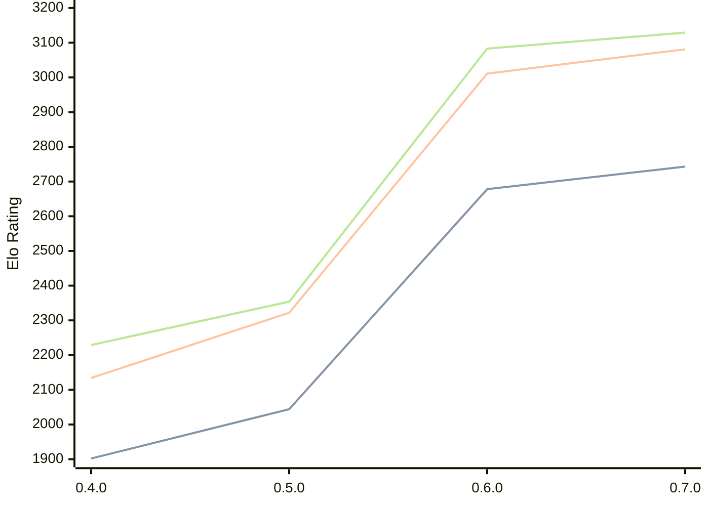

# Engine: AteNika

Author: Yevhenii Sekhin

Home: https://github.com/LesterEvSe/AteNika

## Elo Ratings E1

| Version | Published | STC 8.0+0.08s  | LTC 60.0+0.60s | VLTC 2m24s+1.12s | Comment |
| --- | --- | --- | --- | --- | --- |
| 0.6.0 | 2026-09-13 | 2577 | 2892 | 3028 |  |
 | | | cElo (∆ prev) | cElo (∆ prev) | cElo (∆ prev) | 

## Elo Ratings P1

| Version | Published | STC 8.0+0.08s  | LTC 60.0+0.60s | VLTC 2m24s+1.12s | Comment |
| --- | --- | --- | --- | --- | --- |
| 0.6.0 | 2026-09-13 | 2763 | 3127 | 3240 |  |
 | | | cElo (∆ prev) | cElo (∆ prev) | cElo (∆ prev) | 

## Elo Ratings T1

| Version | Published | STC 8.0+0.08s  | LTC 60.0+0.60s | VLTC 2m24s+1.12s | Comment |
| --- | --- | --- | --- | --- | --- |
| 0.7.0 | 2026-09-20 | 2743(+65) | 3081(+70) | 3129(+46) |  |
| 0.6.0 | 2026-09-13 | 2678(+634) | 3011(+689) | 3083(+729) |  |
| 0.5.0 | 2026-09-02 | 2044(+142) | 2322(+188) | 2354(+125) |  |
| 0.4.0 | 2026-08-30 | 1902 | 2134 | 2229 |  |
 | | | cElo (∆ prev) | cElo (∆ prev) | cElo (∆ prev) | 

<a href="https://github.com/computer-chess-index/cci/issues/new?template=submit-version.yml&title=[VERSION]+AteNika+<version>&body=###%20Engine%20name%0AAteNika%0A%0A###%20Version%0A0.7.0" target="_blank">Submit new version</a>

 Test Conditions:

GUI/CLI: <a href=https://github.com/cutechess/cutechess target="_blank">Cute-Chess</a> 
Elo Calculation: <a href=https://www.remi-coulom.fr/Bayesian-Elo/ target="_blank">Bayesian-Elo</a> 
CPU for P1: Intel(R) Core(TM) Ultra 7 265T (1.50 GHz) - P-Core 
CPU for E1: Intel(R) Core(TM) Ultra 7 265T (1.50 GHz) - E-Core 
CPU for T1: Intel(R) Core(TM) i5-7500T 2.70GHz 
Opening book: 8_moves_v3 
\* STC: 8.0+0.08s, LTC: 60.0+0.60s, VLTC: 2m24s+1.12s

 Lists:
Ratings: <a href=https://github.com/computer-chess-index/cci/blob/main/lists/CCIRatings.csv target="_blank">Complete list</a>

Generated: 2026-10-10 16:22:52

## Ratings Verlauf

```mermaid
%%{init: {"theme":"base","themeVariables":{"seriesColors:['#a3a3a3','#222221','#faa371']}}}%%
xychart-beta
  x-axis ["0.4.0", "0.5.0", "0.6.0", "0.7.0"]
  y-axis "Elo Rating" 1900 --> 3200
  line "" [1902, 2044, 2678, 2743]
  line "T1: STC (8.0+0.08s)" [1902, 2044, 2678, 2743]
  line "T1: LTC (60.0+0.60s)" [2134, 2322, 3011, 3081]
  line "" [2229, 2354, 3083, 3129]
  line "T1: VLTC (2m24s+1.12s)" [2229, 2354, 3083, 3129]
  line "" [2577]
  line "E1: STC (8.0+0.08s)" [2577]
  line "E1: LTC (60.0+0.60s)" [2892]
  line "" [3028]
  line "E1: VLTC (2m24s+1.12s)" [3028]
```

## Detailed Evaluation Results

| Version | Time Control | Elo  | Range +/- | Matches | Score | Average Opponent Elo | Draws |
| --- | --- | --- | --- | --- | --- | --- | --- |
| 0.7.0 | VLTC (2m24s+1.12s) | 3129 | 45 | 134 | 46% | 3166 | 60% |
| 0.7.0 | LTC (60.0+0.60s) | 3081 | 42 | 158 | 52% | 3063 | 55% |
| 0.7.0 | STC (8.0+0.08s) | 2743 | 51 | 116 | 53% | 2716 | 39% |
| --- | --- | --- | --- | --- | --- | --- | --- |
| 0.6.0 | VLTC (2m24s+1.12s) | 3083 | 36 | 230 | 55% | 3033 | 48% |
| 0.6.0 | VLTC (2m24s+1.12s) | 3240 | 53 | 98 | 47% | 3266 | 54% |
| 0.6.0 | VLTC (2m24s+1.12s) | 3028 | 37 | 194 | 50% | 3028 | 59% |
| 0.6.0 | LTC (60.0+0.60s) | 3011 | 36 | 222 | 53% | 2978 | 52% |
| 0.6.0 | LTC (60.0+0.60s) | 3127 | 48 | 126 | 49% | 3139 | 48% |
| 0.6.0 | LTC (60.0+0.60s) | 2892 | 36 | 224 | 47% | 2919 | 52% |
| 0.6.0 | STC (8.0+0.08s) | 2678 | 45 | 158 | 53% | 2643 | 37% |
| --- | --- | --- | --- | --- | --- | --- | --- |
| 0.6.0 | STC (8.0+0.08s) | 2763 | 56 | 110 | 45% | 2830 | 29% |
| --- | --- | --- | --- | --- | --- | --- | --- |
| 0.6.0 | STC (8.0+0.08s) | 2577 | 45 | 152 | 49% | 2585 | 39% |
| --- | --- | --- | --- | --- | --- | --- | --- |
| 0.5.0 | VLTC (2m24s+1.12s) | 2354 | 36 | 262 | 50% | 2357 | 26% |
| 0.5.0 | LTC (60.0+0.60s) | 2322 | 42 | 202 | 52% | 2303 | 21% |
| 0.5.0 | STC (8.0+0.08s) | 2044 | 36 | 270 | 49% | 2061 | 21% |
| --- | --- | --- | --- | --- | --- | --- | --- |
| 0.4.0 | VLTC (2m24s+1.12s) | 2229 | 38 | 248 | 48% | 2252 | 23% |
| 0.4.0 | LTC (60.0+0.60s) | 2134 | 40 | 230 | 50% | 2138 | 15% |
| 0.4.0 | STC (8.0+0.08s) | 1902 | 38 | 248 | 50% | 1901 | 16% |
| --- | --- | --- | --- | --- | --- | --- | --- |