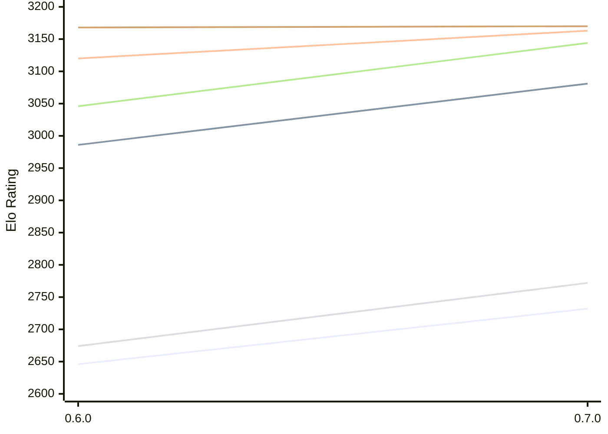
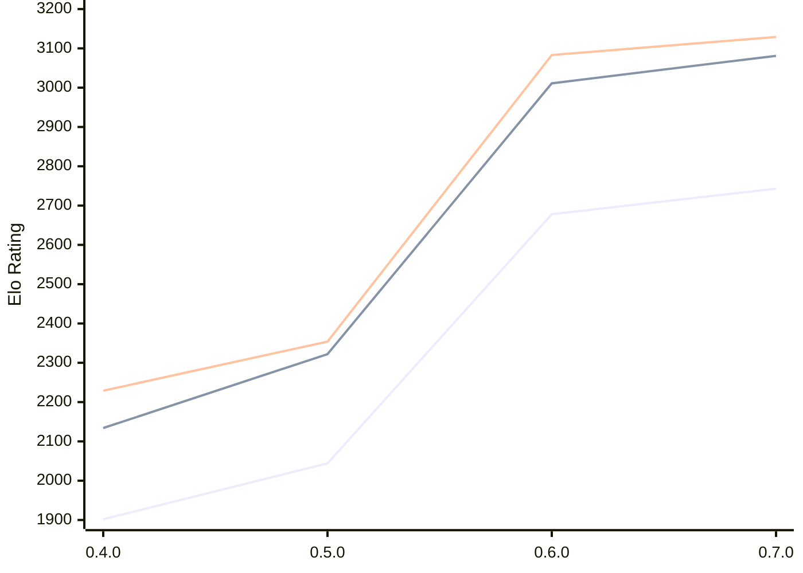

# Engine: AteNika

Author: Yevhenii Sekhin

Home: https://github.com/LesterEvSe/AteNika

## Elo Ratings E1 (Ultra 7 265T (1.50 GHz) - E-Core)

| Version | Published | STC 8.0+0.08s  | LTC 60.0+0.60s | VLTC 2m24s+1.12s | Comment |
| --- | --- | --- | --- | --- | --- |
| 0.7.0 | 2026-09-20 | 2732(+86) | 3081(+95) | 3163(+43) |  |
| 0.6.0 | 2026-09-13 | 2646 | 2986 | 3120 |  |
 | | | cElo (∆ prev) | cElo (∆ prev) | cElo (∆ prev) | 

## Elo Ratings P1 (Ultra 7 265T (1.50 GHz) - P-Core)

| Version | Published | STC 8.0+0.08s  | LTC 60.0+0.60s | VLTC 2m24s+1.12s | Comment |
| --- | --- | --- | --- | --- | --- |
| 0.7.0 | 2026-09-20 | 2772(+98) | 3144(+98) | 3170(+2) |  |
| 0.6.0 | 2026-09-13 | 2674 | 3046 | 3168 |  |
 | | | cElo (∆ prev) | cElo (∆ prev) | cElo (∆ prev) | 

## Elo Ratings T1 (i5-7500T 2.70GHz)

| Version | Published | STC 8.0+0.08s  | LTC 60.0+0.60s | VLTC 2m24s+1.12s | Comment |
| --- | --- | --- | --- | --- | --- |
| 0.7.0 | 2026-09-20 | 2743(+65) | 3081(+70) | 3129(+46) |  |
| 0.6.0 | 2026-09-13 | 2678(+634) | 3011(+689) | 3083(+729) |  |
| 0.5.0 | 2026-09-02 | 2044(+142) | 2322(+188) | 2354(+125) |  |
| 0.4.0 | 2026-08-30 | 1902 | 2134 | 2229 |  |
 | | | cElo (∆ prev) | cElo (∆ prev) | cElo (∆ prev) | 

<a href="https://github.com/computer-chess-index/cci/issues/new?template=submit-version.yml&title=[VERSION]+AteNika+<version>&body=###%20Engine%20name%0AAteNika%0A%0A###%20Version%0A0.7.0" target="_blank">Submit new version</a>

 Test Conditions:

GUI/CLI: <a href=https://github.com/cutechess/cutechess target="_blank">Cute-Chess</a> 
Elo Calculation: <a href=https://www.remi-coulom.fr/Bayesian-Elo/ target="_blank">Bayesian-Elo</a> 
CPU for P1: Intel(R) Core(TM) Ultra 7 265T (1.50 GHz) - P-Core 
CPU for E1: Intel(R) Core(TM) Ultra 7 265T (1.50 GHz) - E-Core 
CPU for T1: Intel(R) Core(TM) i5-7500T 2.70GHz 
Opening book: 8_moves_v3 
\* STC: 8.0+0.08s, LTC: 60.0+0.60s, VLTC: 2m24s+1.12s

 Lists:
Ratings: <a href=https://github.com/computer-chess-index/cci/blob/main/lists/CCIRatings.csv target="_blank">Complete list</a>

Generated: 2026-10-23 04:36:13

## Ratings Verlauf E1 / P1

```mermaid
%%{init: {"theme":"base","themeVariables":{"seriesColors:['#a3a3a3','#222221','#faa371']}}}%%
xychart-beta
  x-axis ["0.6.0", "0.7.0"]
  y-axis "Elo Rating" 2600 --> 3200
  line "E1: STC (8.0+0.08s)" [2646, 2732]
  line "E1: LTC (60.0+0.60s)" [2986, 3081]
  line "E1: VLTC (2m24s+1.12s)" [3120, 3163]
  line "P1: STC (8.0+0.08s)" [2674, 2772]
  line "P1: LTC (60.0+0.60s)" [3046, 3144]
  line "P1: VLTC (2m24s+1.12s)" [3168, 3170]
```

## Ratings Verlauf T1

```mermaid
%%{init: {"theme":"base","themeVariables":{"seriesColors:['#a3a3a3','#222221','#faa371']}}}%%
xychart-beta
  x-axis ["0.4.0", "0.5.0", "0.6.0", "0.7.0"]
  y-axis "Elo Rating" 1900 --> 3200
  line "T1: STC (8.0+0.08s)" [1902, 2044, 2678, 2743]
  line "T1: LTC (60.0+0.60s)" [2134, 2322, 3011, 3081]
  line "T1: VLTC (2m24s+1.12s)" [2229, 2354, 3083, 3129]
```

## Detailed Evaluation Results

| Version | Time Control | Variant | Elo  | Range +/- | Matches | Score | Average Opponent Elo | Draws |
| --- | --- |--- | --- | --- | --- | --- | --- | --- |
| 0.7.0 | VLTC (2m24s+1.12s) | E1 | 3163 | 41 | 158 | 54% | 3133 | 58% |
|  |  | T1 | 3129 | 45 | 134 | 46% | 3166 | 60% |
|  |  | P1 | 3170 | 94 | 28 | 50% | 3168 | 64% |
|  | LTC (60.0+0.60s) | T1 | 3081 | 42 | 158 | 52% | 3063 | 55% |
|  |  | P1 | 3144 | 59 | 78 | 52% | 3132 | 55% |
|  |  | E1 | 3081 | 37 | 196 | 52% | 3067 | 56% |
|  | STC (8.0+0.08s) | T1 | 2743 | 51 | 116 | 53% | 2716 | 39% |
|  |  | P1 | 2772 | 61 | 74 | 53% | 2742 | 53% |
|  |  | E1 | 2732 | 50 | 126 | 50% | 2739 | 40% |
| --- | --- |--- | --- | --- | --- | --- | --- | --- |
| 0.6.0 | VLTC (2m24s+1.12s) | T1 | 3083 | 36 | 230 | 55% | 3033 | 48% |
|  |  | P1 | 3168 | 53 | 100 | 48% | 3193 | 55% |
|  |  | E1 | 3120 | 33 | 240 | 49% | 3123 | 60% |
|  | LTC (60.0+0.60s) | T1 | 3011 | 36 | 222 | 53% | 2978 | 52% |
|  |  | P1 | 3046 | 41 | 166 | 48% | 3059 | 49% |
|  |  | E1 | 2986 | 33 | 254 | 47% | 3013 | 54% |
|  | STC (8.0+0.08s) | T1 | 2678 | 45 | 158 | 53% | 2643 | 37% |
|  |  | P1 | 2674 | 48 | 144 | 45% | 2732 | 33% |
|  |  | E1 | 2646 | 39 | 198 | 48% | 2662 | 40% |
| --- | --- |--- | --- | --- | --- | --- | --- | --- |
| 0.5.0 | VLTC (2m24s+1.12s) | T1 | 2354 | 36 | 262 | 50% | 2357 | 26% |
|  | LTC (60.0+0.60s) | T1 | 2322 | 42 | 202 | 52% | 2303 | 21% |
|  | STC (8.0+0.08s) | T1 | 2044 | 36 | 270 | 49% | 2061 | 21% |
| --- | --- |--- | --- | --- | --- | --- | --- | --- |
| 0.4.0 | VLTC (2m24s+1.12s) | T1 | 2229 | 38 | 248 | 48% | 2252 | 23% |
|  | LTC (60.0+0.60s) | T1 | 2134 | 40 | 230 | 50% | 2138 | 15% |
|  | STC (8.0+0.08s) | T1 | 1902 | 38 | 248 | 50% | 1901 | 16% |