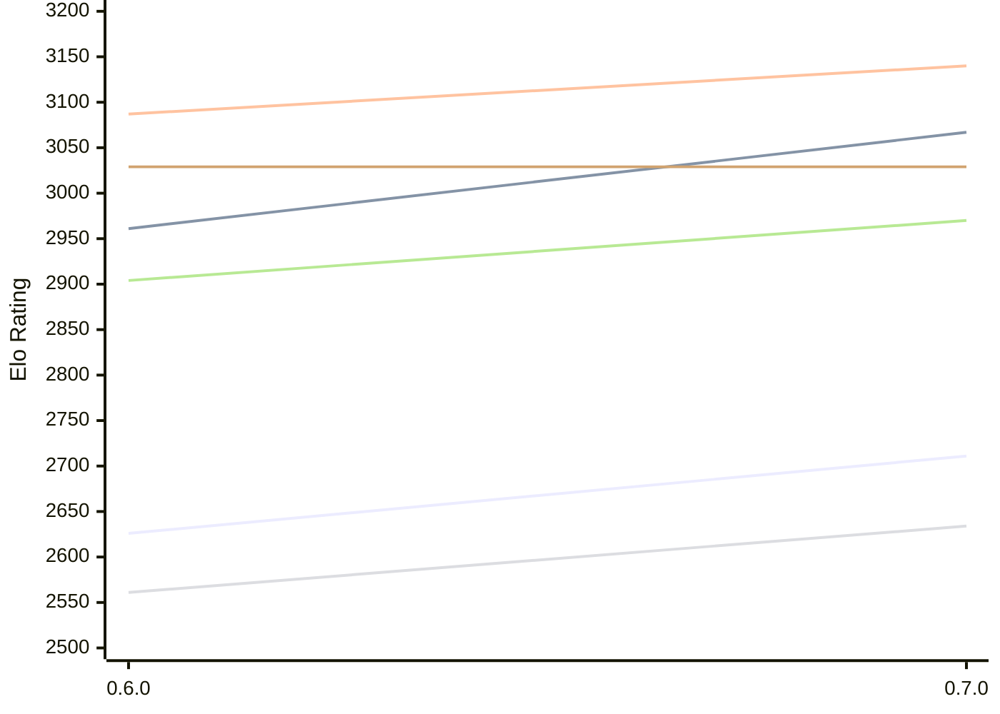
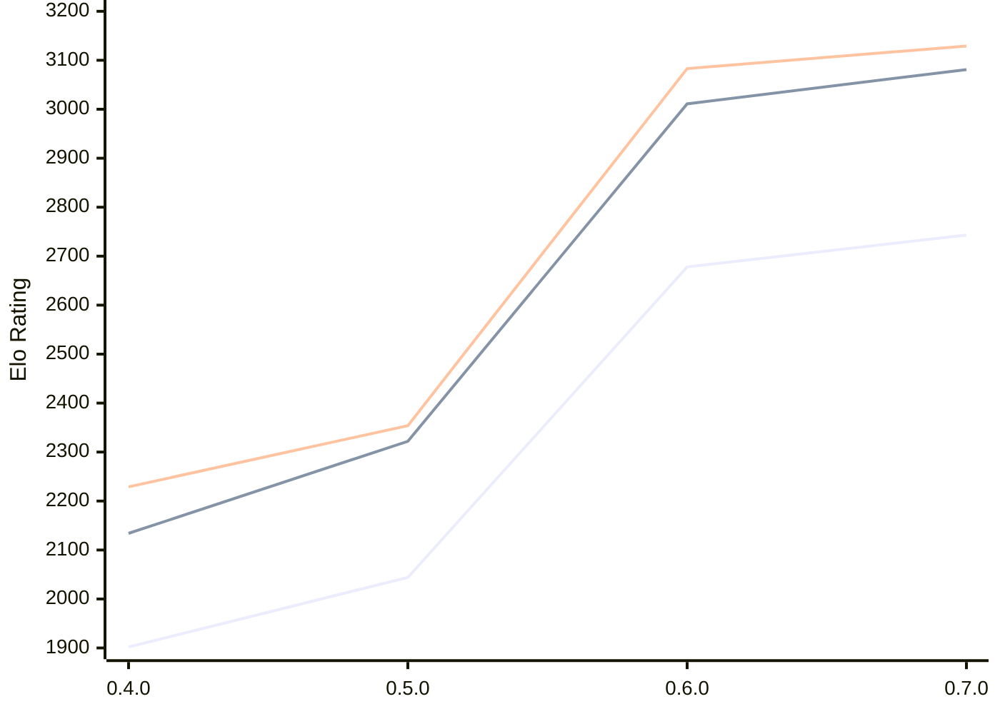

# Engine: AteNika

Author: Yevhenii Sekhin

Home: https://github.com/LesterEvSe/AteNika

## Elo Ratings E1 (Ultra 7 265T (1.50 GHz) - E-Core)

| Version | Published | STC 8.0+0.08s  | LTC 60.0+0.60s | VLTC 2m24s+1.12s | Comment |
| --- | --- | --- | --- | --- | --- |
| 0.7.0 | 2026-09-20 | 2711(+85) | 3067(+106) | 3140(+53) |  |
| 0.6.0 | 2026-09-13 | 2626 | 2961 | 3087 |  |
 | | | cElo (∆ prev) | cElo (∆ prev) | cElo (∆ prev) | 

## Elo Ratings P1 (Ultra 7 265T (1.50 GHz) - P-Core)

| Version | Published | STC 8.0+0.08s  | LTC 60.0+0.60s | VLTC 2m24s+1.12s | Comment |
| --- | --- | --- | --- | --- | --- |
| 0.7.0 | 2026-09-20 | 2634(+73) | 2970(+66) | 3029(0) |  |
| 0.6.0 | 2026-09-13 | 2561 | 2904 | 3029 |  |
 | | | cElo (∆ prev) | cElo (∆ prev) | cElo (∆ prev) | 

## Elo Ratings T1 (i5-7500T 2.70GHz)

| Version | Published | STC 8.0+0.08s  | LTC 60.0+0.60s | VLTC 2m24s+1.12s | Comment |
| --- | --- | --- | --- | --- | --- |
| 0.7.0 | 2026-09-20 | 2743(+65) | 3081(+70) | 3129(+46) |  |
| 0.6.0 | 2026-09-13 | 2678(+634) | 3011(+689) | 3083(+729) |  |
| 0.5.0 | 2026-09-02 | 2044(+142) | 2322(+188) | 2354(+125) |  |
| 0.4.0 | 2026-08-30 | 1902 | 2134 | 2229 |  |
 | | | cElo (∆ prev) | cElo (∆ prev) | cElo (∆ prev) | 

<a href="https://github.com/computer-chess-index/cci/issues/new?template=submit-version.yml&title=[VERSION]+AteNika+<version>&body=###%20Engine%20name%0AAteNika%0A%0A###%20Version%0A0.7.0" target="_blank">Submit new version</a>

 Test Conditions:

GUI/CLI: <a href=https://github.com/cutechess/cutechess target="_blank">Cute-Chess</a> 
Elo Calculation: <a href=https://www.remi-coulom.fr/Bayesian-Elo/ target="_blank">Bayesian-Elo</a> 
CPU for P1: Intel(R) Core(TM) Ultra 7 265T (1.50 GHz) - P-Core 
CPU for E1: Intel(R) Core(TM) Ultra 7 265T (1.50 GHz) - E-Core 
CPU for T1: Intel(R) Core(TM) i5-7500T 2.70GHz 
Opening book: 8_moves_v3 
\* STC: 8.0+0.08s, LTC: 60.0+0.60s, VLTC: 2m24s+1.12s

 Lists:
Ratings: <a href=https://github.com/computer-chess-index/cci/blob/main/lists/CCIRatings.csv target="_blank">Complete list</a>

Generated: 2026-11-14 05:36:09

## Ratings Verlauf E1 / P1

```mermaid
%%{init: {"theme":"base","themeVariables":{"seriesColors:['#a3a3a3','#222221','#faa371']}}}%%
xychart-beta
  x-axis ["0.6.0", "0.7.0"]
  y-axis "Elo Rating" 2500 --> 3200
  line "E1: STC (8.0+0.08s)" [2626, 2711]
  line "E1: LTC (60.0+0.60s)" [2961, 3067]
  line "E1: VLTC (2m24s+1.12s)" [3087, 3140]
  line "P1: STC (8.0+0.08s)" [2561, 2634]
  line "P1: LTC (60.0+0.60s)" [2904, 2970]
  line "P1: VLTC (2m24s+1.12s)" [3029, 3029]
```

## Ratings Verlauf T1

```mermaid
%%{init: {"theme":"base","themeVariables":{"seriesColors:['#a3a3a3','#222221','#faa371']}}}%%
xychart-beta
  x-axis ["0.4.0", "0.5.0", "0.6.0", "0.7.0"]
  y-axis "Elo Rating" 1900 --> 3200
  line "T1: STC (8.0+0.08s)" [1902, 2044, 2678, 2743]
  line "T1: LTC (60.0+0.60s)" [2134, 2322, 3011, 3081]
  line "T1: VLTC (2m24s+1.12s)" [2229, 2354, 3083, 3129]
```

## Detailed Evaluation Results

| Version | Time Control | Variant | Elo  | Range +/- | Matches | Score | Average Opponent Elo | Draws |
| --- | --- |--- | --- | --- | --- | --- | --- | --- |
| 0.7.0 | VLTC (2m24s+1.12s) | P1 | 3029 | 57 | 80 | 50% | 3029 | 65% |
|  |  | E1 | 3140 | 31 | 280 | 51% | 3131 | 59% |
|  |  | T1 | 3129 | 45 | 134 | 46% | 3166 | 60% |
|  | LTC (60.0+0.60s) | P1 | 2970 | 41 | 162 | 48% | 2985 | 56% |
|  |  | E1 | 3067 | 31 | 278 | 52% | 3048 | 58% |
|  |  | T1 | 3081 | 42 | 158 | 52% | 3063 | 55% |
|  | STC (8.0+0.08s) | E1 | 2711 | 44 | 158 | 49% | 2722 | 39% |
|  |  | T1 | 2743 | 51 | 116 | 53% | 2716 | 39% |
|  |  | P1 | 2634 | 41 | 172 | 50% | 2631 | 45% |
| --- | --- |--- | --- | --- | --- | --- | --- | --- |
| 0.6.0 | VLTC (2m24s+1.12s) | T1 | 3083 | 36 | 230 | 55% | 3033 | 48% |
|  |  | P1 | 3029 | 52 | 104 | 47% | 3055 | 56% |
|  |  | E1 | 3087 | 33 | 244 | 49% | 3092 | 60% |
|  | LTC (60.0+0.60s) | T1 | 3011 | 36 | 222 | 53% | 2978 | 52% |
|  |  | P1 | 2904 | 41 | 170 | 48% | 2923 | 49% |
|  |  | E1 | 2961 | 33 | 258 | 47% | 2986 | 55% |
|  | STC (8.0+0.08s) | T1 | 2678 | 45 | 158 | 53% | 2643 | 37% |
|  |  | P1 | 2561 | 47 | 150 | 44% | 2628 | 32% |
|  |  | E1 | 2626 | 38 | 220 | 48% | 2646 | 40% |
| --- | --- |--- | --- | --- | --- | --- | --- | --- |
| 0.5.0 | VLTC (2m24s+1.12s) | T1 | 2354 | 36 | 262 | 50% | 2357 | 26% |
|  | LTC (60.0+0.60s) | T1 | 2322 | 42 | 202 | 52% | 2303 | 21% |
|  | STC (8.0+0.08s) | T1 | 2044 | 36 | 270 | 49% | 2061 | 21% |
| --- | --- |--- | --- | --- | --- | --- | --- | --- |
| 0.4.0 | VLTC (2m24s+1.12s) | T1 | 2229 | 38 | 248 | 48% | 2252 | 23% |
|  | LTC (60.0+0.60s) | T1 | 2134 | 40 | 230 | 50% | 2138 | 15% |
|  | STC (8.0+0.08s) | T1 | 1902 | 38 | 248 | 50% | 1901 | 16% |