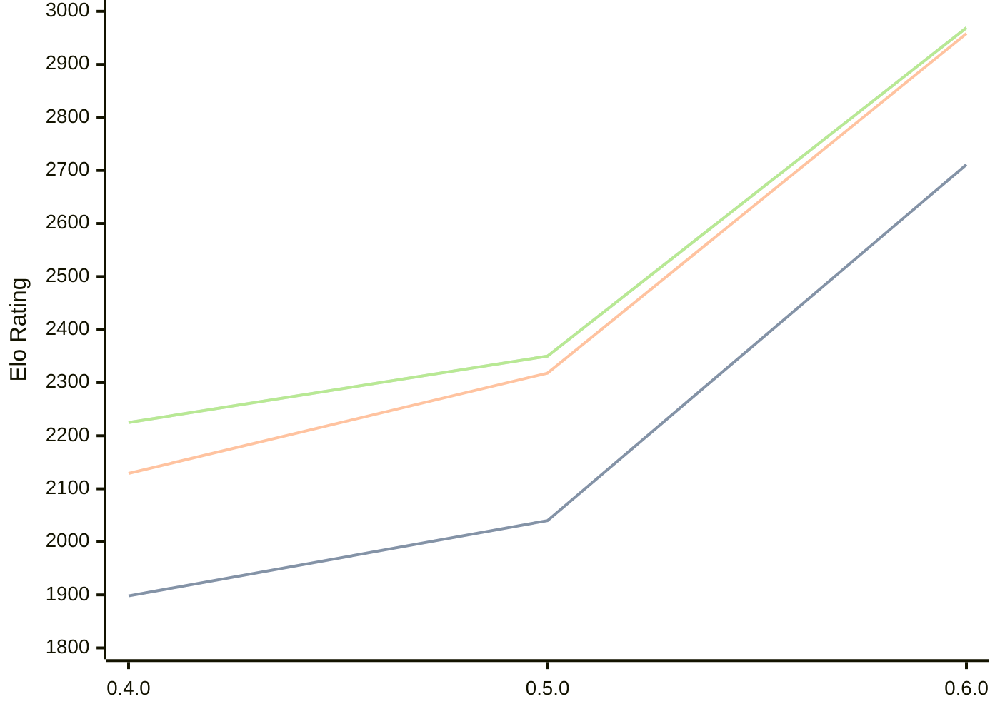

# Engine: Atenika

Author: Yevhenii Sekhin

Home: https://github.com/LesterEvSe/AteNika

## Elo Ratings

| Version | Published | STC 8.0+0.08s  | LTC 60.0+0.60s | VLTC 2m24s+1.12s | Comment |
| --- | --- | --- | --- | --- | --- |
| 0.6.0 | 2026-09-13 | 2711(+671) | 2958(+640) | 2969(+619) |  |
| 0.5.0 | 2026-09-02 | 2040(+142) | 2318(+189) | 2350(+125) |  |
| 0.4.0 | 2026-08-30 | 1898 | 2129 | 2225 |  |
 | | | cElo (∆ prev) | cElo (∆ prev) | cElo (∆ prev) | 

<a href="https://github.com/computer-chess-index/cci/issues/new?template=submit-version.yml&title=[VERSION]+Atenika+<version>&body=###%20Engine%20name%0AAtenika%0A%0A###%20Version%0A0.6.0" target="_blank">Submit new version</a>

 Test Conditions:

GUI/CLI: <a href=https://github.com/cutechess/cutechess target="_blank">Cute-Chess</a> 
Elo Calculation: <a href=https://www.remi-coulom.fr/Bayesian-Elo/ target="_blank">Bayesian-Elo</a> 
CPU: Intel(R) Core(TM) i5-7500T 2.70GHz 
Opening book: 8_moves_v3 
\* STC: 8.0+0.08s, LTC: 60.0+0.60s, VLTC: 2m24s+1.12s

 Lists:
Ratings: <a href=https://github.com/computer-chess-index/cci/blob/main/lists/CCIRatings.csv target="_blank">Complete list</a>

Generated: 2026-09-15 04:36:06

## Ratings Verlauf

## Detailed Evaluation Results

| Version | Time Control | Elo  | Range +/- | Matches | Score | Average Opponent Elo | Draws |
| --- | --- | --- | --- | --- | --- | --- | --- |
| 0.6.0 | VLTC (2m24s+1.12s) | 2969 | 93 | 40 | 54% | 2911 | 28% |
| 0.6.0 | LTC (60.0+0.60s) | 2958 | 80 | 48 | 53% | 2908 | 44% |
| 0.6.0 | STC (8.0+0.08s) | 2711 | 89 | 48 | 64% | 2550 | 27% |
| --- | --- | --- | --- | --- | --- | --- | --- |
| 0.5.0 | VLTC (2m24s+1.12s) | 2350 | 36 | 262 | 50% | 2353 | 26% |
| 0.5.0 | LTC (60.0+0.60s) | 2318 | 42 | 202 | 52% | 2299 | 21% |
| 0.5.0 | STC (8.0+0.08s) | 2040 | 36 | 270 | 49% | 2056 | 21% |
| --- | --- | --- | --- | --- | --- | --- | --- |
| 0.4.0 | VLTC (2m24s+1.12s) | 2225 | 38 | 248 | 48% | 2246 | 23% |
| 0.4.0 | LTC (60.0+0.60s) | 2129 | 40 | 230 | 50% | 2133 | 15% |
| 0.4.0 | STC (8.0+0.08s) | 1898 | 38 | 248 | 50% | 1897 | 16% |
| --- | --- | --- | --- | --- | --- | --- | --- |