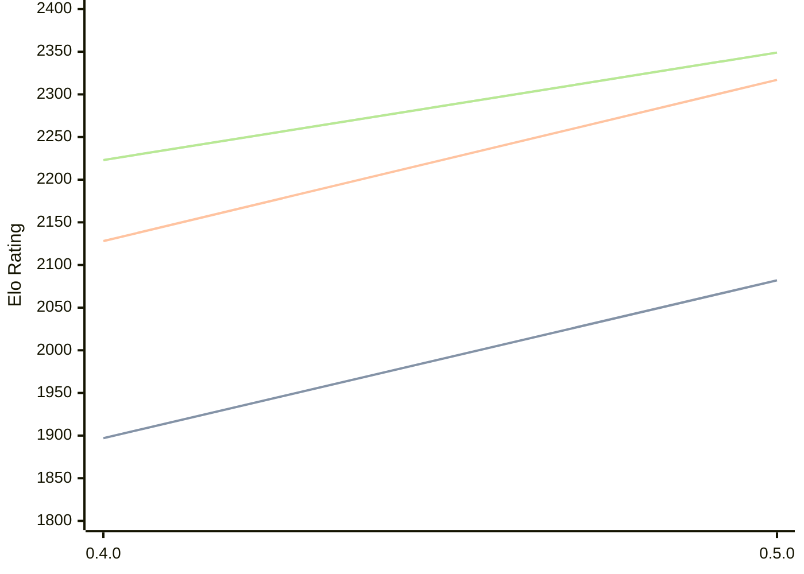

# Engine: Atenika

Author: Yevhenii Sekhin

Home: https://github.com/LesterEvSe/AteNika

## Elo Ratings

| Version | Published | STC 8.0+0.08s  | LTC 60.0+0.60s | VLTC 2m24s+1.12s | Comment |
| --- | --- | --- | --- | --- | --- |
| 0.5.0 | 2026-09-02 | 2082(+185) | 2317(+189) | 2349(+126) |  |
| 0.4.0 | 2026-08-30 | 1897 | 2128 | 2223 |  |
 | | | cElo (∆ prev) | cElo (∆ prev) | cElo (∆ prev) | 

<a href="https://github.com/computer-chess-index/cci/issues/new?template=submit-version.yml&title=[VERSION]+Atenika+<version>&body=###%20Engine%20name%0AAtenika%0A%0A###%20Version%0A0.5.0" target="_blank">Submit new version</a>

 Test Conditions:

GUI/CLI: <a href=https://github.com/cutechess/cutechess target="_blank">Cute-Chess</a> 
Elo Calculation: <a href=https://www.remi-coulom.fr/Bayesian-Elo/ target="_blank">Bayesian-Elo</a> 
CPU: Intel(R) Core(TM) i5-7500T 2.70GHz 
Opening book: 8_moves_v3 
\* STC: 8.0+0.08s, LTC: 60.0+0.60s, VLTC: 2m24s+1.12s

 Lists:
Ratings: <a href=https://github.com/computer-chess-index/cci/blob/main/lists/CCIRatings.csv target="_blank">Complete list</a>

Generated: 2026-09-06 06:22:29

## Ratings Verlauf

## Detailed Evaluation Results

| Version | Time Control | Elo  | Range +/- | Matches | Score | Average Opponent Elo | Draws |
| --- | --- | --- | --- | --- | --- | --- | --- |
| 0.5.0 | VLTC (2m24s+1.12s) | 2349 | 38 | 234 | 50% | 2350 | 26% |
| 0.5.0 | LTC (60.0+0.60s) | 2317 | 46 | 166 | 53% | 2291 | 21% |
| 0.5.0 | STC (8.0+0.08s) | 2082 | 47 | 158 | 52% | 2064 | 23% |
| --- | --- | --- | --- | --- | --- | --- | --- |
| 0.4.0 | VLTC (2m24s+1.12s) | 2223 | 38 | 248 | 48% | 2245 | 23% |
| 0.4.0 | LTC (60.0+0.60s) | 2128 | 40 | 230 | 50% | 2133 | 15% |
| 0.4.0 | STC (8.0+0.08s) | 1897 | 38 | 248 | 50% | 1895 | 16% |
| --- | --- | --- | --- | --- | --- | --- | --- |