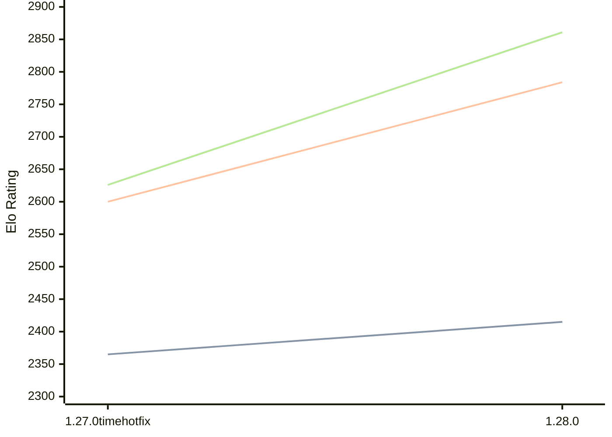

# Engine: Aurora

Author: Winston Cai

Home: https://github.com/kjljixx/Aurora-Chess-Engine

## Elo Ratings

| Version | Published | STC 8.0+0.08s  | LTC 60.0+0.60s | VLTC 2m24s+1.12s | Comment |
| --- | --- | --- | --- | --- | --- |
| 1.28.0 | 2026-09-21 | 2415(+50) | 2784(+184) | 2861(+235) |  |
| 1.27.0timehotfix | 2026-05-28 | 2365(+new) | 2600(+new) | 2626(+new) |  |
| 1.27.0 | 2026-05-24 |  |  |  |  |
 | | | cElo (∆ prev) | cElo (∆ prev) | cElo (∆ prev) | 

<a href="https://github.com/computer-chess-index/cci/issues/new?template=submit-version.yml&title=[VERSION]+Aurora+<version>&body=###%20Engine%20name%0AAurora%0A%0A###%20Version%0A1.28.0" target="_blank">Submit new version</a>

 Test Conditions:

GUI/CLI: <a href=https://github.com/cutechess/cutechess target="_blank">Cute-Chess</a> 
Elo Calculation: <a href=https://www.remi-coulom.fr/Bayesian-Elo/ target="_blank">Bayesian-Elo</a> 
CPU: Intel(R) Core(TM) i5-7500T 2.70GHz 
Opening book: 8_moves_v3 
\* STC: 8.0+0.08s, LTC: 60.0+0.60s, VLTC: 2m24s+1.12s

 Lists:
Ratings: <a href=https://github.com/computer-chess-index/cci/blob/main/lists/CCIRatings.csv target="_blank">Complete list</a>

Generated: 2026-09-24 04:36:07

## Ratings Verlauf

## Detailed Evaluation Results

| Version | Time Control | Elo  | Range +/- | Matches | Score | Average Opponent Elo | Draws |
| --- | --- | --- | --- | --- | --- | --- | --- |
| 1.28.0 | VLTC (2m24s+1.12s) | 2861 | 44 | 164 | 55% | 2816 | 39% |
| 1.28.0 | LTC (60.0+0.60s) | 2784 | 38 | 218 | 57% | 2719 | 37% |
| 1.28.0 | STC (8.0+0.08s) | 2415 | 47 | 160 | 45% | 2461 | 24% |
| --- | --- | --- | --- | --- | --- | --- | --- |
| 1.27.0timehotfix | VLTC (2m24s+1.12s) | 2626 | 28 | 408 | 48% | 2641 | 32% |
| 1.27.0timehotfix | LTC (60.0+0.60s) | 2600 | 28 | 434 | 51% | 2592 | 29% |
| 1.27.0timehotfix | STC (8.0+0.08s) | 2365 | 28 | 448 | 49% | 2380 | 22% |
| --- | --- | --- | --- | --- | --- | --- | --- |