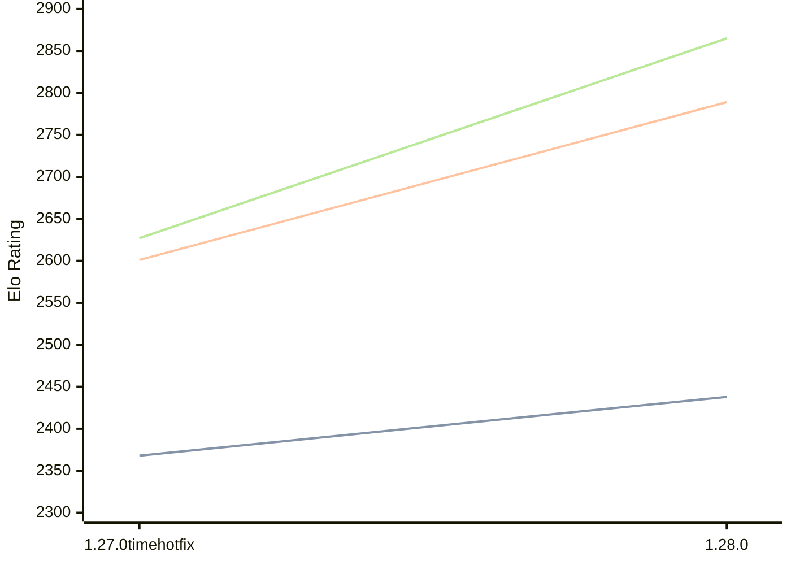

# Engine: Aurora

Author: Winston Cai

Home: https://github.com/kjljixx/Aurora-Chess-Engine

## Elo Ratings

| Version | Published | STC 8.0+0.08s  | LTC 60.0+0.60s | VLTC 2m24s+1.12s | Comment |
| --- | --- | --- | --- | --- | --- |
| 1.28.0 | 2026-09-21 | 2438(+70) | 2789(+188) | 2865(+238) |  |
| 1.27.0timehotfix | 2026-05-28 | 2368(+new) | 2601(+new) | 2627(+new) |  |
| 1.27.0 | 2026-05-24 |  |  |  |  |
 | | | cElo (∆ prev) | cElo (∆ prev) | cElo (∆ prev) | 

<a href="https://github.com/computer-chess-index/cci/issues/new?template=submit-version.yml&title=[VERSION]+Aurora+<version>&body=###%20Engine%20name%0AAurora%0A%0A###%20Version%0A1.28.0" target="_blank">Submit new version</a>

 Test Conditions:

GUI/CLI: <a href=https://github.com/cutechess/cutechess target="_blank">Cute-Chess</a> 
Elo Calculation: <a href=https://www.remi-coulom.fr/Bayesian-Elo/ target="_blank">Bayesian-Elo</a> 
CPU: Intel(R) Core(TM) i5-7500T 2.70GHz 
Opening book: 8_moves_v3 
\* STC: 8.0+0.08s, LTC: 60.0+0.60s, VLTC: 2m24s+1.12s

 Lists:
Ratings: <a href=https://github.com/computer-chess-index/cci/blob/main/lists/CCIRatings.csv target="_blank">Complete list</a>

Generated: 2026-10-09 04:36:08

## Ratings Verlauf

```mermaid
%%{init: {"theme":"base","themeVariables":{"seriesColors:['#a3a3a3','#222221','#faa371']}}}%%
xychart-beta
  x-axis ["1.27.0timehotfix", "1.28.0"]
  y-axis "Elo Rating" 2300 --> 2900
  line "" [2368, 2438]
  line "STC (8.0+0.08s)" [2368, 2438]
  line "LTC (60.0+0.60s)" [2601, 2789]
  line "" [2627, 2865]
  line "VLTC (2m24s+1.12s)" [2627, 2865]
```

## Detailed Evaluation Results

| Version | Time Control | Elo  | Range +/- | Matches | Score | Average Opponent Elo | Draws |
| --- | --- | --- | --- | --- | --- | --- | --- |
| 1.28.0 | VLTC (2m24s+1.12s) | 2865 | 41 | 188 | 54% | 2824 | 37% |
| 1.28.0 | LTC (60.0+0.60s) | 2789 | 34 | 280 | 56% | 2738 | 38% |
| 1.28.0 | STC (8.0+0.08s) | 2438 | 39 | 234 | 49% | 2452 | 23% |
| --- | --- | --- | --- | --- | --- | --- | --- |
| 1.27.0timehotfix | VLTC (2m24s+1.12s) | 2627 | 28 | 408 | 48% | 2642 | 32% |
| 1.27.0timehotfix | LTC (60.0+0.60s) | 2601 | 28 | 434 | 51% | 2593 | 29% |
| 1.27.0timehotfix | STC (8.0+0.08s) | 2368 | 28 | 448 | 49% | 2381 | 22% |
| --- | --- | --- | --- | --- | --- | --- | --- |