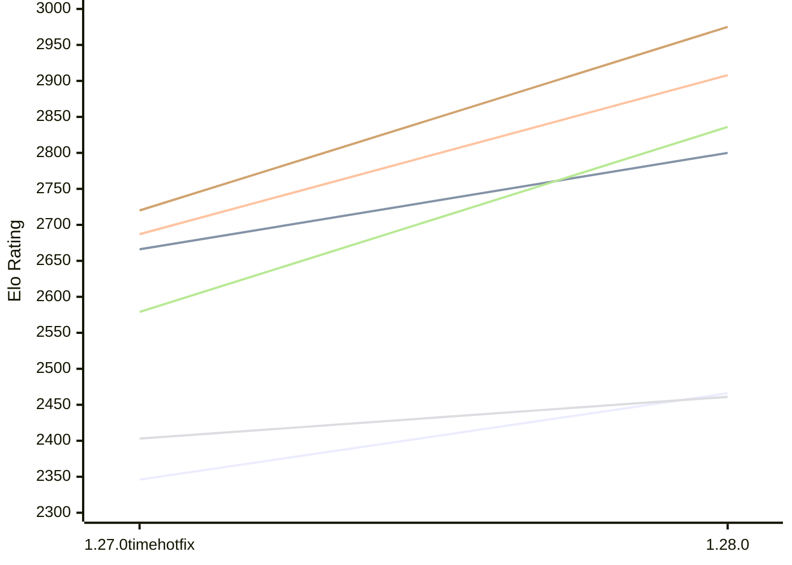
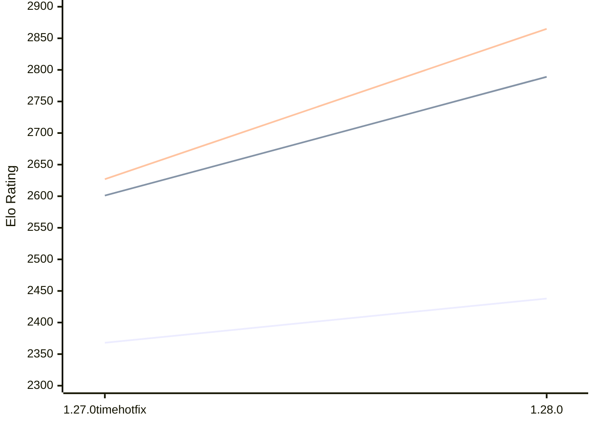

# Engine: Aurora

Author: Winston Cai

Home: https://github.com/kjljixx/Aurora-Chess-Engine

## Elo Ratings E1 (Ultra 7 265T (1.50 GHz) - E-Core)

| Version | Published | STC 8.0+0.08s  | LTC 60.0+0.60s | VLTC 2m24s+1.12s | Comment |
| --- | --- | --- | --- | --- | --- |
| 1.28.0 | 2026-09-21 | 2466(+120) | 2800(+134) | 2908(+221) |  |
| 1.27.0timehotfix | 2026-05-28 | 2346 | 2666 | 2687 |  |
 | | | cElo (∆ prev) | cElo (∆ prev) | cElo (∆ prev) | 

## Elo Ratings P1 (Ultra 7 265T (1.50 GHz) - P-Core)

| Version | Published | STC 8.0+0.08s  | LTC 60.0+0.60s | VLTC 2m24s+1.12s | Comment |
| --- | --- | --- | --- | --- | --- |
| 1.28.0 | 2026-09-21 | 2461(+58) | 2836(+257) | 2975(+255) |  |
| 1.27.0timehotfix | 2026-05-28 | 2403 | 2579 | 2720 |  |
 | | | cElo (∆ prev) | cElo (∆ prev) | cElo (∆ prev) | 

## Elo Ratings T1 (i5-7500T 2.70GHz)

| Version | Published | STC 8.0+0.08s  | LTC 60.0+0.60s | VLTC 2m24s+1.12s | Comment |
| --- | --- | --- | --- | --- | --- |
| 1.28.0 | 2026-09-21 | 2438(+70) | 2789(+188) | 2865(+238) |  |
| 1.27.0timehotfix | 2026-05-28 | 2368 | 2601 | 2627 |  |
 | | | cElo (∆ prev) | cElo (∆ prev) | cElo (∆ prev) | 

<a href="https://github.com/computer-chess-index/cci/issues/new?template=submit-version.yml&title=[VERSION]+Aurora+<version>&body=###%20Engine%20name%0AAurora%0A%0A###%20Version%0A1.28.0" target="_blank">Submit new version</a>

 Test Conditions:

GUI/CLI: <a href=https://github.com/cutechess/cutechess target="_blank">Cute-Chess</a> 
Elo Calculation: <a href=https://www.remi-coulom.fr/Bayesian-Elo/ target="_blank">Bayesian-Elo</a> 
CPU for P1: Intel(R) Core(TM) Ultra 7 265T (1.50 GHz) - P-Core 
CPU for E1: Intel(R) Core(TM) Ultra 7 265T (1.50 GHz) - E-Core 
CPU for T1: Intel(R) Core(TM) i5-7500T 2.70GHz 
Opening book: 8_moves_v3 
\* STC: 8.0+0.08s, LTC: 60.0+0.60s, VLTC: 2m24s+1.12s

 Lists:
Ratings: <a href=https://github.com/computer-chess-index/cci/blob/main/lists/CCIRatings.csv target="_blank">Complete list</a>

Generated: 2026-10-22 04:36:16

## Ratings Verlauf E1 / P1

```mermaid
%%{init: {"theme":"base","themeVariables":{"seriesColors:['#a3a3a3','#222221','#faa371']}}}%%
xychart-beta
  x-axis ["1.27.0timehotfix", "1.28.0"]
  y-axis "Elo Rating" 2300 --> 3000
  line "E1: STC (8.0+0.08s)" [2346, 2466]
  line "E1: LTC (60.0+0.60s)" [2666, 2800]
  line "E1: VLTC (2m24s+1.12s)" [2687, 2908]
  line "P1: STC (8.0+0.08s)" [2403, 2461]
  line "P1: LTC (60.0+0.60s)" [2579, 2836]
  line "P1: VLTC (2m24s+1.12s)" [2720, 2975]
```

## Ratings Verlauf T1

```mermaid
%%{init: {"theme":"base","themeVariables":{"seriesColors:['#a3a3a3','#222221','#faa371']}}}%%
xychart-beta
  x-axis ["1.27.0timehotfix", "1.28.0"]
  y-axis "Elo Rating" 2300 --> 2900
  line "T1: STC (8.0+0.08s)" [2368, 2438]
  line "T1: LTC (60.0+0.60s)" [2601, 2789]
  line "T1: VLTC (2m24s+1.12s)" [2627, 2865]
```

## Detailed Evaluation Results

| Version | Time Control | Variant | Elo  | Range +/- | Matches | Score | Average Opponent Elo | Draws |
| --- | --- |--- | --- | --- | --- | --- | --- | --- |
| 1.28.0 | VLTC (2m24s+1.12s) | T1 | 2865 | 41 | 188 | 54% | 2824 | 37% |
|  |  | P1 | 2975 | 46 | 142 | 48% | 2990 | 38% |
|  |  | E1 | 2908 | 34 | 276 | 56% | 2851 | 36% |
|  | LTC (60.0+0.60s) | T1 | 2789 | 34 | 280 | 56% | 2738 | 38% |
|  |  | P1 | 2836 | 49 | 128 | 54% | 2803 | 37% |
|  |  | E1 | 2800 | 40 | 196 | 51% | 2788 | 38% |
|  | STC (8.0+0.08s) | T1 | 2438 | 39 | 234 | 49% | 2452 | 23% |
|  |  | P1 | 2461 | 49 | 154 | 44% | 2543 | 19% |
|  |  | E1 | 2466 | 45 | 176 | 52% | 2449 | 19% |
| --- | --- |--- | --- | --- | --- | --- | --- | --- |
| 1.27.0timehotfix | VLTC (2m24s+1.12s) | P1 | 2720 | 33 | 296 | 44% | 2788 | 36% |
|  |  | E1 | 2687 | 36 | 248 | 47% | 2718 | 33% |
|  |  | T1 | 2627 | 28 | 408 | 48% | 2642 | 32% |
|  | LTC (60.0+0.60s) | P1 | 2579 | 42 | 206 | 53% | 2556 | 24% |
|  |  | E1 | 2666 | 37 | 252 | 53% | 2600 | 31% |
|  |  | T1 | 2601 | 28 | 434 | 51% | 2593 | 29% |
|  | STC (8.0+0.08s) | P1 | 2403 | 44 | 192 | 45% | 2469 | 24% |
|  |  | E1 | 2346 | 39 | 236 | 49% | 2353 | 20% |
|  |  | T1 | 2368 | 28 | 448 | 49% | 2381 | 22% |