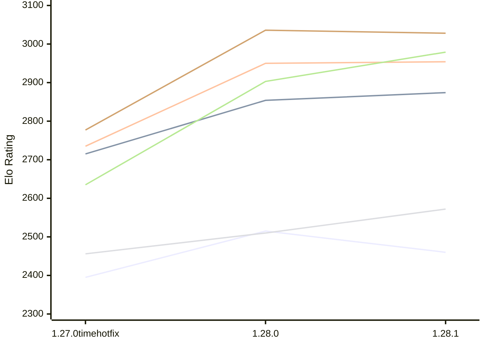
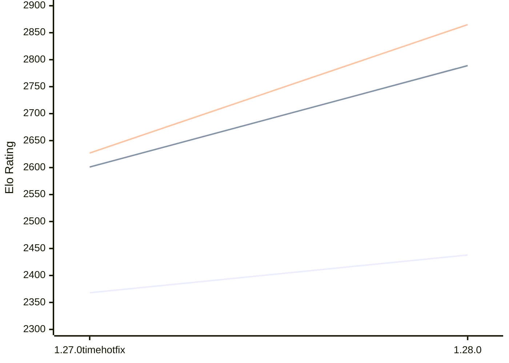

# Engine: Aurora

Author: Winston Cai

Home: https://github.com/kjljixx/Aurora-Chess-Engine

## Elo Ratings E1 (Ultra 7 265T (1.50 GHz) - E-Core)

| Version | Published | STC 8.0+0.08s  | LTC 60.0+0.60s | VLTC 2m24s+1.12s | Comment |
| --- | --- | --- | --- | --- | --- |
| 1.28.1 | 2026-10-25 | 2460(-55) | 2874(+20) | 2954(+4) |  |
| 1.28.0 | 2026-09-21 | 2515(+120) | 2854(+139) | 2950(+215) |  |
| 1.27.0timehotfix | 2026-05-28 | 2395 | 2715 | 2735 |  |
 | | | cElo (∆ prev) | cElo (∆ prev) | cElo (∆ prev) | 

## Elo Ratings P1 (Ultra 7 265T (1.50 GHz) - P-Core)

| Version | Published | STC 8.0+0.08s  | LTC 60.0+0.60s | VLTC 2m24s+1.12s | Comment |
| --- | --- | --- | --- | --- | --- |
| 1.28.1 | 2026-10-25 | 2572(+62) | 2979(+76) | 3028(-8) |  |
| 1.28.0 | 2026-09-21 | 2510(+54) | 2903(+268) | 3036(+259) |  |
| 1.27.0timehotfix | 2026-05-28 | 2456 | 2635 | 2777 |  |
 | | | cElo (∆ prev) | cElo (∆ prev) | cElo (∆ prev) | 

## Elo Ratings T1 (i5-7500T 2.70GHz)

| Version | Published | STC 8.0+0.08s  | LTC 60.0+0.60s | VLTC 2m24s+1.12s | Comment |
| --- | --- | --- | --- | --- | --- |
| 1.28.0 | 2026-09-21 | 2438(+70) | 2789(+188) | 2865(+238) |  |
| 1.27.0timehotfix | 2026-05-28 | 2368 | 2601 | 2627 |  |
 | | | cElo (∆ prev) | cElo (∆ prev) | cElo (∆ prev) | 

<a href="https://github.com/computer-chess-index/cci/issues/new?template=submit-version.yml&title=[VERSION]+Aurora+<version>&body=###%20Engine%20name%0AAurora%0A%0A###%20Version%0A1.28.0" target="_blank">Submit new version</a>

 Test Conditions:

GUI/CLI: <a href=https://github.com/cutechess/cutechess target="_blank">Cute-Chess</a> 
Elo Calculation: <a href=https://www.remi-coulom.fr/Bayesian-Elo/ target="_blank">Bayesian-Elo</a> 
CPU for P1: Intel(R) Core(TM) Ultra 7 265T (1.50 GHz) - P-Core 
CPU for E1: Intel(R) Core(TM) Ultra 7 265T (1.50 GHz) - E-Core 
CPU for T1: Intel(R) Core(TM) i5-7500T 2.70GHz 
Opening book: 8_moves_v3 
\* STC: 8.0+0.08s, LTC: 60.0+0.60s, VLTC: 2m24s+1.12s

 Lists:
Ratings: <a href=https://github.com/computer-chess-index/cci/blob/main/lists/CCIRatings.csv target="_blank">Complete list</a>

Generated: 2026-11-06 05:36:05

## Ratings Verlauf E1 / P1

```mermaid
%%{init: {"theme":"base","themeVariables":{"seriesColors:['#a3a3a3','#222221','#faa371']}}}%%
xychart-beta
  x-axis ["1.27.0timehotfix", "1.28.0", "1.28.1"]
  y-axis "Elo Rating" 2300 --> 3100
  line "E1: STC (8.0+0.08s)" [2395, 2515, 2460]
  line "E1: LTC (60.0+0.60s)" [2715, 2854, 2874]
  line "E1: VLTC (2m24s+1.12s)" [2735, 2950, 2954]
  line "P1: STC (8.0+0.08s)" [2456, 2510, 2572]
  line "P1: LTC (60.0+0.60s)" [2635, 2903, 2979]
  line "P1: VLTC (2m24s+1.12s)" [2777, 3036, 3028]
```

## Ratings Verlauf T1

```mermaid
%%{init: {"theme":"base","themeVariables":{"seriesColors:['#a3a3a3','#222221','#faa371']}}}%%
xychart-beta
  x-axis ["1.27.0timehotfix", "1.28.0"]
  y-axis "Elo Rating" 2300 --> 2900
  line "T1: STC (8.0+0.08s)" [2368, 2438]
  line "T1: LTC (60.0+0.60s)" [2601, 2789]
  line "T1: VLTC (2m24s+1.12s)" [2627, 2865]
```

## Detailed Evaluation Results

| Version | Time Control | Variant | Elo  | Range +/- | Matches | Score | Average Opponent Elo | Draws |
| --- | --- |--- | --- | --- | --- | --- | --- | --- |
| 1.28.1 | VLTC (2m24s+1.12s) | P1 | 3028 | 40 | 186 | 51% | 3020 | 40% |
|  |  | E1 | 2954 | 37 | 216 | 50% | 2951 | 43% |
|  | LTC (60.0+0.60s) | P1 | 2979 | 47 | 152 | 50% | 2979 | 29% |
|  |  | E1 | 2874 | 34 | 276 | 48% | 2889 | 35% |
|  | STC (8.0+0.08s) | E1 | 2460 | 39 | 218 | 52% | 2442 | 28% |
|  |  | P1 | 2572 | 46 | 160 | 49% | 2583 | 25% |
| --- | --- |--- | --- | --- | --- | --- | --- | --- |
| 1.28.0 | VLTC (2m24s+1.12s) | T1 | 2865 | 41 | 188 | 54% | 2824 | 37% |
|  |  | P1 | 3036 | 43 | 162 | 48% | 3050 | 41% |
|  |  | E1 | 2950 | 32 | 302 | 54% | 2908 | 37% |
|  | LTC (60.0+0.60s) | T1 | 2789 | 34 | 280 | 56% | 2738 | 38% |
|  |  | P1 | 2903 | 45 | 156 | 55% | 2801 | 37% |
|  |  | E1 | 2854 | 38 | 216 | 51% | 2846 | 39% |
|  | STC (8.0+0.08s) | T1 | 2438 | 39 | 234 | 49% | 2452 | 23% |
|  |  | P1 | 2510 | 46 | 172 | 44% | 2591 | 20% |
|  |  | E1 | 2515 | 43 | 192 | 51% | 2502 | 18% |
| --- | --- |--- | --- | --- | --- | --- | --- | --- |
| 1.27.0timehotfix | VLTC (2m24s+1.12s) | T1 | 2627 | 28 | 408 | 48% | 2642 | 32% |
|  |  | P1 | 2777 | 33 | 296 | 44% | 2844 | 36% |
|  |  | E1 | 2735 | 36 | 248 | 47% | 2766 | 33% |
|  | LTC (60.0+0.60s) | P1 | 2635 | 42 | 206 | 53% | 2614 | 24% |
|  |  | E1 | 2715 | 37 | 252 | 53% | 2647 | 31% |
|  |  | T1 | 2601 | 28 | 434 | 51% | 2593 | 29% |
|  | STC (8.0+0.08s) | P1 | 2456 | 44 | 192 | 45% | 2522 | 24% |
|  |  | E1 | 2395 | 39 | 236 | 49% | 2402 | 20% |
|  |  | T1 | 2368 | 28 | 448 | 49% | 2381 | 22% |