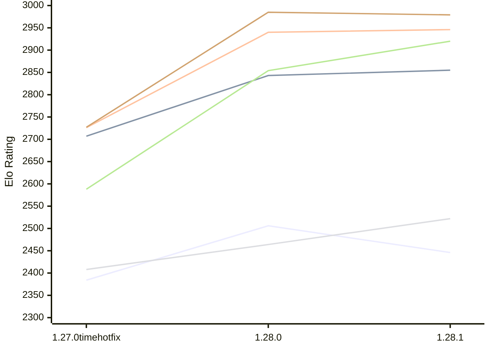
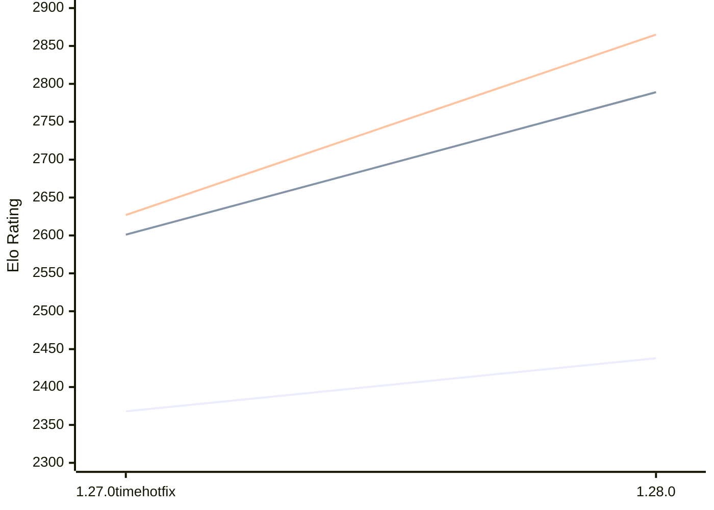

# Engine: Aurora

Author: Winston Cai

Home: https://github.com/kjljixx/Aurora-Chess-Engine

## Elo Ratings E1 (Ultra 7 265T (1.50 GHz) - E-Core)

| Version | Published | STC 8.0+0.08s  | LTC 60.0+0.60s | VLTC 2m24s+1.12s | Comment |
| --- | --- | --- | --- | --- | --- |
| 1.28.1 | 2026-10-25 | 2446(-60) | 2855(+12) | 2946(+6) |  |
| 1.28.0 | 2026-09-21 | 2506(+122) | 2843(+136) | 2940(+214) |  |
| 1.27.0timehotfix | 2026-05-28 | 2384 | 2707 | 2726 |  |
 | | | cElo (∆ prev) | cElo (∆ prev) | cElo (∆ prev) | 

## Elo Ratings P1 (Ultra 7 265T (1.50 GHz) - P-Core)

| Version | Published | STC 8.0+0.08s  | LTC 60.0+0.60s | VLTC 2m24s+1.12s | Comment |
| --- | --- | --- | --- | --- | --- |
| 1.28.1 | 2026-10-25 | 2522(+58) | 2920(+66) | 2979(-6) |  |
| 1.28.0 | 2026-09-21 | 2464(+56) | 2854(+266) | 2985(+258) |  |
| 1.27.0timehotfix | 2026-05-28 | 2408 | 2588 | 2727 |  |
 | | | cElo (∆ prev) | cElo (∆ prev) | cElo (∆ prev) | 

## Elo Ratings T1 (i5-7500T 2.70GHz)

| Version | Published | STC 8.0+0.08s  | LTC 60.0+0.60s | VLTC 2m24s+1.12s | Comment |
| --- | --- | --- | --- | --- | --- |
| 1.28.0 | 2026-09-21 | 2438(+70) | 2789(+188) | 2865(+238) |  |
| 1.27.0timehotfix | 2026-05-28 | 2368 | 2601 | 2627 |  |
 | | | cElo (∆ prev) | cElo (∆ prev) | cElo (∆ prev) | 

<a href="https://github.com/computer-chess-index/cci/issues/new?template=submit-version.yml&title=[VERSION]+Aurora+<version>&body=###%20Engine%20name%0AAurora%0A%0A###%20Version%0A1.28.0" target="_blank">Submit new version</a>

 Test Conditions:

GUI/CLI: <a href=https://github.com/cutechess/cutechess target="_blank">Cute-Chess</a> 
Elo Calculation: <a href=https://www.remi-coulom.fr/Bayesian-Elo/ target="_blank">Bayesian-Elo</a> 
CPU for P1: Intel(R) Core(TM) Ultra 7 265T (1.50 GHz) - P-Core 
CPU for E1: Intel(R) Core(TM) Ultra 7 265T (1.50 GHz) - E-Core 
CPU for T1: Intel(R) Core(TM) i5-7500T 2.70GHz 
Opening book: 8_moves_v3 
\* STC: 8.0+0.08s, LTC: 60.0+0.60s, VLTC: 2m24s+1.12s

 Lists:
Ratings: <a href=https://github.com/computer-chess-index/cci/blob/main/lists/CCIRatings.csv target="_blank">Complete list</a>

Generated: 2026-11-03 05:36:10

## Ratings Verlauf E1 / P1

```mermaid
%%{init: {"theme":"base","themeVariables":{"seriesColors:['#a3a3a3','#222221','#faa371']}}}%%
xychart-beta
  x-axis ["1.27.0timehotfix", "1.28.0", "1.28.1"]
  y-axis "Elo Rating" 2300 --> 3000
  line "E1: STC (8.0+0.08s)" [2384, 2506, 2446]
  line "E1: LTC (60.0+0.60s)" [2707, 2843, 2855]
  line "E1: VLTC (2m24s+1.12s)" [2726, 2940, 2946]
  line "P1: STC (8.0+0.08s)" [2408, 2464, 2522]
  line "P1: LTC (60.0+0.60s)" [2588, 2854, 2920]
  line "P1: VLTC (2m24s+1.12s)" [2727, 2985, 2979]
```

## Ratings Verlauf T1

```mermaid
%%{init: {"theme":"base","themeVariables":{"seriesColors:['#a3a3a3','#222221','#faa371']}}}%%
xychart-beta
  x-axis ["1.27.0timehotfix", "1.28.0"]
  y-axis "Elo Rating" 2300 --> 2900
  line "T1: STC (8.0+0.08s)" [2368, 2438]
  line "T1: LTC (60.0+0.60s)" [2601, 2789]
  line "T1: VLTC (2m24s+1.12s)" [2627, 2865]
```

## Detailed Evaluation Results

| Version | Time Control | Variant | Elo  | Range +/- | Matches | Score | Average Opponent Elo | Draws |
| --- | --- |--- | --- | --- | --- | --- | --- | --- |
| 1.28.1 | VLTC (2m24s+1.12s) | P1 | 2979 | 41 | 178 | 51% | 2967 | 40% |
|  |  | E1 | 2946 | 40 | 192 | 50% | 2943 | 42% |
|  | LTC (60.0+0.60s) | P1 | 2920 | 59 | 96 | 51% | 2915 | 28% |
|  |  | E1 | 2855 | 35 | 256 | 47% | 2882 | 35% |
|  | STC (8.0+0.08s) | P1 | 2522 | 47 | 156 | 48% | 2537 | 25% |
|  |  | E1 | 2446 | 44 | 172 | 52% | 2426 | 29% |
| --- | --- |--- | --- | --- | --- | --- | --- | --- |
| 1.28.0 | VLTC (2m24s+1.12s) | E1 | 2940 | 32 | 302 | 54% | 2898 | 37% |
|  |  | T1 | 2865 | 41 | 188 | 54% | 2824 | 37% |
|  |  | P1 | 2985 | 43 | 162 | 48% | 2998 | 41% |
|  | LTC (60.0+0.60s) | E1 | 2843 | 38 | 216 | 51% | 2835 | 39% |
|  |  | T1 | 2789 | 34 | 280 | 56% | 2738 | 38% |
|  |  | P1 | 2854 | 45 | 156 | 55% | 2753 | 37% |
|  | STC (8.0+0.08s) | E1 | 2506 | 43 | 192 | 51% | 2492 | 18% |
|  |  | T1 | 2438 | 39 | 234 | 49% | 2452 | 23% |
|  |  | P1 | 2464 | 46 | 172 | 44% | 2543 | 20% |
| --- | --- |--- | --- | --- | --- | --- | --- | --- |
| 1.27.0timehotfix | VLTC (2m24s+1.12s) | T1 | 2627 | 28 | 408 | 48% | 2642 | 32% |
|  |  | P1 | 2727 | 33 | 296 | 44% | 2795 | 36% |
|  |  | E1 | 2726 | 36 | 248 | 47% | 2758 | 33% |
|  | LTC (60.0+0.60s) | T1 | 2601 | 28 | 434 | 51% | 2593 | 29% |
|  |  | P1 | 2588 | 42 | 206 | 53% | 2565 | 24% |
|  |  | E1 | 2707 | 37 | 252 | 53% | 2639 | 31% |
|  | STC (8.0+0.08s) | T1 | 2368 | 28 | 448 | 49% | 2381 | 22% |
|  |  | P1 | 2408 | 44 | 192 | 45% | 2475 | 24% |
|  |  | E1 | 2384 | 39 | 236 | 49% | 2392 | 20% |