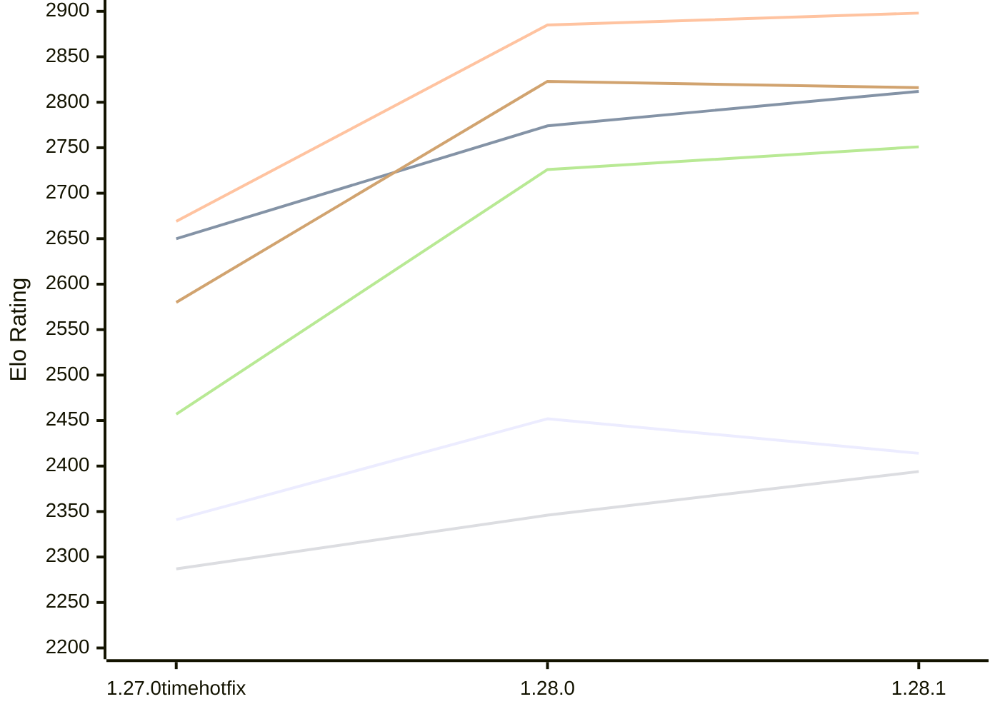
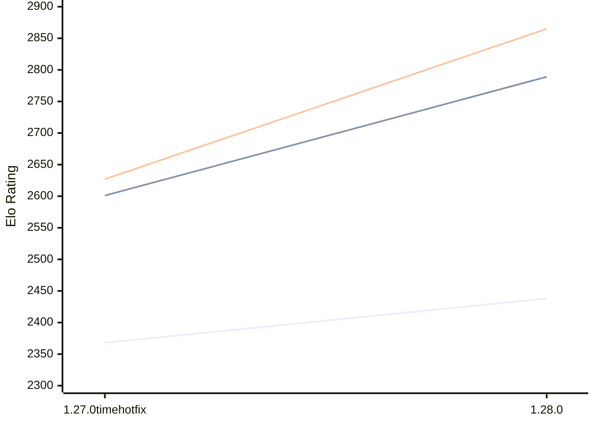

# Engine: Aurora

Author: Winston Cai

Home: https://github.com/kjljixx/Aurora-Chess-Engine

## Elo Ratings E1 (Ultra 7 265T (1.50 GHz) - E-Core)

| Version | Published | STC 8.0+0.08s  | LTC 60.0+0.60s | VLTC 2m24s+1.12s | Comment |
| --- | --- | --- | --- | --- | --- |
| 1.28.1 | 2026-10-25 | 2414(-38) | 2812(+38) | 2898(+13) |  |
| 1.28.0 | 2026-09-21 | 2452(+111) | 2774(+124) | 2885(+216) |  |
| 1.27.0timehotfix | 2026-05-28 | 2341 | 2650 | 2669 |  |
 | | | cElo (∆ prev) | cElo (∆ prev) | cElo (∆ prev) | 

## Elo Ratings P1 (Ultra 7 265T (1.50 GHz) - P-Core)

| Version | Published | STC 8.0+0.08s  | LTC 60.0+0.60s | VLTC 2m24s+1.12s | Comment |
| --- | --- | --- | --- | --- | --- |
| 1.28.1 | 2026-10-25 | 2394(+48) | 2751(+25) | 2816(-7) |  |
| 1.28.0 | 2026-09-21 | 2346(+59) | 2726(+269) | 2823(+243) |  |
| 1.27.0timehotfix | 2026-05-28 | 2287 | 2457 | 2580 |  |
 | | | cElo (∆ prev) | cElo (∆ prev) | cElo (∆ prev) | 

## Elo Ratings T1 (i5-7500T 2.70GHz)

| Version | Published | STC 8.0+0.08s  | LTC 60.0+0.60s | VLTC 2m24s+1.12s | Comment |
| --- | --- | --- | --- | --- | --- |
| 1.28.0 | 2026-09-21 | 2438(+70) | 2789(+188) | 2865(+238) |  |
| 1.27.0timehotfix | 2026-05-28 | 2368 | 2601 | 2627 |  |
 | | | cElo (∆ prev) | cElo (∆ prev) | cElo (∆ prev) | 

<a href="https://github.com/computer-chess-index/cci/issues/new?template=submit-version.yml&title=[VERSION]+Aurora+<version>&body=###%20Engine%20name%0AAurora%0A%0A###%20Version%0A1.28.0" target="_blank">Submit new version</a>

 Test Conditions:

GUI/CLI: <a href=https://github.com/cutechess/cutechess target="_blank">Cute-Chess</a> 
Elo Calculation: <a href=https://www.remi-coulom.fr/Bayesian-Elo/ target="_blank">Bayesian-Elo</a> 
CPU for P1: Intel(R) Core(TM) Ultra 7 265T (1.50 GHz) - P-Core 
CPU for E1: Intel(R) Core(TM) Ultra 7 265T (1.50 GHz) - E-Core 
CPU for T1: Intel(R) Core(TM) i5-7500T 2.70GHz 
Opening book: 8_moves_v3 
\* STC: 8.0+0.08s, LTC: 60.0+0.60s, VLTC: 2m24s+1.12s

 Lists:
Ratings: <a href=https://github.com/computer-chess-index/cci/blob/main/lists/CCIRatings.csv target="_blank">Complete list</a>

Generated: 2026-11-17 05:36:19

## Ratings Verlauf E1 / P1

```mermaid
%%{init: {"theme":"base","themeVariables":{"seriesColors:['#a3a3a3','#222221','#faa371']}}}%%
xychart-beta
  x-axis ["1.27.0timehotfix", "1.28.0", "1.28.1"]
  y-axis "Elo Rating" 2200 --> 2900
  line "E1: STC (8.0+0.08s)" [2341, 2452, 2414]
  line "E1: LTC (60.0+0.60s)" [2650, 2774, 2812]
  line "E1: VLTC (2m24s+1.12s)" [2669, 2885, 2898]
  line "P1: STC (8.0+0.08s)" [2287, 2346, 2394]
  line "P1: LTC (60.0+0.60s)" [2457, 2726, 2751]
  line "P1: VLTC (2m24s+1.12s)" [2580, 2823, 2816]
```

## Ratings Verlauf T1

```mermaid
%%{init: {"theme":"base","themeVariables":{"seriesColors:['#a3a3a3','#222221','#faa371']}}}%%
xychart-beta
  x-axis ["1.27.0timehotfix", "1.28.0"]
  y-axis "Elo Rating" 2300 --> 2900
  line "T1: STC (8.0+0.08s)" [2368, 2438]
  line "T1: LTC (60.0+0.60s)" [2601, 2789]
  line "T1: VLTC (2m24s+1.12s)" [2627, 2865]
```

## Detailed Evaluation Results

| Version | Time Control | Variant | Elo  | Range +/- | Matches | Score | Average Opponent Elo | Draws |
| --- | --- |--- | --- | --- | --- | --- | --- | --- |
| 1.28.1 | VLTC (2m24s+1.12s) | P1 | 2816 | 39 | 202 | 50% | 2822 | 40% |
|  |  | E1 | 2898 | 33 | 272 | 50% | 2900 | 43% |
|  | LTC (60.0+0.60s) | P1 | 2751 | 37 | 246 | 46% | 2790 | 30% |
|  |  | E1 | 2812 | 32 | 308 | 48% | 2827 | 35% |
|  | STC (8.0+0.08s) | P1 | 2394 | 44 | 180 | 48% | 2415 | 24% |
|  |  | E1 | 2414 | 36 | 266 | 51% | 2408 | 26% |
| --- | --- |--- | --- | --- | --- | --- | --- | --- |
| 1.28.0 | VLTC (2m24s+1.12s) | P1 | 2823 | 42 | 166 | 48% | 2839 | 42% |
|  |  | E1 | 2885 | 31 | 342 | 53% | 2855 | 35% |
|  |  | T1 | 2865 | 41 | 188 | 54% | 2824 | 37% |
|  | LTC (60.0+0.60s) | P1 | 2726 | 40 | 208 | 55% | 2649 | 35% |
|  |  | E1 | 2774 | 36 | 248 | 49% | 2780 | 37% |
|  |  | T1 | 2789 | 34 | 280 | 56% | 2738 | 38% |
|  | STC (8.0+0.08s) | P1 | 2346 | 42 | 204 | 45% | 2407 | 22% |
|  |  | E1 | 2452 | 42 | 212 | 50% | 2450 | 18% |
|  |  | T1 | 2438 | 39 | 234 | 49% | 2452 | 23% |
| --- | --- |--- | --- | --- | --- | --- | --- | --- |
| 1.27.0timehotfix | VLTC (2m24s+1.12s) | T1 | 2627 | 28 | 408 | 48% | 2642 | 32% |
|  |  | P1 | 2580 | 33 | 296 | 44% | 2646 | 36% |
|  |  | E1 | 2669 | 36 | 248 | 47% | 2701 | 33% |
|  | LTC (60.0+0.60s) | T1 | 2601 | 28 | 434 | 51% | 2593 | 29% |
|  |  | P1 | 2457 | 42 | 206 | 53% | 2434 | 24% |
|  |  | E1 | 2650 | 37 | 252 | 53% | 2584 | 31% |
|  | STC (8.0+0.08s) | T1 | 2368 | 28 | 448 | 49% | 2381 | 22% |
|  |  | P1 | 2287 | 43 | 192 | 45% | 2349 | 24% |
|  |  | E1 | 2341 | 39 | 236 | 49% | 2348 | 20% |