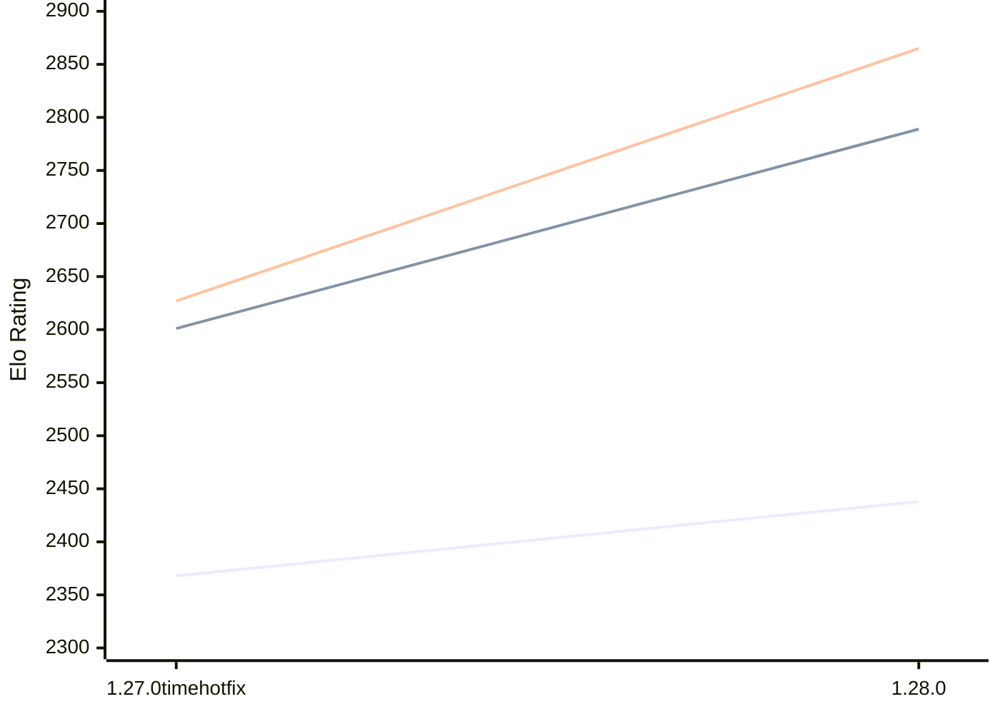

# Engine: Aurora

Author: Winston Cai

Home: https://github.com/kjljixx/Aurora-Chess-Engine

## Elo Ratings E1 (Ultra 7 265T (1.50 GHz) - E-Core)

| Version | Published | STC 8.0+0.08s  | LTC 60.0+0.60s | VLTC 2m24s+1.12s | Comment |
| --- | --- | --- | --- | --- | --- |
| 1.28.1 | 2026-10-25 | 2415(-34) | 2808(+35) | 2894(+12) |  |
| 1.28.0 | 2026-09-21 | 2449(+111) | 2773(+124) | 2882(+213) |  |
| 1.27.0timehotfix | 2026-05-28 | 2338 | 2649 | 2669 |  |
 | | | cElo (∆ prev) | cElo (∆ prev) | cElo (∆ prev) | 

## Elo Ratings P1 (Ultra 7 265T (1.50 GHz) - P-Core)

| Version | Published | STC 8.0+0.08s  | LTC 60.0+0.60s | VLTC 2m24s+1.12s | Comment |
| --- | --- | --- | --- | --- | --- |
| 1.28.1 | 2026-10-25 | 2407(+42) | 2766(+21) | 2824(-10) |  |
| 1.28.0 | 2026-09-21 | 2365(+67) | 2745(+276) | 2834(+242) |  |
| 1.27.0timehotfix | 2026-05-28 | 2298 | 2469 | 2592 |  |
 | | | cElo (∆ prev) | cElo (∆ prev) | cElo (∆ prev) | 

## Elo Ratings T1 (i5-7500T 2.70GHz)

| Version | Published | STC 8.0+0.08s  | LTC 60.0+0.60s | VLTC 2m24s+1.12s | Comment |
| --- | --- | --- | --- | --- | --- |
| 1.28.0 | 2026-09-21 | 2438(+70) | 2789(+188) | 2865(+238) |  |
| 1.27.0timehotfix | 2026-05-28 | 2368 | 2601 | 2627 |  |
 | | | cElo (∆ prev) | cElo (∆ prev) | cElo (∆ prev) | 

<a href="https://github.com/computer-chess-index/cci/issues/new?template=submit-version.yml&title=[VERSION]+Aurora+<version>&body=###%20Engine%20name%0AAurora%0A%0A###%20Version%0A1.28.0" target="_blank">Submit new version</a>

 Test Conditions:

GUI/CLI: <a href=https://github.com/cutechess/cutechess target="_blank">Cute-Chess</a> 
Elo Calculation: <a href=https://www.remi-coulom.fr/Bayesian-Elo/ target="_blank">Bayesian-Elo</a> 
CPU for P1: Intel(R) Core(TM) Ultra 7 265T (1.50 GHz) - P-Core 
CPU for E1: Intel(R) Core(TM) Ultra 7 265T (1.50 GHz) - E-Core 
CPU for T1: Intel(R) Core(TM) i5-7500T 2.70GHz 
Opening book: 8_moves_v3 
\* STC: 8.0+0.08s, LTC: 60.0+0.60s, VLTC: 2m24s+1.12s

 Lists:
Ratings: <a href=https://github.com/computer-chess-index/cci/blob/main/lists/CCIRatings.csv target="_blank">Complete list</a>

Generated: 2026-11-20 05:36:15

## Ratings Verlauf E1 / P1

```mermaid
%%{init: {"theme":"base","themeVariables":{"seriesColors:['#a3a3a3','#222221','#faa371']}}}%%
xychart-beta
  x-axis ["1.27.0timehotfix", "1.28.0", "1.28.1"]
  y-axis "Elo Rating" 2200 --> 2900
  line "E1: STC (8.0+0.08s)" [2338, 2449, 2415]
  line "E1: LTC (60.0+0.60s)" [2649, 2773, 2808]
  line "E1: VLTC (2m24s+1.12s)" [2669, 2882, 2894]
  line "P1: STC (8.0+0.08s)" [2298, 2365, 2407]
  line "P1: LTC (60.0+0.60s)" [2469, 2745, 2766]
  line "P1: VLTC (2m24s+1.12s)" [2592, 2834, 2824]
```

## Ratings Verlauf T1

```mermaid
%%{init: {"theme":"base","themeVariables":{"seriesColors:['#a3a3a3','#222221','#faa371']}}}%%
xychart-beta
  x-axis ["1.27.0timehotfix", "1.28.0"]
  y-axis "Elo Rating" 2300 --> 2900
  line "T1: STC (8.0+0.08s)" [2368, 2438]
  line "T1: LTC (60.0+0.60s)" [2601, 2789]
  line "T1: VLTC (2m24s+1.12s)" [2627, 2865]
```

## Detailed Evaluation Results

| Version | Time Control | Variant | Elo  | Range +/- | Matches | Score | Average Opponent Elo | Draws |
| --- | --- |--- | --- | --- | --- | --- | --- | --- |
| 1.28.1 | VLTC (2m24s+1.12s) | P1 | 2824 | 37 | 218 | 49% | 2834 | 40% |
|  |  | E1 | 2894 | 33 | 282 | 50% | 2898 | 42% |
|  | LTC (60.0+0.60s) | P1 | 2766 | 37 | 252 | 47% | 2800 | 30% |
|  |  | E1 | 2808 | 32 | 322 | 48% | 2826 | 34% |
|  | STC (8.0+0.08s) | P1 | 2407 | 43 | 188 | 48% | 2430 | 25% |
|  |  | E1 | 2415 | 35 | 276 | 51% | 2407 | 26% |
| --- | --- |--- | --- | --- | --- | --- | --- | --- |
| 1.28.0 | VLTC (2m24s+1.12s) | T1 | 2865 | 41 | 188 | 54% | 2824 | 37% |
|  |  | P1 | 2834 | 41 | 172 | 48% | 2851 | 43% |
|  |  | E1 | 2882 | 31 | 342 | 53% | 2854 | 35% |
|  | LTC (60.0+0.60s) | T1 | 2789 | 34 | 280 | 56% | 2738 | 38% |
|  |  | P1 | 2745 | 39 | 216 | 55% | 2662 | 36% |
|  |  | E1 | 2773 | 36 | 248 | 49% | 2778 | 37% |
|  | STC (8.0+0.08s) | P1 | 2365 | 42 | 208 | 46% | 2421 | 22% |
|  |  | E1 | 2449 | 42 | 212 | 50% | 2448 | 18% |
|  |  | T1 | 2438 | 39 | 234 | 49% | 2452 | 23% |
| --- | --- |--- | --- | --- | --- | --- | --- | --- |
| 1.27.0timehotfix | VLTC (2m24s+1.12s) | E1 | 2669 | 36 | 248 | 47% | 2700 | 33% |
|  |  | T1 | 2627 | 28 | 408 | 48% | 2642 | 32% |
|  |  | P1 | 2592 | 33 | 296 | 44% | 2658 | 36% |
|  | LTC (60.0+0.60s) | T1 | 2601 | 28 | 434 | 51% | 2593 | 29% |
|  |  | P1 | 2469 | 42 | 206 | 53% | 2445 | 24% |
|  |  | E1 | 2649 | 37 | 252 | 53% | 2583 | 31% |
|  | STC (8.0+0.08s) | T1 | 2368 | 28 | 448 | 49% | 2381 | 22% |
|  |  | P1 | 2298 | 44 | 192 | 45% | 2361 | 24% |
|  |  | E1 | 2338 | 39 | 236 | 49% | 2346 | 20% |