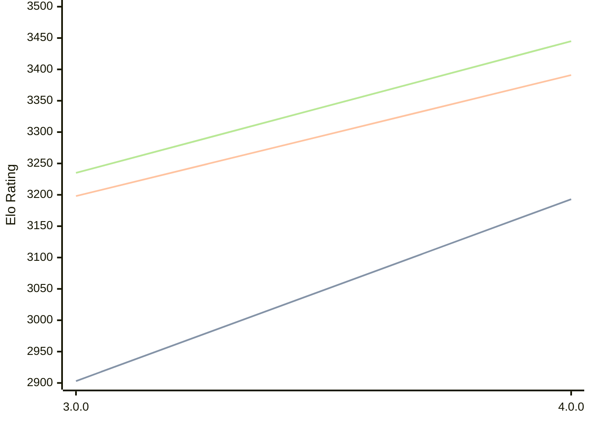

# Engine: Avalanche

Author: Yinuo Huang

Home: https://github.com/SnowballSH/Avalanche

## Elo Ratings

| Version | Published | STC 8.0+0.08s  | LTC 60.0+0.60s | VLTC 2m24s+1.12s | Comment |
| --- | --- | --- | --- | --- | --- |
| 4.0.0 | 2026-08-08 | 3193(+290) | 3391(+193) | 3445(+210) |  |
| 3.0.0 | 2026-06-25 | 2903 | 3198 | 3235 |  |
 | | | cElo (∆ prev) | cElo (∆ prev) | cElo (∆ prev) | 

<a href="https://github.com/computer-chess-index/cci/issues/new?template=submit-version.yml&title=[VERSION]+Avalanche+<version>&body=###%20Engine%20name%0AAvalanche%0A%0A###%20Version%0A4.0.0" target="_blank">Submit new version</a>

 Test Conditions:

GUI/CLI: <a href=https://github.com/cutechess/cutechess target="_blank">Cute-Chess</a> 
Elo Calculation: <a href=https://www.remi-coulom.fr/Bayesian-Elo/ target="_blank">Bayesian-Elo</a> 
CPU: Intel(R) Core(TM) i5-7500T 2.70GHz 
Opening book: 8_moves_v3 
\* STC: 8.0+0.08s, LTC: 60.0+0.60s, VLTC: 2m24s+1.12s

 Lists:
Ratings: <a href=https://github.com/computer-chess-index/cci/blob/main/lists/CCIRatings.csv target="_blank">Complete list</a>

Generated: 2026-09-24 04:36:10

## Ratings Verlauf

## Detailed Evaluation Results

| Version | Time Control | Elo  | Range +/- | Matches | Score | Average Opponent Elo | Draws |
| --- | --- | --- | --- | --- | --- | --- | --- |
| 4.0.0 | VLTC (2m24s+1.12s) | 3445 | 26 | 366 | 52% | 3429 | 79% |
| 4.0.0 | LTC (60.0+0.60s) | 3391 | 29 | 292 | 51% | 3380 | 76% |
| 4.0.0 | STC (8.0+0.08s) | 3193 | 30 | 300 | 49% | 3200 | 63% |
| --- | --- | --- | --- | --- | --- | --- | --- |
| 3.0.0 | VLTC (2m24s+1.12s) | 3235 | 32 | 262 | 53% | 3205 | 59% |
| 3.0.0 | LTC (60.0+0.60s) | 3198 | 34 | 240 | 53% | 3162 | 56% |
| 3.0.0 | STC (8.0+0.08s) | 2903 | 31 | 320 | 51% | 2892 | 41% |
| --- | --- | --- | --- | --- | --- | --- | --- |