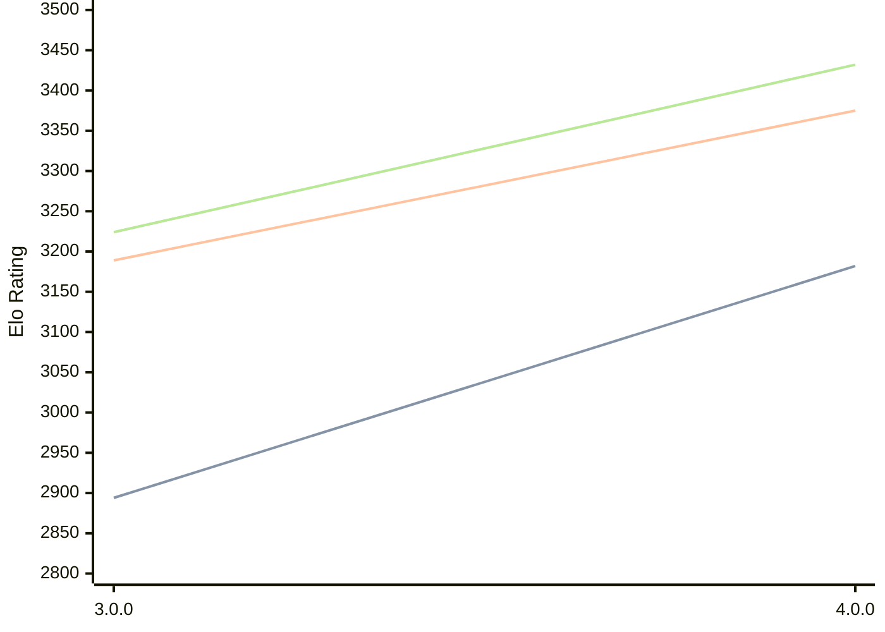

# Engine: Avalanche

Author: Yinuo Huang

Home: https://github.com/SnowballSH/Avalanche

## Elo Ratings

| Version | Published | STC 8.0+0.08s  | LTC 60.0+0.60s | VLTC 2m24s+1.12s | Comment |
| --- | --- | --- | --- | --- | --- |
| 4.0.0 | 2026-08-08 | 3182(+288) | 3375(+186) | 3432(+208) |  |
| 3.0.0 | 2026-06-25 | 2894 | 3189 | 3224 |  |
 | | | cElo (∆ prev) | cElo (∆ prev) | cElo (∆ prev) | 

<a href="https://github.com/computer-chess-index/cci/issues/new?template=submit-version.yml&title=[VERSION]+Avalanche+<version>&body=###%20Engine%20name%0AAvalanche%0A%0A###%20Version%0A4.0.0" target="_blank">Submit new version</a>

 Test Conditions:

GUI/CLI: <a href=https://github.com/cutechess/cutechess target="_blank">Cute-Chess</a> 
Elo Calculation: <a href=https://www.remi-coulom.fr/Bayesian-Elo/ target="_blank">Bayesian-Elo</a> 
CPU: Intel(R) Core(TM) i5-7500T 2.70GHz 
Opening book: 8_moves_v3 
\* STC: 8.0+0.08s, LTC: 60.0+0.60s, VLTC: 2m24s+1.12s

 Lists:
Ratings: <a href=https://github.com/computer-chess-index/cci/blob/main/lists/CCIRatings.csv target="_blank">Complete list</a>

Generated: 2026-08-25 06:22:57

## Ratings Verlauf

⬛ STC (8.0+0.08s) &nbsp;&nbsp; 🟧 LTC (60.0+0.60s) &nbsp;&nbsp; 🟩 VLTC (2m24s+1.12s)

dark mode: 🟩STC (8.0+0.08s) 🟧LTC (60.0+0.60s) ⬜VLTC (2m24s+1.12s)

## Detailed Evaluation Results

| Version | Time Control | Elo  | Range +/- | Matches | Score | Average Opponent Elo | Draws |
| --- | --- | --- | --- | --- | --- | --- | --- |
| 4.0.0 | VLTC (2m24s+1.12s) | 3432 | 27 | 334 | 52% | 3417 | 79% |
| 4.0.0 | LTC (60.0+0.60s) | 3375 | 32 | 232 | 51% | 3367 | 76% |
| 4.0.0 | STC (8.0+0.08s) | 3182 | 34 | 236 | 49% | 3189 | 58% |
| --- | --- | --- | --- | --- | --- | --- | --- |
| 3.0.0 | VLTC (2m24s+1.12s) | 3224 | 32 | 262 | 53% | 3195 | 59% |
| 3.0.0 | LTC (60.0+0.60s) | 3189 | 34 | 240 | 53% | 3152 | 56% |
| 3.0.0 | STC (8.0+0.08s) | 2894 | 31 | 320 | 51% | 2884 | 41% |
| --- | --- | --- | --- | --- | --- | --- | --- |