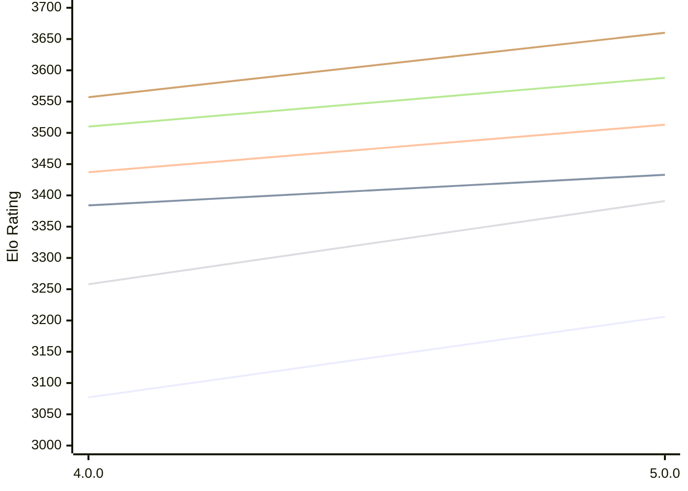
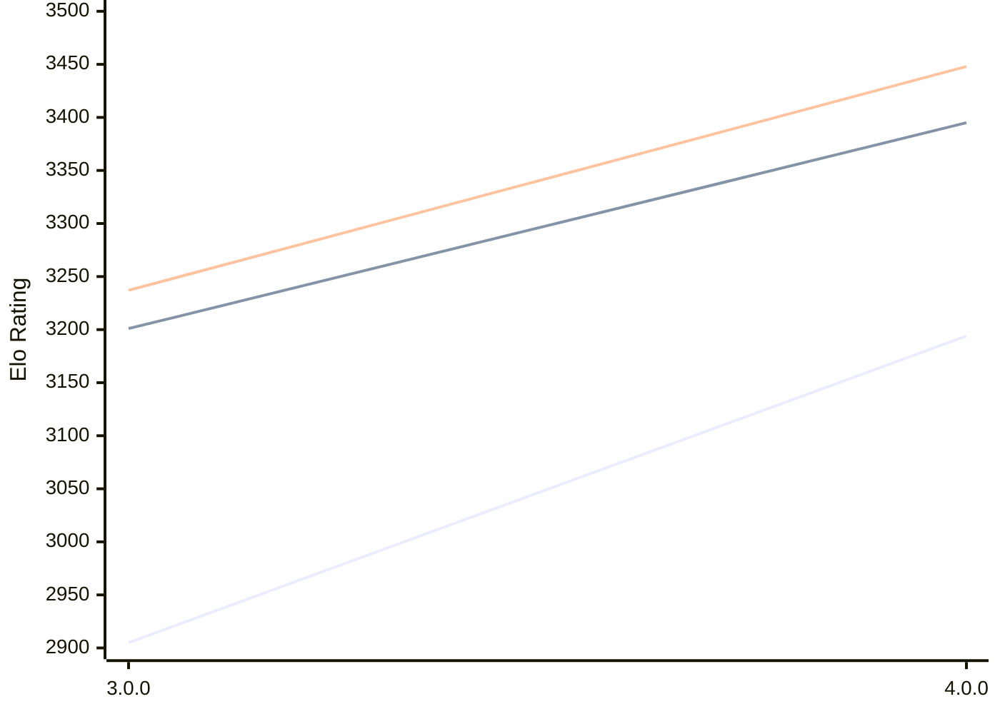

# Engine: Avalanche

Author: Yinuo Huang

Home: https://github.com/SnowballSH/Avalanche

## Elo Ratings E1 (Ultra 7 265T (1.50 GHz) - E-Core)

| Version | Published | STC 8.0+0.08s  | LTC 60.0+0.60s | VLTC 2m24s+1.12s | Comment |
| --- | --- | --- | --- | --- | --- |
| 5.0.0 | 2026-10-11 | 3206(+129) | 3433(+49) | 3513(+76) |  |
| 4.0.0 | 2026-08-08 | 3077 | 3384 | 3437 |  |
 | | | cElo (∆ prev) | cElo (∆ prev) | cElo (∆ prev) | 

## Elo Ratings P1 (Ultra 7 265T (1.50 GHz) - P-Core)

| Version | Published | STC 8.0+0.08s  | LTC 60.0+0.60s | VLTC 2m24s+1.12s | Comment |
| --- | --- | --- | --- | --- | --- |
| 5.0.0 | 2026-10-11 | 3391(+133) | 3588(+78) | 3660(+103) |  |
| 4.0.0 | 2026-08-08 | 3258 | 3510 | 3557 |  |
 | | | cElo (∆ prev) | cElo (∆ prev) | cElo (∆ prev) | 

## Elo Ratings T1 (i5-7500T 2.70GHz)

| Version | Published | STC 8.0+0.08s  | LTC 60.0+0.60s | VLTC 2m24s+1.12s | Comment |
| --- | --- | --- | --- | --- | --- |
| 4.0.0 | 2026-08-08 | 3194(+289) | 3395(+194) | 3448(+211) |  |
| 3.0.0 | 2026-06-25 | 2905 | 3201 | 3237 |  |
 | | | cElo (∆ prev) | cElo (∆ prev) | cElo (∆ prev) | 

<a href="https://github.com/computer-chess-index/cci/issues/new?template=submit-version.yml&title=[VERSION]+Avalanche+<version>&body=###%20Engine%20name%0AAvalanche%0A%0A###%20Version%0A4.0.0" target="_blank">Submit new version</a>

 Test Conditions:

GUI/CLI: <a href=https://github.com/cutechess/cutechess target="_blank">Cute-Chess</a> 
Elo Calculation: <a href=https://www.remi-coulom.fr/Bayesian-Elo/ target="_blank">Bayesian-Elo</a> 
CPU for P1: Intel(R) Core(TM) Ultra 7 265T (1.50 GHz) - P-Core 
CPU for E1: Intel(R) Core(TM) Ultra 7 265T (1.50 GHz) - E-Core 
CPU for T1: Intel(R) Core(TM) i5-7500T 2.70GHz 
Opening book: 8_moves_v3 
\* STC: 8.0+0.08s, LTC: 60.0+0.60s, VLTC: 2m24s+1.12s

 Lists:
Ratings: <a href=https://github.com/computer-chess-index/cci/blob/main/lists/CCIRatings.csv target="_blank">Complete list</a>

Generated: 2026-10-18 04:36:14

## Ratings Verlauf E1 / P1

```mermaid
%%{init: {"theme":"base","themeVariables":{"seriesColors:['#a3a3a3','#222221','#faa371']}}}%%
xychart-beta
  x-axis ["4.0.0", "5.0.0"]
  y-axis "Elo Rating" 3000 --> 3700
  line "E1: STC (8.0+0.08s)" [3077, 3206]
  line "E1: LTC (60.0+0.60s)" [3384, 3433]
  line "E1: VLTC (2m24s+1.12s)" [3437, 3513]
  line "P1: STC (8.0+0.08s)" [3258, 3391]
  line "P1: LTC (60.0+0.60s)" [3510, 3588]
  line "P1: VLTC (2m24s+1.12s)" [3557, 3660]
```

## Ratings Verlauf T1

```mermaid
%%{init: {"theme":"base","themeVariables":{"seriesColors:['#a3a3a3','#222221','#faa371']}}}%%
xychart-beta
  x-axis ["3.0.0", "4.0.0"]
  y-axis "Elo Rating" 2900 --> 3500
  line "T1: STC (8.0+0.08s)" [2905, 3194]
  line "T1: LTC (60.0+0.60s)" [3201, 3395]
  line "T1: VLTC (2m24s+1.12s)" [3237, 3448]
```

## Detailed Evaluation Results

| Version | Time Control | Variant | Elo  | Range +/- | Matches | Score | Average Opponent Elo | Draws |
| --- | --- |--- | --- | --- | --- | --- | --- | --- |
| 5.0.0 | VLTC (2m24s+1.12s) | P1 | 3660 | 44 | 122 | 50% | 3663 | 78% |
|  |  | E1 | 3513 | 39 | 156 | 52% | 3499 | 78% |
|  | LTC (60.0+0.60s) | P1 | 3588 | 47 | 110 | 52% | 3573 | 75% |
|  |  | E1 | 3433 | 33 | 224 | 53% | 3411 | 71% |
|  | STC (8.0+0.08s) | P1 | 3391 | 39 | 166 | 49% | 3393 | 65% |
|  |  | E1 | 3206 | 37 | 190 | 51% | 3197 | 63% |
| --- | --- |--- | --- | --- | --- | --- | --- | --- |
| 4.0.0 | VLTC (2m24s+1.12s) | T1 | 3448 | 26 | 370 | 52% | 3432 | 79% |
|  |  | P1 | 3557 | 36 | 178 | 48% | 3567 | 81% |
|  |  | E1 | 3437 | 31 | 252 | 50% | 3438 | 75% |
|  | LTC (60.0+0.60s) | T1 | 3395 | 28 | 304 | 51% | 3384 | 75% |
|  |  | P1 | 3510 | 39 | 164 | 50% | 3507 | 73% |
|  |  | E1 | 3384 | 33 | 244 | 50% | 3386 | 64% |
|  | STC (8.0+0.08s) | T1 | 3194 | 29 | 312 | 49% | 3204 | 63% |
|  |  | P1 | 3258 | 37 | 204 | 47% | 3282 | 55% |
|  |  | E1 | 3077 | 30 | 304 | 44% | 3121 | 59% |
| --- | --- |--- | --- | --- | --- | --- | --- | --- |
| 3.0.0 | VLTC (2m24s+1.12s) | T1 | 3237 | 32 | 262 | 53% | 3208 | 59% |
|  | LTC (60.0+0.60s) | T1 | 3201 | 34 | 240 | 53% | 3164 | 56% |
|  | STC (8.0+0.08s) | T1 | 2905 | 31 | 320 | 51% | 2894 | 41% |