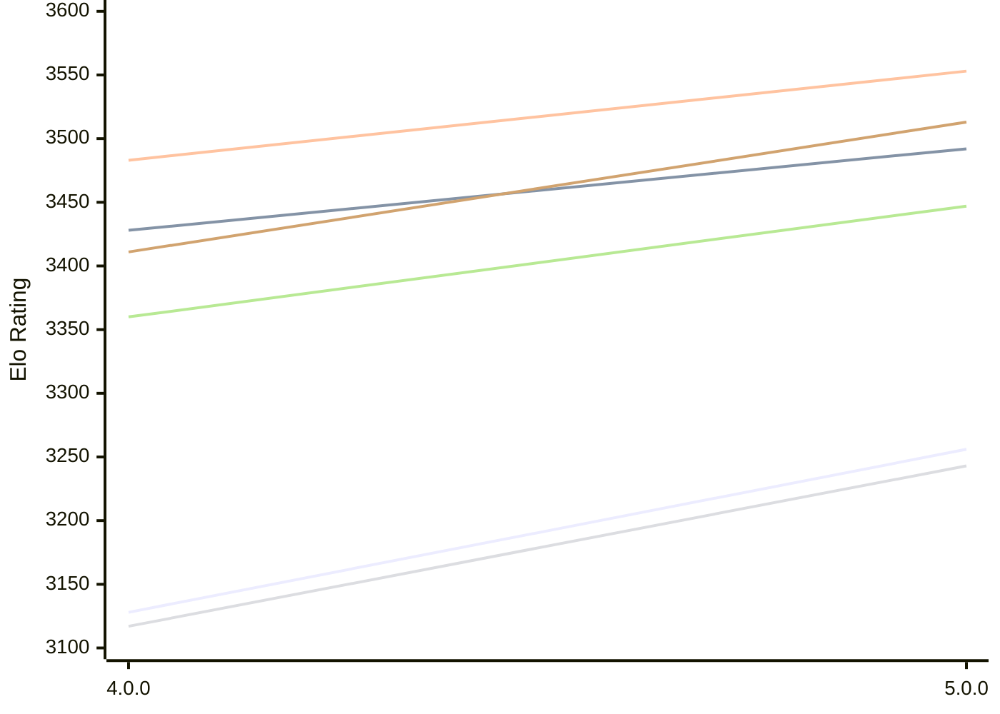
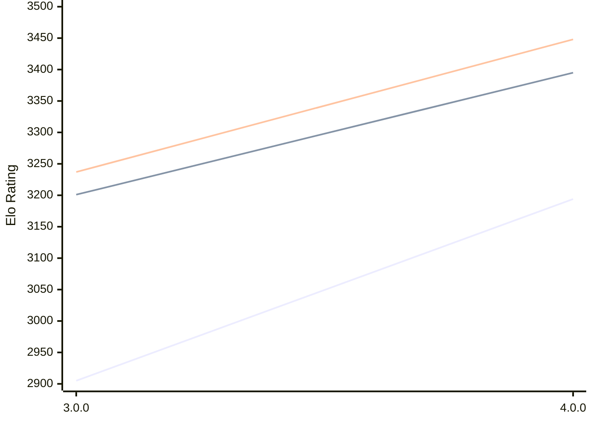

# Engine: Avalanche

Author: Yinuo Huang

Home: https://github.com/SnowballSH/Avalanche

## Elo Ratings E1 (Ultra 7 265T (1.50 GHz) - E-Core)

| Version | Published | STC 8.0+0.08s  | LTC 60.0+0.60s | VLTC 2m24s+1.12s | Comment |
| --- | --- | --- | --- | --- | --- |
| 5.0.0 | 2026-10-11 | 3256(+128) | 3492(+64) | 3553(+70) |  |
| 4.0.0 | 2026-08-08 | 3128 | 3428 | 3483 |  |
 | | | cElo (∆ prev) | cElo (∆ prev) | cElo (∆ prev) | 

## Elo Ratings P1 (Ultra 7 265T (1.50 GHz) - P-Core)

| Version | Published | STC 8.0+0.08s  | LTC 60.0+0.60s | VLTC 2m24s+1.12s | Comment |
| --- | --- | --- | --- | --- | --- |
| 5.0.0 | 2026-10-11 | 3243(+126) | 3447(+87) | 3513(+102) |  |
| 4.0.0 | 2026-08-08 | 3117 | 3360 | 3411 |  |
 | | | cElo (∆ prev) | cElo (∆ prev) | cElo (∆ prev) | 

## Elo Ratings T1 (i5-7500T 2.70GHz)

| Version | Published | STC 8.0+0.08s  | LTC 60.0+0.60s | VLTC 2m24s+1.12s | Comment |
| --- | --- | --- | --- | --- | --- |
| 4.0.0 | 2026-08-08 | 3194(+289) | 3395(+194) | 3448(+211) |  |
| 3.0.0 | 2026-06-25 | 2905 | 3201 | 3237 |  |
 | | | cElo (∆ prev) | cElo (∆ prev) | cElo (∆ prev) | 

<a href="https://github.com/computer-chess-index/cci/issues/new?template=submit-version.yml&title=[VERSION]+Avalanche+<version>&body=###%20Engine%20name%0AAvalanche%0A%0A###%20Version%0A4.0.0" target="_blank">Submit new version</a>

 Test Conditions:

GUI/CLI: <a href=https://github.com/cutechess/cutechess target="_blank">Cute-Chess</a> 
Elo Calculation: <a href=https://www.remi-coulom.fr/Bayesian-Elo/ target="_blank">Bayesian-Elo</a> 
CPU for P1: Intel(R) Core(TM) Ultra 7 265T (1.50 GHz) - P-Core 
CPU for E1: Intel(R) Core(TM) Ultra 7 265T (1.50 GHz) - E-Core 
CPU for T1: Intel(R) Core(TM) i5-7500T 2.70GHz 
Opening book: 8_moves_v3 
\* STC: 8.0+0.08s, LTC: 60.0+0.60s, VLTC: 2m24s+1.12s

 Lists:
Ratings: <a href=https://github.com/computer-chess-index/cci/blob/main/lists/CCIRatings.csv target="_blank">Complete list</a>

Generated: 2026-11-20 05:36:18

## Ratings Verlauf E1 / P1

```mermaid
%%{init: {"theme":"base","themeVariables":{"seriesColors:['#a3a3a3','#222221','#faa371']}}}%%
xychart-beta
  x-axis ["4.0.0", "5.0.0"]
  y-axis "Elo Rating" 3100 --> 3600
  line "E1: STC (8.0+0.08s)" [3128, 3256]
  line "E1: LTC (60.0+0.60s)" [3428, 3492]
  line "E1: VLTC (2m24s+1.12s)" [3483, 3553]
  line "P1: STC (8.0+0.08s)" [3117, 3243]
  line "P1: LTC (60.0+0.60s)" [3360, 3447]
  line "P1: VLTC (2m24s+1.12s)" [3411, 3513]
```

## Ratings Verlauf T1

```mermaid
%%{init: {"theme":"base","themeVariables":{"seriesColors:['#a3a3a3','#222221','#faa371']}}}%%
xychart-beta
  x-axis ["3.0.0", "4.0.0"]
  y-axis "Elo Rating" 2900 --> 3500
  line "T1: STC (8.0+0.08s)" [2905, 3194]
  line "T1: LTC (60.0+0.60s)" [3201, 3395]
  line "T1: VLTC (2m24s+1.12s)" [3237, 3448]
```

## Detailed Evaluation Results

| Version | Time Control | Variant | Elo  | Range +/- | Matches | Score | Average Opponent Elo | Draws |
| --- | --- |--- | --- | --- | --- | --- | --- | --- |
| 5.0.0 | VLTC (2m24s+1.12s) | E1 | 3553 | 31 | 244 | 50% | 3551 | 78% |
|  |  | P1 | 3513 | 36 | 178 | 49% | 3519 | 81% |
|  | LTC (60.0+0.60s) | E1 | 3492 | 25 | 386 | 52% | 3475 | 71% |
|  |  | P1 | 3447 | 38 | 166 | 52% | 3434 | 77% |
|  | STC (8.0+0.08s) | E1 | 3256 | 27 | 358 | 49% | 3263 | 66% |
|  |  | P1 | 3243 | 32 | 252 | 49% | 3248 | 65% |
| --- | --- |--- | --- | --- | --- | --- | --- | --- |
| 4.0.0 | VLTC (2m24s+1.12s) | E1 | 3483 | 30 | 272 | 49% | 3491 | 75% |
|  |  | T1 | 3448 | 26 | 370 | 52% | 3432 | 79% |
|  |  | P1 | 3411 | 35 | 190 | 48% | 3420 | 81% |
|  | LTC (60.0+0.60s) | E1 | 3428 | 30 | 292 | 49% | 3437 | 63% |
|  |  | T1 | 3395 | 28 | 304 | 51% | 3384 | 75% |
|  |  | P1 | 3360 | 37 | 176 | 49% | 3364 | 73% |
|  | STC (8.0+0.08s) | E1 | 3128 | 29 | 332 | 45% | 3148 | 58% |
|  |  | T1 | 3194 | 29 | 312 | 49% | 3204 | 63% |
|  |  | P1 | 3117 | 36 | 216 | 46% | 3147 | 56% |
| --- | --- |--- | --- | --- | --- | --- | --- | --- |
| 3.0.0 | VLTC (2m24s+1.12s) | T1 | 3237 | 32 | 262 | 53% | 3208 | 59% |
|  | LTC (60.0+0.60s) | T1 | 3201 | 34 | 240 | 53% | 3164 | 56% |
|  | STC (8.0+0.08s) | T1 | 2905 | 31 | 320 | 51% | 2894 | 41% |