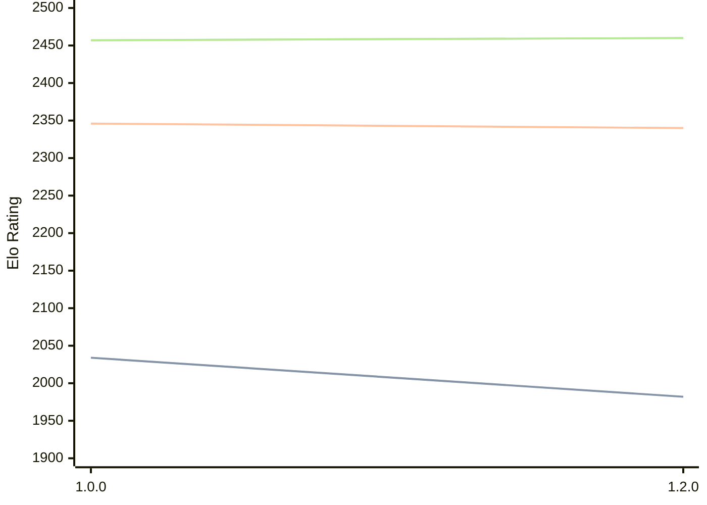

# Engine: Basilisk

Author: Miloslav Macůrek

Home: https://github.com/maelic13/basilisk

## Elo Ratings

| Version | Published | STC 8.0+0.08s  | LTC 60.0+0.60s | VLTC 2m24s+1.12s | Comment |
| --- | --- | --- | --- | --- | --- |
| 1.2.0 | 2026-05-21 | 1982(+new) | 2340(+new) | 2460(+new) |  |
| 1.1.0 | 2026-05-21 |  |  |  |  |
| 1.0.0 | 2026-05-20 | 2034 | 2346 | 2457 |  |
 | | | cElo (∆ prev) | cElo (∆ prev) | cElo (∆ prev) | 

<a href="https://github.com/computer-chess-index/cci/issues/new?template=submit-version.yml&title=[VERSION]+Basilisk+<version>&body=###%20Engine%20name%0ABasilisk%0A%0A###%20Version%0A1.2.0" target="_blank">Submit new version</a>

 Test Conditions:

GUI/CLI: <a href=https://github.com/cutechess/cutechess target="_blank">Cute-Chess</a> 
Elo Calculation: <a href=https://www.remi-coulom.fr/Bayesian-Elo/ target="_blank">Bayesian-Elo</a> 
CPU: Intel(R) Core(TM) i5-7500T 2.70GHz 
Opening book: 8_moves_v3 
\* STC: 8.0+0.08s, LTC: 60.0+0.60s, VLTC: 2m24s+1.12s

 Lists:
Ratings: <a href=https://github.com/computer-chess-index/cci/blob/main/lists/CCIRatings.csv target="_blank">Complete list</a>

Generated: 2026-05-22 14:52:11

## Ratings Verlauf

⬛ STC (8.0+0.08s) &nbsp;&nbsp; 🟧 LTC (60.0+0.60s) &nbsp;&nbsp; 🟩 VLTC (2m24s+1.12s)

dark mode: 🟩STC (8.0+0.08s) 🟧LTC (60.0+0.60s) ⬜VLTC (2m24s+1.12s)

## Detailed Evaluation Results

| Version | Time Control | Elo  | Range +/- | Matches | Score | Average Opponent Elo | Draws |
| --- | --- | --- | --- | --- | --- | --- | --- |
| 1.2.0 | VLTC (2m24s+1.12s) | 2460 | 55 | 110 | 52% | 2442 | 25% |
| 1.2.0 | LTC (60.0+0.60s) | 2340 | 66 | 76 | 48% | 2357 | 28% |
| 1.2.0 | STC (8.0+0.08s) | 1982 | 75 | 68 | 49% | 1998 | 12% |
| --- | --- | --- | --- | --- | --- | --- | --- |
| 1.0.0 | VLTC (2m24s+1.12s) | 2457 | 48 | 154 | 49% | 2464 | 19% |
| 1.0.0 | LTC (60.0+0.60s) | 2346 | 45 | 180 | 56% | 2264 | 21% |
| 1.0.0 | STC (8.0+0.08s) | 2034 | 50 | 152 | 57% | 1947 | 19% |
| --- | --- | --- | --- | --- | --- | --- | --- |