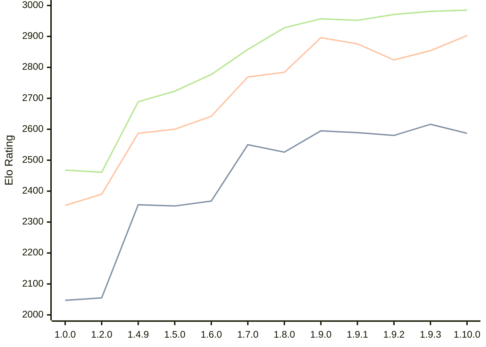

# Engine: Basilisk

Author: Miloslav Macůrek

Home: https://github.com/maelic13/basilisk

## Elo Ratings

| Version | Published | STC 8.0+0.08s  | LTC 60.0+0.60s | VLTC 2m24s+1.12s | Comment |
| --- | --- | --- | --- | --- | --- |
| 1.10.0 | 2026-09-10 | 2587(-29) | 2903(+49) | 2985(+4) |  |
| 1.9.3 | 2026-08-02 | 2616(+36) | 2854(+30) | 2981(+10) |  |
| 1.9.2 | 2026-08-01 | 2580(-9) | 2824(-52) | 2971(+19) |  |
| 1.9.1 | 2026-07-24 | 2589(-6) | 2876(-20) | 2952(-5) |  |
| 1.9.0 | 2026-07-18 | 2595(+69) | 2896(+112) | 2957(+29) |  |
| 1.8.0 | 2026-07-08 | 2526(-24) | 2784(+15) | 2928(+70) |  |
| 1.7.0 | 2026-06-29 | 2550(+182) | 2769(+127) | 2858(+81) |  |
| 1.6.0 | 2026-06-20 | 2368(+16) | 2642(+42) | 2777(+54) |  |
| 1.5.0 | 2026-06-10 | 2352(-4) | 2600(+13) | 2723(+34) |  |
| 1.4.9 | 2026-05-29 | 2356(+new) | 2587(+new) | 2689(+new) |  |
| 1.4.8 | 2026-05-28 |  |  |  |  |
| 1.4.7 | 2026-05-28 |  |  |  |  |
| 1.4.6 | 2026-05-28 |  |  |  |  |
| 1.4.5 | 2026-05-28 |  |  |  |  |
| 1.4.4 | 2026-05-28 |  |  |  |  |
| 1.4.3 | 2026-05-27 |  |  |  |  |
| 1.4.2 | 2026-05-26 |  |  |  |  |
| 1.4.0 | 2026-05-25 |  |  |  |  |
| 1.3.0 | 2026-05-25 |  |  |  |  |
| 1.2.3 | 2026-05-24 |  |  |  |  |
| 1.2.2 | 2026-05-22 |  |  |  |  |
| 1.2.1 | 2026-05-22 |  |  |  |  |
| 1.2.0 | 2026-05-21 | 2055(+new) | 2390(+new) | 2461(+new) |  |
| 1.1.0 | 2026-05-21 |  |  |  |  |
| 1.0.0 | 2026-05-20 | 2047 | 2354 | 2468 |  |
 | | | cElo (∆ prev) | cElo (∆ prev) | cElo (∆ prev) | 

<a href="https://github.com/computer-chess-index/cci/issues/new?template=submit-version.yml&title=[VERSION]+Basilisk+<version>&body=###%20Engine%20name%0ABasilisk%0A%0A###%20Version%0A1.10.0" target="_blank">Submit new version</a>

 Test Conditions:

GUI/CLI: <a href=https://github.com/cutechess/cutechess target="_blank">Cute-Chess</a> 
Elo Calculation: <a href=https://www.remi-coulom.fr/Bayesian-Elo/ target="_blank">Bayesian-Elo</a> 
CPU: Intel(R) Core(TM) i5-7500T 2.70GHz 
Opening book: 8_moves_v3 
\* STC: 8.0+0.08s, LTC: 60.0+0.60s, VLTC: 2m24s+1.12s

 Lists:
Ratings: <a href=https://github.com/computer-chess-index/cci/blob/main/lists/CCIRatings.csv target="_blank">Complete list</a>

Generated: 2026-09-26 04:36:13

## Ratings Verlauf

## Detailed Evaluation Results

| Version | Time Control | Elo  | Range +/- | Matches | Score | Average Opponent Elo | Draws |
| --- | --- | --- | --- | --- | --- | --- | --- |
| 1.10.0 | VLTC (2m24s+1.12s) | 2985 | 35 | 254 | 54% | 2954 | 37% |
| 1.10.0 | LTC (60.0+0.60s) | 2903 | 35 | 252 | 52% | 2886 | 39% |
| 1.10.0 | STC (8.0+0.08s) | 2587 | 30 | 354 | 47% | 2618 | 32% |
| --- | --- | --- | --- | --- | --- | --- | --- |
| 1.9.3 | VLTC (2m24s+1.12s) | 2981 | 32 | 306 | 50% | 2984 | 41% |
| 1.9.3 | LTC (60.0+0.60s) | 2854 | 30 | 348 | 48% | 2877 | 37% |
| 1.9.3 | STC (8.0+0.08s) | 2616 | 33 | 308 | 50% | 2615 | 29% |
| --- | --- | --- | --- | --- | --- | --- | --- |
| 1.9.2 | VLTC (2m24s+1.12s) | 2971 | 36 | 252 | 52% | 2952 | 35% |
| 1.9.2 | LTC (60.0+0.60s) | 2824 | 37 | 232 | 52% | 2804 | 36% |
| 1.9.2 | STC (8.0+0.08s) | 2580 | 38 | 232 | 50% | 2584 | 31% |
| --- | --- | --- | --- | --- | --- | --- | --- |
| 1.9.1 | VLTC (2m24s+1.12s) | 2952 | 35 | 258 | 50% | 2955 | 37% |
| 1.9.1 | LTC (60.0+0.60s) | 2876 | 36 | 236 | 51% | 2866 | 39% |
| 1.9.1 | STC (8.0+0.08s) | 2589 | 36 | 252 | 49% | 2597 | 28% |
| --- | --- | --- | --- | --- | --- | --- | --- |
| 1.9.0 | VLTC (2m24s+1.12s) | 2957 | 36 | 238 | 50% | 2961 | 39% |
| 1.9.0 | LTC (60.0+0.60s) | 2896 | 37 | 230 | 50% | 2901 | 39% |
| 1.9.0 | STC (8.0+0.08s) | 2595 | 34 | 286 | 53% | 2562 | 30% |
| --- | --- | --- | --- | --- | --- | --- | --- |
| 1.8.0 | VLTC (2m24s+1.12s) | 2928 | 45 | 148 | 51% | 2924 | 41% |
| 1.8.0 | LTC (60.0+0.60s) | 2784 | 43 | 172 | 50% | 2786 | 32% |
| 1.8.0 | STC (8.0+0.08s) | 2526 | 44 | 168 | 51% | 2520 | 33% |
| --- | --- | --- | --- | --- | --- | --- | --- |
| 1.7.0 | VLTC (2m24s+1.12s) | 2858 | 45 | 148 | 48% | 2876 | 43% |
| 1.7.0 | LTC (60.0+0.60s) | 2769 | 45 | 156 | 48% | 2786 | 33% |
| 1.7.0 | STC (8.0+0.08s) | 2550 | 45 | 170 | 51% | 2537 | 26% |
| --- | --- | --- | --- | --- | --- | --- | --- |
| 1.6.0 | VLTC (2m24s+1.12s) | 2777 | 48 | 132 | 53% | 2754 | 37% |
| 1.6.0 | LTC (60.0+0.60s) | 2642 | 55 | 112 | 48% | 2657 | 29% |
| 1.6.0 | STC (8.0+0.08s) | 2368 | 50 | 126 | 52% | 2354 | 38% |
| --- | --- | --- | --- | --- | --- | --- | --- |
| 1.5.0 | VLTC (2m24s+1.12s) | 2723 | 34 | 284 | 52% | 2704 | 31% |
| 1.5.0 | LTC (60.0+0.60s) | 2600 | 36 | 258 | 50% | 2597 | 25% |
| 1.5.0 | STC (8.0+0.08s) | 2352 | 36 | 278 | 51% | 2342 | 21% |
| --- | --- | --- | --- | --- | --- | --- | --- |
| 1.4.9 | VLTC (2m24s+1.12s) | 2689 | 58 | 100 | 51% | 2680 | 26% |
| 1.4.9 | LTC (60.0+0.60s) | 2587 | 57 | 102 | 49% | 2600 | 25% |
| 1.4.9 | STC (8.0+0.08s) | 2356 | 64 | 86 | 53% | 2326 | 22% |
| --- | --- | --- | --- | --- | --- | --- | --- |
| 1.2.0 | VLTC (2m24s+1.12s) | 2461 | 37 | 246 | 51% | 2454 | 27% |
| 1.2.0 | LTC (60.0+0.60s) | 2390 | 37 | 244 | 51% | 2380 | 25% |
| 1.2.0 | STC (8.0+0.08s) | 2055 | 39 | 236 | 51% | 2044 | 17% |
| --- | --- | --- | --- | --- | --- | --- | --- |
| 1.0.0 | VLTC (2m24s+1.12s) | 2468 | 48 | 154 | 49% | 2475 | 19% |
| 1.0.0 | LTC (60.0+0.60s) | 2354 | 45 | 180 | 56% | 2273 | 21% |
| 1.0.0 | STC (8.0+0.08s) | 2047 | 50 | 152 | 57% | 1959 | 19% |
| --- | --- | --- | --- | --- | --- | --- | --- |