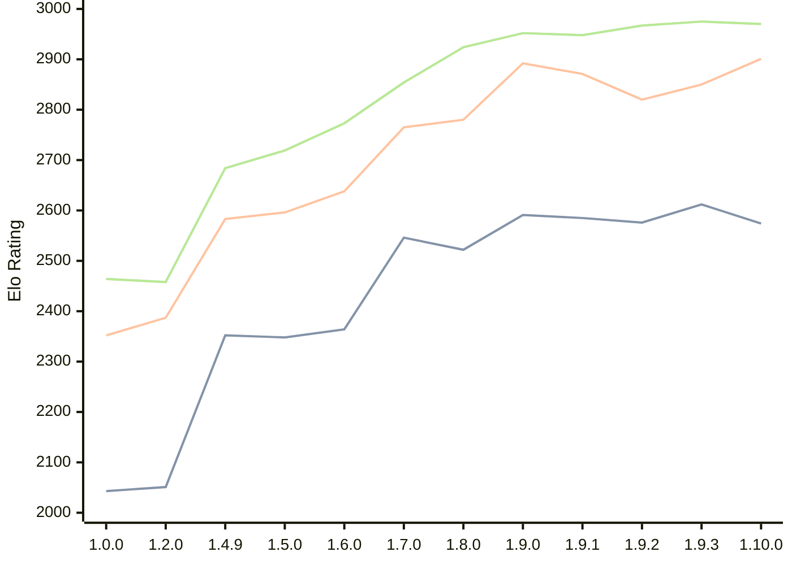

# Engine: Basilisk

Author: Miloslav Macůrek

Home: https://github.com/maelic13/basilisk

## Elo Ratings

| Version | Published | STC 8.0+0.08s  | LTC 60.0+0.60s | VLTC 2m24s+1.12s | Comment |
| --- | --- | --- | --- | --- | --- |
| 1.10.0 | 2026-09-10 | 2574(-38) | 2901(+51) | 2970(-5) |  |
| 1.9.3 | 2026-08-02 | 2612(+36) | 2850(+30) | 2975(+8) |  |
| 1.9.2 | 2026-08-01 | 2576(-9) | 2820(-51) | 2967(+19) |  |
| 1.9.1 | 2026-07-24 | 2585(-6) | 2871(-21) | 2948(-4) |  |
| 1.9.0 | 2026-07-18 | 2591(+69) | 2892(+112) | 2952(+28) |  |
| 1.8.0 | 2026-07-08 | 2522(-24) | 2780(+15) | 2924(+70) |  |
| 1.7.0 | 2026-06-29 | 2546(+182) | 2765(+127) | 2854(+81) |  |
| 1.6.0 | 2026-06-20 | 2364(+16) | 2638(+42) | 2773(+54) |  |
| 1.5.0 | 2026-06-10 | 2348(-4) | 2596(+13) | 2719(+35) |  |
| 1.4.9 | 2026-05-29 | 2352(+new) | 2583(+new) | 2684(+new) |  |
| 1.4.8 | 2026-05-28 |  |  |  |  |
| 1.4.7 | 2026-05-28 |  |  |  |  |
| 1.4.6 | 2026-05-28 |  |  |  |  |
| 1.4.5 | 2026-05-28 |  |  |  |  |
| 1.4.4 | 2026-05-28 |  |  |  |  |
| 1.4.3 | 2026-05-27 |  |  |  |  |
| 1.4.2 | 2026-05-26 |  |  |  |  |
| 1.4.0 | 2026-05-25 |  |  |  |  |
| 1.3.0 | 2026-05-25 |  |  |  |  |
| 1.2.3 | 2026-05-24 |  |  |  |  |
| 1.2.2 | 2026-05-22 |  |  |  |  |
| 1.2.1 | 2026-05-22 |  |  |  |  |
| 1.2.0 | 2026-05-21 | 2051(+new) | 2387(+new) | 2458(+new) |  |
| 1.1.0 | 2026-05-21 |  |  |  |  |
| 1.0.0 | 2026-05-20 | 2043 | 2352 | 2464 |  |
 | | | cElo (∆ prev) | cElo (∆ prev) | cElo (∆ prev) | 

<a href="https://github.com/computer-chess-index/cci/issues/new?template=submit-version.yml&title=[VERSION]+Basilisk+<version>&body=###%20Engine%20name%0ABasilisk%0A%0A###%20Version%0A1.10.0" target="_blank">Submit new version</a>

 Test Conditions:

GUI/CLI: <a href=https://github.com/cutechess/cutechess target="_blank">Cute-Chess</a> 
Elo Calculation: <a href=https://www.remi-coulom.fr/Bayesian-Elo/ target="_blank">Bayesian-Elo</a> 
CPU: Intel(R) Core(TM) i5-7500T 2.70GHz 
Opening book: 8_moves_v3 
\* STC: 8.0+0.08s, LTC: 60.0+0.60s, VLTC: 2m24s+1.12s

 Lists:
Ratings: <a href=https://github.com/computer-chess-index/cci/blob/main/lists/CCIRatings.csv target="_blank">Complete list</a>

Generated: 2026-09-13 04:36:06

## Ratings Verlauf

## Detailed Evaluation Results

| Version | Time Control | Elo  | Range +/- | Matches | Score | Average Opponent Elo | Draws |
| --- | --- | --- | --- | --- | --- | --- | --- |
| 1.10.0 | VLTC (2m24s+1.12s) | 2970 | 38 | 216 | 53% | 2942 | 38% |
| 1.10.0 | LTC (60.0+0.60s) | 2901 | 38 | 208 | 52% | 2881 | 40% |
| 1.10.0 | STC (8.0+0.08s) | 2574 | 33 | 302 | 45% | 2618 | 30% |
| --- | --- | --- | --- | --- | --- | --- | --- |
| 1.9.3 | VLTC (2m24s+1.12s) | 2975 | 32 | 306 | 50% | 2979 | 41% |
| 1.9.3 | LTC (60.0+0.60s) | 2850 | 30 | 348 | 48% | 2871 | 37% |
| 1.9.3 | STC (8.0+0.08s) | 2612 | 33 | 308 | 50% | 2611 | 29% |
| --- | --- | --- | --- | --- | --- | --- | --- |
| 1.9.2 | VLTC (2m24s+1.12s) | 2967 | 36 | 252 | 52% | 2948 | 35% |
| 1.9.2 | LTC (60.0+0.60s) | 2820 | 37 | 232 | 52% | 2800 | 36% |
| 1.9.2 | STC (8.0+0.08s) | 2576 | 38 | 232 | 50% | 2580 | 31% |
| --- | --- | --- | --- | --- | --- | --- | --- |
| 1.9.1 | VLTC (2m24s+1.12s) | 2948 | 35 | 258 | 50% | 2951 | 37% |
| 1.9.1 | LTC (60.0+0.60s) | 2871 | 36 | 236 | 51% | 2862 | 39% |
| 1.9.1 | STC (8.0+0.08s) | 2585 | 36 | 252 | 49% | 2593 | 28% |
| --- | --- | --- | --- | --- | --- | --- | --- |
| 1.9.0 | VLTC (2m24s+1.12s) | 2952 | 36 | 238 | 50% | 2957 | 39% |
| 1.9.0 | LTC (60.0+0.60s) | 2892 | 37 | 230 | 50% | 2897 | 39% |
| 1.9.0 | STC (8.0+0.08s) | 2591 | 34 | 286 | 53% | 2558 | 30% |
| --- | --- | --- | --- | --- | --- | --- | --- |
| 1.8.0 | VLTC (2m24s+1.12s) | 2924 | 45 | 148 | 51% | 2919 | 41% |
| 1.8.0 | LTC (60.0+0.60s) | 2780 | 43 | 172 | 50% | 2782 | 32% |
| 1.8.0 | STC (8.0+0.08s) | 2522 | 44 | 168 | 51% | 2516 | 33% |
| --- | --- | --- | --- | --- | --- | --- | --- |
| 1.7.0 | VLTC (2m24s+1.12s) | 2854 | 45 | 148 | 48% | 2871 | 43% |
| 1.7.0 | LTC (60.0+0.60s) | 2765 | 45 | 156 | 48% | 2782 | 33% |
| 1.7.0 | STC (8.0+0.08s) | 2546 | 45 | 170 | 51% | 2534 | 26% |
| --- | --- | --- | --- | --- | --- | --- | --- |
| 1.6.0 | VLTC (2m24s+1.12s) | 2773 | 48 | 132 | 53% | 2751 | 37% |
| 1.6.0 | LTC (60.0+0.60s) | 2638 | 55 | 112 | 48% | 2653 | 29% |
| 1.6.0 | STC (8.0+0.08s) | 2364 | 50 | 126 | 52% | 2352 | 38% |
| --- | --- | --- | --- | --- | --- | --- | --- |
| 1.5.0 | VLTC (2m24s+1.12s) | 2719 | 34 | 284 | 52% | 2700 | 31% |
| 1.5.0 | LTC (60.0+0.60s) | 2596 | 36 | 258 | 50% | 2593 | 25% |
| 1.5.0 | STC (8.0+0.08s) | 2348 | 36 | 278 | 51% | 2340 | 21% |
| --- | --- | --- | --- | --- | --- | --- | --- |
| 1.4.9 | VLTC (2m24s+1.12s) | 2684 | 58 | 100 | 51% | 2676 | 26% |
| 1.4.9 | LTC (60.0+0.60s) | 2583 | 57 | 102 | 49% | 2596 | 25% |
| 1.4.9 | STC (8.0+0.08s) | 2352 | 64 | 86 | 53% | 2322 | 22% |
| --- | --- | --- | --- | --- | --- | --- | --- |
| 1.2.0 | VLTC (2m24s+1.12s) | 2458 | 37 | 246 | 51% | 2450 | 27% |
| 1.2.0 | LTC (60.0+0.60s) | 2387 | 37 | 244 | 51% | 2377 | 25% |
| 1.2.0 | STC (8.0+0.08s) | 2051 | 39 | 236 | 51% | 2041 | 17% |
| --- | --- | --- | --- | --- | --- | --- | --- |
| 1.0.0 | VLTC (2m24s+1.12s) | 2464 | 48 | 154 | 49% | 2471 | 19% |
| 1.0.0 | LTC (60.0+0.60s) | 2352 | 45 | 180 | 56% | 2271 | 21% |
| 1.0.0 | STC (8.0+0.08s) | 2043 | 50 | 152 | 57% | 1955 | 19% |
| --- | --- | --- | --- | --- | --- | --- | --- |