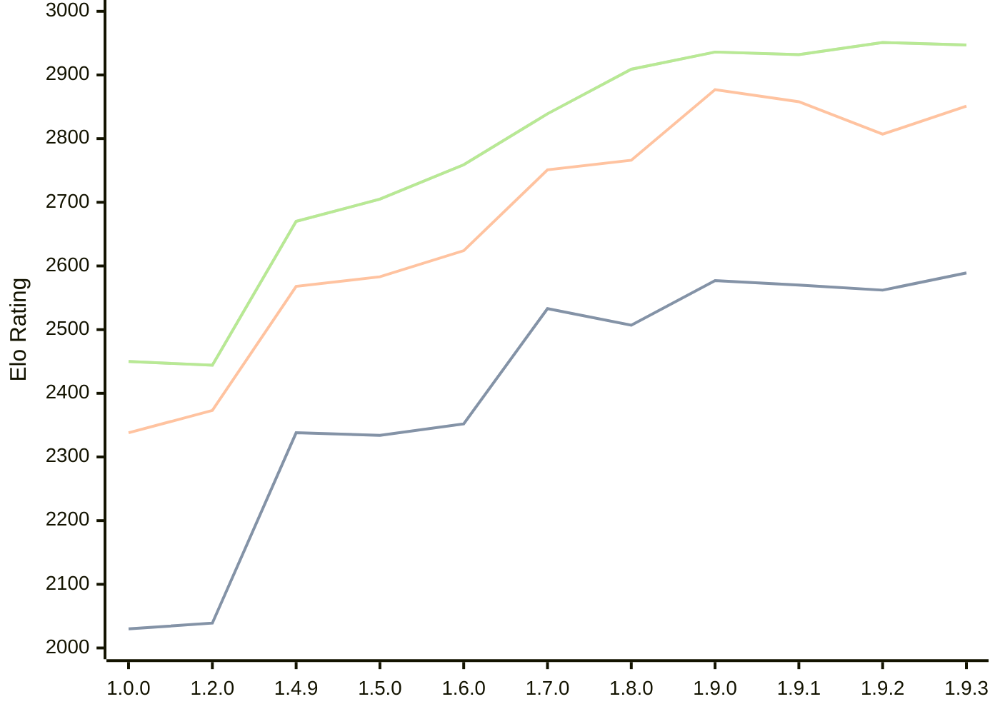

# Engine: Basilisk

Author: Miloslav Macůrek

Home: https://github.com/maelic13/basilisk

## Elo Ratings

| Version | Published | STC 8.0+0.08s  | LTC 60.0+0.60s | VLTC 2m24s+1.12s | Comment |
| --- | --- | --- | --- | --- | --- |
| 1.9.3 | 2026-08-02 | 2589(+27) | 2851(+44) | 2947(-4) |  |
| 1.9.2 | 2026-08-01 | 2562(-8) | 2807(-51) | 2951(+19) |  |
| 1.9.1 | 2026-07-24 | 2570(-7) | 2858(-19) | 2932(-4) |  |
| 1.9.0 | 2026-07-18 | 2577(+70) | 2877(+111) | 2936(+27) |  |
| 1.8.0 | 2026-07-08 | 2507(-26) | 2766(+15) | 2909(+70) |  |
| 1.7.0 | 2026-06-29 | 2533(+181) | 2751(+127) | 2839(+80) |  |
| 1.6.0 | 2026-06-20 | 2352(+18) | 2624(+41) | 2759(+54) |  |
| 1.5.0 | 2026-06-10 | 2334(-4) | 2583(+15) | 2705(+35) |  |
| 1.4.9 | 2026-05-29 | 2338(+new) | 2568(+new) | 2670(+new) |  |
| 1.4.8 | 2026-05-28 |  |  |  |  |
| 1.4.7 | 2026-05-28 |  |  |  |  |
| 1.4.6 | 2026-05-28 |  |  |  |  |
| 1.4.5 | 2026-05-28 |  |  |  |  |
| 1.4.4 | 2026-05-28 |  |  |  |  |
| 1.4.3 | 2026-05-27 |  |  |  |  |
| 1.4.2 | 2026-05-26 |  |  |  |  |
| 1.4.0 | 2026-05-25 |  |  |  |  |
| 1.3.0 | 2026-05-25 |  |  |  |  |
| 1.2.3 | 2026-05-24 |  |  |  |  |
| 1.2.2 | 2026-05-22 |  |  |  |  |
| 1.2.1 | 2026-05-22 |  |  |  |  |
| 1.2.0 | 2026-05-21 | 2039(+new) | 2373(+new) | 2444(+new) |  |
| 1.1.0 | 2026-05-21 |  |  |  |  |
| 1.0.0 | 2026-05-20 | 2030 | 2338 | 2450 |  |
 | | | cElo (∆ prev) | cElo (∆ prev) | cElo (∆ prev) | 

<a href="https://github.com/computer-chess-index/cci/issues/new?template=submit-version.yml&title=[VERSION]+Basilisk+<version>&body=###%20Engine%20name%0ABasilisk%0A%0A###%20Version%0A1.9.3" target="_blank">Submit new version</a>

 Test Conditions:

GUI/CLI: <a href=https://github.com/cutechess/cutechess target="_blank">Cute-Chess</a> 
Elo Calculation: <a href=https://www.remi-coulom.fr/Bayesian-Elo/ target="_blank">Bayesian-Elo</a> 
CPU: Intel(R) Core(TM) i5-7500T 2.70GHz 
Opening book: 8_moves_v3 
\* STC: 8.0+0.08s, LTC: 60.0+0.60s, VLTC: 2m24s+1.12s

 Lists:
Ratings: <a href=https://github.com/computer-chess-index/cci/blob/main/lists/CCIRatings.csv target="_blank">Complete list</a>

Generated: 2026-08-12 07:43:50

## Ratings Verlauf

⬛ STC (8.0+0.08s) &nbsp;&nbsp; 🟧 LTC (60.0+0.60s) &nbsp;&nbsp; 🟩 VLTC (2m24s+1.12s)

dark mode: 🟩STC (8.0+0.08s) 🟧LTC (60.0+0.60s) ⬜VLTC (2m24s+1.12s)

## Detailed Evaluation Results

| Version | Time Control | Elo  | Range +/- | Matches | Score | Average Opponent Elo | Draws |
| --- | --- | --- | --- | --- | --- | --- | --- |
| 1.9.3 | VLTC (2m24s+1.12s) | 2947 | 35 | 246 | 48% | 2966 | 39% |
| 1.9.3 | LTC (60.0+0.60s) | 2851 | 37 | 236 | 48% | 2869 | 33% |
| 1.9.3 | STC (8.0+0.08s) | 2589 | 38 | 236 | 49% | 2597 | 27% |
| --- | --- | --- | --- | --- | --- | --- | --- |
| 1.9.2 | VLTC (2m24s+1.12s) | 2951 | 36 | 252 | 52% | 2932 | 35% |
| 1.9.2 | LTC (60.0+0.60s) | 2807 | 37 | 232 | 52% | 2786 | 36% |
| 1.9.2 | STC (8.0+0.08s) | 2562 | 38 | 232 | 50% | 2565 | 31% |
| --- | --- | --- | --- | --- | --- | --- | --- |
| 1.9.1 | VLTC (2m24s+1.12s) | 2932 | 35 | 258 | 50% | 2935 | 37% |
| 1.9.1 | LTC (60.0+0.60s) | 2858 | 36 | 236 | 51% | 2849 | 39% |
| 1.9.1 | STC (8.0+0.08s) | 2570 | 36 | 252 | 49% | 2580 | 28% |
| --- | --- | --- | --- | --- | --- | --- | --- |
| 1.9.0 | VLTC (2m24s+1.12s) | 2936 | 36 | 238 | 50% | 2940 | 39% |
| 1.9.0 | LTC (60.0+0.60s) | 2877 | 37 | 230 | 50% | 2882 | 39% |
| 1.9.0 | STC (8.0+0.08s) | 2577 | 34 | 286 | 53% | 2543 | 30% |
| --- | --- | --- | --- | --- | --- | --- | --- |
| 1.8.0 | VLTC (2m24s+1.12s) | 2909 | 45 | 148 | 51% | 2904 | 41% |
| 1.8.0 | LTC (60.0+0.60s) | 2766 | 43 | 172 | 50% | 2769 | 32% |
| 1.8.0 | STC (8.0+0.08s) | 2507 | 44 | 168 | 51% | 2502 | 33% |
| --- | --- | --- | --- | --- | --- | --- | --- |
| 1.7.0 | VLTC (2m24s+1.12s) | 2839 | 45 | 148 | 48% | 2857 | 43% |
| 1.7.0 | LTC (60.0+0.60s) | 2751 | 45 | 156 | 48% | 2769 | 33% |
| 1.7.0 | STC (8.0+0.08s) | 2533 | 45 | 170 | 51% | 2519 | 26% |
| --- | --- | --- | --- | --- | --- | --- | --- |
| 1.6.0 | VLTC (2m24s+1.12s) | 2759 | 48 | 132 | 53% | 2738 | 37% |
| 1.6.0 | LTC (60.0+0.60s) | 2624 | 54 | 112 | 48% | 2639 | 29% |
| 1.6.0 | STC (8.0+0.08s) | 2352 | 50 | 126 | 52% | 2338 | 38% |
| --- | --- | --- | --- | --- | --- | --- | --- |
| 1.5.0 | VLTC (2m24s+1.12s) | 2705 | 34 | 284 | 52% | 2687 | 31% |
| 1.5.0 | LTC (60.0+0.60s) | 2583 | 36 | 258 | 50% | 2579 | 25% |
| 1.5.0 | STC (8.0+0.08s) | 2334 | 36 | 278 | 51% | 2326 | 21% |
| --- | --- | --- | --- | --- | --- | --- | --- |
| 1.4.9 | VLTC (2m24s+1.12s) | 2670 | 58 | 100 | 51% | 2662 | 26% |
| 1.4.9 | LTC (60.0+0.60s) | 2568 | 57 | 102 | 49% | 2581 | 25% |
| 1.4.9 | STC (8.0+0.08s) | 2338 | 64 | 86 | 53% | 2310 | 22% |
| --- | --- | --- | --- | --- | --- | --- | --- |
| 1.2.0 | VLTC (2m24s+1.12s) | 2444 | 37 | 246 | 51% | 2435 | 27% |
| 1.2.0 | LTC (60.0+0.60s) | 2373 | 37 | 244 | 51% | 2364 | 25% |
| 1.2.0 | STC (8.0+0.08s) | 2039 | 39 | 236 | 51% | 2029 | 17% |
| --- | --- | --- | --- | --- | --- | --- | --- |
| 1.0.0 | VLTC (2m24s+1.12s) | 2450 | 48 | 154 | 49% | 2457 | 19% |
| 1.0.0 | LTC (60.0+0.60s) | 2338 | 45 | 180 | 56% | 2257 | 21% |
| 1.0.0 | STC (8.0+0.08s) | 2030 | 50 | 152 | 57% | 1943 | 19% |
| --- | --- | --- | --- | --- | --- | --- | --- |