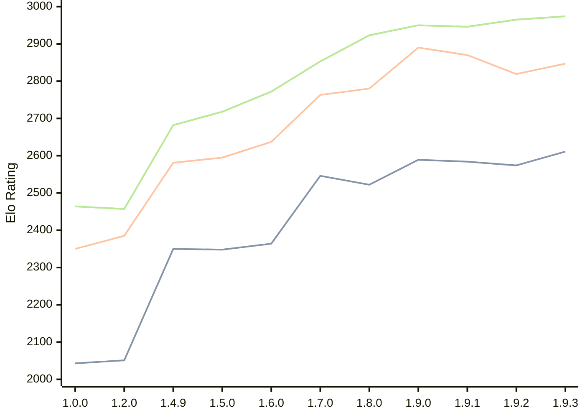

# Engine: Basilisk

Author: Miloslav Macůrek

Home: https://github.com/maelic13/basilisk

## Elo Ratings

| Version | Published | STC 8.0+0.08s  | LTC 60.0+0.60s | VLTC 2m24s+1.12s | Comment |
| --- | --- | --- | --- | --- | --- |
| 1.9.3 | 2026-08-02 | 2611(+37) | 2847(+28) | 2974(+9) |  |
| 1.9.2 | 2026-08-01 | 2574(-10) | 2819(-51) | 2965(+19) |  |
| 1.9.1 | 2026-07-24 | 2584(-5) | 2870(-20) | 2946(-4) |  |
| 1.9.0 | 2026-07-18 | 2589(+67) | 2890(+110) | 2950(+27) |  |
| 1.8.0 | 2026-07-08 | 2522(-24) | 2780(+17) | 2923(+70) |  |
| 1.7.0 | 2026-06-29 | 2546(+182) | 2763(+126) | 2853(+81) |  |
| 1.6.0 | 2026-06-20 | 2364(+16) | 2637(+42) | 2772(+54) |  |
| 1.5.0 | 2026-06-10 | 2348(-2) | 2595(+14) | 2718(+36) |  |
| 1.4.9 | 2026-05-29 | 2350(+new) | 2581(+new) | 2682(+new) |  |
| 1.4.8 | 2026-05-28 |  |  |  |  |
| 1.4.7 | 2026-05-28 |  |  |  |  |
| 1.4.6 | 2026-05-28 |  |  |  |  |
| 1.4.5 | 2026-05-28 |  |  |  |  |
| 1.4.4 | 2026-05-28 |  |  |  |  |
| 1.4.3 | 2026-05-27 |  |  |  |  |
| 1.4.2 | 2026-05-26 |  |  |  |  |
| 1.4.0 | 2026-05-25 |  |  |  |  |
| 1.3.0 | 2026-05-25 |  |  |  |  |
| 1.2.3 | 2026-05-24 |  |  |  |  |
| 1.2.2 | 2026-05-22 |  |  |  |  |
| 1.2.1 | 2026-05-22 |  |  |  |  |
| 1.2.0 | 2026-05-21 | 2051(+new) | 2385(+new) | 2457(+new) |  |
| 1.1.0 | 2026-05-21 |  |  |  |  |
| 1.0.0 | 2026-05-20 | 2043 | 2350 | 2464 |  |
 | | | cElo (∆ prev) | cElo (∆ prev) | cElo (∆ prev) | 

<a href="https://github.com/computer-chess-index/cci/issues/new?template=submit-version.yml&title=[VERSION]+Basilisk+<version>&body=###%20Engine%20name%0ABasilisk%0A%0A###%20Version%0A1.9.3" target="_blank">Submit new version</a>

 Test Conditions:

GUI/CLI: <a href=https://github.com/cutechess/cutechess target="_blank">Cute-Chess</a> 
Elo Calculation: <a href=https://www.remi-coulom.fr/Bayesian-Elo/ target="_blank">Bayesian-Elo</a> 
CPU: Intel(R) Core(TM) i5-7500T 2.70GHz 
Opening book: 8_moves_v3 
\* STC: 8.0+0.08s, LTC: 60.0+0.60s, VLTC: 2m24s+1.12s

 Lists:
Ratings: <a href=https://github.com/computer-chess-index/cci/blob/main/lists/CCIRatings.csv target="_blank">Complete list</a>

Generated: 2026-09-06 06:22:34

## Ratings Verlauf

## Detailed Evaluation Results

| Version | Time Control | Elo  | Range +/- | Matches | Score | Average Opponent Elo | Draws |
| --- | --- | --- | --- | --- | --- | --- | --- |
| 1.9.3 | VLTC (2m24s+1.12s) | 2974 | 32 | 306 | 50% | 2978 | 41% |
| 1.9.3 | LTC (60.0+0.60s) | 2847 | 31 | 336 | 48% | 2871 | 36% |
| 1.9.3 | STC (8.0+0.08s) | 2611 | 33 | 304 | 50% | 2608 | 30% |
| --- | --- | --- | --- | --- | --- | --- | --- |
| 1.9.2 | VLTC (2m24s+1.12s) | 2965 | 36 | 252 | 52% | 2946 | 35% |
| 1.9.2 | LTC (60.0+0.60s) | 2819 | 37 | 232 | 52% | 2799 | 36% |
| 1.9.2 | STC (8.0+0.08s) | 2574 | 38 | 232 | 50% | 2579 | 31% |
| --- | --- | --- | --- | --- | --- | --- | --- |
| 1.9.1 | VLTC (2m24s+1.12s) | 2946 | 35 | 258 | 50% | 2948 | 37% |
| 1.9.1 | LTC (60.0+0.60s) | 2870 | 36 | 236 | 51% | 2861 | 39% |
| 1.9.1 | STC (8.0+0.08s) | 2584 | 36 | 252 | 49% | 2592 | 28% |
| --- | --- | --- | --- | --- | --- | --- | --- |
| 1.9.0 | VLTC (2m24s+1.12s) | 2950 | 36 | 238 | 50% | 2954 | 39% |
| 1.9.0 | LTC (60.0+0.60s) | 2890 | 37 | 230 | 50% | 2894 | 39% |
| 1.9.0 | STC (8.0+0.08s) | 2589 | 34 | 286 | 53% | 2557 | 30% |
| --- | --- | --- | --- | --- | --- | --- | --- |
| 1.8.0 | VLTC (2m24s+1.12s) | 2923 | 45 | 148 | 51% | 2917 | 41% |
| 1.8.0 | LTC (60.0+0.60s) | 2780 | 43 | 172 | 50% | 2781 | 32% |
| 1.8.0 | STC (8.0+0.08s) | 2522 | 44 | 168 | 51% | 2515 | 33% |
| --- | --- | --- | --- | --- | --- | --- | --- |
| 1.7.0 | VLTC (2m24s+1.12s) | 2853 | 45 | 148 | 48% | 2870 | 43% |
| 1.7.0 | LTC (60.0+0.60s) | 2763 | 45 | 156 | 48% | 2781 | 33% |
| 1.7.0 | STC (8.0+0.08s) | 2546 | 45 | 170 | 51% | 2533 | 26% |
| --- | --- | --- | --- | --- | --- | --- | --- |
| 1.6.0 | VLTC (2m24s+1.12s) | 2772 | 48 | 132 | 53% | 2750 | 37% |
| 1.6.0 | LTC (60.0+0.60s) | 2637 | 55 | 112 | 48% | 2651 | 29% |
| 1.6.0 | STC (8.0+0.08s) | 2364 | 50 | 126 | 52% | 2350 | 38% |
| --- | --- | --- | --- | --- | --- | --- | --- |
| 1.5.0 | VLTC (2m24s+1.12s) | 2718 | 34 | 284 | 52% | 2699 | 31% |
| 1.5.0 | LTC (60.0+0.60s) | 2595 | 36 | 258 | 50% | 2592 | 25% |
| 1.5.0 | STC (8.0+0.08s) | 2348 | 36 | 278 | 51% | 2338 | 21% |
| --- | --- | --- | --- | --- | --- | --- | --- |
| 1.4.9 | VLTC (2m24s+1.12s) | 2682 | 58 | 100 | 51% | 2674 | 26% |
| 1.4.9 | LTC (60.0+0.60s) | 2581 | 57 | 102 | 49% | 2595 | 25% |
| 1.4.9 | STC (8.0+0.08s) | 2350 | 64 | 86 | 53% | 2322 | 22% |
| --- | --- | --- | --- | --- | --- | --- | --- |
| 1.2.0 | VLTC (2m24s+1.12s) | 2457 | 37 | 246 | 51% | 2449 | 27% |
| 1.2.0 | LTC (60.0+0.60s) | 2385 | 37 | 244 | 51% | 2376 | 25% |
| 1.2.0 | STC (8.0+0.08s) | 2051 | 39 | 236 | 51% | 2041 | 17% |
| --- | --- | --- | --- | --- | --- | --- | --- |
| 1.0.0 | VLTC (2m24s+1.12s) | 2464 | 48 | 154 | 49% | 2469 | 19% |
| 1.0.0 | LTC (60.0+0.60s) | 2350 | 45 | 180 | 56% | 2269 | 21% |
| 1.0.0 | STC (8.0+0.08s) | 2043 | 50 | 152 | 57% | 1955 | 19% |
| --- | --- | --- | --- | --- | --- | --- | --- |