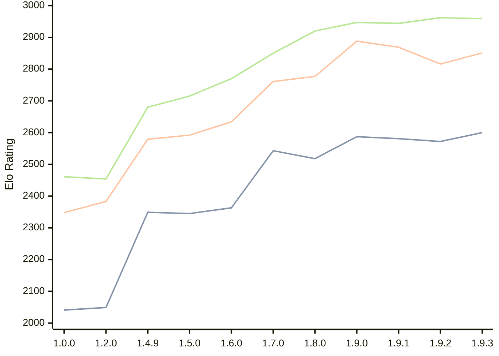

# Engine: Basilisk

Author: Miloslav Macůrek

Home: https://github.com/maelic13/basilisk

## Elo Ratings

| Version | Published | STC 8.0+0.08s  | LTC 60.0+0.60s | VLTC 2m24s+1.12s | Comment |
| --- | --- | --- | --- | --- | --- |
| 1.9.3 | 2026-08-02 | 2600(+28) | 2851(+35) | 2959(-3) |  |
| 1.9.2 | 2026-08-01 | 2572(-9) | 2816(-53) | 2962(+18) |  |
| 1.9.1 | 2026-07-24 | 2581(-6) | 2869(-19) | 2944(-3) |  |
| 1.9.0 | 2026-07-18 | 2587(+69) | 2888(+111) | 2947(+27) |  |
| 1.8.0 | 2026-07-08 | 2518(-25) | 2777(+16) | 2920(+70) |  |
| 1.7.0 | 2026-06-29 | 2543(+180) | 2761(+127) | 2850(+80) |  |
| 1.6.0 | 2026-06-20 | 2363(+18) | 2634(+42) | 2770(+55) |  |
| 1.5.0 | 2026-06-10 | 2345(-4) | 2592(+13) | 2715(+35) |  |
| 1.4.9 | 2026-05-29 | 2349(+new) | 2579(+new) | 2680(+new) |  |
| 1.4.8 | 2026-05-28 |  |  |  |  |
| 1.4.7 | 2026-05-28 |  |  |  |  |
| 1.4.6 | 2026-05-28 |  |  |  |  |
| 1.4.5 | 2026-05-28 |  |  |  |  |
| 1.4.4 | 2026-05-28 |  |  |  |  |
| 1.4.3 | 2026-05-27 |  |  |  |  |
| 1.4.2 | 2026-05-26 |  |  |  |  |
| 1.4.0 | 2026-05-25 |  |  |  |  |
| 1.3.0 | 2026-05-25 |  |  |  |  |
| 1.2.3 | 2026-05-24 |  |  |  |  |
| 1.2.2 | 2026-05-22 |  |  |  |  |
| 1.2.1 | 2026-05-22 |  |  |  |  |
| 1.2.0 | 2026-05-21 | 2049(+new) | 2383(+new) | 2454(+new) |  |
| 1.1.0 | 2026-05-21 |  |  |  |  |
| 1.0.0 | 2026-05-20 | 2041 | 2348 | 2461 |  |
 | | | cElo (∆ prev) | cElo (∆ prev) | cElo (∆ prev) | 

<a href="https://github.com/computer-chess-index/cci/issues/new?template=submit-version.yml&title=[VERSION]+Basilisk+<version>&body=###%20Engine%20name%0ABasilisk%0A%0A###%20Version%0A1.9.3" target="_blank">Submit new version</a>

 Test Conditions:

GUI/CLI: <a href=https://github.com/cutechess/cutechess target="_blank">Cute-Chess</a> 
Elo Calculation: <a href=https://www.remi-coulom.fr/Bayesian-Elo/ target="_blank">Bayesian-Elo</a> 
CPU: Intel(R) Core(TM) i5-7500T 2.70GHz 
Opening book: 8_moves_v3 
\* STC: 8.0+0.08s, LTC: 60.0+0.60s, VLTC: 2m24s+1.12s

 Lists:
Ratings: <a href=https://github.com/computer-chess-index/cci/blob/main/lists/CCIRatings.csv target="_blank">Complete list</a>

Generated: 2026-08-26 06:23:00

## Ratings Verlauf

⬛ STC (8.0+0.08s) &nbsp;&nbsp; 🟧 LTC (60.0+0.60s) &nbsp;&nbsp; 🟩 VLTC (2m24s+1.12s)

dark mode: 🟩STC (8.0+0.08s) 🟧LTC (60.0+0.60s) ⬜VLTC (2m24s+1.12s)

## Detailed Evaluation Results

| Version | Time Control | Elo  | Range +/- | Matches | Score | Average Opponent Elo | Draws |
| --- | --- | --- | --- | --- | --- | --- | --- |
| 1.9.3 | VLTC (2m24s+1.12s) | 2959 | 33 | 274 | 48% | 2974 | 41% |
| 1.9.3 | LTC (60.0+0.60s) | 2851 | 33 | 296 | 48% | 2869 | 34% |
| 1.9.3 | STC (8.0+0.08s) | 2600 | 35 | 272 | 49% | 2606 | 29% |
| --- | --- | --- | --- | --- | --- | --- | --- |
| 1.9.2 | VLTC (2m24s+1.12s) | 2962 | 36 | 252 | 52% | 2943 | 35% |
| 1.9.2 | LTC (60.0+0.60s) | 2816 | 37 | 232 | 52% | 2796 | 36% |
| 1.9.2 | STC (8.0+0.08s) | 2572 | 38 | 232 | 50% | 2576 | 31% |
| --- | --- | --- | --- | --- | --- | --- | --- |
| 1.9.1 | VLTC (2m24s+1.12s) | 2944 | 35 | 258 | 50% | 2946 | 37% |
| 1.9.1 | LTC (60.0+0.60s) | 2869 | 36 | 236 | 51% | 2859 | 39% |
| 1.9.1 | STC (8.0+0.08s) | 2581 | 36 | 252 | 49% | 2589 | 28% |
| --- | --- | --- | --- | --- | --- | --- | --- |
| 1.9.0 | VLTC (2m24s+1.12s) | 2947 | 36 | 238 | 50% | 2951 | 39% |
| 1.9.0 | LTC (60.0+0.60s) | 2888 | 37 | 230 | 50% | 2893 | 39% |
| 1.9.0 | STC (8.0+0.08s) | 2587 | 34 | 286 | 53% | 2554 | 30% |
| --- | --- | --- | --- | --- | --- | --- | --- |
| 1.8.0 | VLTC (2m24s+1.12s) | 2920 | 45 | 148 | 51% | 2915 | 41% |
| 1.8.0 | LTC (60.0+0.60s) | 2777 | 43 | 172 | 50% | 2780 | 32% |
| 1.8.0 | STC (8.0+0.08s) | 2518 | 44 | 168 | 51% | 2512 | 33% |
| --- | --- | --- | --- | --- | --- | --- | --- |
| 1.7.0 | VLTC (2m24s+1.12s) | 2850 | 45 | 148 | 48% | 2867 | 43% |
| 1.7.0 | LTC (60.0+0.60s) | 2761 | 45 | 156 | 48% | 2780 | 33% |
| 1.7.0 | STC (8.0+0.08s) | 2543 | 45 | 170 | 51% | 2530 | 26% |
| --- | --- | --- | --- | --- | --- | --- | --- |
| 1.6.0 | VLTC (2m24s+1.12s) | 2770 | 48 | 132 | 53% | 2747 | 37% |
| 1.6.0 | LTC (60.0+0.60s) | 2634 | 54 | 112 | 48% | 2649 | 29% |
| 1.6.0 | STC (8.0+0.08s) | 2363 | 50 | 126 | 52% | 2349 | 38% |
| --- | --- | --- | --- | --- | --- | --- | --- |
| 1.5.0 | VLTC (2m24s+1.12s) | 2715 | 34 | 284 | 52% | 2696 | 31% |
| 1.5.0 | LTC (60.0+0.60s) | 2592 | 36 | 258 | 50% | 2589 | 25% |
| 1.5.0 | STC (8.0+0.08s) | 2345 | 36 | 278 | 51% | 2337 | 21% |
| --- | --- | --- | --- | --- | --- | --- | --- |
| 1.4.9 | VLTC (2m24s+1.12s) | 2680 | 58 | 100 | 51% | 2672 | 26% |
| 1.4.9 | LTC (60.0+0.60s) | 2579 | 57 | 102 | 49% | 2591 | 25% |
| 1.4.9 | STC (8.0+0.08s) | 2349 | 64 | 86 | 53% | 2319 | 22% |
| --- | --- | --- | --- | --- | --- | --- | --- |
| 1.2.0 | VLTC (2m24s+1.12s) | 2454 | 37 | 246 | 51% | 2446 | 27% |
| 1.2.0 | LTC (60.0+0.60s) | 2383 | 37 | 244 | 51% | 2373 | 25% |
| 1.2.0 | STC (8.0+0.08s) | 2049 | 39 | 236 | 51% | 2039 | 17% |
| --- | --- | --- | --- | --- | --- | --- | --- |
| 1.0.0 | VLTC (2m24s+1.12s) | 2461 | 48 | 154 | 49% | 2468 | 19% |
| 1.0.0 | LTC (60.0+0.60s) | 2348 | 45 | 180 | 56% | 2267 | 21% |
| 1.0.0 | STC (8.0+0.08s) | 2041 | 50 | 152 | 57% | 1952 | 19% |
| --- | --- | --- | --- | --- | --- | --- | --- |