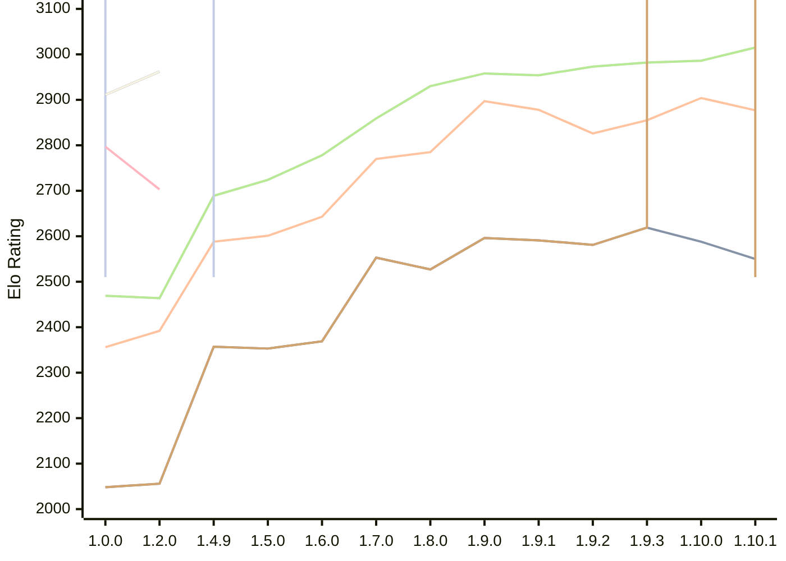

# Engine: Basilisk

Author: Miloslav Macůrek

Home: https://github.com/maelic13/basilisk

## Elo Ratings E1

| Version | Published | STC 8.0+0.08s  | LTC 60.0+0.60s | VLTC 2m24s+1.12s | Comment |
| --- | --- | --- | --- | --- | --- |
| 1.10.2 | 2026-10-08 | 2510(0) | 2703(-94) | 2962(+51) |  |
| 1.10.0 | 2026-09-10 | 2510 | 2797 | 2911 |  |
 | | | cElo (∆ prev) | cElo (∆ prev) | cElo (∆ prev) | 

## Elo Ratings P1

| Version | Published | STC 8.0+0.08s  | LTC 60.0+0.60s | VLTC 2m24s+1.12s | Comment |
| --- | --- | --- | --- | --- | --- |
| 1.10.0 | 2026-09-10 | 2719 | 3002 | 3087 |  |
 | | | cElo (∆ prev) | cElo (∆ prev) | cElo (∆ prev) | 

## Elo Ratings T1

| Version | Published | STC 8.0+0.08s  | LTC 60.0+0.60s | VLTC 2m24s+1.12s | Comment |
| --- | --- | --- | --- | --- | --- |
| 1.10.1 | 2026-09-27 | 2550(-38) | 2877(-27) | 3015(+29) |  |
| 1.10.0 | 2026-09-10 | 2588(-31) | 2904(+49) | 2986(+4) |  |
| 1.9.3 | 2026-08-02 | 2619(+38) | 2855(+29) | 2982(+9) |  |
| 1.9.2 | 2026-08-01 | 2581(-10) | 2826(-52) | 2973(+19) |  |
| 1.9.1 | 2026-07-24 | 2591(-5) | 2878(-19) | 2954(-4) |  |
| 1.9.0 | 2026-07-18 | 2596(+69) | 2897(+112) | 2958(+28) |  |
| 1.8.0 | 2026-07-08 | 2527(-26) | 2785(+15) | 2930(+71) |  |
| 1.7.0 | 2026-06-29 | 2553(+184) | 2770(+127) | 2859(+81) |  |
| 1.6.0 | 2026-06-20 | 2369(+16) | 2643(+42) | 2778(+54) |  |
| 1.5.0 | 2026-06-10 | 2353(-4) | 2601(+13) | 2724(+35) |  |
| 1.4.9 | 2026-05-29 | 2357(+301) | 2588(+196) | 2689(+225) |  |
| 1.2.0 | 2026-05-21 | 2056(+8) | 2392(+36) | 2464(-5) |  |
| 1.0.0 | 2026-05-20 | 2048 | 2356 | 2469 |  |
 | | | cElo (∆ prev) | cElo (∆ prev) | cElo (∆ prev) | 

<a href="https://github.com/computer-chess-index/cci/issues/new?template=submit-version.yml&title=[VERSION]+Basilisk+<version>&body=###%20Engine%20name%0ABasilisk%0A%0A###%20Version%0A1.10.1" target="_blank">Submit new version</a>

 Test Conditions:

GUI/CLI: <a href=https://github.com/cutechess/cutechess target="_blank">Cute-Chess</a> 
Elo Calculation: <a href=https://www.remi-coulom.fr/Bayesian-Elo/ target="_blank">Bayesian-Elo</a> 
CPU for P1: Intel(R) Core(TM) Ultra 7 265T (1.50 GHz) - P-Core 
CPU for E1: Intel(R) Core(TM) Ultra 7 265T (1.50 GHz) - E-Core 
CPU for T1: Intel(R) Core(TM) i5-7500T 2.70GHz 
Opening book: 8_moves_v3 
\* STC: 8.0+0.08s, LTC: 60.0+0.60s, VLTC: 2m24s+1.12s

 Lists:
Ratings: <a href=https://github.com/computer-chess-index/cci/blob/main/lists/CCIRatings.csv target="_blank">Complete list</a>

Generated: 2026-10-10 16:39:44

## Ratings Verlauf

```mermaid
%%{init: {"theme":"base","themeVariables":{"seriesColors:['#a3a3a3','#222221','#faa371']}}}%%
xychart-beta
  x-axis ["1.0.0", "1.2.0", "1.4.9", "1.5.0", "1.6.0", "1.7.0", "1.8.0", "1.9.0", "1.9.1", "1.9.2", "1.9.3", "1.10.0", "1.10.1"]
  y-axis "Elo Rating" 2000 --> 3100
  line "" [2048, 2056, 2357, 2353, 2369, 2553, 2527, 2596, 2591, 2581, 2619, 2588, 2550]
  line "T1: STC (8.0+0.08s)" [2048, 2056, 2357, 2353, 2369, 2553, 2527, 2596, 2591, 2581, 2619, 2588, 2550]
  line "T1: LTC (60.0+0.60s)" [2356, 2392, 2588, 2601, 2643, 2770, 2785, 2897, 2878, 2826, 2855, 2904, 2877]
  line "" [2469, 2464, 2689, 2724, 2778, 2859, 2930, 2958, 2954, 2973, 2982, 2986, 3015]
  line "T1: VLTC (2m24s+1.12s)" [2469, 2464, 2689, 2724, 2778, 2859, 2930, 2958, 2954, 2973, 2982, 2986, 3015]
  line "" [2048, 2056, 2357, 2353, 2369, 2553, 2527, 2596, 2591, 2581, 2619, 25882510, 2510]
  line "E1: STC (8.0+0.08s)" [2510, 25102510, 2510]
  line "E1: LTC (60.0+0.60s)" [2797, 2703]
  line "" [2911, 2962]
  line "E1: VLTC (2m24s+1.12s)" [2911, 2962]
```

## Detailed Evaluation Results

| Version | Time Control | Elo  | Range +/- | Matches | Score | Average Opponent Elo | Draws |
| --- | --- | --- | --- | --- | --- | --- | --- |
| 1.10.2 | VLTC (2m24s+1.12s) | 2962 | 196 | 8 | 56% | 2913 | 13% |
| 1.10.2 | LTC (60.0+0.60s) | 2703 | 129 | 16 | 44% | 2753 | 50% |
| 1.10.2 | STC (8.0+0.08s) | 2510 | 154 | 12 | 50% | 2510 | 33% |
| --- | --- | --- | --- | --- | --- | --- | --- |
| 1.10.1 | VLTC (2m24s+1.12s) | 3015 | 39 | 210 | 56% | 2965 | 38% |
| 1.10.1 | LTC (60.0+0.60s) | 2877 | 40 | 194 | 50% | 2878 | 35% |
| 1.10.1 | STC (8.0+0.08s) | 2550 | 47 | 148 | 50% | 2553 | 30% |
| --- | --- | --- | --- | --- | --- | --- | --- |
| 1.10.0 | VLTC (2m24s+1.12s) | 3087 | 42 | 172 | 50% | 3086 | 42% |
| 1.10.0 | VLTC (2m24s+1.12s) | 2911 | 36 | 254 | 48% | 2938 | 33% |
| 1.10.0 | VLTC (2m24s+1.12s) | 2986 | 35 | 254 | 54% | 2955 | 37% |
| 1.10.0 | LTC (60.0+0.60s) | 2797 | 33 | 286 | 47% | 2827 | 35% |
| 1.10.0 | LTC (60.0+0.60s) | 2904 | 35 | 252 | 52% | 2888 | 39% |
| 1.10.0 | LTC (60.0+0.60s) | 3002 | 41 | 200 | 49% | 3015 | 31% |
| 1.10.0 | STC (8.0+0.08s) | 2510 | 37 | 258 | 49% | 2523 | 23% |
| --- | --- | --- | --- | --- | --- | --- | --- |
| 1.10.0 | STC (8.0+0.08s) | 2588 | 30 | 354 | 47% | 2619 | 32% |
| --- | --- | --- | --- | --- | --- | --- | --- |
| 1.10.0 | STC (8.0+0.08s) | 2719 | 43 | 176 | 48% | 2739 | 30% |
| --- | --- | --- | --- | --- | --- | --- | --- |
| 1.9.3 | VLTC (2m24s+1.12s) | 2982 | 32 | 306 | 50% | 2985 | 41% |
| 1.9.3 | LTC (60.0+0.60s) | 2855 | 30 | 348 | 48% | 2878 | 37% |
| 1.9.3 | STC (8.0+0.08s) | 2619 | 33 | 308 | 50% | 2616 | 29% |
| --- | --- | --- | --- | --- | --- | --- | --- |
| 1.9.2 | VLTC (2m24s+1.12s) | 2973 | 36 | 252 | 52% | 2954 | 35% |
| 1.9.2 | LTC (60.0+0.60s) | 2826 | 37 | 232 | 52% | 2805 | 36% |
| 1.9.2 | STC (8.0+0.08s) | 2581 | 38 | 232 | 50% | 2585 | 31% |
| --- | --- | --- | --- | --- | --- | --- | --- |
| 1.9.1 | VLTC (2m24s+1.12s) | 2954 | 35 | 258 | 50% | 2957 | 37% |
| 1.9.1 | LTC (60.0+0.60s) | 2878 | 36 | 236 | 51% | 2867 | 39% |
| 1.9.1 | STC (8.0+0.08s) | 2591 | 36 | 252 | 49% | 2599 | 28% |
| --- | --- | --- | --- | --- | --- | --- | --- |
| 1.9.0 | VLTC (2m24s+1.12s) | 2958 | 36 | 238 | 50% | 2962 | 39% |
| 1.9.0 | LTC (60.0+0.60s) | 2897 | 37 | 230 | 50% | 2903 | 39% |
| 1.9.0 | STC (8.0+0.08s) | 2596 | 34 | 286 | 53% | 2564 | 30% |
| --- | --- | --- | --- | --- | --- | --- | --- |
| 1.8.0 | VLTC (2m24s+1.12s) | 2930 | 45 | 148 | 51% | 2925 | 41% |
| 1.8.0 | LTC (60.0+0.60s) | 2785 | 43 | 172 | 50% | 2788 | 32% |
| 1.8.0 | STC (8.0+0.08s) | 2527 | 44 | 168 | 51% | 2522 | 33% |
| --- | --- | --- | --- | --- | --- | --- | --- |
| 1.7.0 | VLTC (2m24s+1.12s) | 2859 | 45 | 148 | 48% | 2878 | 43% |
| 1.7.0 | LTC (60.0+0.60s) | 2770 | 45 | 156 | 48% | 2788 | 33% |
| 1.7.0 | STC (8.0+0.08s) | 2553 | 45 | 170 | 51% | 2539 | 26% |
| --- | --- | --- | --- | --- | --- | --- | --- |
| 1.6.0 | VLTC (2m24s+1.12s) | 2778 | 48 | 132 | 53% | 2757 | 37% |
| 1.6.0 | LTC (60.0+0.60s) | 2643 | 55 | 112 | 48% | 2658 | 29% |
| 1.6.0 | STC (8.0+0.08s) | 2369 | 50 | 126 | 52% | 2357 | 38% |
| --- | --- | --- | --- | --- | --- | --- | --- |
| 1.5.0 | VLTC (2m24s+1.12s) | 2724 | 34 | 284 | 52% | 2705 | 31% |
| 1.5.0 | LTC (60.0+0.60s) | 2601 | 36 | 258 | 50% | 2599 | 25% |
| 1.5.0 | STC (8.0+0.08s) | 2353 | 36 | 278 | 51% | 2345 | 21% |
| --- | --- | --- | --- | --- | --- | --- | --- |
| 1.4.9 | VLTC (2m24s+1.12s) | 2689 | 58 | 100 | 51% | 2681 | 26% |
| 1.4.9 | LTC (60.0+0.60s) | 2588 | 57 | 102 | 49% | 2601 | 25% |
| 1.4.9 | STC (8.0+0.08s) | 2357 | 64 | 86 | 53% | 2327 | 22% |
| --- | --- | --- | --- | --- | --- | --- | --- |
| 1.2.0 | VLTC (2m24s+1.12s) | 2464 | 37 | 246 | 51% | 2456 | 27% |
| 1.2.0 | LTC (60.0+0.60s) | 2392 | 37 | 244 | 51% | 2381 | 25% |
| 1.2.0 | STC (8.0+0.08s) | 2056 | 39 | 236 | 51% | 2047 | 17% |
| --- | --- | --- | --- | --- | --- | --- | --- |
| 1.0.0 | VLTC (2m24s+1.12s) | 2469 | 48 | 154 | 49% | 2476 | 19% |
| 1.0.0 | LTC (60.0+0.60s) | 2356 | 45 | 180 | 56% | 2275 | 21% |
| 1.0.0 | STC (8.0+0.08s) | 2048 | 50 | 152 | 57% | 1960 | 19% |
| --- | --- | --- | --- | --- | --- | --- | --- |