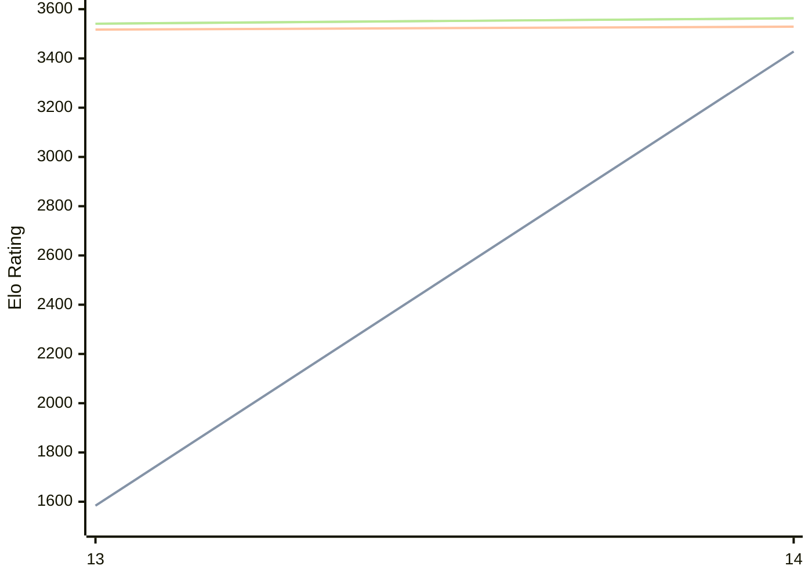

# Engine: Berserk

Author: Jay Honnold

Home: https://github.com/jhonnold/berserk

## Elo Ratings

| Version | Published | STC 8.0+0.08s  | LTC 60.0+0.60s | VLTC 2m24s+1.12s | Comment |
| --- | --- | --- | --- | --- | --- |
| 4.7.0 | 2026-05-24 |  |  |  |  |
| 14 | 2026-05-24 | 3428(+1844) | 3529(+12) | 3563(+22) |  |
| 13 | 2024-03-31 | 1584(+new) | 3517(+new) | 3541(+new) |  |
| 12.1 | 2023-11-12 |  |  |  |  |
| 12 | 2023-10-26 |  |  |  |  |
| 11.1 | 2023-02-21 |  |  |  |  |
| 11 | 2023-02-17 |  |  |  |  |
| 10 | 2022-10-04 |  |  |  |  |
| 9 | 2022-06-15 |  |  |  |  |
| 8.5.1 | 2022-01-03 |  |  |  |  |
| 8.5 | 2021-12-30 |  |  |  |  |
| 8 | 2021-12-05 |  |  |  |  |
| 7 | 2021-11-05 |  |  |  |  |
| 6 | 2021-10-19 |  |  |  |  |
| 5 | 2021-10-19 |  |  |  |  |
| 4.6.0 | 2021-09-18 |  |  |  |  |
| 4.5.1 | 2021-07-22 |  |  |  |  |
| 4.5.0 | 2021-07-21 |  |  |  |  |
| 4.4.0 | 2021-07-10 |  |  |  |  |
| 4.3.0 | 2021-07-03 |  |  |  |  |
| 4.2.0 | 2021-05-25 |  |  |  |  |
| 4.1.0 | 2021-05-02 |  |  |  |  |
| 4.0.0 | 2021-04-27 |  |  |  |  |
| 3.3.0 | 2021-04-10 |  |  |  |  |
| 3.2.1 | 2021-03-30 |  |  |  |  |
| 3.2.0 | 2021-03-25 |  |  |  |  |
| 3.1.0 | 2021-03-22 |  |  |  |  |
| 3.0.0 | 2021-03-19 |  |  |  |  |
| 2.0.0 | 2021-03-04 |  |  |  |  |
| 1.2.2 | 2021-02-21 |  |  |  |  |
| 1.2.1 | 2021-02-20 |  |  |  |  |
| 1.2.0 | 2021-02-20 |  |  |  |  |
| 1.0.0 | 2021-02-17 |  |  |  |  |
 | | | cElo (∆ prev) | cElo (∆ prev) | cElo (∆ prev) | 

<a href="https://github.com/computer-chess-index/cci/issues/new?template=submit-version.yml&title=[VERSION]+Berserk+<version>&body=###%20Engine%20name%0ABerserk%0A%0A###%20Version%0A4.7.0" target="_blank">Submit new version</a>

 Test Conditions:

GUI/CLI: <a href=https://github.com/cutechess/cutechess target="_blank">Cute-Chess</a> 
Elo Calculation: <a href=https://www.remi-coulom.fr/Bayesian-Elo/ target="_blank">Bayesian-Elo</a> 
CPU: Intel(R) Core(TM) i5-7500T 2.70GHz 
Opening book: 8_moves_v3 
\* STC: 8.0+0.08s, LTC: 60.0+0.60s, VLTC: 2m24s+1.12s

 Lists:
Ratings: <a href=https://github.com/computer-chess-index/cci/blob/main/lists/CCIRatings.csv target="_blank">Complete list</a>

Generated: 2026-07-14 06:22:59

## Ratings Verlauf

## Ratings Verlauf

⬛ STC (8.0+0.08s) &nbsp;&nbsp; 🟧 LTC (60.0+0.60s) &nbsp;&nbsp; 🟩 VLTC (2m24s+1.12s)

dark mode: 🟩STC (8.0+0.08s) 🟧LTC (60.0+0.60s) ⬜VLTC (2m24s+1.12s)

## Detailed Evaluation Results

| Version | Time Control | Elo  | Range +/- | Matches | Score | Average Opponent Elo | Draws |
| --- | --- | --- | --- | --- | --- | --- | --- |
| 14 | VLTC (2m24s+1.12s) | 3563 | 36 | 170 | 51% | 3557 | 94% |
| 14 | LTC (60.0+0.60s) | 3529 | 37 | 164 | 49% | 3534 | 90% |
| 14 | STC (8.0+0.08s) | 3428 | 35 | 222 | 56% | 3289 | 71% |
| --- | --- | --- | --- | --- | --- | --- | --- |
| 13 | VLTC (2m24s+1.12s) | 3541 | 13 | 1458 | 53% | 3467 | 84% |
| 13 | LTC (60.0+0.60s) | 3517 | 12 | 1740 | 51% | 3511 | 87% |
| 13 | STC (8.0+0.08s) | 1584 | 15 | 1932 | 53% | 1543 | 10% |
| --- | --- | --- | --- | --- | --- | --- | --- |