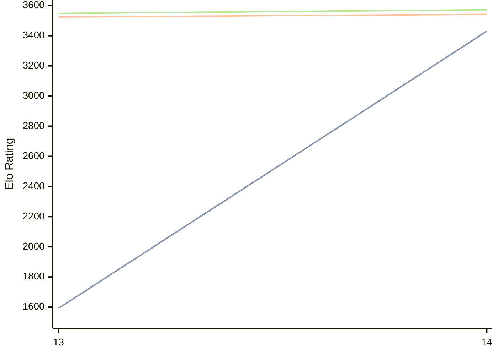

# Engine: Berserk

Author: Jay Honnold

Home: https://github.com/jhonnold/berserk

## Elo Ratings

| Version | Published | STC 8.0+0.08s  | LTC 60.0+0.60s | VLTC 2m24s+1.12s | Comment |
| --- | --- | --- | --- | --- | --- |
| 4.7.0 | 2026-05-24 |  |  |  |  |
| 14 | 2026-05-24 | 3430(+1838) | 3542(+18) | 3572(+24) |  |
| 13 | 2024-03-31 | 1592 | 3524 | 3548 |  |
 | | | cElo (∆ prev) | cElo (∆ prev) | cElo (∆ prev) | 

<a href="https://github.com/computer-chess-index/cci/issues/new?template=submit-version.yml&title=[VERSION]+Berserk+<version>&body=###%20Engine%20name%0ABerserk%0A%0A###%20Version%0A4.7.0" target="_blank">Submit new version</a>

 Test Conditions:

GUI/CLI: <a href=https://github.com/cutechess/cutechess target="_blank">Cute-Chess</a> 
Elo Calculation: <a href=https://www.remi-coulom.fr/Bayesian-Elo/ target="_blank">Bayesian-Elo</a> 
CPU: Intel(R) Core(TM) i5-7500T 2.70GHz 
Opening book: 8_moves_v3 
\* STC: 8.0+0.08s, LTC: 60.0+0.60s, VLTC: 2m24s+1.12s

 Lists:
Ratings: <a href=https://github.com/computer-chess-index/cci/blob/main/lists/CCIRatings.csv target="_blank">Complete list</a>

Generated: 2026-08-22 06:23:04

## Ratings Verlauf

⬛ STC (8.0+0.08s) &nbsp;&nbsp; 🟧 LTC (60.0+0.60s) &nbsp;&nbsp; 🟩 VLTC (2m24s+1.12s)

dark mode: 🟩STC (8.0+0.08s) 🟧LTC (60.0+0.60s) ⬜VLTC (2m24s+1.12s)

## Detailed Evaluation Results

| Version | Time Control | Elo  | Range +/- | Matches | Score | Average Opponent Elo | Draws |
| --- | --- | --- | --- | --- | --- | --- | --- |
| 14 | VLTC (2m24s+1.12s) | 3572 | 30 | 244 | 51% | 3568 | 93% |
| 14 | LTC (60.0+0.60s) | 3542 | 31 | 228 | 50% | 3540 | 90% |
| 14 | STC (8.0+0.08s) | 3430 | 26 | 386 | 53% | 3349 | 76% |
| --- | --- | --- | --- | --- | --- | --- | --- |
| 13 | VLTC (2m24s+1.12s) | 3548 | 13 | 1458 | 53% | 3475 | 84% |
| 13 | LTC (60.0+0.60s) | 3524 | 12 | 1740 | 51% | 3519 | 87% |
| 13 | STC (8.0+0.08s) | 1592 | 15 | 1932 | 53% | 1551 | 10% |
| --- | --- | --- | --- | --- | --- | --- | --- |