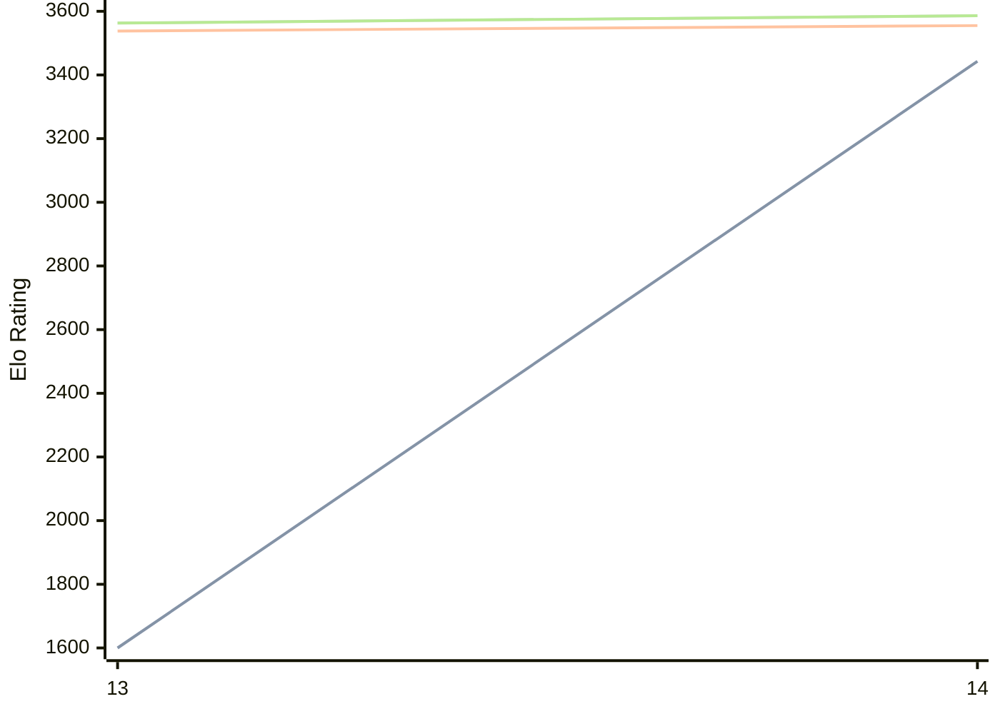

# Engine: Berserk

Author: Jay Honnold

Home: https://github.com/jhonnold/berserk

## Elo Ratings E1

| Version | Published | STC 8.0+0.08s  | LTC 60.0+0.60s | VLTC 2m24s+1.12s | Comment |
| --- | --- | --- | --- | --- | --- |
| 14 | 2026-05-24 | 3328 | 3561 | 3588 |  |
 | | | cElo (∆ prev) | cElo (∆ prev) | cElo (∆ prev) | 

## Elo Ratings P1

| Version | Published | STC 8.0+0.08s  | LTC 60.0+0.60s | VLTC 2m24s+1.12s | Comment |
| --- | --- | --- | --- | --- | --- |
| 14 | 2026-05-24 | 3629 | 3768 | 3816 |  |
 | | | cElo (∆ prev) | cElo (∆ prev) | cElo (∆ prev) | 

## Elo Ratings T1

| Version | Published | STC 8.0+0.08s  | LTC 60.0+0.60s | VLTC 2m24s+1.12s | Comment |
| --- | --- | --- | --- | --- | --- |
| 14 | 2026-05-24 | 3443(+1843) | 3555(+17) | 3586(+23) |  |
| 13 | 2024-03-31 | 1600 | 3538 | 3563 |  |
 | | | cElo (∆ prev) | cElo (∆ prev) | cElo (∆ prev) | 

<a href="https://github.com/computer-chess-index/cci/issues/new?template=submit-version.yml&title=[VERSION]+Berserk+<version>&body=###%20Engine%20name%0ABerserk%0A%0A###%20Version%0A14" target="_blank">Submit new version</a>

 Test Conditions:

GUI/CLI: <a href=https://github.com/cutechess/cutechess target="_blank">Cute-Chess</a> 
Elo Calculation: <a href=https://www.remi-coulom.fr/Bayesian-Elo/ target="_blank">Bayesian-Elo</a> 
CPU for P1: Intel(R) Core(TM) Ultra 7 265T (1.50 GHz) - P-Core 
CPU for E1: Intel(R) Core(TM) Ultra 7 265T (1.50 GHz) - E-Core 
CPU for T1: Intel(R) Core(TM) i5-7500T 2.70GHz 
Opening book: 8_moves_v3 
\* STC: 8.0+0.08s, LTC: 60.0+0.60s, VLTC: 2m24s+1.12s

 Lists:
Ratings: <a href=https://github.com/computer-chess-index/cci/blob/main/lists/CCIRatings.csv target="_blank">Complete list</a>

Generated: 2026-10-10 04:36:21

## Ratings Verlauf

```mermaid
%%{init: {"theme":"base","themeVariables":{"seriesColors:['#a3a3a3','#222221','#faa371']}}}%%
xychart-beta
  x-axis ["13", "14"]
  y-axis "Elo Rating" 1600 --> 3600
  line "" [1600, 3443]
  line "STC (8.0+0.08s)" [1600, 3443]
  line "LTC (60.0+0.60s)" [3538, 3555]
  line "" [3563, 3586]
  line "VLTC (2m24s+1.12s)" [3563, 3586]
```

## Detailed Evaluation Results

| Version | Time Control | Elo  | Range +/- | Matches | Score | Average Opponent Elo | Draws |
| --- | --- | --- | --- | --- | --- | --- | --- |
| 14 | VLTC (2m24s+1.12s) | 3816 | 65 | 52 | 52% | 3803 | 92% |
| 14 | VLTC (2m24s+1.12s) | 3588 | 43 | 124 | 51% | 3582 | 85% |
| 14 | VLTC (2m24s+1.12s) | 3586 | 29 | 268 | 51% | 3582 | 93% |
| 14 | LTC (60.0+0.60s) | 3561 | 41 | 136 | 53% | 3545 | 83% |
| 14 | LTC (60.0+0.60s) | 3555 | 29 | 264 | 50% | 3556 | 91% |
| 14 | LTC (60.0+0.60s) | 3768 | 49 | 96 | 50% | 3768 | 85% |
| 14 | STC (8.0+0.08s) | 3328 | 30 | 286 | 45% | 3363 | 72% |
| --- | --- | --- | --- | --- | --- | --- | --- |
| 14 | STC (8.0+0.08s) | 3443 | 24 | 426 | 53% | 3372 | 76% |
| --- | --- | --- | --- | --- | --- | --- | --- |
| 14 | STC (8.0+0.08s) | 3629 | 41 | 148 | 49% | 3636 | 75% |
| --- | --- | --- | --- | --- | --- | --- | --- |
| 13 | VLTC (2m24s+1.12s) | 3563 | 13 | 1458 | 53% | 3488 | 84% |
| 13 | LTC (60.0+0.60s) | 3538 | 12 | 1740 | 51% | 3534 | 87% |
| 13 | STC (8.0+0.08s) | 1600 | 15 | 1932 | 53% | 1558 | 10% |
| --- | --- | --- | --- | --- | --- | --- | --- |