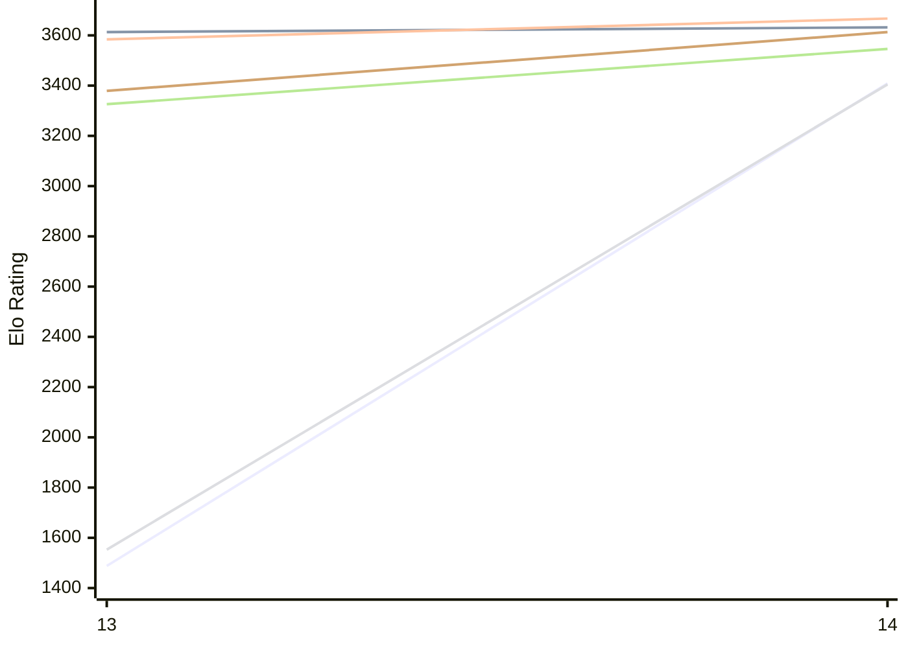
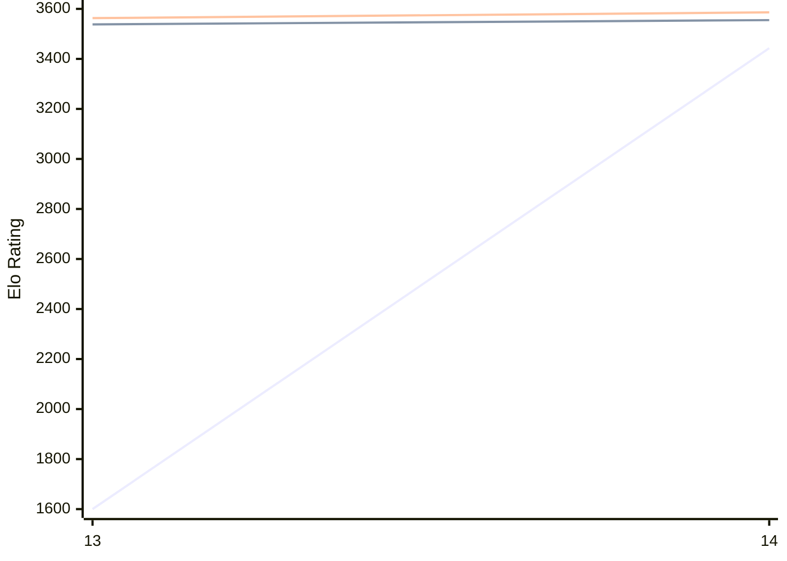

# Engine: Berserk

Author: Jay Honnold

Home: https://github.com/jhonnold/berserk

## Elo Ratings E1 (Ultra 7 265T (1.50 GHz) - E-Core)

| Version | Published | STC 8.0+0.08s  | LTC 60.0+0.60s | VLTC 2m24s+1.12s | Comment |
| --- | --- | --- | --- | --- | --- |
| 14 | 2026-05-24 | 3409(+1921) | 3632(+19) | 3667(+83) |  |
| 13 | 2024-03-31 | 1488 | 3613 | 3584 |  |
 | | | cElo (∆ prev) | cElo (∆ prev) | cElo (∆ prev) | 

## Elo Ratings P1 (Ultra 7 265T (1.50 GHz) - P-Core)

| Version | Published | STC 8.0+0.08s  | LTC 60.0+0.60s | VLTC 2m24s+1.12s | Comment |
| --- | --- | --- | --- | --- | --- |
| 14 | 2026-05-24 | 3405(+1852) | 3546(+220) | 3613(+234) |  |
| 13 | 2024-03-31 | 1553 | 3326 | 3379 |  |
 | | | cElo (∆ prev) | cElo (∆ prev) | cElo (∆ prev) | 

## Elo Ratings T1 (i5-7500T 2.70GHz)

| Version | Published | STC 8.0+0.08s  | LTC 60.0+0.60s | VLTC 2m24s+1.12s | Comment |
| --- | --- | --- | --- | --- | --- |
| 14 | 2026-05-24 | 3443(+1843) | 3555(+17) | 3586(+23) |  |
| 13 | 2024-03-31 | 1600 | 3538 | 3563 |  |
 | | | cElo (∆ prev) | cElo (∆ prev) | cElo (∆ prev) | 

<a href="https://github.com/computer-chess-index/cci/issues/new?template=submit-version.yml&title=[VERSION]+Berserk+<version>&body=###%20Engine%20name%0ABerserk%0A%0A###%20Version%0A14" target="_blank">Submit new version</a>

 Test Conditions:

GUI/CLI: <a href=https://github.com/cutechess/cutechess target="_blank">Cute-Chess</a> 
Elo Calculation: <a href=https://www.remi-coulom.fr/Bayesian-Elo/ target="_blank">Bayesian-Elo</a> 
CPU for P1: Intel(R) Core(TM) Ultra 7 265T (1.50 GHz) - P-Core 
CPU for E1: Intel(R) Core(TM) Ultra 7 265T (1.50 GHz) - E-Core 
CPU for T1: Intel(R) Core(TM) i5-7500T 2.70GHz 
Opening book: 8_moves_v3 
\* STC: 8.0+0.08s, LTC: 60.0+0.60s, VLTC: 2m24s+1.12s

 Lists:
Ratings: <a href=https://github.com/computer-chess-index/cci/blob/main/lists/CCIRatings.csv target="_blank">Complete list</a>

Generated: 2026-11-15 05:36:23

## Ratings Verlauf E1 / P1

```mermaid
%%{init: {"theme":"base","themeVariables":{"seriesColors:['#a3a3a3','#222221','#faa371']}}}%%
xychart-beta
  x-axis ["13", "14"]
  y-axis "Elo Rating" 1400 --> 3700
  line "E1: STC (8.0+0.08s)" [1488, 3409]
  line "E1: LTC (60.0+0.60s)" [3613, 3632]
  line "E1: VLTC (2m24s+1.12s)" [3584, 3667]
  line "P1: STC (8.0+0.08s)" [1553, 3405]
  line "P1: LTC (60.0+0.60s)" [3326, 3546]
  line "P1: VLTC (2m24s+1.12s)" [3379, 3613]
```

## Ratings Verlauf T1

```mermaid
%%{init: {"theme":"base","themeVariables":{"seriesColors:['#a3a3a3','#222221','#faa371']}}}%%
xychart-beta
  x-axis ["13", "14"]
  y-axis "Elo Rating" 1600 --> 3600
  line "T1: STC (8.0+0.08s)" [1600, 3443]
  line "T1: LTC (60.0+0.60s)" [3538, 3555]
  line "T1: VLTC (2m24s+1.12s)" [3563, 3586]
```

## Detailed Evaluation Results

| Version | Time Control | Variant | Elo  | Range +/- | Matches | Score | Average Opponent Elo | Draws |
| --- | --- |--- | --- | --- | --- | --- | --- | --- |
| 14 | VLTC (2m24s+1.12s) | P1 | 3613 | 40 | 140 | 51% | 3605 | 94% |
|  |  | E1 | 3667 | 32 | 226 | 50% | 3664 | 86% |
|  |  | T1 | 3586 | 29 | 268 | 51% | 3582 | 93% |
|  | LTC (60.0+0.60s) | E1 | 3632 | 31 | 240 | 51% | 3627 | 83% |
|  |  | T1 | 3555 | 29 | 264 | 50% | 3556 | 91% |
|  |  | P1 | 3546 | 37 | 172 | 49% | 3555 | 81% |
|  | STC (8.0+0.08s) | E1 | 3409 | 25 | 402 | 47% | 3428 | 70% |
|  |  | T1 | 3443 | 24 | 426 | 53% | 3372 | 76% |
|  |  | P1 | 3405 | 33 | 216 | 48% | 3417 | 78% |
| --- | --- |--- | --- | --- | --- | --- | --- | --- |
| 13 | VLTC (2m24s+1.12s) | E1 | 3584 | 106 | 32 | 73% | 3314 | 41% |
|  |  | T1 | 3563 | 13 | 1458 | 53% | 3488 | 84% |
|  |  | P1 | 3379 | 183 | 12 | 83% | 2982 | 33% |
|  | LTC (60.0+0.60s) | T1 | 3538 | 12 | 1740 | 51% | 3534 | 87% |
|  |  | P1 | 3326 | 165 | 18 | 89% | 2934 | 22% |
|  |  | E1 | 3613 | 131 | 24 | 81% | 3233 | 38% |
|  | STC (8.0+0.08s) | T1 | 1600 | 15 | 1932 | 53% | 1558 | 10% |
|  |  | P1 | 1553 | 80 | 76 | 36% | 1839 | 11% |
|  |  | E1 | 1488 | 60 | 108 | 57% | 1393 | 16% |