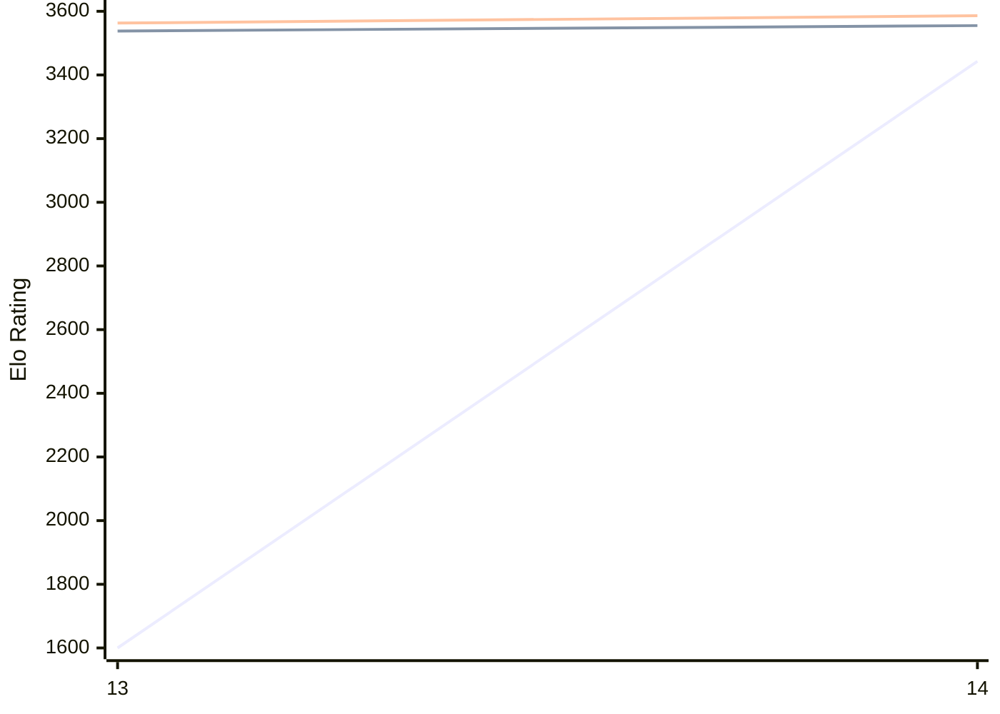

# Engine: Berserk

Author: Jay Honnold

Home: https://github.com/jhonnold/berserk

## Elo Ratings E1 (Ultra 7 265T (1.50 GHz) - E-Core)

| Version | Published | STC 8.0+0.08s  | LTC 60.0+0.60s | VLTC 2m24s+1.12s | Comment |
| --- | --- | --- | --- | --- | --- |
| 14 | 2026-05-24 | 3418(+1949) | 3640(-2) | 3677(+52) |  |
| 13 | 2024-03-31 | 1469 | 3642 | 3625 |  |
 | | | cElo (∆ prev) | cElo (∆ prev) | cElo (∆ prev) | 

## Elo Ratings P1 (Ultra 7 265T (1.50 GHz) - P-Core)

| Version | Published | STC 8.0+0.08s  | LTC 60.0+0.60s | VLTC 2m24s+1.12s | Comment |
| --- | --- | --- | --- | --- | --- |
| 14 | 2026-05-24 | 3403(+1861) | 3551(+154) | 3618(+109) |  |
| 13 | 2024-03-31 | 1542 | 3397 | 3509 |  |
 | | | cElo (∆ prev) | cElo (∆ prev) | cElo (∆ prev) | 

## Elo Ratings T1 (i5-7500T 2.70GHz)

| Version | Published | STC 8.0+0.08s  | LTC 60.0+0.60s | VLTC 2m24s+1.12s | Comment |
| --- | --- | --- | --- | --- | --- |
| 14 | 2026-05-24 | 3443(+1843) | 3555(+17) | 3586(+23) |  |
| 13 | 2024-03-31 | 1600 | 3538 | 3563 |  |
 | | | cElo (∆ prev) | cElo (∆ prev) | cElo (∆ prev) | 

<a href="https://github.com/computer-chess-index/cci/issues/new?template=submit-version.yml&title=[VERSION]+Berserk+<version>&body=###%20Engine%20name%0ABerserk%0A%0A###%20Version%0A14" target="_blank">Submit new version</a>

 Test Conditions:

GUI/CLI: <a href=https://github.com/cutechess/cutechess target="_blank">Cute-Chess</a> 
Elo Calculation: <a href=https://www.remi-coulom.fr/Bayesian-Elo/ target="_blank">Bayesian-Elo</a> 
CPU for P1: Intel(R) Core(TM) Ultra 7 265T (1.50 GHz) - P-Core 
CPU for E1: Intel(R) Core(TM) Ultra 7 265T (1.50 GHz) - E-Core 
CPU for T1: Intel(R) Core(TM) i5-7500T 2.70GHz 
Opening book: 8_moves_v3 
\* STC: 8.0+0.08s, LTC: 60.0+0.60s, VLTC: 2m24s+1.12s

 Lists:
Ratings: <a href=https://github.com/computer-chess-index/cci/blob/main/lists/CCIRatings.csv target="_blank">Complete list</a>

Generated: 2026-11-17 05:36:28

## Ratings Verlauf E1 / P1

```mermaid
%%{init: {"theme":"base","themeVariables":{"seriesColors:['#a3a3a3','#222221','#faa371']}}}%%
xychart-beta
  x-axis ["13", "14"]
  y-axis "Elo Rating" 1400 --> 3700
  line "E1: STC (8.0+0.08s)" [1469, 3418]
  line "E1: LTC (60.0+0.60s)" [3642, 3640]
  line "E1: VLTC (2m24s+1.12s)" [3625, 3677]
  line "P1: STC (8.0+0.08s)" [1542, 3403]
  line "P1: LTC (60.0+0.60s)" [3397, 3551]
  line "P1: VLTC (2m24s+1.12s)" [3509, 3618]
```

## Ratings Verlauf T1

```mermaid
%%{init: {"theme":"base","themeVariables":{"seriesColors:['#a3a3a3','#222221','#faa371']}}}%%
xychart-beta
  x-axis ["13", "14"]
  y-axis "Elo Rating" 1600 --> 3600
  line "T1: STC (8.0+0.08s)" [1600, 3443]
  line "T1: LTC (60.0+0.60s)" [3538, 3555]
  line "T1: VLTC (2m24s+1.12s)" [3563, 3586]
```

## Detailed Evaluation Results

| Version | Time Control | Variant | Elo  | Range +/- | Matches | Score | Average Opponent Elo | Draws |
| --- | --- |--- | --- | --- | --- | --- | --- | --- |
| 14 | VLTC (2m24s+1.12s) | E1 | 3677 | 32 | 226 | 50% | 3673 | 86% |
|  |  | T1 | 3586 | 29 | 268 | 51% | 3582 | 93% |
|  |  | P1 | 3618 | 40 | 140 | 51% | 3610 | 94% |
|  | LTC (60.0+0.60s) | E1 | 3640 | 31 | 248 | 50% | 3637 | 83% |
|  |  | T1 | 3555 | 29 | 264 | 50% | 3556 | 91% |
|  |  | P1 | 3551 | 36 | 180 | 49% | 3559 | 82% |
|  | STC (8.0+0.08s) | T1 | 3443 | 24 | 426 | 53% | 3372 | 76% |
|  |  | P1 | 3403 | 33 | 216 | 48% | 3416 | 78% |
|  |  | E1 | 3418 | 25 | 418 | 47% | 3440 | 71% |
| --- | --- |--- | --- | --- | --- | --- | --- | --- |
| 13 | VLTC (2m24s+1.12s) | E1 | 3625 | 70 | 60 | 65% | 3456 | 60% |
|  |  | T1 | 3563 | 13 | 1458 | 53% | 3488 | 84% |
|  |  | P1 | 3509 | 136 | 20 | 80% | 3151 | 40% |
|  | LTC (60.0+0.60s) | T1 | 3538 | 12 | 1740 | 51% | 3534 | 87% |
|  |  | P1 | 3397 | 127 | 26 | 81% | 3075 | 31% |
|  |  | E1 | 3642 | 72 | 56 | 64% | 3470 | 61% |
|  | STC (8.0+0.08s) | T1 | 1600 | 15 | 1932 | 53% | 1558 | 10% |
|  |  | P1 | 1542 | 67 | 100 | 39% | 1775 | 13% |
|  |  | E1 | 1469 | 55 | 128 | 54% | 1407 | 15% |