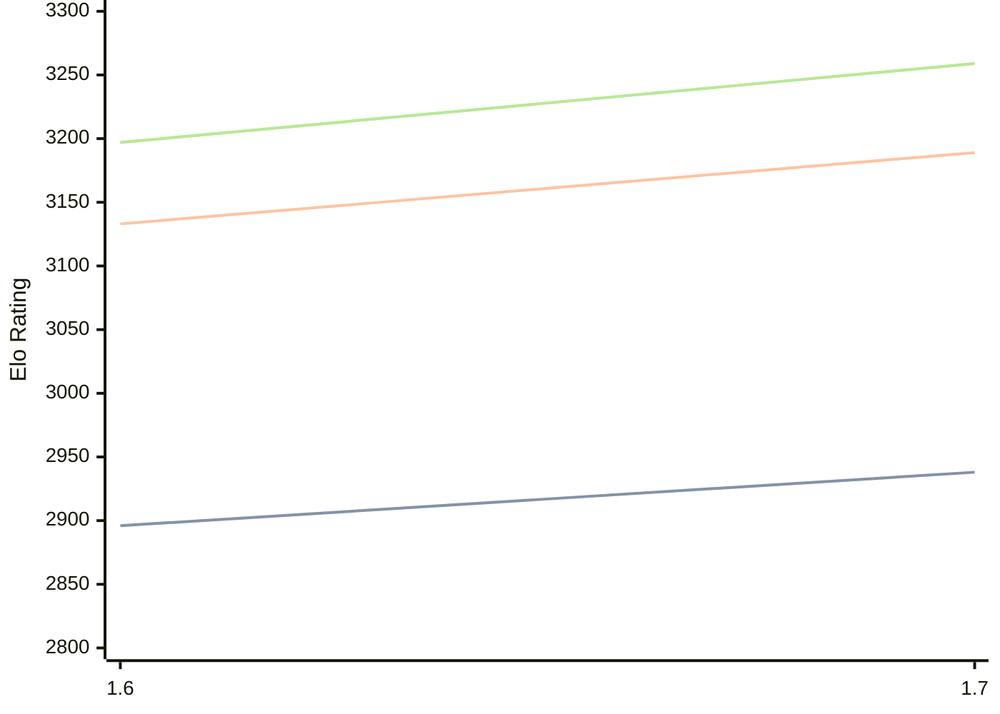

# Engine: Bitbit

Author: Isak Ellmer

Home: https://github.com/Spinojara/bitbit

## Elo Ratings

| Version | Published | STC 8.0+0.08s  | LTC 60.0+0.60s | VLTC 2m24s+1.12s | Comment |
| --- | --- | --- | --- | --- | --- |
| 1.7 | 2026-08-01 | 2938(+42) | 3189(+56) | 3259(+62) |  |
| 1.6 | 2025-10-18 | 2896 | 3133 | 3197 |  |
 | | | cElo (∆ prev) | cElo (∆ prev) | cElo (∆ prev) | 

<a href="https://github.com/computer-chess-index/cci/issues/new?template=submit-version.yml&title=[VERSION]+Bitbit+<version>&body=###%20Engine%20name%0ABitbit%0A%0A###%20Version%0A1.7" target="_blank">Submit new version</a>

 Test Conditions:

GUI/CLI: <a href=https://github.com/cutechess/cutechess target="_blank">Cute-Chess</a> 
Elo Calculation: <a href=https://www.remi-coulom.fr/Bayesian-Elo/ target="_blank">Bayesian-Elo</a> 
CPU: Intel(R) Core(TM) i5-7500T 2.70GHz 
Opening book: 8_moves_v3 
\* STC: 8.0+0.08s, LTC: 60.0+0.60s, VLTC: 2m24s+1.12s

 Lists:
Ratings: <a href=https://github.com/computer-chess-index/cci/blob/main/lists/CCIRatings.csv target="_blank">Complete list</a>

Generated: 2026-08-10 06:59:39

## Ratings Verlauf

⬛ STC (8.0+0.08s) &nbsp;&nbsp; 🟧 LTC (60.0+0.60s) &nbsp;&nbsp; 🟩 VLTC (2m24s+1.12s)

dark mode: 🟩STC (8.0+0.08s) 🟧LTC (60.0+0.60s) ⬜VLTC (2m24s+1.12s)

## Detailed Evaluation Results

| Version | Time Control | Elo  | Range +/- | Matches | Score | Average Opponent Elo | Draws |
| --- | --- | --- | --- | --- | --- | --- | --- |
| 1.7 | VLTC (2m24s+1.12s) | 3259 | 32 | 258 | 50% | 3263 | 65% |
| 1.7 | LTC (60.0+0.60s) | 3189 | 32 | 260 | 50% | 3191 | 60% |
| 1.7 | STC (8.0+0.08s) | 2938 | 31 | 296 | 52% | 2925 | 48% |
| --- | --- | --- | --- | --- | --- | --- | --- |
| 1.6 | VLTC (2m24s+1.12s) | 3197 | 24 | 478 | 52% | 3173 | 54% |
| 1.6 | LTC (60.0+0.60s) | 3133 | 24 | 510 | 52% | 3104 | 52% |
| 1.6 | STC (8.0+0.08s) | 2896 | 21 | 692 | 50% | 2882 | 40% |
| --- | --- | --- | --- | --- | --- | --- | --- |