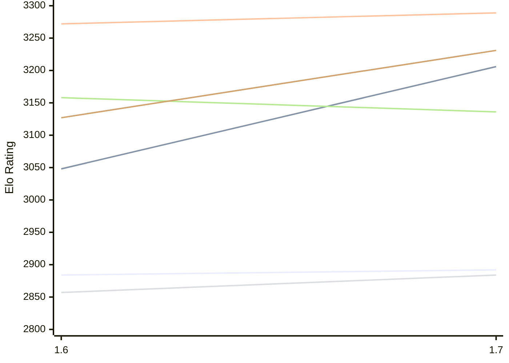
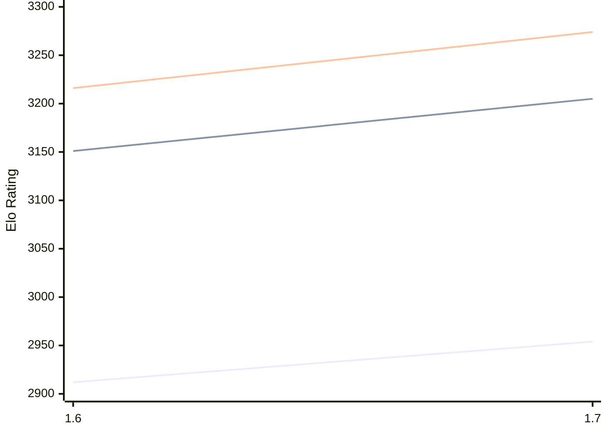

# Engine: Bitbit

Author: Isak Ellmer

Home: https://github.com/Spinojara/bitbit

## Elo Ratings E1 (Ultra 7 265T (1.50 GHz) - E-Core)

| Version | Published | STC 8.0+0.08s  | LTC 60.0+0.60s | VLTC 2m24s+1.12s | Comment |
| --- | --- | --- | --- | --- | --- |
| 1.7 | 2026-08-01 | 2892(+8) | 3206(+158) | 3289(+17) |  |
| 1.6 | 2025-10-18 | 2884 | 3048 | 3272 |  |
 | | | cElo (∆ prev) | cElo (∆ prev) | cElo (∆ prev) | 

## Elo Ratings P1 (Ultra 7 265T (1.50 GHz) - P-Core)

| Version | Published | STC 8.0+0.08s  | LTC 60.0+0.60s | VLTC 2m24s+1.12s | Comment |
| --- | --- | --- | --- | --- | --- |
| 1.7 | 2026-08-01 | 2884(+27) | 3136(-22) | 3231(+104) |  |
| 1.6 | 2025-10-18 | 2857 | 3158 | 3127 |  |
 | | | cElo (∆ prev) | cElo (∆ prev) | cElo (∆ prev) | 

## Elo Ratings T1 (i5-7500T 2.70GHz)

| Version | Published | STC 8.0+0.08s  | LTC 60.0+0.60s | VLTC 2m24s+1.12s | Comment |
| --- | --- | --- | --- | --- | --- |
| 1.7 | 2026-08-01 | 2954(+42) | 3205(+54) | 3274(+58) |  |
| 1.6 | 2025-10-18 | 2912 | 3151 | 3216 |  |
 | | | cElo (∆ prev) | cElo (∆ prev) | cElo (∆ prev) | 

<a href="https://github.com/computer-chess-index/cci/issues/new?template=submit-version.yml&title=[VERSION]+Bitbit+<version>&body=###%20Engine%20name%0ABitbit%0A%0A###%20Version%0A1.7" target="_blank">Submit new version</a>

 Test Conditions:

GUI/CLI: <a href=https://github.com/cutechess/cutechess target="_blank">Cute-Chess</a> 
Elo Calculation: <a href=https://www.remi-coulom.fr/Bayesian-Elo/ target="_blank">Bayesian-Elo</a> 
CPU for P1: Intel(R) Core(TM) Ultra 7 265T (1.50 GHz) - P-Core 
CPU for E1: Intel(R) Core(TM) Ultra 7 265T (1.50 GHz) - E-Core 
CPU for T1: Intel(R) Core(TM) i5-7500T 2.70GHz 
Opening book: 8_moves_v3 
\* STC: 8.0+0.08s, LTC: 60.0+0.60s, VLTC: 2m24s+1.12s

 Lists:
Ratings: <a href=https://github.com/computer-chess-index/cci/blob/main/lists/CCIRatings.csv target="_blank">Complete list</a>

Generated: 2026-11-16 05:36:26

## Ratings Verlauf E1 / P1

```mermaid
%%{init: {"theme":"base","themeVariables":{"seriesColors:['#a3a3a3','#222221','#faa371']}}}%%
xychart-beta
  x-axis ["1.6", "1.7"]
  y-axis "Elo Rating" 2800 --> 3300
  line "E1: STC (8.0+0.08s)" [2884, 2892]
  line "E1: LTC (60.0+0.60s)" [3048, 3206]
  line "E1: VLTC (2m24s+1.12s)" [3272, 3289]
  line "P1: STC (8.0+0.08s)" [2857, 2884]
  line "P1: LTC (60.0+0.60s)" [3158, 3136]
  line "P1: VLTC (2m24s+1.12s)" [3127, 3231]
```

## Ratings Verlauf T1

```mermaid
%%{init: {"theme":"base","themeVariables":{"seriesColors:['#a3a3a3','#222221','#faa371']}}}%%
xychart-beta
  x-axis ["1.6", "1.7"]
  y-axis "Elo Rating" 2900 --> 3300
  line "T1: STC (8.0+0.08s)" [2912, 2954]
  line "T1: LTC (60.0+0.60s)" [3151, 3205]
  line "T1: VLTC (2m24s+1.12s)" [3216, 3274]
```

## Detailed Evaluation Results

| Version | Time Control | Variant | Elo  | Range +/- | Matches | Score | Average Opponent Elo | Draws |
| --- | --- |--- | --- | --- | --- | --- | --- | --- |
| 1.7 | VLTC (2m24s+1.12s) | T1 | 3274 | 27 | 358 | 50% | 3278 | 65% |
|  |  | P1 | 3231 | 31 | 276 | 48% | 3245 | 66% |
|  |  | E1 | 3289 | 26 | 404 | 49% | 3297 | 60% |
|  | LTC (60.0+0.60s) | T1 | 3205 | 28 | 332 | 49% | 3210 | 61% |
|  |  | P1 | 3136 | 30 | 296 | 48% | 3154 | 63% |
|  |  | E1 | 3206 | 24 | 496 | 49% | 3214 | 54% |
|  | STC (8.0+0.08s) | T1 | 2954 | 28 | 372 | 51% | 2948 | 47% |
|  |  | P1 | 2884 | 33 | 270 | 48% | 2897 | 43% |
|  |  | E1 | 2892 | 26 | 456 | 46% | 2921 | 39% |
| --- | --- |--- | --- | --- | --- | --- | --- | --- |
| 1.6 | VLTC (2m24s+1.12s) | P1 | 3127 | 86 | 44 | 64% | 2948 | 41% |
|  |  | E1 | 3272 | 69 | 64 | 55% | 3225 | 44% |
|  |  | T1 | 3216 | 24 | 478 | 52% | 3191 | 54% |
|  | LTC (60.0+0.60s) | P1 | 3158 | 77 | 56 | 71% | 2920 | 48% |
|  |  | E1 | 3048 | 65 | 72 | 55% | 3016 | 49% |
|  |  | T1 | 3151 | 24 | 510 | 52% | 3123 | 52% |
|  | STC (8.0+0.08s) | E1 | 2884 | 67 | 88 | 56% | 2718 | 26% |
|  |  | T1 | 2912 | 21 | 692 | 50% | 2900 | 40% |
|  |  | P1 | 2857 | 84 | 48 | 48% | 2881 | 33% |