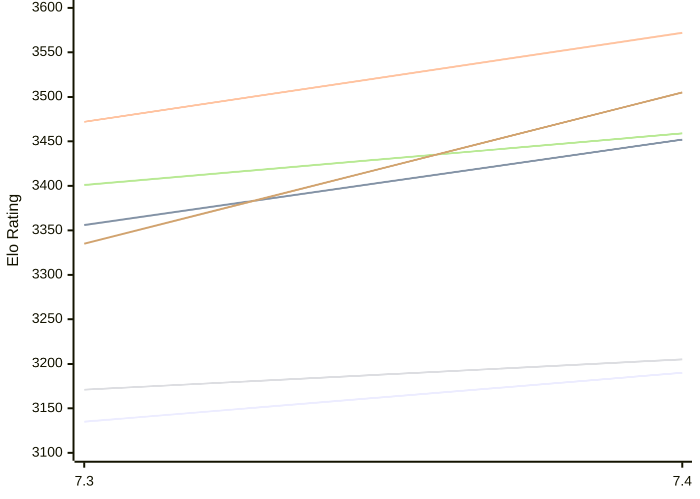

# Engine: Booot

Author: Alex Morozov

Home: https://github.com/booot76/Booot-chess-engine

## Elo Ratings E1 (Ultra 7 265T (1.50 GHz) - E-Core)

| Version | Published | STC 8.0+0.08s  | LTC 60.0+0.60s | VLTC 2m24s+1.12s | Comment |
| --- | --- | --- | --- | --- | --- |
| 7.4 | 2025-02-25 | 3190(+55) | 3452(+96) | 3572(+100) |  |
| 7.3 | 2024-01-28 | 3135 | 3356 | 3472 |  |
 | | | cElo (∆ prev) | cElo (∆ prev) | cElo (∆ prev) | 

## Elo Ratings P1 (Ultra 7 265T (1.50 GHz) - P-Core)

| Version | Published | STC 8.0+0.08s  | LTC 60.0+0.60s | VLTC 2m24s+1.12s | Comment |
| --- | --- | --- | --- | --- | --- |
| 7.4 | 2025-02-25 | 3205(+34) | 3459(+58) | 3505(+170) |  |
| 7.3 | 2024-01-28 | 3171 | 3401 | 3335 |  |
 | | | cElo (∆ prev) | cElo (∆ prev) | cElo (∆ prev) | 

## Elo Ratings T1 (i5-7500T 2.70GHz)

| Version | Published | STC 8.0+0.08s  | LTC 60.0+0.60s | VLTC 2m24s+1.12s | Comment |
| --- | --- | --- | --- | --- | --- |
| 7.4 | 2025-02-25 | 3241 | 3456 | 3499 |  |
 | | | cElo (∆ prev) | cElo (∆ prev) | cElo (∆ prev) | 

<a href="https://github.com/computer-chess-index/cci/issues/new?template=submit-version.yml&title=[VERSION]+Booot+<version>&body=###%20Engine%20name%0ABooot%0A%0A###%20Version%0A7.4" target="_blank">Submit new version</a>

 Test Conditions:

GUI/CLI: <a href=https://github.com/cutechess/cutechess target="_blank">Cute-Chess</a> 
Elo Calculation: <a href=https://www.remi-coulom.fr/Bayesian-Elo/ target="_blank">Bayesian-Elo</a> 
CPU for P1: Intel(R) Core(TM) Ultra 7 265T (1.50 GHz) - P-Core 
CPU for E1: Intel(R) Core(TM) Ultra 7 265T (1.50 GHz) - E-Core 
CPU for T1: Intel(R) Core(TM) i5-7500T 2.70GHz 
Opening book: 8_moves_v3 
\* STC: 8.0+0.08s, LTC: 60.0+0.60s, VLTC: 2m24s+1.12s

 Lists:
Ratings: <a href=https://github.com/computer-chess-index/cci/blob/main/lists/CCIRatings.csv target="_blank">Complete list</a>

Generated: 2026-11-26 05:36:40

## Ratings Verlauf E1 / P1

```mermaid
%%{init: {"theme":"base","themeVariables":{"seriesColors:['#a3a3a3','#222221','#faa371']}}}%%
xychart-beta
  x-axis ["7.3", "7.4"]
  y-axis "Elo Rating" 3100 --> 3600
  line "E1: STC (8.0+0.08s)" [3135, 3190]
  line "E1: LTC (60.0+0.60s)" [3356, 3452]
  line "E1: VLTC (2m24s+1.12s)" [3472, 3572]
  line "P1: STC (8.0+0.08s)" [3171, 3205]
  line "P1: LTC (60.0+0.60s)" [3401, 3459]
  line "P1: VLTC (2m24s+1.12s)" [3335, 3505]
```

## Detailed Evaluation Results

| Version | Time Control | Variant | Elo  | Range +/- | Matches | Score | Average Opponent Elo | Draws |
| --- | --- |--- | --- | --- | --- | --- | --- | --- |
| 7.4 | VLTC (2m24s+1.12s) | E1 | 3572 | 31 | 262 | 53% | 3524 | 74% |
|  |  | T1 | 3499 | 23 | 460 | 51% | 3486 | 80% |
|  |  | P1 | 3505 | 38 | 174 | 54% | 3434 | 78% |
|  | LTC (60.0+0.60s) | E1 | 3452 | 27 | 358 | 55% | 3382 | 73% |
|  |  | T1 | 3456 | 21 | 572 | 50% | 3445 | 76% |
|  |  | P1 | 3459 | 38 | 168 | 52% | 3409 | 78% |
|  | STC (8.0+0.08s) | E1 | 3190 | 25 | 408 | 47% | 3213 | 64% |
|  |  | T1 | 3241 | 19 | 750 | 50% | 3237 | 58% |
|  |  | P1 | 3205 | 30 | 286 | 48% | 3218 | 63% |
| --- | --- |--- | --- | --- | --- | --- | --- | --- |
| 7.3 | VLTC (2m24s+1.12s) | P1 | 3335 | 96 | 32 | 67% | 3171 | 53% |
|  |  | E1 | 3472 | 83 | 46 | 66% | 3254 | 50% |
|  | LTC (60.0+0.60s) | P1 | 3401 | 109 | 24 | 65% | 3228 | 63% |
|  |  | E1 | 3356 | 67 | 62 | 53% | 3317 | 55% |
|  | STC (8.0+0.08s) | P1 | 3171 | 91 | 40 | 55% | 3097 | 35% |
|  |  | E1 | 3135 | 56 | 92 | 47% | 3156 | 49% |