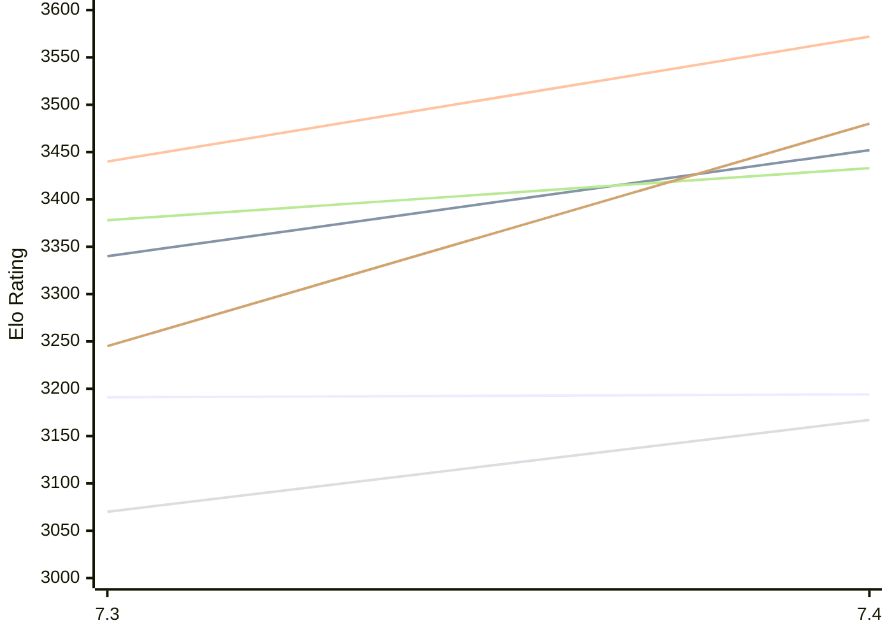

# Engine: Booot

Author: Alex Morozov

Home: https://github.com/booot76/Booot-chess-engine

## Elo Ratings E1 (Ultra 7 265T (1.50 GHz) - E-Core)

| Version | Published | STC 8.0+0.08s  | LTC 60.0+0.60s | VLTC 2m24s+1.12s | Comment |
| --- | --- | --- | --- | --- | --- |
| 7.4 | 2025-02-25 | 3194(+3) | 3452(+112) | 3572(+132) |  |
| 7.3 | 2024-01-28 | 3191 | 3340 | 3440 |  |
 | | | cElo (∆ prev) | cElo (∆ prev) | cElo (∆ prev) | 

## Elo Ratings P1 (Ultra 7 265T (1.50 GHz) - P-Core)

| Version | Published | STC 8.0+0.08s  | LTC 60.0+0.60s | VLTC 2m24s+1.12s | Comment |
| --- | --- | --- | --- | --- | --- |
| 7.4 | 2025-02-25 | 3167(+97) | 3433(+55) | 3480(+235) |  |
| 7.3 | 2024-01-28 | 3070 | 3378 | 3245 |  |
 | | | cElo (∆ prev) | cElo (∆ prev) | cElo (∆ prev) | 

## Elo Ratings T1 (i5-7500T 2.70GHz)

| Version | Published | STC 8.0+0.08s  | LTC 60.0+0.60s | VLTC 2m24s+1.12s | Comment |
| --- | --- | --- | --- | --- | --- |
| 7.4 | 2025-02-25 | 3241 | 3456 | 3499 |  |
 | | | cElo (∆ prev) | cElo (∆ prev) | cElo (∆ prev) | 

<a href="https://github.com/computer-chess-index/cci/issues/new?template=submit-version.yml&title=[VERSION]+Booot+<version>&body=###%20Engine%20name%0ABooot%0A%0A###%20Version%0A7.4" target="_blank">Submit new version</a>

 Test Conditions:

GUI/CLI: <a href=https://github.com/cutechess/cutechess target="_blank">Cute-Chess</a> 
Elo Calculation: <a href=https://www.remi-coulom.fr/Bayesian-Elo/ target="_blank">Bayesian-Elo</a> 
CPU for P1: Intel(R) Core(TM) Ultra 7 265T (1.50 GHz) - P-Core 
CPU for E1: Intel(R) Core(TM) Ultra 7 265T (1.50 GHz) - E-Core 
CPU for T1: Intel(R) Core(TM) i5-7500T 2.70GHz 
Opening book: 8_moves_v3 
\* STC: 8.0+0.08s, LTC: 60.0+0.60s, VLTC: 2m24s+1.12s

 Lists:
Ratings: <a href=https://github.com/computer-chess-index/cci/blob/main/lists/CCIRatings.csv target="_blank">Complete list</a>

Generated: 2026-11-15 05:36:31

## Ratings Verlauf E1 / P1

```mermaid
%%{init: {"theme":"base","themeVariables":{"seriesColors:['#a3a3a3','#222221','#faa371']}}}%%
xychart-beta
  x-axis ["7.3", "7.4"]
  y-axis "Elo Rating" 3000 --> 3600
  line "E1: STC (8.0+0.08s)" [3191, 3194]
  line "E1: LTC (60.0+0.60s)" [3340, 3452]
  line "E1: VLTC (2m24s+1.12s)" [3440, 3572]
  line "P1: STC (8.0+0.08s)" [3070, 3167]
  line "P1: LTC (60.0+0.60s)" [3378, 3433]
  line "P1: VLTC (2m24s+1.12s)" [3245, 3480]
```

## Detailed Evaluation Results

| Version | Time Control | Variant | Elo  | Range +/- | Matches | Score | Average Opponent Elo | Draws |
| --- | --- |--- | --- | --- | --- | --- | --- | --- |
| 7.4 | VLTC (2m24s+1.12s) | E1 | 3572 | 32 | 250 | 53% | 3521 | 74% |
|  |  | T1 | 3499 | 23 | 460 | 51% | 3486 | 80% |
|  |  | P1 | 3480 | 38 | 174 | 54% | 3409 | 78% |
|  | LTC (60.0+0.60s) | E1 | 3452 | 28 | 330 | 55% | 3372 | 72% |
|  |  | T1 | 3456 | 21 | 572 | 50% | 3445 | 76% |
|  |  | P1 | 3433 | 40 | 156 | 52% | 3379 | 76% |
|  | STC (8.0+0.08s) | E1 | 3194 | 26 | 370 | 47% | 3212 | 66% |
|  |  | T1 | 3241 | 19 | 750 | 50% | 3237 | 58% |
|  |  | P1 | 3167 | 33 | 244 | 48% | 3183 | 61% |
| --- | --- |--- | --- | --- | --- | --- | --- | --- |
| 7.3 | VLTC (2m24s+1.12s) | P1 | 3245 | 144 | 16 | 78% | 2975 | 44% |
|  |  | E1 | 3440 | 99 | 34 | 69% | 3171 | 44% |
|  | LTC (60.0+0.60s) | P1 | 3378 | 189 | 12 | 83% | 3004 | 33% |
|  |  | E1 | 3340 | 110 | 24 | 56% | 3266 | 46% |
|  | STC (8.0+0.08s) | P1 | 3070 | 152 | 16 | 69% | 2853 | 25% |
|  |  | E1 | 3191 | 89 | 38 | 55% | 3147 | 47% |