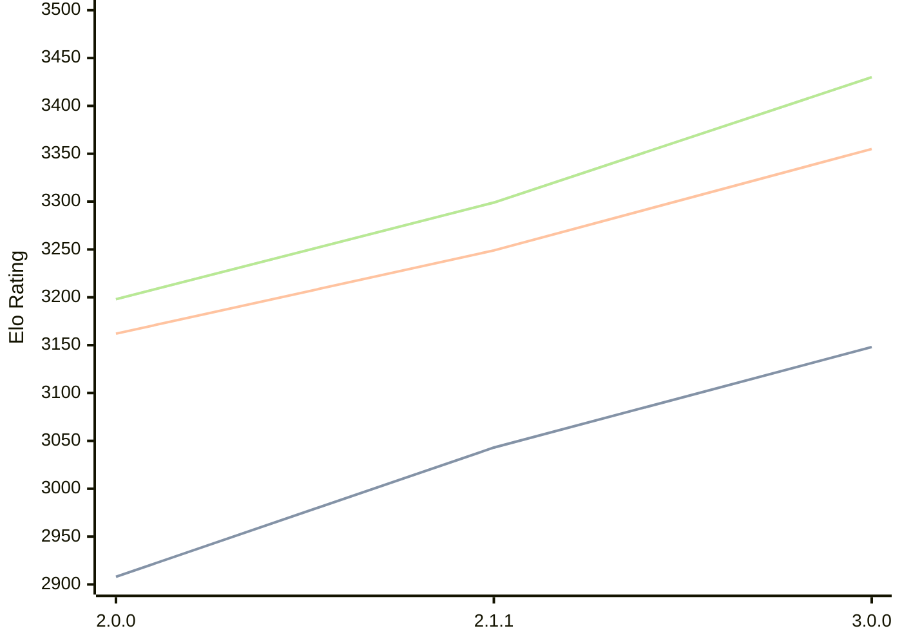

# Engine: Bread

Author: 

Home: https://github.com/Nonlinear2/Bread-Engine

## Elo Ratings

| Version | Published | STC 8.0+0.08s  | LTC 60.0+0.60s | VLTC 2m24s+1.12s | Comment |
| --- | --- | --- | --- | --- | --- |
| 3.0.0 | 2026-03-15 | 3148(+105) | 3355(+106) | 3430(+131) |  |
| 2.1.1 | 2025-12-22 | 3043(+new) | 3249(+new) | 3299(+new) |  |
| 2.1.0 | 2025-12-21 |  |  |  | always disconnects |
| 2.0.0 | 2025-10-18 | 2908(+new) | 3162(+new) | 3198(+new) |  |
| 1.6.0 | 2025-08-26 |  |  |  |  |
| 1.5.0 | 2025-07-13 |  |  |  |  |
| 1.4.0 | 2025-05-05 |  |  |  |  |
| 1.3.0 | 2025-03-05 |  |  |  |  |
| 1.2.0 | 2025-01-04 |  |  |  |  |
| 1.1.0 | 2024-07-29 |  |  |  |  |
| 1.0.0 | 2024-07-20 |  |  |  |  |
| 0.0.10 | 2024-07-19 |  |  |  |  |
| 0.0.9 | 2024-07-13 |  |  |  |  |
| 0.0.8 | 2024-07-12 |  |  |  |  |
| 0.0.7 | 2024-07-02 |  |  |  |  |
| 0.0.6 | 2024-06-26 |  |  |  |  |
| 0.0.5 | 2024-06-22 |  |  |  |  |
| 0.0.4 | 2024-06-18 |  |  |  |  |
| 0.0.3 | 2024-06-10 |  |  |  |  |
| 0.0.2 | 2024-06-08 |  |  |  |  |
| 0.0.1 | 2024-06-05 |  |  |  |  |
 | | | cElo (∆ prev) | cElo (∆ prev) | cElo (∆ prev) | 

<a href="https://github.com/computer-chess-index/cci/issues/new?template=submit-version.yml&title=[VERSION]+Bread+<version>&body=###%20Engine%20name%0ABread%0A%0A###%20Version%0A3.0.0" target="_blank">Submit new version</a>

 Test Conditions:

GUI/CLI: <a href=https://github.com/cutechess/cutechess target="_blank">Cute-Chess</a> 
Elo Calculation: <a href=https://www.remi-coulom.fr/Bayesian-Elo/ target="_blank">Bayesian-Elo</a> 
CPU: Intel(R) Core(TM) i5-7500T 2.70GHz 
Opening book: 8_moves_v3 
\* STC: 8.0+0.08s, LTC: 60.0+0.60s, VLTC: 2m24s+1.12s

 Lists:
Ratings: <a href=https://github.com/computer-chess-index/cci/blob/main/lists/CCIRatings.csv target="_blank">Complete list</a>

Generated: 2026-05-03 07:35:42

## Ratings Verlauf

⬛ STC (8.0+0.08s) &nbsp;&nbsp; 🟧 LTC (60.0+0.60s) &nbsp;&nbsp; 🟩 VLTC (2m24s+1.12s)

dark mode: 🟩STC (8.0+0.08s) 🟧LTC (60.0+0.60s) ⬜VLTC (2m24s+1.12s)

## Detailed Evaluation Results

| Version | Time Control | Elo  | Range +/- | Matches | Score | Average Opponent Elo | Draws |
| --- | --- | --- | --- | --- | --- | --- | --- |
| 3.0.0 | VLTC (2m24s+1.12s) | 3430 | 25 | 402 | 50% | 3433 | 74% |
| 3.0.0 | LTC (60.0+0.60s) | 3355 | 27 | 346 | 51% | 3348 | 71% |
| 3.0.0 | STC (8.0+0.08s) | 3148 | 26 | 392 | 50% | 3151 | 58% |
| --- | --- | --- | --- | --- | --- | --- | --- |
| 2.1.1 | VLTC (2m24s+1.12s) | 3299 | 30 | 294 | 50% | 3297 | 61% |
| 2.1.1 | LTC (60.0+0.60s) | 3249 | 28 | 348 | 50% | 3239 | 55% |
| 2.1.1 | STC (8.0+0.08s) | 3043 | 28 | 364 | 52% | 3027 | 47% |
| --- | --- | --- | --- | --- | --- | --- | --- |
| 2.1.0 |  |  |  |  |  |  |  |
| 2.0.0 | VLTC (2m24s+1.12s) | 3198 | 37 | 208 | 57% | 3092 | 55% |
| 2.0.0 | LTC (60.0+0.60s) | 3162 | 40 | 188 | 56% | 3079 | 53% |
| 2.0.0 | STC (8.0+0.08s) | 2908 | 38 | 208 | 51% | 2877 | 44% |
| --- | --- | --- | --- | --- | --- | --- | --- |
| 1.6.0 |  |  |  |  |  |  |  |
| 1.5.0 |  |  |  |  |  |  |  |
| 1.4.0 |  |  |  |  |  |  |  |
| 1.3.0 |  |  |  |  |  |  |  |
| 1.2.0 |  |  |  |  |  |  |  |
| 1.1.0 |  |  |  |  |  |  |  |
| 1.0.0 |  |  |  |  |  |  |  |
| 0.0.10 |  |  |  |  |  |  |  |
| 0.0.9 |  |  |  |  |  |  |  |
| 0.0.8 |  |  |  |  |  |  |  |
| 0.0.7 |  |  |  |  |  |  |  |
| 0.0.6 |  |  |  |  |  |  |  |
| 0.0.5 |  |  |  |  |  |  |  |
| 0.0.4 |  |  |  |  |  |  |  |
| 0.0.3 |  |  |  |  |  |  |  |
| 0.0.2 |  |  |  |  |  |  |  |
| 0.0.1 |  |  |  |  |  |  |  |