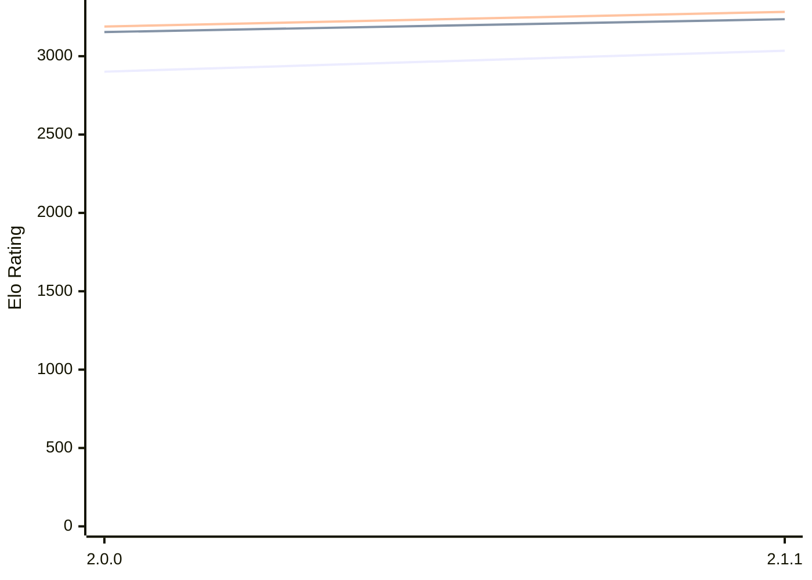

# Engine: Bread

Author: 

Home: https://github.com/Nonlinear2/Bread-Engine

## Ratings nach Version

| Version | Published | STC 8.0+0.08s  | LTC 60.0+0.60s | VLTC 2m24s+1.12s | Comment |
| --- | --- | --- | --- | --- | --- |
| 2.1.1 | 2025-12-22 | 3035(new) | 3236(new) | 3283(new) |  |
| 2.1.0 | 2025-12-21 |  |  |  | always disconnects |
| 2.0.0 | 2025-10-18 | 2901(new) | 3154(new) | 3189(new) |  |
| 1.6.0 | 2025-08-26 |  |  |  |  |
| 1.5.0 | 2025-07-13 |  |  |  |  |
| 1.4.0 | 2025-05-05 |  |  |  |  |
| 1.3.0 | 2025-03-05 |  |  |  |  |
| 1.2.0 | 2025-01-04 |  |  |  |  |
| 1.1.0 | 2024-07-29 |  |  |  |  |
| 1.0.0 | 2024-07-20 |  |  |  |  |
| 0.0.10 | 2024-07-19 |  |  |  |  |
| 0.0.9 | 2024-07-13 |  |  |  |  |
| 0.0.8 | 2024-07-12 |  |  |  |  |
| 0.0.7 | 2024-07-02 |  |  |  |  |
| 0.0.6 | 2024-06-26 |  |  |  |  |
| 0.0.5 | 2024-06-22 |  |  |  |  |
| 0.0.4 | 2024-06-18 |  |  |  |  |
| 0.0.3 | 2024-06-10 |  |  |  |  |
| 0.0.2 | 2024-06-08 |  |  |  |  |
 | | | cElo (∆ prev) | cElo (∆ prev) | cElo (∆ prev) | 

 Test Conditions:

GUI/CLI: <a href=https://github.com/cutechess/cutechess target="_blank">Cute-Chess</a> 
Elo Calculation: <a href=https://www.remi-coulom.fr/Bayesian-Elo/ target="_blank">Bayesian-Elo</a> 
CPU: Intel(R) Core(TM) i5-7500T 2.70GHz 
Opening book: 8_moves_v3 
\* STC: 8.0+0.08s, LTC: 60.0+0.60s, VLTC: 2m24s+1.12s

 Lists:
Ratings: <a href=https://github.com/computer-chess-index/cci/blob/main/lists/CCIRatings.csv target="_blank">Complete list</a>

Generated: 2026-02-10 21:56:52

## Ratings Verlauf

⬜ STC (8.0+0.08s) &nbsp;&nbsp; ⬛ LTC (60.0+0.60s) &nbsp;&nbsp; 🟧 VLTC (2m24s+1.12s)

