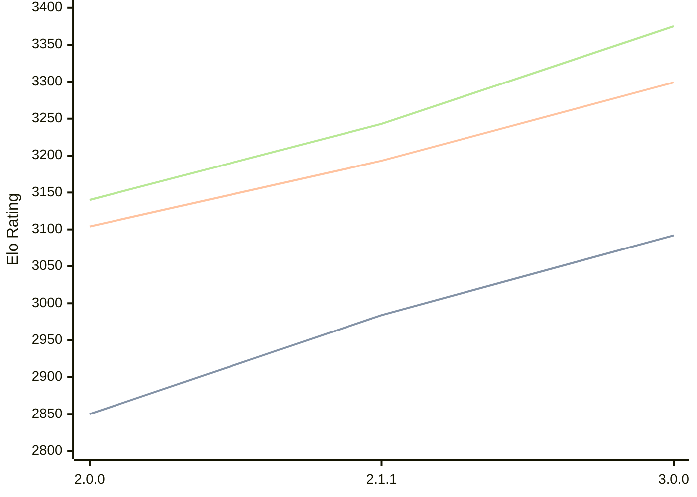

# Engine: Bread

Author: 

Home: https://github.com/Nonlinear2/Bread-Engine

## Elo Ratings

| Version | Published | STC 8.0+0.08s  | LTC 60.0+0.60s | VLTC 2m24s+1.12s | Comment |
| --- | --- | --- | --- | --- | --- |
| 4.0.0 | 2026-07-29 |  |  |  |  |
| 3.1.0 | 2026-05-22 |  |  |  |  |
| 3.0.0 | 2026-03-15 | 3092(+108) | 3299(+106) | 3375(+132) |  |
| 2.1.1 | 2025-12-22 | 2984(+new) | 3193(+new) | 3243(+new) |  |
| 2.1.0 | 2025-12-21 |  |  |  | always disconnects |
| 2.0.0 | 2025-10-18 | 2850 | 3104 | 3140 |  |
 | | | cElo (∆ prev) | cElo (∆ prev) | cElo (∆ prev) | 

<a href="https://github.com/computer-chess-index/cci/issues/new?template=submit-version.yml&title=[VERSION]+Bread+<version>&body=###%20Engine%20name%0ABread%0A%0A###%20Version%0A4.0.0" target="_blank">Submit new version</a>

 Test Conditions:

GUI/CLI: <a href=https://github.com/cutechess/cutechess target="_blank">Cute-Chess</a> 
Elo Calculation: <a href=https://www.remi-coulom.fr/Bayesian-Elo/ target="_blank">Bayesian-Elo</a> 
CPU: Intel(R) Core(TM) i5-7500T 2.70GHz 
Opening book: 8_moves_v3 
\* STC: 8.0+0.08s, LTC: 60.0+0.60s, VLTC: 2m24s+1.12s

 Lists:
Ratings: <a href=https://github.com/computer-chess-index/cci/blob/main/lists/CCIRatings.csv target="_blank">Complete list</a>

Generated: 2026-08-12 06:24:08

## Ratings Verlauf

⬛ STC (8.0+0.08s) &nbsp;&nbsp; 🟧 LTC (60.0+0.60s) &nbsp;&nbsp; 🟩 VLTC (2m24s+1.12s)

dark mode: 🟩STC (8.0+0.08s) 🟧LTC (60.0+0.60s) ⬜VLTC (2m24s+1.12s)

## Detailed Evaluation Results

| Version | Time Control | Elo  | Range +/- | Matches | Score | Average Opponent Elo | Draws |
| --- | --- | --- | --- | --- | --- | --- | --- |
| 3.0.0 | VLTC (2m24s+1.12s) | 3375 | 23 | 452 | 50% | 3375 | 74% |
| 3.0.0 | LTC (60.0+0.60s) | 3299 | 25 | 412 | 51% | 3291 | 73% |
| 3.0.0 | STC (8.0+0.08s) | 3092 | 23 | 516 | 50% | 3090 | 58% |
| --- | --- | --- | --- | --- | --- | --- | --- |
| 2.1.1 | VLTC (2m24s+1.12s) | 3243 | 30 | 294 | 50% | 3240 | 61% |
| 2.1.1 | LTC (60.0+0.60s) | 3193 | 28 | 348 | 50% | 3181 | 55% |
| 2.1.1 | STC (8.0+0.08s) | 2984 | 28 | 364 | 52% | 2969 | 47% |
| --- | --- | --- | --- | --- | --- | --- | --- |
| 2.0.0 | VLTC (2m24s+1.12s) | 3140 | 37 | 208 | 57% | 3033 | 55% |
| 2.0.0 | LTC (60.0+0.60s) | 3104 | 40 | 188 | 56% | 3021 | 53% |
| 2.0.0 | STC (8.0+0.08s) | 2850 | 38 | 208 | 51% | 2819 | 44% |
| --- | --- | --- | --- | --- | --- | --- | --- |