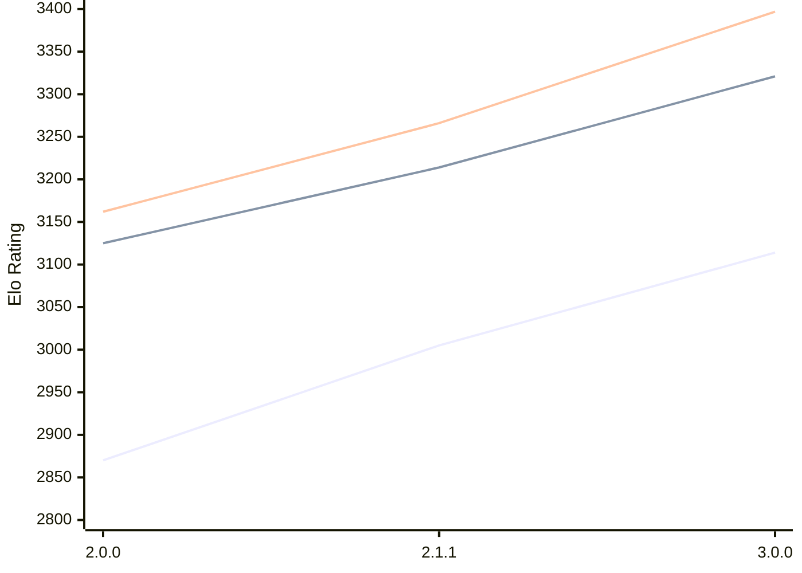

# Engine: Bread

Author: 

Home: https://github.com/Nonlinear2/Bread-Engine

## Elo Ratings E1 (Ultra 7 265T (1.50 GHz) - E-Core)

| Version | Published | STC 8.0+0.08s  | LTC 60.0+0.60s | VLTC 2m24s+1.12s | Comment |
| --- | --- | --- | --- | --- | --- |
| 3.0.0 | 2026-03-15 | 3042 | 3243 | 3344 |  |
 | | | cElo (∆ prev) | cElo (∆ prev) | cElo (∆ prev) | 

## Elo Ratings P1 (Ultra 7 265T (1.50 GHz) - P-Core)

| Version | Published | STC 8.0+0.08s  | LTC 60.0+0.60s | VLTC 2m24s+1.12s | Comment |
| --- | --- | --- | --- | --- | --- |
| 3.0.0 | 2026-03-15 | 3190 | 3434 | 3524 |  |
 | | | cElo (∆ prev) | cElo (∆ prev) | cElo (∆ prev) | 

## Elo Ratings T1 (i5-7500T 2.70GHz)

| Version | Published | STC 8.0+0.08s  | LTC 60.0+0.60s | VLTC 2m24s+1.12s | Comment |
| --- | --- | --- | --- | --- | --- |
| 3.0.0 | 2026-03-15 | 3114(+109) | 3321(+107) | 3397(+131) |  |
| 2.1.1 | 2025-12-22 | 3005(+135) | 3214(+89) | 3266(+104) |  |
| 2.0.0 | 2025-10-18 | 2870 | 3125 | 3162 |  |
 | | | cElo (∆ prev) | cElo (∆ prev) | cElo (∆ prev) | 

<a href="https://github.com/computer-chess-index/cci/issues/new?template=submit-version.yml&title=[VERSION]+Bread+<version>&body=###%20Engine%20name%0ABread%0A%0A###%20Version%0A3.0.0" target="_blank">Submit new version</a>

 Test Conditions:

GUI/CLI: <a href=https://github.com/cutechess/cutechess target="_blank">Cute-Chess</a> 
Elo Calculation: <a href=https://www.remi-coulom.fr/Bayesian-Elo/ target="_blank">Bayesian-Elo</a> 
CPU for P1: Intel(R) Core(TM) Ultra 7 265T (1.50 GHz) - P-Core 
CPU for E1: Intel(R) Core(TM) Ultra 7 265T (1.50 GHz) - E-Core 
CPU for T1: Intel(R) Core(TM) i5-7500T 2.70GHz 
Opening book: 8_moves_v3 
\* STC: 8.0+0.08s, LTC: 60.0+0.60s, VLTC: 2m24s+1.12s

 Lists:
Ratings: <a href=https://github.com/computer-chess-index/cci/blob/main/lists/CCIRatings.csv target="_blank">Complete list</a>

Generated: 2026-10-15 04:36:36

## Ratings Verlauf T1

```mermaid
%%{init: {"theme":"base","themeVariables":{"seriesColors:['#a3a3a3','#222221','#faa371']}}}%%
xychart-beta
  x-axis ["2.0.0", "2.1.1", "3.0.0"]
  y-axis "Elo Rating" 2800 --> 3400
  line "T1: STC (8.0+0.08s)" [2870, 3005, 3114]
  line "T1: LTC (60.0+0.60s)" [3125, 3214, 3321]
  line "T1: VLTC (2m24s+1.12s)" [3162, 3266, 3397]
```

## Detailed Evaluation Results

| Version | Time Control | Variant | Elo  | Range +/- | Matches | Score | Average Opponent Elo | Draws |
| --- | --- |--- | --- | --- | --- | --- | --- | --- |
| 3.0.0 | VLTC (2m24s+1.12s) | E1 | 3344 | 34 | 260 | 60% | 3205 | 55% |
|  |  | T1 | 3397 | 22 | 500 | 50% | 3399 | 75% |
|  |  | P1 | 3524 | 38 | 174 | 53% | 3483 | 71% |
|  | LTC (60.0+0.60s) | E1 | 3243 | 36 | 226 | 58% | 3106 | 56% |
|  |  | T1 | 3321 | 24 | 436 | 51% | 3314 | 72% |
|  |  | P1 | 3434 | 41 | 164 | 54% | 3384 | 61% |
|  | STC (8.0+0.08s) | E1 | 3042 | 32 | 268 | 47% | 3062 | 54% |
|  |  | T1 | 3114 | 22 | 588 | 50% | 3112 | 57% |
|  |  | P1 | 3190 | 38 | 188 | 48% | 3209 | 57% |
| --- | --- |--- | --- | --- | --- | --- | --- | --- |
| 2.1.1 | VLTC (2m24s+1.12s) | T1 | 3266 | 30 | 294 | 50% | 3263 | 61% |
|  | LTC (60.0+0.60s) | T1 | 3214 | 28 | 348 | 50% | 3204 | 55% |
|  | STC (8.0+0.08s) | T1 | 3005 | 28 | 364 | 52% | 2989 | 47% |
| --- | --- |--- | --- | --- | --- | --- | --- | --- |
| 2.0.0 | VLTC (2m24s+1.12s) | T1 | 3162 | 37 | 208 | 57% | 3055 | 55% |
|  | LTC (60.0+0.60s) | T1 | 3125 | 40 | 188 | 56% | 3042 | 53% |
|  | STC (8.0+0.08s) | T1 | 2870 | 38 | 208 | 51% | 2839 | 44% |