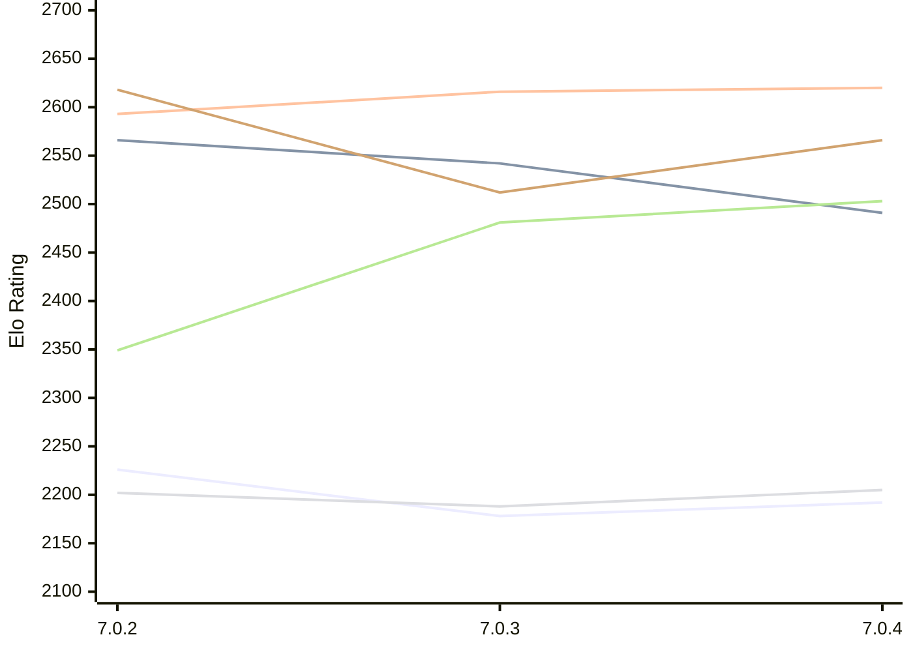

# Engine: Buster

Author: Anders Carlsson

Home: https://github.com/andersrcarlsson-stack/Buster-Chess

## Elo Ratings E1 (Ultra 7 265T (1.50 GHz) - E-Core)

| Version | Published | STC 8.0+0.08s  | LTC 60.0+0.60s | VLTC 2m24s+1.12s | Comment |
| --- | --- | --- | --- | --- | --- |
| 7.0.4 | 2026-11-05 | 2192(+14) | 2491(-51) | 2620(+4) |  |
| 7.0.3 | 2026-10-29 | 2178(-48) | 2542(-24) | 2616(+23) |  |
| 7.0.2 | 2026-09-26 | 2226 | 2566 | 2593 |  |
 | | | cElo (∆ prev) | cElo (∆ prev) | cElo (∆ prev) | 

## Elo Ratings P1 (Ultra 7 265T (1.50 GHz) - P-Core)

| Version | Published | STC 8.0+0.08s  | LTC 60.0+0.60s | VLTC 2m24s+1.12s | Comment |
| --- | --- | --- | --- | --- | --- |
| 7.0.4 | 2026-11-05 | 2205(+17) | 2503(+22) | 2566(+54) |  |
| 7.0.3 | 2026-10-29 | 2188(-14) | 2481(+132) | 2512(-106) |  |
| 7.0.2 | 2026-09-26 | 2202 | 2349 | 2618 |  |
 | | | cElo (∆ prev) | cElo (∆ prev) | cElo (∆ prev) | 

## Elo Ratings T1 (i5-7500T 2.70GHz)

| Version | Published | STC 8.0+0.08s  | LTC 60.0+0.60s | VLTC 2m24s+1.12s | Comment |
| --- | --- | --- | --- | --- | --- |
| 7.0.2 | 2026-09-26 | 2202 | 2349 | 2618 |  |
 | | | cElo (∆ prev) | cElo (∆ prev) | cElo (∆ prev) | 

<a href="https://github.com/computer-chess-index/cci/issues/new?template=submit-version.yml&title=[VERSION]+Buster+<version>&body=###%20Engine%20name%0ABuster%0A%0A###%20Version%0A7.0.4" target="_blank">Submit new version</a>

 Test Conditions:

GUI/CLI: <a href=https://github.com/cutechess/cutechess target="_blank">Cute-Chess</a> 
Elo Calculation: <a href=https://www.remi-coulom.fr/Bayesian-Elo/ target="_blank">Bayesian-Elo</a> 
CPU for P1: Intel(R) Core(TM) Ultra 7 265T (1.50 GHz) - P-Core 
CPU for E1: Intel(R) Core(TM) Ultra 7 265T (1.50 GHz) - E-Core 
CPU for T1: Intel(R) Core(TM) i5-7500T 2.70GHz 
Opening book: 8_moves_v3 
\* STC: 8.0+0.08s, LTC: 60.0+0.60s, VLTC: 2m24s+1.12s

 Lists:
Ratings: <a href=https://github.com/computer-chess-index/cci/blob/main/lists/CCIRatings.csv target="_blank">Complete list</a>

Generated: 2026-11-23 05:36:35

## Ratings Verlauf E1 / P1

```mermaid
%%{init: {"theme":"base","themeVariables":{"seriesColors:['#a3a3a3','#222221','#faa371']}}}%%
xychart-beta
  x-axis ["7.0.2", "7.0.3", "7.0.4"]
  y-axis "Elo Rating" 2100 --> 2700
  line "E1: STC (8.0+0.08s)" [2226, 2178, 2192]
  line "E1: LTC (60.0+0.60s)" [2566, 2542, 2491]
  line "E1: VLTC (2m24s+1.12s)" [2593, 2616, 2620]
  line "P1: STC (8.0+0.08s)" [2202, 2188, 2205]
  line "P1: LTC (60.0+0.60s)" [2349, 2481, 2503]
  line "P1: VLTC (2m24s+1.12s)" [2618, 2512, 2566]
```

## Detailed Evaluation Results

| Version | Time Control | Variant | Elo  | Range +/- | Matches | Score | Average Opponent Elo | Draws |
| --- | --- |--- | --- | --- | --- | --- | --- | --- |
| 7.0.4 | VLTC (2m24s+1.12s) | E1 | 2620 | 32 | 352 | 48% | 2631 | 26% |
|  |  | P1 | 2566 | 44 | 172 | 50% | 2570 | 29% |
|  | LTC (60.0+0.60s) | E1 | 2491 | 35 | 272 | 52% | 2473 | 30% |
|  |  | P1 | 2503 | 38 | 236 | 49% | 2506 | 31% |
|  | STC (8.0+0.08s) | P1 | 2205 | 41 | 204 | 48% | 2229 | 28% |
|  |  | E1 | 2192 | 35 | 280 | 51% | 2175 | 26% |
| --- | --- |--- | --- | --- | --- | --- | --- | --- |
| 7.0.3 | VLTC (2m24s+1.12s) | P1 | 2512 | 45 | 168 | 56% | 2442 | 32% |
|  |  | E1 | 2616 | 37 | 260 | 53% | 2579 | 24% |
|  | LTC (60.0+0.60s) | P1 | 2481 | 44 | 188 | 57% | 2358 | 28% |
|  |  | E1 | 2542 | 30 | 396 | 57% | 2442 | 27% |
|  | STC (8.0+0.08s) | P1 | 2188 | 43 | 206 | 57% | 2095 | 26% |
|  |  | E1 | 2178 | 39 | 244 | 55% | 2106 | 19% |
| --- | --- |--- | --- | --- | --- | --- | --- | --- |
| 7.0.2 | VLTC (2m24s+1.12s) | P1 | 2618 | 76 | 56 | 50% | 2619 | 29% |
|  |  | E1 | 2593 | 40 | 212 | 54% | 2547 | 30% |
|  | LTC (60.0+0.60s) | P1 | 2349 | 238 | 4 | 25% | 2500 | 50% |
|  |  | E1 | 2566 | 48 | 144 | 52% | 2553 | 30% |
|  | STC (8.0+0.08s) | P1 | 2202 | 93 | 40 | 59% | 2124 | 23% |
|  |  | E1 | 2226 | 48 | 144 | 47% | 2255 | 30% |