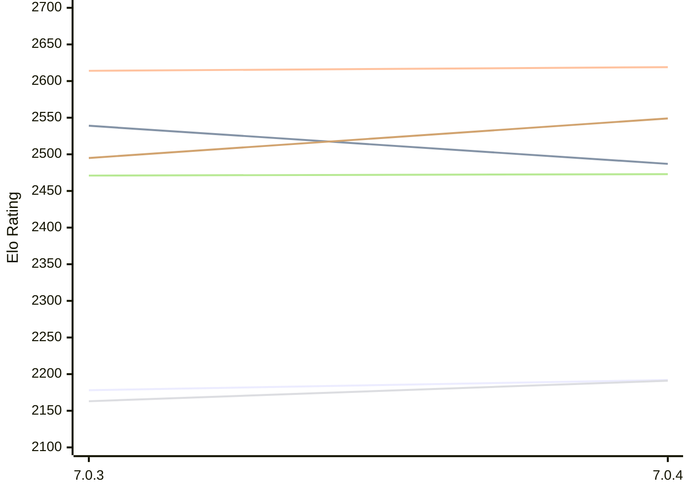

# Engine: Buster

Author: Anders Carlsson

Home: https://github.com/andersrcarlsson-stack/Buster-Chess

## Elo Ratings E1 (Ultra 7 265T (1.50 GHz) - E-Core)

| Version | Published | STC 8.0+0.08s  | LTC 60.0+0.60s | VLTC 2m24s+1.12s | Comment |
| --- | --- | --- | --- | --- | --- |
| 7.0.4 | 2026-11-05 | 2192(+14) | 2487(-52) | 2619(+5) |  |
| 7.0.3 | 2026-10-29 | 2178 | 2539 | 2614 |  |
 | | | cElo (∆ prev) | cElo (∆ prev) | cElo (∆ prev) | 

## Elo Ratings P1 (Ultra 7 265T (1.50 GHz) - P-Core)

| Version | Published | STC 8.0+0.08s  | LTC 60.0+0.60s | VLTC 2m24s+1.12s | Comment |
| --- | --- | --- | --- | --- | --- |
| 7.0.4 | 2026-11-05 | 2191(+28) | 2473(+2) | 2549(+54) |  |
| 7.0.3 | 2026-10-29 | 2163 | 2471 | 2495 |  |
 | | | cElo (∆ prev) | cElo (∆ prev) | cElo (∆ prev) | 

## Elo Ratings T1 (i5-7500T 2.70GHz)

| Version | Published | STC 8.0+0.08s  | LTC 60.0+0.60s | VLTC 2m24s+1.12s | Comment |
| --- | --- | --- | --- | --- | --- |
| 7.0.3 | 2026-10-29 | 2163 | 2471 | 2495 |  |
 | | | cElo (∆ prev) | cElo (∆ prev) | cElo (∆ prev) | 

<a href="https://github.com/computer-chess-index/cci/issues/new?template=submit-version.yml&title=[VERSION]+Buster+<version>&body=###%20Engine%20name%0ABuster%0A%0A###%20Version%0A7.0.4" target="_blank">Submit new version</a>

 Test Conditions:

GUI/CLI: <a href=https://github.com/cutechess/cutechess target="_blank">Cute-Chess</a> 
Elo Calculation: <a href=https://www.remi-coulom.fr/Bayesian-Elo/ target="_blank">Bayesian-Elo</a> 
CPU for P1: Intel(R) Core(TM) Ultra 7 265T (1.50 GHz) - P-Core 
CPU for E1: Intel(R) Core(TM) Ultra 7 265T (1.50 GHz) - E-Core 
CPU for T1: Intel(R) Core(TM) i5-7500T 2.70GHz 
Opening book: 8_moves_v3 
\* STC: 8.0+0.08s, LTC: 60.0+0.60s, VLTC: 2m24s+1.12s

 Lists:
Ratings: <a href=https://github.com/computer-chess-index/cci/blob/main/lists/CCIRatings.csv target="_blank">Complete list</a>

Generated: 2026-11-18 05:36:45

## Ratings Verlauf E1 / P1

```mermaid
%%{init: {"theme":"base","themeVariables":{"seriesColors:['#a3a3a3','#222221','#faa371']}}}%%
xychart-beta
  x-axis ["7.0.3", "7.0.4"]
  y-axis "Elo Rating" 2100 --> 2700
  line "E1: STC (8.0+0.08s)" [2178, 2192]
  line "E1: LTC (60.0+0.60s)" [2539, 2487]
  line "E1: VLTC (2m24s+1.12s)" [2614, 2619]
  line "P1: STC (8.0+0.08s)" [2163, 2191]
  line "P1: LTC (60.0+0.60s)" [2471, 2473]
  line "P1: VLTC (2m24s+1.12s)" [2495, 2549]
```

## Detailed Evaluation Results

| Version | Time Control | Variant | Elo  | Range +/- | Matches | Score | Average Opponent Elo | Draws |
| --- | --- |--- | --- | --- | --- | --- | --- | --- |
| 7.0.4 | VLTC (2m24s+1.12s) | P1 | 2549 | 45 | 168 | 50% | 2556 | 28% |
|  |  | E1 | 2619 | 33 | 320 | 48% | 2630 | 27% |
|  | LTC (60.0+0.60s) | P1 | 2473 | 40 | 212 | 47% | 2495 | 32% |
|  |  | E1 | 2487 | 35 | 268 | 52% | 2471 | 30% |
|  | STC (8.0+0.08s) | P1 | 2191 | 45 | 168 | 47% | 2228 | 29% |
|  |  | E1 | 2192 | 35 | 276 | 51% | 2175 | 26% |
| --- | --- |--- | --- | --- | --- | --- | --- | --- |
| 7.0.3 | VLTC (2m24s+1.12s) | P1 | 2495 | 46 | 160 | 56% | 2423 | 32% |
|  |  | E1 | 2614 | 37 | 260 | 53% | 2576 | 24% |
|  | LTC (60.0+0.60s) | P1 | 2471 | 46 | 172 | 58% | 2336 | 27% |
|  |  | E1 | 2539 | 30 | 396 | 57% | 2441 | 27% |
|  | STC (8.0+0.08s) | P1 | 2163 | 45 | 188 | 56% | 2080 | 25% |
|  |  | E1 | 2178 | 39 | 244 | 55% | 2106 | 19% |