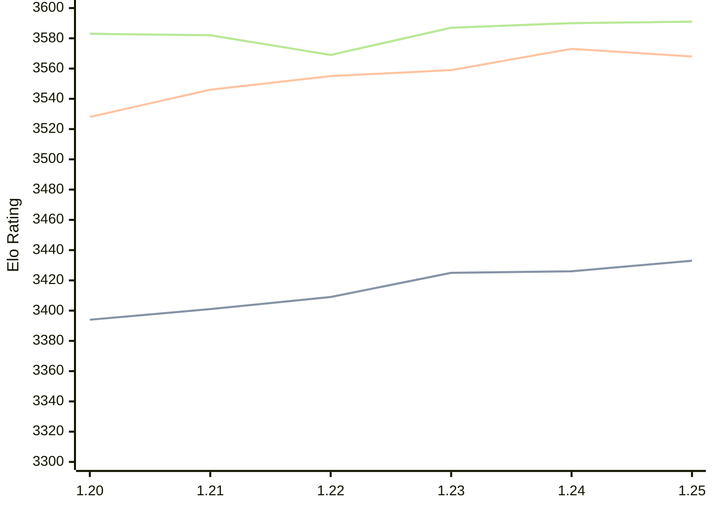

# Engine: Caissa

Author: Michał Witanowski

Home: https://github.com/Witek902/Caissa

## Ratings nach Version

| Version | Published | STC 8.0+0.08s  | LTC 60.0+0.60s | VLTC 2m24s+1.12s | Comment |
| --- | --- | --- | --- | --- | --- |
| 1.25 | 2026-04-05 | 3433(+7) | 3568(-5) | 3591(+1) |  |
| 1.24 | 2025-12-03 | 3426(+1) | 3573(+14) | 3590(+3) |  |
| 1.23 | 2025-08-21 | 3425(+16) | 3559(+4) | 3587(+18) |  |
| 1.22 | 2025-04-30 | 3409(+8) | 3555(+9) | 3569(-13) |  |
| 1.21 | 2024-10-27 | 3401(+7) | 3546(+18) | 3582(-1) |  |
| 1.20 | 2024-07-28 | 3394(+new) | 3528(+new) | 3583(+new) |  |
| 1.19 | 2024-06-23 |  |  |  |  |
| 1.18 | 2024-04-02 |  |  |  |  |
| 1.17 | 2024-02-12 |  |  |  |  |
| 1.16 | 2024-01-11 |  |  |  |  |
| 1.15 | 2023-12-13 |  |  |  |  |
| 1.14 | 2023-11-12 |  |  |  |  |
| 1.13.1 | 2023-09-29 |  |  |  |  |
| 1.13 | 2023-09-28 |  |  |  |  |
| 1.12 | 2023-09-02 |  |  |  |  |
| 1.11 | 2023-07-23 |  |  |  |  |
| 1.10 | 2023-06-26 |  |  |  |  |
| 1.9 | 2023-06-08 |  |  |  |  |
| 1.8 | 2023-04-25 |  |  |  |  |
| 1.7 | 2023-03-14 |  |  |  |  |
| 1.6.3 | 2023-02-17 |  |  |  |  |
| 1.6 | 2023-02-07 |  |  |  |  |
| 1.5 | 2023-01-15 |  |  |  |  |
| 1.4 | 2022-11-30 |  |  |  |  |
| 1.3 | 2022-11-15 |  |  |  |  |
| 1.2 | 2022-10-23 |  |  |  |  |
| 1.1 | 2022-10-02 |  |  |  |  |
| 1.0 | 2022-09-18 |  |  |  |  |
| 0.9 | 2022-08-21 |  |  |  |  |
| 0.8 | 2022-07-29 |  |  |  |  |
| 0.7 | 2022-07-11 |  |  |  |  |
| 0.5 | 2022-03-16 |  |  |  |  |
| 0.4 | 2021-11-12 |  |  |  |  |
| 0.3 | 2021-11-03 |  |  |  |  |
| 0.2 | 2021-10-28 |  |  |  |  |
 | | | cElo (∆ prev) | cElo (∆ prev) | cElo (∆ prev) | 

<a href="https://github.com/computer-chess-index/cci/issues/new?template=submit-version.yml&title=[VERSION]+Caissa+<version>&body=###%20Engine%20name%0ACaissa%0A%0A###%20Version%0A1.25" target="_blank">Submit new version</a>

 Test Conditions:

GUI/CLI: <a href=https://github.com/cutechess/cutechess target="_blank">Cute-Chess</a> 
Elo Calculation: <a href=https://www.remi-coulom.fr/Bayesian-Elo/ target="_blank">Bayesian-Elo</a> 
CPU: Intel(R) Core(TM) i5-7500T 2.70GHz 
Opening book: 8_moves_v3 
\* STC: 8.0+0.08s, LTC: 60.0+0.60s, VLTC: 2m24s+1.12s

 Lists:
Ratings: <a href=https://github.com/computer-chess-index/cci/blob/main/lists/CCIRatings.csv target="_blank">Complete list</a>

Generated: 2026-04-22 06:23:00

## Ratings Verlauf

⬛ STC (8.0+0.08s) &nbsp;&nbsp; 🟧 LTC (60.0+0.60s) &nbsp;&nbsp; 🟩 VLTC (2m24s+1.12s)

dark mode: 🟩STC (8.0+0.08s) 🟧LTC (60.0+0.60s) ⬜VLTC (2m24s+1.12s)

