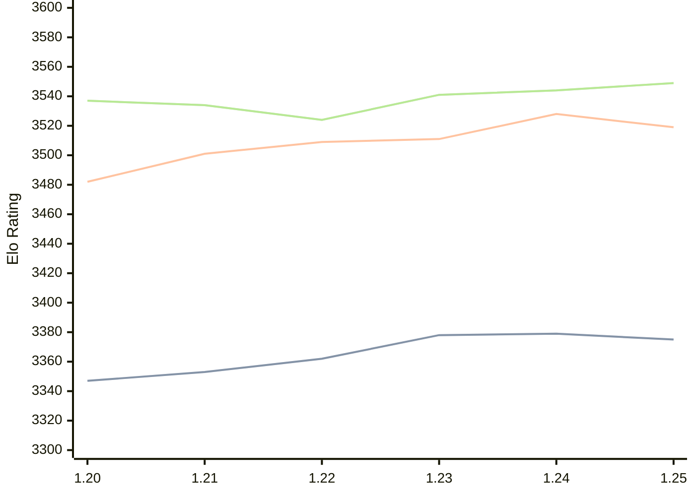

# Engine: Caissa

Author: Michał Witanowski

Home: https://github.com/Witek902/Caissa

## Elo Ratings

| Version | Published | STC 8.0+0.08s  | LTC 60.0+0.60s | VLTC 2m24s+1.12s | Comment |
| --- | --- | --- | --- | --- | --- |
| 1.25 | 2026-04-05 | 3375(-4) | 3519(-9) | 3549(+5) |  |
| 1.24 | 2025-12-03 | 3379(+1) | 3528(+17) | 3544(+3) |  |
| 1.23 | 2025-08-21 | 3378(+16) | 3511(+2) | 3541(+17) |  |
| 1.22 | 2025-04-30 | 3362(+9) | 3509(+8) | 3524(-10) |  |
| 1.21 | 2024-10-27 | 3353(+6) | 3501(+19) | 3534(-3) |  |
| 1.20 | 2024-07-28 | 3347(+new) | 3482(+new) | 3537(+new) |  |
| 1.19 | 2024-06-23 |  |  |  |  |
| 1.18 | 2024-04-02 |  |  |  |  |
| 1.17 | 2024-02-12 |  |  |  |  |
| 1.16 | 2024-01-11 |  |  |  |  |
| 1.15 | 2023-12-13 |  |  |  |  |
| 1.14 | 2023-11-12 |  |  |  |  |
| 1.13.1 | 2023-09-29 |  |  |  |  |
| 1.13 | 2023-09-28 |  |  |  |  |
| 1.12 | 2023-09-02 |  |  |  |  |
| 1.11 | 2023-07-23 |  |  |  |  |
| 1.10 | 2023-06-26 |  |  |  |  |
| 1.9 | 2023-06-08 |  |  |  |  |
| 1.8 | 2023-04-25 |  |  |  |  |
| 1.7 | 2023-03-14 |  |  |  |  |
| 1.6.3 | 2023-02-17 |  |  |  |  |
| 1.6 | 2023-02-07 |  |  |  |  |
| 1.5 | 2023-01-15 |  |  |  |  |
| 1.4 | 2022-11-30 |  |  |  |  |
| 1.3 | 2022-11-15 |  |  |  |  |
| 1.2 | 2022-10-23 |  |  |  |  |
| 1.1 | 2022-10-02 |  |  |  |  |
| 1.0 | 2022-09-18 |  |  |  |  |
| 0.9 | 2022-08-21 |  |  |  |  |
| 0.8 | 2022-07-29 |  |  |  |  |
| 0.7 | 2022-07-11 |  |  |  |  |
| 0.5 | 2022-03-16 |  |  |  |  |
| 0.4 | 2021-11-12 |  |  |  |  |
| 0.3 | 2021-11-03 |  |  |  |  |
| 0.2 | 2021-10-28 |  |  |  |  |
 | | | cElo (∆ prev) | cElo (∆ prev) | cElo (∆ prev) | 

<a href="https://github.com/computer-chess-index/cci/issues/new?template=submit-version.yml&title=[VERSION]+Caissa+<version>&body=###%20Engine%20name%0ACaissa%0A%0A###%20Version%0A1.25" target="_blank">Submit new version</a>

 Test Conditions:

GUI/CLI: <a href=https://github.com/cutechess/cutechess target="_blank">Cute-Chess</a> 
Elo Calculation: <a href=https://www.remi-coulom.fr/Bayesian-Elo/ target="_blank">Bayesian-Elo</a> 
CPU: Intel(R) Core(TM) i5-7500T 2.70GHz 
Opening book: 8_moves_v3 
\* STC: 8.0+0.08s, LTC: 60.0+0.60s, VLTC: 2m24s+1.12s

 Lists:
Ratings: <a href=https://github.com/computer-chess-index/cci/blob/main/lists/CCIRatings.csv target="_blank">Complete list</a>

Generated: 2026-07-14 06:23:16

## Ratings Verlauf

## Ratings Verlauf

⬛ STC (8.0+0.08s) &nbsp;&nbsp; 🟧 LTC (60.0+0.60s) &nbsp;&nbsp; 🟩 VLTC (2m24s+1.12s)

dark mode: 🟩STC (8.0+0.08s) 🟧LTC (60.0+0.60s) ⬜VLTC (2m24s+1.12s)

## Detailed Evaluation Results

| Version | Time Control | Elo  | Range +/- | Matches | Score | Average Opponent Elo | Draws |
| --- | --- | --- | --- | --- | --- | --- | --- |
| 1.25 | VLTC (2m24s+1.12s) | 3549 | 24 | 388 | 50% | 3546 | 91% |
| 1.25 | LTC (60.0+0.60s) | 3519 | 24 | 404 | 50% | 3521 | 86% |
| 1.25 | STC (8.0+0.08s) | 3375 | 24 | 416 | 49% | 3383 | 73% |
| --- | --- | --- | --- | --- | --- | --- | --- |
| 1.24 | VLTC (2m24s+1.12s) | 3544 | 28 | 296 | 52% | 3533 | 91% |
| 1.24 | LTC (60.0+0.60s) | 3528 | 29 | 272 | 50% | 3525 | 92% |
| 1.24 | STC (8.0+0.08s) | 3379 | 21 | 534 | 50% | 3378 | 75% |
| --- | --- | --- | --- | --- | --- | --- | --- |
| 1.23 | VLTC (2m24s+1.12s) | 3541 | 28 | 288 | 51% | 3536 | 91% |
| 1.23 | LTC (60.0+0.60s) | 3511 | 29 | 280 | 51% | 3509 | 87% |
| 1.23 | STC (8.0+0.08s) | 3378 | 23 | 468 | 48% | 3390 | 73% |
| --- | --- | --- | --- | --- | --- | --- | --- |
| 1.22 | VLTC (2m24s+1.12s) | 3524 | 24 | 388 | 50% | 3524 | 85% |
| 1.22 | LTC (60.0+0.60s) | 3509 | 25 | 356 | 49% | 3513 | 87% |
| 1.22 | STC (8.0+0.08s) | 3362 | 25 | 380 | 50% | 3359 | 76% |
| --- | --- | --- | --- | --- | --- | --- | --- |
| 1.21 | VLTC (2m24s+1.12s) | 3534 | 18 | 724 | 51% | 3528 | 92% |
| 1.21 | LTC (60.0+0.60s) | 3501 | 15 | 1096 | 51% | 3482 | 86% |
| 1.21 | STC (8.0+0.08s) | 3353 | 15 | 1136 | 50% | 3355 | 74% |
| --- | --- | --- | --- | --- | --- | --- | --- |
| 1.20 | VLTC (2m24s+1.12s) | 3537 | 36 | 176 | 51% | 3530 | 84% |
| 1.20 | LTC (60.0+0.60s) | 3482 | 37 | 168 | 50% | 3449 | 89% |
| 1.20 | STC (8.0+0.08s) | 3347 | 30 | 267 | 48% | 3360 | 75% |
| --- | --- | --- | --- | --- | --- | --- | --- |