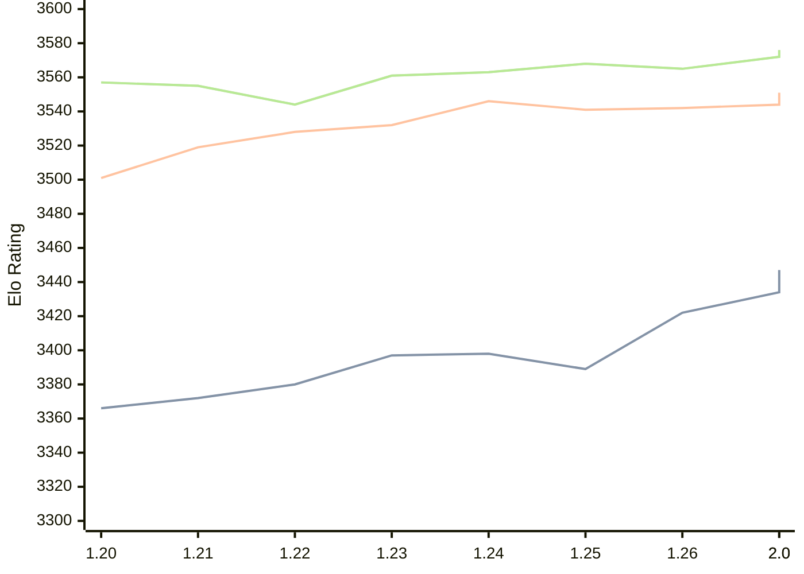

# Engine: Caissa

Author: Michał Witanowski

Home: https://github.com/Witek902/Caissa

## Elo Ratings

| Version | Published | STC 8.0+0.08s  | LTC 60.0+0.60s | VLTC 2m24s+1.12s | Comment |
| --- | --- | --- | --- | --- | --- |
| 2.0 | 2026-09-19 | 3434(-13) | 3544(-7) | 3572(-4) |  |
| 2.0 | 2026-09-19 | 3447(+25) | 3551(+9) | 3576(+11) |  |
| 1.26 | 2026-08-09 | 3422(+33) | 3542(+1) | 3565(-3) |  |
| 1.25 | 2026-04-05 | 3389(-9) | 3541(-5) | 3568(+5) |  |
| 1.24 | 2025-12-03 | 3398(+1) | 3546(+14) | 3563(+2) |  |
| 1.23 | 2025-08-21 | 3397(+17) | 3532(+4) | 3561(+17) |  |
| 1.22 | 2025-04-30 | 3380(+8) | 3528(+9) | 3544(-11) |  |
| 1.21 | 2024-10-27 | 3372(+6) | 3519(+18) | 3555(-2) |  |
| 1.20 | 2024-07-28 | 3366 | 3501 | 3557 |  |
 | | | cElo (∆ prev) | cElo (∆ prev) | cElo (∆ prev) | 

<a href="https://github.com/computer-chess-index/cci/issues/new?template=submit-version.yml&title=[VERSION]+Caissa+<version>&body=###%20Engine%20name%0ACaissa%0A%0A###%20Version%0A2.0" target="_blank">Submit new version</a>

 Test Conditions:

GUI/CLI: <a href=https://github.com/cutechess/cutechess target="_blank">Cute-Chess</a> 
Elo Calculation: <a href=https://www.remi-coulom.fr/Bayesian-Elo/ target="_blank">Bayesian-Elo</a> 
CPU: Intel(R) Core(TM) i5-7500T 2.70GHz 
Opening book: 8_moves_v3 
\* STC: 8.0+0.08s, LTC: 60.0+0.60s, VLTC: 2m24s+1.12s

 Lists:
Ratings: <a href=https://github.com/computer-chess-index/cci/blob/main/lists/CCIRatings.csv target="_blank">Complete list</a>

Generated: 2026-09-25 04:36:35

## Ratings Verlauf

## Detailed Evaluation Results

| Version | Time Control | Elo  | Range +/- | Matches | Score | Average Opponent Elo | Draws |
| --- | --- | --- | --- | --- | --- | --- | --- |
| 2.0 | VLTC (2m24s+1.12s) | 3572 | 43 | 122 | 51% | 3568 | 87% |
| 2.0 | VLTC (2m24s+1.12s) | 3576 | 43 | 124 | 51% | 3571 | 87% |
| 2.0 | LTC (60.0+0.60s) | 3544 | 57 | 66 | 49% | 3549 | 95% |
| 2.0 | LTC (60.0+0.60s) | 3551 | 51 | 84 | 50% | 3551 | 95% |
| 2.0 | STC (8.0+0.08s) | 3447 | 45 | 114 | 51% | 3438 | 83% |
| --- | --- | --- | --- | --- | --- | --- | --- |
| 2.0 | STC (8.0+0.08s) | 3434 | 52 | 88 | 50% | 3434 | 82% |
| --- | --- | --- | --- | --- | --- | --- | --- |
| 1.26 | VLTC (2m24s+1.12s) | 3565 | 31 | 242 | 50% | 3564 | 85% |
| 1.26 | LTC (60.0+0.60s) | 3542 | 27 | 318 | 51% | 3538 | 85% |
| 1.26 | STC (8.0+0.08s) | 3422 | 28 | 302 | 50% | 3420 | 76% |
| --- | --- | --- | --- | --- | --- | --- | --- |
| 1.25 | VLTC (2m24s+1.12s) | 3568 | 23 | 420 | 50% | 3567 | 91% |
| 1.25 | LTC (60.0+0.60s) | 3541 | 23 | 440 | 50% | 3541 | 86% |
| 1.25 | STC (8.0+0.08s) | 3389 | 23 | 460 | 48% | 3402 | 73% |
| --- | --- | --- | --- | --- | --- | --- | --- |
| 1.24 | VLTC (2m24s+1.12s) | 3563 | 28 | 296 | 52% | 3552 | 91% |
| 1.24 | LTC (60.0+0.60s) | 3546 | 29 | 272 | 50% | 3544 | 92% |
| 1.24 | STC (8.0+0.08s) | 3398 | 21 | 534 | 50% | 3397 | 75% |
| --- | --- | --- | --- | --- | --- | --- | --- |
| 1.23 | VLTC (2m24s+1.12s) | 3561 | 28 | 288 | 51% | 3555 | 91% |
| 1.23 | LTC (60.0+0.60s) | 3532 | 29 | 280 | 51% | 3529 | 87% |
| 1.23 | STC (8.0+0.08s) | 3397 | 23 | 468 | 48% | 3409 | 73% |
| --- | --- | --- | --- | --- | --- | --- | --- |
| 1.22 | VLTC (2m24s+1.12s) | 3544 | 24 | 388 | 50% | 3544 | 85% |
| 1.22 | LTC (60.0+0.60s) | 3528 | 25 | 356 | 49% | 3533 | 87% |
| 1.22 | STC (8.0+0.08s) | 3380 | 25 | 380 | 50% | 3378 | 76% |
| --- | --- | --- | --- | --- | --- | --- | --- |
| 1.21 | VLTC (2m24s+1.12s) | 3555 | 18 | 724 | 51% | 3548 | 92% |
| 1.21 | LTC (60.0+0.60s) | 3519 | 15 | 1096 | 51% | 3501 | 86% |
| 1.21 | STC (8.0+0.08s) | 3372 | 15 | 1136 | 50% | 3374 | 74% |
| --- | --- | --- | --- | --- | --- | --- | --- |
| 1.20 | VLTC (2m24s+1.12s) | 3557 | 36 | 176 | 51% | 3551 | 84% |
| 1.20 | LTC (60.0+0.60s) | 3501 | 37 | 168 | 50% | 3468 | 89% |
| 1.20 | STC (8.0+0.08s) | 3366 | 30 | 267 | 48% | 3379 | 75% |
| --- | --- | --- | --- | --- | --- | --- | --- |