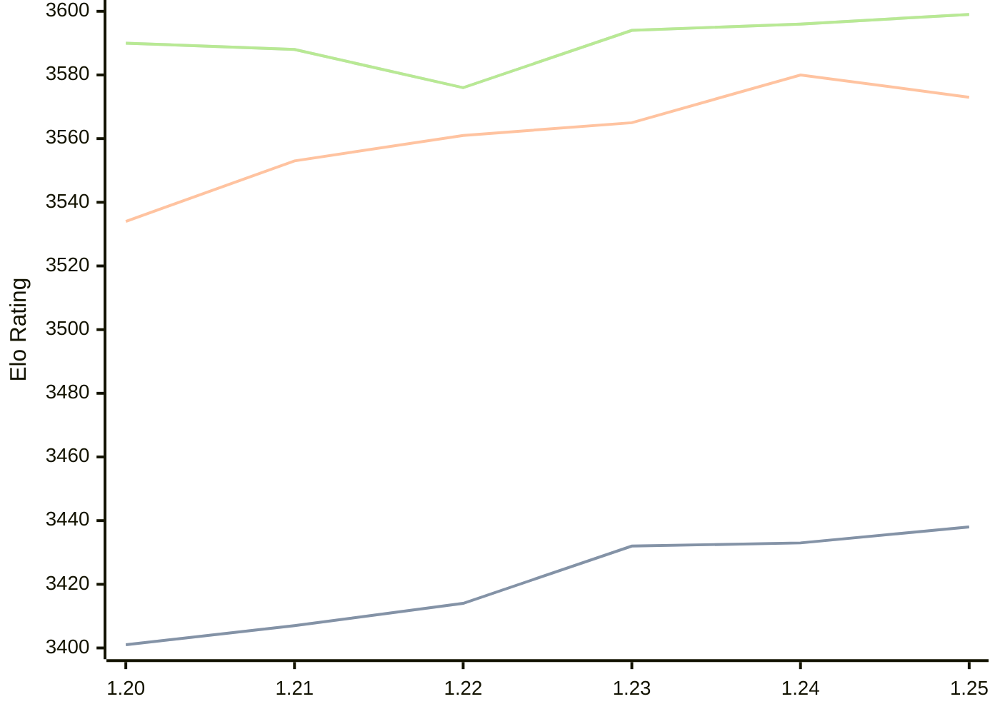

# Engine: Caissa

Author: Michał Witanowski

Home: https://github.com/Witek902/Caissa

## Elo Ratings

| Version | Published | STC 8.0+0.08s  | LTC 60.0+0.60s | VLTC 2m24s+1.12s | Comment |
| --- | --- | --- | --- | --- | --- |
| 1.25 | 2026-04-05 | 3438(+5) | 3573(-7) | 3599(+3) |  |
| 1.24 | 2025-12-03 | 3433(+1) | 3580(+15) | 3596(+2) |  |
| 1.23 | 2025-08-21 | 3432(+18) | 3565(+4) | 3594(+18) |  |
| 1.22 | 2025-04-30 | 3414(+7) | 3561(+8) | 3576(-12) |  |
| 1.21 | 2024-10-27 | 3407(+6) | 3553(+19) | 3588(-2) |  |
| 1.20 | 2024-07-28 | 3401(+new) | 3534(+new) | 3590(+new) |  |
| 1.19 | 2024-06-23 |  |  |  |  |
| 1.18 | 2024-04-02 |  |  |  |  |
| 1.17 | 2024-02-12 |  |  |  |  |
| 1.16 | 2024-01-11 |  |  |  |  |
| 1.15 | 2023-12-13 |  |  |  |  |
| 1.14 | 2023-11-12 |  |  |  |  |
| 1.13.1 | 2023-09-29 |  |  |  |  |
| 1.13 | 2023-09-28 |  |  |  |  |
| 1.12 | 2023-09-02 |  |  |  |  |
| 1.11 | 2023-07-23 |  |  |  |  |
| 1.10 | 2023-06-26 |  |  |  |  |
| 1.9 | 2023-06-08 |  |  |  |  |
| 1.8 | 2023-04-25 |  |  |  |  |
| 1.7 | 2023-03-14 |  |  |  |  |
| 1.6.3 | 2023-02-17 |  |  |  |  |
| 1.6 | 2023-02-07 |  |  |  |  |
| 1.5 | 2023-01-15 |  |  |  |  |
| 1.4 | 2022-11-30 |  |  |  |  |
| 1.3 | 2022-11-15 |  |  |  |  |
| 1.2 | 2022-10-23 |  |  |  |  |
| 1.1 | 2022-10-02 |  |  |  |  |
| 1.0 | 2022-09-18 |  |  |  |  |
| 0.9 | 2022-08-21 |  |  |  |  |
| 0.8 | 2022-07-29 |  |  |  |  |
| 0.7 | 2022-07-11 |  |  |  |  |
| 0.5 | 2022-03-16 |  |  |  |  |
| 0.4 | 2021-11-12 |  |  |  |  |
| 0.3 | 2021-11-03 |  |  |  |  |
| 0.2 | 2021-10-28 |  |  |  |  |
 | | | cElo (∆ prev) | cElo (∆ prev) | cElo (∆ prev) | 

<a href="https://github.com/computer-chess-index/cci/issues/new?template=submit-version.yml&title=[VERSION]+Caissa+<version>&body=###%20Engine%20name%0ACaissa%0A%0A###%20Version%0A1.25" target="_blank">Submit new version</a>

 Test Conditions:

GUI/CLI: <a href=https://github.com/cutechess/cutechess target="_blank">Cute-Chess</a> 
Elo Calculation: <a href=https://www.remi-coulom.fr/Bayesian-Elo/ target="_blank">Bayesian-Elo</a> 
CPU: Intel(R) Core(TM) i5-7500T 2.70GHz 
Opening book: 8_moves_v3 
\* STC: 8.0+0.08s, LTC: 60.0+0.60s, VLTC: 2m24s+1.12s

 Lists:
Ratings: <a href=https://github.com/computer-chess-index/cci/blob/main/lists/CCIRatings.csv target="_blank">Complete list</a>

Generated: 2026-05-03 07:35:47

## Ratings Verlauf

⬛ STC (8.0+0.08s) &nbsp;&nbsp; 🟧 LTC (60.0+0.60s) &nbsp;&nbsp; 🟩 VLTC (2m24s+1.12s)

dark mode: 🟩STC (8.0+0.08s) 🟧LTC (60.0+0.60s) ⬜VLTC (2m24s+1.12s)

## Detailed Evaluation Results

| Version | Time Control | Elo  | Range +/- | Matches | Score | Average Opponent Elo | Draws |
| --- | --- | --- | --- | --- | --- | --- | --- |
| 1.25 | VLTC (2m24s+1.12s) | 3599 | 29 | 270 | 49% | 3603 | 91% |
| 1.25 | D1 | 783 | 44 | 172 | 58% | 703 | 48% |
| 1.25 | D10 | 2963 | 39 | 184 | 50% | 2962 | 52% |
| 1.25 | D11 | 3113 | 36 | 208 | 50% | 3116 | 57% |
| 1.25 | D12 | 3193 | 32 | 250 | 48% | 3206 | 64% |
| 1.25 | D13 | 3240 | 33 | 242 | 49% | 3249 | 59% |
| 1.25 | D14 | 3308 | 37 | 188 | 50% | 3305 | 64% |
| 1.25 | D15 | 3352 | 38 | 174 | 50% | 3353 | 66% |
| 1.25 | D16 | 3384 | 35 | 192 | 50% | 3384 | 78% |
| 1.25 | D17 | 3403 | 36 | 182 | 51% | 3399 | 80% |
| 1.25 | D18 | 3483 | 34 | 208 | 51% | 3476 | 76% |
| 1.25 | D19 | 3494 | 34 | 200 | 51% | 3488 | 85% |
| 1.25 | D2 | 852 | 42 | 184 | 56% | 797 | 47% |
| 1.25 | D20 | 3486 | 37 | 176 | 50% | 3488 | 81% |
| 1.25 | D21 | 3528 | 35 | 190 | 50% | 3525 | 84% |
| 1.25 | D22 | 3561 | 37 | 174 | 50% | 3560 | 84% |
| 1.25 | D23 | 3573 | 36 | 178 | 51% | 3565 | 88% |
| 1.25 | D24 | 3569 | 54 | 76 | 48% | 3582 | 91% |
| 1.25 | D25 | 3560 | 63 | 56 | 50% | 3560 | 89% |
| 1.25 | D26 | 3600 | 62 | 58 | 49% | 3607 | 88% |
| 1.25 | D27 | 3592 | 63 | 56 | 49% | 3600 | 88% |
| 1.25 | D28 | 3610 | 83 | 32 | 52% | 3599 | 91% |
| 1.25 | D29 | 3605 | 59 | 62 | 52% | 3594 | 94% |
| 1.25 | D3 | 1170 | 40 | 200 | 48% | 1215 | 36% |
| 1.25 | D4 | 1505 | 40 | 212 | 50% | 1497 | 29% |
| 1.25 | D5 | 1899 | 40 | 216 | 51% | 1883 | 27% |
| 1.25 | D6 | 2192 | 39 | 232 | 47% | 2214 | 23% |
| 1.25 | D7 | 2453 | 38 | 236 | 51% | 2444 | 25% |
| 1.25 | D8 | 2707 | 38 | 220 | 48% | 2720 | 35% |
| 1.25 | D9 | 2826 | 37 | 226 | 52% | 2813 | 41% |
| 1.25 | S10 | 3468 | 37 | 172 | 49% | 3474 | 78% |
| 1.25 | S40 | 3564 | 38 | 160 | 50% | 3563 | 89% |
| 1.25 | LTC (60.0+0.60s) | 3573 | 28 | 298 | 50% | 3575 | 87% |
| 1.25 | STC (8.0+0.08s) | 3438 | 29 | 304 | 49% | 3443 | 72% |
| --- | --- | --- | --- | --- | --- | --- | --- |
| 1.24 | VLTC (2m24s+1.12s) | 3596 | 28 | 296 | 52% | 3586 | 91% |
| 1.24 | D1 | 722 | 40 | 232 | 58% | 629 | 47% |
| 1.24 | D10 | 2942 | 27 | 412 | 49% | 2948 | 44% |
| 1.24 | D11 | 3077 | 25 | 444 | 50% | 3077 | 58% |
| 1.24 | D12 | 3164 | 24 | 468 | 50% | 3164 | 59% |
| 1.24 | D13 | 3227 | 25 | 440 | 50% | 3228 | 62% |
| 1.24 | D14 | 3279 | 23 | 512 | 51% | 3272 | 63% |
| 1.24 | D15 | 3343 | 24 | 454 | 52% | 3329 | 68% |
| 1.24 | D16 | 3370 | 24 | 456 | 50% | 3367 | 69% |
| 1.24 | D17 | 3418 | 24 | 432 | 51% | 3413 | 75% |
| 1.24 | D18 | 3429 | 21 | 582 | 50% | 3429 | 74% |
| 1.24 | D19 | 3472 | 22 | 486 | 51% | 3467 | 82% |
| 1.24 | D2 | 991 | 32 | 308 | 50% | 988 | 40% |
| 1.24 | D20 | 3497 | 23 | 456 | 50% | 3497 | 81% |
| 1.24 | D21 | 3522 | 21 | 538 | 50% | 3524 | 83% |
| 1.24 | D22 | 3533 | 20 | 560 | 51% | 3524 | 86% |
| 1.24 | D23 | 3556 | 21 | 552 | 51% | 3551 | 84% |
| 1.24 | D24 | 3567 | 21 | 510 | 51% | 3561 | 85% |
| 1.24 | D25 | 3584 | 22 | 468 | 50% | 3587 | 88% |
| 1.24 | D26 | 3591 | 23 | 448 | 50% | 3595 | 88% |
| 1.24 | D27 | 3602 | 23 | 436 | 51% | 3596 | 88% |
| 1.24 | D28 | 3602 | 24 | 382 | 50% | 3600 | 89% |
| 1.24 | D29 | 3609 | 24 | 374 | 50% | 3607 | 92% |
| 1.24 | D3 | 1170 | 31 | 334 | 49% | 1179 | 36% |
| 1.24 | D4 | 1523 | 33 | 312 | 51% | 1509 | 24% |
| 1.24 | D5 | 1827 | 32 | 360 | 50% | 1827 | 19% |
| 1.24 | D6 | 2132 | 29 | 428 | 50% | 2114 | 24% |
| 1.24 | D7 | 2398 | 28 | 460 | 48% | 2412 | 25% |
| 1.24 | D8 | 2638 | 28 | 404 | 47% | 2669 | 34% |
| 1.24 | D9 | 2835 | 26 | 462 | 48% | 2853 | 42% |
| 1.24 | S10 | 3456 | 25 | 408 | 50% | 3457 | 74% |
| 1.24 | S40 | 3553 | 26 | 336 | 50% | 3552 | 85% |
| 1.24 | LTC (60.0+0.60s) | 3580 | 29 | 272 | 50% | 3578 | 92% |
| 1.24 | STC (8.0+0.08s) | 3433 | 21 | 534 | 50% | 3432 | 75% |
| --- | --- | --- | --- | --- | --- | --- | --- |
| 1.23 | VLTC (2m24s+1.12s) | 3594 | 28 | 288 | 51% | 3588 | 91% |
| 1.23 | D1 | 844 | 33 | 320 | 56% | 768 | 41% |
| 1.23 | D10 | 2927 | 28 | 356 | 47% | 2952 | 50% |
| 1.23 | D11 | 3070 | 28 | 344 | 48% | 3087 | 55% |
| 1.23 | D12 | 3137 | 27 | 372 | 51% | 3129 | 60% |
| 1.23 | D13 | 3229 | 25 | 422 | 47% | 3255 | 61% |
| 1.23 | D14 | 3281 | 27 | 344 | 48% | 3294 | 67% |
| 1.23 | D15 | 3317 | 26 | 380 | 49% | 3325 | 66% |
| 1.23 | D16 | 3380 | 27 | 332 | 48% | 3393 | 76% |
| 1.23 | D17 | 3393 | 26 | 356 | 51% | 3389 | 76% |
| 1.23 | D18 | 3455 | 27 | 328 | 49% | 3460 | 80% |
| 1.23 | D19 | 3467 | 27 | 324 | 50% | 3470 | 79% |
| 1.23 | D2 | 975 | 31 | 316 | 50% | 977 | 40% |
| 1.23 | D20 | 3499 | 24 | 408 | 48% | 3511 | 80% |
| 1.23 | D21 | 3506 | 27 | 332 | 51% | 3502 | 78% |
| 1.23 | D22 | 3529 | 26 | 348 | 48% | 3540 | 84% |
| 1.23 | D23 | 3534 | 27 | 328 | 51% | 3524 | 81% |
| 1.23 | D24 | 3559 | 27 | 308 | 49% | 3564 | 87% |
| 1.23 | D25 | 3578 | 29 | 284 | 49% | 3583 | 85% |
| 1.23 | D26 | 3580 | 28 | 292 | 50% | 3578 | 86% |
| 1.23 | D27 | 3576 | 28 | 288 | 51% | 3572 | 88% |
| 1.23 | D28 | 3603 | 31 | 236 | 50% | 3606 | 88% |
| 1.23 | D29 | 3590 | 28 | 300 | 50% | 3588 | 88% |
| 1.23 | D3 | 1152 | 30 | 360 | 51% | 1146 | 35% |
| 1.23 | D4 | 1504 | 34 | 304 | 50% | 1508 | 24% |
| 1.23 | D5 | 1850 | 30 | 380 | 51% | 1841 | 24% |
| 1.23 | D6 | 2163 | 30 | 396 | 47% | 2199 | 26% |
| 1.23 | D7 | 2354 | 33 | 312 | 50% | 2352 | 25% |
| 1.23 | D8 | 2604 | 30 | 368 | 52% | 2589 | 33% |
| 1.23 | D9 | 2824 | 30 | 340 | 51% | 2817 | 42% |
| 1.23 | S10 | 3456 | 27 | 328 | 50% | 3456 | 80% |
| 1.23 | S40 | 3549 | 28 | 308 | 51% | 3541 | 81% |
| 1.23 | LTC (60.0+0.60s) | 3565 | 29 | 280 | 51% | 3563 | 87% |
| 1.23 | STC (8.0+0.08s) | 3432 | 23 | 468 | 48% | 3444 | 73% |
| --- | --- | --- | --- | --- | --- | --- | --- |
| 1.22 | VLTC (2m24s+1.12s) | 3576 | 24 | 388 | 50% | 3576 | 85% |
| 1.22 | D1 | 825 | 37 | 268 | 52% | 784 | 37% |
| 1.22 | D10 | 2877 | 28 | 376 | 49% | 2880 | 46% |
| 1.22 | D11 | 3012 | 27 | 392 | 52% | 3001 | 52% |
| 1.22 | D12 | 3124 | 26 | 394 | 50% | 3124 | 60% |
| 1.22 | D13 | 3166 | 26 | 388 | 49% | 3177 | 62% |
| 1.22 | D14 | 3279 | 25 | 396 | 49% | 3286 | 69% |
| 1.22 | D15 | 3341 | 26 | 376 | 50% | 3340 | 69% |
| 1.22 | D16 | 3380 | 25 | 392 | 50% | 3379 | 71% |
| 1.22 | D17 | 3390 | 25 | 392 | 50% | 3391 | 75% |
| 1.22 | D18 | 3429 | 25 | 396 | 50% | 3428 | 76% |
| 1.22 | D19 | 3455 | 25 | 384 | 49% | 3460 | 78% |
| 1.22 | D2 | 967 | 30 | 368 | 56% | 894 | 40% |
| 1.22 | D20 | 3492 | 25 | 392 | 50% | 3490 | 82% |
| 1.22 | D21 | 3509 | 25 | 380 | 51% | 3505 | 78% |
| 1.22 | D22 | 3538 | 25 | 376 | 50% | 3537 | 84% |
| 1.22 | D23 | 3533 | 25 | 380 | 51% | 3530 | 85% |
| 1.22 | D24 | 3565 | 25 | 372 | 49% | 3569 | 88% |
| 1.22 | D25 | 3573 | 25 | 376 | 50% | 3576 | 89% |
| 1.22 | D26 | 3580 | 25 | 356 | 50% | 3582 | 88% |
| 1.22 | D27 | 3599 | 29 | 268 | 51% | 3592 | 86% |
| 1.22 | D28 | 3602 | 28 | 284 | 52% | 3591 | 87% |
| 1.22 | D29 | 3619 | 34 | 196 | 53% | 3600 | 88% |
| 1.22 | D3 | 1176 | 29 | 404 | 49% | 1184 | 33% |
| 1.22 | D4 | 1478 | 32 | 368 | 49% | 1490 | 16% |
| 1.22 | D5 | 1837 | 31 | 380 | 53% | 1802 | 21% |
| 1.22 | D6 | 2082 | 31 | 380 | 49% | 2087 | 23% |
| 1.22 | D7 | 2348 | 31 | 368 | 51% | 2341 | 23% |
| 1.22 | D8 | 2542 | 30 | 364 | 51% | 2535 | 37% |
| 1.22 | D9 | 2757 | 28 | 400 | 49% | 2765 | 38% |
| 1.22 | S10 | 3426 | 23 | 456 | 52% | 3411 | 76% |
| 1.22 | S40 | 3541 | 26 | 352 | 50% | 3537 | 86% |
| 1.22 | LTC (60.0+0.60s) | 3561 | 25 | 356 | 49% | 3565 | 87% |
| 1.22 | STC (8.0+0.08s) | 3414 | 25 | 380 | 50% | 3413 | 76% |
| --- | --- | --- | --- | --- | --- | --- | --- |
| 1.21 | VLTC (2m24s+1.12s) | 3588 | 18 | 724 | 51% | 3582 | 92% |
| 1.21 | D1 | 894 | 20 | 908 | 52% | 863 | 39% |
| 1.21 | D10 | 2894 | 18 | 928 | 50% | 2893 | 48% |
| 1.21 | D11 | 3024 | 17 | 944 | 50% | 3027 | 52% |
| 1.21 | D12 | 3124 | 17 | 976 | 50% | 3123 | 55% |
| 1.21 | D13 | 3216 | 16 | 1024 | 50% | 3217 | 63% |
| 1.21 | D14 | 3274 | 16 | 984 | 50% | 3272 | 64% |
| 1.21 | D15 | 3330 | 16 | 1044 | 50% | 3330 | 66% |
| 1.21 | D16 | 3375 | 15 | 1068 | 52% | 3360 | 72% |
| 1.21 | D17 | 3410 | 15 | 1040 | 50% | 3411 | 77% |
| 1.21 | D18 | 3445 | 15 | 1052 | 51% | 3441 | 76% |
| 1.21 | D19 | 3474 | 15 | 1068 | 50% | 3472 | 80% |
| 1.21 | D2 | 965 | 19 | 940 | 52% | 938 | 44% |
| 1.21 | D20 | 3490 | 15 | 1004 | 50% | 3490 | 82% |
| 1.21 | D21 | 3513 | 15 | 1028 | 50% | 3513 | 82% |
| 1.21 | D22 | 3540 | 15 | 1012 | 50% | 3537 | 84% |
| 1.21 | D23 | 3549 | 15 | 1012 | 51% | 3545 | 84% |
| 1.21 | D24 | 3564 | 17 | 844 | 50% | 3567 | 87% |
| 1.21 | D25 | 3572 | 16 | 901 | 51% | 3565 | 88% |
| 1.21 | D26 | 3590 | 19 | 652 | 51% | 3586 | 90% |
| 1.21 | D27 | 3590 | 18 | 692 | 51% | 3582 | 90% |
| 1.21 | D28 | 3588 | 18 | 672 | 51% | 3583 | 90% |
| 1.21 | D29 | 3607 | 20 | 568 | 53% | 3587 | 88% |
| 1.21 | D3 | 1165 | 18 | 1056 | 48% | 1189 | 35% |
| 1.21 | D4 | 1492 | 19 | 984 | 51% | 1480 | 21% |
| 1.21 | D5 | 1837 | 20 | 960 | 50% | 1837 | 20% |
| 1.21 | D6 | 2114 | 19 | 996 | 48% | 2138 | 23% |
| 1.21 | D7 | 2417 | 19 | 908 | 49% | 2430 | 29% |
| 1.21 | D8 | 2595 | 18 | 948 | 51% | 2588 | 36% |
| 1.21 | D9 | 2763 | 18 | 924 | 51% | 2757 | 37% |
| 1.21 | S10 | 3433 | 15 | 1120 | 52% | 3422 | 74% |
| 1.21 | S40 | 3536 | 15 | 1076 | 50% | 3534 | 85% |
| 1.21 | LTC (60.0+0.60s) | 3553 | 15 | 1096 | 51% | 3534 | 86% |
| 1.21 | STC (8.0+0.08s) | 3407 | 15 | 1136 | 50% | 3409 | 74% |
| --- | --- | --- | --- | --- | --- | --- | --- |
| 1.20 | VLTC (2m24s+1.12s) | 3590 | 36 | 176 | 51% | 3584 | 84% |
| 1.20 | D1 | 884 | 18 | 940 | 47% | 910 | 51% |
| 1.20 | D10 | 2847 | 18 | 904 | 50% | 2846 | 47% |
| 1.20 | D11 | 2969 | 15 | 1220 | 46% | 3002 | 54% |
| 1.20 | D12 | 3067 | 16 | 1128 | 49% | 3075 | 57% |
| 1.20 | D13 | 3156 | 17 | 904 | 51% | 3147 | 63% |
| 1.20 | D14 | 3221 | 17 | 936 | 48% | 3235 | 68% |
| 1.20 | D15 | 3286 | 15 | 1176 | 51% | 3279 | 69% |
| 1.20 | D16 | 3336 | 15 | 1180 | 51% | 3294 | 71% |
| 1.20 | D17 | 3368 | 16 | 940 | 50% | 3366 | 74% |
| 1.20 | D18 | 3399 | 16 | 940 | 50% | 3399 | 80% |
| 1.20 | D19 | 3441 | 16 | 966 | 50% | 3441 | 79% |
| 1.20 | D2 | 961 | 16 | 1100 | 49% | 972 | 48% |
| 1.20 | D20 | 3463 | 17 | 852 | 50% | 3460 | 79% |
| 1.20 | D21 | 3479 | 17 | 838 | 51% | 3472 | 81% |
| 1.20 | D22 | 3510 | 19 | 679 | 50% | 3507 | 85% |
| 1.20 | D23 | 3515 | 18 | 736 | 51% | 3505 | 86% |
| 1.20 | D24 | 3538 | 18 | 692 | 50% | 3536 | 84% |
| 1.20 | D25 | 3545 | 19 | 628 | 50% | 3541 | 85% |
| 1.20 | D26 | 3552 | 19 | 620 | 51% | 3542 | 87% |
| 1.20 | D27 | 3571 | 18 | 712 | 51% | 3567 | 87% |
| 1.20 | D28 | 3573 | 20 | 576 | 50% | 3571 | 87% |
| 1.20 | D29 | 3590 | 23 | 432 | 51% | 3580 | 90% |
| 1.20 | D3 | 1165 | 18 | 1000 | 51% | 1154 | 34% |
| 1.20 | D4 | 1485 | 17 | 1308 | 50% | 1489 | 19% |
| 1.20 | D5 | 1705 | 20 | 948 | 48% | 1727 | 19% |
| 1.20 | D6 | 2051 | 19 | 968 | 51% | 2043 | 21% |
| 1.20 | D7 | 2329 | 20 | 852 | 49% | 2337 | 29% |
| 1.20 | D8 | 2549 | 18 | 984 | 53% | 2522 | 32% |
| 1.20 | D9 | 2722 | 17 | 1008 | 50% | 2718 | 43% |
| 1.20 | S10 | 3417 | 32 | 252 | 49% | 3426 | 68% |
| 1.20 | S40 | 3515 | 34 | 208 | 50% | 3518 | 80% |
| 1.20 | LTC (60.0+0.60s) | 3534 | 37 | 168 | 50% | 3502 | 89% |
| 1.20 | STC (8.0+0.08s) | 3401 | 30 | 267 | 48% | 3413 | 75% |
| --- | --- | --- | --- | --- | --- | --- | --- |
| 1.19 |  |  |  |  |  |  |  |
| 1.18 |  |  |  |  |  |  |  |
| 1.17 |  |  |  |  |  |  |  |
| 1.16 |  |  |  |  |  |  |  |
| 1.15 |  |  |  |  |  |  |  |
| 1.14 |  |  |  |  |  |  |  |
| 1.13.1 |  |  |  |  |  |  |  |
| 1.13 |  |  |  |  |  |  |  |
| 1.12 |  |  |  |  |  |  |  |
| 1.11 |  |  |  |  |  |  |  |
| 1.10 |  |  |  |  |  |  |  |
| 1.9 |  |  |  |  |  |  |  |
| 1.8 |  |  |  |  |  |  |  |
| 1.7 |  |  |  |  |  |  |  |
| 1.6.3 |  |  |  |  |  |  |  |
| 1.6 |  |  |  |  |  |  |  |
| 1.5 |  |  |  |  |  |  |  |
| 1.4 |  |  |  |  |  |  |  |
| 1.3 |  |  |  |  |  |  |  |
| 1.2 |  |  |  |  |  |  |  |
| 1.1 |  |  |  |  |  |  |  |
| 1.0 |  |  |  |  |  |  |  |
| 0.9 |  |  |  |  |  |  |  |
| 0.8 |  |  |  |  |  |  |  |
| 0.7 |  |  |  |  |  |  |  |
| 0.5 |  |  |  |  |  |  |  |
| 0.4 |  |  |  |  |  |  |  |
| 0.3 |  |  |  |  |  |  |  |
| 0.2 |  |  |  |  |  |  |  |