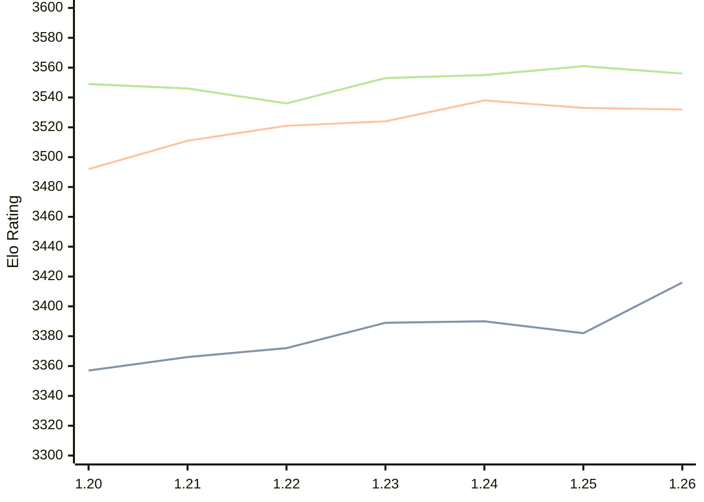

# Engine: Caissa

Author: Michał Witanowski

Home: https://github.com/Witek902/Caissa

## Elo Ratings

| Version | Published | STC 8.0+0.08s  | LTC 60.0+0.60s | VLTC 2m24s+1.12s | Comment |
| --- | --- | --- | --- | --- | --- |
| 1.26 | 2026-08-09 | 3416(+34) | 3532(-1) | 3556(-5) |  |
| 1.25 | 2026-04-05 | 3382(-8) | 3533(-5) | 3561(+6) |  |
| 1.24 | 2025-12-03 | 3390(+1) | 3538(+14) | 3555(+2) |  |
| 1.23 | 2025-08-21 | 3389(+17) | 3524(+3) | 3553(+17) |  |
| 1.22 | 2025-04-30 | 3372(+6) | 3521(+10) | 3536(-10) |  |
| 1.21 | 2024-10-27 | 3366(+9) | 3511(+19) | 3546(-3) |  |
| 1.20 | 2024-07-28 | 3357 | 3492 | 3549 |  |
 | | | cElo (∆ prev) | cElo (∆ prev) | cElo (∆ prev) | 

<a href="https://github.com/computer-chess-index/cci/issues/new?template=submit-version.yml&title=[VERSION]+Caissa+<version>&body=###%20Engine%20name%0ACaissa%0A%0A###%20Version%0A1.26" target="_blank">Submit new version</a>

 Test Conditions:

GUI/CLI: <a href=https://github.com/cutechess/cutechess target="_blank">Cute-Chess</a> 
Elo Calculation: <a href=https://www.remi-coulom.fr/Bayesian-Elo/ target="_blank">Bayesian-Elo</a> 
CPU: Intel(R) Core(TM) i5-7500T 2.70GHz 
Opening book: 8_moves_v3 
\* STC: 8.0+0.08s, LTC: 60.0+0.60s, VLTC: 2m24s+1.12s

 Lists:
Ratings: <a href=https://github.com/computer-chess-index/cci/blob/main/lists/CCIRatings.csv target="_blank">Complete list</a>

Generated: 2026-09-01 18:58:47

## Ratings Verlauf

## Detailed Evaluation Results

| Version | Time Control | Elo  | Range +/- | Matches | Score | Average Opponent Elo | Draws |
| --- | --- | --- | --- | --- | --- | --- | --- |
| 1.26 | VLTC (2m24s+1.12s) | 3556 | 33 | 210 | 50% | 3556 | 85% |
| 1.26 | LTC (60.0+0.60s) | 3532 | 29 | 284 | 50% | 3529 | 85% |
| 1.26 | STC (8.0+0.08s) | 3416 | 30 | 266 | 51% | 3411 | 75% |
| --- | --- | --- | --- | --- | --- | --- | --- |
| 1.25 | VLTC (2m24s+1.12s) | 3561 | 23 | 420 | 50% | 3559 | 91% |
| 1.25 | LTC (60.0+0.60s) | 3533 | 23 | 440 | 50% | 3533 | 86% |
| 1.25 | STC (8.0+0.08s) | 3382 | 23 | 460 | 48% | 3394 | 73% |
| --- | --- | --- | --- | --- | --- | --- | --- |
| 1.24 | VLTC (2m24s+1.12s) | 3555 | 28 | 296 | 52% | 3544 | 91% |
| 1.24 | LTC (60.0+0.60s) | 3538 | 29 | 272 | 50% | 3537 | 92% |
| 1.24 | STC (8.0+0.08s) | 3390 | 21 | 534 | 50% | 3390 | 75% |
| --- | --- | --- | --- | --- | --- | --- | --- |
| 1.23 | VLTC (2m24s+1.12s) | 3553 | 28 | 288 | 51% | 3548 | 91% |
| 1.23 | LTC (60.0+0.60s) | 3524 | 29 | 280 | 51% | 3521 | 87% |
| 1.23 | STC (8.0+0.08s) | 3389 | 23 | 468 | 48% | 3402 | 73% |
| --- | --- | --- | --- | --- | --- | --- | --- |
| 1.22 | VLTC (2m24s+1.12s) | 3536 | 24 | 388 | 50% | 3536 | 85% |
| 1.22 | LTC (60.0+0.60s) | 3521 | 25 | 356 | 49% | 3525 | 87% |
| 1.22 | STC (8.0+0.08s) | 3372 | 25 | 380 | 50% | 3371 | 76% |
| --- | --- | --- | --- | --- | --- | --- | --- |
| 1.21 | VLTC (2m24s+1.12s) | 3546 | 18 | 724 | 51% | 3540 | 92% |
| 1.21 | LTC (60.0+0.60s) | 3511 | 15 | 1096 | 51% | 3494 | 86% |
| 1.21 | STC (8.0+0.08s) | 3366 | 15 | 1136 | 50% | 3366 | 74% |
| --- | --- | --- | --- | --- | --- | --- | --- |
| 1.20 | VLTC (2m24s+1.12s) | 3549 | 36 | 176 | 51% | 3542 | 84% |
| 1.20 | LTC (60.0+0.60s) | 3492 | 37 | 168 | 50% | 3460 | 89% |
| 1.20 | STC (8.0+0.08s) | 3357 | 30 | 267 | 48% | 3371 | 75% |
| --- | --- | --- | --- | --- | --- | --- | --- |